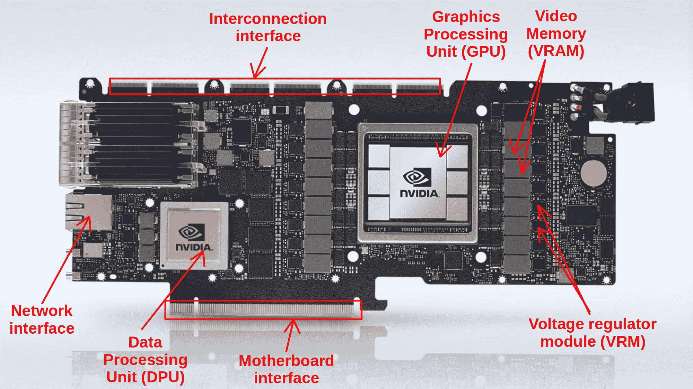
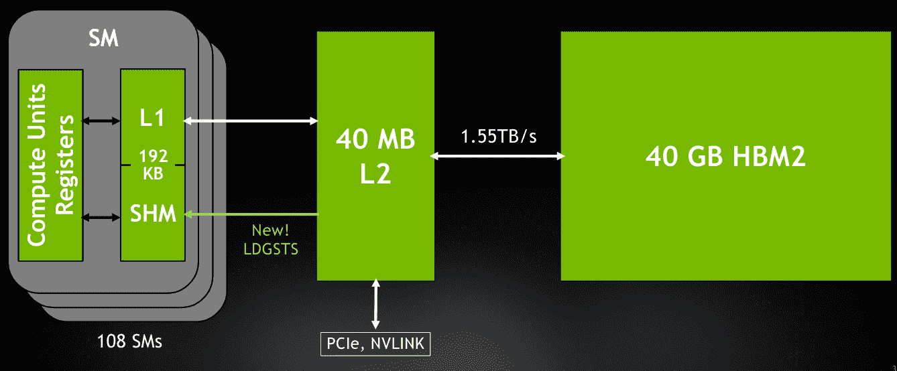
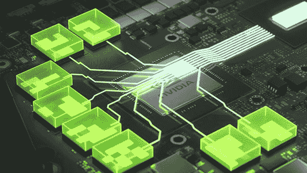
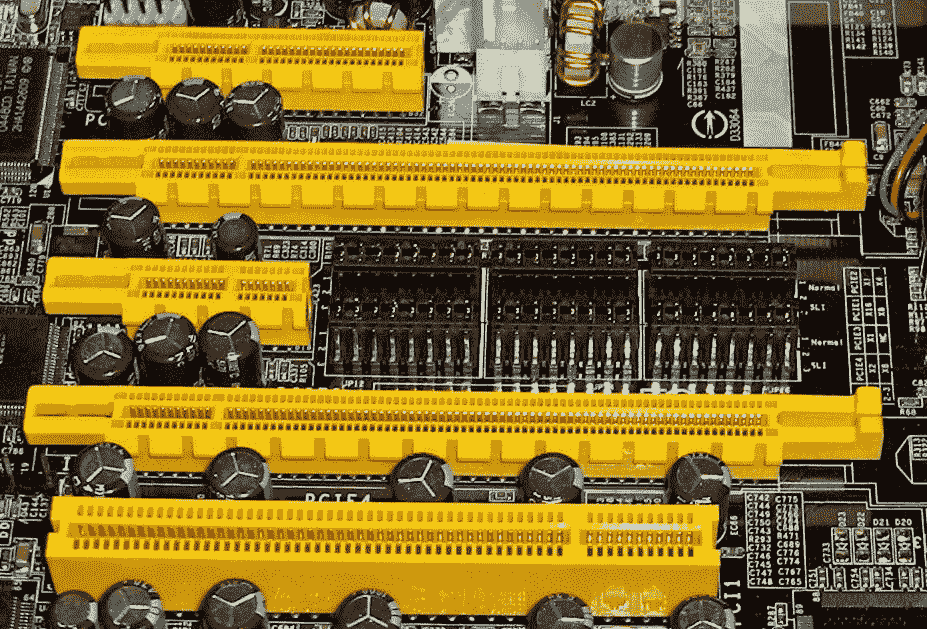
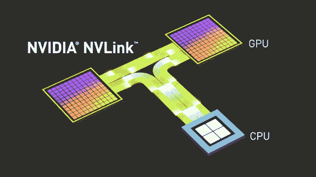
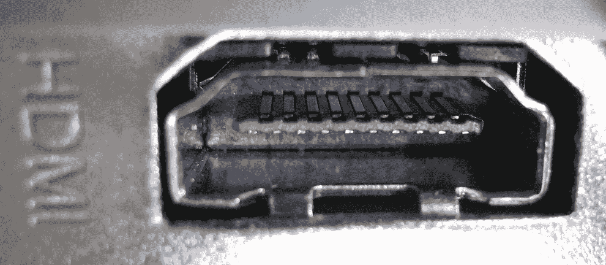
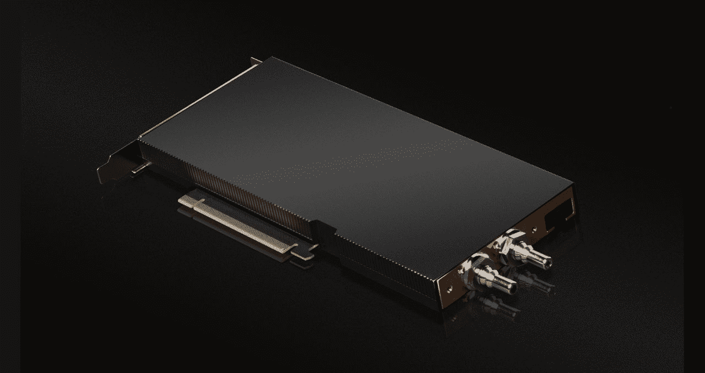

# 显卡的全面剖析:NVIDIA A100 案例研究

> 原文：<https://blog.paperspace.com/a-complete-anatomy-of-a-graphics-card-case-study-of-the-nvidia-a100/>

在本文中，我们将对显卡背后的技术、它们的组件、架构以及它们与机器学习的关系进行技术检验。

图形卡的任务非常复杂，但是它的概念和组件很容易理解。我们将看看视频卡的基本组件以及它们的功能。在每个阶段，我们将使用 NVIDIA A100 - 40 GB 作为显卡当前技术水平的示例。A100 可以说是市场上可用于深度学习的最佳单个 GPU。

# 显卡故障

图形卡，通常称为视频卡、图形适配器、显示卡或显示适配器，是一种处理数据并产生图形输出的扩展卡。因此，它通常用于视频编辑、游戏和 3D 渲染。然而，近年来，它已经成为机器学习应用程序和加密货币挖掘的首选。显卡在以下组件的帮助下完成这些高要求的任务:

*   图形处理单元
*   数据处理股(DPU)
*   视频存储器(VRAM)
*   视频 BIOS (VBIOS)
*   电压调节器模块
*   主板接口
*   互连接口
*   网络接口和控制器
*   输出接口
*   冷却系统

NVidia A100 hardware breakdown ([source](https://www.nvidia.com/en-in/data-center/products/converged-accelerator/))

## 图形处理单元

经常被误认为是显卡本身。与计算机的 CPU 不同，GPU 旨在处理图形渲染所需的更复杂的数学和几何计算。平均而言，与普通 CPU 相比，GPU 拥有更多晶体管和更高密度的计算核心，以及更多算术逻辑单元(ALU)。

这些装置有四种分类:

*   流式多处理器(SMs)
*   加载/存储(LD/ST)单位
*   特殊功能单位(SFU)
*   纹理映射单元(TMU)

1)****流式多处理器** (SM)是一种执行实体，由一组共享寄存器空间、共享内存和 L1 缓存的内核组成。SM 中的一个内核可以同时执行多个线程。谈到 SM 的核心，有两个主要竞争对手:**

*   **通过 *NVIDIA* 计算统一设备架构(CUDA)或张量内核**
*   **按*和*划分的流处理器**

**一般来说，NVIDIA 的 CUDA 内核和 Tensor 内核被认为更加稳定和优化，特别是对于机器学习应用程序。CUDA 内核已经出现在过去十年中发布的每一款 Nvidia GPU 上，但张量内核是一个较新的补充。张量核在计算上比 CUDA 核快得多。实际上，CUDA 内核每个时钟周期只能做一次运算，而张量内核每个周期可以做多次运算。就准确性和处理速度而言，CUDA 核心对于机器学习模型来说不如张量核心强大，但对于某些应用来说绰绰有余。因此，这些是训练机器学习模型的最佳选择。**

**

NVIDIA A100 Streaming Multiprocessor’s core architecture ([Source](https://developer.nvidia.com/blog/nvidia-ampere-architecture-in-depth/))** 

**这些内核的性能以 FLOPS 为单位(每秒浮点运算次数)来衡量。对于这些测量，NVIDIA A100 获得了破纪录的数值:**

| **核心** | **规格** |
| --- | --- |
| FP64 | 9.7 万亿次浮点运算 |
| FP64 张量核心 | 19.5 万亿次浮点运算 |
| FP32 | 19.5 万亿次浮点运算 |
| FP32 张量核心 | 156 万亿次浮点运算 |
| BFLOAT16 张量核 | 312 万亿次浮点运算 |
| FP16 张量核心 | 312 万亿次浮点运算 |
| INT8 张量核 | 624 万亿次浮点运算 |

 **根据 [NVIDIA 文档](https://www.nvidia.com/content/dam/en-zz/Solutions/Data-Center/a100/pdf/nvidia-a100-datasheet-us-nvidia-1758950-r4-web.pdf)，使用稀疏格式进行数据表示甚至可以帮助这些值翻倍。

在 A100 内部，高速缓存管理以一种特殊的方式完成，以使内核和 VRAM 之间的数据传输尽可能地快速和流畅。为此，A100 GPU 有三级高速缓存 L0、L1 和 L2:

L0 指令高速缓存专用于单个流式多处理器子处理块，L1 指令高速缓存专用于 SM，而 L2 高速缓存是统一的，在所有 SM 之间共享，并为指令和数据保留。A100 中的 L2 缓存比所有以前的 GPU 缓存都大，大小为 40MB，它充当 L1 专用缓存和 40GB HBM2 VRAM 之间的桥梁，我们将在本文后面详细介绍。

Cache hierarchy inside the NVIDIA A100 (40GB VRAM version) ([Source](https://developer.download.nvidia.com/video/gputechconf/gtc/2020/presentations/s21819-optimizing-applications-for-nvidia-ampere-gpu-architecture.pdf))

2) **加载/存储(LD/ST)** 单元允许线程在每个时钟周期执行多次数据加载和存储到内存的操作。在 A100 中，这些单元引入了一种新的异步数据复制方法，这使得加载可以在线程之间全局共享的数据而不消耗额外的线程资源成为可能。这种新引入的方法使共享内存和本地缓存之间的数据加载时间增加了大约 20%。

3) **特殊功能单元**(sfu)高效地对矢量化数据执行结构化算术或数学功能，例如正弦、余弦、倒数和平方根。

4) **纹理映射单元** (TMU)处理特定应用的任务，例如图像旋转、调整大小、添加失真和噪声以及移动 3D 平面对象。

## 数据处理股(DPU)

DPU 是显卡的非标准组件。数据处理单元是一种新推出的可编程处理器，它与 CPU 和 GPU 一起作为计算的三个主要组件。因此，DPU 是一个独立的处理器，通常在 ML 和数据中心实施。它提供了一套可管理的加速软件功能:网络、存储和安全性。A100 显卡板载了最新的 BlueField-2 DPU，在处理大规模多输入多输出(MIMO)工作负载、AI-on-5G 部署以及信号处理或多节点训练等更专业的工作负载时，可以提供巨大的优势。

NVIDIA A100 BlueField-2 Data Processing Unit architecture ([Source](https://www.nvidia.com/en-in/networking/products/data-processing-unit/))

## 视频存储器(VRAM)

从最广泛的定义来看，视频随机存取存储器(VRAM)类似于系统 RAM。VRAM 是一种由 GPU 使用的缓存，用于保存图形或其他应用程序所需的大量数据。所有保存在 VRAM 中的数据都是暂时的。传统的 VRAM 通常比系统 RAM 快得多。更重要的是，它在物理上靠近 GPU。它直接焊接到显卡的 PCB 上。这使得数据传输速度极快，延迟最小，允许高分辨率图形渲染或深度学习模型训练。

NVIDIA GeForce RTX 3050 VRAM Positionning ([Source](https://www.nvidia.com/fr-fr/geforce/graphics-cards/30-series/rtx-3050/))

在当前的显卡上，VRAM 有各种大小、速度和总线宽度。目前，实现了多种技术；GDDR 和 HMB 有各自的变体。十多年来，GDDR (SGRAM 双倍数据速率)一直是行业标准。它实现了高时钟速度，但代价是物理空间和高于平均水平的功耗。另一方面，HBM(高带宽存储器)是 VRAM 技术的最新发展水平。它功耗更低，并且能够堆叠以增加内存大小，同时占用显卡的空间更少。它还允许更高的带宽和更低的时钟速度。NVIDIA A100 支持最新一代的 HBM 内存，HBM2e 的大小为 80GB，带宽高达 1935 GB/s，与上一版本 Tesla V100 相比增加了 73%。

## 电压调节器模块

它确保 GPU 在恒定的电压下接收必要的功率。一个低质量的 VRM 可能会产生一系列问题，包括 GPU 在压力下关闭，超频性能有限，甚至缩短 GPU 的寿命。图形卡从现代电源装置(PSU)接收 12 伏电压。另一方面，GPU 对电压敏感，无法维持该值。这就是 VRM 发挥作用的地方。它将 12 伏电源降至 1.1 伏，然后将其发送到 GPU 核心和内存。A100 及其所有 VRM 的功率级可以维持高达 300 瓦的功率输出。

A100 使用 8 针电源连接器从电源单元接收电力，然后将电流转发给 VRMs，VRMs 以 1.1 VDC 电流的形式向 GPU 和 DPU 供电，额定最大强制限制为 300 W，理论限制为 400 W

## 主板接口

这是插入系统主板的图形卡的子组件。正是通过这个接口，或“插槽”，图形卡和计算机交换数据和控制命令。在 21 世纪初，不同的制造商实现了许多类型的接口:PCI、PCIe、PCI-X 或 AGP。但是，现在 PCIe 已经成为几乎所有显卡制造商的首选接口。

PCIe 或 PCI Express 是外围组件互连 Express 的简称，是用于连接显卡、硬盘驱动器、主机适配器、固态硬盘、无线网络和其他以太网硬件连接的最常见的标准化主板接口。

PCI Express slot on a mother board (from up to down: x4, x16, x1 and x16), PCI 32bit on the bottom ([source](https://fr.wikipedia.org/wiki/PCI_Express#/media/Fichier:PCIExpress.jpg))

PCIe 标准经历了不同的发展阶段，每一代标准的速度和带宽都有大幅提升:

|  | **带宽** | **Gigatransfer** | **频率** |
| --- | --- | --- | --- |
| PCIe 1.0 | 8gb/秒 | 2.5 燃气轮机/秒 | 2.5 千兆赫 |
| PCIe 2.0 | 16 GB/秒 | 5 燃气轮机/秒 | 5 千兆赫 |
| PCIe 3.0 | 32gb/秒 | 8 燃气轮机/秒 | 8 千兆赫 |
| PCIe 4.0 | 64gb/秒 | 16 燃气轮机/秒 | 16 千兆赫 |

PCIe 插槽可以在不同的物理配置中实现:x1、x4、x8、x16、x32。该数字表示插槽中实现了多少个通道。我们拥有的通道越多，我们可以在显卡和主板之间传输的带宽就越高。NVidia A100 配备了 PCIe 4.0 x16 接口，这是市面上性能最高的一代接口。

## 互连接口

互连接口是一种总线，它为系统构建者提供了连接安装在单个主板上的多个图形卡的可能性，从而允许通过多个卡扩展处理能力。这种多卡扩展可以通过主板上的 PCIe 总线或作为数据桥的专用互连接口来实现。AMD 和 NVIDIA 都展示了自己的显卡，采用了专有的扩展方法，AMD 采用了 CrossFireX 技术，NVIDIA 采用了 SLI 技术。随着 NVLink 的引入，SLI 在图灵一代被弃用，NV link 被认为是多卡扩展技术的顶级产品。

NVLink data flow representation ([Source](https://blogs.nvidia.com/blog/2014/11/14/what-is-nvlink/))

NVIDIA A100 使用第三代 NVLink，可以在两个 GPU 之间提供高达 600 GB/s 的速度。此外，与 PCI Express 相比，它代表了一种在 GPU 之间传递数据更节能的方式。

## 网络接口

网络接口不是显卡的标准组件。它仅适用于需要将数据直接传输到 DPU 和 GPU 的高性能卡。在 A100 的情况下，网络接口由 2 个 100Gbps 以太网端口组成，允许更快的处理，特别是对于涉及基于人工智能的网络的应用。

## 输出接口

输出接口是构建在图形卡上的端口，使其能够连接到显示器。可以实现多种连接类型。

A female HDMI connector ([Source](https://commons.wikimedia.org/wiki/High-Definition_Multimedia_Interface#/media/File:HDMI_connector-female_PNr%C2%B00057.jpg))

对于旧系统，使用 VGA 和 DVI，而最近制造商倾向于使用 HDMI 和显示端口，而一些便携式系统将 USB Type-C 作为主要端口。

|  | **HDMI** | **显示端口** | **DVI** | **VGA** |
| --- | --- | --- | --- | --- |
| 数字或模拟 | 数字的 | 数字的 | 数字的 | 数字的 |
| 速度 | 340 兆赫 | 165 兆赫 | 165 兆赫 | 28 兆赫 |
| 音频支持 | 是 | 是 | 是 | 不 |
| 最大分辨率 | 7680 x 4320 像素(8K) | 7680 x 4320 像素(8K) | 3840 x 2400 像素 | 1920 x 1080 像素 |

至于本文中我们显微镜下的显卡，A100 没有输出接口。因为它从一开始就被设计为 ML/DL 的专业卡，并在数据中心使用，所以它没有理由有显示连接。

## 视频 BIOS (VBIOS)

视频 BIOS，通常称为 VBIOS，是显卡的基本输入输出系统(BIOS)。与系统 BIOS 一样，视频 BIOS 提供了一组与视频相关的信息，程序可以使用这些信息来访问图形卡，并维护供应商特定的设置，如卡名、时钟频率、VRAM 类型、电压和风扇速度控制参数。

## 冷却系统

散热通常不被视为显卡组件列表的一部分。但是，由于它的重要性，在这次技术深度潜水中不能忽视它。

由于显卡所消耗的能量，会产生大量的热能。此外，为了保持卡活动期间的性能并保持长期可用性，核心温度值应限制为卵形热节流，这是由于 GPU 和 VRAM 级别的高温导致的性能下降。

为此，主要使用两种技术:空气冷却和液体冷却。我们来看看 A100 使用的液体冷却方法。

NVIDIA A100 with liquid cooling ([source](https://blogs.nvidia.com/blog/2022/05/23/liquid-cooled-gpus-computex/))

冷却剂通过导热管进入显卡，并在通过系统时吸收热量。然后，使用液体泵将冷却剂拉向散热器，散热器充当管道中的液体和散热器周围的空气之间的热交换器。云 GPU 服务通常内置有监控温度的工具，如 Paperspace Gradient Notebook 的监控工具。这有助于防止过热，如果你正在运行特别昂贵的程序，作为一个警告系统。

## 如何衡量一块显卡的性能？

现在我们知道了显卡的主要组件和部件，我们将了解如何测量给定显卡的性能，以便与其他显卡进行比较。

要评估显卡，可以遵循两种方案:评估子组件的技术规格，并将它们与其他显卡的结果进行比较，或者对显卡进行测试(也称为基准测试)并比较分数。

## 基于规格的评估

显卡有几十种技术规格可以帮助确定其性能。我们将列出在根据这种评估方法做出选择时要考虑的最重要的因素:

**内核数量:**在查看显卡的潜在性能时，GPU 上的内核数量是一个很好的衡量指标。然而，当比较具有不同内核类型和架构的 GPU 时，这可能会给出有偏见的比较。

**内核速度**:表示内核每秒执行的单个基本计算的次数，单位为 MHz 或 GHz。构建个人系统时要寻找的另一个衡量标准是超频最大内核速度，它通常比非超频速度高得多。

**内存大小**:一块显卡的 RAM 越大，它在给定时间内可以处理的数据就越多。但是，这并不意味着通过增加 VRAM 就可以提高性能，因为这还取决于其他可能成为瓶颈的组件。

**内存类型**:同样大小的内存芯片，基于实现的技术，可以呈现不同的性能。HBM、HBM2 和 HBM2e 存储芯片的性能通常优于 GDDR5 和 GDDR6。

**内存带宽:**内存带宽可以被视为一种更广泛的评估显卡 VRAM 性能的方法。[内存带宽](https://blog.paperspace.com/gpu-memory-bandwidth/)基本上是你的卡的 VRAM 在任何时候都能被访问和使用的速度。

**热设计功率(TDP):** 显示了产生冷却系统能够处理的最大热量需要多少电力。构建系统时，TDP 是评估卡电源需求的重要因素。

## 基于基准的评估

虽然技术规格可以提供显卡与其他显卡相比的大致情况，但它并没有给出明确的量化比较方法。

进入*基准*，这是一个测试，给出一个可量化的结果，可以清楚地在卡之间进行比较。对于面向机器学习的图形卡，逻辑基准将是 ML 模型，该模型在要比较的卡之间被训练和评估。在 Paperspace 上，[对核心或梯度上的所有可用卡执行了多个 DL 模型基准](https://blog.paperspace.com/best-gpu-paperspace-2022/) (YOLOR、StyleGAN_XL 和 EfficientNet)。并且，对于每一个，基准测试的完成时间是使用的可量化变量。

*剧透预警*！A100 在所有三个基准测试场景中都取得了最好的结果。

基于基准的评估的优点是，它产生一个可测量的元素，可以简单地用于比较。与基于规格的评估不同，这种方法可以对作为统一系统的显卡进行更全面的评估。

## 为什么显卡适合机器学习？

与 CPU 相比，GPU 是从头开始构建的，用于处理大量数据和执行复杂任务。并行计算是 GPU 的另一个好处。虽然 CPU 制造商努力提高性能，但最近开始趋于平稳，GPU 通过根据特定需求定制硬件和计算安排来解决这一问题。这种并行计算中使用的单指令多数据(SIMD)架构使得在 GPU 核心之间有效地分配工作负载成为可能。

因此，由于机器学习的目标是增强和改善算法的能力，因此需要输入更大的连续数据集。更多的数据意味着这些算法可以更有效地从中学习，并创建更可靠的模型。显卡提供的并行计算能力可以促进复杂的多步骤过程，特别是深度学习算法和神经网络。

## 机器学习用的最好的显卡有哪些？

简而言之:NVIDIA A100 - 80GB 是目前最好的单个 GPU。

长回答:机器学习应用程序是 NVIDIA A100 架构的完美匹配，一般来说是 Ampere 系列的架构。进出 DPU 的流量将由 A100 GPU 核心直接处理。这开辟了一个全新的使用人工智能的网络和安全应用类别，如数据泄漏检测、网络性能优化和预测。

虽然 A100 是机器学习应用的核心选择，但更强的能力并不总是意味着更好。根据 ML 模型、数据集的大小、训练和评估时间限制，有时较低层的显卡可能就足够了，同时保持尽可能低的成本。这就是为什么拥有一个提供[各种显卡](https://docs.paperspace.com/gradient/machines/)的云平台对于一个 ML 专家来说很重要。对于每个任务，都有一个完美的武器。

请务必访问 Paperspace Cloud GPU 比较网站，找到您需要的 GPU 的最佳价格！A100 80 GB 目前仅在 Paperspace 的云中提供。

## 资源

[https://images . NVIDIA . com/AEM-dam/en-ZZ/Solutions/data-center/NVIDIA-ampere-architecture-white paper . pdf](https://images.nvidia.com/aem-dam/en-zz/Solutions/data-center/nvidia-ampere-architecture-whitepaper.pdf)

[https://www.nvidia.com/en-us/data-center/a100/](https://www.nvidia.com/en-us/data-center/a100/)

[https://developer . NVIDIA . com/blog/NVIDIA-ampere-architecture-in-depth/](https://developer.nvidia.com/blog/nvidia-ampere-architecture-in-depth/)

[https://www . NVIDIA . com/content/dam/en-ZZ/Solutions/Data-Center/a100/pdf/NVIDIA-a100-数据表-nvidia-us-2188504-web.pdf](https://www.nvidia.com/content/dam/en-zz/Solutions/Data-Center/a100/pdf/nvidia-a100-datasheet-nvidia-us-2188504-web.pdf)

[https://www . NVIDIA . com/en-in/networking/products/data-processing-unit/](https://www.nvidia.com/en-in/networking/products/data-processing-unit/)

[https://images . NVIDIA . com/AEM-dam/en-ZZ/Solutions/data-center/dgx-a100/dgx a100-system-architecture-white-paper . pdf](https://images.nvidia.com/aem-dam/en-zz/Solutions/data-center/dgx-a100/dgxa100-system-architecture-white-paper.pdf)**