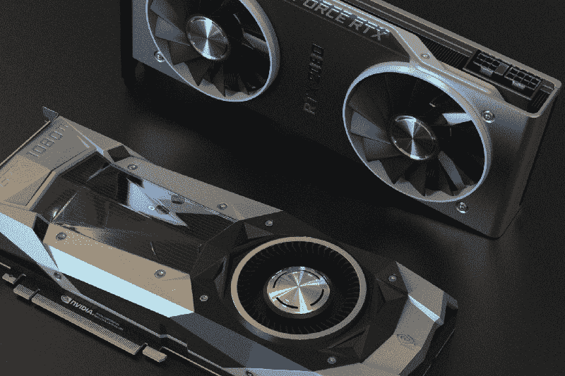
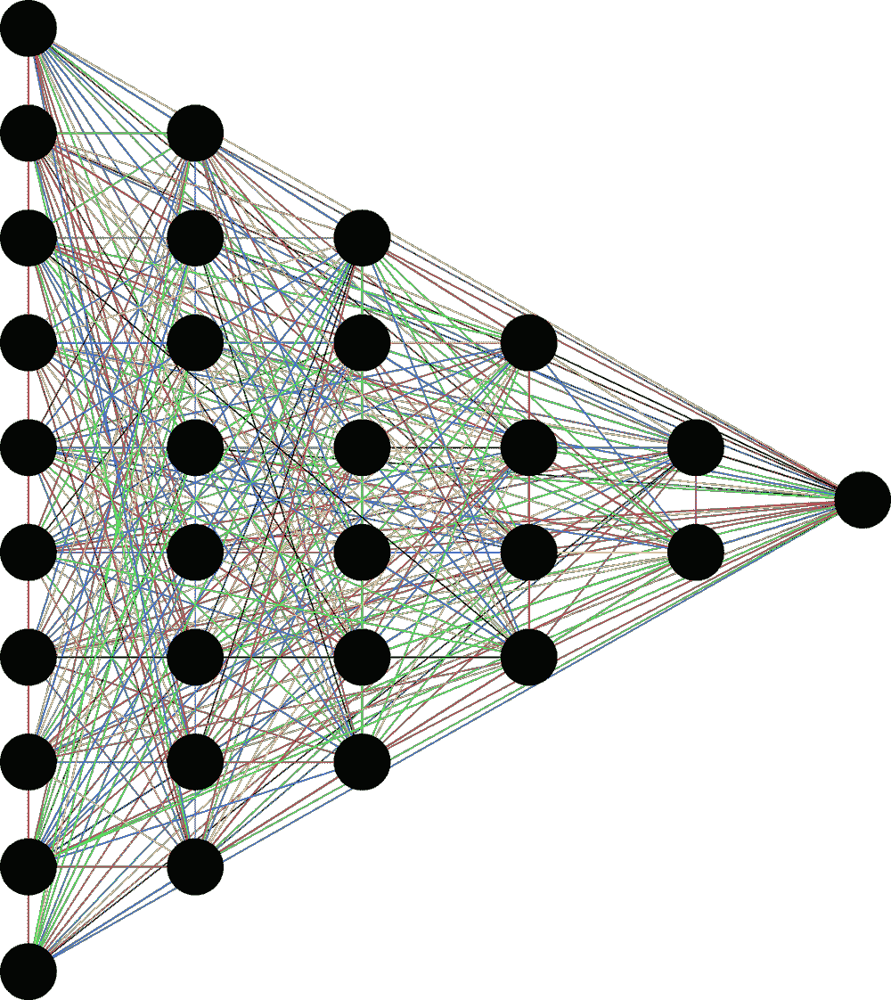
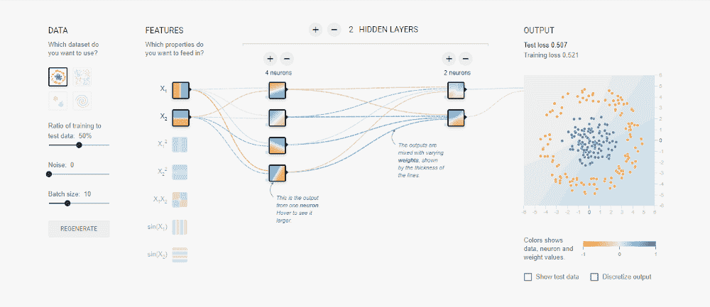
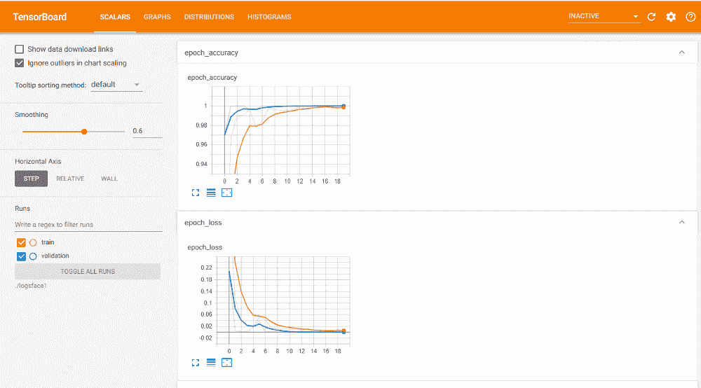

# 张量流绝对指南

> 原文：<https://blog.paperspace.com/absolute-guide-to-tensorflow/>

TensorFlow 是当今最受欢迎的深度学习库之一。TensorFlow 由谷歌开发，于 2015 年发布，被认为是研究、开发和部署机器学习模型的最佳平台之一。

TensorFlow 的核心结构是用 C、C++等编程语言开发的，这使得它成为一个速度极快的框架。TensorFlow 拥有 Python、Java 和 JavaScript 等编程语言的接口。精简版还允许它在移动应用程序和嵌入式系统上运行。

在本教程中，我们将分解 TensorFlow 和 Keras 的最基本方面，同时用这些模块编程深度学习模型。

## 目录

*   张量流和 Keras 简介
*   加速器
    1。CPU
    2。图形处理器
    3。TPUs
*   初学者快速入门指南
*   基本功能和操作
    1。张量
    2。常量和变量
    3。反向传播
    4。图表
    5。层和模型介绍
*   了解 TensorFlow 2.x
    1。渐变裁剪
    2。梯度反转
    3。梯度带
*   结论

您可以跟随本教程中的完整代码，并从 [Gradient 社区笔记本](https://ml-showcase.paperspace.com/projects/guide-to-tensorflow-and-keras)中免费运行它。

## 张量流和 Keras 简介

TensorFlow 使用基于底层控制的方法，编码和开发项目需要复杂的细节，导致学习曲线更加陡峭。

这就是 Keras 的用武之地！

Keras 最初是由谷歌人工智能团队的各个成员开发的。Keras 的第一个版本由作者 Franç ois Chollet 于 2015 年 3 月 27 日在 GitHub 上提交并发布。

Keras 是一个简单的高级 API，作为前端接口工作，它可以与几个后端一起使用。在 2.3 版本之前，Keras 支持各种深度学习库，如 TensorFlow、Theano、Caffe、PyTorch 和 MXNET。然而，对于最稳定的版本 Keras 2.4(2020 年 6 月 17 日发布)，现在仅支持 TensorFlow。

当 TensorFlow 最初发布时，Keras 只是可以与之一起使用的流行的高级 API 之一。随着 TensorFlow 2.0 的发布，Keras 现在与 TensorFlow 集成在一起，被认为是用于快速轻松的模型设计和训练的官方高级 TensorFlow API。

## 加速器



Photo by [Nana Dua](https://unsplash.com/@nanadua11?utm_source=medium&utm_medium=referral) on [Unsplash](https://unsplash.com?utm_source=medium&utm_medium=referral)

深度学习涉及大量复杂的计算，以达到理想的结果。几十年前深度学习和神经网络失败的主要原因之一是缺乏足够的数据，以及缺乏先进的计算技术。

然而，在现代，数据的丰富和技术的不断进步导致深度学习成为解决复杂问题的强大工具，例如人脸识别、对象检测、图像分割和许多其他复杂任务。

在这一部分，我们将讨论深度学习的一个重要方面，涉及到增强 TensorFlow 等深度学习库的功能:加速器。人工智能加速器是一类专门的硬件加速器，即一种旨在加速人工智能应用的计算机系统，即在机器学习，计算机视觉，自然语言处理和物联网应用等领域。

让我们分析几个用于处理的常用工具。最常用的加速器可以分类如下。

### 中央处理器（central processing units 的缩写）

在本地系统上运行 TensorFlow 深度学习库最简单(也是默认)的方法是使用中央处理器(CPU)。CPU 有几个内核，通常从 4 到 12 个不等，可用于计算与深度学习任务有关的计算(如反向传播计算)。

然而，CPU 只是一个基本的、简单的加速器，不能并行执行许多操作。TensorFlow 的 CPU 版本可以用来在短时间内解决简单的任务。但是，随着模型体系结构的规模、节点数量和可训练参数的增加，CPU 速度非常慢，甚至可能无法处理处理负载。

### 绘图处理器

图形处理单元(GPU，或显卡)彻底改变了深度学习。这些加速器可以与 Tensorflow-GPU 版本集成，以实现各种操作和任务。

NVIDIA 提供了一种称为计算统一设备架构(CUDA)的东西，这对于支持各种深度学习应用程序至关重要。CUDA 是 NVIDIA 创建的并行计算平台和应用编程接口模型。它允许软件开发人员和工程师使用支持 CUDA 的图形处理单元(GPU)进行通用处理，这种方法称为 GPGPU。

GPU 包含数千个 CUDA 内核，有助于大幅减少计算时间。显卡不仅可以加快你深度学习问题的速度，还可以减少完成某个特定任务所需的资源数量和时间。

举个简单的例子，如果一个 CPU 需要三个小时来训练和运行一个图像分割任务，那么在一个普通的 GPU 上，同样的问题可以在 15-30 分钟的时间范围内得到解决。有了更好、更高质量的 GPU 设备，整个计算任务，包括程序的训练和运行，都有可能在几分钟内完成。

### TPUs

张量处理单元(TPU)是本文将要讨论的最终人工智能加速器。TPU 由谷歌设计师开发，于 2016 年 5 月推向全球。TPU 专为与张量流相关的操作而设计，执行机器学习和人工神经网络的复杂矩阵任务。

与 GPU 相比，TPU 设备专为大量低精度计算(低至 8 位)而设计。设计这些 TPU 的主要目的是在矩阵(或张量)相关运算上获得高性能、高质量和精确的结果。

这些 TPU 模型以前有三个版本，都是为了更快更有效的计算。这些 TPU 最近的第四个版本旨在通过微控制器和 TensorFlow lite 版本实现高性能。

> ***注:*** 精简版 TensorFlow 是实际 TensorFlow 模块的一个更小的包，是为了使其更适合在嵌入式设备上部署机器学习模型而开发的。

目前，在一般情况下，GPU 通常比 TPU 更受青睐。

* * *

## 初学者快速入门指南

在本节中，我们将简要介绍开始安装 TensorFlow 库的主要方法。

CPU TensorFlow 模块的安装非常简单，建议您仅在系统中没有集成显卡的情况下安装它。只需在命令提示符下输入以下命令即可安装。

```py
pip install tensorflow 
```

但是，如果你有 GPU(最好是英伟达的)，你可以继续安装 TensorFlow 的 GPU 版本。对于每个平台，如 Windows 或 Linux，GPU 版本的实际安装可能相当复杂。您需要为将要安装的特定 TensorFlow 版本安装特定版本的 CUDA 和 CUDNN。兼容性问题会产生有趣的复杂情况。在这里你可以找到一个分步指南(在这里你可以找到 T2 的视频)，它涵盖了安装过程。

在这里，我们有一个简单得多的方法，无需太多的努力就可以在您的 PC 上安装 TensorFlow 的 GPU 版本。这个过程可以在 Anaconda 包的帮助下完成。Anaconda 为与数据科学相关的项目提供了各种各样的工具，并支持 Python 和 R 等编程语言来执行大量任务。你可以从这里下载 Anaconda 包。

下载发行版并在您的平台上安装后，您可以使用以下简单命令安装 TensorFlow GPU 版本。

```py
conda install -c anaconda tensorflow-gpu
```

以上步骤就是你需要做的全部，GPU 版本就会安装在你的系统上。您不需要担心 GPU 或 TensorFlow 版本的任何兼容性问题，因为 Conda install 命令会处理所有必要的需求。

我强烈推荐查看如何在 Anaconda 发行版中为单个项目创建虚拟环境(更多信息[在这里](https://docs.conda.io/projects/conda/en/latest/user-guide/tasks/manage-environments.html))。您可以在虚拟环境中安装所有必要的库模块和包。为你的数据科学或人工智能项目使用不同的虚拟环境的主要优点是，你可以为每个项目的需求使用每个包的特定版本。

例如，您可能需要 TensorFlow 1.x 版本来执行特定的对象检测任务。尽管您可以在开始时使用`tensorflow.compat.v1`命令来转换 Tensorflow 2.x 的一些性能，以适应您项目的要求，但您可以只拥有两个虚拟环境。

然而，如果你没有显卡(GPU)，但仍然想尝试它，体验它的性能，那么你很幸运。有几个不同的选项可供您受益、探索和利用。一个这样的选项是 [Paperspace Gradient](https://gradient.paperspace.com/) ，它为一般用途提供免费的 GPU 和 CPU。Gradient 允许您在 Jupyter 笔记本上创建具有 GPU 支持的深度学习项目，以实现更快的计算速度。这些 Jupyter 笔记本也可以与您的朋友和同龄人分享。

## 基本功能和操作

在教程的这一部分，我们将涵盖操作 TensorFlow 模块以解决各种复杂的深度学习问题所需的核心基础知识。

本文将不涉及从头构建模型或层等主题，因为 Keras 模块是使用 TensorFlow 创建层和开发模型的更有效和高效的方式。我们将在第 2 部分了解更多。

让我们开始讨论张量到底是什么，以及它在 TensorFlow 库中有什么要求。然后，我们将继续简要了解 TensorFlow 库模块中的常数和变量。在下一部分中，我们将对什么是反向传播有一个直观的理解。最后，我们将简要讨论图和建模的概念。

### 张量

张量是多维数组，有一个统一的类型叫做`dtype`。dtype 支持张量中元素的各种表示，包括`tf.float32`、`tf.int32`、`tf.bool`和许多其他选项。`tf.dtypes.DType()`也支持各种属性。我强烈推荐查看[这个链接](https://www.tensorflow.org/api_docs/python/tf/dtypes/DType)来了解更多关于这个话题的信息。

让我们通过一些例子，对张量的各种表示有一个更基本的了解。

*   **标量或秩为 0 的张量:**只包含一个元素而没有轴的变量表示，即单值元素。
*   **向量或秩 1 张量:**包含元素列表的变量表示。
*   **矩阵或秩 2 张量:**包含元素矩阵的变量表示。
*   **N 维张量:**任何超过秩 2 张量的表示都被认为是 N 维或多维张量，其中$n$代表张量的增量秩。

```py
tf.Tensor(3, shape=(), dtype=int32)
```

```py
tf.Tensor([1 2], shape=(2,), dtype=int32)
```

```py
tf.Tensor(
[[1\. 2.]
 [3\. 4.]
 [5\. 6.]], shape=(3, 2), dtype=float16)
```

张量的形状在深度学习领域中起着至关重要的作用，尤其是在创建深度学习模型时。例如，让我们看看下面提供的形状。

```py
(10000, 28, 28, 3)
```

第一个值通常表示数据集中可用的定型或测试模式的数量。接下来的两个值通常表示图像或对象的形状(形状表示由图像的宽度和高度组成)。形状的最终表示是图像中包含的通道数。数字三代表 RGB 图像，数字一代表灰度图像。然而，可以执行多个堆栈，并且当前上下文仅参考计算机视觉任务。我们将在另一篇文章中更详细地讨论这个主题。

我们现在将讨论使用张量的几个基本主题:一种类型的数据结构(在大多数情况下是 NumPy 数组)到张量的转换，以及形状的操作。

为了使用大多数张量流函数，我们处理的变量需要是正确的类型。对于与张量相关的计算，如`tf.reshape()`和其他类似的函数，输入类型必须是张量类型。这可以借助下面的命令来完成:`tf.convert_to_tensor()`。

举个例子，让我们快速看一下这个转换过程是如何完成的。

```py
a = np.array([[1,2],
              [3,4]])
a

Result: array([[1, 2],
       [3, 4]])
```

```py
b = tf.convert_to_tensor(a)
print(b)

Result: tf.Tensor(
        [[1 2]
         [3 4]], shape=(2, 2), dtype=int32
```

张量形状的操作在执行各种操作和任务中起着至关重要的作用。`tf.reshape()`的工作方式类似于 NumPy 中的整形功能。整形函数接受两个输入，即要整形的张量和要将其转换为的形状。

在接下来的几个示例中，我们将了解如何使用 TensorFlow 执行各种形状操作。我们将主要关注三个与形状相关的操作:`reshape`、`expand_dims`和`reduce_sum`。所有这些功能在计算机视觉和自然语言处理任务的深度学习中都发挥着重要作用。先说 TensorFlow 的重塑功能。

```py
rank_2_tensor = tf.constant([[1, 2],
                             [3, 4],
                             [5, 6]], dtype=tf.int32)
print(rank_2_tensor.shape)
print(tf.reshape(rank_2_tensor, shape=[2,3]))
```

```py
Result:

(3, 2)
tf.Tensor(
[[1 2 3]
 [4 5 6]], shape=(2, 3), dtype=int32)
```

我们可以注意到，秩为 2 的张量的形状，最初是$(3，2)$，现在是$(2，3)$。许多操作都是用整形功能执行的，它们在深度学习中起着至关重要的作用。

现在让我们来看看与张量有关的运算的扩展和缩减维数的例子。

```py
rank_2_tensor = tf.constant([[1, 2],
                             [3, 4],
                             [5, 6]], dtype=tf.int32)

rank_2_tensor = tf.expand_dims(rank_2_tensor, axis=-1)
print(rank_2_tensor)
```

```py
Result: 

tf.Tensor(
[[[1]
  [2]]

 [[3]
  [4]]

 [[5]
  [6]]], shape=(3, 2, 1), dtype=int32)
```

```py
rank_2_tensor = tf.reduce_sum(rank_2_tensor, axis=-1)
print(rank_2_tensor)
```

```py
Result:

tf.Tensor(
[[1 2]
 [3 4]
 [5 6]], shape=(3, 2), dtype=int32)
```

我们在上面的例子中考虑的秩 2(或矩阵张量)对于更好地理解形状操作的各种概念是重要的。轴参数用于指定必须对其执行形状更改的适当属性。通过说`axis=-1`，你总是在操纵形状的最后一个索引。您可以通过指定所需的轴来选择任何索引，维度的扩展或缩减将在指定的位置发生。

使用这些函数，您可以操作正在处理的结构的各种维度，这对于涉及卷积神经网络和序列到序列模型的任务尤其有用。

### 常量和变量

下一个我们要关注的话题是张量流中的常量和变量。在 TensorFlow 第一版中使用的占位符现在在 TensorFlow 更新的第二版中已被删除。因此，我们将把重点放在常量和变量上，因为它们是很容易理解的话题。

TensorFlow 中的常数，顾名思义，就是取值固定且保持不变的张量。这个在构造模型中的术语指的是不能被训练的参数(或不可训练的参数)。TensorFlow 中的变量是可变张量，是表示执行大量运算的元素的推荐方法。这些是模型中的可训练参数。

让我们看一些代码来获得更好的理解。在将 Tensorflow 常数转换为 TensorFlow 变量后，我们将主要执行三种操作，即逐元素加法、逐元素乘法和矩阵乘法。

```py
a = tf.constant([[1, 2],
                 [3, 4]])
b = tf.constant([[1, 1],
                 [1, 1]])
a = tf.Variable(a)
b = tf.Variable(b)
print(tf.add(a, b), "\n")
print(tf.multiply(a, b), "\n")
print(tf.matmul(a, b), "\n")
```

```py
Result:

tf.Tensor(
[[2 3]
 [4 5]], shape=(2, 2), dtype=int32) 

tf.Tensor(
[[1 2]
 [3 4]], shape=(2, 2), dtype=int32) 

tf.Tensor(
[[3 3]
 [7 7]], shape=(2, 2), dtype=int32)
```

以上示例显示了 TensorFlow 中常量和变量类型可以执行的各种类型的计算。上面的代码块也可以使用常量类型，但是最好将它们转换成变量来执行这样的任务。Keras 模块使用 TensorFlow 中的变量函数来存储各种模型参数并对其进行操作。

在下一节中，我们将讨论神经网络和深度学习的一个最重要的主题，即反向传播。然后我们将学习张量流如何有助于产生更好的结果。

### 反向传播

深度学习和神经网络最重要和最本质的方面是反向传播和梯度计算的概念。为了了解反向传播的复杂细节，并对这一主题有一个更直观的理解，让我们考虑下图，它代表了一个“完全连接”的神经网络。



Image by [Gordon Johnson](https://pixabay.com/users/gdj-1086657/?utm_source=link-attribution&utm_medium=referral&utm_campaign=image&utm_content=3816319) from [Pixabay](https://pixabay.com/?utm_source=link-attribution&utm_medium=referral&utm_campaign=image&utm_content=3816319)

当训练神经网络时，第一步是前向传播。在训练的第一个时期，随机权重被考虑(根据用户定义的初始化)并用于计算所需的输出值。在前向传播结束时，我们在输出节点接收一些值。

有了这些接收(或预测)值，我们就可以计算损耗，损耗可以计算为预测值和实际值之间的差值。一旦计算出损失，就应该通过反向传播过程中梯度的微分和计算来调整神经网络的权重。

在 TensorFlow 中，使用了梯度的[自动微分](https://ml-showcase.paperspace.com/projects/pytorch-tutorial-autograd-automatic-differentiation)的概念。这一特性非常重要，因为它有助于成功实现用于训练的反向传播算法。

为了自动区分，TensorFlow 需要记住在向前传递期间什么操作以什么顺序发生。然后，在反向过程中，TensorFlow 以相反的顺序遍历这个操作列表来计算梯度。在本文的编码部分，我们将更好地理解梯度带的主题，在这里，我们将实现一个梯度带函数，用于在神经网络的训练过程中执行自动微分。



Screenshot By Author From [Tensorflow Playground](https://playground.tensorflow.org/#activation=tanh&batchSize=10&dataset=circle&regDataset=reg-plane&learningRate=0.03&regularizationRate=0&noise=0&networkShape=4,2&seed=0.47570&showTestData=false&discretize=false&percTrainData=50&x=true&y=true&xTimesY=false&xSquared=false&ySquared=false&cosX=false&sinX=false&cosY=false&sinY=false&collectStats=false&problem=classification&initZero=false&hideText=false)

在结束这一部分之前，我强烈建议初学机器学习的观众去看看 TensorFlow Playground 网站。这是一个免费网站，可以让你可视化神经网络在不同数据集上的表现。它为您提供了各种各样的选择来尝试和试验，同时获得了关于神经网络如何解决某些模式和问题的更强的直觉。

本文接下来的两个部分将会简单介绍一下。图表、图层和模型将在下一篇文章中详细介绍，因为在使用 Keras 模块时它们更容易使用。这些概念的 TensorFlow 实现可能会非常混乱。因此，这些主题在本文中只会简单地涉及一下。

### 图形

TensorFlow 中的图的概念不仅仅是对 TensorFlow 和 Keras 的讨论。Keras 模块提供的 TensorBoard 回调函数无疑是理解图形和查看模型性能的更好方法。



Image by Author

然而，为了快速理解 TensorFlow 中的图形主题，图形被视为包含一组代表计算单元的`tf.Operation`对象的数据结构。这些`tf.Tensor`对象是在各种操作之间流动的数据单元的表示。这些可以在`tf.Graph`的背景下定义。使用这些图表的最大好处是它们是数据结构。因此，它们可以被保存、运行和恢复，而不需要原始的 Python 代码。

图表在分析模型和查看特定模型是否欠拟合或过拟合训练数据方面非常有用。图表有助于理解程序的结构以及为获得更高的性能而需要进行的改进。在本系列的下一部分 TensorBoard 中将更详细地讨论图形主题。

### 层和模型快速介绍

层和模型的主题也将在本系列的下一部分详细讨论，因为使用 Keras 库可以更容易地构建它们。然而，在文章的这一部分，我们将快速关注 TensorFlow 在构建层和模型方面的一些重要方面。

TensorFlow 库可用于从头构建您自己的定制模型。层是具有已知数学结构的函数，可以重复使用，并且具有可训练的变量。组合在一起并为单一目的构建的多个层可用于创建模型。我们将在本系列的下一部分进一步讨论这个主题。现在让我们继续理解 TensorFlow 中一些简单但有用的基本代码。

## 用代码理解 TensorFlow 2

在本文的最后一部分，我们将探索一些基本的编码结构、模式和架构，这些都是为精确计算和梯度微分的自动计算编写高级 TensorFlow 工作流所需的。为了更好地理解 TensorFlow 库，我们将主要看三个方面，即梯度裁剪、梯度反转和梯度带。这里提供的代码仅供参考，为了获得更好、更直观的理解，我强烈建议您尝试自己编写。

### 渐变剪辑

在一些神经网络架构(如[递归神经网络，或 RNNs)](https://blog.paperspace.com/advanced-recurrent-neural-networks-deep-rnns/) 中，经常存在爆炸和消失梯度的问题，这会导致所构建的深度学习模型出现一些错误和故障。为了避免和解决这一特定问题，可以执行梯度裁剪的张量流运算，以将梯度值限制在特定范围内。让我们看看下面的代码块来更好地理解这一点。

```py
@tf.custom_gradient
def grad_clip(x):
    y = tf.identity(x)
    def custom_grad(dy):
        return tf.clip_by_value(dy, clip_value_min=0, clip_value_max=0.5)
    return y, custom_grad

class Clip(tf.keras.layers.Layer):
    def __init__(self):
        super().__init__()

    def call(self, x):
        return grad_clip(x) 
```

上面的代码块利用`custom_gradient`函数来开发渐变剪辑，将值限制在一个由最小值和最大值限定的范围内。此外，类`Clip`可以用作一个层，可以添加到剪辑的特定隐藏层的梯度。

### 梯度反转

顾名思义，梯度反转过程用于在特定层或序列的计算期间反转梯度。下面显示的代码块是如何执行这种梯度反转的简单表示，以及如何在自定义层中准确地利用它来反转梯度。

```py
@tf.custom_gradient
def grad_reverse(x):
    y = tf.identity(x)

    def custom_grad(dy):
        return -dy   

    return y, custom_grad

class GradReverse(tf.keras.layers.Layer):
    def __init__(self):
        super().__init__()

    def call(self, x):
        return grad_reverse(x) 
```

### 梯度带

我们已经讨论过，反向传播是深度学习和神经网络的最重要的概念之一。计算梯度的自动微分过程非常有用，TensorFlow 以`tf.GradientTape`函数的形式提供了这一点。在急切执行期间，使用`tf.GradientTape`跟踪操作，以便稍后计算梯度。

`tf.GradientTape`对于复杂的训练循环特别有用。因为在每次调用中可能发生不同的操作，所以所有向前传递的操作都被记录到“磁带”上。要计算梯度，倒放磁带，然后丢弃。一个特定的`tf.GradientTape`只能计算一个梯度；后续调用会引发运行时错误。

```py
def step(real_x, real_y):
    with tf.GradientTape() as tape:
        # Make prediction
        pred_y = model(real_x.reshape((-1, 28, 28, 1)))
        # Calculate loss
        model_loss = tf.keras.losses.categorical_crossentropy(real_y, pred_y)

    # Calculate gradients
    model_gradients = tape.gradient(model_loss, model.trainable_variables)

    # Update model
    optimizer.apply_gradients(zip(model_gradients, model.trainable_variables)) 
```

有了对梯度带函数的这种理解，我们已经到了张量流和 Keras 系列的第一部分的结尾。

* * *

## 结论


Photo by [Nikita Vantorin](https://unsplash.com/@vantorin?utm_source=medium&utm_medium=referral) on [Unsplash](https://unsplash.com?utm_source=medium&utm_medium=referral)

在本文中，我们已经了解了 TensorFlow 和 Keras 深度学习库的简史。然后，我们通过一个快速入门指南，继续学习对神经网络计算有用的不同类型的加速器。在此之后，我们探索了数据科学爱好者可用的各种选项，以开始构建各种独特的模型和项目。

在本文的最后两节中，我们查看了有用的命令和指南，以加深对 TensorFlow 的理解。我们触及了张量、形状处理、常数和变量、反向传播等基本主题。最后，我们以高级 TensorFlow 代码结束了系列的第一部分，事实证明，这对于深度学习和神经网络中的特定场景极其有用。

如需进一步阅读，我建议您查看 TensorFlow 指南的官方文档。

在本系列的下一部分，我们将了解更多关于 Keras 的内容，以及 Keras 的集成如何对 TensorFlow 的第二个版本产生积极影响。我们将直观地了解 Keras 模块中可用的各种图层选项，并学习如何利用它们从头构建独特的模型来解决许多不同类型的问题。我们还将分析 Keras 中提供的众多回调选项，以及如何创建自己的自定义回调。最后，我们将了解深度学习模型的编译过程和运行时训练。

在那之前，享受练习吧！