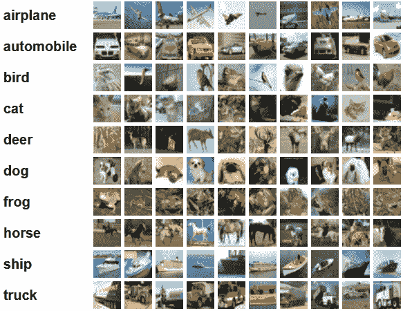
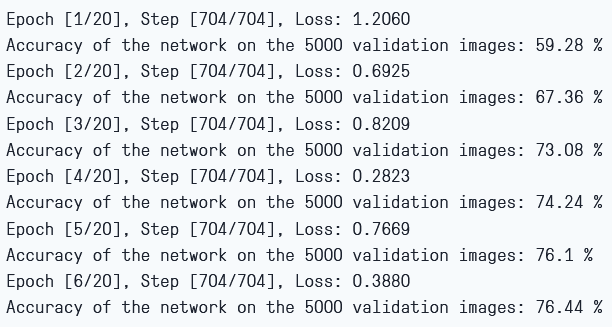
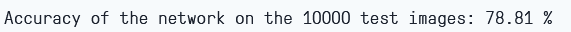

# 用 PyTorch 从头开始编写 AlexNet

> 原文：<https://blog.paperspace.com/alexnet-pytorch/>

这篇文章是我在 PyTorch 中从头开始构建经典和最流行的卷积神经网络系列的继续。你可以在这里看到之前的帖子[，我们在这里建造了 LeNet5。在这篇文章中，我们将构建 AlexNet，这是计算机视觉中最受欢迎和最早突破的算法之一。](https://blog.paperspace.com/writing-lenet5-from-scratch-in-python/)

我们将从调查和理解 AlexNet 的架构开始。然后，我们将通过加载数据集 CIFAR10 直接进入代码，然后对数据进行一些预处理。然后，我们将使用`PyTorch`从头开始构建我们的 AlexNet，并在我们预处理的数据上训练它。训练好的模型将在看不见的(测试)数据上进行测试，以便在最后进行评估

* * *

## AlexNet

AlexNet 是一个深度卷积神经网络，最初是由 Alex Krizhevsky 和他的同事在 2012 年开发的。它旨在为 ImageNet LSVRC-2010 竞赛分类图像，并在该竞赛中取得了最先进的结果。你可以在原研究论文[这里](https://proceedings.neurips.cc/paper/2012/file/c399862d3b9d6b76c8436e924a68c45b-Paper.pdf)详细阅读关于模型的内容。

在这里，我将总结一下关于 AlexNet 网络的要点。首先，它使用大小为(224x224x3)的 3 通道图像进行操作。当二次采样时，它使用最大池和 ReLU 激活。用于卷积的内核大小为 11x11、5x5 或 3x3，而用于最大池的内核大小为 3x3。它将图像分为 1000 类。它还利用了多个 GPU。

* * *

## 数据加载

### 资料组

让我们从加载然后预处理数据开始。出于我们的目的，我们将使用[CIFS ar 10](https://www.cs.toronto.edu/%7Ekriz/cifar.html)数据集。该数据集由 10 类 60000 幅 32×32 彩色图像组成，每类 6000 幅图像。有 50000 个训练图像和 10000 个测试图像。

以下是数据集中的类，以及每个类中的 10 个随机样本图像:



Source: https://www.cs.toronto.edu/%7Ekriz/cifar.html

这些类是完全互斥的。汽车和卡车之间没有重叠。“汽车”包括轿车、越野车以及诸如此类的东西。“卡车”仅包括大卡车。两者都不包括皮卡车。

### 导入库

让我们从导入所需的库以及定义变量`device`开始，这样笔记本就知道使用 GPU 来训练模型(如果它可用的话)。

```py
import numpy as np
import torch
import torch.nn as nn
from torchvision import datasets
from torchvision import transforms
from torch.utils.data.sampler import SubsetRandomSampler

# Device configuration
device = torch.device('cuda' if torch.cuda.is_available() else 'cpu') 
```

Importing the libraries

### 加载数据集

使用`torchvision`(计算机视觉任务的助手库)，我们将加载我们的数据集。这个方法有一些帮助函数，使得预处理变得非常简单和直接。让我们定义函数`get_train_valid_loader`和`get_test_loader`，然后调用它们来加载和处理我们的 CIFAR-10 数据:

```py
def get_train_valid_loader(data_dir,
                           batch_size,
                           augment,
                           random_seed,
                           valid_size=0.1,
                           shuffle=True):
    normalize = transforms.Normalize(
        mean=[0.4914, 0.4822, 0.4465],
        std=[0.2023, 0.1994, 0.2010],
    )

    # define transforms
    valid_transform = transforms.Compose([
            transforms.Resize((227,227)),
            transforms.ToTensor(),
            normalize,
    ])
    if augment:
        train_transform = transforms.Compose([
            transforms.RandomCrop(32, padding=4),
            transforms.RandomHorizontalFlip(),
            transforms.ToTensor(),
            normalize,
        ])
    else:
        train_transform = transforms.Compose([
            transforms.Resize((227,227)),
            transforms.ToTensor(),
            normalize,
        ])

    # load the dataset
    train_dataset = datasets.CIFAR10(
        root=data_dir, train=True,
        download=True, transform=train_transform,
    )

    valid_dataset = datasets.CIFAR10(
        root=data_dir, train=True,
        download=True, transform=valid_transform,
    )

    num_train = len(train_dataset)
    indices = list(range(num_train))
    split = int(np.floor(valid_size * num_train))

    if shuffle:
        np.random.seed(random_seed)
        np.random.shuffle(indices)

    train_idx, valid_idx = indices[split:], indices[:split]
    train_sampler = SubsetRandomSampler(train_idx)
    valid_sampler = SubsetRandomSampler(valid_idx)

    train_loader = torch.utils.data.DataLoader(
        train_dataset, batch_size=batch_size, sampler=train_sampler)

    valid_loader = torch.utils.data.DataLoader(
        valid_dataset, batch_size=batch_size, sampler=valid_sampler)

    return (train_loader, valid_loader)

def get_test_loader(data_dir,
                    batch_size,
                    shuffle=True):
    normalize = transforms.Normalize(
        mean=[0.485, 0.456, 0.406],
        std=[0.229, 0.224, 0.225],
    )

    # define transform
    transform = transforms.Compose([
        transforms.Resize((227,227)),
        transforms.ToTensor(),
        normalize,
    ])

    dataset = datasets.CIFAR10(
        root=data_dir, train=False,
        download=True, transform=transform,
    )

    data_loader = torch.utils.data.DataLoader(
        dataset, batch_size=batch_size, shuffle=shuffle
    )

    return data_loader

# CIFAR10 dataset 
train_loader, valid_loader = get_train_valid_loader(data_dir = './data',                                      batch_size = 64,
                       augment = False,                             		     random_seed = 1)

test_loader = get_test_loader(data_dir = './data',
                              batch_size = 64)
```

Loading and Pre-processing the dataset

让我们将代码分解成几部分:

*   我们定义了两个函数`get_train_valid_loader`和`get_test_loader`来分别加载训练/验证和测试集
*   我们首先用数据集中每个通道(红色、绿色和蓝色)的平均值和标准偏差来定义变量`normalize`。这些可以手动计算，但也可以在线获得，因为 CIFAR-10 非常受欢迎
*   对于我们的训练数据集，我们添加了增加数据集的选项，以便进行更鲁棒的训练，并增加图像的数量。注意:扩充仅适用于训练子集，不适用于验证和测试子集，因为它们仅用于评估目的
*   我们将训练数据集分成训练集和验证集(90:10 的比例)，并从整个训练集中随机抽取子集
*   我们指定批量大小，并在加载时打乱数据集，这样每一批都有一些标签类型的差异。这将增加我们最终模型的效率
*   最后，我们利用数据加载器。对于像 CIFAR10 这样的小型数据集，这可能不会影响性能，但对于大型数据集，这确实会影响性能，通常被认为是一种良好的做法。数据加载器允许我们批量迭代数据，数据是在迭代时加载的，而不是一次全部加载到内存中

* * *

## AlexNet 从零开始

让我们先从代码开始:

```py
 class AlexNet(nn.Module):
    def __init__(self, num_classes=10):
        super(AlexNet, self).__init__()
        self.layer1 = nn.Sequential(
            nn.Conv2d(3, 96, kernel_size=11, stride=4, padding=0),
            nn.BatchNorm2d(96),
            nn.ReLU(),
            nn.MaxPool2d(kernel_size = 3, stride = 2))
        self.layer2 = nn.Sequential(
            nn.Conv2d(96, 256, kernel_size=5, stride=1, padding=2),
            nn.BatchNorm2d(256),
            nn.ReLU(),
            nn.MaxPool2d(kernel_size = 3, stride = 2))
        self.layer3 = nn.Sequential(
            nn.Conv2d(256, 384, kernel_size=3, stride=1, padding=1),
            nn.BatchNorm2d(384),
            nn.ReLU())
        self.layer4 = nn.Sequential(
            nn.Conv2d(384, 384, kernel_size=3, stride=1, padding=1),
            nn.BatchNorm2d(384),
            nn.ReLU())
        self.layer5 = nn.Sequential(
            nn.Conv2d(384, 256, kernel_size=3, stride=1, padding=1),
            nn.BatchNorm2d(256),
            nn.ReLU(),
            nn.MaxPool2d(kernel_size = 3, stride = 2))
        self.fc = nn.Sequential(
            nn.Dropout(0.5),
            nn.Linear(9216, 4096),
            nn.ReLU())
        self.fc1 = nn.Sequential(
            nn.Dropout(0.5),
            nn.Linear(4096, 4096),
            nn.ReLU())
        self.fc2= nn.Sequential(
            nn.Linear(4096, num_classes))

    def forward(self, x):
        out = self.layer1(x)
        out = self.layer2(out)
        out = self.layer3(out)
        out = self.layer4(out)
        out = self.layer5(out)
        out = out.reshape(out.size(0), -1)
        out = self.fc(out)
        out = self.fc1(out)
        out = self.fc2(out)
        return out
```

Defining the AlexNet Model

让我们深入研究一下上面的代码是如何工作的:

*   在 PyTorch 中定义任何神经网络(不管是不是 CNN)的第一步是定义一个继承`nn.Module`的类，因为它包含了我们需要使用的许多方法
*   之后有两个主要步骤。首先是初始化我们将在 CNN 中使用的图层，另一个是定义这些图层处理图像的顺序。这是在`forward`函数中定义的
*   对于架构本身，我们首先使用具有适当内核大小和输入/输出通道的`nn.Conv2D`函数定义卷积层。我们还使用`nn.MaxPool2D`函数应用最大池。PyTorch 的好处是我们可以使用`nn.Sequential`函数将卷积层、激活函数和最大池合并到一个单独的层中(它们将被单独应用，但它有助于组织)
*   然后，我们使用线性(`nn.Linear`)和下降(`nn.Dropout`)以及 ReLu 激活函数(`nn.ReLU`)定义完全连接的层，并将其与`nn.Sequential`函数组合
*   最后，我们的最后一层输出 10 个神经元，这是我们对 10 类对象的最终预测

* * *

## 设置超参数

在训练之前，我们需要设置一些超参数，比如损失函数和优化器，以及批量大小、学习速率和时期数。

```py
num_classes = 10
num_epochs = 20
batch_size = 64
learning_rate = 0.005

model = AlexNet(num_classes).to(device)

# Loss and optimizer
criterion = nn.CrossEntropyLoss()
optimizer = torch.optim.SGD(model.parameters(), lr=learning_rate, weight_decay = 0.005, momentum = 0.9)  

# Train the model
total_step = len(train_loader)
```

Setting the Hyperparameters

我们首先定义简单的超参数(时期、批量大小和学习速率)，并使用类的数量作为参数初始化我们的模型，在本例中是 10，同时将模型传输到适当的设备(CPU 或 GPU)。然后我们定义我们的成本函数为交叉熵损失，优化器为 Adam。有很多选择，但这些往往会给出模型和给定数据的良好结果。最后，我们定义`total_step`以便在训练时更好地跟踪步骤

* * *

## 培养

我们准备在这一点上训练我们的模型:

```py
 total_step = len(train_loader)

for epoch in range(num_epochs):
    for i, (images, labels) in enumerate(train_loader):  
        # Move tensors to the configured device
        images = images.to(device)
        labels = labels.to(device)

        # Forward pass
        outputs = model(images)
        loss = criterion(outputs, labels)

        # Backward and optimize
        optimizer.zero_grad()
        loss.backward()
        optimizer.step()

    print ('Epoch [{}/{}], Step [{}/{}], Loss: {:.4f}' 
                   .format(epoch+1, num_epochs, i+1, total_step, loss.item()))

    # Validation
    with torch.no_grad():
        correct = 0
        total = 0
        for images, labels in valid_loader:
            images = images.to(device)
            labels = labels.to(device)
            outputs = model(images)
            _, predicted = torch.max(outputs.data, 1)
            total += labels.size(0)
            correct += (predicted == labels).sum().item()
            del images, labels, outputs

        print('Accuracy of the network on the {} validation images: {} %'.format(5000, 100 * correct / total)) 
```

Training and Validation

让我们看看代码做了什么:

*   我们首先遍历历元数，然后遍历训练数据中的批次
*   我们根据正在使用的设备(即 GPU 或 CPU)来转换图像和标签
*   在正向传递中，我们使用我们的模型进行预测，并根据这些预测和我们的实际标签计算损失
*   接下来，我们进行反向传递，我们实际上更新我们的权重，以改善我们的模型
*   然后，在每次更新之前，我们使用`optimizer.zero_grad()`函数将梯度设置为零
*   然后，我们使用`loss.backward()`函数计算新的梯度
*   最后，我们用`optimizer.step()`函数更新权重
*   此外，在每个时期结束时，我们也使用我们的验证集来计算模型的准确性。在这种情况下，我们不需要梯度，所以我们使用`with torch.no_grad()`进行快速评估

我们可以看到如下输出:



Training Loss and Validation Accuracy

如我们所见，损失随着每个时期而减少，这表明我们的模型确实在学习。请注意，这种损失是在训练集上，如果损失太小，则可能表示过度拟合。这也是我们使用验证集的原因。准确性似乎在验证集上增加，这表明不太可能有任何过度拟合的机会。现在让我们测试我们的模型，看看它的表现如何。

* * *

## 测试

现在，我们来看看我们的模型如何处理看不见的数据:

```py
with torch.no_grad():
    correct = 0
    total = 0
    for images, labels in test_loader:
        images = images.to(device)
        labels = labels.to(device)
        outputs = model(images)
        _, predicted = torch.max(outputs.data, 1)
        total += labels.size(0)
        correct += (predicted == labels).sum().item()
        del images, labels, outputs

    print('Accuracy of the network on the {} test images: {} %'.format(10000, 100 * correct / total)) 
```

Testing

请注意，代码与我们的验证目的完全相同。

使用该模型，并且仅训练 6 个时期，我们似乎在验证集上获得了大约 78.8%的准确度，这看起来足够好了



Testing Accuracy

* * *

## 结论

现在让我们总结一下我们在本文中所做的工作:

*   我们从理解 AlexNet 模型中的架构和不同种类的层开始
*   接下来，我们使用`torchvision`加载并预处理了 CIFAR10 数据集
*   然后，我们使用`PyTorch`从头开始构建我们的 AlexNet 模型
*   最后，我们在 CIFAR10 数据集上训练和测试了我们的模型，该模型似乎在具有最少训练(6 个时期)的测试数据集上表现良好

* * *

## 未来的工作

通过这篇文章，你可以得到一个很好的介绍和实践学习，但是如果你扩展这篇文章，看看你还能做些什么，你会学到更多:

*   你可以尝试使用不同的数据集。一个这样的数据集是 CIFAR100，它是具有 100 个类的 CIFAR10 数据集的扩展
*   您可以试验不同的超参数，并查看它们在模型中的最佳组合
*   最后，您可以尝试在数据集中添加或移除图层，以查看它们对模型功能的影响

要在渐变笔记本上运行，只需将此 [URL](https://github.com/gradient-ai/alexnet) 放入标记为“工作区 URL”的高级选项框中这是本文的 GitHub repo。