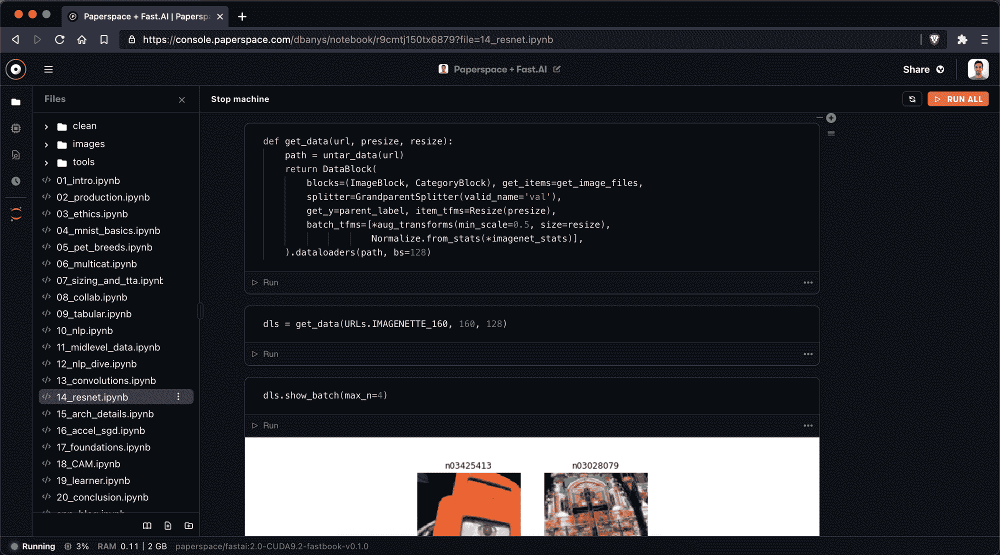
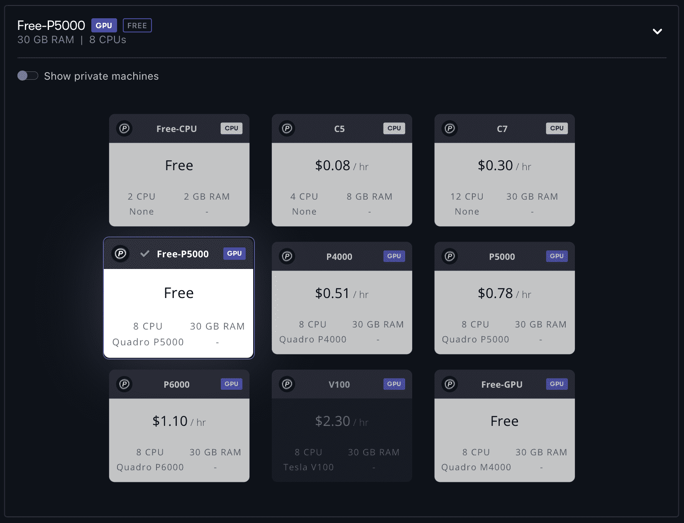
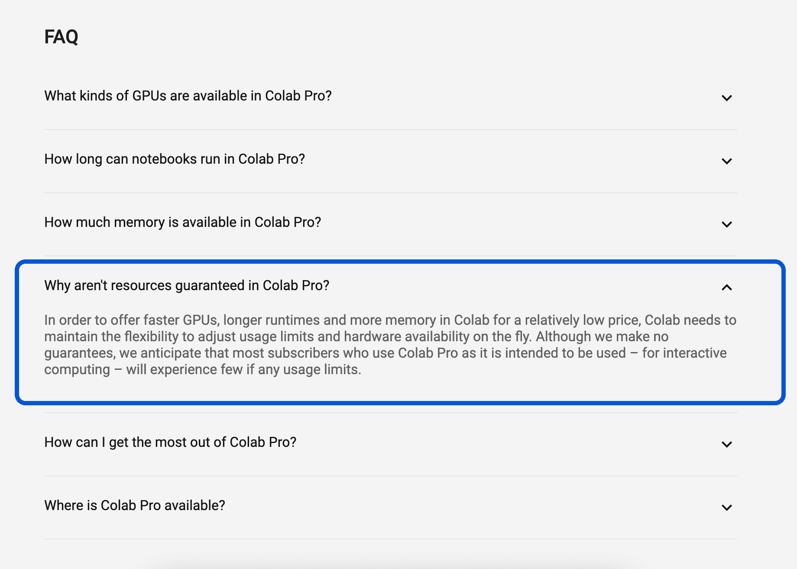
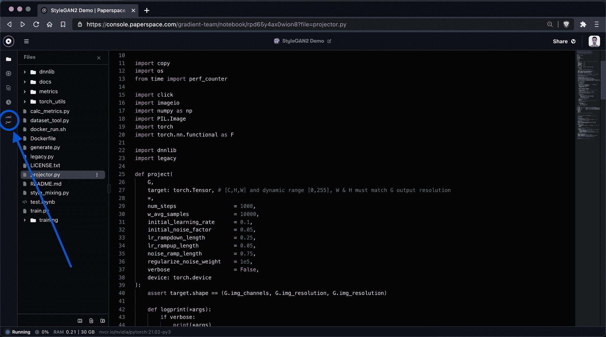
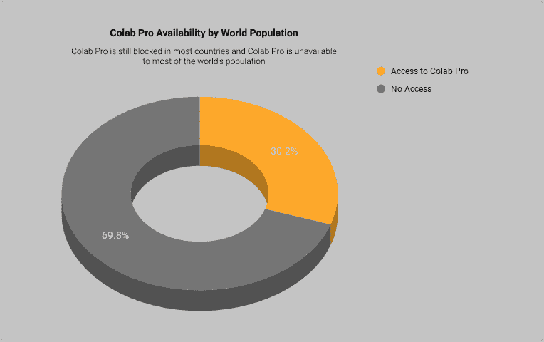

# Colab Pro 的替代品:比较谷歌的 Jupyter 笔记本和渐变笔记本(更新！)

> 原文：<https://blog.paperspace.com/alternative-to-google-colab-pro/>

## 更新于 2022 年 12 月 22 日

澄清一下，升级到专业团队或成长计划不会让每个团队成员在任何给定的时间访问单独的免费 GPU 笔记本电脑。

## 更新于 2022 年 7 月 11 日

我们用一堆关于 Google Colab 和 Paperspace Gradient 的新信息更新了这篇博客文章。特别是，我们添加了有关 Google Colab Pro+计划以及 Paperspace Gradient Pro 和 Gradient Growth 计划的信息。我们还更新了免费的渐变 GPU，以包括新的免费 NVIDIA Ampere A4000、A5000 和 A6000 机器。

## 介绍

谷歌合作实验室可能是世界上最受欢迎的托管 Jupyter 笔记本服务。Colab 对于数百万用户来说是一个很有吸引力的选择，因为它是免费的，只需要一个谷歌账户就可以访问，并且通常具有不错的速度和可用性。

然而，谷歌 Colab 有许多缺点——特别是在免费计划的限制、GPU 可用性和性能的限制以及 Colab 版本的 Jupyter 笔记本界面的限制方面。

Colab 的免费 GPU 实例(最常见的是 2014 年发布的 K80 GPUs)动力不足。连接可能不可靠，因为实例会频繁断开连接，或者在不活动期间被其他用户抢占。并且实例通常没有足够的 RAM——尤其是在处理较大的数据集时。

在 2017 年公开发布谷歌 Colab 之后，谷歌于 2020 年初在[发布了](https://9to5google.com/2020/02/08/google-introduces-colab-pro/) [Colab Pro](https://colab.research.google.com/signup) ，价格为 9.99 美元/月，提供更高的规格，包括更快的 GPU、有保证的运行时间和可用性以及额外的 RAM。

然后在 2021 年，[谷歌发布了 Colab Pro+](https://towardsdatascience.com/google-colab-pro-is-it-worth-49-99-c542770b8e56) ，以 49.99 美元/月的价格提供了更高的规格。

Colab Pro 和 Colab Pro+为机器学习工程师和数据科学家解决了许多问题——更快的 GPU、更长的会话、更少的中断、终端访问和额外的 RAM——但是 Colab Pro 产品仍然在许多方面受到限制:

*   Colab Pro 和 Pro+仅面向少数国家的居民
*   Colab Pro 和 Pro+将 GPU 限制在英伟达 P100 或 T4
*   Colab Pro 将 RAM 限制为 32 GB，而 Pro+将 RAM 限制为 52 GB
*   Colab Pro 和 Pro+将会话限制为 24 小时
*   Colab Pro 不提供后台执行，而 Pro+提供
*   Colab Pro 和 Pro+ do *not* 提供 JupyterLab 的完整版本
*   Colab Pro 和 Pro+ do *not* 保证资源，因此您的实例可能不可用

在这篇博文中，我们将尽力强调 Google Colab Pro 和 Colab Pro+的弱点，并提出 Paperspace Gradient 作为 Colab 的替代方案。

我们的经验借鉴了多年来为成千上万的机器学习工程师和数据科学家提供名为 [Paperspace Gradient](https://gradient.paperspace.com/free-gpu) 的 Google Colab 和 Colab Pro 计划的替代方案的成功经验。

让我们开始吧！

## 引入纸张空间渐变作为 Colab Pro 的替代方案

Paperspace 的渐变笔记本是谷歌 Colab 的一个有吸引力的替代品。Gradient 笔记本受到全球数十万开发人员和数据科学家的信任，Gradient 是全球最受欢迎的深度学习课程-[fast . ai](https://www.fast.ai/)的[推荐](https://course.fast.ai/start_gradient)云笔记本之一。

渐变笔记本提供的一些功能是 Colab Pro 甚至 Colab Pro+所不具备的:

*   更广泛的 GPU 选择，包括 NVIDIA V100 和 A100
*   更多内存(每个实例高达 90 GB)
*   JupyterLab 的完整版本随时可用
*   更多 CPU(8 个虚拟 CPU，而 Google Colab Pro 只有 2 个虚拟 CPU)
*   会话不可中断/抢占
*   无闲置惩罚

Running Fast.ai in Paperspace Gradient

让我们进行一些比较。

## 定价

Google Colab 免费，Google Colab Pro 9.99 美元/月，Google Colab Pro+49.99 美元/月。

Gradient 分为免费和付费两个等级，具体描述如下:

| 梯度订阅类型 | 费用 | 细节 |
| --- | --- | --- |
| 自由的 | 0 美元/月 | -仅免费实例
-笔记本是公共的
-限制 1 台并发笔记本
-限制每次会话最多 12 小时
- 5GB 持久存储
-免费 M4000 GPU |
| 专业(个人) | 8 美元/月 | -免费和付费实例
-私人笔记本
-限制 3 个并发笔记本
-无限会话长度
- 15GB 持久存储
-在私人工作区访问免费 GPU
-免费 M4000 GPU
-免费 P4000 GPU
-免费 RTX4000 GPU
-免费 P5000 GPU
-免费 RTX5000 GPU
-免费 A4000 GPU |
| 职业(团队) | 12 美元/月 | -免费和付费实例
-私人笔记本
-限制 3 个并发笔记本
-无限会话长度
- 15GB 持久存储
-在私人工作区访问免费 GPU
-免费 M4000 GPU
-免费 P4000 GPU
-免费 RTX4000 GPU
-免费 P5000 GPU
-免费 RTX5000 GPU
-免费 A4000 GPU |
| 成长(团队) | 39 美元/用户/月 | -免费和付费实例
-私人笔记本
-限制 10 个并发笔记本
-无限会话长度
- 50GB 持久存储
-在私人工作区访问免费 GPU
-免费 M4000 GPU
-免费 P4000 GPU
-免费 RTX4000 GPU
-免费 P5000 GPU
-免费 RTX5000 GPU
-免费 A4000 GPU
-免费 a 5000 GPU
 |

梯度实例定价如下所示:

| 实例类型 | 每小时价格 |
| --- | --- |
| M4000(所有计划均免费) | 每小时 0.45 美元 |
| P4000(专业版/增长版免费) | 每小时 0.51 美元 |
| P5000(专业版/增长版免费) | 每小时 0.78 美元 |
| P6000(专业版/增长版免费) | 每小时 1.10 美元 |
| RTX4000(专业版/增长版免费) | 每小时 0.56 美元 |
| RTX5000(专业版/增长版免费) | 每小时 0.82 美元 |
| A4000(专业版/增长版免费) | 每小时 0.76 美元 |
| A5000(增长时免费) | 每小时 1.38 美元 |
| A6000(增长时免费) | 每小时 1.89 美元 |
| A100(增长时免费) | 每小时 3.09 美元 |
| V100 | 每小时 2.30 美元 |
| A4000 x2(仅适用于增长型) | 每小时 1.52 美元 |
| A5000 x2(仅在增长时提供) | 每小时 2.76 美元 |
| A6000 x2(仅在增长时提供) | 每小时 3.78 美元 |
| A100 x2(仅适用于增长型) | 每小时 6.18 美元 |

## 系统规格

首先，让我们看看您将从 Colab、Colab Pro 和 Colab Pro+获得的实例类型的系统规格。

最值得注意的是，大多数免费的 Colab 会话将使用 K80 GPU 和 12 GB 的 RAM 进行初始化。

| 特征 | Google Colab | Google Colab Pro | Google Colab Pro+ |
| --- | --- | --- | --- |
| 绘图处理器 | 大多是 K80 | K80 | T4 P100，V100 |
| 中央处理器（central processing units 的缩写） | 2 个 vCPU | 2 个 vCPU | 2 个 vCPU |
| 随机存取存储 | 大部分是 12GB | 32GB | 52GB |
| 有保证的资源 | 不 | 不 | 不 |
| 价格 | 自由的 | 9.99 美元/月 | 49.99 美元/月 |

同时，在 Paperspace Gradient 中，GPU 实例将始终配备至少 8 个 vCPUs 和 30 GB RAM，甚至是免费实例！

When you create a new notebook with Gradient, you select a Free or Paid instance.

## GPU 实例比较

说到 GPU，Google Colab、Colab Pro 和 Colab Pro+都不会让你选择你的 GPU 类型。相反，谷歌会给你分配一个 GPU。这种 GPU 通常是谷歌 Colab 上的 K80(2014 年发布)，而 Colab Pro 将主要提供 T4 和 V100 GPUss，Colab Pro+将提供 T4、P100 或 V100 GPU。

即使在付费的 Colab Pro 帐户上，也不知道哪个 GPU 会出现，这可能会令人沮丧。由于每个 GPU 的行为可能略有不同，这导致了兼容性和可再现性方面的许多问题。

### Colab、Colab Pro 和 Colab Pro+中提供的 GPU

| 国家政治保卫局。参见 OGPU | 价格 | 体系结构 | 发布年份 | GPU 框架 | 中央处理器（central processing units 的缩写） | 系统内存 | 当前街道价格(2022 年) |
| --- | --- | --- | --- | --- | --- | --- | --- |
| K80 | 免费(Colab 免费层) | 开普勒 | Two thousand and fourteen | 12 GB | 2 个 vCPU | 13 GB | $349 |
| T4 | 9.99 美元/月(Colab Pro) | 图灵 | Two thousand and eighteen | 16 GB | 2 个 vCPU | 13 GB 可升级至 25 GB | $1,797 |
| P100 | 9.99 美元/月(Colab 免费版和 Colab 专业版) | 帕 | Two thousand and sixteen | 16 GB | 2 个 vCPU | 13 GB 可升级至 25 GB | $3,053 |
| V100 | 49.99 美元/月(Colab Pro+) | 沃尔特河 | Two thousand and eighteen | 16 GB | 2 个 vCPU | 高达 52 GB 内存 | $3,775 |

相比之下，Paperspace 提供了所有云 GPU 提供商的大多数 GPU 类型，包括许多在不同计划中免费提供的实例。

### 渐变笔记本中可用的 GPU

| 国家政治保卫局。参见 OGPU | 价格 | 体系结构 | 发布年份 | GPU 框架 | 中央处理器（central processing units 的缩写） | 系统内存 | 当前街道价格(2022 年) |
| --- | --- | --- | --- | --- | --- | --- | --- |
| M4000 | 自由(梯度自由层) | 麦克斯韦 | Two thousand and fifteen | 8 GB | 8 个 vCPU | 30 GB | $433 |
| P4000 | 8 美元/月(渐变专业版) | 帕 | Two thousand and seventeen | 8 GB | 8 个 vCPU | 30 GB | $859 |
| P5000 | 8 美元/月(渐变专业版) | 帕 | Two thousand and sixteen | 16 GB | 8 个 vCPU | 30 GB | $1,795 |
| RTX4000 | 8 美元/月(渐变专业版) | 图灵 | Two thousand and eighteen | 8 GB | 8 个 vCPU | 30 GB | $1,247 |
| RTX5000 | 8 美元/月(渐变专业版) | 图灵 | Two thousand and eighteen | 16 GB | 8 个 vCPU | 30 GB | $2,649 |
| A4000 | 8 美元/月(渐变专业版) | 安培 | Two thousand and twenty-one | 16 GB | 8 个 vCPU | 45 GB | $1,099 |
| A5000 | 39 美元/月(梯度增长) | 安培 | Two thousand and twenty-one | 24 GB | 8 个 vCPU | 45 GB | $2,516 |
| A6000 | 39 美元/月(梯度增长) | 安培 | Two thousand and twenty | 48 GB | 8 个 vCPU | 45 GB | $4,599 |

## RAM 比较

自由层 Colab 几乎总是提供约 12 GB 的 RAM，对具有 25 GB RAM 的高内存虚拟机的访问受到限制。Colab Pro 提高了高内存虚拟机(32 GB RAM)的可用性，而 Colab Pro+将高内存虚拟机扩展到 52 GB RAM。

或者，Paperspace 确保所有实例至少有 30 GB RAM。在 A100 的情况下，纸空间梯度实例达到 90 GB RAM。在 A4000、A5000 和 A6000 的情况下，免费 GPU 高达 45 GB RAM。

| Google Colab | Google Colab Pro | Google Colab Pro+ | 渐变笔记本 |
| --- | --- | --- | --- |
| 大多数标准虚拟机具有 12 GB 内存 | 主要是具有 25 GB RAM 的高内存虚拟机 | 高达 52 GB 内存 | 所有实例都至少有 30 GB 内存，通常有 45 GB 内存，甚至高达 90 GB 内存 |

## 资源没有保证

Colab 和 Colab Pro 都不保证资源。这在 Colab 文献中被多次提及，是许多 Colab 用户烦恼的主要原因。

Source: Google Colab FAQs (https://colab.research.google.com)

“资源得不到保证”意味着谷歌可以在任何时候以任何理由断开你的实例。正如许多 Colab 用户可以证明的那样——这似乎经常发生！

我们听过无数这样的故事，用户因为几分钟的不活动，或者因为资源耗尽，或者任何看似随意的原因而被从 Colab 实例中引导出来。即使你已经为 Colab Pro 支付了费用，但仍被“抢先”的挫败感是真实存在的。

另一方面，Paperspace 不会抢占您的实例。运行实例后，只有达到自动关闭限制或手动关闭实例时，会话才会结束。如果您正在运行一个[自由实例](https://gradient.paperspace.com/free-gpu)，自动关机将被设置为 6 小时。

## 时间限制比较

为了说明 Colab、Colab Pro 和 Gradient 笔记本之间的一些时间管理差异，让我们参考下表:

| Google Colab | Google Colab Pro | 渐变笔记本 |
| --- | --- | --- |
| 最长 12 小时的会话持续时间 | 最长 24 小时的会话持续时间 | 没有最大会话持续时间 |
| 不活动几分钟后被抢先 | 不活动几分钟后被抢先 | 从不抢先 |
| 没有自动关机 | 没有自动关机 | 自定义自动关机时间间隔 |

最大的区别是，一旦你在 Gradient 上获得了一个实例，不像 Colab，你将不会违背自己的意愿从这个实例上启动。

## 在 JupyterLab 上放置包装器的架构和基本限制

Google Colab 和 Colab Pro 都是 JupyterLab 的有限实现——基本上是核心 Jupyter 功能的一个薄薄的包装。Colab 和 Colab Pro 提供了与 JupyterLab 相同的功能，但封装更精简，选项更少。

Gradient 还提供了一个定制的 IDE，它是 JupyterLab 之上的一个包装器。该 IDE 旨在为笔记本电脑带来强大的 Paperspace 功能，如实例选择、数据管理等。

但是梯度笔记本*和*提供了完整的*版本的 JupyterLab，如果你需要的话随时可以使用。*

The toggle to open a notebook in JupyterLab is available in the lefthand sidebar of any running notebook on Gradient

从这个意义上说，渐变笔记本不仅在简单性方面可以与 Colab 和 Colab Pro 相媲美，而且还可以与功能更全面的 JupyterLab 体验相媲美，如谷歌的 [GCP 人工智能平台笔记本](https://blog.paperspace.com/google-cloud-platform-notebooks/)，微软的 [Azure ML 笔记本](https://blog.paperspace.com/azure-machine-learning-jupyter-notebooks-comparison-alternative/)，或亚马逊的 [AWS SageMaker Studio 笔记本](https://blog.paperspace.com/sagemaker-studio-notebooks-alternative-comparison/)。

## 有效性

当 Colab Pro 在 2020 年推出时，许多人面临的一个巨大难题是区域可用性。最初发布 Colab Pro 的国家是:

| Colab Pro 最初上市的国家 |
| --- |
| 美利坚合众国 |
| 加拿大 |

截至 2021 年 3 月日[，Colab Pro 已扩展到以下国家:](https://buggyprogrammer.com/colab-is-now-available-in-7-more-countries/)

| 最近推出 Colab Pro 的国家 |
| --- |
| 日本 |
| 巴西 |
| 德国 |
| 法国 |
| 印度 |
| 联合王国 |
| 泰国 |

虽然 Colab Pro 最近向更多国家的用户开放是一个好迹象，但 Colab Pro 在这个星球上的大多数国家仍然被封锁。

Google Colab Pro is blocked in all but 9 countries

同时，Paperspace 不会阻止任何国家的用户访问。Paperspace 目前有[三个数据中心](https://support.paperspace.com/hc/en-us/articles/236360708-Where-are-Paperspace-datacenter-regions-located-)(美国西部、美国东部和欧盟)，并计划在未来增加数据中心。

我们还听到许多用户说，即使 Paperspace 实例不在 Paperspace 数据中心附近，它们的性能也比 Colab 实例高得多！

## 预加载的依赖项

Colab Pro 和 Gradient 笔记本都预装了一些流行的依赖项和库。Colab Pro 实例预装了大约 380 个依赖项，而 Gradient 笔记本预装了大约 220 个依赖项。

最大的不同是，Colab 笔记本预装了大量谷歌特有的库和包。

## 支持

无论你在 Paperspace 上运行什么样的实例——是免费的 CPU 实例，还是免费的 P5000 实例，还是强大的 V100 付费实例——友好而有帮助的支持团队总是在[一条消息](https://support.paperspace.com/hc/en-us/requests/new)之外。

在 Paperspace，我们的平均回应时间(MTTR)只有几个小时。

如果你需要 Google 对 Colab 产品的支持，那么祝你好运！

## 结论

如果您正在寻找 Colab Pro 或 Colab Pro+的替代产品，它不会抢占您(中断您的实例)，不会任意降低您的实例，会为您提供更多 RAM、更多 CPUs 个 vcpu 对 2 个 vcpu)，完整的*JupyterLab 体验，并且不会基于您的国家/地区阻止您-您可能想要尝试一下渐变笔记本。*

渐变笔记本将永远有一个[自由层计划](https://gradient.paperspace.com/free-gpu)，并将永远得到一个由工程师和机器学习爱好者组成的[友好团队](https://www.paperspace.com/about)的支持，他们正在努力使启动和运行 ML 项目变得更容易。