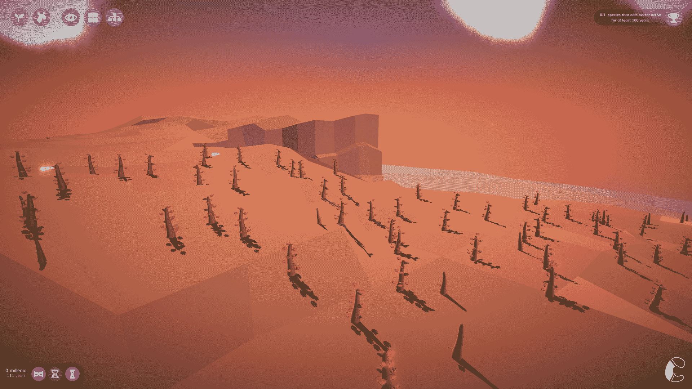
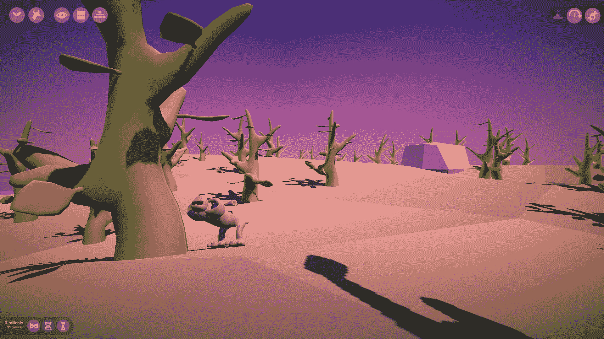
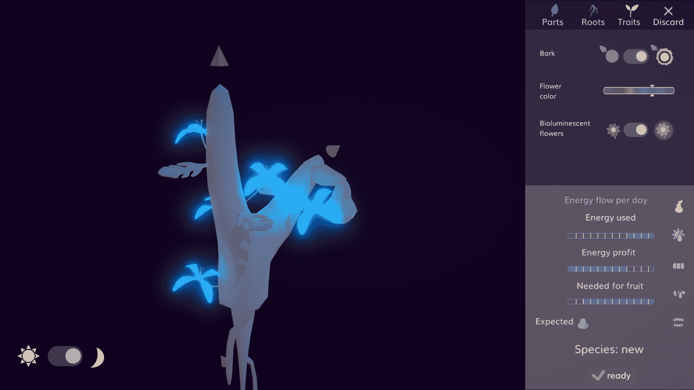
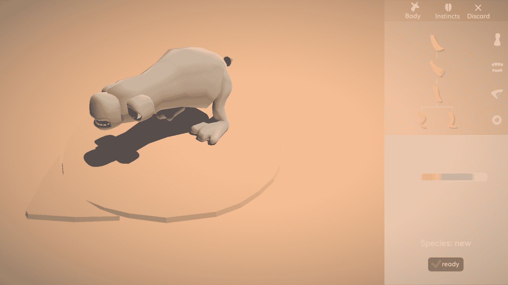

# 游戏的发展

> 原文：<https://blog.paperspace.com/an-evolution-in-gaming/>

有没有发现自己被一部关于地球上你从来不知道存在的一面的纪录片迷住了？如果有一个模拟地球进化的游戏会怎么样？你会介绍哪种动植物？新物种会是共生的吗，或者你会在不知不觉中创造入侵物种吗？你会建造什么样的星球？

我们开始思考这些问题是因为我们遇到了[韦塞尔·斯托普](http://wesselstoop.ruhosting.nl/)，一款叫做[小树苗](https://thesaplinggame.com/)的令人惊叹的新游戏的创造者。在 Sapling 中，您可以创建完全可定制的植物和动物变体，以了解它们是如何进化的——随着时代的推移，环境会根据您所创建的有机体的固有品质而发生变化。有了这样一个雄心勃勃的，复杂的，令人兴奋的游戏概念，我们很高兴了解更多关于韦塞尔的创作过程和背景！

***Paperspace:*** 我们爱你的游戏！我们很多人在成长过程中都玩过一个叫做[孢子](https://www.spore.com/)的游戏。你知道那个游戏吗？小树苗看起来就像那个游戏应该有的样子！你有没有可能从那个游戏中得到什么灵感？

***俯身:*** 当然，当我第一次看到威尔·莱特呈现孢子的视频时，我是不敢相信的。这是模拟游戏的教父，他发明了我最喜欢的两个游戏([模拟城市](https://www.ea.com/games/simcity/simcity)和[模拟人生](https://www.ea.com/games/the-sims))...这是做这件事的最佳人选！最后，孢子做了很多非常正确的事情，它甚至同时是多种游戏类型——但模拟不是其中之一。

然而，Spore 的 creator 确实改变了我对玩家如何轻松创建好看的生物的想法，我的程序动画系统(不管生物有多少条腿、嘴和眼睛，都可以计算出它如何移动的系统)是基于 Spore 团队关于他们如何做到这一点的科学出版物。

***Paperspace:*** 哇，这个故事真棒。在我们开始开发 Sapling 之前，我们能问一下最初是什么让你对游戏和机器学习领域感兴趣的吗？

***俯身:*** 我学的是语言学，专业是语言技术。在语言技术领域，如今无法避免机器学习，所以这就是我了解它的地方。我对它着迷的原因和我对模拟游戏着迷的原因是一样的:我认为计算机可以自己做一些事情，无论是学习还是模拟，这太棒了。当然，机器学习的进化变体(如强化学习)是最酷的。

***Paperspace:*** 同样让你痴迷的树苗之前的最后一个项目是什么？是游戏、研究、写作还是软件项目？

***俯身* :** 那是一个研究/写作/软件项目，我根据人们之前的推文预测他们的推文；我在这里发布了一下:[https://pudding . cool/2019/04/text-prediction/](https://pudding.cool/2019/04/text-prediction/)。

***Paperspace:*** 推文预测器太有意思了(强烈推荐你[去看看](https://pudding.cool/2019/04/text-prediction/))。从事语言学工作，你对人类有什么总体的了解吗？你基本上把我们所有的想法作为一个数据集？

***俯身:*** 那个项目的一个重要洞察是社交网络的力量:如果你认识某人的朋友，你的机器学习模型会比你不认识的人更好地预测这个人将要说什么。当我看到谁对这个游戏感兴趣时，正是这些网络让我感到惊讶。例如，我的一些推文几乎没人关注，而另一些被转发，被一群新的人看到，并得到更多的转发，所以你可以看到人们对游戏的兴趣从一群人跳到另一群人。

***Paperspace:*** 你能告诉我们更多关于你是如何开发这个游戏的吗？你期望游戏是什么样的？这个游戏可以有很多种玩法！似乎有无穷无尽的可能性。

这个游戏是我在空闲时间开发的，大部分时间是在清晨，当我的家人还在睡觉的时候，以及在乘火车去上班的漫长旅途中。在整个开发过程中，我经常进行游戏测试，以确保游戏对除我之外的其他人来说是有趣的…最初的结果非常令人沮丧，游戏测试者最终非常沮丧。出于某种原因，我仍然有动力将他们的沮丧转化为我的优势，并注意到对游戏的反应开始慢慢但稳定地变得更加积极。

至于我对游戏未来的预期，上次主要更新的重点是植物，所以现在我想把重点放在动物上。我计划的细节现在仍然是个秘密，所以当我改变主意时，我不会让任何人失望。此外，看到玩家和我交谈(我现在几乎每天都收到热情玩家的想法)以及他们之间谈论他们想要什么，真的很有启发。我不想在讨论中加入官方的声音。

***Paperspace:*** 你从 playtesters 那里收到过哪些最好的反馈？真正的游戏玩家最兴奋的是什么？

***Stoop:*** 很多人都说了关于游戏非常不同的有用的东西:例如，同样是游戏程序员的 playtesters 很快专注于模拟系统的细节，而更艺术的人则和我谈论他们是否发现植物/编辑器创作工具直观易用，等等。对于真正的游戏玩家来说也是如此:一些人在编辑器中花费数小时来创造最美丽的植物，另一些人将游戏用作可爱的宠物模拟器(无法忘记他们动物的宝宝看起来有多可爱)，而另一些人则对他们如何设计整个生态系统并观察它如何互动感到兴奋。我想象人工智能爱好者会兴奋地设计他们的个性化生态系统，然后让他们的创作自己运行和迭代。

我收到了荷兰著名设计师 Adriaan de Jongh 的建议，这确实提高了游戏的水平。他鼓励我加“果汁”。这就是让游戏*感觉*好的现象。例如，当你移动和点击鼠标时，会发出令人满意的嘶嘶声、气泡和闪光。一旦我让我的游戏变得更加有趣(例如，当你放置一株植物时会出现一个小尘云，当你在编辑器中添加一个水果时它会立即开始生长，等等)，玩家们反应的差异是惊人的。这是游戏发展和我对游戏设计的思考的一个真正的转折点。

***Paperspace:*** 在设计幼树游戏或游戏玩法时，你有没有设想 ML 的用例？例如，确定游戏过程中发生的突变？

***俯身:*** 一个有趣的问题，其实也是我时常思考的事情。我看过一些基于机器学习的非常酷的程序化行走动画，所以我可能会在那里使用它！

至于玩游戏，据我所知，除了创造一个真正优秀的人工智能对手，还没有人想出如何将机器学习集成到实际的游戏中。我希望有一天成为改变这一切的人，但我还不知道如何改变。

[https://www.youtube.com/embed/_aglK-7GFCI?feature=oembed](https://www.youtube.com/embed/_aglK-7GFCI?feature=oembed)

***Paperspace:*** 如果你能够毫无障碍地改变动画风格，你理想中的游戏会是什么样子？

如果给我无限的时间，我会改变它，使它不再是一个“一刀切”的系统，而是更加专业化，以适应(1)动物和(2)动画播放时的环境。例如，如果重的动物与小而瘦的动物移动方式不同，我会很高兴；或者当一只动物吃花的花蜜时，它真的把它的长鼻放在花里面，而不是仅仅向花的方向移动...如果系统检测到动物有一条又长又细的尾巴，然后让*用*这条尾巴从树上摘水果，那不是很酷吗？问题是，像这样的东西开发起来非常复杂，我不认为它们一定会引起更多人的兴趣。

***paper space*:**paper space 是如何融入你的游戏开发过程的？

***俯身:*** 模拟一个完整的生态系统并同时可视化它(屏幕上有数百个移动的东西)变得真的很慢很快。我在一台预算有限的电脑上开发游戏，所以我不断被提醒优化，优化，然后再优化，以保持事情顺利进行。但是时不时的，我想知道游戏是如何在一个有着花哨 GPU 的强大机器上运行的。比如在制作最新预告片的时候，我就想用最高设置来炫耀游戏，同时录下画面。有了 Paperspace，我只需花几欧元就能拥有一个强大的 GPU 比买一个便宜多了。

我应该补充一点，在我尝试之前，我并不确定事情是否会成功，但当我尝试时，我被整个体验的简单和流畅所震惊。Paperspace 的 UI 真的很干净清晰；你只需点击“开始”,你就会在浏览器中看到一个桌面。它只是工作。

***Paperspace:*** 我们在哪里可以了解更多关于树苗和您的其他项目的信息？

**小树苗有一个专门的[*推特账号*](https://twitter.com/thesaplinggame )*[*时事通讯*](http://thesaplinggame.com/newsletter)*[*Youtube 频道*](https://www.youtube.com/channel/UCDRJbyCWc9cXEbdWWQf8krQ)*上面有关于游戏的最新资讯。

可以在 [Steam](https://store.steampowered.com/app/997380/The_Sapling/) 或者 [Itch](https://woseseltops.itch.io/thesapling) 上找到游戏购买。我们希望您尝试一下！*****

> *****在 http://wesselstoop.ruhosting.nl/的网站上关注 T4，确保与 T2·韦塞尔·斯托普保持联系*****