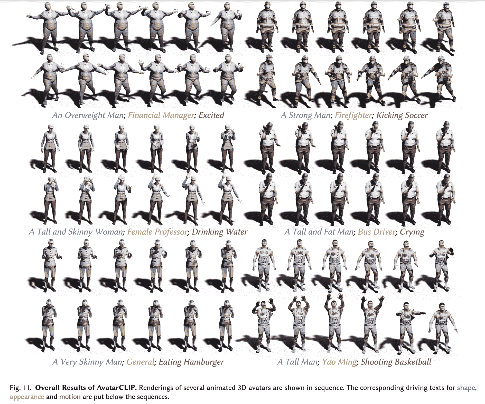
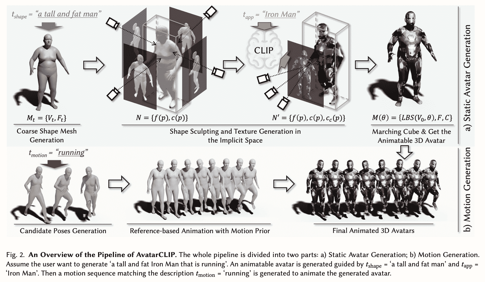
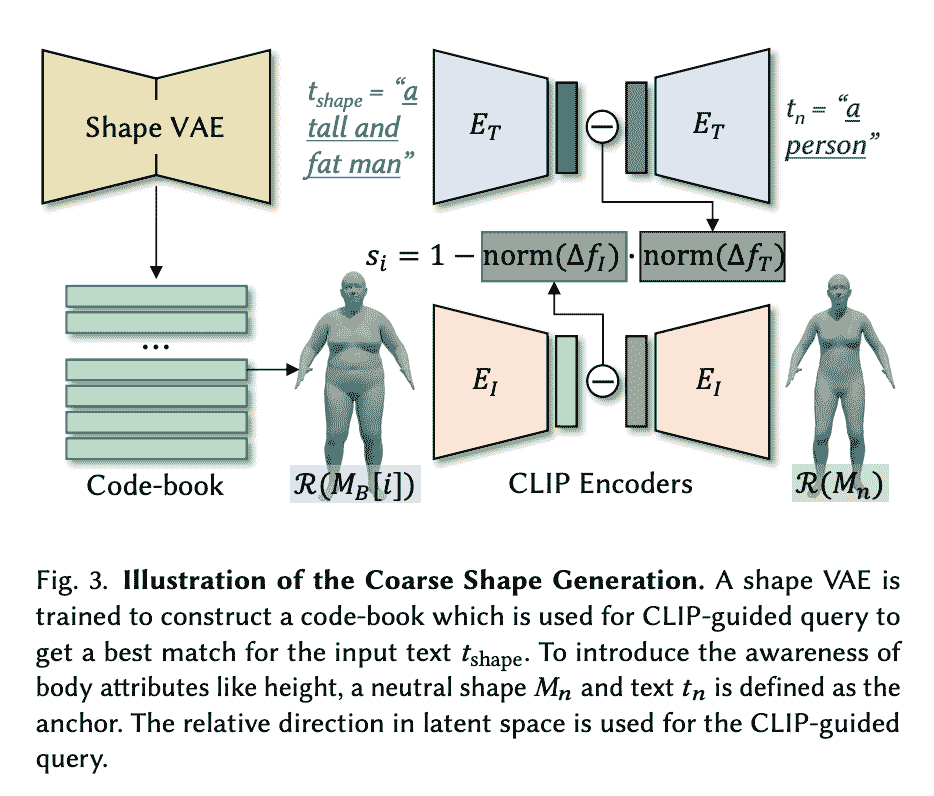
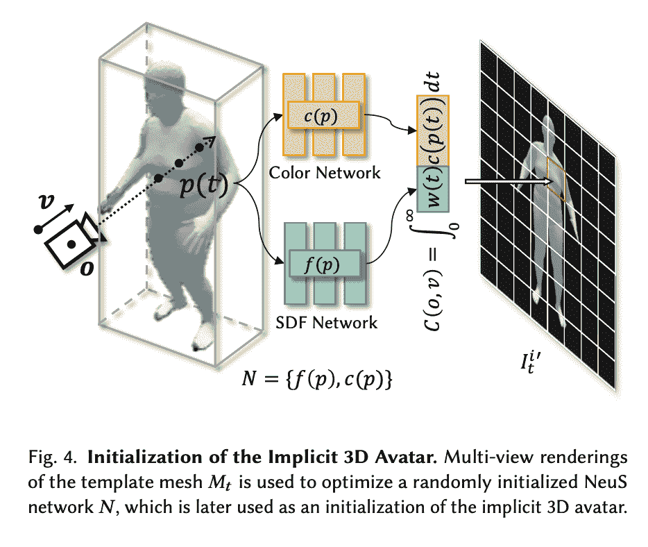
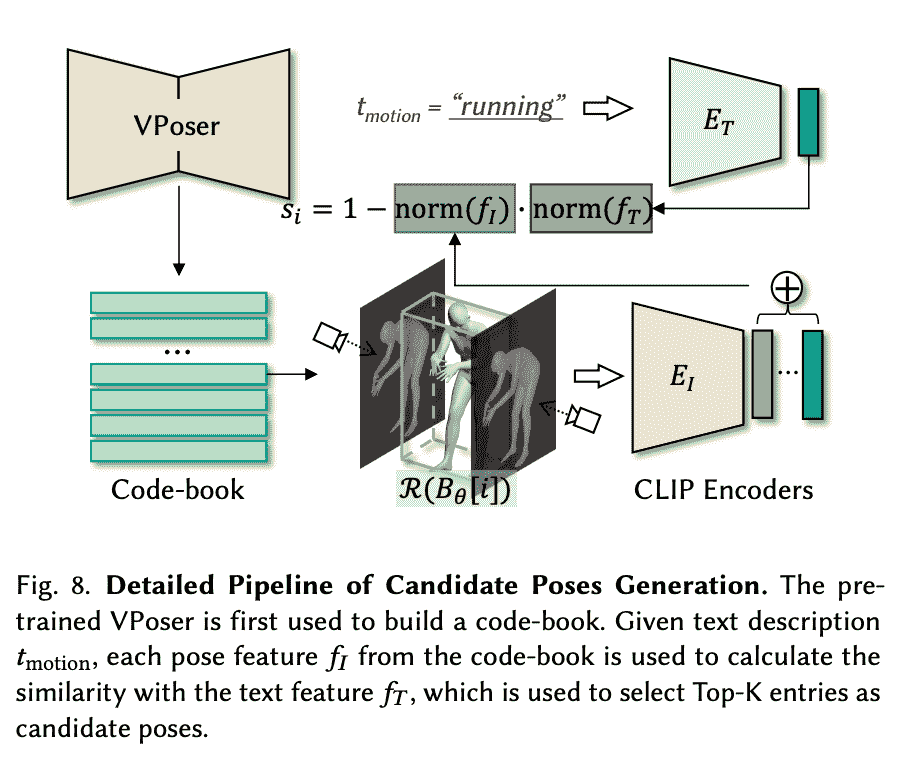
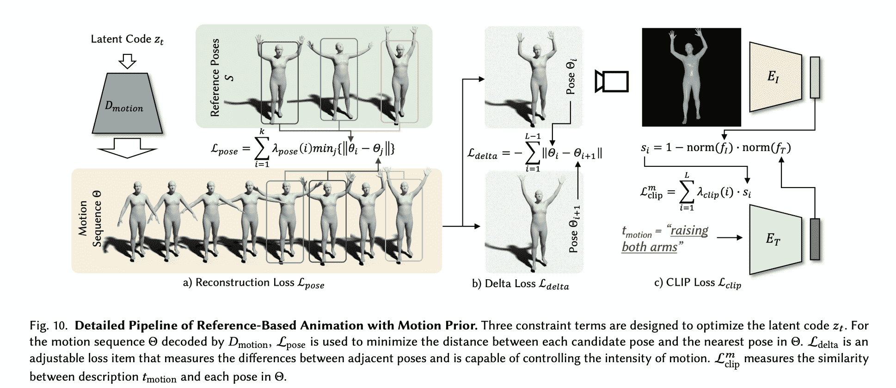

# 使用 AvatarCLIP 在渐变中创建动画 3D 角色(第 1 部分)

> 原文：<https://blog.paperspace.com/animated-3d-characters-with-avatarclip-part-1/>

深度学习最大的承诺之一是生成媒体的出现。这很大程度上是因为生成媒体是目前这些框架提供的最容易赚钱的解决方案之一。生成的媒体，无论是视频、音频、文本还是其他格式，都有可能被转换为用于各种不同目的的内容。通过利用这种创造力，我们可以在相关任务上自动化很大一部分创作过程，而且技术还没有达到这种程度，即这些内容有时甚至无法与真正的人类演员制作的内容区分开来。对于 NLP 和计算机视觉相关的任务来说尤其如此。

动画是尚未被彻底改变的领域之一。深度学习并没有触及动画，因为一些有进取心的工程师已经想出了[新颖的方法来输入指令以制作现有 3D 人物](https://github.com/sebastianstarke/AI4Animation) &的动画，相反，其他人已经创建了生成[新颖的方法，静态 3D 模型的纹理](https://openaccess.thecvf.com/content_CVPRW_2019/papers/3D-WidDGET/Amit_Raj_Learning_to_Generate_Textures_on_3D_Meshes_CVPRW_2019_paper.pdf)。尽管如此，使用一个简单的文本提示来生成一个完整的 3D 动画人物的想法直到现在还是一个未来的承诺。

承担这项任务的令人兴奋的新项目是 AvatarCLIP。由洪、、、蔡中昂、雷阳和撰写的[原始论文](https://arxiv.org/pdf/2205.08535.pdf)展示了他们创新的新方法，即根据文本提示生成粗糙的 SMPL(带皮肤的多人线性)模型人物、纹理和造型，然后仅使用文本提示将它制作成动画以执行一些运动。它通过与 OpenAI 的 CLIP(一种更聪明的架构)的巧妙集成来实现这一点。

在 AvatarCLIP 的第一部分，我们将检查他们生成初始 SMPL 模型的方法，并使用 CLIP 对其进行纹理处理。然后，我们将展示如何在渐变笔记本中使用这种技术，从一个示例配置中生成一个静态模型:来自 One Punch Man 的 Saitama。在第 2 部分中，我们将研究动画人物来完成完整的 AvatarCLIP 管道。

# AvatarCLIP



[Source](https://arxiv.org/pdf/2205.08535.pdf)

AvatarCLIP 以一系列明确定义的步骤工作，这些步骤共同形成了一个管道，使小说创作充满活力。正如我们在上面的示例图像中所看到的，这基本上分为三个步骤，首先创建初始图形，然后对其进行纹理处理和雕刻，以匹配提示中的描述符元素，最后 Marching Cube 算法将应用输入的运动提示来制作图形的动画。我们将在本文中检查完整的管道，但是值得注意的是，动画人物的代码正在积极开发中。因此，代码的动画部分将在发布时被覆盖。敬请关注第 2 部分，在 Twitter @ paper space 上关注我们。

## 它是如何工作的

[https://www.youtube.com/embed/-l2ZMeoASGY?feature=oembed](https://www.youtube.com/embed/-l2ZMeoASGY?feature=oembed)

在上面的视频中，来自项目作者，他们展示了文本驱动的头像生成和动画的专有界面。按照我们上面描述的步骤，他们展示了各种各样的角色可以被建模和动画化。我们来分析一下这是怎么回事。

首先，AvatarCLIP 生成一个粗略的形状网格，用作基线图形。网格是描述 3D 对象形状的顶点、边和面的集合。剪裁模型采用形状文本提示来确定图形应使用的基础形状。这个基线图是我们的起点，但它是灰色的，没有什么特点。基于外观和形状文本提示，在下一阶段应用纹理和雕刻。同时，剪辑模型解释运动文本提示，以找到人物将跟随的运动的描述性元素。然后，它会根据这些运动提示为模型生成一系列适当的参考姿势。AvatarCLIP 然后通过在参考姿势的时间轴上移动现在有纹理的人物来集成这两个管道的功能，从而产生人物的连贯动画。

## 体系结构



An overview of the pipeline from the original paper - [Source](https://arxiv.org/pdf/2205.08535.pdf)

现在我们已经了解了 AvatarCLIP 的情况，让我们检查一下这个管道，以便更好地了解集成模型管道是如何实现的。我们需要理解的第一件事是，这处于两个基本阶段:化身生成和动作生成。让我们更仔细地看看每一个阶段，看看每一个阶段的生成是如何实现的。(在代码演示部分，我们将在本系列的第一部分中讨论前者。第 2 部分将介绍运动生成。)

AvatarCLIP 的总体目标是创建一个“零镜头文本驱动的 3D 化身生成和动画。”换句话说，他们需要该模型能够处理超出其训练范式范围的提示，并具有足够的灵活性来处理未知术语。幸运的是，CLIP 很好地覆盖了文本部分。

为此，他们从文本形式的自然语言输入入手，其中 text = { **t** shape， **t** app， **t** motion}。这是三个独立的文本提示，对应于我们希望用于最终动画的所需身体形状、外观和运动的描述。

### 粗略的化身生成



[Source](https://arxiv.org/pdf/2205.08535.pdf)

前两个提示 **t** shape 和 **t** app 分别用于在动画之前对 SMPL 模型进行纹理和雕刻。为此，代码首先通过形状 VAE 生成一个粗略的 SMPL 图形，该图形被训练为构造一个用于剪辑引导查询的代码簿，以获得输入文本 **t** 形状的最佳匹配。现在我们有了粗略的、未加纹理的图形网格 M *t* 作为我们的基线。

### 精细纹理和雕刻



[Source](https://arxiv.org/pdf/2205.08535.pdf)

然后，作者选择通过将进一步着色和雕刻的步骤分离为两个阶段的过程，来加速人物从粗糙到精细细节的优化。首先，M *t* 用于优化随机初始化的 NeuS 网络 n。这创建了 M *t 的隐式等价表示。*NeuS 网络由两个 MLP 子网络组成。SDF 网络𝑓(𝑝)将某个点𝑝作为输入，并输出到其最近表面的带符号距离。颜色网络𝑐(𝑝)以某个点𝑝为输入，输出该点的颜色。”([来源](https://arxiv.org/pdf/2205.08535.pdf))这些执行一个初步的，更小的重新着色和雕塑的数字。


[Source](https://arxiv.org/pdf/2205.08535.pdf)

在下一阶段，将进行精细的细节设计和雕刻。为了在着色或雕刻能力上不遭受任何损失，作者为初始化的隐式 3D 化身附加了额外的颜色网络用于纹理生成(见上文)。每个颜色网络都与 SDF 网络一起工作，同时执行不同的任务:原始的 *c(p)* 颜色网络和 *f(p)* SDF 网络用于使用来自剪辑文本编码器的指导来重建网格 M *t* 以匹配 **t** app 提示，然后 Cc(p)、附加网络和 SDF 网络 *f(p)* 在剪辑编码图像的指导下执行更精细的细节处理。使用剪辑引导损失，该系统将一起生成在形状和细节方面近似于输入提示的精细细节图形，但是没有姿态。

### 姿势生成



[Source](https://arxiv.org/pdf/2205.08535.pdf)

为了将人物动画化为姿势，我们需要回到生成过程的开始。在进行任何造型或着色之前，他们首先有一个名为 VPoser 的预训练 VAE，使用 AMASS 数据集为提示建立一个代码簿。这是为了尽可能多地收集 SMPL 模特体型的描述性体型。这个代码簿然后被用来指导一系列的候选姿态产生剪辑。这些姿态然后被用于使用运动先验以候选姿态作为参考的运动序列生成。

流水线使用文本描述 **t** motion，其中来自码本的每个姿态特征𝑓𝐼用于计算与文本特征𝑓𝑇的相似性，该相似性用于选择 Top-K 个条目作为候选姿态。这些姿态然后被选择作为要传递到运动动画阶段的候选姿态集。

### 从一系列姿势到动画



[Source](https://arxiv.org/pdf/2205.08535.pdf)

为了捕捉我们可以转移到我们的网格序列中的姿态，运动 VAE 首先被训练来捕捉人类的运动先验。随着预训练的 VAE 现在识别 SMPL 模型中的类人运动，我们可以使用候选姿态𝑆作为参考来优化运动 VAE 的潜在代码。为此，使用三个损失项来优化我们的运动，以更接近地匹配提示。第一个，姿势损失，作为基线。这种损失可以单独用来重建原始姿势，但作者认为这给运动带来了一种看起来不可思议的平滑。为了进一步优化这个损失函数，他们引入了另外两个损失函数来调整损失姿态。增量损失衡量相邻姿势之间的差异，并用于影响运动的强度。最后，丢失剪辑测量 **t** 运动中的描述与序列中每个姿态之间的相似性。总的来说，这些损失函数优化了姿态序列以给我们序列θ，其可用于表示粗略模型姿态的动画步骤。

### 把所有的放在一起

因此，输出由两部分组成。首先，一个用网格表示的可动画化的 3D 化身，M **t** 。这在文中表示为𝑀 = {𝑉、𝐹、𝐶}，其中𝑉是顶点，𝐹代表面，𝐶代表顶点颜色。然后，第二输出是包含期望运动的姿态序列。当组合在一起时，我们得到一个完全成形和有纹理的人物，生成对应于 **t** 形状和 **t** 应用程序，通过从 **t** 动作解释的姿势的时间线移动。

现在让我们在下一节看看如何用代码获得第一个输出。

## AvatarCLIP 代码演示

要在 Gradient 上运行这个，首先在 PyTorch 运行时上启动一个 Gradient 笔记本，使用您喜欢的任何 GPU(尽管值得注意的是，即使在 100-80GB 的计算机上，这也将是一个漫长的训练序列)。然后，您将希望通过切换高级选项开关并将其粘贴到字段中，使该 URL 成为工作区 URL。然后创建笔记本。

在这个演示中，我们将主要演示头像生成的细节和雕刻阶段是如何进行的。

### 设置环境

一旦您的笔记本启动，打开并在终端中输入以下内容，开始设置我们的环境。笔记本上也有描述。

```py
# Needed repos
git clone https://github.com/gradient-ai/AvatarCLIP.git
git clone https://github.com/hongfz16/neural_renderer.git

# First set of requirements, courtesy of author team
pip install -r AvatarCLIP/requirements.txt

# additional installs for Gradient
pip install -U numpy # their requirements.txt has an outdated NumPy install you can fix instead if so desired.
pip install scikit-image

# install neural renderer as package on Gradient
pip install git+https://github.com/hongfz16/neural_renderer

# complete their set up process
%cd neural_renderer
python3 setup.py install
%cd ..

# final housekeeping and setup to display video later
apt-get update && apt-get install libgl1
apt install ffmpeg
```

接下来，去 https://smpl.is.tue.mpg.de/index.html 注册。这是因为我们不能分发 SMPL 模型包给你，但你可以通过注册并同意他们的许可来免费下载。然后，去 https://smpl.is.tue.mpg.de/download.php 下载 SMPL_python_v.1.1.1.zip。一旦你在本地机器上有了它，你就可以把它上传到笔记本，然后在你的终端上运行下面的代码解压它:

```py
unzip SMPL_python_v.1.1.1.zip
```

### 进口

接下来，我们将使用导入的包来运行演示。

```py
# If you not here, make sure the next line is run somewhere in the notebook prior to this 
# %cd /content/AvatarCLIP/AvatarGen/AppearanceGen

# imports
import os
import time
import logging
import argparse
import random
import numpy as np
import cv2 as cv
import trimesh
import torch
import torch.nn.functional as F
from torchvision import transforms
from torch.utils.tensorboard import SummaryWriter
from shutil import copyfile
from icecream import ic
from tqdm import tqdm
from pyhocon import ConfigFactory
from models.dataset import Dataset
from models.dataset import SMPL_Dataset
from models.fields import RenderingNetwork, SDFNetwork, SingleVarianceNetwork, NeRF
from models.renderer import NeuSRenderer
from models.utils import lookat, random_eye, random_at, render_one_batch, batch_rodrigues
from models.utils import sphere_coord, random_eye_normal, rgb2hsv, differentiable_histogram
from models.utils import my_lbs, readOBJ
import clip
from smplx import build_layer
import imageio

to8b = lambda x : (255*np.clip(x,0,1)).astype(np.uint8)
from main import Runner
```

### 输入外观描述

在下一个单元中，我们开始输入提示，并对粗略模型生成进行调整。特别是，这是我们输入 **t** app 来修改我们的粗略数字的地方。目前，这是为所有输入设置的中性图形网格，然后给它们着色以匹配 **t** app 提示。

您可以通过编辑 AppearanceDescription 和 conf_path 变量中的值来调整正在制作的图形类型。它们被默认设置为运行示例 Iron Man 配置。通过查看`confs/examples/`中的示例，您可以找到更多配置，并更改每个变量的字符串以与更改相对应。在这个演示中，我们将使用漫画作者 One 的开创性作品《一拳人》中的琦玉。

```py
#@title Input Appearance Description (e.g. Iron Man)
AppearanceDescription = "Iron Man" #@param {type:"string"}

torch.set_default_tensor_type('torch.cuda.FloatTensor')
FORMAT = "[%(filename)s:%(lineno)s - %(funcName)20s() ] %(message)s"
logging.basicConfig(level=logging.INFO, format=FORMAT)
conf_path = 'confs/examples_small/example.conf'
f = open(conf_path)
conf_text = f.read()
f.close()
conf_text = conf_text.replace('{TOREPLACE}', AppearanceDescription)
# print(conf_text)
conf = ConfigFactory.parse_string(conf_text)
print("Prompt: {}".format(conf.get_string('clip.prompt')))
print("Face Prompt: {}".format(conf.get_string('clip.face_prompt')))
print("Back Prompt: {}".format(conf.get_string('clip.back_prompt')))
```

### 详细描述和雕刻粗糙网格

为了开始生成过程，我们首先用最后一个单元格中设置的变量作为参数实例化 Runner 对象。然后，它为我们初始化剪辑 ViT-B/32 模型，并带出 SMPL 文件用于纹理和形状。最后，`train_clip()`初始化并运行生成过程。

> 注意:如果你想改变训练的迭代次数，从默认的 30000，你需要到`/AvatarCLIP/AvatarGen/AppearanceGen/main.py`去改变第 50 行的变量到你想要的值。

```py
#@title Start the Generation!
runner = Runner(conf_path, 'train_clip', 'smpl', False, True, conf)
runner.init_clip()
runner.init_smpl()
runner.train_clip()
```

单元完成运行后，您可以转到`/AvatarCLIP/AvatarGen/AppearanceGen/exp/smpl/examples`获取每张照片之间间隔 100 个训练步骤的模型静止图像。这可以与下面的代码单元一起使用来创建一个很好的视频，展示数字在生成过程中是如何变化的。

```py
#@title Generate a Video of Optimization Process (RGB)

import os
from tqdm import tqdm
import numpy as np
from IPython import display
from PIL import Image
from base64 import b64encode

image_folder = 'exp/smpl/examples/Saitama/validations_extra_fine'
image_fname = os.listdir(image_folder)
image_fname = sorted(image_fname)
image_fname = [os.path.join(image_folder, f) for f in image_fname]

init_frame = 1
last_frame = len(image_fname)
min_fps = 10
max_fps = 60
total_frames = last_frame - init_frame

length = 15 #Desired time of the video in seconds

frames = []
for i in range(init_frame, last_frame): #
    frames.append(Image.open(image_fname[i]))

#fps = last_frame/10
fps = np.clip(total_frames/length,min_fps,max_fps)

from subprocess import Popen, PIPE
p = Popen(['ffmpeg', '-y', '-f', 'image2pipe', '-vcodec', 'png', '-r', str(fps), '-i', '-', '-vcodec', 'libx264', '-r', str(fps), '-pix_fmt', 'yuv420p', '-crf', '17', '-preset', 'veryslow', 'video.mp4'], stdin=PIPE)
for im in tqdm(frames):
    im.save(p.stdin, 'PNG')
p.stdin.close()
p.wait()
mp4 = open('video.mp4','rb').read()
data_url = "data:video/mp4;base64," + b64encode(mp4).decode()

display.HTML("""
<video width=400 controls>
      <source src="%s" type="video/mp4">

""" % data_url)
```

当这一切都完成后，你应该会看到如下视频。与作者使用的示例相比，这在质量上有点低，但输入的精神显然在一个详细的庄园中被捕获:

<https://blog.paperspace.com/content/media/2022/06/saitama.mp4>


# 结束语

这是本系列的第一部分。在这篇博文中，我们介绍了 AvatarCLIP 是如何工作的，并展示了如何使用它从提供的易于使用的配置中生成有纹理的雕塑图形。在 AvatarCLIP 系列的下一部分，我们将更深入地研究模型的动画部分。

请务必访问 AvatarCLIP 上的原始[回购](https://github.com/hongfz16/AvatarCLIP/)的[项目页面](https://hongfz16.github.io/projects/AvatarCLIP.html)。这是一个全新的回购，因此预计 2022 年下半年将会有更多的变化和改进，进一步改善这一点。

感谢阅读。