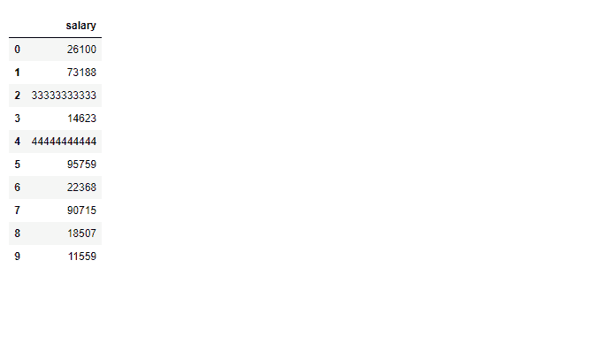
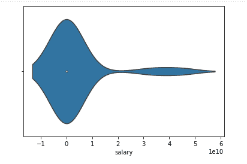
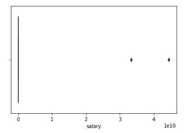
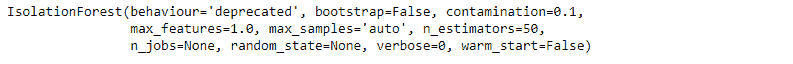
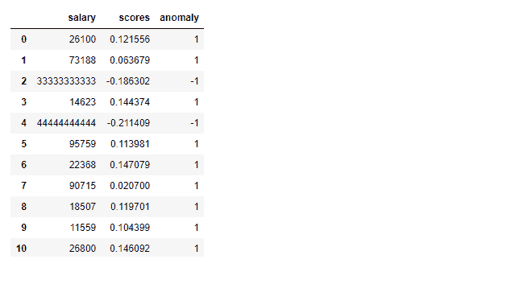
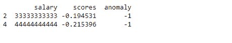

# Python 中使用隔离森林的异常检测

> 原文：<https://blog.paperspace.com/anomaly-detection-isolation-forest/>

从银行欺诈到预防性机器维护，异常检测是机器学习的一个非常有用和常见的应用。隔离林算法是完成这项任务的简单而强大的选择。

在本文中，我们将讨论:

1.  异常检测简介
2.  异常检测的用例
3.  什么是隔离林？
4.  使用隔离林进行异常检测
5.  用 Python 实现

您可以在 [ML Showcase](https://ml-showcase.paperspace.com/projects/ensemble-methods-scikit-learn) 上免费运行本教程的代码。

所以，让我们开始吧！

## 异常检测简介

一个**异常值**只不过是一个与给定数据集中的其他数据点显著不同的数据点。

**异常检测**是发现数据中异常值的过程，即与大多数其他数据点显著不同的点。

大型真实数据集可能具有非常复杂的模式，仅通过查看数据很难发现这些模式。这就是为什么异常检测的研究是机器学习的一个极其重要的应用。

在本文中，我们将使用隔离森林算法实现异常检测。我们有一个简单的工资数据集，其中一些工资是异常的。我们的目标是找到那些薪水。你可以想象这是一种情况，公司的某些员工赚了异常多的钱，这可能是不道德行为的一个指标。


Photo by [Will Myers](https://unsplash.com/@will_myers?utm_source=ghost&utm_medium=referral&utm_campaign=api-credit) / [Unsplash](https://unsplash.com/?utm_source=ghost&utm_medium=referral&utm_campaign=api-credit)

在我们继续实现之前，让我们讨论一些异常检测的用例。

## 异常检测用例

异常检测在各个行业都有广泛的应用。以下是一些流行的使用案例:

银行业务。发现异常高的存款。每个账户持有人通常都有特定的存钱方式。如果该模式存在异常，银行需要能够检测和分析它，例如洗钱。

**金融。**发现欺诈性购买的模式。每个人通常都有一定的购物模式。如果这种模式存在异常，银行需要检测它，以便分析潜在的欺诈。

**保健。**检测欺诈性保险索赔和支付。

**制造业。**可以监控异常的机器行为以控制成本。许多公司持续监控他们所拥有的机器的输入和输出参数。众所周知，在故障之前，机器在这些输入或输出参数方面表现出异常行为。从预防性维护的角度来看，需要持续监控机器的异常行为。

**联网。**检测网络入侵。任何暴露于外界的网络都面临这种威胁。通过监控网络中的异常活动，可以在早期检测到入侵。

现在我们来了解一下机器学习中的隔离森林算法是什么。

## 什么是隔离林？

**隔离森林**是一种用于异常检测的机器学习算法。
这是一种无监督学习算法，通过隔离数据中的异常值来识别异常。

隔离林基于[决策树](https://blog.paperspace.com/decision-trees/)算法。它通过从给定的要素集中随机选择一个要素，然后随机选择该要素的最大值和最小值之间的分割值来隔离异常值。这种对要素的随机划分将在树中为异常数据点产生更短的路径，从而将它们与其他数据区分开。

一般来说，异常检测的第一步是构建一个“正常”的配置文件，然后将任何不能被视为正常的东西报告为异常。然而，隔离森林算法并不基于这一原理工作；它没有首先定义“正常”行为，也没有计算基于点的距离。

顾名思义，隔离林的工作方式是隔离异常，即明确隔离数据集中的异常点。

隔离森林算法基于这样的原则，即异常是数量少且不同的观察值，这应该使它们更容易识别。隔离森林使用给定数据点的隔离树集合来隔离异常。

隔离林通过随机选择一个功能，然后随机选择该功能的拆分值，在数据集上递归生成分区。据推测，与数据集中的“正常”点相比，异常需要较少的随机分区来隔离，因此异常将是树中具有较小路径长度的点，路径长度是从根节点遍历的边的数量。

使用隔离森林，我们不仅可以更快地检测异常，而且与其他算法相比，我们还需要更少的内存。

隔离林隔离数据点中的异常，而不是分析正常数据点。由于异常数据点通常具有比正常数据点短得多的树路径，隔离林中的树不需要具有很大的深度，因此可以使用较小的 max_depth，从而导致较低的存储器需求。

这种算法对于小数据集也非常有效。

现在让我们做一些探索性的数据分析，以便对给定的数据有所了解。

### 探索性数据分析

让我们首先导入所需的库。我们正在进口`numpy`、`pandas`、`seaborn`和`matplotlib`。除此之外，我们还需要从`sklearn.ensemble`进口隔离林。

```py
import numpy as np
import pandas as pd
import seaborn as sns
import matplotlib.pyplot as plt
from sklearn.ensemble import IsolationForest
```

一旦库被导入，我们需要从 csv 读取数据到 pandas 数据框，并检查前 10 行数据。

该数据收集了不同专业人员的年薪，单位为美元。这个数据很少有我们会发现的异常(比如工资过高或过低)。

```py
df = pd.read_csv('salary.csv')
df.head(10)
```



Dataset head

为了更好地理解这些数据，我们绘制了工资数据的小提琴图，如下所示。小提琴图是一种绘制数字数据的方法。

通常情况下，violin 图包括盒图中的所有数据、数据中间值的标记、指示四分位数范围的盒或标记，如果样本数量不太多，还可能包括所有样本点。



Violin Plot for Salary

为了更好地了解异常值，我们也可以看看箱线图。这也被称为盒须图。盒中盒图显示数据集的四分位数，而触须显示分布的其余部分。

触须不会显示被确定为异常值的点。
异常值通过一种方法检测，该方法是四分位间距的函数。
在统计学中，四分位数范围，也称为中间分布或中间 50%，是统计离差的度量，等于第 75 个和第 25 个百分点之间的差异。



Box Plot for Salary Indicating the Two outliers in the right

一旦我们完成了探索性的数据分析，就该定义和拟合模型了。

### 定义并拟合模型

我们将创建一个`model` 变量并实例化 IsolationForest 类。我们将四个参数的值传递给隔离林方法，如下所示。

**估计量的数量:** `n_estimators`指集合中基本估计量或树的数量，即森林中将要建立的树的数量。这是一个整数参数，是可选的。默认值为 100。

**最大样本数:** `max_samples`是为训练每个基本估计量而抽取的样本数。如果 max_samples 大于提供的样本数，所有样本将用于所有树。max_samples 的默认值为“自动”。如果为“自动”，则 max_samples=min(256，n_samples)

**污染:**这是算法相当敏感的参数；它是指数据集中异常值的预期比例。这在拟合以定义样本分数的阈值时使用。默认值为“自动”。如果“自动”，阈值将按照隔离林的原始文件确定。

**最大特征:**不是所有的基本估计器都用数据集中可用的所有特征来训练的。它是从全部特征中抽取的特征数来训练每个基估计器或树。最大要素的默认值为 1。

```py
model=IsolationForest(n_estimators=50, max_samples='auto', contamination=float(0.1),max_features=1.0)
model.fit(df[['salary']])
```



Isolation Forest Model Training Output

在我们定义了上面的模型之后，我们需要使用给定的数据来训练模型。为此我们使用了如上图所示的`fit()` 方法。这个方法被传递了一个参数，这是我们感兴趣的数据(在这个例子中，是数据集的 salary 列)。

一旦模型被正确训练，它将输出 IsolationForest 实例，如上面单元的输出所示。

现在是时候添加数据集的分数和异常列了。

### 添加分数和异常列

在模型定义和拟合之后，让我们找到分数和异常列。我们可以通过调用训练好的模型的`decision_function()` 并把薪水作为参数传递来找出 scores 列的值。

类似地，我们可以通过调用训练模型的`predict()`函数并将薪水作为参数传递来找到异常列的值。

这些列将被添加到数据框`df`中。添加这两列后，让我们检查数据框。不出所料，数据框现在有三列:薪水、分数和异常。异常值列的负分值和-1 表示存在异常。异常值为 1 代表正常数据。

该算法为训练集中的每个数据点分配一个异常值。我们可以定义一个阈值，并使用异常分数，如果数据点的分数大于预定义的阈值，则可以将该数据点标记为异常。

```py
df['scores']=model.decision_function(df[['salary']])
df['anomaly']=model.predict(df[['salary']])
df.head(20)
```



Added scores and Anomaly Column for Isolation Forest

在添加了数据中所有行的分数和异常之后，我们将打印预测的异常。

### 打印异常

要打印数据中的预测异常，我们需要在添加分数和异常列后分析数据。正如您在上面看到的，对于预测的异常，异常列值将为-1，它们的分数将为负。

使用这些信息，我们可以打印出预测的异常(本例中为两个数据点),如下所示。

```py
anomaly=df.loc[df['anomaly']==-1]
anomaly_index=list(anomaly.index)
print(anomaly)
```



Anomaly output

请注意，我们不仅可以打印异常值，还可以打印它们在数据集中的索引，这对进一步的处理非常有用。

### 评估模型

为了评估该模型，让我们设置一个阈值，因为薪金> 99999 是一个异常值。让我们使用下面的代码，按照上面的规则找出数据中存在的离群值的数量。

```py
outliers_counter = len(df[df['salary'] > 99999])
outliers_counter
```

离群值计数器= 2

让我们通过找出模型发现的异常值的数量除以数据中存在的异常值的数量来计算模型的准确性。

```py
print("Accuracy percentage:", 100*list(df['anomaly']).count(-1)/(outliers_counter))
```

准确率:100 %

### 尾注

在本教程中，我们学习了什么是异常，以及如何使用隔离森林算法来检测它们。我们还讨论了各种探索性的数据分析图，如小提琴图和箱线图。

最后，我们实现了隔离森林算法，并打印出数据中的真实异常值。

我希望你喜欢这篇文章，如果需要的话，你可能会在将来的项目中使用它。

快乐学习！