# 变压器的直观介绍

> 原文：<https://blog.paperspace.com/attention-is-all-you-need-the-components-of-the-transformer/>

### 介绍

这篇[论文](https://arxiv.org/pdf/1706.03762.pdf)是在应用注意力机制方面向前迈出的重要一步，是一个被称为 transformer 的模型的主要发展。目前为 NLP 任务开发的最著名的模型由许多变压器组成。在本教程中，我们将概述这个模型的组件。

### 我们需要变压器的原因

在编码器-解码器架构中使用 RNNs 的第一代神经机器翻译方法集中于使用 RNNs 来应对序列间的挑战。

当处理扩展序列时，这些设计有一个明显的缺点；当额外的元素被引入序列时，它们保存最初成分信息的能力就丧失了。编码器中的每一步都有一个隐藏状态，通常与最近输入的一个单词相关联。因此，如果解码器只访问编码器的最新隐藏状态，它将丢失关于序列的早期分量的信息。为了解决这个问题，引入了一个新概念:注意机制。

虽然 rnn 通常关注编码器的最后状态，但我们在解码过程中会查看编码器的所有状态，从而获得输入序列中每个元素的信息。这就是 attention 所做的:它从整个序列中编译所有先前编码器状态的加权和。

因此，解码器可能会为输出的每个元素区分特定输入元素的优先级。通过在每个阶段关注正确的输入元素来学习预测下一个输出元素。

然而，重要的是要注意到这种策略仍然有一个明显的限制:每个序列必须单独处理。为了处理第 t 步，编码器和解码器都必须等待前面的 t-1 步完成。正因为如此，处理大型数据集需要很长时间，并使用大量计算能力。

## 几种类型的关注

### 软硬注意

正如 Luong 等人在他们的文章中提到的以及和徐等人在他们的论文中详述的，当我们将上下文向量计算为编码器隐藏状态的加权和时，会发生软注意。当我们根据注意力分数选择一个单独的隐藏状态，而不是所有隐藏状态的加权平均值时，就会产生硬注意力。选择是一个问题，因为我们可以使用像 argmax 这样的函数，但因为该函数不可微，所以需要更高级的训练策略。

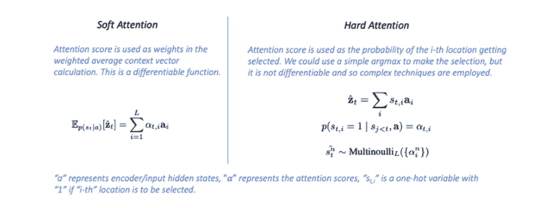

[source](https://towardsdatascience.com/attention-in-neural-networks-e66920838742)

### 全球关注

术语“全局注意力”指的是所有编码器隐藏状态被用于为每个解码器步骤构建基于注意力的上下文向量的情况。

正如你可能已经想到的，这可能会很快变得昂贵。当导出上下文向量时，全局注意力模型考虑编码器的所有隐藏状态( **ct** )。在该模型类型中，通过将当前目标隐藏状态 **ht** 与每个源隐藏状态 **hs** 进行比较，得到处的可变长度对齐向量**，其大小等于源侧的时间步长数。**

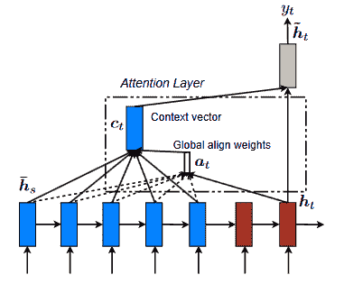

[source](https://arxiv.org/pdf/1508.04025.pdf)

### 当地的关注

使用全局注意的缺点是，对于目标端的每个词，它必须注意源端的所有词。这不仅耗时耗力，而且有可能使翻译较长的序列(如段落或文档)变得不切实际。我们建议使用局部注意机制来解决这个问题。这种机制将只关注与每个目标单词相关联的源位置的极小子集。

[Xu et al.(2015)](http://proceedings.mlr.press/v37/xuc15.pdf) 提议在软硬注意模型之间的权衡成为开发该模型以解决生成图像字幕挑战的动力来源。在他们的研究中，“软注意”指的是全局注意技术，其特点是在源图像的所有补丁上“温和”地应用权重。

另一方面，硬注意方法一次只关注图像的一个部分。为了训练一个硬注意模型，人们必须使用更复杂的技术，如方差减少或强化学习，即使它们在推理时更便宜。我们的局部注意机制选择性地聚焦于狭窄的上下文窗口，并且是可区分的。这种策略的好处是避免了软注意方法中引起的昂贵计算，同时，它比硬注意方法更容易训练。该模型首先在给定时间 **t** 为每个目标单词生成由 **pt** 表示的对齐位置。

此后，通过对窗口[pt D，pt+D]内的源隐藏状态进行加权平均，生成由**CT**表示的上下文向量；d 是凭经验选择的。与全局方法相反，在处的局部对准向量**现在具有固定的维度。该模型有两种可能性，概述如下:**

*   单调对齐(local-m):我们设 **pt = t** 假设源序列和目标序列近似单调对齐。
*   预测比对(local-p):我们的模型预测比对位置，而不是假设单调的比对位置:

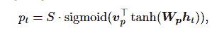

[source](https://arxiv.org/pdf/1508.04025.pdf)

模型参数 **wp** 和 **vp** 将被学习以进行位置预测。
源句子的长度由“S”表示。 **pt** 落在范围**【0，S】**内，这是 sigmoid 函数的直接结果。我们建立一个以**点**为中心的高斯分布，以优先选择靠近**点**的对准点。

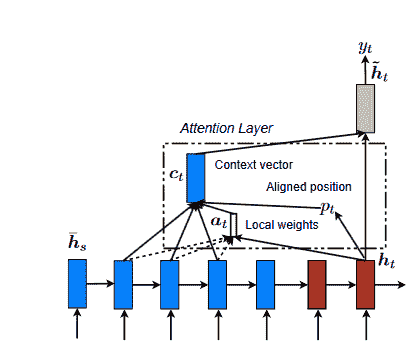

[source](https://arxiv.org/pdf/1508.04025.pdf)

### 潜在的注意力

将自然语言描述翻译成可执行程序是计算语言学的一个重要课题。在过去的十年里，自然语言处理和编程语言社区一直在研究这个主题。为了这项研究，研究人员只对带有一个 if-then 表达式的子集程序感兴趣。配方是提供触发条件和动作功能的 If-Then 程序，它们表示当触发条件满足时执行的程序。

LSTM 技术、神经网络和逻辑回归方法已经被提出来解决这个问题。另一方面，作者认为，词汇和句型的广泛多样性使 RNN 人不可能学习可用的表示，他们的集成技术在函数预测挑战方面确实优于基于 LSTM 的方法。作为解决方案，作者提供了一种新的注意力结构，他们称之为潜在注意力。潜在注意使用一个加权系统来评估每个标记在预测触发或行动中的重要性。

#### 潜在注意模型

如果我们想把一个自然语言描述变成一个程序，我们需要在描述中找到对预测预期标签最有用的术语。在下面的描述中提供了对此的说明:

**自动将 Instagram 照片保存到 Dropbox 文件夹**

术语“Instagram 照片”将帮助我们最好地预测触发因素。为了获得这些信息，我们可以调整注意力机制，使其首先基于句子中每个标记的重要性计算权重，然后输出这些标记嵌入的加权和。另一方面，我们的直觉告诉我们，每个标记的重要性取决于标记本身和整个句子的结构。作为一个例子，如果我们考虑下面的句子:

将 Dropbox 文件夹中的照片发布到 Instagram。

“Dropbox”用于决定触发器，尽管“Instagram”应该在前面的示例中扮演这个角色，该示例包括实际上相同的令牌集。在本例中，介词“to”的使用给人的印象是，触发通道是在过程中间的某个地方描述的，而不是在过程结束时。考虑到所有这些因素，我们选择了“Dropbox”而不是“Instagram”。

我们使用标准的注意机制来计算每个标记的潜在权重，以识别序列中的哪些标记与触发器或动作更相关。最终的注意力权重，我们称之为主动权重，是由潜在权重决定的。例如，如果表达式中已经存在标记“to ”,我们可以通过查看“to”之前的标记来搜索触发器。

### 变压器是什么？

根据[论文](https://arxiv.org/pdf/1706.03762.pdf)的说法，transformer 是一种模型架构，它放弃了递归的使用，而是只依赖于一种注意力机制来确定输入和输出之间的全局相互依赖关系。在八个 P100 GPU 上接受了短短 12 个小时的培训后，transformer 能够在翻译质量方面达到新的艺术水平，并允许显著提高并行性。transformer 是第一个仅通过自我关注而不是序列对齐 RNNs 或卷积来计算其输入和输出表示的转导模型。

### 单词嵌入

嵌入是符号(单词、字符或短语)在连续值向量的分布式低维空间中的表示。单词不是单独的符号。他们彼此之间有着重要而积极的关系。正因为如此，当我们把它们投射到一个连续的欧几里得空间时，我们可以发现它们之间的密切关系。然后，根据工作的不同，我们可能会将单词嵌入隔开，或者使它们彼此相对靠近。

### 模型架构

> 大多数竞争性神经序列转导模型具有编码器-解码器结构。这里，编码器将符号表示的输入序列(x1，...，xn)转换为连续表示序列 z = (z1，...，zn)。给定 z，解码器然后生成输出序列(y1，...ym)，一次一个元素。在每一步，模型都是自回归的，在生成下一步时，消耗先前生成的符号作为附加输入。

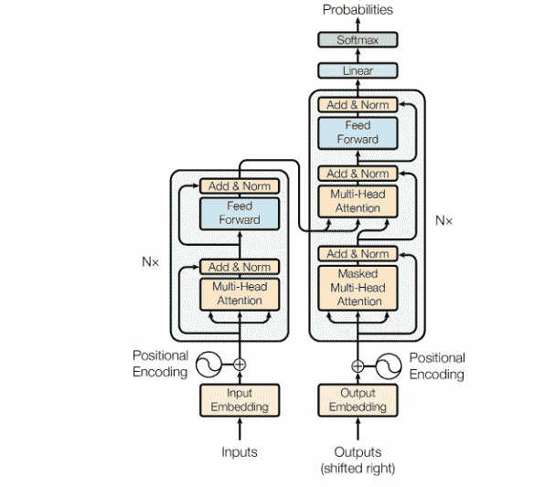

[source](https://arxiv.org/pdf/1706.03762.pdf)

我们可以看到，编码器模型在左侧，而解码器在右侧。注意力和前馈网络都可以在这两个模块中找到。

### 自我关注:基本操作

根据这篇[文章](http://peterbloem.nl/blog/transformers)，自我关注是一个序列对序列的操作。它意味着一系列的向量被输入到这个过程中，另一个向量序列就出来了。让我们将输入向量称为 x1、x2、...和 xt，输出向量为 y1，y2，...，还有 yt。自关注操作只包括对所有输入向量进行加权平均，以获得输出向量 **yi** 。

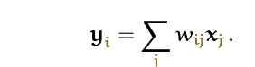

[Source](https://peterbloem.nl/blog/transformers)

> j 对整个序列进行索引，并且权重总和为 1 对所有 j。权重 **wij** 不是一个参数，如同在正常的神经网络中一样，但是它是从对 **𝐱i** 和𝐱j.的函数中导出的。该函数最简单的选项是点积。

我们必须在模型的自我关注机制中包含以下三个组件:查询、值和键。

### 查询、值和键

信息检索系统是键值查询概念的来源。澄清这些概念将是非常有益的，并且阐明这些关键术语将是非常有益的。以 YouTube 为例，我们来看看如何找到一个视频。

您对特定视频的搜索(查询)将使搜索引擎将您的搜索映射到一组与可能已存储的视频相关的关键字(视频标题、描述等)。然后，该算法将向您显示最接近您正在寻找的内容(值)的视频。为了引起变压器对这一概念的注意，我们有以下内容:

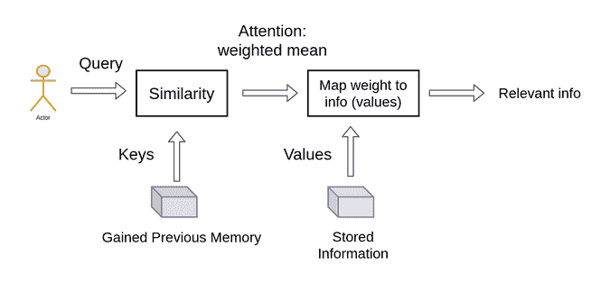

[Source](https://theaisummer.com/transformer/)

在检索单个视频时，我们侧重于选择具有最高可能相关性分数的视频。注意系统和提取系统之间最关键的区别在于，我们提供了一个更抽象、更简化的“提取”项目的概念。我们可以通过首先确定我们的表示之间存在的相似度或权重来加权我们的查询。因此，更进一步，我们将数据分成键-值对，并使用键来确定注意力权重，以将值和数据视为我们将获取的信息。

### 成比例的点积注意力

我们给这种特殊的注意力起了个名字，叫做“成比例的点积注意力”输入包括:

*   查询，
*   尺寸为 **dk** 的键，
*   尺寸值 **dv** 。

为了获得值的权重，我们首先计算查询与所有键的点积，将每个键除以 **√dk** ，然后应用 softmax 函数。在实际实践中，我们一次计算一组查询的关注度函数，然后将这些查询打包到矩阵 q 中。关键字和值也被捆绑到矩阵 K 和 v 中。分数指示相对于特定位置处的特定单词，应该给予输入序列中的其他位置或单词多少权重。为了澄清，它将是查询向量和被评分的相应单词的关键向量的点积。因此，要得到点积(。)对于位置 1，我们首先计算 q1.k1，然后是 q1.k2、q1.k3 等等...

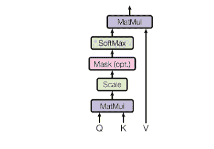

[Source](https://arxiv.org/pdf/1706.03762.pdf)

对于更稳定的梯度，我们应用“缩放”因子。值得注意的是，softmax 函数无法正确处理大值，导致梯度消失，并减慢学习过程。之后，我们使用值矩阵来保持我们想要关注的单词的值，并减少或删除对我们的目的不必要的单词的值。


[Source](https://arxiv.org/pdf/1706.03762.pdf)

```py
def scaled_dot_product_attention(queries, keys, values, mask):
    # Calculate the dot product, QK_transpose
    product = tf.matmul(queries, keys, transpose_b=True)
    # Get the scale factor
    keys_dim = tf.cast(tf.shape(keys)[-1], tf.float32)
    # Apply the scale factor to the dot product
    scaled_product = product / tf.math.sqrt(keys_dim)
    # Apply masking when it is requiered
    if mask is not None:
        scaled_product += (mask * -1e9)
    # dot product with Values
    attention = tf.matmul(tf.nn.softmax(scaled_product, axis=-1), values)

    return attention
```

### 多头注意力

即使两个句子有相同的单词，但以不同的顺序组织，注意力分数仍然会提供相同的结果。因此，我们想把注意力集中在单词的不同部分。

> 理解多头自我关注的最简单方法是将其视为并行应用的自我关注机制的少量副本，每个副本都有自己的键、值和查询转换。

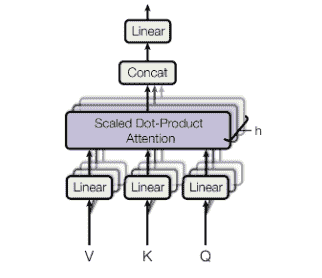

[Source](https://arxiv.org/pdf/1706.03762.pdf)

该模型可以使用多头注意力在不同点关注来自不同表示子空间的信息。通过使用 Q、K 和 V 子矩阵将单词向量分成定义数量的组块，然后将自我注意应用于相应的组块，可以增强自我注意区分不同单词的能力。一旦我们计算了每个头部的点积，我们就连接输出矩阵，并把它们乘以一个权重矩阵。

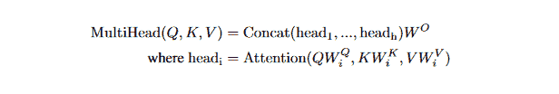

[Source](https://arxiv.org/pdf/1706.03762.pdf)

```py
class MultiHeadAttention(layers.Layer):

    def __init__(self, n_heads):
        super(MultiHeadAttention, self).__init__()
        self.n_heads = n_heads

    def build(self, input_shape):
        self.d_model = input_shape[-1]
        assert self.d_model % self.n_heads == 0
        # Calculate the dimension of every head or projection
        self.d_head = self.d_model // self.n_heads
        # Set the weight matrices for Q, K and V
        self.query_lin = layers.Dense(units=self.d_model)
        self.key_lin = layers.Dense(units=self.d_model)
        self.value_lin = layers.Dense(units=self.d_model)
        # Set the weight matrix for the output of the multi-head attention W0
        self.final_lin = layers.Dense(units=self.d_model)

    def split_proj(self, inputs, batch_size): # inputs: (batch_size, seq_length, d_model)
        # Set the dimension of the projections
        shape = (batch_size,
                 -1,
                 self.n_heads,
                 self.d_head)
        # Split the input vectors
        splited_inputs = tf.reshape(inputs, shape=shape) # (batch_size, seq_length, nb_proj, d_proj)
        return tf.transpose(splited_inputs, perm=[0, 2, 1, 3]) # (batch_size, nb_proj, seq_length, d_proj)

    def call(self, queries, keys, values, mask):
        # Get the batch size
        batch_size = tf.shape(queries)[0]
        # Set the Query, Key and Value matrices
        queries = self.query_lin(queries)
        keys = self.key_lin(keys)
        values = self.value_lin(values)
        # Split Q, K y V between the heads or projections
        queries = self.split_proj(queries, batch_size)
        keys = self.split_proj(keys, batch_size)
        values = self.split_proj(values, batch_size)
        # Apply the scaled dot product
        attention = scaled_dot_product_attention(queries, keys, values, mask)
        # Get the attention scores
        attention = tf.transpose(attention, perm=[0, 2, 1, 3])
        # Concat the h heads or projections
        concat_attention = tf.reshape(attention,
                                      shape=(batch_size, -1, self.d_model))
        # Apply W0 to get the output of the multi-head attention
        outputs = self.final_lin(concat_attention)

        return outputs
```

### 位置编码

在我们的模型中没有递归和卷积，有必要提供一些关于记号在序列中如何相互定位的信息。“位置编码”被添加到编码器和解码器堆栈底部的嵌入中，以实现这一目标。因为位置编码和嵌入都有相同的维数，所以可以将两个值相加。然后，我们使用一个函数将句子中的位置转换成一个实值向量。最终，网络将会弄清楚如何使用这些信息。

位置嵌入可以像单词嵌入一样使用，其中每个已知的位置用一个向量编码。在本文中，正弦和余弦函数被应用于:

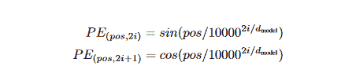

[Source](https://arxiv.org/pdf/1706.03762.pdf)

transformer 研究的作者在 transformer 论文中提出了一个用于位置编码的正弦函数。正弦函数指示模型聚焦于特定波长。信号的波长 y(x)=sin(kx)为 k=2π /λ。λ将由句子的位置决定。值 I 表示一个位置是奇数还是偶数。

```py
class PositionalEncoding(layers.Layer):

    def __init__(self):
        super(PositionalEncoding, self).__init__()

    def get_angles(self, pos, i, d_model): # pos: (seq_length, 1) i: (1, d_model)
        angles = 1 / np.power(10000., (2*(i//2)) / np.float32(d_model))
        return pos * angles # (seq_length, d_model)

    def call(self, inputs):
        # input shape batch_size, seq_length, d_model
        seq_length = inputs.shape.as_list()[-2]
        d_model = inputs.shape.as_list()[-1]
        # Calculate the angles given the input
        angles = self.get_angles(np.arange(seq_length)[:, np.newaxis],
                                 np.arange(d_model)[np.newaxis, :],
                                 d_model)
        # Calculate the positional encodings
        angles[:, 0::2] = np.sin(angles[:, 0::2])
        angles[:, 1::2] = np.cos(angles[:, 1::2])
        # Expand the encodings with a new dimension
        pos_encoding = angles[np.newaxis, ...]

        return inputs + tf.cast(pos_encoding, tf.float32)
```

### 编码器

[篇论文](https://arxiv.org/pdf/1706.03762.pdf)介绍编码器组件如下:

*   编码器包括具有 N = 6 个相同层的堆栈。
*   每层有两个子层。第一个是多头自关注机制，第二个是全连接前馈网络。
*   在两个子层的每一个周围使用剩余连接，随后进行层归一化。每个子层的输出是 LayerNorm(x + Sublayer(x))，其中 Sublayer(x)是子层本身实现的函数。

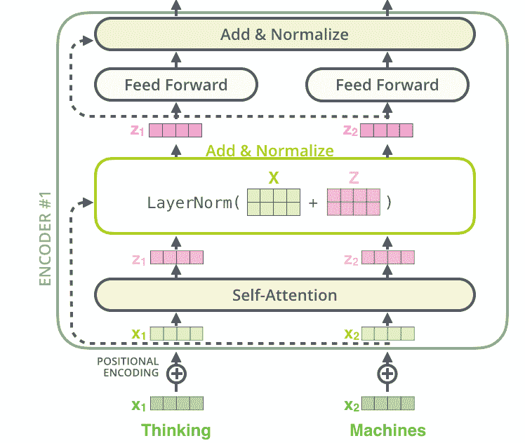

[Source](https://jalammar.github.io/illustrated-transformer/)

归一化和残差连接是两种最常用的技术，用于加速和提高深度神经网络训练的准确性。只有嵌入维度受层规范化的影响。对于每个子层，我们在将其与子层输入归一化和组合之前，对输出应用下降。编码器和解码器堆栈嵌入和位置编码和都被丢弃。

我们没有使用批处理规范化，因为它需要大量的 GPU RAM。BatchNorm 已经被证明在语言中表现特别差，因为单词的特征往往具有显著更高的方差(许多稀缺单词需要被考虑用于合理的分布估计)。

**注意**:和 ResNets 一样，变形金刚也倾向于深入。在特定型号中可能会发现超过 24 块。只有当模型具有剩余连接时，才能出现平滑的梯度流。我们将继续实施编码器层:

```py
class EncoderLayer(layers.Layer):

    def __init__(self, FFN_units, n_heads, dropout_rate):
        super(EncoderLayer, self).__init__()
        # Hidden units of the feed forward component
        self.FFN_units = FFN_units
        # Set the number of projectios or heads
        self.n_heads = n_heads
        # Dropout rate
        self.dropout_rate = dropout_rate

    def build(self, input_shape):
        self.d_model = input_shape[-1]
        # Build the multihead layer
        self.multi_head_attention = MultiHeadAttention(self.n_heads)
        self.dropout_1 = layers.Dropout(rate=self.dropout_rate)
        # Layer Normalization
        self.norm_1 = layers.LayerNormalization(epsilon=1e-6)
        # Fully connected feed forward layer
        self.ffn1_relu = layers.Dense(units=self.FFN_units, activation="relu")
        self.ffn2 = layers.Dense(units=self.d_model)
        self.dropout_2 = layers.Dropout(rate=self.dropout_rate)
        # Layer normalization
        self.norm_2 = layers.LayerNormalization(epsilon=1e-6)

    def call(self, inputs, mask, training):
        # Forward pass of the multi-head attention
        attention = self.multi_head_attention(inputs,
                                              inputs,
                                              inputs,
                                              mask)
        attention = self.dropout_1(attention, training=training)
        # Call to the residual connection and layer normalization
        attention = self.norm_1(attention + inputs)
        # Call to the FC layer
        outputs = self.ffn1_relu(attention)
        outputs = self.ffn2(outputs)
        outputs = self.dropout_2(outputs, training=training)
        # Call to residual connection and the layer normalization
        outputs = self.norm_2(outputs + attention)

        return outputs
```

和编码器实现:

```py
class Encoder(layers.Layer):

    def __init__(self,
                 n_layers,
                 FFN_units,
                 n_heads,
                 dropout_rate,
                 vocab_size,
                 d_model,
                 name="encoder"):
        super(Encoder, self).__init__(name=name)
        self.n_layers = n_layers
        self.d_model = d_model
        # The embedding layer
        self.embedding = layers.Embedding(vocab_size, d_model)
        # Positional encoding layer
        self.pos_encoding = PositionalEncoding()
        self.dropout = layers.Dropout(rate=dropout_rate)
        # Stack of n layers of multi-head attention and FC
        self.enc_layers = [EncoderLayer(FFN_units,
                                        n_heads,
                                        dropout_rate) 
                           for _ in range(n_layers)]

    def call(self, inputs, mask, training):
        # Get the embedding vectors
        outputs = self.embedding(inputs)
        # Scale the embeddings by sqrt of d_model
        outputs *= tf.math.sqrt(tf.cast(self.d_model, tf.float32))
        # Positional encodding
        outputs = self.pos_encoding(outputs)
        outputs = self.dropout(outputs, training)
        # Call the stacked layers
        for i in range(self.n_layers):
            outputs = self.enc_layers[i](outputs, mask, training)

        return outputs
```

### 解码器

编码器和解码器都包括一些相同的组件，但是这些组件在解码器中被不同地使用，以便它可以考虑编码器的输出。

*   解码器也由 N = 6 个相同层的堆叠组成。
*   除了每个编码器层中的两个子层之外，解码器还插入了第三个子层，该子层对编码器堆栈的输出执行多头关注。
*   像编码器一样，在每个子层周围使用残差连接，然后进行层归一化。
*   在解码器堆栈中修改自关注子层，以防止位置关注后续位置。这种屏蔽与输出嵌入移动一个位置的事实相结合，保证了位置 I 的预测只能依赖于已知出现在低于 I 的位置的输出。

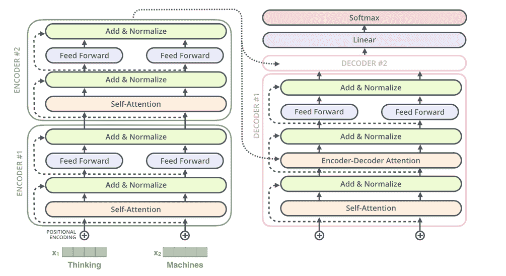

[Source](http://jalammar.github.io/illustrated-transformer/)

解码器层实现:

```py
class DecoderLayer(layers.Layer):

    def __init__(self, FFN_units, n_heads, dropout_rate):
        super(DecoderLayer, self).__init__()
        self.FFN_units = FFN_units
        self.n_heads = n_heads
        self.dropout_rate = dropout_rate

    def build(self, input_shape):
        self.d_model = input_shape[-1]

        # Self multi head attention, causal attention
        self.multi_head_causal_attention = MultiHeadAttention(self.n_heads)
        self.dropout_1 = layers.Dropout(rate=self.dropout_rate)
        self.norm_1 = layers.LayerNormalization(epsilon=1e-6)

        # Multi head attention, encoder-decoder attention 
        self.multi_head_enc_dec_attention = MultiHeadAttention(self.n_heads)
        self.dropout_2 = layers.Dropout(rate=self.dropout_rate)
        self.norm_2 = layers.LayerNormalization(epsilon=1e-6)

        # Feed foward
        self.ffn1_relu = layers.Dense(units=self.FFN_units,
                                    activation="relu")
        self.ffn2 = layers.Dense(units=self.d_model)
        self.dropout_3 = layers.Dropout(rate=self.dropout_rate)
        self.norm_3 = layers.LayerNormalization(epsilon=1e-6)

    def call(self, inputs, enc_outputs, mask_1, mask_2, training):
        # Call the masked causal attention
        attention = self.multi_head_causal_attention(inputs,
                                                inputs,
                                                inputs,
                                                mask_1)
        attention = self.dropout_1(attention, training)
        # Residual connection and layer normalization
        attention = self.norm_1(attention + inputs)
        # Call the encoder-decoder attention
        attention_2 = self.multi_head_enc_dec_attention(attention,
                                                  enc_outputs,
                                                  enc_outputs,
                                                  mask_2)
        attention_2 = self.dropout_2(attention_2, training)
        # Residual connection and layer normalization
        attention_2 = self.norm_2(attention_2 + attention)
        # Call the Feed forward
        outputs = self.ffn1_relu(attention_2)
        outputs = self.ffn2(outputs)
        outputs = self.dropout_3(outputs, training)
        # Residual connection and layer normalization
        outputs = self.norm_3(outputs + attention_2)

        return outputs
```

线性层将堆叠输出转换为一个更大的向量，称为 logits，这是一个完全连接的网络，位于 N 个堆叠解码器的末端。对数通过 softmax 层转换成概率。

解码器的实现:

```py
class Decoder(layers.Layer):

    def __init__(self,
                 n_layers,
                 FFN_units,
                 n_heads,
                 dropout_rate,
                 vocab_size,
                 d_model,
                 name="decoder"):
        super(Decoder, self).__init__(name=name)
        self.d_model = d_model
        self.n_layers = n_layers
        # Embedding layer
        self.embedding = layers.Embedding(vocab_size, d_model)
        # Positional encoding layer
        self.pos_encoding = PositionalEncoding()
        self.dropout = layers.Dropout(rate=dropout_rate)
        # Stacked layers of multi-head attention and feed forward
        self.dec_layers = [DecoderLayer(FFN_units,
                                        n_heads,
                                        dropout_rate) 
                           for _ in range(n_layers)]

    def call(self, inputs, enc_outputs, mask_1, mask_2, training):
        # Get the embedding vectors
        outputs = self.embedding(inputs)
        # Scale by sqrt of d_model
        outputs *= tf.math.sqrt(tf.cast(self.d_model, tf.float32))
        # Positional encodding
        outputs = self.pos_encoding(outputs)
        outputs = self.dropout(outputs, training)
        # Call the stacked layers
        for i in range(self.n_layers):
            outputs = self.dec_layers[i](outputs,
                                         enc_outputs,
                                         mask_1,
                                         mask_2,
                                         training)

        return outputs
```

### 结论

在本教程中，我们介绍了变压器的组件，这是第一个完全基于注意力的序列转导模型。该模型用多头自关注取代了编码器-解码器设计中最常用的递归层。在下一个教程中，我们将讨论 BERT，它是第一个表明变形金刚可以达到人类水平性能的模型之一。

### 参考

[https://theaisummer.com/transformer/](https://theaisummer.com/transformer/)
本文使用的代码来自[https://towardsdatascience . com/attention-is-all-you-need-discovering-The-transformer-paper-73 e5f F5 e 0634](https://towardsdatascience.com/attention-is-all-you-need-discovering-the-transformer-paper-73e5ff5e0634)
[http://jalammar.github.io/illustrated-transformer/](http://jalammar.github.io/illustrated-transformer/)
[https://peterbloem.nl/blog/transformers](https://peterbloem.nl/blog/transformers)
[https://UVA DLC-notebooks . io/en/latest/tutorial 6/Transformers _ and _ MH attention . https://UVA DLC-notebooks . read docs . io/end](https://uvadlc-notebooks.readthedocs.io/en/latest/tutorial_notebooks/tutorial6/Transformers_and_MHAttention.html)