# 计算机视觉中的注意机制:CBAM

> 原文：<https://blog.paperspace.com/attention-mechanisms-in-computer-vision-cbam/>

> 注意——“注意到某人或某事”

在计算机视觉领域的神经网络中采用的现代技术包括“*注意力机制*”。计算机视觉的目标是在基于代码的算法方面模仿人类的视觉感知。在深入研究计算机视觉中使用的注意力机制之前，让我们简单了解一下注意力机制是如何嵌入人类视觉能力并受其启发的。

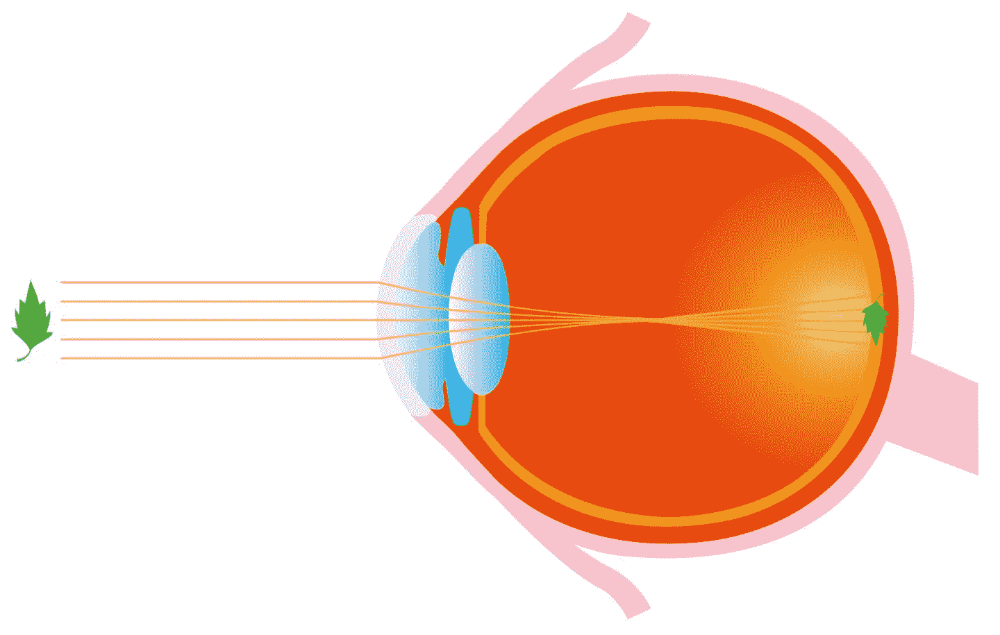

Visual Perception in the Human Eye

在上图中，光线从感兴趣的物体(在这种情况下是一片叶子)传播到黄斑，黄斑是眼睛内部视网膜的主要功能区域。然而，当我们在视野中有多个物体时会发生什么呢？

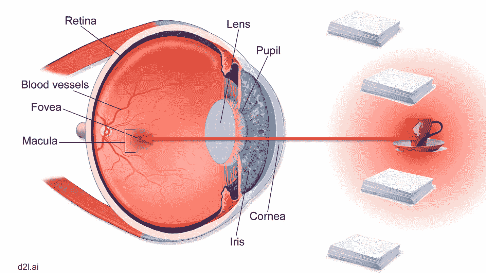

*Visual Perception Attention on coffee mug in multiple object instance (Image Credits - ICML 2019)*

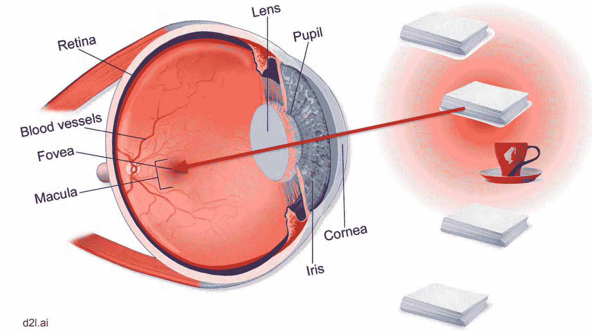

*Visual Perception Attention on paper stack in multiple object instance (Image Credits - ICML 2019)*

当我们的视野中有一系列不同的对象时，当我们必须聚焦于单个对象时，我们的视觉感知系统中的注意力机制使用一组复杂的过滤器来创建模糊效果(类似于数字摄影中的“散景”),因此感兴趣的对象处于焦点上，而周围的对象则褪色或模糊。

现在，回到深度学习中的注意力机制。在谷歌大脑的 NeurIPS 2017 年论文中，注意力机制的想法首次在自然语言处理(NLP)领域得到广泛介绍，题为“[注意力是你所需要的全部](https://papers.nips.cc/paper/7181-attention-is-all-you-need.pdf)”。

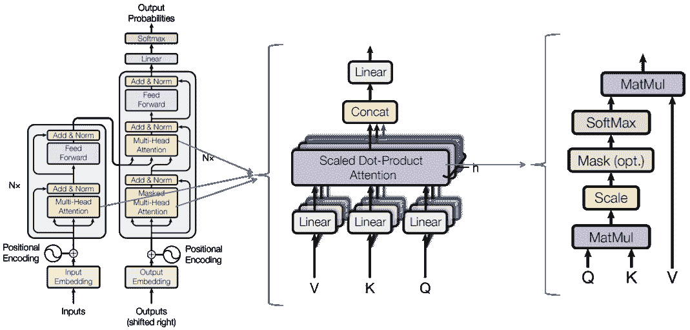

Transformer Architecture, Scaled Dot Product Attention, and Multi-Head Attention. ([Image Credits](https://towardsdatascience.com/self-attention-and-transformers-882e9de5edda))

在本文中，使用三个主要组件来计算注意机制:查询、键和值。我们将在接下来的帖子中讨论这些概念，然而，这个想法是在[自我关注生成对抗网络](https://arxiv.org/abs/1805.08318)论文中首次移植到计算机视觉中的(也以其缩写 SAGAN 广为人知)。本文介绍了如下图所示的自我关注模块( *f(x)* 、*g(x)*和 *h(x)* 分别代表查询、键和值):

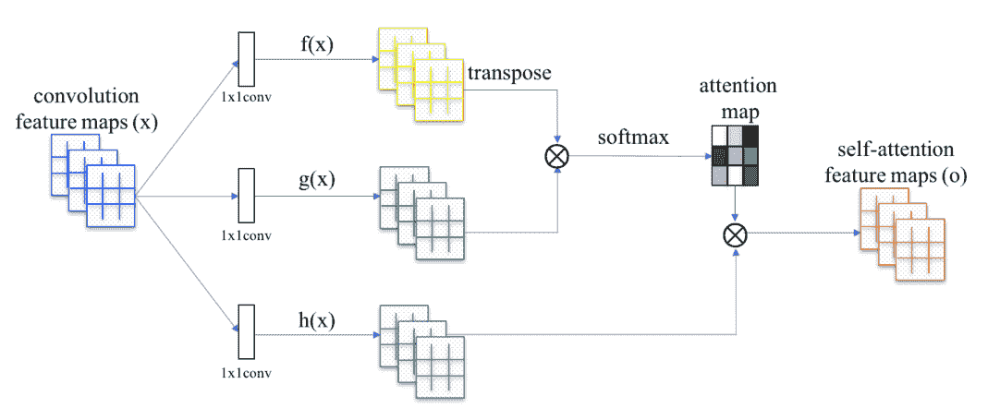

Self Attention Module from SAGAN

在这篇文章中，我们将讨论计算机视觉中一种不同形式的注意力机制，称为*卷积块注意力模块* ( **CBAM** )。

### 目录:

*   卷积块注意模块(CBAM):
    1.  什么是空间注意和通道注意？那么，空间注意力是什么意思？
        b .那什么是渠道关注，我们甚至需要它吗？
        c .为什么两者都用，一个不够吗？
    2.  空间注意模块
    3.  通道注意模块(CAM)
        a .那么挤压激励模块和通道注意模块有什么区别呢？
    4.  最后
    5.  消融研究和结果
*   参考

# 卷积块注意模块(CBAM)

虽然卷积块注意模块(CBAM)是在 ECCV 2018 年题为“ [CBAM:卷积块注意模块](http://openaccess.thecvf.com/content_ECCV_2018/papers/Sanghyun_Woo_Convolutional_Block_Attention_ECCV_2018_paper.pdf)的论文中引入的，但总体概念是在 2016 年题为“ [SCA-CNN:卷积网络中用于图像字幕的空间和通道式注意](https://arxiv.org/pdf/1611.05594.pdf)”的论文中引入的。SCA-CNN 展示了使用多层注意力的潜力:空间注意力和通道注意力相结合，这是图像字幕中 CBAM 的两个组成部分。CBAM 的论文首次成功展示了该模块的广泛适用性，特别是对于图像分类和对象检测任务。

在深入了解 CBAM 的细节之前，我们先来看看该模块的大致结构:


Convolutional Block Attention Module layout

CBAM 包含两个连续的子模块，称为**通道注意模块(CAM)** 和**空间注意模块(SAM)** ，它们以特定的顺序应用。该论文的作者指出，CBAM 应用于深度网络中的每个卷积块，以从“输入中间特征图”获得后续的“细化特征图”。

## 什么是空间注意和通道注意？

词语*空间*和*信道*可能是计算机视觉中最常用的术语，尤其是在卷积层。在任何卷积层中，输入是张量，随后的输出是张量。该张量由 3 维度量来表征: *h* 用于每个特征图的高度； *w* 为每个特征地图的宽度；和 *c* 表示通道总数、特征图总数或张量深度。这就是为什么我们通常将输入的尺寸表示为(*c*×*h*×*w*)。特征图实质上是下面所示的立方体形张量的每个切片，即特征图堆叠在一起。 *c* 尺寸值由该层中使用的卷积滤波器的总数决定。在分别讨论空间和通道注意力的细节之前，让我们先了解一下这些术语的含义以及它们为何如此重要。

### 那么，空间注意力是什么意思？

*空间*是指封装在每个特征地图内的领域空间。空间注意代表特征图上的注意机制/注意掩模，或者张量的单个横截面切片。例如，在下面的图像中，感兴趣的对象是一只鸟，因此空间注意力将生成一个遮罩，该遮罩将增强定义该鸟的特征。通过使用空间注意力来改进特征图，我们增强了后续卷积层的输入，从而提高了模型的性能。

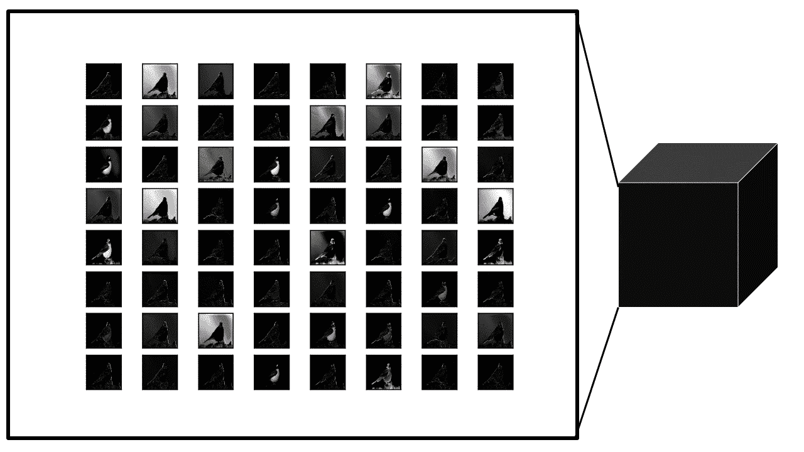

*Feature Maps* representation as a *Tensor ([Image Credits](https://machinelearningmastery.com/how-to-visualize-filters-and-feature-maps-in-convolutional-neural-networks/))*

### 那么什么是渠道关注，我们甚至需要它吗？

如上所述，通道本质上是堆叠在张量中的特征图，其中每个横截面切片基本上是维度( *h* x *w* )的特征图。通常在卷积层中，构成滤波器的可训练权重通常学习小的值(接近于零)，因此我们观察到相似的特征图，其中许多看起来是彼此的副本。这一观察是 CVPR 2020 论文的主要驱动力，该论文题为“ [GhostNet:来自廉价运营的更多功能](https://arxiv.org/abs/1911.11907)”。尽管它们看起来相似，但这些过滤器在学习不同类型的特征时非常有用。虽然有些是专门用于学习水平和垂直边缘的，但其他的更通用，可以学习图像中的特定纹理。通道注意力本质上为每个通道提供了权重，从而增强了那些对学习贡献最大的特定通道，从而提高了整体模型性能。

### 为什么两个都用，一个都不够吗？

嗯，技术上来说是也不是；作者在他们的代码实现中提供了仅使用通道注意并关闭空间注意的选项。但是，为了获得最佳效果，建议同时使用这两种方法。通俗地说，通道注意力说的是*哪个*特征图对学习和增强很重要，或者如作者所说的“提炼”它。同时，空间注意力向*传达了*内特征地图所必须学习的内容。将两者稳健地结合起来增强了特征映射，从而证明了模型性能的显著提高。

## 空间注意模块

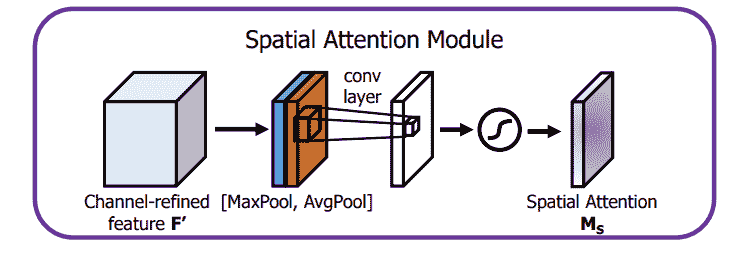

Spatial Attention Module (SAM)

空间注意模块由三重顺序操作组成。它的第一部分被称为通道池，其中维度的输入张量( *c* × *h* × *w* )被分解为 2 个通道，即(2 × *h* × *w* )，其中 2 个通道中的每一个都表示跨通道的最大池化和平均池化。这作为卷积层的输入，卷积层输出一个单通道特征图，即输出的维数为(1 × *h* × *w* )。因此，该卷积层是空间维度保持卷积，并且使用填充来做同样的事情。在代码中，卷积后是一个批处理范数层，用于归一化和缩放卷积的输出。不过，作者也提供了一个在卷积层之后使用 ReLU 激活函数的选项，但默认情况下它只使用卷积+批范数。然后，输出被传递到 Sigmoid 激活层。Sigmoid 是一个概率激活，它将所有值映射到 0 和 1 之间的范围。然后，使用简单的逐元素乘积将该空间注意力掩模应用于输入张量中的所有特征图。

作者在 ImageNet 分类任务中验证了使用 SAM 计算空间注意力的不同方法。论文的结果如下所示:

| 体系结构 | 参数(百万) | GFLOPs | 最大误差(%) | 前 5 名误差(%) |
| --- | --- | --- | --- | --- |
| Vanilla ResNet-50 | Twenty-five point five six | Three point eight six | Twenty-four point five six | Seven point five |
| ResNet-50 + CBAM^1 | Twenty-eight point zero nine | Three point eight six two | Twenty-two point eight | Six point five two |
| ResNet-50 + CBAM (1 x 1 conv，k = 3)² | Twenty-eight point one | Three point eight six nine | Twenty-two point nine six | Six point six four |
| ResNet-50 + CBAM (1 x 1 conv，k = 7)² | Twenty-eight point one | Three point eight six nine | Twenty-two point nine | Six point four seven |
| ResNet-50 + CBAM (AvgPool + MaxPool, k = 3)² | Twenty-eight point zero nine | Three point eight six three | Twenty-two point six eight | Six point four one |
| ResNet-50 + CBAM (AvgPool + MaxPool, k = 7)² | Twenty-eight point zero nine | Three point eight six four | **22.66** | **6.31** |

^1 - CBAM 在这里只代表通道注意模块(CAM)，空间注意模块(SAM)被关闭。
²——CBAM 在这里同时代表 CAM + SAM。括号中的规格显示了计算通道池的方法以及用于 SAM 中卷积层的内核大小。

空间注意组件的 PyTorch 代码实现:

```py
import torch
import torch.nn as nn

class BasicConv(nn.Module):
    def __init__(self, in_planes, out_planes, kernel_size, stride=1, padding=0, dilation=1, groups=1, relu=True, bn=True, bias=False):
        super(BasicConv, self).__init__()
        self.out_channels = out_planes
        self.conv = nn.Conv2d(in_planes, out_planes, kernel_size=kernel_size, stride=stride, padding=padding, dilation=dilation, groups=groups, bias=bias)
        self.bn = nn.BatchNorm2d(out_planes,eps=1e-5, momentum=0.01, affine=True) if bn else None
        self.relu = nn.ReLU() if relu else None

    def forward(self, x):
        x = self.conv(x)
        if self.bn is not None:
            x = self.bn(x)
        if self.relu is not None:
            x = self.relu(x)
        return x

class ChannelPool(nn.Module):
    def forward(self, x):
        return torch.cat( (torch.max(x,1)[0].unsqueeze(1), torch.mean(x,1).unsqueeze(1)), dim=1 )

class SpatialGate(nn.Module):
    def __init__(self):
        super(SpatialGate, self).__init__()
        kernel_size = 7
        self.compress = ChannelPool()
        self.spatial = BasicConv(2, 1, kernel_size, stride=1, padding=(kernel_size-1) // 2, relu=False)
    def forward(self, x):
        x_compress = self.compress(x)
        x_out = self.spatial(x_compress)
        scale = F.sigmoid(x_out) # broadcasting
        return x * scale
```

Spatial Attention Module (SAM) PyTorch Code

## 频道注意模块

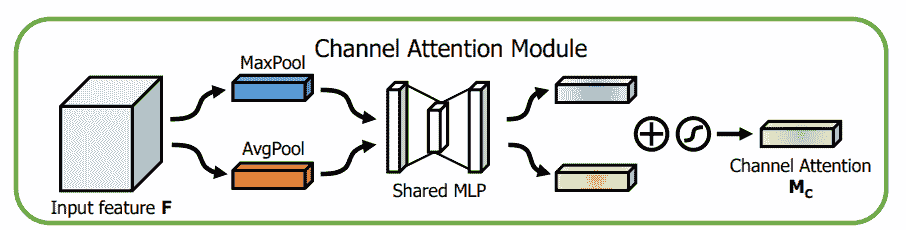

Channel Attention Module (CAM)

通道注意模块(CAM)是另一种顺序操作，但比空间注意模块(SAM)稍微复杂一些。乍一看，凸轮类似于挤压激发(SE)层。挤压激励最早是在 CVPR/ TPAMI 2018 年的论文中提出的，题为:“[挤压激励网络](https://arxiv.org/pdf/1709.01507.pdf)”。简单回顾一下，SE 模块是这样的:

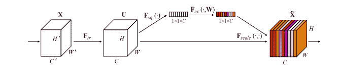

SE block

为了更简洁地解释阿瑟-block，以下来自 CVPR-2020 论文的 SE-block 图题为" [ECA-Net:深度卷积神经网络的高效信道注意](https://arxiv.org/abs/1910.03151) **"** 显示了挤压激励块和卷积块注意模块中的信道注意模块之间的明显相似性(注意:我们将在本系列的后续文章中介绍 ECANet)。

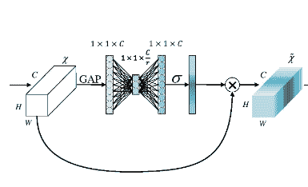

SE-block simplified

### 那么挤压激发和通道注意模块有什么区别呢？

在回答这个问题之前，让我们快速回顾一下挤压激励模块。挤压激励模块具有以下组件:全局平均池(GAP)，以及通过缩减比率( *r* )和 sigmoid 激活映射的多层感知器(MLP)网络。SE 模块的输入本质上是一个维度张量( *c* × *h* × *w* )。全局平均池化实质上是一种平均池化操作，其中每个特征图被缩减为单个像素，因此每个通道现在被分解为(1 × 1)空间维度。因此，间隙的输出维度基本上是长度为 *c* 的一维向量，可以表示为( *c* × 1 × 1)。然后，该向量作为输入传递给多层感知器(MLP)网络，该网络具有一个瓶颈，其神经元的宽度或数量由缩减率决定( *r* )。缩减率越高，瓶颈中的神经元数量越少，反之亦然。来自该 MLP 的输出向量然后被传递到 sigmoid 激活层，该激活层然后在 0 和 1 的范围内映射向量中的值。

通道注意模块(CAM)与挤压激励层非常相似，只是稍有修改。它不是通过全局平均池(GAP)将特征映射减少到单个像素，而是将输入张量分解为 2 个后续的维度向量( *c* × 1 × 1)。其中一个向量由 GAP 生成，而另一个向量由 Global Max Pooling (GMP)生成。平均池主要用于聚集空间信息，而最大池以图像内对象边缘的形式保留更丰富的上下文信息，从而导致更精细的通道注意。简而言之，平均池具有平滑效果，而最大池具有更清晰的效果，但更精确地保留了对象的自然边缘。作者在他们的实验中验证了这一点，他们表明，使用全局平均池和全局最大池比在挤压激励网络的情况下仅使用间隙给出了更好的结果。

下表显示了验证 GAP + GMP 使用的论文中关于 ImageNet 分类的一些结果:

| 体系结构 | 参数(百万) | GFLOPs | 最大误差(%) | 前 5 名误差(%) |
| --- | --- | --- | --- | --- |
| Vanilla ResNet-50 | Twenty-five point five six | Three point eight six | Twenty-four point five six | Seven point five |
| SE-ResNet-50 (GAP) | Twenty-five point nine two | Three point nine four | Twenty-three point one four | Six point seven |
| ResNet-50 + CBAM^1 (GMP) | Twenty-five point nine two | Three point nine four | Twenty-three point two | Six point eight three |
| ResNet-50+CBAM^1(GMP+GAP) | Twenty-five point nine two | Four point zero two | **22.8** | **6.52** |

^1 - CBAM 在这里只代表通道注意模块(CAM)，空间注意模块(SAM)被关闭。

GAP 和 GMP 生成的两个向量被连续发送到 MLP 网络，其输出向量随后被逐元素求和。注意，两个输入对 MLP 使用相同的权重，并且 ReLU 激活函数因其非线性而被用作优选选择。

求和后的结果向量随后被传递到 Sigmoid 激活层，该激活层生成通道权重(根据输入张量中的每个对应通道/特征图，简单地按元素相乘)。

下面是 PyTorch 中频道关注模块(CAM)的实现:

```py
import torch
import torch.nn as nn

def logsumexp_2d(tensor):
    tensor_flatten = tensor.view(tensor.size(0), tensor.size(1), -1)
    s, _ = torch.max(tensor_flatten, dim=2, keepdim=True)
    outputs = s + (tensor_flatten - s).exp().sum(dim=2, keepdim=True).log()
    return outputs

class Flatten(nn.Module):
    def forward(self, x):
        return x.view(x.size(0), -1)

class ChannelGate(nn.Module):
    def __init__(self, gate_channels, reduction_ratio=16, pool_types=['avg', 'max']):
        super(ChannelGate, self).__init__()
        self.gate_channels = gate_channels
        self.mlp = nn.Sequential(
            Flatten(),
            nn.Linear(gate_channels, gate_channels // reduction_ratio),
            nn.ReLU(),
            nn.Linear(gate_channels // reduction_ratio, gate_channels)
            )
        self.pool_types = pool_types
    def forward(self, x):
        channel_att_sum = None
        for pool_type in self.pool_types:
            if pool_type=='avg':
                avg_pool = F.avg_pool2d( x, (x.size(2), x.size(3)), stride=(x.size(2), x.size(3)))
                channel_att_raw = self.mlp( avg_pool )
            elif pool_type=='max':
                max_pool = F.max_pool2d( x, (x.size(2), x.size(3)), stride=(x.size(2), x.size(3)))
                channel_att_raw = self.mlp( max_pool )
            elif pool_type=='lp':
                lp_pool = F.lp_pool2d( x, 2, (x.size(2), x.size(3)), stride=(x.size(2), x.size(3)))
                channel_att_raw = self.mlp( lp_pool )
            elif pool_type=='lse':
                # LSE pool only
                lse_pool = logsumexp_2d(x)
                channel_att_raw = self.mlp( lse_pool )

            if channel_att_sum is None:
                channel_att_sum = channel_att_raw
            else:
                channel_att_sum = channel_att_sum + channel_att_raw

        scale = F.sigmoid( channel_att_sum ).unsqueeze(2).unsqueeze(3).expand_as(x)
        return x * scale
```

Channel Attention Module (CAM) in PyTorch

作者确实提供了使用功率平均池(LP-Pool)和对数和指数池(LSE)的选项，这些选项显示在上面的代码片段中，但是本文没有讨论使用它们时获得的结果。对于纸张，缩小比率( *r* )被设置为默认值 16。

### 最后

CBAM 被用作卷积神经网络模型的每个卷积块中的一层。它接收一个张量，该张量包含来自先前卷积层的特征图，并首先通过使用 CAM 应用通道注意来对其进行细化。随后，该细化张量被传递到 SAM，在 SAM 中应用空间注意力，从而产生输出的细化特征图。PyTorch 中 CBAM 图层的完整代码如下所示。

```py
import torch
import math
import torch.nn as nn

class BasicConv(nn.Module):
    def __init__(self, in_planes, out_planes, kernel_size, stride=1, padding=0, dilation=1, groups=1, relu=True, bn=True, bias=False):
        super(BasicConv, self).__init__()
        self.out_channels = out_planes
        self.conv = nn.Conv2d(in_planes, out_planes, kernel_size=kernel_size, stride=stride, padding=padding, dilation=dilation, groups=groups, bias=bias)
        self.bn = nn.BatchNorm2d(out_planes,eps=1e-5, momentum=0.01, affine=True) if bn else None
        self.relu = nn.ReLU() if relu else None

    def forward(self, x):
        x = self.conv(x)
        if self.bn is not None:
            x = self.bn(x)
        if self.relu is not None:
            x = self.relu(x)
        return x

class Flatten(nn.Module):
    def forward(self, x):
        return x.view(x.size(0), -1)

class ChannelGate(nn.Module):
    def __init__(self, gate_channels, reduction_ratio=16, pool_types=['avg', 'max']):
        super(ChannelGate, self).__init__()
        self.gate_channels = gate_channels
        self.mlp = nn.Sequential(
            Flatten(),
            nn.Linear(gate_channels, gate_channels // reduction_ratio),
            nn.ReLU(),
            nn.Linear(gate_channels // reduction_ratio, gate_channels)
            )
        self.pool_types = pool_types
    def forward(self, x):
        channel_att_sum = None
        for pool_type in self.pool_types:
            if pool_type=='avg':
                avg_pool = F.avg_pool2d( x, (x.size(2), x.size(3)), stride=(x.size(2), x.size(3)))
                channel_att_raw = self.mlp( avg_pool )
            elif pool_type=='max':
                max_pool = F.max_pool2d( x, (x.size(2), x.size(3)), stride=(x.size(2), x.size(3)))
                channel_att_raw = self.mlp( max_pool )
            elif pool_type=='lp':
                lp_pool = F.lp_pool2d( x, 2, (x.size(2), x.size(3)), stride=(x.size(2), x.size(3)))
                channel_att_raw = self.mlp( lp_pool )
            elif pool_type=='lse':
                # LSE pool only
                lse_pool = logsumexp_2d(x)
                channel_att_raw = self.mlp( lse_pool )

            if channel_att_sum is None:
                channel_att_sum = channel_att_raw
            else:
                channel_att_sum = channel_att_sum + channel_att_raw

        scale = F.sigmoid( channel_att_sum ).unsqueeze(2).unsqueeze(3).expand_as(x)
        return x * scale

def logsumexp_2d(tensor):
    tensor_flatten = tensor.view(tensor.size(0), tensor.size(1), -1)
    s, _ = torch.max(tensor_flatten, dim=2, keepdim=True)
    outputs = s + (tensor_flatten - s).exp().sum(dim=2, keepdim=True).log()
    return outputs

class ChannelPool(nn.Module):
    def forward(self, x):
        return torch.cat( (torch.max(x,1)[0].unsqueeze(1), torch.mean(x,1).unsqueeze(1)), dim=1 )

class SpatialGate(nn.Module):
    def __init__(self):
        super(SpatialGate, self).__init__()
        kernel_size = 7
        self.compress = ChannelPool()
        self.spatial = BasicConv(2, 1, kernel_size, stride=1, padding=(kernel_size-1) // 2, relu=False)
    def forward(self, x):
        x_compress = self.compress(x)
        x_out = self.spatial(x_compress)
        scale = F.sigmoid(x_out) # broadcasting
        return x * scale

class CBAM(nn.Module):
    def __init__(self, gate_channels, reduction_ratio=16, pool_types=['avg', 'max'], no_spatial=False):
        super(CBAM, self).__init__()
        self.ChannelGate = ChannelGate(gate_channels, reduction_ratio, pool_types)
        self.no_spatial=no_spatial
        if not no_spatial:
            self.SpatialGate = SpatialGate()
    def forward(self, x):
        x_out = self.ChannelGate(x)
        if not self.no_spatial:
            x_out = self.SpatialGate(x_out)
        return x_out
```

### 消融研究和结果

作者在 MS-COCO 和 PASCAL VOC 数据集上进行了大量实验，从 ImageNet 分类到对象检测，验证了 CBAM 的有效性。作者还展示了一项消融研究，与未应用 SAM 的结果相比，他们捍卫了在 CBAM 按此顺序应用 CAM 和 SAM 的观点。

| 体系结构 | 最大误差(%) | 前 5 名误差(%) |
| --- | --- | --- |
| Vanilla ResNet-50 | Twenty-four point five six | Seven point five |
| SE-ResNet-50 | Twenty-three point one four | Six point seven |
| ResNet-50 + CBAM (CAM -> SAM) | **22.66** | **6.31** |
| ResNet-50 + CBAM (SAM -> CAM) | Twenty-two point seven eight | Six point four two |
| ResNet-50 + CBAM (SAM 和 CAM 并行) | Twenty-two point nine five | Six point five nine |

最后，以下是 CBAM 对本文中介绍的一些模型进行 ImageNet 分类的结果:

| 体系结构 | 参数(百万) | GFLOPs | 最大误差(%) | 前 5 名误差(%) |
| --- | --- | --- | --- | --- |
| Vanilla ResNet-101 | Forty-four point five five | Seven point five seven | Twenty-three point three eight | Six point eight eight |
| SE-ResNet-101 | Forty-nine point three three | Seven point five seven five | Twenty-two point three five | Six point one nine |
| ResNet-101 + CBAM | Forty-nine point three three | Seven point five eight one | **21.51** | **5.69** |
|  |  |  |  |  |
| vanilla rebesne 18(widen = 2.0) | Forty-five point six two | Six point six nine six | Twenty-five point six three | Eight point two |
| WideResNet18(加宽=2.0) + SE | Forty-five point nine seven | Six point six nine six | Twenty-four point nine three | Seven point six five |
| 加宽网 18(加宽=2.0) + CBAM | Forty-five point nine seven | Six point six nine seven | **24.84** | **7.63** |
|  |  |  |  |  |
| Vanilla ResNeXt50(32x4d) | Twenty-five point zero three | Three point seven six eight | Twenty-two point eight five | Six point four eight |
| ResNeXt50 (32x4d) + SE | Twenty-seven point five six | Three point seven seven one | Twenty-one point nine one | Six point zero four |
| ResNeXt50 (32x4d) + CBAM | Twenty-seven point five six | Three point seven seven four | **21.92** | **5.91** |
|  |  |  |  |  |
| 香草手机网 | Four point two three | Zero point five six nine | Thirty-one point three nine | Eleven point five one |
| MobileNet + SE | Five point zero seven | Zero point five seven | Twenty-nine point nine seven | Ten point six three |
| 移动互联网+ CBAM | Five point zero seven | Zero point five seven six | **29.01** | **9.99** |

以及一些值得注意的物体检测结果如文中所示:

##### 可可小姐:

| 毅力 | 探测器 | 地图@ 5 | 地图@ 75 | 地图@[0.5，. 95] |
| --- | --- | --- | --- | --- |
| Vanilla ResNet101 | 快速 RCNN | Forty-eight point four | Thirty point seven | Twenty-nine point one |
| ResNet101 + CBAM | 快速 RCNN | **50.5** | **32.6** | **30.8** |

##### 帕斯卡 VOC:

| 毅力 | 探测器 | 地图@ 5 | 参数(百万) |
| --- | --- | --- | --- |
| VGG16 | （同 solid-statedisk）固态（磁）盘 | Seventy-seven point eight | Twenty-six point five |
| VGG16 | 星网 | Seventy-eight point nine | Thirty-two |
| VGG16 | StairNet + SE | Seventy-nine point one | Thirty-two point one |
| VGG16 | 楼梯网+ CBAM | **79.3** | **32.1** |

如上所述，在复杂网络的挑战性数据集上，如 ImageNet 和 MS-COCO，CBAM 明显优于香草模型及其后续的挤压激发版本。

作者甚至更进一步，通过在 ImageNet 的一些样本图像上可视化 GradCAM 结果，并将它们与挤压激励模型和基线香草模型的结果进行比较，来提供对 CBAM 在模型性能中的影响的额外见解。梯度加权类激活图(Grad-CAM)基本上采用来自最终卷积层的梯度来提供图像内重要区域的粗略定位，这使得模型为该特定目标标签提供预测。例如，对于狗的图像，GradCAM 应该基本上突出显示图像中具有狗的区域，因为图像的该部分对于模型将其分类(即识别)为狗是重要的(或驱动原因)。

CBAM 论文提供的一些结果如下:

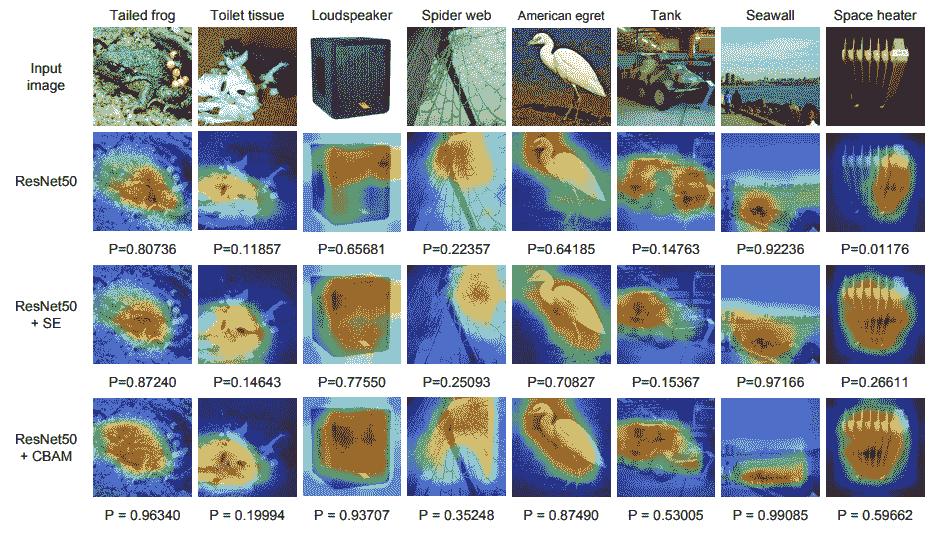

GradCAM results for CBAM

底部的 *P* 值显示了班级置信度得分，如图所示，CBAM 给出的 Grad-CAM 结果比其 SE 对手和 vanilla 同类产品好得多。为了锦上添花，作者进行了一项调查，向用户展示了混洗图像样本的香草、SE 和 CBAM 模型的 GradCAM 结果以及它们的真实标签，并要求用户投票选择哪个 GradCAM 输出突出显示了描述该标签的更好的上下文区域。根据调查，CBAM 以明显优势赢得了投票。

感谢您的阅读。

## 参考资料:

*   [关注深度学习，Alex Smola 和 Aston Zhang，亚马逊网络服务(AWS)，2019](https://icml.cc/media/Slides/icml/2019/halla(10-09-15)-10-15-45-4343-a_tutorial_on.pdf)
*   [注意力是你所需要的，谷歌大脑，NIPS 2017](https://papers.nips.cc/paper/7181-attention-is-all-you-need.pdf)
*   [自我关注生成对抗网络](https://arxiv.org/abs/1805.08318)
*   [计算机视觉中的自我注意](https://towardsdatascience.com/self-attention-in-computer-vision-2782727021f6)
*   [注意？立正！](https://lilianweng.github.io/lil-log/2018/06/24/attention-attention.html)
*   [CBAM:卷积块注意模块，ECCV 2018](http://openaccess.thecvf.com/content_ECCV_2018/papers/Sanghyun_Woo_Convolutional_Block_Attention_ECCV_2018_paper.pdf)
*   [SCA-CNN:图像字幕卷积网络中的空间和信道注意力](https://arxiv.org/pdf/1611.05594.pdf)
*   [挤压和激励网络，CVPR/TPAMI 2018](https://arxiv.org/pdf/1709.01507.pdf)