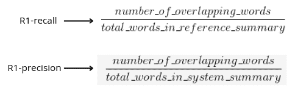
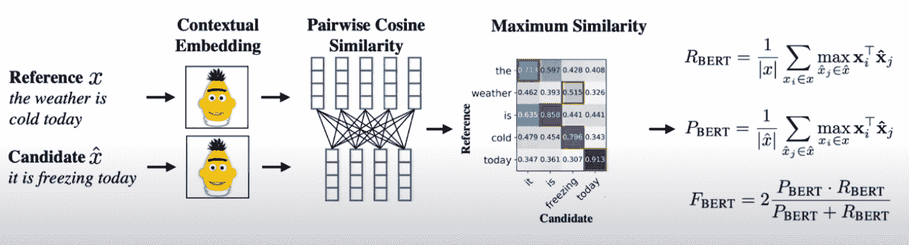
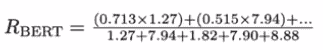
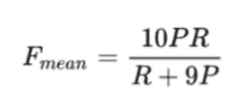
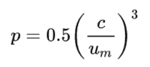
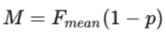
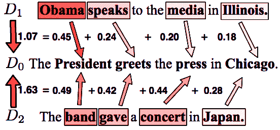

# 用于评估文本生成质量的自动化度量

> 原文：<https://blog.paperspace.com/automated-metrics-for-evaluating-generated-text/>

**自动文本生成**是使用机器学习系统生成自然语言文本的任务。这里的生成可以是开放式的，也可以根据一些用例进行引导。一个训练有素的文本生成系统很难区分人类和机器编写的文本。文本生成在现实世界中的一些流行用例是 Gmail 的智能回复、智能手机的自动完成等。

评估这些系统可能会变得棘手。如今，大多数可用的系统本质上都是概率性的，在生成文本时，经常会看到[幻觉出事实信息](https://www.youtube.com/watch?v=fD2g9s1Isi4&list=PLsAqq9lZFOtUhEnknhpEhqo5ZcYZ0ANre)。因此，*执行评估的最佳方式之一是在[人类](https://www.youtube.com/watch?v=-CIlz-5um7U&list=PLsAqq9lZFOtXlzg5RNyV00ueE89PwnCbu&index=1)* 的帮助下完成，但这可能并不总是可行的，因为这是一个*昂贵且耗时的过程*。由于取样偏差，它也不能保证重现性。此外，手动进行评估时，不能进行大规模评估。因此，由于上述原因，在评估文本生成系统时，自动度量通常是首选的。自动度量可以是经过训练的，也可以是未经训练的。正如预期的那样，经过培训的指标在进行评估时试图考虑任务细节，但代价是要学习相关数据的功能，而未经培训的指标是通用的，不需要培训，独立于语言，并且计算速度更快。未经训练的度量标准很受欢迎，在工业和学术界广泛用于测量生成文本的质量，涵盖许多用例，如[机器翻译](https://en.wikipedia.org/wiki/Machine_translation)、[文本摘要](https://towardsdatascience.com/a-quick-introduction-to-text-summarization-in-machine-learning-3d27ccf18a9f)、[故事生成](https://paperswithcode.com/task/story-generation)、[图像字幕](https://towardsdatascience.com/a-guide-to-image-captioning-e9fd5517f350)等。

在这篇博客中，我们将重点关注一些流行的未经训练的指标(带代码)，用于评估现有的[自然语言生成](https://en.wikipedia.org/wiki/Natural_language_generation) (NLG)系统生成的文本质量，从经典的基于模板的生成系统到先进的模型，如[【GPT】](https://jalammar.github.io/illustrated-gpt2/)、[序列模型](https://www.analyticsvidhya.com/blog/2020/08/a-simple-introduction-to-sequence-to-sequence-models/)等。

## 胭脂

ROUGE 代表**R**ecall-**O**oriented**U**under study for**G**isting**E**估价。这是在 2004 年[本文](https://aclanthology.org/W04-1013/)中介绍的。这是一个非常流行的度量标准，你肯定会在文本摘要的相关文献中找到。该指标基于计算候选摘要和参考摘要*(或任何其他文本片段)之间的语法重叠。*胭脂-1、胭脂-2、胭脂-L 和胭脂-S 是一些常用的计算数字。这里， **Rouge-1** 计算候选文本块和参考文本块之间的单字*(单个单词)*的重叠。 **Rouge-2** 计算候选文本块和参考文本块之间的二元模型*(词对)*的重叠。 **Rouge-L** 计算候选文本片段和参考文本片段之间序列 n 元语法中最长同现的重叠。 **Rouge-S** 计算候选文本块和参考文本块之间[Skip](https://www.notsobigdatablog.com/2019/01/02/what-is-a-skipgram/)-[bigram](https://en.wikipedia.org/wiki/Bigram)*(任意一对单词的句子顺序)*的重叠度。Rouge-1 精确召回的数学公式如下所示



ROUGE-1 Precision, Recall

在文献中，你会经常发现 R1、R2、RL 等车队的 F1 成绩都被提及。*胭脂的实现在下面完成-*

```py
from rouge import Rouge 
rouge = Rouge()

def calculate_rouge(candidate, reference):
    '''
    candidate, reference: generated and ground-truth sentences
    '''
    scores = rouge.get_scores([candidate], reference)
    return scores
```

ROUGE Calculation in Python

*随意查看 python 包* [*在这里*](https://pypi.org/project/rouge/) *也可以查看这个* [*在线演示*](https://huggingface.co/spaces/evaluate-metric/rouge) *。*

## 蓝色

BLEU 代表**B**I**l**in gual**E**估价**U**under research。这是一个非常流行的度量标准，你肯定会在机器翻译的文献中找到，并且是在 2002 年的这篇论文中提出的。将候选翻译与一个或多个参考翻译进行比较时使用的度量。并且输出位于 0-1 的范围内，其中接近 1 的分数指示良好质量的翻译。

BLEU-1、BLEU-2、BLEU-3 和 BLEU-4 是一些常见的计算数字，您会经常在文献中发现它们。这里，1、2、3 和 4 中的每一个表示在计算 BLEU 分数时考虑的 n 元语法序列的精度。BLEU 的数学公式*如下所示-*


BLEU Formulation | Image from [Source](https://stackoverflow.com/questions/44324681/variation-in-bleu-score)

该指标还引入了“简洁惩罚”的概念*(上述公式中的第一项)*。其中，如果输出比参考句子短，我们用那个因子惩罚 BLEU 分数，因此解决了子集生成的问题。

*BLEU 的实现在下面完成-*

```py
from nltk.translate.bleu_score import sentence_bleu
from nltk import word_tokenize

def calculate_bleu(candidate, reference):
    '''
    candidate, reference: generated and ground-truth sentences
    '''
    reference = word_tokenize(reference)
    candidate = word_tokenize(candidate)
    score = sentence_bleu(reference, candidate)
    return score
```

BLEU Calculation in Python

请随意查看这里的 python 包 [，并关注这里](https://www.nltk.org/api/nltk.translate.bleu_score.html)的[中的更多示例。知道什么时候不使用度量标准也很好，为此我建议你阅读](https://machinelearningmastery.com/calculate-bleu-score-for-text-python)[评估 NLP: BLEU 中的文本输出，风险自担](https://towardsdatascience.com/evaluating-text-output-in-nlp-bleu-at-your-own-risk-e8609665a213)。

## 贝特斯科尔

顾名思义，BERTScore 肯定和 BERT 有关系吧？所以，是的，BERTScore 使用 BERT 来计算 NLG 系统生成的文本的质量。这是最近在 2020 年的这篇论文中提出的。与大多数主要利用假设和参考文本片段之间的标记或短语级句法重叠的方法不同， *BERTScore 另一方面通过使用由 BERT 模型生成的语境化嵌入来捕捉语义方面*。



BERTScore Pipeline | Modified Image from [Source](https://arxiv.org/abs/1904.09675)

从上图中可以看出，它首先为参考(基本事实)和候选(由 NLG 系统生成的)文本片段获取语境化的单词嵌入。然后，它从参考和候选中计算每个单词之间的余弦相似度，得到语义上最相似的单词。然后使用上图中描述的公式计算*精度、召回率和 F 值*。



Recall Calculation of BERTScore with Importance weights

该论文的作者还谈到了*、*“重要性权重”的概念，与普通单词不同，这种概念赋予那些被认为对文本更重要和更专有的单词更多的权重。为此，他们使用[逆文档频率](https://nlp.stanford.edu/IR-book/html/htmledition/inverse-document-frequency-1.html) (IDF)权重。直觉告诉我们，一个单词在文档中越常见，它对相关文档的重要性就越低。因此，这些单词分数的重要性并不重要。在这种情况下，我们的 IDF 值会很低。另一方面，如果该单词对于相关文档是唯一的，则它将具有高 IDF 值。在这里，权重的选择是可以调整的，也是可以探索的。

使用 ti iger Bert _ score GitHub repo 可以轻松实现该代码。按照说明安装库，然后就可以像这样通过终端运行 BERTscore 进行英语语言评测了:

```py
bert-score -r original_text.txt -c generated_text.txt --lang en 
```

出于实现的目的，请随意使用 python 库。同样的还有一个非常好的视频解释。你可以在这里查看。

## 流星

流星代表**米**米 **E** 用 **E** xplicit **或**表示 **T** 的估价。这是在[本文](https://www.cs.cmu.edu/~alavie/papers/BanerjeeLavie2005-final.pdf)中介绍的。它可用于评估各种任务的输出，如机器翻译、文本摘要、图像字幕等。但是你会经常发现它被用在机器翻译的文献中。它还声称与人类的判断有很高的相关性。

与 BLEU 度量标准*(在评估来自机器翻译系统的 o/p 时很流行的一种度量标准)*相比，它有一些明显的优点，BLEU 度量标准主要关注的是根据基本事实捕捉生成的精度方面。另一方面，METEOR 基于计算单字精度和召回率的调和平均值的思想，其中召回率比精度更重要。给予回忆更大的权重，可以让我们更好地理解，在生成过程中，作为输出的一部分，我们产生了多少基础事实。*确切的数学公式如下图*—



Meteor F-score Calculation

METEOR 也有一个关于“块惩罚”的概念，它不仅考虑了单字的重叠，还考虑了块(连续单词)的重叠，以强加某种程度的排序。用“p”表示，计算如下-



Chunk Penalty Calculation

这里，c 和 um 分别是在候选句子中的参考和单字中出现的候选语块的数量。最后，流星分数(M)的计算是通过将因子“p”乘以 F 分数来完成的，如下所示



METEOR Score Calculation

*流星的实现在下面完成-*

```py
from nltk.translate import meteor

def calculate_meteor(candidate, reference):
  '''
  candidate, reference: tokenized list of words in the sentence
  '''
  reference = word_tokenize(reference)
  candidate = word_tokenize(candidate)
  meteor_score = round(meteor([candidate],reference), 4)
  return meteor_score
```

Meteor Implementation in Python

请随意查看同一网站上的 nltk 文档。

## 自我蓝色

Self-BLEU 是对传统 BLEU 指标的巧妙使用，用于捕获和量化生成文本中的多样性。它是由上海交通大学和伦敦大学学院的研究人员在 2018 年的这篇[论文](https://arxiv.org/pdf/1802.01886.pdf)中提出的。

self-bleu 分值越低，生成的文本的多样性越高。像故事生成、新闻生成等长文本生成任务非常适合关注这些指标，有助于评估模型中的冗余性和单调性。这个度量可以用其他文本生成评估度量来补充，这些度量说明了所生成文本的良好性和相关性。相关性和多样性的最佳结合点将产生完美的混合输出。

***算法非常简单，如下:***

1.  对于给定的输入，从一组生成的句子中挑选一个句子。计算这个句子和其他句子之间的 BLEU 分数。
2.  迭代所有独特的句子，为所有句子生成 BLEU 分数，并将它们存储在一个列表中。
3.  最后，取作为步骤 2 的一部分计算的列表的平均值。

```py
import numpy as np
import copy

def get_bleu_score(sentence, remaining_sentences):
    lst = []
    for i in remaining_sentences:
        bleu = sentence_bleu(sentence, i)
        lst.append(bleu)
    return lst

def calculate_selfBleu(sentences):
    '''
    sentences - list of sentences generated by NLG system
    '''
    bleu_scores = []

    for i in sentences:
        sentences_copy = copy.deepcopy(sentences)
        remaining_sentences = sentences_copy.remove(i)
        print(sentences_copy)
        bleu = get_bleu_score(i,sentences_copy)
        bleu_scores.append(bleu)

    return np.mean(bleu_scores)

calculate_selfBleu(sentences)
```

Self-BLEU Implementation in Python

## 字移动器的距离

顾名思义，它是关于在一些常见的超空间表示中计算一个单词移动到另一个单词所需要的距离。该方法可用于通过计算将一个句子转换成另一个句子所需的最小单词-单词距离来确定生成的文本片段和参考文本片段之间的语义接近度。然而，虽然 WMD 对于短文本来说工作得很好，但是计算时间显著增加，并且随着文档长度的增加，整体语义本质也有所丢失。有人试图用一些近似值来固定整个大规模杀伤性武器的计算，请随意查看[这个](https://github.com/src-d/wmd-relax)和[这个](https://arxiv.org/pdf/1912.00509.pdf)。

*下图显示了该算法的直观解释-*


WMD Visualization | Image from [Source](http://vene.ro/blog/word-movers-distance-in-python.html)

从上图中可以看出，我们有两个干净的句子 **d** 和**d’**分别为“*奥巴马向媒体伊利诺伊州发言*”和“*总统向新闻界致意*。接下来我们要做的就是把每一句话的每一个记号投射到某个 *d 维*的公共超空间中。人们可以使用现成的现有方法来实现这一目的，如 word2vec、gloVe、fasttext、BERT 等，或者根据他们的数据训练他们的版本。表示方法越好，整体距离计算就越好。一旦完成，下一步就是计算 WMD，方法是对来自 d 的每个单词到它最近的来自文档 d '的*(在语义上)*单词的距离求和。比如——“speaks”最接近“greets”，“media”最接近“press”，“Obama”最接近“press”，“Illinois”最接近“Chicago”。最初的方法计算 L2(欧几里德)距离作为距离的度量。但是在处理非常高的维度时，可以使用其他距离，比如余弦。

让我们再举一个例子，看看距离的计算——从下图可以看出，文档 D1 和 D2 中的每个单词都与文档 D0 中最近的单词对齐。从 D1 到 D0 的重要令牌所覆盖的总最小距离是 1.07，而从 D2 到 D0 的重要令牌所覆盖的总最小距离是 1.63。距离越短，相似性越大。



WMD Illustration | Modified Image from [Source](https://www.bing.cimg/search?view=detailV2&ccid=98tz8lR8&id=8464671E1FE675B1BC56702B26EDAA0501DDC2E7&thid=OIP.98tz8lR8MXHhFE14TeB9LQHaFt&mediaurl=https%3a%2f%2fmiro.medium.com%2fmax%2f650%2f1*YAha4YMJYYMy6-iHdmlB_g.png&exph=501&expw=650&q=word+movers+distance&simid=608000694686325713&FORM=IRPRST&ck=98D6D497CDF76EE8C474EE0C44630C1E&selectedIndex=7&ajaxhist=0&ajaxserp=0)

*它的实现非常方便，可以通过 [gensim 库](https://pypi.org/project/gensim/)来完成，如下所示-*

```py
import gensim.downloader as api
model = api.load('word2vec-google-news-300')

def calculate_wmd(model, hypothesis, reference):
    '''
    model - word vector model
    hypothesis - generated sentence
    reference - groud-truth sentence
    '''
    distance = model.wmdistance(
    				hypothesis, 
                            reference
                            )
	return distance
```

WMD implementation in Python Gensim

请随意查看 gensim 的[文档](https://radimrehurek.com/gensim/auto_examples/tutorials/run_wmd.html)。

## 总结想法

我们今天讨论的每一个指标都试图根据可用的基本事实来捕捉生成文本的某些方面。因此，对于给定的任务，测量和报告其中一个以上是可行的。对 ROUGE、BLEU 和 METEOR 在捕获同义词方面也做了一些扩展，使它们对重叠模式更加健壮。此外，对于依赖于语法重叠的度量标准，它建议在进行计算之前，对生成的文本和参考文本进行规范化*(区分大小写、词根、形态变化等)*。与我们今天讨论的非参数化不同，在“习得指标”领域也有很多活跃的研究。例如，你可能想要查看[布莱特](https://github.com/google-research/bleurt) ( [论文](https://arxiv.org/abs/2004.04696)，[视频](https://www.youtube.com/watch?v=rl4nUngiR2k))，以及[感知得分](https://deepai.org/publication/perception-score-a-learned-metric-for-open-ended-text-generation-evaluation)。我们将在另一个博客上继续讨论。

我希望你喜欢读它。谢谢大家！

## 参考

1.  [文本生成评估:一项调查](https://arxiv.org/pdf/2006.14799.pdf)
2.  [BLEU，METEOR，BERTScore:评估情感导向文本中关键翻译错误的度量性能的评估](https://aclanthology.org/2021.triton-1.6.pdf)