# AMPT 遗传算法:面向 GPU 应用的自动混合精度浮点调优

> 原文：<https://blog.paperspace.com/automatic-mixed-precision-ampt-ga/>

### 介绍

高性能计算(HPC)科学应用在很大程度上依赖于浮点运算来获得高精度输出。在这些程序中，某些变量的精度可能会降低，以加快执行速度或最小化计算能量。
最新的 NVIDIA GPUs 执行单精度浮点运算的吞吐量是双精度的两倍。当我们努力运行大规模的应用程序时，这种权衡变得更加重要，因为问题的规模越来越大。应用结果的准确性至关重要，必须满足用户定义的准确性或误差限制。混合精度计算是将各种浮点变量的各种精度结合起来的实践。如果我们遵循确定准确性的规则，混合精度训练可以大大加快任何深度学习任务的速度。

### 自动混合精度之路

GPU 领域的最新发展为提升性能开辟了新的途径。除了 FP32(单精度)之外，GPU 中还添加了 FP64(双精度)和 FP16(半精度)算术单元。结果是，使用 FP64/FP32/FP16 指令可以同时实现不同的性能水平。

在这些处理器发布之前，混合 FP64 和 FP32 指令对性能的影响有限，因为混合精度数学单元很少可用。选择混合精度时需要转换。

作为使用混合精度训练的效用的一个例子，百度研究人员发现，在用于语音识别和机器翻译的 LSTMs 领域，在 GPU 上使用 FP32 和 FP16 变量的组合，而精度没有变化。

### 先前工作的背景

我们这篇博文所基于的论文可以在这里找到:[https://engineering . purdue . edu/dcsl/publications/papers/2019/GPU-FP-tuning _ ics 19 _ submitted . pdf](https://engineering.purdue.edu/dcsl/publications/papers/2019/gpu-fp-tuning_ics19_submitted.pdf)

以下是混合精度优化的一些相关背景和前期工作:

*   首先，过去的工作不支持 GPU 编程模型中存在的并行代码，因为它们依赖于串行工具或不跨越 GPU 编程和执行范例的分析辅助，例如 CPU 到 GPU 的调用。
*   第二个问题是，以精度为中心的技术没有一个性能模型，并且假定最快的运行时间是以最少的精度实现的。如果混合足够精确到可以进行造型，则数学运算只能满足于最精确的操作数。另一方面，造型是一种昂贵的操作，因此降低精度实际上可能会延长完成的时间。在许多 GPU 上存在 FP64 和 FP32 的并行资源池，组合精度提供了早期工作所忽略的额外并行机会。为了达到总体精度标准，已经建立了精度级别，但这些级别通常不能提高应用程序的执行时间。
*   最后，依赖实时信息的方法会遇到与搜索空间相关的问题。如果架构支持可以调整的 n 个浮点变量的三个精度级别，则搜索空间是(3 的 n 次方)。在 n 可能达到几十万的大型生产级科学应用中使用这种策略是不可能的。

### AMPT 遗传算法:一种混合精度优化系统

为了解决 GPU 应用的性能最大化挑战，开发了 AMPT 遗传算法。这是一个混合精度优化系统。正如程序的最终用户所确定的，AMPT 遗传算法的目标是在应用程序级别选择浮点变量的精度级别，以提高性能，同时将引入的误差保持在可接受的阈值以下。精度向量(PV)是 AMPT 遗传算法的最终输出，它将每个浮点变量分配到一个精度级别。

AMPT 遗传算法的主要思想是，静态分析通过可行精度向量的广阔空间来辅助动态搜索方法。在该论文中，使用静态分析来识别其精度应该被集体修改的变量分组，以减少通过转换对任何一个变量的精度修改的性能的影响。这种信息可以加快大范围搜索的速度。研究人员采用遗传算法进行搜索，这有助于避免早期技术容易陷入的局部最小值。

### 该报声称的创新

*   在遗传搜索方法中使用 GPU 兼容的静态分析提高了识别可行的混合精度程序的效率。基于静态构建性能模型的执行过滤器排除了无利可图的精确向量，从而降低了 AMPT 遗传算法在搜索过程中所需的执行次数。
*   应用级精确制导是由 AMPT 遗传算法提供的，而不是过去研究中观察到的本地化内核、函数或指令。
*   实验表明，我们的搜索技术可以比当前的最佳实践更有效地避免局部最小值，从而节省大量时间。

> 我们发现，AMPT-遗传算法能够优于最先进的 pre doctory 方法，在 LULESH 的混合精度计算中，在所有双变量的基线上发现了 77.1%的额外加速，而 pre doctory 使用了类似数量的程序执行。我们的铸造感知静态性能
> 模型允许 AMPT 遗传算法找到 precision 由于局部最小值问题而无法识别的精确组合。通过三个具有代表性的 Rodinia 基准测试，LavaMD、Backprop 和 CFD，当容许误差阈值宽松时，我们实现了 11.8%-32.9%的额外加速，当误差阈值最严格时，实现了-5.9%-39.8%的额外加速。我们选择这三个
> ,因为它们涵盖了内核的数量和大小范围，以及最新一代 GPU 机器上可用的精度范围。我们还评估了三种解决方案的效率，即搜索最优 PV 所需的执行次数的性能增益，AMPT-遗传算法在这一指标上优于其他算法。

[来源](https://engineering.purdue.edu/dcsl/publications/papers/2019/gpu-fp-tuning_ics19_submitted.pdf)

值得注意的是，美国能源部(DOE)使用 [Lulesh](https://asc.llnl.gov/codes/proxy-apps/lulesh) 作为代理应用程序来测试大型集群，因为它代表了许多大型代码。
它模拟流体动力学方程，解释物质在受力时的相互运动。研究人员使用 CUDA 版本的 LULESH，输入大小为 s 50，并在 NVIDIA Tesla P100 GPU 机器上运行所有实验。

通过改变 FP32 或 FP64 空间中 LULESH 的变量级别的精度来进行研究。FOM(品质因数)被定义为模拟中部件被处理的速度。

通常的做法是在每个 LULESH 码的末尾输出 FOM 度量来测量整体性能。尽管挂钟和 FOM 的增益是成正比的，但由于更深奥的缩放原因，FOM 比普通执行时间更受青睐。评估的真实统计数据是精度级别最低的 FOM 占 FOM 的百分比。

我们发现，与之前的评估相比，LULESH 是一个相当复杂的代码，在 GPU 端包含 7，000 行 C++代码，在 CPU 端包含 600 行 LOC 代码。测试总共使用了 76 个浮点变量。与比较相关的另一个重要事实:precidont 是可以获得混合精度解的最广泛的程序，包含 32 个变量。

本研究共进行了五个实验:

*   **优化的精度:**在这个实验中，研究人员试图评估 AMPT 遗传算法相对于最先进的 pre doctory 和天真的遗传算法的相对执行效益。我们可以在图 a、图 b、图 c 和图 d 中看到结果。
*   **误差阈值符合性:**该实验证实了之前实验中挑选的肺静脉满足用户定义的误差约束(见图 e)。
*   **组件测试:**本实验的目的是研究各种组件对 FOM 度量的影响(见图 f)。
*   **局部与全局模型:**本实验的目标是量化应用程序级调优相对于内核或函数级调优的优势(见下表)。
*   **精确矢量概括:**在这个实验中，测试了在用户提供的输入值的狭窄范围内概括输入的能力(见图 g)。

研究人员使用 FOM(品质因数)比较精确调整后的应用程序性能，该指标与吞吐量同义，并标准化为所有浮点的 FOM。AMPT 遗传算法超过了三个阈值中的两个，并且在最高阈值上优于朴素的解决方案。见下图。

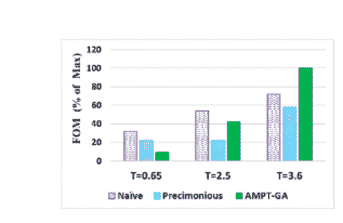

figure a

下图显示了每个协议的执行次数。不出所料，nave 的执行次数最多，紧随其后的是没有执行过滤器的 AMPT GA。AMPT GA 的执行数量少于或相当于 pre doctory 执行的数量。

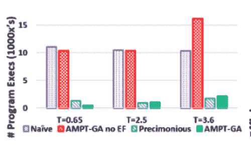

figure b

对于所有三个误差阈值，AMPT 遗传算法是最有效的方法，如下所示。

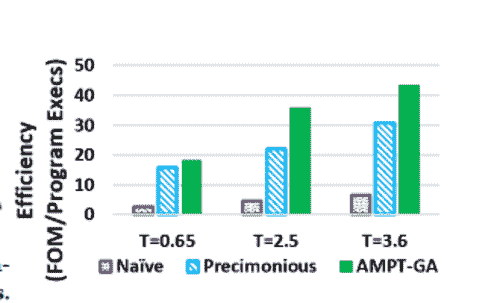

figure c

下图描述了每个算法在单个程序运行期间的效率增益。结果表明，与其他两种技术相比，AMPT 遗传算法能快速收敛到更高的 FOM 解。这是由于 GA 能够做出比 [delta 调试](https://en.wikipedia.org/wiki/Delta_debugging)更显著的跳跃(delta 调试更侧重于局部搜索)。

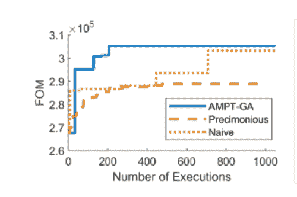

figure d

每种技术的性能和利用现有错误的能力如下图所示。这些结果表明，所有的技术，无论是严格的还是灵活的，都满足误差约束。另一方面，Precimonious 无法利用 2.5 阈值的可用误差裕量。

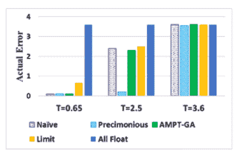

figure e

T=2.5 情况下的 FOM 用激活的 AMPT 遗传算法的各种模块来说明。最左边的场景用实际的程序执行替换了性能模型，在那里它的性能最好，但代价是额外执行 10 倍。分组和超维空间突变的影响最大，而执行过滤器和预填充对这一特定错误阈值的影响可以忽略不计。见下图。

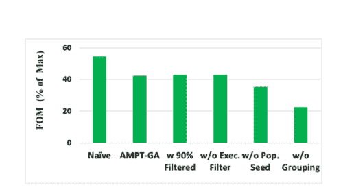

figure f

下表展示了 LULESH、K1、K2 和 K3 三个内核对于特定局部优化精度矢量的性能增益和误差。

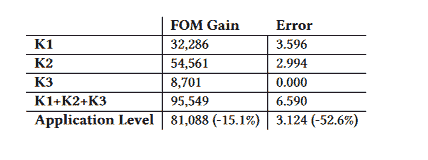

table 

*   由于影响 K1 的 PV 项是全浮点型，而影响 K2 和 K3 的 PV 项是全双精度型，因此 FOM 和误差存在应用级偏移。K2 和 K3 的处理方式相似。
*   如果内核级的调整足够充分，整个应用程序的 FOM 应该等于各种内核级增益的总和，但是应用程序级的度量要低 15.1 %。
*   与所有单个内核错误的总和相比，总的系统错误要低得多(52.6 %)。

误差 CDF 针对 PV 给出，对于接近测试输入的输入，目标误差为 2.5。这些发现表明，大多数邻居位于误差极限之下，因此结果可以以 80 %的置信度概括。见下图。

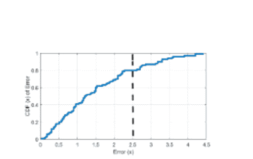

figure g

### 使用 Rodinia 基准程序进行评估

如上所述，这种方法是使用 Rodinia GPU 基准测试套件中的三个程序进行评估的:LavaMD、Backprop 和 CFD。LavaMD 是一个分子动力学程序，有一个内核和 15 个浮点变量。Backprop 是一个具有 21 个浮点变量的双内核基准程序，用于实现模式识别中的一种算法。CFD 是一个四核程序，有 26 个浮点变量，是计算流体动力学的标准基准。获得的结果如下:

**来自 LavaMD 的结果:**下图显示了朴素遗传算法在所有情况下都能产生最大的 FOM 值，尽管它比其他方法需要更大比例的程序执行。AMPT GA 获得了比 precid only 更高的 FOM。

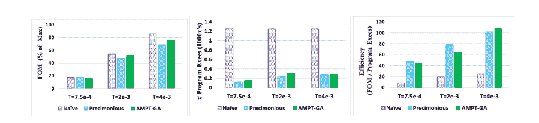

**反向预测的结果** : AMPT 遗传算法获得了与原始遗传算法相同的 FOM 值，而消耗的执行次数不到原始遗传算法的三分之一。对于所有三种误差水平，AMPT 遗传算法是最有效的方法；可以看到下图。

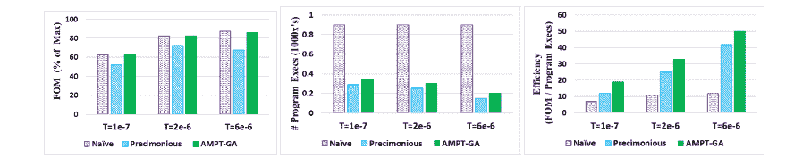

计算流体动力学的结果:下图显示，在所有场景中，朴素遗传算法和 AMPT 遗传算法的 FOM 值最大；然而，naive 使用的程序执行数量远远高于 AMPT 遗传算法。

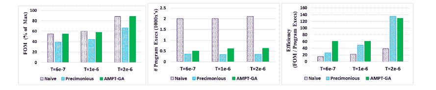

### AMPT 遗传算法的广泛概述

要使用 AMPT 遗传算法，您需要一个测试工具、一个来自目标应用程序或内核的输入、一个可以调整的变量列表，以及一个带有目标错误阈值(T)的指定错误度量。如果没有提供变量列表，我们将使用应用程序的浮点变量或目标 GPU 设备的内核来进行分析。本文假设该体系结构仅处理具有相同精度输入的指令。

*   必须建立性能模型来预测降低所考虑的浮点变量精度的影响。
*   使用一个 [LLVM 通道](https://llvm.org/docs/WritingAnLLVMPass.html)的静态分析被用来建立模型，它在程序的变量之间创建一个依赖图。图节点是指令和变量定义，边将定义与它们在指令中的应用联系起来。
*   当给出每个变量的精度水平时，该图测量每个精度的操作数和发生的铸件数。该信息被转换成性能分数，该性能分数表示由于潜在 PV 中更快更低精度的指令而导致的相对性能。
*   动态执行参数(如循环运行的次数)不会被静态传递捕获，因为它们不会改变。虽然不能保证被赋予相同分数的函数的执行时间是相同的，但是该分数确实提供了不同 PV 之间加速潜力的相对排名。
*   为了找到具有最高性能的 PV，同时将误差水平保持在某个阈值以下，我们使用了调整的遗传算法(GA)。这是因为 PV 空间是二进制受限的，PV 之间的梯度不平滑，并且目标在误差和性能方面是非线性的。
*   只有当预测的性能比获得的最佳性能更好时，才执行搜索空间中的一个点。GA 在考虑 PV 的同时运行程序以找到某个点，然后评估性能和误差。如果该搜索点的性能比迄今为止的最佳性能差(这将由于我们的性能模型中的错误而发生),或者如果该错误大于阈值，则该搜索点被拒绝。否则，将考虑在未来的 GA 代中选择它。
*   为了避免与从属参数(相关变量组)相关的惩罚，变异函数已被修改，以改变超维组空间中的某些变量。使用遗传算法，我们可以评估最好的可能使用的 PV。下图说明了这些不同的阶段是如何交织在一起的。

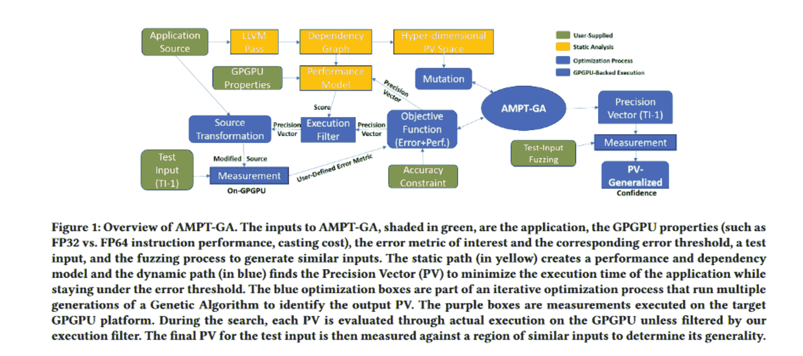

Source: [Paper](https://engineering.purdue.edu/dcsl/publications/papers/2019/gpu-fp-tuning_ics19_submitted.pdf)

*   为了重申上面的重要观点，我们必须要求 GA 在考虑当前 PV 的情况下运行应用程序，因为这是一个昂贵的提议(与查询我们的性能模型相比)，所以只有当性能模型预测它将是一个潜在有价值的配置时，我们才会这样做。

**最终用户工作流程**:对于 AMPT-GA 的部署，最终用户必须提供应用程序源，定义测试输入，并设置错误的目标阈值。AMPT 遗传算法将确定所有浮点变量的精度向量，以优化效率，同时达到阈值。允许最终用户选择应该修改哪些浮点变量是可能的。

所有这一切都可以从一台 Paperspace Core GPU 驱动的机器上运行，直接进行测试。

### AMPT 遗传算法的操作概念

1.  **AMPT-遗传算法的操作**:AMPT-遗传算法是一种优化技术，用于选择最佳精度向量(PV)以最大化性能，同时将误差保持在用户指定的限制范围内。我们将约束实现为目标函数惩罚，从而拒绝错误的解决方案，而关于错误程度的信息保留在分数中，以帮助指导搜索。

Source: [Paper](https://engineering.purdue.edu/dcsl/publications/papers/2019/gpu-fp-tuning_ics19_submitted.pdf)

*   perf (PV)是性能得分，值越低表示性能越好
*   误差(PV)指由指定 PV 引起的误差度量值，而 T 是该误差度量的阈值
*   k 是一个乘法因子，其定义如下:
    1，如果误差(PV) ≤T 和 P，一个大于最大 perf
    值的大值，如果误差(PV) > T

2 **。用户定义的误差指标**。我们使用(默认情况下)一个应用通用的误差指标，即与最精确结果相比的精度位数。

3 **。感兴趣的变量:**用户可以在应用程序中加入任何浮点变量，包括数组、结构和单个变量。在 AMPT 遗传算法中，选择那些由通用分析工具确定的运行时间长的 GPU 内核中使用的变量。我们从运行时间最长的内核开始，包括它，然后根据运行时间在列表中向下移动。当我们包含了足够多的内核来捕获整个程序执行时间的一定比例时，我们就终止了。在捕获了整个程序运行时间的一定比例后，我们终止测试。

4 **。黑盒搜索:**“黑盒”优化程序被用作我们搜索的起点，它采用遗传算法(GA)而无需任何程序分析来指导搜索。

5 **。依赖图和静态性能
模型:**可以使用静态性能模型和中间依赖图来估计特定 PV 的性能增益。当提供 PV 和应用程序源代码时，该方法估计代码中静态发生的浮点和双精度运算以及强制转换的数量。当在程序的编译的混合精度版本中估计强制转换和操作类型的数量时，依赖图基于全双精度方案的程序结构。

6 **。精确矢量优化:** AMPT 遗传算法使用一种优化方法来确定指定误差阈值的最佳 PV。

7 **。执行过滤:**AMPT 遗传算法使用实际的程序执行来测量和验证错误度量是否低于阈值。这意味着必须首先执行应用程序来评估尚未看到的 PV 的目标函数。

8 **。程序转换:**在 AMPT 遗传算法中，我们必须最终将 PV 应用到应用程序中，以使程序的实际操作以修改后的精度进行。

### 结论

AMPT 遗传算法是一种解决方案，用于提高使用计算密集型 GPU 内核的应用程序的可变精度。因此，我们有两项创新:

*   确定需要同时改变的变量的静态分析。
*   一种搜索技术，可以快速移除无利可图的 PVs，基于适用的惩罚，如类型转换。

参考:[https://engineering . purdue . edu/dcsl/publications/papers/2019/GPU-FP-tuning _ ics 19 _ submitted . pdf](https://engineering.purdue.edu/dcsl/publications/papers/2019/gpu-fp-tuning_ics19_submitted.pdf)