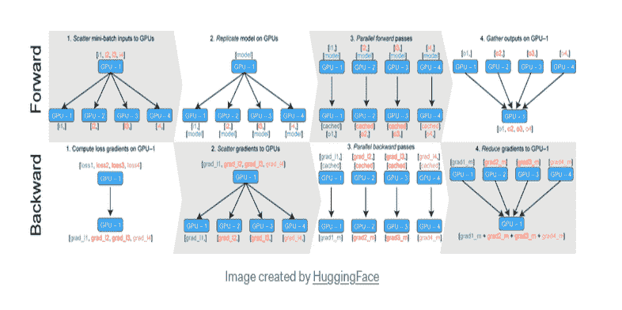

# 使用 PyTorch 的自动混合精度

> 原文：<https://blog.paperspace.com/automatic-mixed-precision-using-pytorch/>

### 介绍

更大的深度学习模型需要更多的计算能力和内存资源。通过新技术的发展，已经实现了深度神经网络的更快训练。代替 FP32(全精度浮点数格式)，你可以使用 FP16(半精度浮点数格式)，研究人员发现串联使用它们是更好的选择。最新的 GPU，如 Paperspace 提供的 Ampere GPUs，甚至可以利用较低的精度，如 INT8。

混合精度允许半精度训练，同时仍保留大部分单精度网络精度。术语“混合精度技术”是指这种方法同时使用单精度和半精度表示。

在使用 PyTorch 进行自动混合精度(Amp)训练的概述中，我们演示了该技术的工作原理，一步一步地介绍了使用 Amp 的过程，并讨论了 Amp 技术的更高级应用，包括代码支架，供用户以后与自己的代码集成。

### 混合精度概述

像大多数深度学习框架一样，PyTorch 通常在 32 位浮点数据(FP32)上进行训练。另一方面，FP32 并不总是成功的必要条件。一些操作可以使用 16 位浮点，其中 FP32 消耗更多的时间和内存。

因此，NVIDIA 工程师开发了一种技术，允许在 FP32 中执行少量操作的混合精度训练，而大部分网络在 FP16 中运行。

混合精度理论的详细解释可以在[这里](https://blog.paperspace.com/p/7fe357f0-f894-4276-a5af-33b904ce8c22/)找到。实施混合精度训练需要三个阶段:

*   只要可行，就转换模型以利用 float16 数据类型。
*   保持浮动 32 个主权重，以累积每次迭代的权重更新。
*   使用损失缩放来保持微小的梯度值。

### PyTorch 中的混合精度

对于混合精度训练，PyTorch 提供了丰富的内置特性。
当你调用`.half()`方法时，一个模块的参数被转换成 FP16，当你调用`.half()`时，一个张量的数据被转换成 FP16。快速 FP16 算法将用于在这些模块或张量上执行任何操作。PyTorch 很好地支持了 NVIDIA 数学库(cuBLAS 和 [cuDNN](https://developer.nvidia.com/cudnn) )。来自 FP16 管道的数据使用张量核进行 GEMMs 和卷积处理。为了在 [cuBLAS](https://docs.nvidia.com/cuda/cublas/index.html) 中使用张量核，GEMM 的维数([M，K] x [K，N] - > [M，N])必须是 8 的倍数。

### 引入 Apex

[Apex 的](https://github.com/NVIDIA/apex)混合精度实用程序旨在提高训练速度，同时保持单精度训练的准确性和稳定性。Apex 可以在 FP16 或 FP32 中执行操作，自动处理主参数转换，并自动缩放损失。

Apex 的创建是为了让研究人员更容易在他们的模型中包含混合精度训练。Amp 是自动混合精度的缩写，是 Apex 的特性之一，Apex 是一个轻量级 PyTorch 扩展。用户只需在他们的网络上增加几条线路，就能从 Amp 的混合精确训练中受益。Apex 于 [CVPR 2018](https://blogs.nvidia.com/blog/2018/06/21/cvpr-nvidia-brings-new-tensor-core-gpu-ai-tools-super-slomo-cutting-edge-research/) 推出，值得注意的是 PyTorch 社区自发布以来一直对 Apex 表示大力支持。

通过对运行模型进行微小的修改，Amp 使您在创建或运行脚本时不必担心混合类型。Amp 的假设可能不太适合以不太常见的方式使用 PyTorch 的模型，但是可以根据需要调整这些假设。

Amp 提供了混合精度训练的所有优势，而不需要显式管理损失缩放或类型转换。 [Apex 的 GitHub 网站](https://github.com/NVIDIA/apex)包含安装过程的说明，其官方 API 文档可以在[这里](https://nvidia.github.io/apex/index.html)找到。

### 放大器如何工作

Amp 在逻辑级别使用白名单/黑名单范例。PyTorch 中的张量运算有[torch . nn . functional . conv2d](https://pytorch.org/docs/stable/generated/torch.nn.functional.conv2d.html)等神经网络函数、 [torch.log](https://pytorch.org/docs/stable/generated/torch.log.html) 等简单数学函数和 [torch.Tensor. add__](https://pytorch.org/docs/stable/generated/torch.Tensor.add.html) 等张量方法。这个宇宙中有三大类函数:

*   t:可以从 FP16 math 的速度提升中受益的函数。典型的应用包括矩阵乘法和卷积。
*   **黑名单**:对于 16 位精度可能不够的功能，输入应该在 FP32 中。
*   **其他一切(剩下的函数):**可以在 FP16 上运行的函数，但是 FP32 的开销- > FP16 在 FP16 上执行这些函数是不值得的，因为加速并不显著。

Amp 的任务很简单，至少在理论上是如此。Amp 在调用 PyTorch 函数之前确定它是在白名单中还是在黑名单中，或者两者都不是。如果在白名单中，所有参数都应该转换为 FP16，如果在黑名单中，则转换为 FP32。如果都不是，只要确保所有的参数都是相同的类型。这项政策在现实中并不像看起来那么简单。

### 将 Amp 与 PyTorch 模型结合使用

要将 Amp 包含到当前 PyTorch 脚本中，请按照下列步骤操作:

*   使用 Apex 库导入 Amp。
*   初始化 Amp，以便它可以对模型、优化器和 PyTorch 内部函数进行所需的更改。
*   请注意反向传播(。backward())发生，以便 Amp 可以同时缩放损失和清除每次迭代状态。

**第一步**

第一步只有一行代码:

```py
from apex import amp
```

**第二步**

必须已经指定用于训练的神经网络模型和优化器来完成这一步，这一步只有一行。

```py
model, optimizer = amp.initialize(model, optimizer, opt_level="O1")
```

附加设置允许您微调放大器的张量和操作类型调整。函数 [amp.initialize()](https://nvidia.github.io/apex/amp.html) 接受许多参数，我们将只指定其中的三个:

*   **车型**[(*torch . nn . module*](https://pytorch.org/docs/stable/generated/torch.nn.Module.html)*或 torch.nn.Modules 列表*)–要修改/铸造的车型。
*   **优化器** ( *可选， [torch.optim.Optimizer](https://pytorch.org/docs/stable/optim.html) 或 torch.optim.Optimizer 列表*)——要修改/施放的优化器。训练必选，推理可选。
*   **opt _ level**([*str*](https://docs.python.org/3/library/stdtypes.html#str)*)，可选，default = " O1 "*)–纯精度或混合精度优化级别。可接受的值是“O0”、“O1”、“O2”和“O3”，在上面有详细解释。有四个优化级别:

**FP32 培训的 O0:**这是一个不可行的方案。不需要担心这个，因为你的新型号应该已经是 FP32 了，O0 可能有助于建立一个准确性的基线。

**O1 用于混合精度(推荐典型使用):**修改所有张量和 Torch 方法，使用白名单-黑名单输入转换方案。在 FP16 中，执行白名单操作，例如像 GEMMs 和卷积这样的张量核友好操作。例如，Softmax 是一个需要 FP32 精度的黑名单 op。除非另有明确说明，否则 O1 也采用动态损耗缩放。

**O2 用于“几乎 FP16”混合精度:** O2 将模型权重转换为 FP16，修补模型的 forward 方法以将输入数据转换为 FP16，在 FP32 中保留 batchnorms，维护 FP32 主权重，更新优化器的 param_groups 以便 optimizer.step()直接作用于 FP32 权重，并实现动态损失缩放(除非被覆盖)。与 O1 不同，O2 不修补 Torch 函数或张量方法。

**用于 FP16 训练的 O3:**就真实混合精度而言，O3 可能不如 O1 和 O2 稳定。因此，为您的模型设置一个基线速度可能是有利的，根据它可以评估 O1 和 O2 的效率。
O3 中的额外属性覆盖 **keep_batchnorm_fp32=True** 可能会帮助您确定“光速”,如果您的模型采用批处理规范化，启用 cudnn batchnorm。

O0 和 O3 不是真正的混合精度，但它们分别有助于设置精度和速度基线。混合精度实现被定义为 O1 和 O2。您可以尝试这两种方法，看看哪种方法最能提高您的特定型号的性能和准确性。

**第三步**

确保您确定了代码中向后传递发生的位置。将会出现如下几行代码:

```py
loss = criterion(…)
loss.backward()
optimizer.step()
```

**第四步**

使用 Amp 上下文管理器，您可以通过简单地包装向后传递来启用损耗缩放:

```py
loss = criterion(…)
with amp.scale_loss(loss, optimizer) as scaled_loss:
    scaled_loss.backward()
optimizer.step()
```

仅此而已。现在，您可以在混合精度训练打开的情况下重新运行脚本。

### 捕获函数调用

PyTorch 缺少静态模型对象或图形来锁定和插入上面提到的类型转换，因为它非常灵活和动态。通过“[猴子打补丁](https://en.wikipedia.org/wiki/Monkey_patch)所需函数，Amp 可以动态拦截和强制转换参数。

例如，您可以使用下面的代码来确保方法[torch . nn . functional . linear](https://pytorch.org/docs/stable/generated/torch.nn.functional.linear.html)的参数总是被转换为 fp16:

```py
orig_linear = torch.nn.functional.linear
def wrapped_linear(*args):
 casted_args = []
  for arg in args:
    if torch.is_tensor(arg) and torch.is_floating_point(arg):
      casted_args.append(torch.cast(arg, torch.float16))
    else:
      casted_args.append(arg)
  return orig_linear(*casted_args)
torch.nn.functional.linear = wrapped_linear
```

尽管 Amp 可能会添加一些改进以使代码更具弹性，但调用 **Amp.init()** 会有效地将猴子补丁插入到所有相关的 PyTorch 函数中，以便在运行时正确地转换参数。

### 最小化强制转换

每个权重在每次迭代中仅转换 FP32 -> FP16 一次，因为 Amp 保留了所有参数转换的内部缓存，并在需要时重用它们。在每次迭代中，向后传递的上下文管理器指示 Amp 何时清除缓存。

### 使用 PyTorch 自动绘制和渐变缩放

“自动化混合精度训练”是指 [torch.cuda.amp.autocast](https://pytorch.org/docs/stable/amp.html#torch.cuda.amp.autocast) 和[torch . cuda . amp . gradscaler](https://pytorch.org/docs/stable/amp.html#torch.cuda.amp.GradScaler)的组合。使用 [torch.cuda.amp.autocast](https://pytorch.org/docs/stable/amp.html#torch.cuda.amp.autocast) ，你可以设置特定区域的自动施法。Autocasting 会自动选择 GPU 运算的精度，以在保持准确性的同时优化效率。

[torch . cuda . amp . gradscaler](https://pytorch.org/docs/stable/amp.html#torch.cuda.amp.GradScaler)实例使得执行渐变缩放步骤变得更加容易。梯度缩放减少了梯度下溢，这有助于具有 float16 梯度的网络实现更好的收敛。

下面的代码演示了如何使用 autocast()在 PyTorch 中获得自动混合精度:

```py
# Creates model and optimizer in default precision
model = Net().cuda()
optimizer = optim.SGD(model.parameters(), ...)

# Creates a GradScaler once at the beginning of training.
scaler = GradScaler()

for epoch in epochs:
    for input, target in data:
        optimizer.zero_grad()

        # Runs the forward pass with autocasting.
        with autocast(device_type='cuda', dtype=torch.float16):
            output = model(input)
            loss = loss_fn(output, target)

        # Backward ops run in the same dtype autocast chose for corresponding forward ops.
        scaler.scale(loss).backward()

        # scaler.step() first unscales the gradients of the optimizer's assigned params.

        scaler.step(optimizer)

        # Updates the scale for next iteration.
        scaler.update()
```

如果某个特定操作的前向传递有 float16 输入，则该操作的后向传递会产生 float16 梯度，而 float16 可能无法表达小幅度的梯度。

如果这些值被刷新为零(“下溢”)，则相关参数的更新将会丢失。

梯度缩放是一种使用比例因子来乘以网络损耗，然后对缩放后的损耗执行反向传递以避免下溢的技术。也有必要通过这个相同的因子来缩放通过网络的反向流动梯度。因此，梯度值具有较大的幅度，这防止它们冲刷到零。

在更新参数之前，每个参数的梯度(。grad 属性)应该是未缩放的，以便缩放因子不会干扰学习速率。由于是模块化的，因此 [autocast](https://pytorch.org/docs/master/amp.html#torch.cuda.amp.autocast) 和 [GradScaler](https://pytorch.org/docs/master/amp.html#torch.cuda.amp.GradScaler) 都可以独立使用。

### 使用未缩放的渐变

### 渐变剪辑

我们可以通过使用`Scaler.scale(Loss).backward()`方法来缩放所有的梯度。在您更改或检查`backward()`和`scaler.step(optimizer)`之间的参数的`.grad`属性之前，必须对其进行缩放。如果您想要将渐变集的全局范数(请参见[torch . nn . utils . clip _ grad _ norm _()](https://pytorch.org/docs/stable/generated/torch.nn.utils.clip_grad_norm_.html#torch.nn.utils.clip_grad_norm_))或最大幅度(请参见[torch . nn . utils . clip _ grad _ value _()](https://pytorch.org/docs/stable/generated/torch.nn.utils.clip_grad_value_.html#torch.nn.utils.clip_grad_value_))限制为小于或等于某个值(某个用户设定的阈值)，您可以使用一种称为“渐变裁剪”的技术

没有按比例缩放的裁剪将导致渐变的范数/最大值被缩放，使您请求的阈值(它应该是未按比例缩放的渐变的阈值)无效。优化器给定参数所包含的梯度由**scaler . un scale(optimizer)**进行缩放。
您可以通过使用**scaler . un scale(optimizer 1)**来取消之前提供给另一个优化器(如优化器 1)的其他参数的梯度。我们可以通过添加两行代码来说明这个概念:

```py
# Unscales the gradients of optimizer's assigned params in-place
        scaler.unscale_(optimizer)
# Since the gradients of optimizer's assigned params are unscaled, clips as usual: 
        torch.nn.utils.clip_grad_norm_(model.parameters(), max_norm)
```

### 使用缩放渐变

### 梯度累积

梯度累积是基于一个荒谬的基本概念。它不是更新模型参数，而是等待并累积连续批次的梯度，以计算损失和梯度。

在一定数量的批次之后，根据累积梯度更新参数。下面是一段关于如何使用 [**pytorch**](https://pytorch.org/docs/stable/notes/amp_examples.html) 使用**渐变累积的代码:**

```py
scaler = GradScaler()

for epoch in epochs:
    for i, (input, target) in enumerate(data):
        with autocast():
            output = model(input)
            loss = loss_fn(output, target)
            # normalize the loss 
            loss = loss / iters_to_accumulate

        # Accumulates scaled gradients.
        scaler.scale(loss).backward()
          # weights update
        if (i + 1) % iters_to_accumulate == 0:
            # may unscale_ here if desired 
            scaler.step(optimizer)
            scaler.update()
            optimizer.zero_grad()
```

*   梯度累积在足够批量的**batch _ per _ ITER * iters _ to _ accumulate**范围内添加梯度。
    该秤应针对有效批次进行校准；这需要检查 inf/NaN 等级，如果检测到任何 inf/NaN，则跳过步骤，并将秤更新为有效批次的粒度。
    当累加特定有效批次的梯度时，将梯度保持在一个比例和一致的比例因子中也是至关重要的。

> 如果在累积完成之前梯度未被缩放(或比例因子改变)，下一次反向传递将把缩放的梯度添加到未缩放的梯度(或由不同因子缩放的梯度)，之后不可能恢复累积的未缩放的梯度，必须应用步骤。

*   在累积了下一步的所有缩放后的梯度后，您可以在步骤前不久使用[取消缩放](https://pytorch.org/docs/stable/amp.html#torch.cuda.amp.GradScaler.unscale_)来[取消缩放](https://pytorch.org/docs/stable/amp.html#torch.cuda.amp.GradScaler.unscale_)梯度。
    为了确保一个完整有效的批处理，只需在每次迭代结束时调用 [update](https://pytorch.org/docs/stable/amp.html#torch.cuda.amp.GradScaler.update) 就可以了，在那里您先前调用了[步骤](https://pytorch.org/docs/stable/amp.html#torch.cuda.amp.GradScaler.step)
*   **enumerate(data)** 函数允许我们在迭代数据时跟踪批处理索引。
*   将运行损耗除以**iters _ to _ accumulate(loss/iters _ to _ accumulate)**。通过将损耗标准化，这减少了我们正在处理的每个小批量的贡献。如果你平均每一批的损失，这种划分已经是正确的，不需要进一步的标准化。根据您计算损失的方式，这一步可能没有必要。
*   当我们使用`scaler.scale(loss).backward()`时，PyTorch 累积缩放后的渐变并存储它们，直到我们调用`optimizer.zero grad()`。

### 梯度惩罚

在实现梯度惩罚时， [torch.autograd.grad()](https://pytorch.org/docs/stable/generated/torch.autograd.grad.html) 用于构建梯度，这些梯度组合起来形成惩罚值，然后添加到损失中。没有缩放或自动转换的 L2 罚分如下例所示。

```py
for epoch in epochs:
    for input, target in data:
        optimizer.zero_grad()
        output = model(input)
        loss = loss_fn(output, target)

        # Creates gradients
        grad_prams = torch.autograd.grad(outputs=loss,
                                          inputs=model.parameters(),
                                          create_graph=True)

        # Computes the penalty term and adds it to the loss
        grad_norm = 0
        for grad in grad_prams:
            grad_norm += grad.pow(2).sum()
        grad_norm = grad_norm.sqrt()
        loss = loss + grad_norm

        loss.backward()

        # You can clip gradients here

        optimizer.step()
```

提供给[torch . autograded . grad()](https://pytorch.org/docs/stable/generated/torch.autograd.grad.html)的张量应该被缩放以实现梯度惩罚。在组合梯度以获得罚值之前，有必要对梯度进行非比例缩放。因为惩罚项计算是向前传递的一部分，所以它应该发生在 autocast 上下文中。
对于同一个 L2 点球，情况是这样的:

```py
scaler = GradScaler()

for epoch in epochs:
    for input, target in data:
        optimizer.zero_grad()
        with autocast():
            output = model(input)
            loss = loss_fn(output, target)

        # Perform loss scaling for autograd.grad's backward pass, resulting #scaled_grad_prams
        scaled_grad_prams = torch.autograd.grad(outputs=scaler.scale(loss),
                                                 inputs=model.parameters(),
                                                 create_graph=True)

        # Creates grad_prams before computing the penalty(grad_prams must be #unscaled). 
        # Because no optimizer owns scaled_grad_prams, conventional division #is used instead of scaler.unscale_:
        inv_scaled = 1./scaler.get_scale()
        grad_prams = [p * inv_scaled for p in scaled_grad_prams]

        # The penalty term is computed and added to the loss. 
        with autocast():
            grad_norm = 0
            for grad in grad_prams:
                grad_norm += grad.pow(2).sum()
            grad_norm = grad_norm.sqrt()
            loss = loss + grad_norm

        # Applies scaling to the backward call.
        # Accumulates properly scaled leaf gradients.
        scaler.scale(loss).backward()

        # You can unscale_ here 

        # step() and update() proceed as usual.
        scaler.step(optimizer)
        scaler.update() 
```

### 使用多个模型、损耗和优化器

如果您的网络中有许多损失，则必须对每个损失调用 Scaler.scale 。
如果你的网络中有很多优化器，你可以在其中任何一个上执行 [scaler.unscale](https://pytorch.org/docs/stable/amp.html#torch.cuda.amp.GradScaler.unscale_) ，并且你必须在每个上调用 [scaler.step](https://pytorch.org/docs/stable/amp.html#torch.cuda.amp.GradScaler.step) 。然而， [scaler.update](https://pytorch.org/docs/stable/amp.html#torch.cuda.amp.GradScaler.update) 应该只使用一次，在这个迭代中使用的所有优化器的步进之后:

```py
scaler = torch.cuda.amp.GradScaler()

for epoch in epochs:
    for input, target in data:
        optimizer1.zero_grad()
        optimizer2.zero_grad()
        with autocast():
            output1 = model1(input)
            output2 = model2(input)
            loss1 = loss_fn(2 * output1 + 3 * output2, target)
            loss2 = loss_fn(3 * output1 - 5 * output2, target)

       #Although retain graph is unrelated to amp, it is present in this  #example since both backward() calls share certain regions of graph. 
        scaler.scale(loss1).backward(retain_graph=True)
        scaler.scale(loss2).backward()

        # If you wish to view or adjust the gradients of the params they #possess, you may specify which optimizers get explicit unscaling. .
        scaler.unscale_(optimizer1)

        scaler.step(optimizer1)
        scaler.step(optimizer2)

        scaler.update()
```

每个优化器检查其 INF/nan 的梯度，并单独判断是否跳过这一步。一些优化器可能会跳过这一步，而其他优化器可能不会这样做。每几百次迭代只发生一次跳步；因此，它不应该影响收敛。对于多优化器模型，如果在添加梯度缩放后发现收敛不良，可以报告该问题。

## 使用多个 GPU

深度学习模型最重要的问题之一是，它们变得太大，无法在单个 GPU 上训练。在单个 GPU 上训练一个模型可能需要太长时间，需要多 GPU 训练才能尽快准备好模型。一位[知名研究员](https://medium.com/south-park-commons/scaling-transformer-xl-to-128-gpus-85849508ec35)能够将 ImageNet 的训练周期从两周缩短到 18 分钟，或者在两周内训练出最广泛、最先进的 Transformer-XL，而不是四年。

[查看云 GPU 对比，看看哪里可以找到多 GPU 云机器的最佳交易。](https://www.paperspace.com/gpu-cloud-comparison)

### 数据并行和分布式数据并行

PyTorch 在不影响质量的前提下，提供了易用性和控制性的最佳结合。 [nn。DataParallel](https://pytorch.org/docs/stable/generated/torch.nn.DataParallel.html#torch.nn.DataParallel) 和[nn . parallel . distributed data parallel](https://pytorch.org/docs/stable/generated/torch.nn.parallel.DistributedDataParallel.html)是 PyTorch 的两个特性，用于在多个 GPU 之间分配训练。您可以使用这些易于使用的包装器和更改在多个 GPU 上训练网络。

### 单个流程中的数据并行

在一台机器中，DataParallel 有助于将训练分散到许多 GPU 上。让我们仔细看看 DataParallel 实际上是如何工作的。
当利用数据并行来训练神经网络时，会发生以下阶段:



[Source:](https://towardsdatascience.com/how-to-scale-training-on-multiple-gpus-dae1041f49d2)

*   小批量在 GPU 上划分:0。
*   将最小批量分割并分配给所有可用的 GPU。
*   将模型复制到 GPU。
*   向前传递发生在所有 GPU 上。
*   计算与 GPU:0 上的网络输出相关的损耗，以及各种 GPU 的回波损耗。应该在每个 GPU 上计算梯度。
*   GPU 上的梯度求和:0 并应用优化器来更新模型。

值得注意的是，这里讨论的问题仅适用于 [autocast](https://pytorch.org/docs/stable/amp.html#torch.cuda.amp.autocast) 。 [GradScaler](https://pytorch.org/docs/stable/amp.html#torch.cuda.amp.GradScaler) 的行为保持不变。 [torch.nn.DataParallel](https://pytorch.org/docs/stable/generated/torch.nn.DataParallel.html#torch.nn.DataParallel) 是否为每个设备创建线程来执行向前传递并不重要。自动发布状态在每一个中传达，并且以下将起作用:

```py
model = Model_m()
p_model = nn.DataParallel(model)

# Sets autocast in the main thread
with autocast():
    # There will be autocasting in p_model. 
    output = p_model(input)
    # loss_fn also autocast
    loss = loss_fn(output)
```

### 分布式数据并行，每个进程一个 GPU

[torch . nn . parallel . distributed data parallel](https://pytorch.org/docs/stable/generated/torch.nn.parallel.DistributedDataParallel.html#torch.nn.parallel.DistributedDataParallel)的文档建议每个进程使用一个 GPU 以获得最佳性能。在这种情况下，DistributedDataParallel 不会在内部启动线程；因此，autocast 和 GradScaler 的使用不受影响。

### 分布式数据并行，每个进程多个 GPU

> 在这里，torch . nn . parallel . distributed data parallel 可能会产生一个副线程来在每个设备上运行正向传递，就像 torch.nn.DataParallel 一样。

### 结论

在本文中，我们有:

*   引入 Apex。
*   了解放大器的工作原理。
*   看到了如何执行梯度缩放，梯度裁剪，梯度积累和梯度惩罚。
*   看到我们如何能与多个模型，损失和优化。
*   看到了当使用多个 GPU 时，我们如何在单个进程中执行数据并行。

请务必使用页面顶部的链接查看此代码的[渐变笔记本](https://console.paperspace.com/github/gradient-ai/apex-amp-gradient?machine=Free-GPU)版本，并查看来自 [Torch 的 Michael Carrili](https://pytorch.org/tutorials/recipes/recipes/amp_recipe.html) 的工作示例。

### 参考

[https://developer . NVIDIA . com/blog/apex-py torch-easy-mixed-precision-training/](https://developer.nvidia.com/blog/apex-pytorch-easy-mixed-precision-training/)
[https://pytorch.org/docs/stable/notes/amp_examples.html](https://pytorch.org/docs/stable/notes/amp_examples.html)
[https://analyticsindiamag . com/py torch-mixed-precision-training/](https://analyticsindiamag.com/pytorch-mixed-precision-training/)
[https://nvidia.github.io/apex/amp.html](https://nvidia.github.io/apex/amp.html)
[https://kozodoi.me/python/deep 学习/py torch/tutorch/tutorial/2021/02/19/gradient-accumulation . html](https://kozodoi.me/python/deep%20learning/pytorch/tutorial/2021/02/19/gradient-accumulation.html)
[https://towa](https://towardsdatascience.com/how-to-scale-training-on-multiple-gpus-dae1041f49d2)