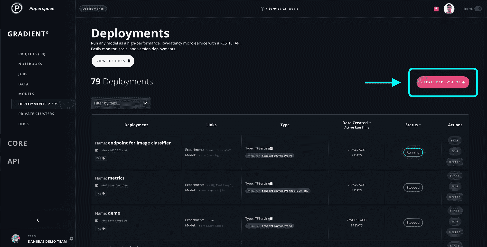
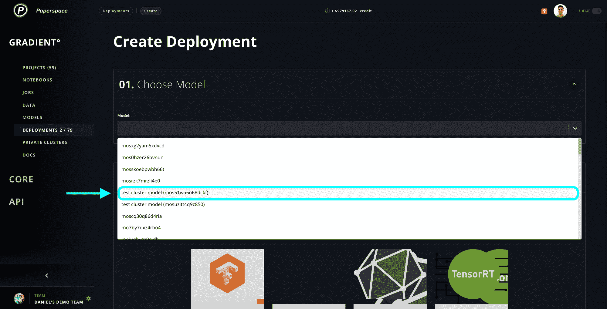
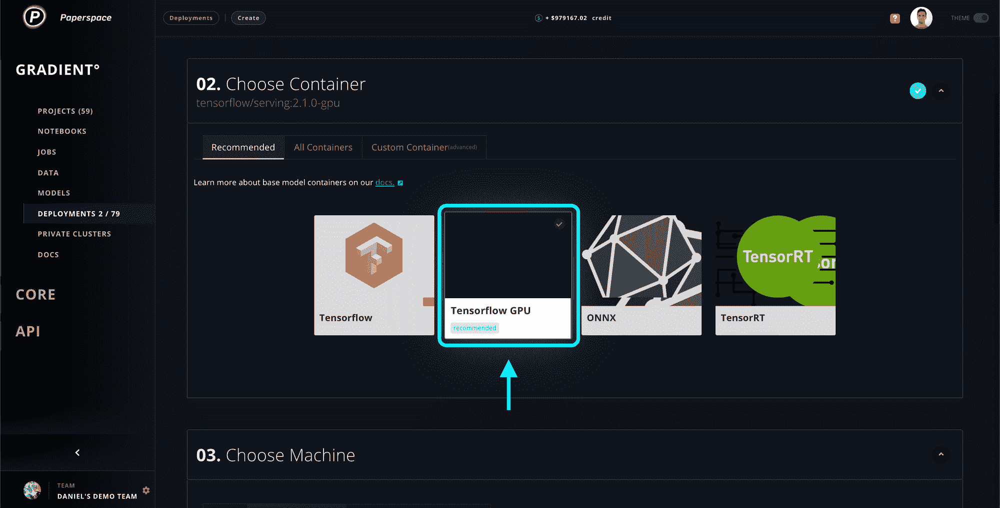
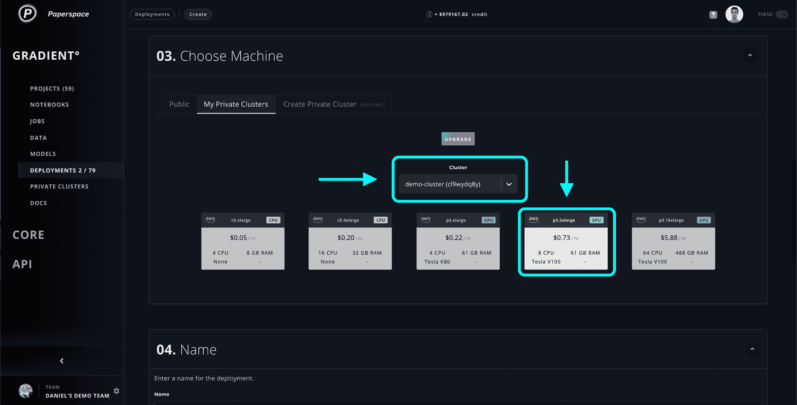
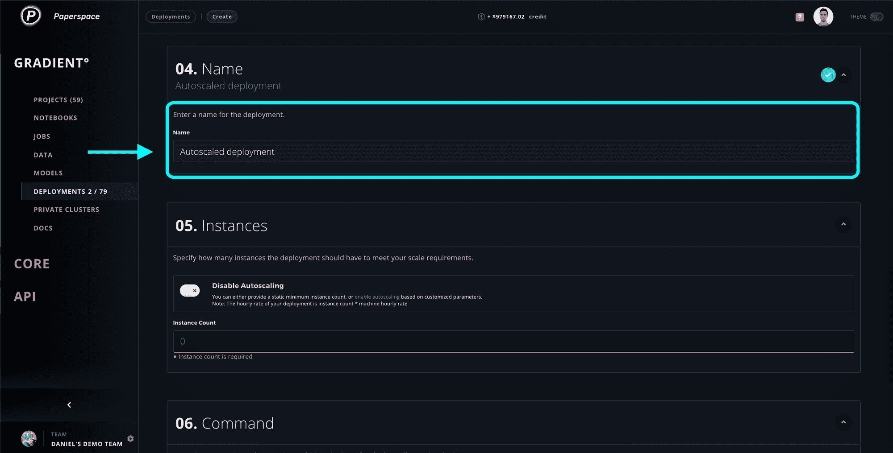
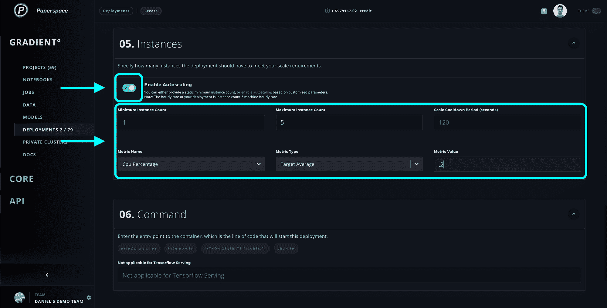
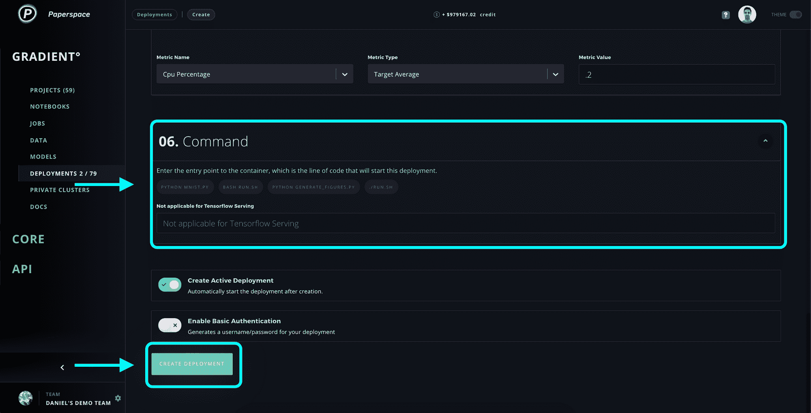
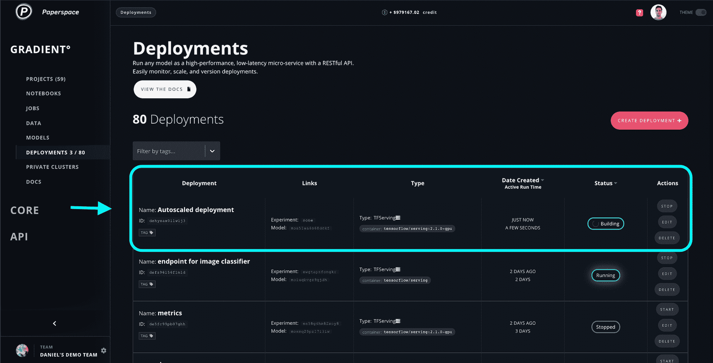

# 自动缩放现在可用于模型服务和部署

> 原文：<https://blog.paperspace.com/autoscaling-paperspace-gradient/>

我们很高兴地宣布发布用于模型服务和图纸空间梯度部署的[自动缩放](https://docs.paperspace.com/gradient/deployments/managing-deployments/deployment-autoscaling)。

自动缩放是一种重要的 MLOps 工具，用于动态调整专用于机器学习工作负载的计算资源或实例。

自动伸缩的好处有很多:

*   自动而不是手动分配实例
*   由于实例会自动供应/取消供应，因此可严格控制成本
*   自动实例故障转移带来的高可用性

要自动缩放梯度上的部署，请执行以下步骤:

**步骤 0 -创建部署**

**步骤 1 -选择要部署的型号**

**步骤 2 -选择推荐容器或定制容器**

**步骤 3 -选择一个集群和一台机器**

**步骤 4 -为部署命名**

**步骤 5 -启用自动缩放并提供目标自动缩放参数**

**步骤 6——提供容器的入口点(可选),然后创建您的部署！**

此时，您应该已经在部署控制台中构建了一个全新的自动伸缩部署！恭喜你！

有关自动扩展部署和模型服务的更多信息，请阅读文档。

如果您有任何问题，欢迎[给我们留言](https://support.paperspace.com/hc/en-us/requests/new)！