# 向三维模型添加背景图像和纹理的基础知识

> 原文：<https://blog.paperspace.com/basics-of-adding-background-images-and-textures-to-your-3-d-models/>

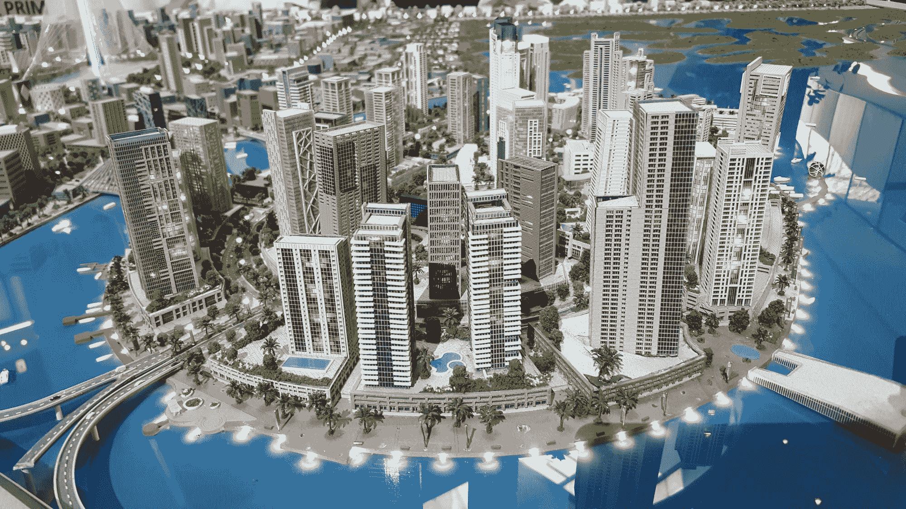

Photo by [Syed Hussaini](https://unsplash.com/@syhussaini?utm_source=ghost&utm_medium=referral&utm_campaign=api-credit) / [Unsplash](https://unsplash.com/?utm_source=ghost&utm_medium=referral&utm_campaign=api-credit)

‌Creating 3-D 模型和为真实世界的应用部署他们是发展他们的一个主要方面。这些创建的模型用于许多目的，例如卡通设计、电影动画、游戏设计、建筑结构等等。3d 建模的这些成就是杰出的，并且随着更新的方法和技术的引入，在下面的领域中有持续的进展。

在 Blender 中使用 Python 脚本进行三维建模系列的第一部分中，我们介绍了大部分重要的基本需求。然而，人们可能会注意到，我们实施的项目在颜色方面缺乏光泽。这个概念正是我们将在这个三维建模系列的第二部分中理解和讨论的。在这篇文章中，我们将添加一些非常需要的背景和纹理到猴子的网格中。快速浏览一下目录，对即将讨论的话题有一个直觉。

### 目录:

*   介绍
*   用 Blender 给你的三维模型添加背景
*   用 Python
    1 在 Blender 中添加背景。导入基本库
    2。进口猴网
    3。选择摄像机
    4。在相机视图中显示背景
    5。合成背景
    6。将渲染图像保存在相应的路径中
*   用 Blender 给你的三维模型添加纹理
*   用 Python
    1 在 Blender 中添加纹理。导入基本库
    2。添加猴子网
    3。定位摄像机
    4。添加纹理
    5。将其分配给对象
    6。保存渲染的图像
*   背景和纹理的最终组合
*   结论

## 简介:

将背景图像和纹理添加到三维对象的过程在三维建模中具有重要意义。除了使整个结构和外观更加美观，它还增加了质量和我们的模型的吸引力。在上一篇文章中，我们设计了具有多个摄像机视图的多个模型(猴子网格)。然而，整体结构是非常基本的，不包括任何其他核心细节。因此，生成的整体渲染图像并不吸引人，也不太真实。

在本文中，我们将改变这一因素的应用背景和纹理到我们的模型。我们将首先借助唯一的 Blender 和 Blender 中提供给用户的众多工具来实现后台。一旦我们在 Blender 中成功实现了下面的任务，我们将继续分析如何在 Python 编程的帮助下执行完全相同的操作。

在一些 Python 代码块的帮助下，我们可以理解这些操作是如何工作的，以及我们如何轻松地复制相同的任务。类似于背景生成，我们也将为使用 Blender 和 Python 编程添加的纹理执行类似的实现。一旦我们能够独立地实现添加背景和相应地添加纹理的任务，我们就可以继续将它们结合在一起并适应对象网格。搅拌机文件和代码的背景和猴子网格纹理的成功实施将提供。

* * *

## 使用 Blender 为您的三维模型添加背景:

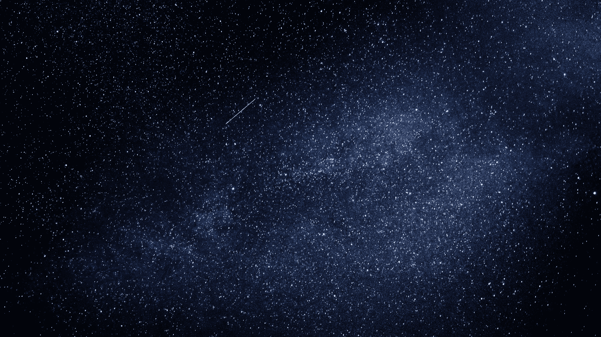

Photo by [Federico Beccari](https://unsplash.com/@federize?utm_source=unsplash&utm_medium=referral&utm_content=creditCopyText) on [Unsplash](https://unsplash.com/s/photos/universe?utm_source=unsplash&utm_medium=referral&utm_content=creditCopyText)

上面的图片是我们将在整篇文章中使用的背景图片之一。我建议下载上面的图像，并将其保存在一个可访问的目录中，命名为“Universe.jpg ”,以便在整个项目中多次重用该图像。确保您记住了存储此图片的路径，以便您可以使用 Blender 打开它，或者指定 Python 路径来访问图像。重申一下，本文假设开发人员已经掌握了一些使用 Blender 的基本知识，或者已经阅读了这个 3d 建模系列的第一部分。让我们从进行必要的导入和给对象添加背景开始。

第一步是确保删除默认情况下放置在 Blender 屏幕中心位置的初始立方体。您可以用鼠标选择对象，然后单击键盘上的“删除”按钮。执行此操作的基本步骤在第一篇文章中有详细介绍。如果你有任何疑问，请再次访问这个三维建模系列的一部分。一旦猴子网格被放置在搅拌机屏幕上，我们的下一步是相应地调整相机或对象。

无论您选择改变对象的位置还是相机的位置，都没有关系。作为参考，我将改变摄像机的位置。与第一篇文章类似，在 Blender 中点击相机模块，按下键盘上的‘G’将其拖动到合适的位置。一旦你把它拖到需要的位置，你也可以点击键盘上的“R ”,选择相应的轴来旋转相机。您可以选择“X”、“Y”或“Z”轴来旋转和放置摄像机到所需的位置。一旦这一步完成，你应该有一对夫妇的数字，看起来像下图所示。

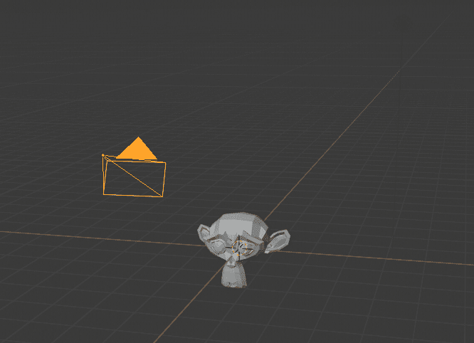

选中相机，点击数字小键盘 0 按钮查看视图。一旦确认您拥有完美的视图，下一步就是确保相应地调整设置和属性。在 Blender 平台的右侧，你会找到属性窗口，在这里你可以点击相机图标并检查背景图片选项。勾选小方框后，可以选择添加自己选择的背景图片。记住之前保存“Universe.jpg”的路径，然后继续将图像添加到 Blender。另一个确保你完成的步骤是点击属性窗口中的渲染属性图标，向下滚动到电影部分。检查透明图标，你最终可以继续重新点击数字小键盘 0 按钮来查看相应背景中的对象。

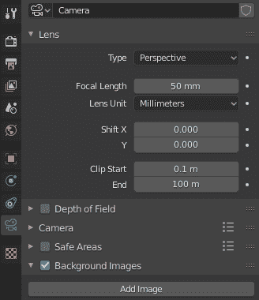

如果所有的步骤都准确地执行到这一步，那么用户就可以用相机视图查看背景。但是，当您尝试通过单击键盘上的 F12 按钮或转到菜单选项卡中的渲染选项并单击渲染图像来渲染图像时，您会注意到背景尚未应用于整个图像。尽管背景在相机视图中是可见的，但还没有应用到我们的渲染设置中。虽然你可以截图，并保存在桌面上的图像，我们将需要许多不同类型的应用程序的实际渲染图像。因此，我们的下一步是添加所需的合成，以便我们查看背景图像，包括渲染。下图显示了放置在相机视图中相应宇宙背景中的猴子网格的表示。

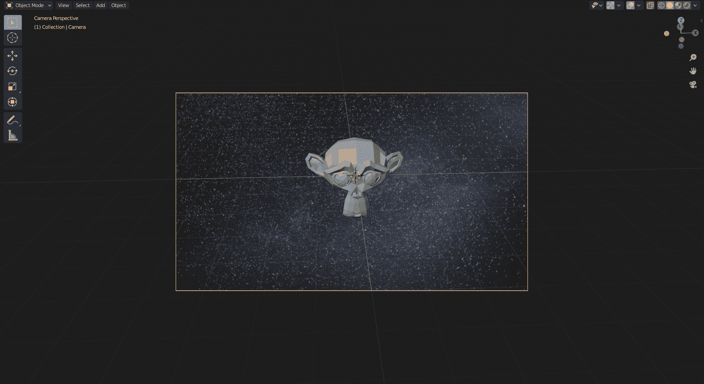

现在我们已经在相机视图中有了所需的网格和适当的背景，我们的下一个任务是执行合成动作，以便我们的图像将在渲染设置中包括对象网格和宇宙背景。点击主菜单栏中的合成选项。进入新布局后，选择(选中)屏幕上可用的使用节点选项。选中使用节点选项将显示渲染层和合成框，我们可以利用它们来构建我们的背景。我们将需要添加三个额外的盒子，并为每个盒子设置一些属性，以便我们可以在渲染视图中访问背景。按照下面提到的剩余步骤操作，并确保您的属性设置如示意图所示。

1.  首先，我们将借助图像节点添加我们需要通过的输入图像。为了创建这个节点，在合成菜单栏中找到添加图标，并遵循这些步骤-
    $ Add->Input->Image $
    一旦添加了输入图像节点，我们的下一个任务是添加宇宙的 jpg 图像(或您之前使用的任何其他背景图像)。这一步可以通过选择浏览图像字段直接选择宇宙背景图像或从保存的目录中打开它来完成。这两种方法都可以，但最好遵循前者而不是后者，因为它直接为您提供了各自图像的选项。
2.  我们将添加的下一个块是缩放块，这样我们就可以使我们的模型适合渲染尺寸。为了执行下面的动作，这些是必要的步骤-
    $ Add->->Distort-【Scale $
    一旦我们添加了缩放节点，请确保您将坐标空间从相对大小更改为渲染大小。下面的更改将允许我们根据需要在渲染空间中查看图像。
3.  我们将在合成部分添加的第三个也是最后一个节点是 Alpha Over 节点。如果前景图像像素的 Alpha 值大于零，该节点通过将图像层叠在彼此之上来帮助协调整个过程。如果条件满足，那么背景图像将被覆盖。执行这个动作的步骤如下-
    $ Add->Color->Alpha Over $
    一旦你添加了最后一个 Alpha Over 节点，我们就可以继续连接所有的图层了，如下图所示。将使用 Python 代码进一步讨论详细的连接。现在，您可以进行适当的连接，如下图所示。

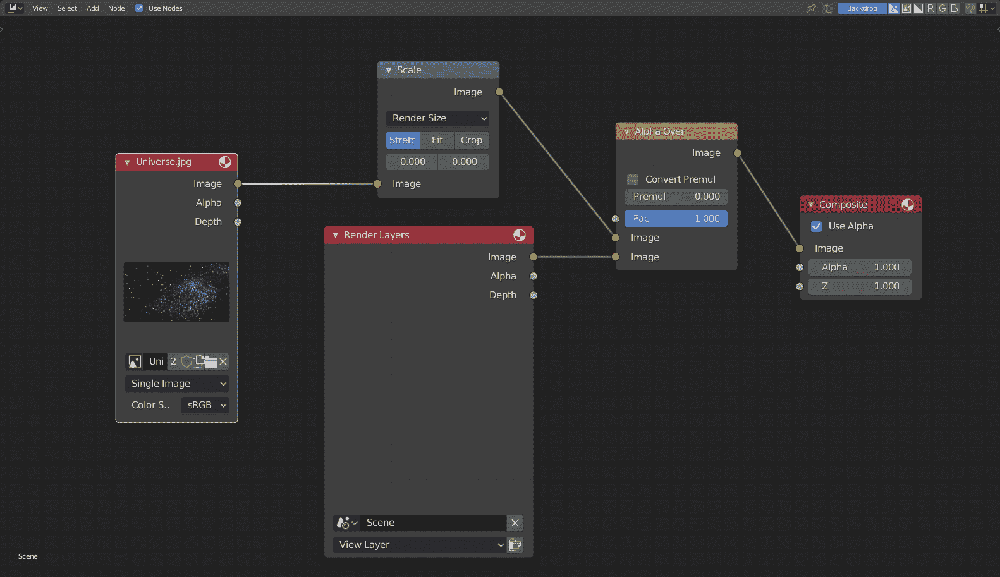

最后，通过单击键盘上的 F12 按钮或从菜单栏中选择渲染和渲染图像选项来选择渲染图像选项。带有对象网格的背景的实现成功完成。现在我们知道了如何用 Blender 及其工具添加各自的背景，对于用户来说，理解如何用 Python 编写以下代码也变得很重要。对于像 SMPL 模型这样的编码模型，可以帮助开发人员用 Python 自动完成这个过程，在这种情况下，您需要生成多个副本，并且只有很少或没有变化。因此，理解如何利用 Blender 中可用的 Python 开发环境来产生更有效的结果是至关重要的。让我们从学习如何用 Python 给 Blender 添加背景开始。

* * *

## 使用 Python 在 Blender 中添加背景:

在 Blender 中众多可用工具的帮助下，我们已经成功地完成了 Blender 中背景的添加。但是，需要确保我们可以在 Blender 中自动化我们的创作，我们可以在 Python 的帮助下实现这个任务。我们将导入一些基本的库，导入猴子网格，选择我们的相机，并在相机视图中显示背景。最后，我们将执行合成过程，并将渲染图像保存在适当的目录中。所有代码块都将在 Blender 的文本编辑器环境中编写。

### 导入基本库:

第一步是导入所有必要的库，正如我在上一篇文章中提到的。这些导入是访问 Blender 中的环境变量所必需的，而 Python 中预建的 math 函数将用于特定的数学运算。

```py
import bpy
import math
```

### 导入猴子网格:

我们的下一步是删除搅拌机屏幕中的默认立方体，并用产卵位置的猴子网格替换它。关于与本节相关的代码的更多细节，请访问使用 Blender 的 Python 脚本简介，因为我已经解释了下面的步骤。

```py
#  Remove The Default Cude Object
# bpy.ops.object.delete(use_global=False)

for o in bpy.context.scene.objects:
    if o.name == "Cube":
        bpy.ops.object.delete(use_global=False)

# Import the monkey mesh
bpy.ops.mesh.primitive_monkey_add(location = (0, 0, 0))
```

### 选择摄像机:

我们的下一步是选择 Blender 中可用的默认相机。一旦我们选择了相机，我们将把图像路径设置为我们在。jpg 格式。对于下一步，我们可以改变猴子网格的位置，或者改变相机的位置，使得对象的位置以合适的方式与相机对齐。在下面的代码块中，我选择改变相机的位置，这样对象将直接放置在相机的线性位置。对于这个特定的任务，位置和旋转角度是近似选择的。您可以随意更改和试验相机放置的位置和旋转角度。

```py
# Selecting the camera and adding the background
cam = bpy.context.scene.camera
filepath = "D:\\Cool Projects\\Paperspace\\3-D Models\\Universe.jpg"

# Locations
cam .location.x = -0.71
cam .location.y = -12
cam .location.z = 5.5

# Rotations
cam .rotation_euler[0] = math.radians(64)
cam .rotation_euler[1] = math.radians(-0)
cam .rotation_euler[2] = math.radians(-3)
```

### 在摄像机视图中显示背景:

我们的下一步是在相机视图中显示背景图像。为了执行此操作，我们将访问存储在文件路径变量中的图像路径。一旦我们加载了背景图像，我们将确保它在相机视图中是可访问的。在我们将背景图片参数设置为真之后，我们将把背景图片添加到我们的相机视图中。最后一步是确保我们根据我们的需求设置了所选相机的渲染属性。唯一需要的是在渲染属性中启用电影部分的透明值为 True。所有提到的活动都可以用下面显示的代码块来执行。

```py
# Displaying the Background in the camera view
img = bpy.data.images.load(filepath)
cam.data.show_background_images = True
bg = cam.data.background_images.new()
bg.image = img
bpy.context.scene.render.film_transparent = True
```

如果到目前为止您已经正确地遵循了所有步骤，那么在选择相机并单击键盘上的 Numpad 0 按钮时，您将会看到下面的图像。

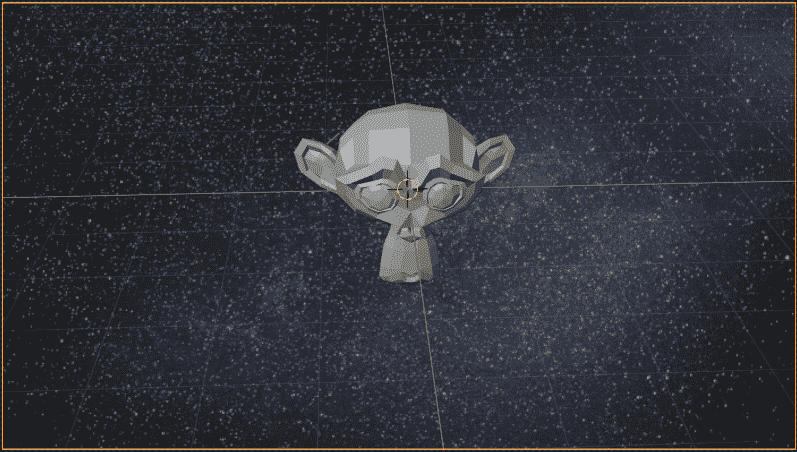

此时，您可以放大各自图像的视图，并截图保存在桌面上。但是，如果您想要按照更复杂的过程将整个渲染图像保存在您的桌面上，而不必查看相机模式并拍摄截图，那么我们必须遵循与上一节类似的过程。背景合成技术将利用与先前生成的背景任务类似的方法，但是在 Python 代码块的帮助下，相应地执行以下操作。让我们看看新的合成部分，以了解逐步的过程。

### 合成背景:

为了合成背景，我们首先将上下文区域从默认布局(或文本编辑器)转换到合成部分，并部署所有可用的节点。我们将确保该程序可重新运行，不会导致任何错误。因此，for 循环将在初始运行期间删除所有节点。然后，我们开始确定所有节点的适当位置，并将它们添加到各自的位置。我们还将使用与之前在我们的 Blender 构建中提到的节点完全相同的节点，并将所有参数设置为与实际的构造架构相似。使用 Python 代码，我们可以更容易地理解所有的链接，如连接图所示。我们将第一个图像链接(索引为 0 的链接)连接到第一个缩放节点。缩放节点的第一个链接和渲染层节点的第一个链接分别指向 Alpha Over 节点的第一个和第二个链接。最终的连接是 Alpha Over 节点链接到复合节点的输入链接的输出。完成所有步骤后，我们将恢复文本编辑器的默认布局。

```py
### Compositing

bpy.context.area.ui_type = 'CompositorNodeTree'

#scene = bpy.context.scene
#nodetree = scene.node_tree
bpy.context.scene.use_nodes = True
tree = bpy.context.scene.node_tree

for every_node in tree.nodes:
    tree.nodes.remove(every_node)

RenderLayers_node = tree.nodes.new('CompositorNodeRLayers')   
RenderLayers_node.location = -300,300

comp_node = tree.nodes.new('CompositorNodeComposite')   
comp_node.location = 400,300

AplhaOver_node = tree.nodes.new(type="CompositorNodeAlphaOver")
AplhaOver_node.location = 150,450

Scale_node = tree.nodes.new(type="CompositorNodeScale")
bpy.data.scenes["Scene"].node_tree.nodes["Scale"].space = 'RENDER_SIZE'
Scale_node.location = -150,500

Image_node = tree.nodes.new(type="CompositorNodeImage")
Image_node.image = img  
Image_node.location = -550,500

links = tree.links
link1 = links.new(RenderLayers_node.outputs[0], AplhaOver_node.inputs[2])
link2 = links.new(AplhaOver_node.outputs[0], comp_node.inputs[0])
link3 = links.new(Scale_node.outputs[0], AplhaOver_node.inputs[1])
link4 = links.new(Image_node.outputs[0], Scale_node.inputs[0])

bpy.context.area.ui_type = 'TEXT_EDITOR'
```

### 将渲染图像保存在各自的路径中:

最后，我们将按照各自的比例渲染所有的图像，并创建一个包含存储图像的目录的图像路径。最后，我们将把图像写入各自的路径，在那里我们将存储渲染的图像。下面的代码块显示了在各自的路径中适当保存渲染图像的整个过程。

```py
### Rendering Procedure
render = bpy.context.scene.render
scale = render.resolution_percentage / 100

FILE_NAME = "Space Monkey.png"
FILE_PATH = "D:\\Cool Projects\\Paperspace\\3-D Models\\Space Monkey.png"

# Save Previous Path
previous_path = bpy.context.scene.render.filepath

# Render Image
bpy.context.scene.render.filepath = FILE_PATH
bpy.ops.render.render(write_still=True)

# Restore Previous Path
bpy.context.scene.render.filepath = previous_path
```

随着猴子网格的渲染图像与宇宙背景的保存过程的完成，我们可以继续本文的下一部分，在这里我们将了解如何将纹理部署到我们的 3-D 模型。与添加所需的背景相比，这个过程和步骤更简单，使用 Blender 只需更少的步骤，或者使用 Python 只需更少的代码行就可以完成。

* * *

## 使用 Blender 向您的三维模型添加纹理:

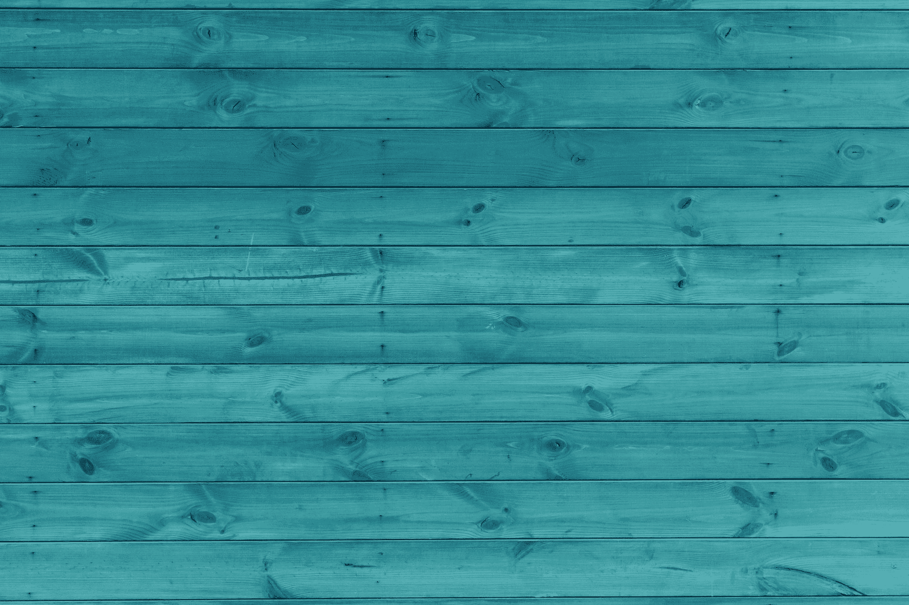

Photo by [Ashkan Forouzani](https://unsplash.com/@ashkfor121?utm_source=unsplash&utm_medium=referral&utm_content=creditCopyText) on [Unsplash](https://unsplash.com/s/photos/background-texture?utm_source=unsplash&utm_medium=referral&utm_content=creditCopyText)

在了解了如何使用 Blender 中的工具包和 Blender 中的 Python 脚本来实现任何类型的网格的背景之后，我们现在将看看如何向相应的网格(或对象)添加一些纹理。下载上面的图片，标注为“background.jpg”(或者 texture.jpg)。第一步是删除搅拌机屏幕中的默认立方体，并添加猴子网格。一旦这一步完成，选择猴子对象，并转到搅拌机屏幕右侧的材质属性。如果你感到困惑，请查看下图。

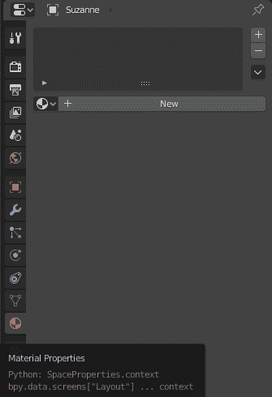

点击新建按钮图标创建一个新的物料。一旦这种新材料被添加，是时候设置表面。我们将坚持默认的原则性 BSDF 着色器选择。对于这个特定的任务，有几个选项可用，但我们选择有原则的 BSDF 着色器，因为它将多个层合并到一个易于使用的节点中。虽然有许多其他选择和参数，你可以设置执行添加纹理的行动，我们将只侧重于添加我们想要的背景，而不改变任何其他属性。

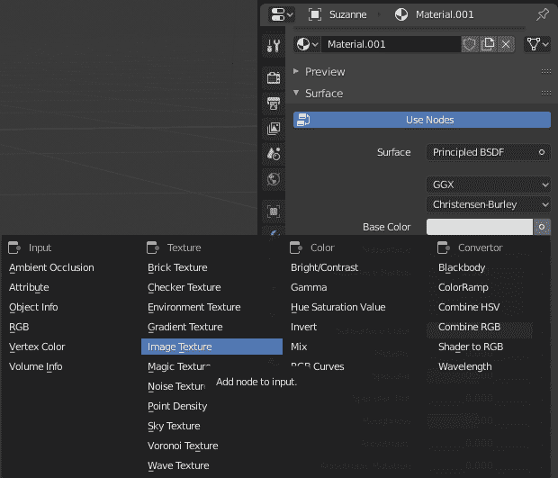

一旦你点击图像纹理选项，你会发现在基色下有三个新的选项。这三个可用选项是浏览要链接的图像、创建新图像或打开图像。因为我们已经下载了想要添加到猴子网格的纹理，我们将选择打开选项。一旦你点击了打开图标按钮，你可以浏览你的文件夹，直到你找到合适的目录，在那里你已经存储了你的纹理图像。一旦你选择了纹理图像，我们几乎所有的步骤都完成了。将实体对象的视口着色更改为渲染状态，您可以在对象上看到导入的纹理。让我们也了解如何在 Python 脚本的帮助下执行这些操作。下面是纹理物体的最终视图。

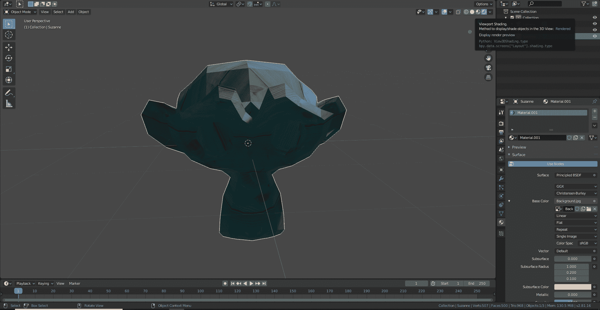

* * *

## 使用 Python 在 Blender 中添加纹理:

既然我们已经看完了用 Blender 给你想要的网格或者物体添加纹理是多么简单，让我们也来分析一下如何用 Python 编程来执行同样的任务。一些初始步骤将保持类似于添加背景，例如导入库，添加猴子网格，相应地调整相机，并保存渲染图像。添加所需纹理并将其分配给对象的概念是我们将更多关注的主要目标。因此，这两个概念将优先于其他概念。让我们开始编码添加纹理到各自的对象。

### 导入基本库:

我们的主要进口商品将和以前讨论的一样。有关更多信息，请参考前面的添加背景部分或前面的介绍文章。

```py
import bpy
from bpy import context, data, ops
import math
```

### 添加猴子网格:

接下来，我们将确保删除 Blender 中提供的默认立方体，并用猴子网格替换它，猴子网格将放置在 Blender 文件中心的(0，0，0)位置。

```py
#  Remove The Default Cude Object
# bpy.ops.object.delete(use_global=False)

for o in bpy.context.scene.objects:
    if o.name == "Cube":
        bpy.ops.object.delete(use_global=False)

# Import the monkey mesh
bpy.ops.mesh.primitive_monkey_add(location = (0, 0, 0))
```

### 定位摄像机:

然后，我们将继续放置相机，使其跟踪猴子网格的中心空间。我们将改变位置和旋转轴，如下面的代码块所示。这些值是近似确定的，用户可以随意试验。此外，另一个需要注意的要点是，您也可以更改猴子网格的位置。或者你可以选择不做任何改变。

```py
# Adjust Camera Locations
cam = bpy.context.scene.camera

# Locations
cam .location.x = -0.71
cam .location.y = -12
cam .location.z = 5.5

# Rotations
cam .rotation_euler[0] = math.radians(64)
cam .rotation_euler[1] = math.radians(-0)
cam .rotation_euler[2] = math.radians(-3)
```

### 添加纹理:

随着我们的主要步骤完成，我们终于可以继续添加所需的纹理到选定的网格。请注意，您也可以根据自己的需要添加任意颜色。然而，我们将集中在添加下载的纹理到我们的网格对象。第一步是创建一个新的材质，为下面的材质提供一个名称，并将其存储在一个变量中。对于这个变量，我们将把节点的使用指定为 True。现在，我们可以访问这个变量的众多节点，我们将设置我们的树节点与原则性的 BSDF 着色器选择。对于这个特定的任务，有几个选项可用，但我们选择有原则的 BSDF 着色器，因为它将多个层合并到一个易于使用的节点中。然后，我们将包含位置的路径添加到存储的纹理图像中。最后一步是将输入节点与存储纹理图像的最终输出链接相链接，并确保我们的上下文对象被设置为活动的。

```py
# Adding the texture
mat = bpy.data.materials.new(name="New_Mat")
mat.use_nodes = True
bsdf = mat.node_tree.nodes["Principled BSDF"]
texImage = mat.node_tree.nodes.new('ShaderNodeTexImage')
texImage.image = bpy.data.images.load("D:\\Cool Projects\\Paperspace\\3-D Models\\Background.jpg")
mat.node_tree.links.new(bsdf.inputs['Base Color'], texImage.outputs['Color'])

ob = context.view_layer.objects.active
```

### 将其分配给对象:

选择必须应用以下纹理的对象，并将其设置为包含所有节点和链接的声明变量。最后一步是将我们的维度查看空间从默认的实体视口着色更改为渲染视口着色。我们可以注意到，选定的对象已经获得了我们最初选择的所需纹理图像。这个完整的步骤可以由下面显示的代码块来执行。

```py
# Assign it to object
if ob.data.materials:
    ob.data.materials[0] = mat
else:
    ob.data.materials.append(mat)

# Change the ViewPort Shading to RENDERED    
for area in bpy.context.screen.areas: 
    if area.type == 'VIEW_3D':
        for space in area.spaces: 
            if space.type == 'VIEW_3D':
                space.shading.type = 'RENDERED'
```

### 保存渲染图像:

最后一步是将纹理网格保存到用户选择的所需路径位置。这个步骤类似于前面讨论的图像渲染技术。确保您设置了所需的路径，并相应地按照前面的方法进行操作，或者查看下面显示的代码块，以将渲染的图像保存在所需的位置。一旦这一步完成，我们可以相应地结合背景和纹理。

```py
### Rendering Procedure
render = bpy.context.scene.render
scale = render.resolution_percentage / 100

FILE_NAME = "Textured Monkey.png"
FILE_PATH = "D:\\Cool Projects\\Paperspace\\3-D Models\\Textured Monkey.png"

# Save Previous Path
previous_path = bpy.context.scene.render.filepath

# Render Image
bpy.context.scene.render.filepath = FILE_PATH
bpy.ops.render.render(write_still=True)

# Restore Previous Path
bpy.context.scene.render.filepath = previous_path
```

* * *

## 背景和纹理的最终组合:

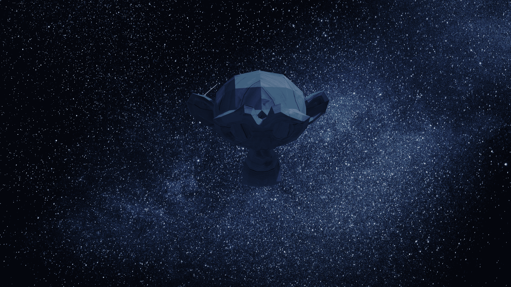

如果到目前为止你已经成功地完成了教程，我们已经实现了添加背景和添加期望的纹理到我们的网格对象的任务。虽然我们已经单独完成了这两项任务，但是当我们使用我们获得的知识将这两个元素结合在一起并将其包装成一个实体时，它会变得更好。上面的图像是当你尝试对物体进行背景和纹理的组合时，你将会得到的最终结果。

为了在网格上执行背景和纹理的组合，您可以遵循本文的 Blender only 实现，或者遵循教程的 Python 编码实现，或者使用从这两个单独方面获得的知识的混合，从而产生可能的最佳结果。Blender 文件和 Python 文件都将被提供。如果用户被困在某个特定的点上，他们可以自由地访问这些实用程序来消除他们的困惑。如果您确实遇到了任何问题，请调试它们，因为这将帮助您了解更多信息。

* * *

## 结论:


Photo by [Micheile Henderson](https://unsplash.com/@micheile?utm_source=ghost&utm_medium=referral&utm_campaign=api-credit) / [Unsplash](https://unsplash.com/?utm_source=ghost&utm_medium=referral&utm_campaign=api-credit)

在本文中，我们学习了如何在 Blender 中添加背景和纹理。对于这两个任务，我们知道如何在 Blender 中用它提供给开发者的众多工具来实现它们。除了使用 Blender 提供的开发工具之外，我们还了解了如何在众多不同 Blender 布局之一提供的文本编辑器中借助 Python 脚本来实现和执行添加相应背景和纹理的任务的完整过程。一旦我们单独实现了这些元素，我们最终会将它们结合起来，创建一个改进的、更美观的渲染图像。

在这个 3d 建模系列的第一部分中，我们了解了如何实现多个猴子网格并在多摄像机视图中查看它们。虽然我们在第一节中介绍了大部分基本概念，但我们在本文中的主要焦点是更深入地探讨 Blender 的视觉方面。我们添加了背景和纹理，以提供更好的外观，使其更具美感。在这个三维建模系列的下一部分，我们将分别研究如何执行动画和如何使用 SMPL 模型。在那之前，继续尝试，享受学习吧！