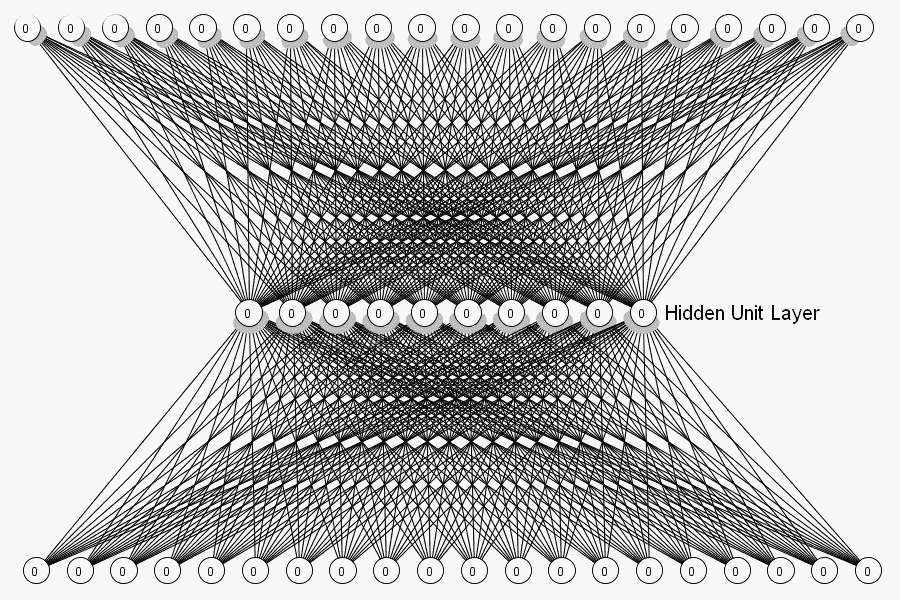
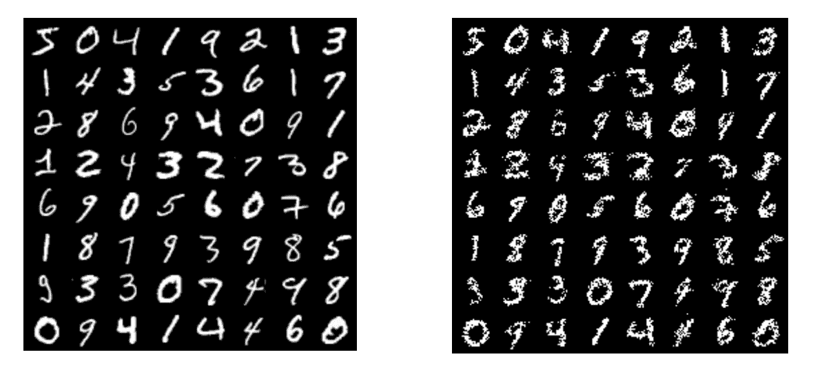
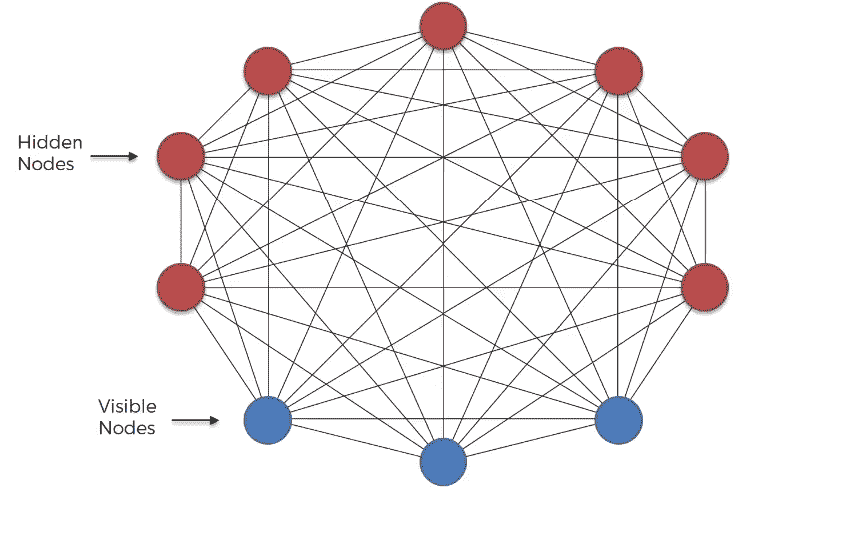
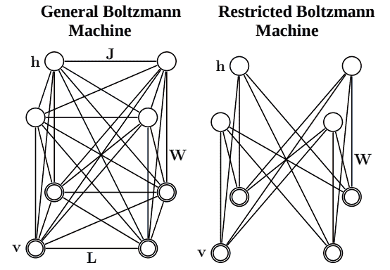
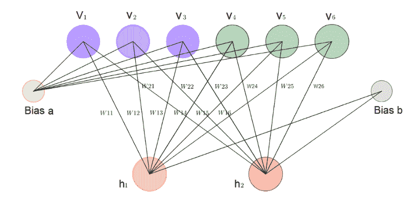
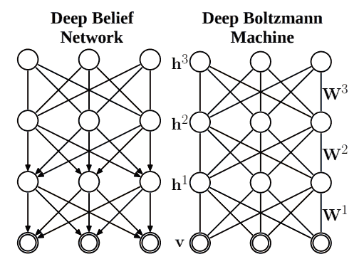
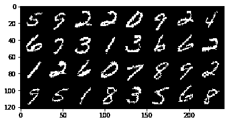

# PyTorch 中玻尔兹曼机器的初学者指南

> 原文：<https://blog.paperspace.com/beginners-guide-to-boltzmann-machines-pytorch/>

随着研究的进展，研究人员可以带来更多关于人类大脑架构的证据，**连接主义者**机器学习模型成为人们关注的焦点。连接主义模型，也称为并行分布式处理(PDP)模型，由高度互连的处理单元组成。这些模型通常用于复杂的模式，如人类行为和感知。类似地，像建立视觉、感知或任何约束满足问题的模型这样的任务需要强大的计算能力。这种模型所需的硬件支持以前是不存在的——也就是说，直到 VLSI 技术和 GPU 的出现。这是当**玻尔兹曼机器**被开发出来的时候。在本文中，我们将讨论玻尔兹曼机器的工作原理，并在 PyTorch 中实现它们。

将涵盖以下主题:

*   波尔兹曼机器背后的故事
*   玻尔兹曼机器的工作
*   波尔兹曼机器背后的直觉
*   CSP 的玻尔兹曼机器
*   超参数
*   不同类型的玻尔兹曼机器
*   PyTorch 中的实现

## 波尔兹曼机器背后的故事

有时被称为“深度学习之父”的杰弗里·辛顿(Geoffrey Hinton)与约翰·霍普金斯大学教授特里·塞伊诺夫斯基(Terry Sejnowski)一起制定了玻尔兹曼机器。人们常说，玻尔兹曼机器位于深度学习和物理学的交界处。这些模型基于**并行处理方法**，该方法广泛用于降维、分类、回归、协作过滤、特征学习和主题建模。要注意的是，在玻尔兹曼机器的构建神经网络的词汇中，并行性归因于隐藏层的权重的并行更新。

## 玻尔兹曼机器的工作

玻尔兹曼机器的工作主要受玻尔兹曼分布的启发，玻尔兹曼分布认为系统的当前状态取决于系统的能量和当前运行的温度。因此，为了将它们实现为神经网络，我们使用能量模型。能量项相当于实际答案的偏差。能量越高，偏差越大。因此，训练模型直到它达到低能点是很重要的。很明显，这种理论模型会遇到局部极小值问题，导致结果不太准确。



Intuition of Boltzmann Machines

通过允许模型周期性地跳跃到更高的能量状态，然后收敛到最小值，最终导致全局最小值，解决了这个问题。我们将在后面的章节中更详细地讨论能量模型。

现在让我们看看玻尔兹曼机器如何应用于两类问题，即学习和搜索。

*   **学习**:当波尔兹曼机器被用于学习时，它们试图从输入中获得重要的特征，重建这个输入，并通过并行更新权重将其作为输出。让我们以 MNIST 数据集为例。下图显示了应用于 MNIST 数据集时受限玻尔兹曼机器的重构输出。



需要注意的是，在这个学习和重建过程中，玻尔兹曼机器也可能会学习预测或插值缺失的数据。考虑使用电影评论数据集。使用波尔兹曼机器，我们可以预测用户是否会喜欢或不喜欢一部新电影。

*   **搜索:**玻尔兹曼机器的架构和工作非常适合解决约束满足问题(搜索可以满足所有约束的解决方案)，即使它具有弱约束。具有弱约束的问题试图获得与完全满足所有约束的答案足够接近的答案，即答案不需要完全满足所有约束。

在下一节中，让我们详细研究玻尔兹曼机器的体系结构。

## 波尔兹曼机器背后的直觉

与我们迄今为止看到的其他神经网络模型不同，玻尔兹曼机器的架构非常不同。输入层和输出层之间没有明确的界限。实际上没有输出层。玻尔兹曼机器中的节点简单地分为可见节点和隐藏节点。可见节点接受输入。接收输入的相同节点将返回重构的输入作为输出。这是通过双向权重实现的，双向权重将向后传播并在可见节点上呈现输出。

该体系结构的一个主要改进是每个节点都连接到所有其他节点，甚至在同一层中(例如，每个可见节点都连接到所有其他可见节点以及隐藏节点)。所有链路都是双向的，权重是对称的。下面是一个解释相同的图像。



此外，每个节点只有两种可能的状态，即开和关。节点的状态由与其相关的权重和偏差决定。提供给模型的输入，即与该特定输入直接或间接相关的节点(假设)将打开。

## CSP 的玻尔兹曼机器

如前所述，波尔兹曼机器在处理学习问题和搜索问题时所遵循的方法是不同的。

> 约束满足问题简称为 CSP

在搜索问题的情况下，连接上的权重是固定的，并且它们用于表示优化问题的成本函数。通过利用随机方法，玻尔兹曼机器对二进制向量进行建模，并找到可以作为优化问题的良好解决方案的最佳模式。在学习问题的情况下，模型试图学习权重，以提出状态向量作为手头问题的良好解决方案。让我们通过研究架构如何塑造自己来解决约束满足问题(CSP)来把事情弄清楚。

体系结构中的每个节点都是一个假设，任何两个节点之间的连接都是约束。如果假设 h1 支持假设 h2，那么这种联系是肯定的。由于波尔兹曼机器可以解决弱约束的约束满足问题，每个约束都有一个与之相关的重要性值。连接权重决定了这个约束的重要性。如果权重很大，则约束更重要，反之亦然。在没有证据支持假设的情况下，施加在每个节点上的偏置决定了节点“开启”的可能性。如果偏置为正，则该节点保持“开”，否则保持“关”。

使用这样的设置，随着越来越多的例子被输入到模型中，权重和状态被改变；直到并且除非它能够产生满足大多数优先约束的输出。如果生成了足够好的输出，则训练过程可以停止。这里的问题是，如果让模型处于低能量状态，输出据说是好的。最低的能量输出将被选为最终输出。

## 玻尔兹曼机器的超参数

与其他神经网络结构相对应，超参数在训练玻尔兹曼机器中起着至关重要的作用。除了典型的激活率、丢失率和学习率之外，以下是几个需要优先考虑的重要超参数。

1.  **重量初始化**:重量初始化是训练过程中的一个重要步骤。权重的正确初始化可以节省大量时间，因为它可以优化学习这些权重所需的时间，这是训练网络的全部思想。随着权重变得更好，网络可以发送更好的信号，使其分类结果更准确。
2.  ******可见和隐藏单位:****** 输入的个数是明确赋予网络的特征。必须最优地选择隐藏特征的数量，以使网络掌握大多数特征。这些层中的每一层都有自己的变换函数来处理输入并将它们传递到下一层。
3.  ******正则化:****** 通过正则化，一个网络的过拟合几率被拉走。每当模型过拟合或学习到较大的权重时，它就会受到惩罚，因为它有助于将权重降低到可接受的水平。

在下一节，让我们回顾不同类型的玻尔兹曼机器。

## 玻尔兹曼机器的类型

正如所讨论的，Boltzmann 机被开发来模拟具有弱约束的约束满足问题。但是它的范围已经扩展到解决其他各种问题。玻尔兹曼机器有一些变化，这些变化随着时间的推移而发展，以根据它们所处的用例来解决这些问题。让我们在下面的章节中简单回顾一下。

### 有记忆的玻尔兹曼机器

在传统的波尔兹曼机器中，一个节点知道所有那些此刻触发当前节点的节点。在具有记忆的玻尔兹曼机器的情况下，连同负责当前节点被触发的节点，每个节点将知道这发生的时间步长。这种机制使得这种模型能够预测序列。例如，它们可以用来预测单词以自动填充不完整的单词。比方说，当 SCI 作为输入被给出时，玻尔兹曼机器有可能预测作为科学的输出。

一般来说，每个单元增加一个存储单元。这改变了节点在任何时刻被激活的概率，取决于其他节点的先前值和它自己的相关权重。这是通过节点状态到下一个节点的传导延迟来实现的。总的来说，这种架构有能力跨序列重建训练数据。

### 受限玻尔兹曼机器

传统玻尔兹曼机器的一个主要复杂之处在于，尽管节点数量较少，但计算量巨大。在这种情况下，由于依赖连接，更新权重很费时间。为了减少这种依赖性，对这些连接进行了限制，以限制模型具有层内连接。



对连接的这种限制使得输入和隐藏节点在层内是独立的。所以现在，权重可以并行更新。



### 深层玻尔兹曼机器

深度玻尔兹曼机器可以被假设为一堆 RBM，与深度信念网络略有不同。传统的玻尔兹曼机器使用随机生成的马尔可夫链(给出可能事件发生的顺序)进行初始化，随后随着训练的进行对其进行微调。这个过程太慢，不实用。为了解决这个问题，深度玻尔兹曼机器采用了不同的方法。它们的架构类似于包含许多层的受限玻尔兹曼机器。每一层都被贪婪地预训练，然后通过反向传播对整个模型进行微调。



深度玻尔兹曼机器经常与深度信念网络混淆，因为它们以类似的方式工作。区别出现在连接上。dbn 中的连接在后面的层中是定向的，而在 DBMs 中是不定向的。

## PyTorch 中 RBMs 的实现

在这一节中，我们将在 PyTorch 中实现受限玻尔兹曼机。我们将建立一个使用 MNIST 数据集的分类器。在已经介绍的各种波尔兹曼机器中，我们将在这里使用受限的波尔兹曼机器体系结构。下面是从头开始构建 RBM 的步骤。

### 步骤 1:导入所需的库

在这一步，我们导入所有必要的库。此外，为了可视化结果，我们将使用 **`torchvision.utils`** 。

```py
import numpy as np
import torch
import torch.utils.data
import torch.nn as nn
import torch.nn.functional as F
import torch.optim as optim
from torch.autograd import Variable
from torchvision import datasets, transforms
from torchvision.utils import make_grid , save_image
%matplotlib inline
import matplotlib.pyplot as plt 
```

### 步骤 2:加载 MNIST 数据集

在这一步中，我们将通过 torch.utils.data 库的 DataLoader 类使用 MNIST 数据集来加载我们的训练和测试数据集。我们将批量大小设置为`64`并应用`transformations`。

```py
batch_size = 64
train_loader = torch.utils.data.DataLoader(
datasets.MNIST('./data',
    train=True,
    download = True,
    transform = transforms.Compose(
        [transforms.ToTensor()])
     ),
     batch_size=batch_size
)

test_loader = torch.utils.data.DataLoader(
datasets.MNIST('./data',
    train=False,
    transform=transforms.Compose(
    [transforms.ToTensor()])
    ),
    batch_size=batch_size) 
```

### 步骤 3:定义模型

在这一步，我们将开始构建我们的模型。我们将定义与可见和隐藏神经元相关的转换。此外，由于玻尔兹曼机是一个能量模型，我们还定义了一个能量函数来计算能量差。在初始化函数中，我们还初始化隐藏和可见神经元的权重和偏差。

```py
class RBM(nn.Module):
   def __init__(self,
               n_vis=784,
               n_hin=500,
               k=5):
        super(RBM, self).__init__()
        self.W = nn.Parameter(torch.randn(n_hin,n_vis)*1e-2)
        self.v_bias = nn.Parameter(torch.zeros(n_vis))
        self.h_bias = nn.Parameter(torch.zeros(n_hin))
        self.k = k

   def sample_from_p(self,p):
       return F.relu(torch.sign(p - Variable(torch.rand(p.size()))))

   def v_to_h(self,v):
        p_h = F.sigmoid(F.linear(v,self.W,self.h_bias))
        sample_h = self.sample_from_p(p_h)
        return p_h,sample_h

   def h_to_v(self,h):
        p_v = F.sigmoid(F.linear(h,self.W.t(),self.v_bias))
        sample_v = self.sample_from_p(p_v)
        return p_v,sample_v

   def forward(self,v):
        pre_h1,h1 = self.v_to_h(v)

        h_ = h1
        for _ in range(self.k):
            pre_v_,v_ = self.h_to_v(h_)
            pre_h_,h_ = self.v_to_h(v_)

        return v,v_

   def free_energy(self,v):
        vbias_term = v.mv(self.v_bias)
        wx_b = F.linear(v,self.W,self.h_bias)
        hidden_term = wx_b.exp().add(1).log().sum(1)
        return (-hidden_term - vbias_term).mean() 
```

如前所述，最后，我们总是定义前向方法，神经网络使用该方法通过网络向前传播权重和偏差并执行计算。该过程重复 k 次，这定义了计算对比散度的次数。由于玻尔兹曼机器是基于能量的机器，我们现在定义计算模型能量状态的方法。

### 步骤 4:初始化和训练模型

RBM 类用 k 初始化为 1。在本例中，我们将使用 SGD 优化器。在这个过程的最后，我们将在一个 1D 数组中累加所有的损失，我们首先初始化这个数组。我们使用`data.bernoulli()`方法提取伯努利分布。这是我们将要开始研究的输入模式。

接下来，生成的模式被提供给 rbm 模型对象。模型返回输入的模式和计算出的模式作为输出。损耗计算为这两种模式的能量之差，并将其添加到列表中。如前所述，由于优化器执行加法操作，我们最初将累加器初始化为零。使用`backward()`方法反向传播损失。`optimizer.step()`根据当前梯度(在`backward()`调用期间累积并存储在参数的`.grad`属性中)和更新规则执行参数更新。

```py
rbm = RBM(k=1)
train_op = optim.SGD(rbm.parameters(),0.1)

for epoch in range(10):
    loss_ = []
    for _, (data,target) in enumerate(train_loader):
        data = Variable(data.view(-1,784))
        sample_data = data.bernoulli()

        v,v1 = rbm(sample_data)
        loss = rbm.free_energy(v) - rbm.free_energy(v1)
        loss_.append(loss.data)
        train_op.zero_grad()
        loss.backward()
        train_op.step()

    print("Training loss for {} epoch: {}".format(epoch, np.mean(loss_))) 
```

在下面的代码片段中，我们定义了一个 helper 函数，在该函数中，我们将 numpy 图像转置到合适的维度，并将其存储在本地存储中，其名称作为输入传递给该函数。

```py
def show_adn_save(file_name,img):
    npimg = np.transpose(img.numpy(),(1,2,0))
    f = "./%s.png" % file_name
    plt.imshow(npimg)
    plt.imsave(f,npimg) 
```

### 步骤 5:可视化输出

在这一步中，我们将可视化输出！

```py
show_adn_save("real",make_grid(v.view(32,1,28,28).data)) 
```



```py
show_adn_save("generate",make_grid(v1.view(32,1,28,28).data)) 
```


正如我们所见，上面是来自 MNIST 数据集的真实图像，下面是波尔兹曼机器生成的图像。

我希望你喜欢阅读这篇文章！