# 借助 Roboflow 数据集对 YOLOv6 和 YOLOv7 进行纸张空间梯度基准测试

> 原文：<https://blog.paperspace.com/benchmarking-yolov6-yolov7-paperspace-roboflow-datasets/>

# 介绍

在这篇博文中，我们将使用通过 [Roboflow](https://roboflow.com/) 生成的数据集，在 Paperspace 提供的三种流行的 GPU 机器上测试 YOLOv6 和 YOLOv7 的性能。

Roboflow 是一个计算机视觉平台，具有大量关于数据注释、模型训练和数据兼容性的有用功能。YOLOv6 和 [YOLOv7](https://github.com/WongKinYiu/yolov7) 是计算机视觉领域最先进的实时物体检测库。

这篇文章并不是要深入研究 YOLO 模型架构，而是要强调将 Roboflow 数据集与不同的模型类型一起开箱即用，然后使用来自 Paperspace 的各种 GPU 在这些数据集上进行训练是多么容易。

我们开始吧！

# ****设置****

在本教程中，我们将使用两个数据集——一组绵羊的单类[航拍图像](https://universe.roboflow.com/riis/aerial-sheep)和一组部落冲突基地的多类[图像](https://universe.roboflow.com/find-this-base/clash-of-clans-vop4y)。每个数据集的详细信息如下。

本教程的内容是在三种不同类型的 GPU 上使用不同的数据集训练两种不同的对象检测模型(YOLOv6、YOLOv7 ),以展示如何确定哪种 GPU 最适合给定的进程。

首先，我们将使用 5 个时期进行基准测试。然后，我们将这些结果外推到 100 个时期，以估计我们需要考虑的训练时间和成本——然后，我们将继续为全部 100 个时期训练最有希望的组合，并详述结果。

基准测试流程和代码可从[这里](https://github.com/gradient-ai/roboflow-yolo-benchmark)获得。

## 资料组

我们将使用 Roboflow 制作的两个数据集。这些数据集如下:

| 资料组 | 类型 | 图像尺寸 | 训练图像 | 验证图像 | 测试图像 | 环 |
| --- | --- | --- | --- | --- | --- | --- |
| 空中绵羊 | 单级 | 3840 x 2160 | One thousand two hundred and three | Three hundred and fifty | One hundred and seventy-four | [https://universe.roboflow.com/riis/aerial-sheep/dataset/1](https://universe.roboflow.com/riis/aerial-sheep/dataset/1) |
| 部族冲突 | 多类 | 640 x 640 | Eighty-eight | Twenty-four | Thirteen | [https://universe . robo flow . com/find-this-base/clash-of-clans-vop4y/dataset/5](https://universe.roboflow.com/find-this-base/clash-of-clans-vop4y/dataset/5) |

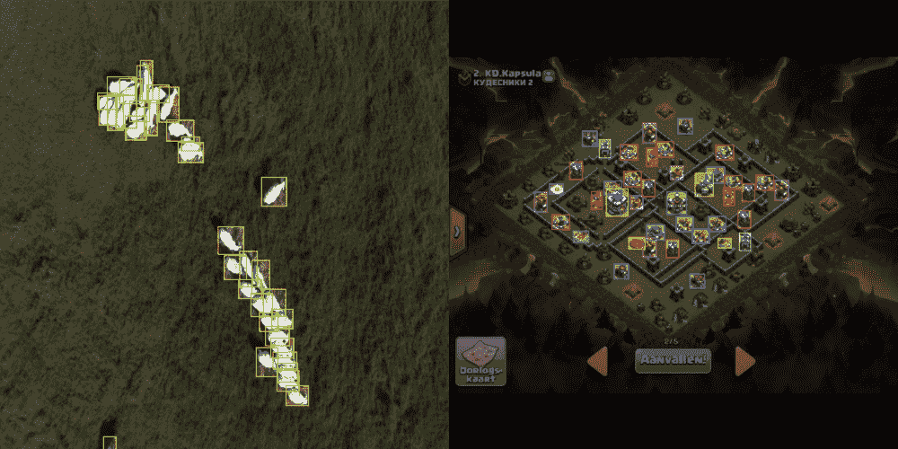

(Left) Example image from Aerial Sheep dataset. (Right) Example image from Clash of Clans dataset.

现在表已经设置好了，让我们来看看如何从 Roboflow 生成和下载这样的数据集。

## 从 Roboflow 下载数据

Roboflow 最棒的事情之一是 [Roboflow Universe](https://universe.roboflow.com/) ，它提供了大量不同的项目和数据集，可以用于各种模型。

The Roboflow Universe is filled with lots of handy datasets and pre-trained models

在本教程中，我们将培训 YOLOv6 和 YOLOv7 模型。在 Roboflow 上有一些快速简单的步骤来下载他们所需的数据(以正确的格式)。我们现在将向您展示如何准备部落冲突数据集。

首先我们将前往[部落冲突项目页面](https://universe.roboflow.com/find-this-base/clash-of-clans-vop4y/dataset/5)。接下来，我们将选择`Download`。

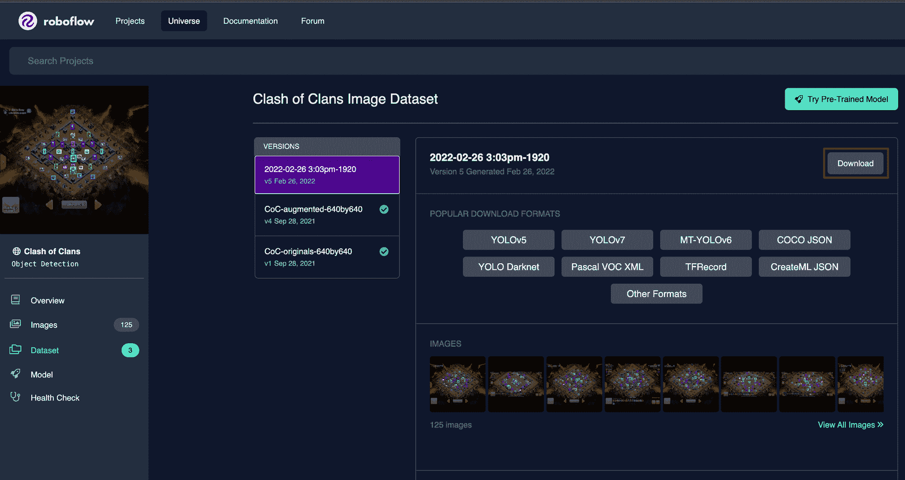

Downloading the Clash of Clans dataset from Roboflow

从那里，我们将选择`meituan/PyTorchv6`作为我们的导出格式，然后我们将确保`show download code`被启用。

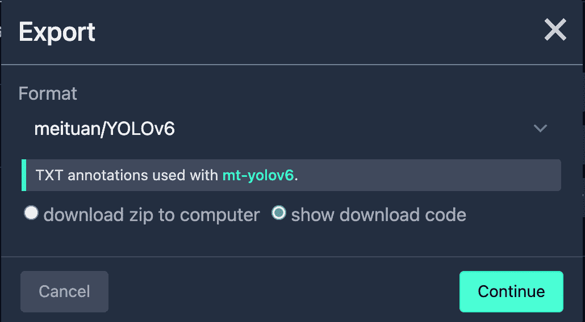

We'll select the `meituan/YOLOv6` format with `show download code` enabled

我们现在应该看到 Roboflow 已经生成了一个片段，我们可以使用它将数据集导入到我们的项目中。

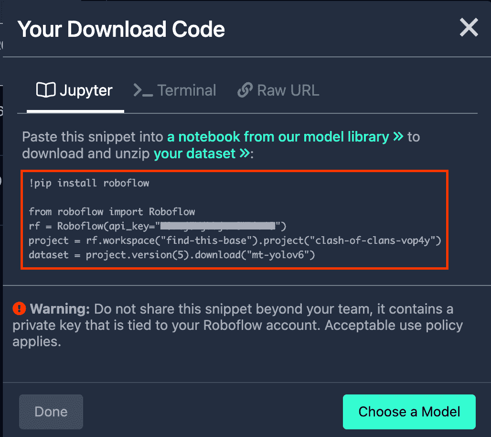

Copy the snippet generated by Roboflow

这就是全部了！我们现在有了一个可以插入笔记本的片段，它将把 Roboflow 数据集下载到我们的项目中。太棒了。

# 在图纸空间中设置测试环境

我们将使用[梯度笔记本](https://gradient.run/notebooks)在 Paperspace 上运行一个简单的基准测试环境。

笔记本文件位于[这个](https://github.com/gradient-ai/roboflow-yolo-benchmark) GitHub repo 中。我们可以在创建新笔记本时将回购直接放入笔记本。

在 Paperspace [控制台](https://console.paperspace.com/)中，我们将首先导航到 Gradient，这是 Paperspace 的机器学习平台，由强大的 GPU 支持，然后在一个项目中创建一个新的笔记本。

然后我们将选择`PyTorch 1.12`运行时。

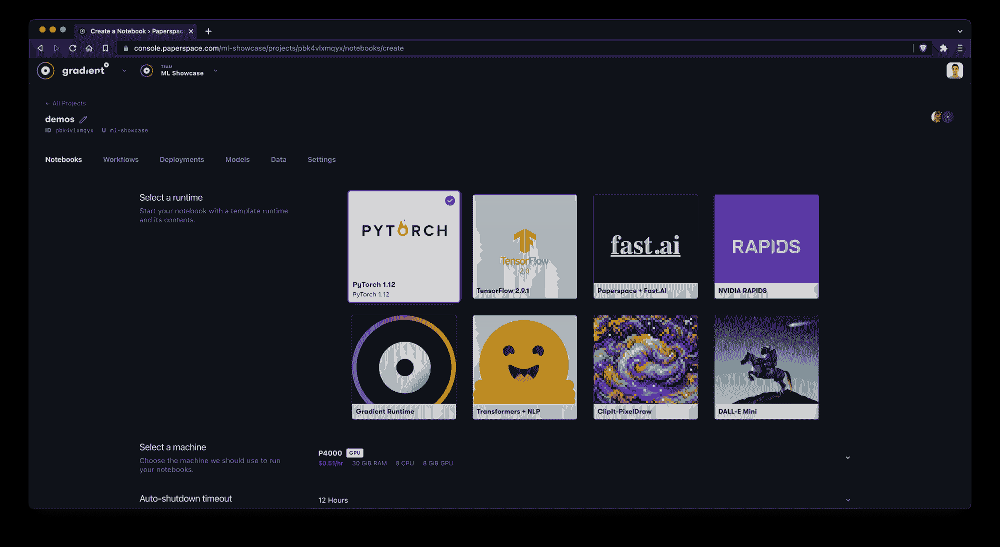

Select the `PyTorch` runtime

接下来，我们将选择机器。在这种情况下，我们将从 P6000 GPU 开始，知道我们可以随时停止笔记本电脑并在不同的机器上重新启动。

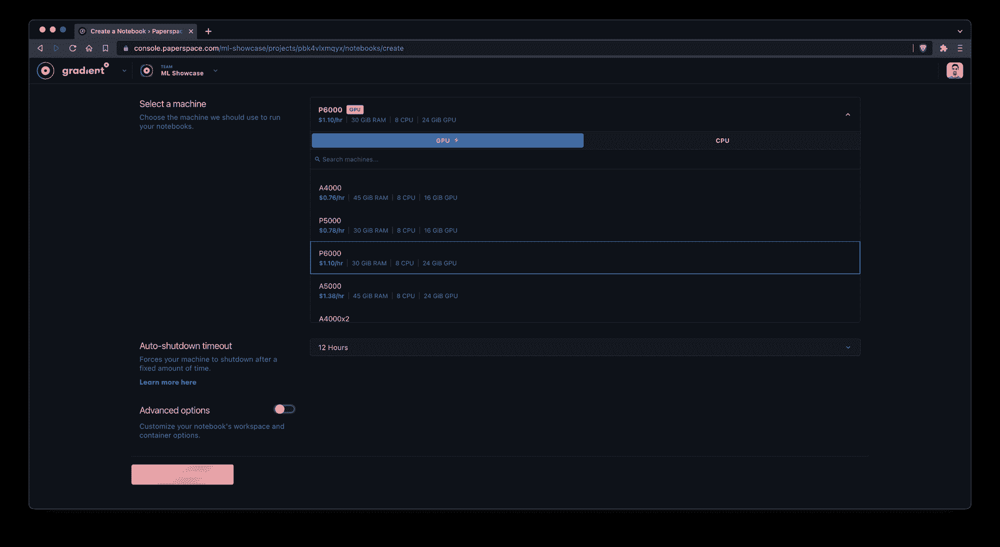

Select a machine such as the P6000 GPU

接下来，我们将切换`Advanced options`并将测试报告的 [URL 粘贴到**工作区 URL** 字段中。](https://github.com/gradient-ai/roboflow-yolo-benchmark/blob/main/YOLO-training.ipynb)

[roboflow-yolo-benchmark/YOLO-training.ipynb at main · gradient-ai/roboflow-yolo-benchmarkContribute to gradient-ai/roboflow-yolo-benchmark development by creating an account on GitHub.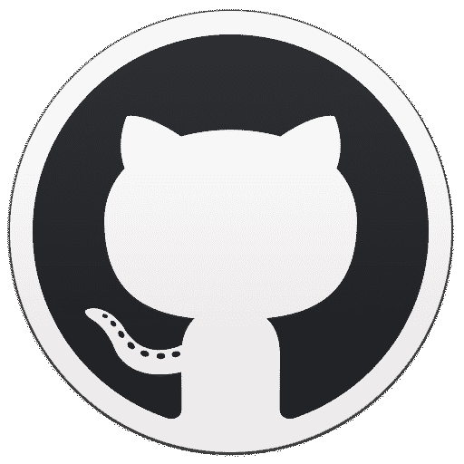GitHubgradient-ai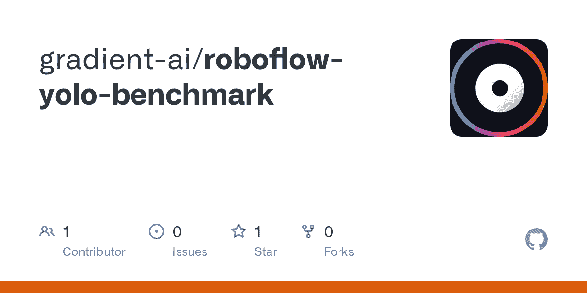](https://github.com/gradient-ai/roboflow-yolo-benchmark/blob/main/YOLO-training.ipynb)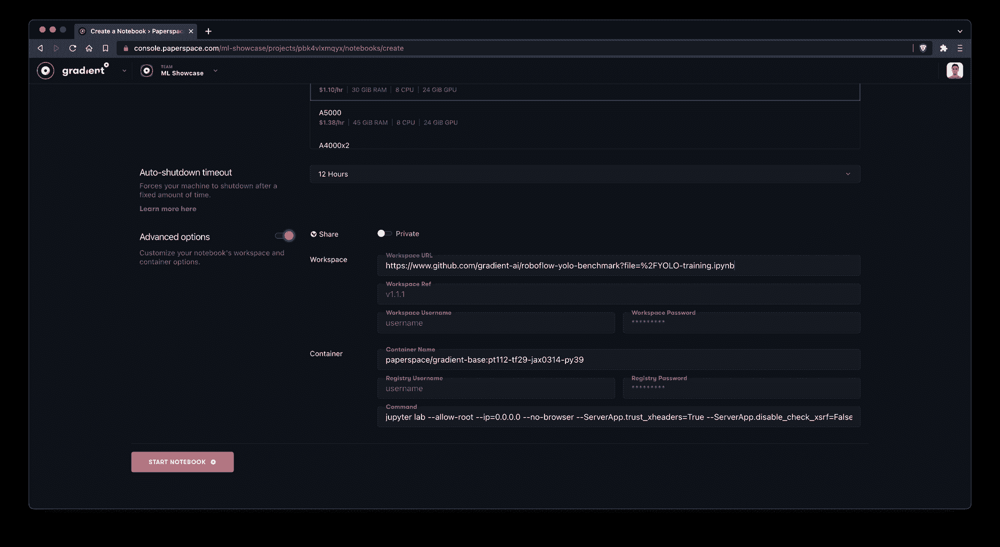

Add the workspace URL to automatically pull the benchmarking repo into the notebook

现在我们可以启动笔记本了，我们应该看到我们的笔记本已经进入了`Running`状态。不错！

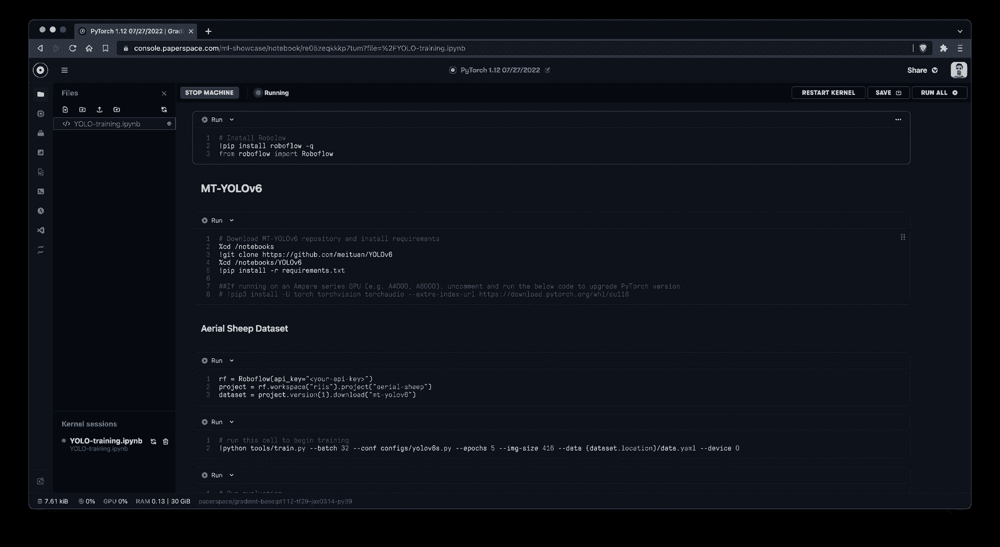

Our notebook is now running on a P6000 GPU

现在，我们剩下要做的就是将从 Roboflow 获取的代码片段注入到适当的代码单元中。我们将确保做到这一点，然后我们应该找到自己的工作基准笔记本。

# 培训和基准

对于这个目标检测任务，我们运行了两个不同的 YOLO 模型， [MT-YOLOv6](https://github.com/meituan/YOLOv6) 和 [YOLOv7 PyTorch](https://github.com/WongKinYiu/yolov7) 。

让我们来看看我们将要运行的两个模型的一些细节。让我们一定要注意它们之间的尺寸差异，因为这将影响我们开始训练时可能会看到的训练时间。

## YOLOv6 基本网络详细信息

|  |  |
| --- | --- |
| 模型 | YOLOv6 |
| 层 | Two hundred and ninety-five |
| 因素 | 17.2 米 |
| GFLOPS | Forty-four point two |

## YOLOv7 基本网络详细信息

|  |  |
| --- | --- |
| 模型 | YOLOv7 |
| 层 | Four hundred and fifteen |
| 因素 | 37.2 米 |
| GFLOPS | One hundred and five point four |

在我们的测试中，我们在三个不同的 GPU 机器支持的两个不同的数据集上使用了两个不同的模型，总共有十二种不同的组合。

比较每次运行的平均历元时间，平均历元时间是 5 个历元的样本。然后，为了下面的比较，我们将这个训练样本外推至 100 个时期。一旦我们建立了这些基线，我们将为全部 100 个时期训练最有希望的组合。

为了外推至 100 个时期，训练时间乘以每台 GPU 机器的按需价格，以确定估计的训练成本。这样，我们可以比较每个基准测试的培训时间和实际成本。

比较了以下 Paperspace GPU 计算机:

| GPU 类型 | GPU 内存 | TFLOPS (SP) | 张量核 | 中央处理器（central processing units 的缩写） | 随机存取存储 | 每小时美元 |
| --- | --- | --- | --- | --- | --- | --- |
| V100 | 16 GB | Fourteen | Six hundred and forty | eight | 30 GB | $2.30 |
| Quadro P5000 | 16 GB | Eight point nine | Zero | eight | 30 GB | $0.78 |
| RTX A6000 | 48 GB | Thirty-eight point seven | Three hundred and thirty-six | eight | 45 GB | $1.89 |

# 结果

十二次训练运行产生了以下基准。

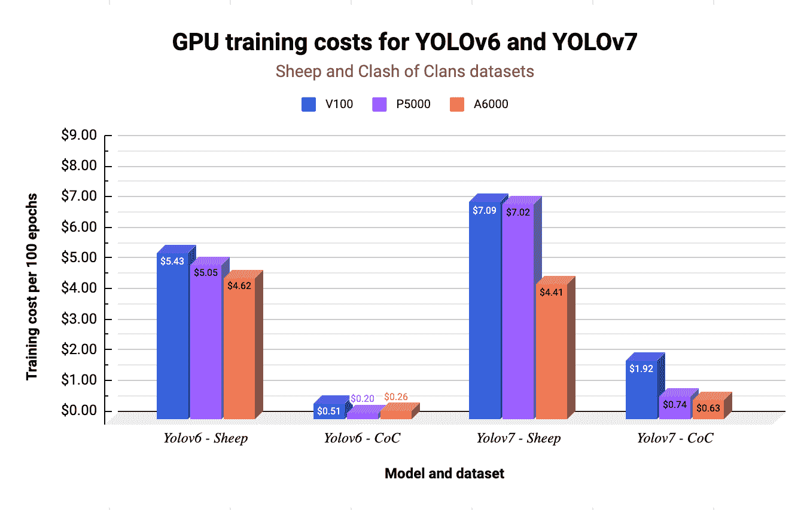

详细的性能指标详述如下。请注意，在以下四个表中，我们从 5 个时期外推至 100 个时期，以获得完整培训时间和成本的估计值。

## YOLOv6 -绵羊数据集

| 机器类型 | 模型 | 资料组 | 平均历元时间 | 按需每小时定价 | 培训成本(100 个时代) |
| --- | --- | --- | --- | --- | --- |
| P5000 | YOLOv6 | 羊 | 3 分 53 秒 | $0.78 | $5.05 |
| A6000 | YOLOv6 | 羊 | 1 分 28 秒 | $1.89 | $4.62 |
| V100 | YOLOv6 | 羊 | 1 分 25 秒 | $2.30 | $5.43 |

## YOLOv6 -部落冲突数据集

| 机器类型 | 模型 | 资料组 | 平均历元时间 | 按需每小时定价 | 培训成本(100 个时代) |
| --- | --- | --- | --- | --- | --- |
| P5000 | YOLOv6 | 部族冲突 | 9 秒 | $0.78 | $0.20 |
| A6000 | YOLOv6 | 部族冲突 | 5 秒钟 | $1.89 | $0.26 |
| V100 | YOLOv6 | 部族冲突 | 8 秒钟 | $2.30 | $0.51 |

## YOLOv7 -绵羊数据集

| 机器类型 | 模型 | 资料组 | 平均历元时间 | 按需每小时定价 | 培训成本(100 个时代) |
| --- | --- | --- | --- | --- | --- |
| P5000 | YOLOv7 | 羊 | 5 分 24 秒 | $0.78 | $7.02 |
| A6000 | YOLOv7 | 羊 | 1 分 24 秒 | $1.89 | $4.41 |
| V100 | YOLOv7 | 羊 | 1 分 51 秒 | $2.30 | $7.09 |

## YOLOv7 -部落冲突数据集

| 机器类型 | 模型 | 资料组 | 平均历元时间 | 按需每小时定价 | 培训成本(100 个时代) |
| --- | --- | --- | --- | --- | --- |
| P5000 | YOLOv7 | 部族冲突 | 34 秒 | $0.78 | $0.74 |
| A6000 | YOLOv7 | 部族冲突 | 12 秒 | $1.89 | $0.63 |
| V100 | YOLOv7 | 部族冲突 | 30 秒 | $2.30 | $1.92 |

# 训练 YOLOv6 和 YOLOv7 个时期的结果

在 3/4 训练环境中，具有 48 GB GPU 内存的较新的 A6000 GPU 机器执行了最具成本效益的训练。

在航空绵羊数据集上进行训练需要更多的计算时间和能力，这不足为奇。除了拥有更多影像外，航空绵羊数据集还具有分辨率更大的影像。从数据中可以明显看出，更大的数据集图像受益于具有更高 TFLOPS 性能的机器。

当开始扩大图像大小和数据集大小时，我们开始看到 A6000 和 V100 等高端 GPU 在处理时间方面的一些优势。

在这种情况下，A6000 显然可以最快地处理 YOLOv6 和 YOLOv7 的航空绵羊。因此，尽管它不是最便宜的 GPU，但在较长的培训周期内，它仍将是最便宜的。当准备更长的训练跑时，这些权衡是有用的。

# 更进一步

既然我们已经查看了临时成本，让我们实际运行我们选择的组合的 100 个时期的模型，看看我们得到了什么性能。

我们将在 P5000 和 A6000 机器的帮助下执行完整的 100 个历元训练间隔，并将使用 mAP@0.5 测量模型的性能。

如果您想了解更多关于地图作为一种度量的信息，请查看 Paperspace 博客上的[使用平均精度(mAP)](https://blog.paperspace.com/mean-average-precision/) 评估物体检测模型。

请注意，在下面的两个表格中，我们已经训练了 100 个时期的完整持续时间，而不是外推。

## YOLOv6 和 YOLOv7 -部落冲突数据集

| 机器类型 | 模型 | 资料组 | 训练时间(100 个时期) | 按需每小时定价 | 培训成本(100 个时代) | 地图@0.5 |
| --- | --- | --- | --- | --- | --- | --- |
| P5000 | YOLOv6 | 部族冲突 | 12 分 32 秒 | $0.78 | $0.15 | Zero point zero eight two |
| P5000 | YOLOv7 | 部族冲突 | 22 分 1 秒 | $0.78 | $0.27 | Zero point zero six eight |

## YOLOv6 和 YOLOv7 -绵羊数据集

| 机器类型 | 模型 | 资料组 | 训练时间(100 个时期) | 按需每小时定价 | 培训成本(100 个时代) | 地图@0.5 |
| --- | --- | --- | --- | --- | --- | --- |
| A6000 | YOLOv6 | 羊 | 1 小时 32 分 53 秒 | $1.89 | $2.93 | Zero point nine three three |
| A6000 | YOLOv7 | 羊 | 2 小时 29 分 56 秒 | $1.89 | $4.72 | Zero point nine one eight |

# 训练 YOLOv6 和 yolov 7 100 个时期的结果

从更长的训练运行中最明显的一点是，对于我们正在处理的数据集，YOLOv6 和 YOLOv7 都没有比另一个给出明显更好的 mAP@0.5 结果。

其次，我们应该注意到，正如预期的那样，YOLOv6 的运行时间是 YOLOv7 的一半多一点。

最后，就数据集本身而言，我们可以看到，Clash of Clans 数据集虽然使用起来很有趣，但没有提供足够的数据来获得任何模型的准确结果。这并不完全令人惊讶，因为数据集有超过 10 个包含少量图像的类。

与此同时，空中绵羊数据集要大得多，并且只有一个预测类，我们看到 mAP @ 0.5 > 0.9，这为我们的训练运行带来了更好的结果。

# 下一个

我们希望这篇博文能帮助你理解使用来自 Paperspace 的 GPU 和来自 Roboflow 的数据集的可能性。请务必关注[@ hello perspace](https://twitter.com/HelloPaperspace)和 [@roboflow](https://twitter.com/roboflow) 以跟上所有最新最棒的计算机视觉项目。

如果你真的喜欢这个基准测试，并且想使用 YOLOv6 或 YOLOv7 开发你自己的物体检测项目，在 [Paperspace](https://console.paperspace.com/signup) 上创建一个免费帐户，并且一定要查看 [Roboflow Universe](universe.roboflow.com) 。