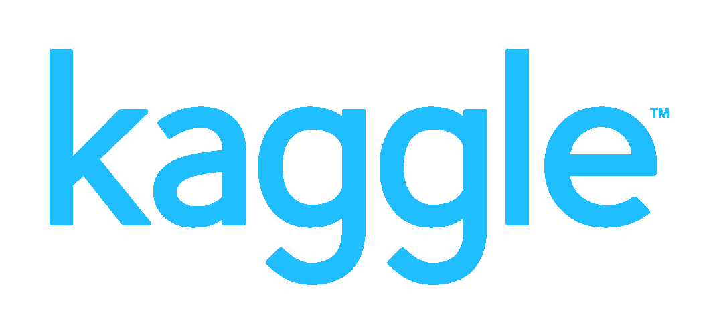
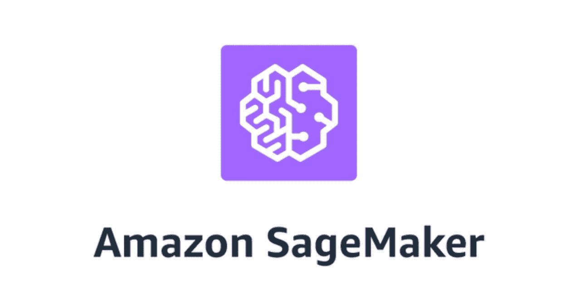
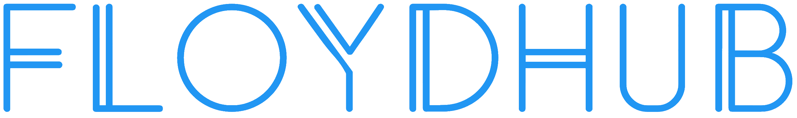

# 2021 年最佳 Google Colab 替代品

> 原文：<https://blog.paperspace.com/best-google-colab-alternatives/>

Jupyter 笔记本已经成为探索机器学习库和算法的首选标准。谈到云托管的笔记本电脑服务，现在有大量选项可供选择，因此我们决定整理一份当前最佳可用选项的列表。

除了可能难以在本地获得的强大计算资源(或者如果您尝试的话，可能会倾家荡产)，云托管的 Jupyter 环境还具有云存储、模型培训和部署功能、版本控制等功能。通过照顾所有的硬件和后端配置，云托管环境还使用户能够专注于他们的工作，而没有任何混乱的安装、配置或硬件购买。

近年来，谷歌 Colab 已经成为云支持笔记本的热门选择。随着免费的 GPU 和存储链接到 Google Drive，ML 和数据科学社区的许多用户发现它是他们以 Google 为中心的网络存在的自然延伸。

这就引出了一个问题:

## 为什么我不应该使用 Google Colab？

尽管是一个受欢迎的选择，Colab 面临着几个问题，这是许多用户的交易破坏者。Google Colab 的一些缺点包括:

*   服务中断
*   低速存储器
*   未配置的环境
*   功能贫乏

Colab 用户最大的抱怨可能是实例可能会在会话过程中被关闭(“抢占”)，如果您没有主动连接到您的笔记本，就会断开连接。这意味着您可能会丢失您的工作和任何培训进度——如果您碰巧关闭了您的选项卡，或者意外注销，也是如此。想象一下，等待您的模型训练几个小时，只是为了回来看到您的实例被关闭；或者想象一下，你必须让你的笔记本电脑开着 12 个小时，害怕它会进入睡眠模式并断开你的连接。另一方面，其他提供商将保证整个会话，并允许您从中断的地方重新开始，即使您在整个时间都没有连接。

Colab 的另一个缺点是存储速度极慢。当它需要摄取大量数据时，Colab 就会开始爬行。用户报告 Colab 反复超时，如果他们在一个目录中有太多的文件，或者无法读取带有模糊和难以描述的错误的文件。不幸的是，处理大数据集是大多数 ML 管道的一个非常标准的部分，因此 Colab 的存储速度慢足以让许多用户寻找替代的 Jupyter 主机。

尽管 Colab 可能满足一些爱好者的需求，但与其他提供商相比，Colab 没有为全面的数据科学/ML 工作流提供许多额外的功能。Colab 的特性本质上仅限于 Python 支持和在 Google Drive 上共享笔记本的能力，这两项都是相当标准的。例如，其他云托管笔记本提供商将支持版本控制，并与完整的 MLOps 管道轻松集成。

## 谷歌 Colab 替代品

选择托管 Jupyter 笔记本电脑服务时，您可能会考虑以下特性:

*   不间断服务
*   持久环境
*   储存；储备
*   附加功能

许多其他托管的 Jupyter 环境将在一个或所有这些方面胜过 Google Colab。这里列出了一些。

### 1.图纸空间梯度

Gradient 是一个端到端的 MLOps 平台，包括一个[免费托管的 Jupyter 笔记本服务](https://gradient.paperspace.com/free-gpu)，有许多针对预配置环境和免费 GPU 和 CPU 的选项。

Gradient 简化了深度学习模型的开发、训练和部署。它由 web UI、CLI 和 SDK 组成。Gradient 的一大优点是，它为初学者和专业人士提供了有价值的功能，具有直观的 web UI 和极低的入门门槛。

与 Google Colab 相比，Gradient 的一些优势包括:

*   更快、更持久的存储(每次启动笔记本电脑时，无需重新安装库和重新上传文件！)
*   会话是有保证的，所以不会有实例在工作过程中关闭的风险。你也不需要一直保持联系；开始你的训练，退出，稍后回来，你的训练将会在你离开的地方继续。
*   预配置的容器和模板。您可以在预装了所有依赖项的不同流行环境之间进行选择(例如 PyTorch、TensorFlow 或 Data Science Stack)，或者使用您自己的定制容器。还有一个 [ML Showcase](http://ml-showcase.paperspace.com/) ,其中包括你可以(免费)派生并在你自己的账户上运行的示例项目
*   一个公共数据集存储库，包括安装在每个笔记本上的大量流行数据集，可供免费使用
*   能够根据需要轻松扩展，为相同环境添加更多存储和更高端的专用 GPU
*   完整 ML 管道的集成特性，例如一键式部署和版本控制
*   反应迅速、乐于助人的支持团队

### 2.卡格尔

Kaggle 是谷歌的另一款产品，功能与 Colab 相似。像 Colab 一样，Kaggle 提供免费的基于浏览器的 Jupyter 笔记本和 GPU。Kaggle 还预装了许多 Python 包，降低了一些用户的入门门槛。

另一方面，许多用户注意到 Kaggle 内核往往有点慢(尽管仍然比 Colab 快)。对于不喜欢与谷歌分享数据的用户来说，Kaggle 仍然是一个禁忌。

### 3.亚马逊 SageMaker

亚马逊 SageMaker 是另一个流行的端到端机器学习平台。从数据标签到进一步的培训和部署能力，SageMaker 有许多附加功能，一些用户发现它的高级功能是一个很大的优势。

也就是说，SageMaker 确实有一个不好的名声，那就是不直观，完全令人困惑，并且实现了格言“万事通，无所不能。”

### 4.FloydHub

FloyHub 有一个初级层，包括免费的 GPU 访问和基于云的深度学习项目 IDE。它们还提供持久存储。

用户对 FloydHub 的一个抱怨是，他们有一个独特的结构，需要花时间去适应，还有一个不直观的工作流程。

## 我应该使用哪个 Jupyter 笔记本服务？

我们建议从 Gradient 的免费[社区笔记本功能](https://gradient.paperspace.com/free-gpu)开始。有了免费的 GPU 和 CPU、存储、不间断的服务、直观的 UI、 [ML 项目模板](https://gradient.paperspace.com/free-gpu)等等，很难想象 Gradient 不适合的用例。

带着一个免费的 [GPU 支持的 Jupyter 笔记本](https://gradient.paperspace.com/free-gpu)(免费账户，免费一切)，从许多 [ML 项目模板](http://ml-showcase.paperspace.com/)(并从你自己的账户免费运行它)，或者查看[常见问题](https://ml-showcase.paperspace.com/guide)。