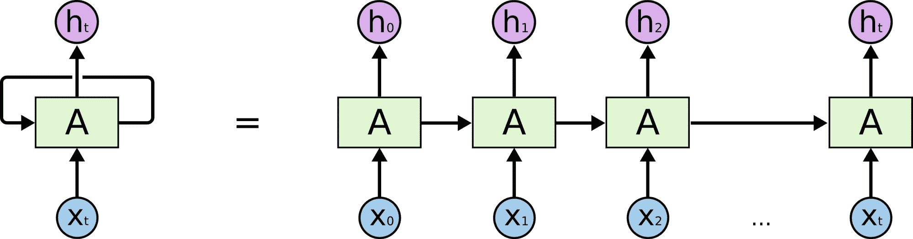
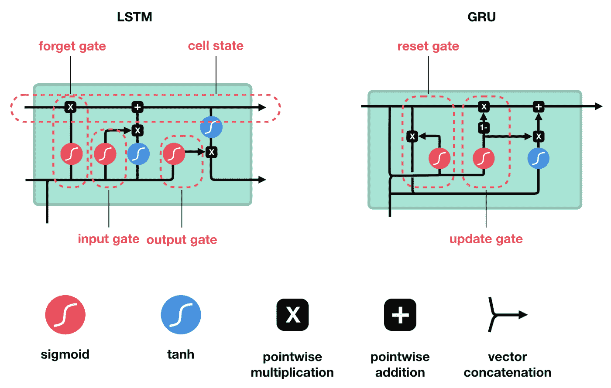
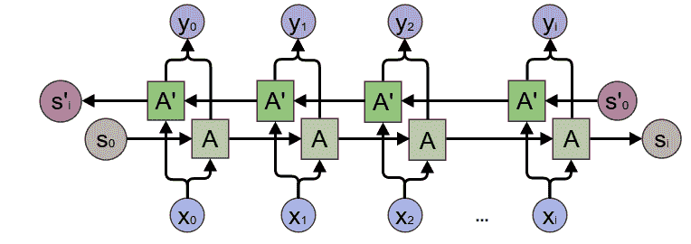
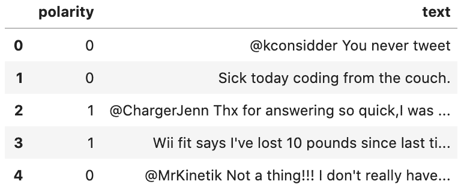
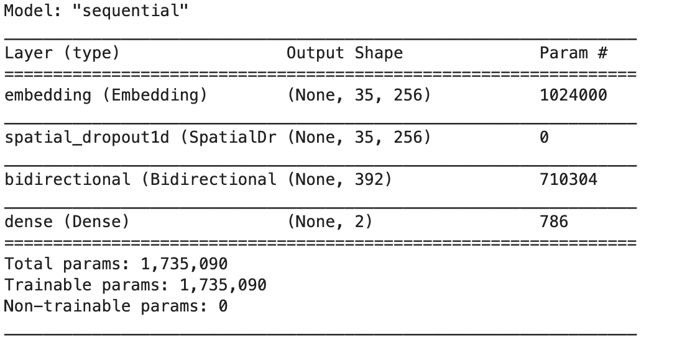
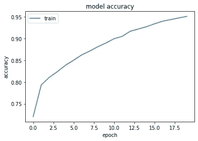
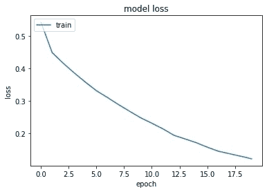

# 高级递归神经网络:双向递归神经网络

> 原文：<https://blog.paperspace.com/bidirectional-rnn-keras/>

在本教程中，我们将涵盖双向 rnn:它们如何工作，网络架构，它们的应用，以及如何使用 Keras 实现双向 rnn。

具体来说，我们将涵盖:

*   RNNs 概述
*   LSTM 和 GRU 街区
*   双向遍历的需要
*   双向 RNNs
*   使用双向 RNN 的情感分析
*   结论

我们开始吧！

## RNNs 概述

递归神经网络(RNNs)是一种专门用于处理顺序数据的神经网络。顺序数据可以被认为是一系列的数据点。例如，视频是连续的，因为它由一系列视频帧组成；音乐是连续的，因为它是一系列声音元素的组合；文本是连续的，因为它是由字母组合而成的。对顺序数据建模需要持久保存从以前的实例中学习到的数据。例如，如果你要预测辩论中的下一个论点，你必须考虑参与辩论的成员提出的前一个论点。你形成你的论点，使它符合辩论的流程。同样，RNN 学习和记忆数据，以便制定决策，这取决于以前的学习。

与典型的神经网络不同，RNN 不会将输入或输出作为一组固定大小的向量。它也没有固定训练一个模型所需的计算步骤的数量。相反，它允许我们用一系列向量(序列数据)来训练模型。

有趣的是，RNN 在整个网络中保持模型参数的持久性。它实现了**参数共享**，以适应不同长度的顺序数据。如果我们要为不同的数据块考虑单独的参数，那么既不可能概括整个系列的数据值，也不可能在计算上可行。概括是关于一系列值的重复。歌曲中的音符可以出现在其他地方；这需要由 RNN 捕获，以便了解数据中持久存在的依赖性。因此，RNN 不是在每个学习点都从头开始，而是将学到的信息传递给下面的层次。

为了实现参数共享和信息持久化，RNN 使用了循环。



Unfolding An RNN ([Source](https://colah.github.io/posts/2015-08-Understanding-LSTMs/))

一个神经网络$A$被重复多次，其中每个组块接受一个输入$x_i$并给出一个输出$h_t$。这里的循环将信息从一个步骤传递到另一个步骤。

事实上，大量的应用，如文本生成、图像字幕、语音识别等，都在使用 RNNs 及其变体网络。

## LSTM 和 GRU 街区

并不是所有的场景都包括从序列中紧接在前面的数据中学习。考虑这样一种情况，你试图从一本书或一篇文章中介绍的另一个句子中预测一个句子。这不仅需要记住之前的数据，还需要记住更早的数据。由于参数共享机制，RNN 在每个时间步长使用相同的权重。因此，在反向传播过程中，梯度要么爆炸，要么消失；网络从远离当前位置的数据中学习不到太多。

为了解决这个问题，我们使用长短期记忆网络，简称 LSTMs。LSTM 能够学习长期依赖关系。

不像在 RNN 中，网络块中有一个简单的层，LSTM 块做一些额外的操作。通过使用输入、输出和遗忘门，它记住了重要的信息，而忘记了通过网络学习到的不必要的信息。

LSTM 的一个流行变体是门控循环单元，或 GRU，它有两个门——更新门和复位门。LSTM 和 GRU 都致力于消除长期依赖问题；区别在于操作的次数和消耗的时间。GRU 是新的，速度更快，计算成本低。然而，LSTMs 在解决许多应用时已经输出了最先进的结果。



LSTM and GRU (Source: [Illustrated Guide](https://towardsdatascience.com/illustrated-guide-to-lstms-and-gru-s-a-step-by-step-explanation-44e9eb85bf21))

要了解 LSTMs 与 GRUs 有何不同，您可以参考这篇文章。

## 双向遍历的需要

RNN 的典型国家(简单的 RNN、GRU 或 LSTM)依赖于过去和现在的事件。时间$t$处的状态取决于状态$x_1、x_2、…、x_{t-1}$和$x_t$。然而，在有些情况下，预测依赖于过去、现在和未来的事件。

例如，预测一个单词将被包含在一个句子中可能需要我们展望未来，即，一个句子中的一个单词可能依赖于一个未来事件。这种语言依赖性在一些文本预测任务中是常见的。

以语音识别为例。使用语音助理时，首先要说几句话，然后由助理进行解释并做出响应。这种解释可能不完全取决于前面的话；只有分析了后面的单词，整个单词序列才能有意义。

因此，捕获和分析过去和未来的事件在上述场景中是有帮助的。

## 双向 RNNs

为了实现输入的直接(过去)和反向(未来)遍历，使用双向 rnn 或 BRNNs。BRNN 是两个 RNN 的组合，一个 RNN 从数据序列的开始向前移动，另一个从数据序列的结尾向后移动。BRNN 中的网络块可以是简单的 RNN、gru 或 LSTMs。



Bidirectional RNN (Source: [Colah](https://colah.github.io/posts/2015-09-NN-Types-FP/))

BRNN 有一个额外的隐藏层，以适应落后的训练过程。在任何给定时间$t$，向前和向后隐藏状态更新如下:

$$A_t(向前)= \ phi(x _ t * w_{xa}^{forward}+a _ { t-1 }(向前)* w_{aa}^{forward}+b_{a}^{forward})$$

$$A_t(向后)= \ phi(x _ t * w_{xa}^{backward}+a _ { t+1 }(向后)* w_{aa}^{backward}+b_{a}^{backward})$$

其中$\phi$是激活函数，$W$是权重矩阵，$b$是偏差。

时间$t$处的隐藏状态由$A_t(向前)$和$A_t(向后)$的组合给出。任何给定隐藏状态下的输出为:

$$O_t = H_t * W_{AY} + b_{Y}$$

BRNN 的训练类似于时间反向传播(BPTT)算法。BPTT 是训练 rnn 时使用的反向传播算法。典型的 BPTT 算法工作如下:

*   展开网络并计算每个时间步的误差。
*   卷起网络并更新权重。

然而，在 BRNN 中，因为向前和向后传递同时发生，所以更新两个过程的权重可以在同一时间点发生。这会导致错误的结果。因此，为了分别适应向前和向后传球，下面的算法用于训练 BRNN:

### 前进传球

*   向前状态(从$t$ = 1 到$N$)和向后状态(从$t$ = $N$到 1)被传递。
*   传递输出神经元值(从$t$ = 1 到$N$)。

### 偶数道次

*   输出神经元值被传递($t$ = $N$ to 1)。
*   向前状态(从$t$= $N$到 1)和向后状态(从$t$ = 1 到$N$)被传递。

向前传球和向后传球一起训练了一个 BRNN。

### 应用程序

BRNN 适用于以下应用:

*   手写识别
*   语音识别
*   依存句法分析
*   自然语言处理

双向遍历的思想也可以扩展到 2D 输入，如图像。我们可以有四个 rnn，每个表示一个方向。与卷积神经网络(CNN)不同，BRNN 可以确保图像特征图之间的长期相关性。

## 使用双向 RNN 的情感分析

情感分析是确定一段文本是正面的、负面的还是中性的过程。它广泛用于社交媒体监控、客户反馈和支持、识别贬损推文、产品分析等。在这里，我们将构建一个双向 RNN 网络，使用 s *entiment-140* 数据集将一个句子分为肯定句或否定句。

您可以在此处访问情感-140 [数据集](https://nyc3.digitaloceanspaces.com/ml-files-distro/v1/sentiment-analysis-is-bad/data/sentiment140-subset.csv.zip)的清理子集。

### 步骤 1 -导入数据集

首先，导入情感-140 数据集。由于情绪-140 包含大约 160 万个数据样本，因此我们只导入其中的一个子集。当前的[数据集](https://nyc3.digitaloceanspaces.com/ml-files-distro/v1/sentiment-analysis-is-bad/data/sentiment140-subset.csv.zip)有 50 万条推文。

```py
! pip3 install wget

import wget
wget.download("https://nyc3.digitaloceanspaces.com/ml-files-distro/v1/sentiment-analysis-is-bad/data/sentiment140-subset.csv.zip")

!unzip -n sentiment140-subset.csv.zip
```

现在，您已经在当前存储库中获得了解压缩的 CSV 数据集。

### 步骤 2 -加载数据集

使用 *pip* 命令安装 *pandas* 库。稍后，导入并读取 csv 文件。

```py
! pip3 install pandas
import pandas as pd

data = pd.read_csv('sentiment140-subset.csv', nrows=50000)
```

### 步骤 3 -读取数据集

打印数据列。

```py
data.columns 
```

```py
# Output
Index(['polarity', 'text'], dtype='object') 
```

*正文*表示句子，*极性*，附加在句子上的感情。*极性*不是 0 就是 1。0 表示消极，1 表示积极。

找出数据集中的总行数，并打印前 5 行。

```py
print(len(data))
data.head()
```

```py
# Output
50000 
```



The first 5 data values

### 步骤 4 -处理数据集

由于神经网络难以处理原始文本，我们必须将其转换为相应的数字表示。

为此，通过设置您希望对句子进行标记的最大字数(特征/标记)来初始化您的标记器，

```py
import re
import tensorflow as tf

max_features = 4000 
```

将标记器安装到文本上，

```py
tokenizer = tf.keras.preprocessing.text.Tokenizer(num_words=max_features, split=' ')
tokenizer.fit_on_texts(data['text'].values)
```

使用结果标记器来标记文本，

```py
X = tokenizer.texts_to_sequences(data['text'].values)
```

最后，填充标记化的序列，以在所有输入序列中保持相同的长度。

```py
X = tf.keras.preprocessing.sequence.pad_sequences(X)
```

最后，打印输入向量的形状。

```py
X.shape
```

```py
# Output
(50000, 35)
```

因此，我们创建了 50000 个长度为 35 的输入向量。

### 步骤 4 -创建模型

现在，让我们创建一个双向 RNN 模型。使用 *tf.keras.Sequential()* 来定义模型。添加嵌入、空间缺失、双向和密集图层。

*   嵌入层是将单词/标记符映射到具有 *embed_dim* 维度的向量的输入层。
*   空间删除层删除节点，以防止过拟合。0.4 表示节点必须被丢弃的概率。
*   双向层是大小为 *lstm_out* 的 RNN-LSTM 层。
*   dense 是具有 2 个节点(表示正负)和 softmax 激活函数的输出层。Softmax 有助于确定文本倾向于正面还是负面的概率。

最后，将分类交叉熵损失和 Adam 优化函数附加到模型中。

```py
embed_dim = 256
lstm_out = 196

model = tf.keras.Sequential()
model.add(tf.keras.layers.Embedding(max_features, embed_dim, input_length = X.shape[1]))
model.add(tf.keras.layers.SpatialDropout1D(0.4))
model.add(tf.keras.layers.Bidirectional(tf.keras.layers.LSTM(lstm_out, dropout=0.05, recurrent_dropout=0.2)))
model.add(tf.keras.layers.Dense(2, activation='softmax'))
model.compile(loss = 'categorical_crossentropy', optimizer='adam', metrics = ['accuracy'])
```

打印模型摘要以了解其层堆栈。

```py
model.summary() 
```



### 步骤 5 -初始化训练和测试数据

安装并导入所需的库。

```py
import numpy as np
! pip3 install sklearn
from sklearn.model_selection import train_test_split
```

使用 *get_dummies()* 方法创建输出标签的一键编码表示。

```py
Y = pd.get_dummies(data['polarity']) 
```

分别用“*正*”和“*负*映射结果 0 和 1 值。

```py
result_dict = {0: 'Negative', 1: 'Positive'}
y_arr = np.vectorize(result_dict.get)(Y.columns) 
```

*y_arr* 变量将在模型预测期间使用。

现在，获取输出标签。

```py
Y = Y.values 
```

使用 *train_test_split()* 方法分割训练和测试数据。

```py
X_train, X_test, Y_train, Y_test = train_test_split(X, Y, test_size = 0.33, random_state = 42) 
```

打印训练和测试数据的形状。

```py
print(X_train.shape, Y_train.shape)
print(X_test.shape, Y_test.shape)
```

```py
# Output
(33500, 35) (33500, 2)
(16500, 35) (16500, 2) 
```

### 步骤 6 -训练模型

调用模型的 *fit()* 方法，在训练数据上对模型进行约 20 个历元的训练，批量为 128。

```py
model.fit(X_train, Y_train, epochs=20, batch_size=128, verbose=2)
```

```py
# Output
Train on 33500 samples
Epoch 1/20
33500/33500 - 22s - loss: 0.5422 - accuracy: 0.7204
Epoch 2/20
33500/33500 - 18s - loss: 0.4491 - accuracy: 0.7934
Epoch 3/20
33500/33500 - 18s - loss: 0.4160 - accuracy: 0.8109
Epoch 4/20
33500/33500 - 19s - loss: 0.3860 - accuracy: 0.8240
Epoch 5/20
33500/33500 - 19s - loss: 0.3579 - accuracy: 0.8387
Epoch 6/20
33500/33500 - 19s - loss: 0.3312 - accuracy: 0.8501
Epoch 7/20
33500/33500 - 18s - loss: 0.3103 - accuracy: 0.8624
Epoch 8/20
33500/33500 - 19s - loss: 0.2884 - accuracy: 0.8714
Epoch 9/20
33500/33500 - 19s - loss: 0.2678 - accuracy: 0.8813
Epoch 10/20
33500/33500 - 19s - loss: 0.2477 - accuracy: 0.8899
Epoch 11/20
33500/33500 - 19s - loss: 0.2310 - accuracy: 0.8997
Epoch 12/20
33500/33500 - 18s - loss: 0.2137 - accuracy: 0.9051
Epoch 13/20
33500/33500 - 19s - loss: 0.1937 - accuracy: 0.9169
Epoch 14/20
33500/33500 - 19s - loss: 0.1826 - accuracy: 0.9220
Epoch 15/20
33500/33500 - 19s - loss: 0.1711 - accuracy: 0.9273
Epoch 16/20
33500/33500 - 19s - loss: 0.1572 - accuracy: 0.9339
Epoch 17/20
33500/33500 - 19s - loss: 0.1448 - accuracy: 0.9400
Epoch 18/20
33500/33500 - 19s - loss: 0.1371 - accuracy: 0.9436
Epoch 19/20
33500/33500 - 18s - loss: 0.1295 - accuracy: 0.9475
Epoch 20/20
33500/33500 - 19s - loss: 0.1213 - accuracy: 0.9511
```

在训练过程中捕获的绘图精度和损失图。

```py
import matplotlib.pyplot as plt

plt.plot(history.history['accuracy'])
plt.title('model accuracy')
plt.ylabel('accuracy')
plt.xlabel('epoch')
plt.legend(['train'], loc='upper left')
plt.show()

plt.plot(history.history['loss'])
plt.title('model loss')
plt.ylabel('loss')
plt.xlabel('epoch')
plt.legend(['train'], loc='upper left')
plt.show()
```



Accuracy captured during the training phase



Loss captured during the training phase

### 步骤 7 -计算精确度

打印测试数据的预测分数和准确度。

```py
score, acc = model.evaluate(X_test, Y_test, verbose=2, batch_size=64)
print("score: %.2f" % (score))
print("acc: %.2f" % (acc))
```

```py
# Output:
16500/1 - 7s - loss: 2.0045 - accuracy: 0.7444
score: 1.70
acc: 0.74 
```

### 步骤 8 -进行情感分析

现在是时候预测用户给定句子的情绪(积极/消极)了。首先，初始化它。

```py
twt = ['I do not recommend this product'] 
```

接下来，将其标记化。

```py
twt = tokenizer.texts_to_sequences(twt) 
```

垫它。

```py
twt = tf.keras.preprocessing.sequence.pad_sequences(twt, maxlen=X.shape[1], dtype='int32', value=0) 
```

通过将句子传递给我们建立的模型来预测情绪。

```py
sentiment = model.predict(twt, batch_size=1)[0]
print(sentiment)

if(np.argmax(sentiment) == 0):
    print(y_arr[0])
elif (np.argmax(sentiment) == 1):
    print(y_arr[1]) 
```

```py
# Output:
[9.9999976e-01 2.4887424e-07]
Negative
```

这个模型告诉我们给定的句子是否定句。

## 结论

双向 RNN 是在相反方向训练网络的两个 rnn 的组合，一个从序列的开始到结束，另一个从序列的结束到开始。它通过不将模型的学习局限于过去和现在来帮助分析未来事件。

最后，我们使用双向 RNN 对 140 个情感数据集的子集进行了情感分析。

在本系列的下一部分，您将学习深度递归神经网络。

## 参考

1.  [彼得大](https://www.kaggle.com/ngyptr/lstm-sentiment-analysis-keras/notebook)
2.  [Colah](https://colah.github.io/posts/2015-08-Understanding-LSTMs/)
3.  伊恩·古德菲勒、约舒阿·本吉奥和亚伦·库维尔的《深度学习》