# 发现为什么甘是可怕的！

> 原文：<https://blog.paperspace.com/build-simple-gan-from-scratch-to-generate/>


[Image source](https://okanky.medium.com/generative-adversarial-networks-2886ba393ba2)

# 为什么甘很牛逼？

当我们谈论现代深度学习时，首先想到的、最受欢迎的、通常也是最有用的概念是**生成对抗网络** ( **甘斯**)。这些都有很多很棒的应用，比如:

*   **生成不存在的真实人脸**

这些脸都是假的，[都是甘](https://blog.paperspace.com/stylegan3-gradient-notebooks/)做的，所以很遗憾你见不到他们😔。

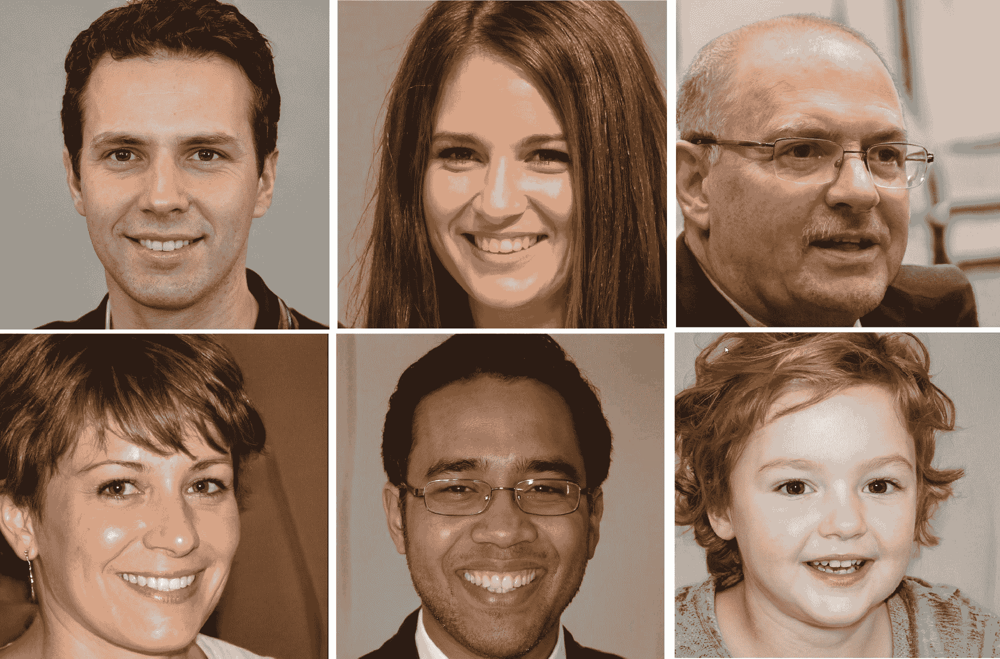

Random Sample of human faces that do not exist captured from [human faces that do not exist](https://this-person-does-not-exist.com/fr)

*   **修复、移植和提高照片的分辨率**

如果你有一个过时的损坏图像，GANs 可以帮助你恢复它，添加一些颜色，提高它的分辨率😊。

跟随 GFPGAN 上的这个教程，学习如何升级和恢复损坏的照片。

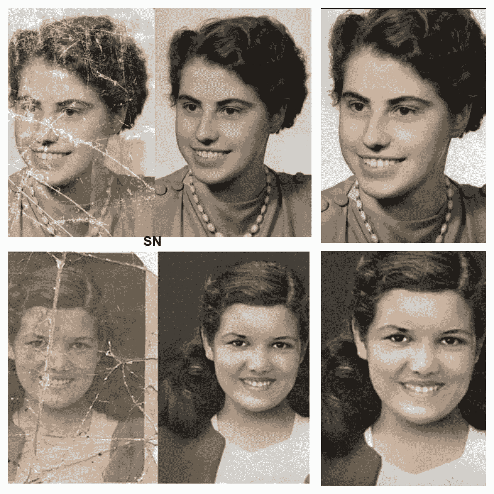

[Image source](https://www.linkedin.com/in/tauil-abd-elilah-076967176/recent-activity/#)

*   **跨域转换图像，风格转移**

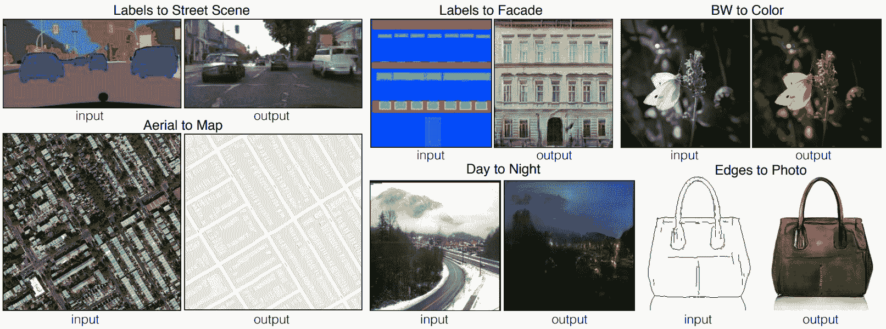

[Image source](https://arxiv.org/pdf/1611.07004.pdf)

另一个很酷的应用是跨域转换图像。例如，使用样式转移，我们可以拍摄一幅马的图像并将其转换为斑马，拍摄一幅夏天的图像并将其转换为冬天，或者拍摄一幅语义图并输出该语义图的真实图像。

[看看这篇教程，学习如何用](https://blog.paperspace.com/one-shot-face-stylization-with-jojogan/) [JojoGAN](https://blog.paperspace.com/one-shot-face-stylization-with-jojogan/) 对人脸进行这样的变换。

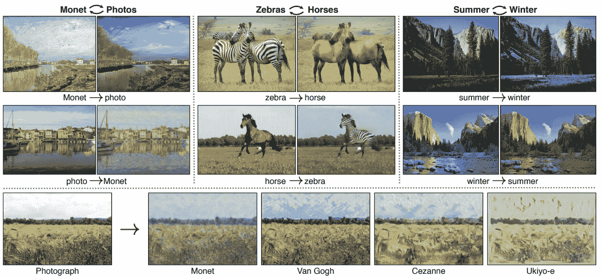

[Image source](https://arxiv.org/pdf/1703.10593.pdf)

*   **数据扩充**

gan 还经常用于[数据增强](https://blog.paperspace.com/tag/series-data-augmentation/)，这是一个非常明确的应用，但可能不太清楚的是这些模型在医疗应用中的效用。由于来自 GANs 的数据不是来自一个真实的人，这意味着它可以在没有道德和隐私问题和限制的情况下使用，这是一个非常酷的应用程序。

**概要:**

到目前为止，我们看到的只是一小部分例子，还有很多很多。每天都有新的应用被发现，因为这是一个非常热门的研究领域。现在让我们继续看看什么是真正的甘，看看他们背后的想法。

* * *

# 什么是 GANs，它们是如何工作的？

GANs 是一种机器学习技术，由**和**两个网络进行**对抗游戏**组成。其中一个网络称为**生成器**、**、**创建样本，另一个网络称为**鉴别器**，试图辨别图像与真实版本相比有多真实。

假设生成器想要打印一组假的手写数字，一个鉴别器想要区分真假。在 GANs 的训练过程中，假设生成器试图打印包含数字 8 的手写数字。最初，由于缺乏训练，每个生成的样本看起来像随机噪声，因此鉴别器将尝试比较生成的随机样本和数字 8 的真实图像的相似性。在这种情况下，它会说来自发生器的信号是假的，所以发生器不能在一开始欺骗鉴别器。

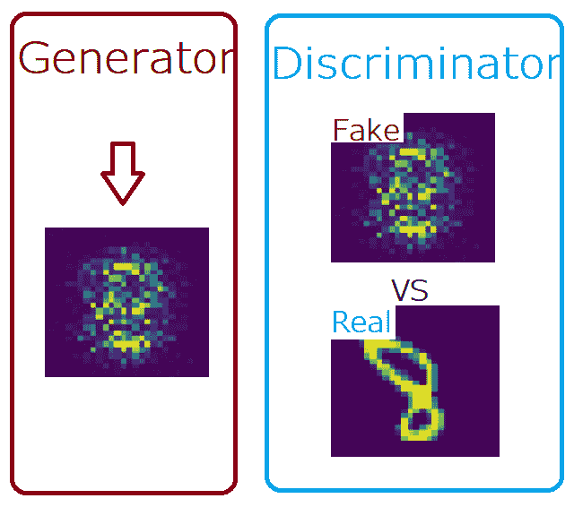

The fake eight is taken from the simple GAN that we will build (epoch 0)

但是随着训练的进行，生成器运行的时间越来越长，它现在可能会产生一些看起来接近真实手写 8 的东西。这是因为在每一步，真实和虚假图像之间的损失被反向传播到下一次迭代的开始。梯度下降的每一步分别降低真实图像和生成图像的真实分布和生成分布之间的距离。

使用人类的洞察力在上面的例子图像上，我们可以看到一些不正确的像素，所以我们可以推断鉴别器可能会看着这两个，再次说来自生成器的那个是假的。尽管如此，还是取得了进展。

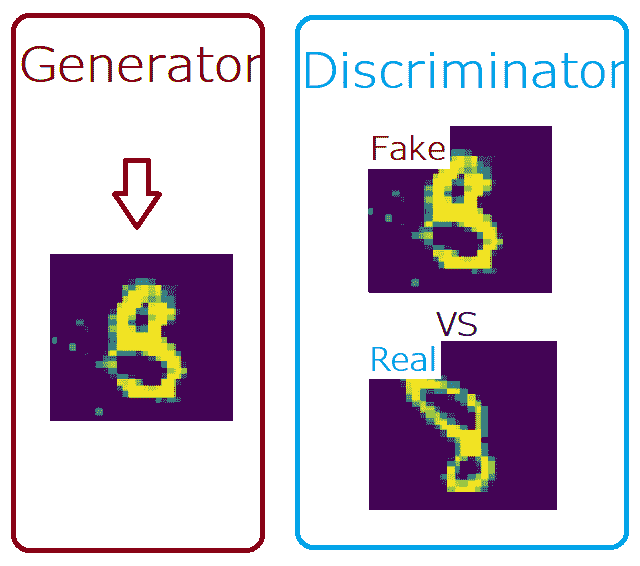

The fake eight is taken from the simple GAN that we will build (epoch 50)

随着训练的深入，生成器将开始生成看起来更真实的输出。当鉴别器不能区分真假样本时，它最终会试图断言真正的手写数字就是假的。最后，生成器能够骗过鉴别器。

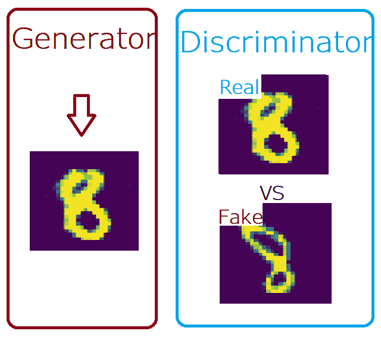

The fake eight is taken from the simple GAN that we will build (epoch 90)

最终，**生成器**生成几乎无法与真实数字**区分的手写数字**，而**鉴别器**被迫猜测(大致成功概率为 1/2)。

> **注:**两个**鉴别器**和**发生器**实际上都是从 **scratch** 开始，也就是说它们都是在开始时随机初始化，然后**同时训练**。

* * *

# 损失函数是什么？

我想现在已经很清楚了，在 GANs 中，我们有一个用于发生器的网络，还有一个用于鉴频器的网络，我们稍后会看到如何实现它。

现在需要理解的最重要的部分之一是损失函数是什么样子的，以及它是如何工作的。

### 鉴频器损耗

当*鉴别器*被训练时，它对来自发生器的真实数据和虚假数据进行分类。

通过最大化下面的函数，它惩罚自己将一个真实的实例误分类为假的，或者将一个假的实例(由生成器创建)误分类为真实的。

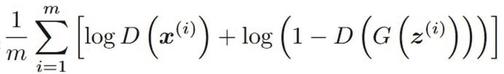

Discriminator loss

**其中:**

**m:** 训练样本数。

**D:** 鉴别器。

**x(i):** 训练例 I，这么一个真实的手写图像。

**G:** 发电机。

**z(i):** 将要输入到发电机的随机噪声。

现在让我们来看一点细节

*   对于第一项 **log(D(x(i)))，** (x(i)是真实的图像)所以如果鉴别器能够区分真伪，它将输出 1，并且 log(1)=0
*   在另一项 **log(1 - D(z(i)))** 中，生成器要取一些随机噪声 z(i)，它要输出看起来接近真实图像的东西，鉴别器如果没有被生成器忽悠就输出 0，log(1-0)=0。
*   在公式的开始，我们只有所有训练样本 m 的平均值。

### 发电机损耗

当生成器被训练时:它对随机噪声进行采样，并从该噪声中产生一个输出。然后，输出通过鉴别器，并根据鉴别器辨别真伪的能力被分类为真或假。

然后，根据鉴别器的分类计算发电机损耗——如果成功骗过鉴别器，将获得奖励，否则将受到惩罚。

下面的等式被最小化以训练发生器:

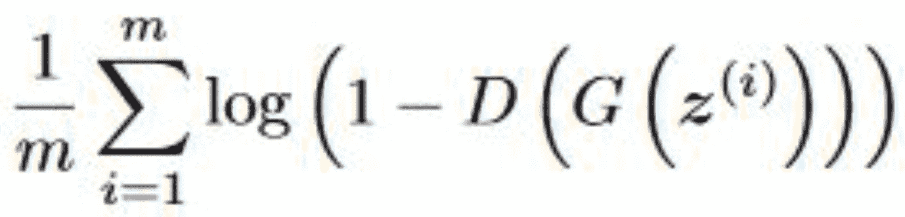

Generator loss

### 合计损失

如果我们一起损失，我们会有这个表达式:

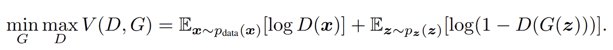

[Source image](https://arxiv.org/pdf/1406.2661.pdf)

我们希望最小化关于发生器，我们希望最大化关于鉴别器，这导致了这个极小极大博弈。我们希望对某个值函数 **V** 执行此操作，该函数将鉴别器 **D** 和发生器 **G** 作为输入，我们希望计算 x 的期望值，其中 x 来自某个实际数据分布 **Ex~p(data(x))** 。我们希望对 **log(D(x))** 也这样做。然后，我们要添加 z 的期望值，其中 z 来自某个随机分布 **Ex~p(z(z))** ，我们要对 **log(1-D(G(z)))** 这样做。

### 注意:

从发生器的角度来看，损失函数具有非常弱的梯度，因此在实践中，发生器被训练为最大化该表达式作为损失函数:

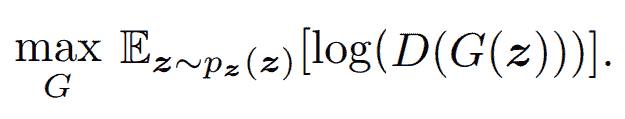

发生器的这个新的损失函数导致非饱和梯度，这使得训练容易得多

* * *

# 从零开始构建我们的第一个简单 GAN 以生成 MNIST

为了学习新概念或新软件，最好首先使用没有问题的样本数据集，对我来说，MNIST 数据集是一个完美的选择，因为在我们看来，它是最容易使用的图像数据。这就像计算机视觉中的“hello world ”,他们说如果某样东西在 MNIST 数据集中不起作用，它可能永远也不会起作用。在接下来的教程中，我们将使用更高级的 GANs 处理更复杂的数据。

因此，在本节中，我们将重点从零开始构建一个简单的 GAN 来生成从 0 到 9 的手写数字。

现在让我们开始库导入。

### 加载我们需要的所有依赖项

第一步，我们将导入从头构建一个简单的 GAN 所需的所有依赖项。

我们首先将为线性代数导入 Numpy。然后，我们想使用 PyTorch，所以让我们导入 Torch，并从 torch 导入 nn。这将有助于我们创建和训练网络(鉴别器和生成器)，同时让我们导入 optim，这是一个实现*各种优化算法的包(例如 sgd、adam、..).*从 torch.utils.data 导入数据加载器*来创建小批量。*

> **注**:很多惊人的数据科学家分别是这样导入 nn 和 optim 的:导入 torch.nn 为 nn，导入 torch.optim 为 optim。

我们还将导入火炬视觉，因为我们显然是在处理图像。从 torchvision，我们将导入转换和数据集来下载我们的数据并应用一些转换。最后，我们将导入 matplotlib.pyplot 作为 plt 来绘制结果和一些真实样本。

```py
import numpy as np 
import torch
from torch import nn, optim
from torch.utils.data import DataLoader
import torchvision
import torchvision.transforms as transforms
import torchvision.datasets as datasets
import matplotlib.pyplot as plt
```

### 鉴别器

现在让我们来构建鉴别器，从我之前展示的示例来看，它将充当我们的判断器，因此鉴别器将判断图像，并判断它是真图像还是假图像。

鉴别器类将从 **nn 继承。模块**，这将是一个非常简单的模型，它将来自 MNIST 数据集的输入 **in_features** ，因此它将等于 28*28*1= 784，我们将使用以下层来构建我们的模型:

*   **nn。线性**:这基本上是一个完全连接的层
*   **nn。LeakyReLU** :这是应用于网络中各种输出的激活，可以使用 **nn。ReLU** ，但是在 GANs LeakyReLU 往往是更好的选择，或者至少是更好的默认。
*   **nn。Sigmoid():** 在最后一层使用它，确保结果在 0 和 1 之间

```py
class Discriminator(nn.Module):
    def __init__(self, in_features):
        super().__init__()
        self.disc = nn.Sequential(
            nn.Linear(in_features, 256),
            nn.LeakyReLU(0.1),
            nn.Linear(256, 128),
            nn.LeakyReLU(0.1),
            nn.Linear(128, 1),
            nn.Sigmoid()
        )
    def forward(self, x):
        return self.disc(x)
```

### 发电机

让我们现在构建生成器，它将生成看起来像真的手写数字的假数字，并试图欺骗鉴别器。

生成器类也将从 **nn 继承。模块**，这将是一个非常简单的模型，将噪声 **z_dim** 作为输入，并从中生成假图像。我们将使用相同的层来建立这个模型，除了在最后的激活函数中我们将使用**神经网络。Tanh** 确保输出的像素值在-1 和 1 之间。我们这样做是因为我们要对来自 MNIST 数据集的输入进行归一化，以确保它在-1 和 1 之间。

```py
class Generator(nn.Module):
    def __init__(self, z_dim, img_dim):
        super().__init__()
        self.gen = nn.Sequential(
            nn.Linear(z_dim, 256),
            nn.LeakyReLU(0.1),
            nn.Linear(256, 512),
            nn.LeakyReLU(0.1),
            nn.Linear(512, img_dim),
            nn.Tanh()
        )
    def forward(self, x):
        return self.gen(x)
```

### 超参数

GAN 对超参数非常敏感，尤其是在这个简单的 GAN 中。我们在某种程度上复制了最初的 GAN 论文。在新的论文中，他们提出了更好的方法来稳定 GANs，但我们将把它留到以后的文章中。

```py
DEVICE  = 'cuda' if torch.cuda.is_available() else 'cpu'
LR      = 3e-4
Z_DIM   = 64
IMG_DIM = 28*28*1
BS      = 64
EPOCHS  = 101
```

### 初始化和预处理

*   初始化鉴别器和发生器，并将其放入设备中
*   设置一些固定的噪声来观察相同的分布图像在不同时期是如何变化的
*   初始化用于数据扩充的转换(RandomHorizontalFlip ),并将我们的图像归一化到-1 和 1 之间
*   下载 MNIST 数据集并对其应用变换
*   使用数据加载器创建小批量
*   初始化鉴别器和生成器的优化器，我们将对两者都使用 Adam
*   用 BCELoss 初始化损失，因为它与我们之前看到的 GANs 损失非常接近

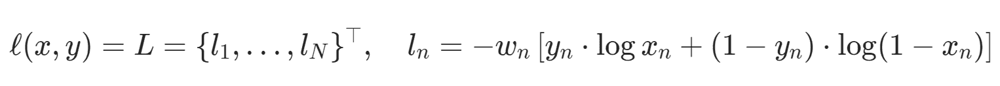

[BCEloss](https://pytorch.org/docs/stable/generated/torch.nn.BCELoss.html)

```py
disc        = Discriminator(IMG_DIM).to(DEVICE)
gen         = Generator(Z_DIM, IMG_DIM).to(DEVICE) 
fixed_noice = torch.randn((BS, Z_DIM)).to(DEVICE) 
transforms  = transforms.Compose([transforms.RandomHorizontalFlip(), transforms.ToTensor(),transforms.Normalize((0.5,),(0.5,))])
dataset     = datasets.MNIST(root = 'dataset/', transform = transforms, download = True)
loader      = DataLoader(dataset, batch_size=BS, shuffle=True)
opt_disc    = optim.Adam(disc.parameters(), lr=LR)
opt_gen     = optim.Adam(gen.parameters(), lr=LR)
criterion   = nn.BCELoss()
```

### 绘制一些真实的样本

让我们画一些真实的样品，看看他们看起来如何。

```py
real, y = next(iter(loader))
_, ax = plt.subplots(5,5, figsize=(10,10))
plt.suptitle('Some real samples', fontsize=19, fontweight='bold')

ind = 0 
for k in range(5):
    for kk in range(5):
        ind += 1
        ax[k][kk].imshow(real[ind][0])
```

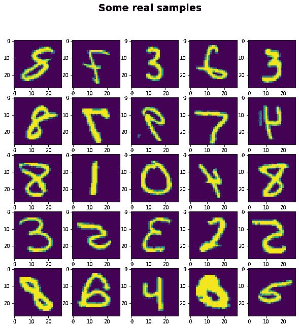

### 培养

现在有趣的部分，魔术将会发生，在这一部分中，我们将训练我们的 GAN，并为 0、50 和 100 个时期绘制一些假样本。

为了训练 GAN，我们循环使用 DataLoader 创建的所有小批量，并且我们只获取图像，因为我们不需要标签。这使得它成为无监督学习。我们将图像命名为 real，因为它们是真实的，我们使用`real.view(-1, 784)`对它们进行整形，以保持我们批次中的示例数量，然后我们展平其他所有内容，并将我们的批次大小带到设备中。

现在，让我们为鉴别器设置培训。记住，它要最大化 **log(D(实))+ log(1-D(G(z)))** 。

为了获得第一项 **log(D(real))** 我们用 **D(real)** 代替 BCELoss 中的 x，D(real) 是鉴别器拍摄真实图像时的输出，我们用 1 代替 y。我们的新方程将具有以下形式:

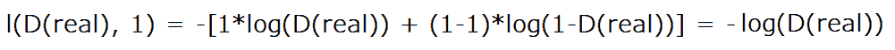

你可以注意到，我们把 wn 从等式中去掉了，因为它只有一个，所以我们可以忽略它。但这里重要的部分是，我们前面有一个负号，这意味着如果我们想要最大化 **log(D(real))** ，那么我们需要最小化该表达式的负值，如果你习惯于训练神经网络，你通常会想要最小化损失函数。

为了获得第二项 **log(1-D(G(z)))** 我们用 **D(G(z))** 代替 BCELoss 中的 x，D(G(z)) 是鉴别器在获取生成器生成的假图像时的输出。然后，我们用零代替 y，因此我们有以下等式:

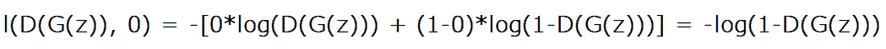

> 注意:为了训练生成器，我们也将使用 G(z ),没有必要再做一遍。当计算鉴频器的反向损耗时，正向传递中用于计算这些梯度的所有内容都已从缓存中清除。如果我们想防止这种清除，我们添加这个参数 **retain_graph=True。**

现在，让我们为想要最小化 **log(1-D(G(z)))** 的生成器设置训练，但是在实践中，正如我之前所说的，我们改为最大化**log(D(G(z))】**。为此，我们也使用 BCELoss，用 D(G(z))代替 x，用 1 代替 y，以获得该等式:

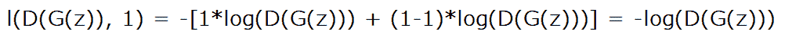

最后，我们准备写一些代码来绘制一些假样本，并尽可能多的重复所有这些。

```py
for epoch in range(EPOCHS):
    for real,_ in loader:
        real       = real.view(-1, 784).to(DEVICE)
        batch_size = real.shape[0]
        ######## train Discriminator: max log(D(real)) + log(1-D(G(z)))
        noise     = torch.randn(batch_size, Z_DIM).to(DEVICE)
        fake      = gen(noise)
        disc_real = disc(real).view(-1) #shape [64,1] -> [64] 
        lossD_real= criterion(disc_real, torch.ones_like(disc_real))
        disc_fake = disc(fake).view(-1)
        lossD_fake= criterion(disc_fake, torch.zeros_like(disc_fake))
        lossD     = (lossD_real + lossD_fake)/2
        disc.zero_grad()
        lossD.backward(retain_graph=True) # Add retain_graph=True, To save fake in memory 
        opt_disc.step()

        ######## train Generator: min log(1-D(G(z))) <==> max log(D(G(z)))
        output = disc(fake).view(-1)
        lossG  = criterion(output, torch.ones_like(output))
        gen.zero_grad()
        lossG.backward()
        opt_gen.step()

    print(
                f"Epoch [{epoch}/{EPOCHS}] \
                      Loss D: {lossD:.4f}, loss G: {lossG:.4f}"
    )

    if epoch %50 == 0:
        with torch.no_grad():
            fake = gen(fixed_noice).reshape(-1, 1, 28, 28).cpu()
        _, ax = plt.subplots(5,5, figsize=(10,10))
        plt.suptitle('Results of epoch '+str(epoch), fontsize=19, fontweight='bold')

        ind = 0 
        for k in range(5):
            for kk in range(5):
                ind += 1
                ax[k][kk].imshow(fake[ind][0])
```

这些图像并不完美，但看起来还不错！如果你训练的时间更长，你可以期待这些会变得更好。希望您能够遵循所有步骤，并理解如何实现简单的图像生成 GAN。

# 结论

在这篇文章中，我们通过谈论一些很酷的应用程序，如生成不存在的真实人脸、恢复、殖民、提高照片分辨率和跨域转换图像，发现了为什么 gan 很棒。然后，我们分析了 GANs 到底是什么，并对它们的工作方式有了直观的了解。我们深入研究了鉴频器和发生器使用的损耗函数，最后，我们从头开始实现了一个简单的 GAN 来产生 MNIST。

在接下来的文章中，我们将解释并从头实现更高级的 GANs 来生成更酷更复杂的数据。