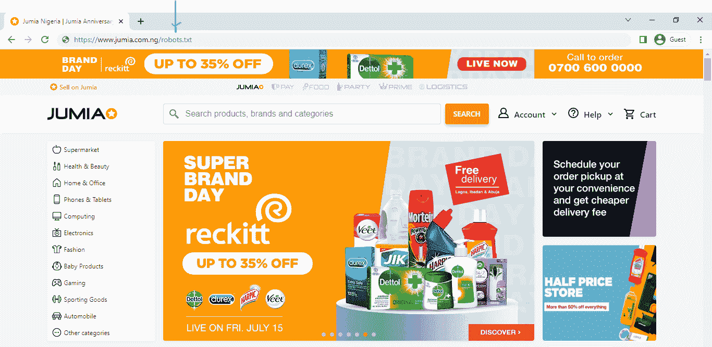
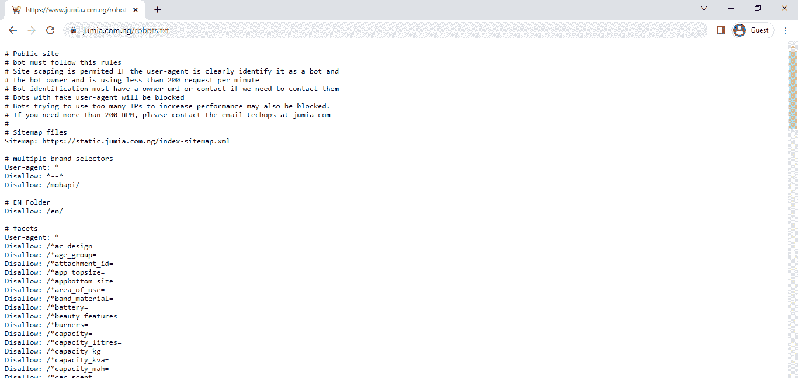
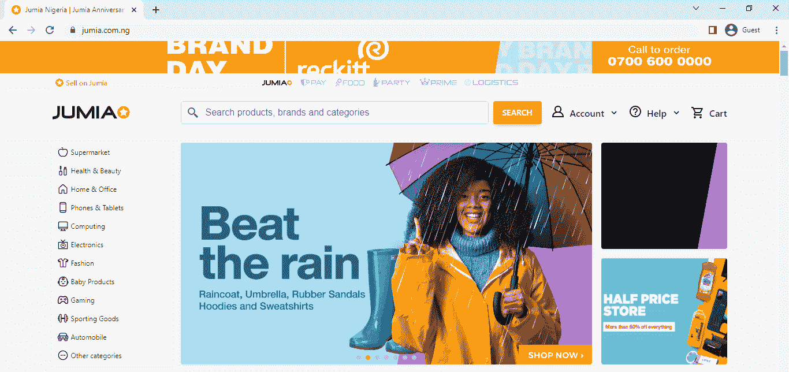
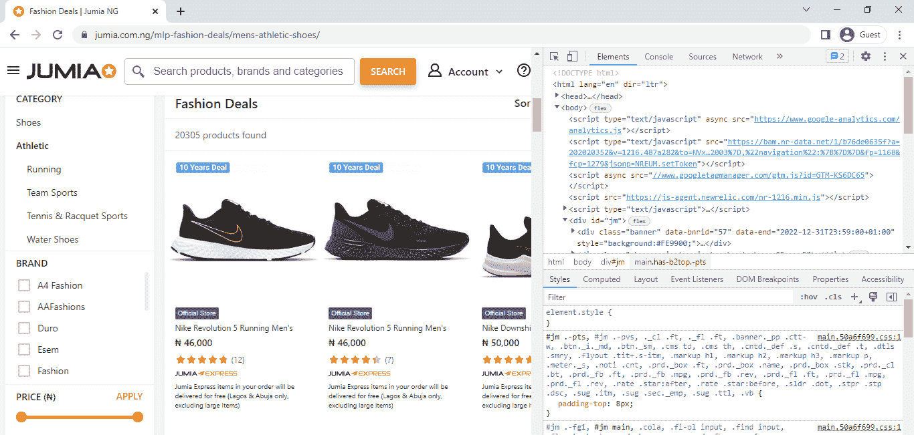
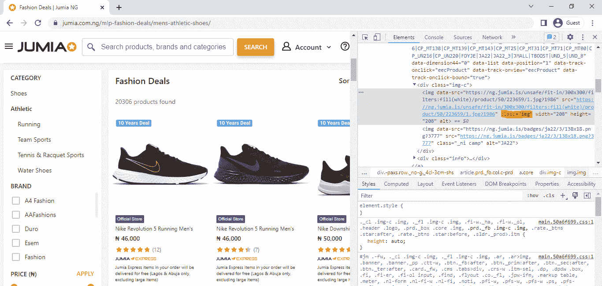

# 为图像数据收集构建简单的 Web 抓取器

> 原文：<https://blog.paperspace.com/building-simple-web-scrapers-for-image-data-collection/>

数据收集是机器学习/深度学习领域中很少谈论的话题。虽然在 PyTorch 和 Scikit-Learn 等库上有许多预加载的数据集，但人们可能需要为特定项目收集和整理自定义数据集。

有多种方法可以进行数据收集，例如从数据收集仪器中读取数据，或者在适当的时候手动记录观察结果。在计算机视觉的背景下，数据收集最容易的方法就是从网页上抓取预先存在的图像。

在本文中，我们将探索如何使用 BeautifulSoup 库构建一个简单的 web scraper。使用这个刮刀，我们将尝试为一个计算机视觉项目收集和管理一个定制的图像数据集。

### 网络抓取的概念

网页抓取是从网页中提取数据的过程。在网页抓取过程中使用的工具被称为网页刮刀(或简称刮刀)。从技术上来说，抓取器查看网页的源代码，并根据 html 标签或其他方式抓取数据。在 Python 生态系统中，有许多库可以用于 web 抓取，如 BeautifulSoup、Selenium 和 Scrapy。然而，在这篇文章中，我们将重点放在使用 BeautifulSoup 构建刮刀上。

### 网络抓取伦理

关于网络抓取的整个过程及其整体合法性，已经做了很多。事实上，它是如此的有争议，以至于有围绕这个主题的真实的法庭案例。

在美国第九巡回上诉法院的一项裁决中，重申了在互联网上搜集公众可访问的数据并不违反 CFAA(计算机欺诈和滥用法案)。从本质上讲，这意味着搜集向每个访问网页的人公开显示的信息是合法的，然而搜集私人数据将被视为非法。

也就是说，出于个人原因，网站也可以完全阻止网络抓取。检查特定网页是否允许抓取的一个简单方法是检查它的 robots.txt 文件。robots.txt 文件向网络爬虫(如 Google、Bing)提供信息，允许它们访问哪些文件夹，并在搜索结果中显示，爬虫基本上以此作为一种许可文件。


考虑上面的网页，要访问它的 robot.txt 文件，需要做的就是将“/robots.txt”添加到网页的地址栏，如下所示。



完成后，剩下的就是按回车键，页面的 robots.txt 文件将如下图所示显示。从文件来看，很明显，这个特定的网站并不反对网络抓取，尽管有一些限制。记住，并不是所有的 robots.txt 文件都如此详细地描述了网站对抓取的态度。要注意的一点是文件中的“不允许”参数，列出多个“不允许”参数的网站只允许在选定的文件夹(列出的文件夹)中进行抓取。一个完全限制抓取的网站会有一个参数，如*‘不允许:/’*，如果有完全抓取权限，那么它只会是*‘不允许:’*。



毕竟，网站仍然可以阻止僵尸工具(抓取工具)访问他们的网页。然而，如果你决定继续从这类页面中抓取数据(有反抓取技术的方法)，请确保你保持道德，不要让他们的服务器超载。

### BeautifulSoup & HTML 解析

解析是将字符串分离成其组成部分以便于分析的过程。这基本上就是 BeautifulSoup 库所做的，因为它提取网页的 html，并根据它们的标签“分离”它们，以便可以分别访问和分析它们。

考虑下面的示例 html，它由包含在 html、title、body、h1 和 p 等标签中的字符串组成，如果这个 html 作为 beautifulsoup 中的参数提供，我们将能够单独访问每个标签，并对它们包含的字符串做我们想做的任何事情。

```py
<html>
    <title>Mock Webpage</title>
    <body>
        <h1>Web Scraping</h1>

        <p>This article is all about web scraping</p>

        <p>We will be using BeautifulSoup</p>
    </body>
</html>
```

Sample html

尝试从上面的 html 创建一个 beautifulsoup 元素，为了简单起见，复制 html，将它们格式化为 Python 字符串(通过将它们放在引号中)并创建一个如下所示的对象。接下来，使用“html.parser”参数创建一个 beautifulsoup 元素。

```py
#  article dependacies
from bs4 import BeautifulSoup
from urllib.request import urlopen
from urllib.request import Request
from tqdm import tqdm
import requests
import os
import time
```

```py
from bs4 import BeautifulSoup

#  create html object
html = """
<html>
    <title>Mock Webpage</title>
    <body>
        <h1>Web Scraping</h1>

        <p>This article is all about web scraping</p>

        <p>We will be using BeautifulSoup</p>
    </body>
</html>
"""

#  create beautifulsoup element
bs = BeautifulSoup(html, 'html.parser')
```

既然已经生成了一个 beautifulsoup 元素，我们可以简单地调用标签作为元素的属性来访问它们。下面进行了几个属性调用。

```py
#  extract the title tag
bs.title

>>>> <title>Mock Webpage</title>
```

```py
#  extract the h1 tag
bs.h1

>>>> <h1>Web Scraping</h1>
```

```py
#  extract the p tag
bs.p

#  notice that just the first tag is returned
>>>> <p>This article is all about web scraping</p>
```

```py
#  extract all p tags
bs.find_all(p)

>>>> [<p>This article is all about web scraping</p>,
      <p>We will be using BeautifulSoup</p>]
```

```py
#  extract only the string in the title tag
bs.title.get_text()

>>>> Mock Webpage
```

### 美丽的声音和网页抓取

从上一节我们知道，如果我们将 html 以合适的格式放入 beautifulsoup，我们就可以开始从中提取信息。当涉及到托管在服务器上的实际网页时，我们需要找到一种方法在 Python 环境中实际访问它们的 html。为此，我们需要将 urllib 库与 beautifulsoup 结合使用。

```py
from urllib.request import urlopen
from urllib.request import Request

url = 'actual link'

#  header to mimick web browser
headers = {'User-Agent': 'Mozilla/5.0 (X11; Linux x86_64) AppleWebKit/537.11 (KHTML, like Gecko) Chrome/23.0.1271.64 Safari/537.11',
      'Accept': 'text/html,application/xhtml+xml,application/xml;q=0.9,*/*;q=0.8',
      'Accept-Charset': 'ISO-8859-1,utf-8;q=0.7,*;q=0.3',
      'Accept-Encoding': 'none',
      'Accept-Language': 'en-US,en;q=0.8',
      'Connection': 'keep-alive'}

#  make request to server
request = Request(url, headers=headers)

#  open request and create beautifulsoup element
html = urlopen(request)
bs = BeautifulSoup(html.read(), 'html.parser')
```

从上面的代码块中，我们已经从 urllib 导入了 urlopen 函数和 Request 方法。首先，我们使用 request 方法向托管网页的服务器发出请求。请注意，我们已经为请求指定了新的头，这样做是为了提供一个实际的 web 浏览器正在向服务器发出请求的假象(这只是避免反刮刀的基本方法之一)。

最后，我们只需使用 urlopen 函数打开从服务器(位于请求对象中)得到的响应，然后创建一个漂亮的 output 元素，正如我们在上一节中所做的那样。html 对象上使用了“read()”属性，以允许美化组访问其内容，因为它不是字符串格式。

### 从网页上抓取图像

#### 抓取图像

利用到目前为止我们积累的所有知识，我们现在可以尝试从网页上抓取图像。图像通常位于“src”链接中，或者它们的一些变体，位于 html 的“img”标签中。网页上的每一张图片都将以同样的方式标记，为了只提取感兴趣的图片，我们需要以某种方式区分它们。出于演示目的，让我们使用电子商务网站 [Jumia](https://www.jumia.com.ng/) 。



Home page.

假设我们想要构建一个二进制分类模型，能够区分男士的[运动鞋](https://www.jumia.com.ng/mlp-fashion-deals/mens-athletic-shoes/)和[靴子](https://www.jumia.com.ng/mlp-fashion-deals/mens-boots/)。导航到任何一个链接的页面，右键点击然后点击 inspect 显示页面的 html *(个人使用的**谷歌浏览器**)在这个例子中*。



Displaying the page's html.

#### 标签和属性

右键单击鞋子目录列表中的图片，会发现它们都包含在“img”标签中，图片本身可以在 data-src 链接中找到。还有一点需要注意的是，它们都有相同的 class 属性(class = "img ")。检查列表中没有的其他图像会发现它们具有不同的类属性。



All images in the listing have the class "img".

这大大简化了我们的任务。我们需要做的就是使用 beautifulsoup 解析这个页面，然后提取所有包含“img”类的 img 标签。为此，我们可以简单地复制上一节抓取网页的代码，但这次我们将使用一个真实的 url。为了抓取多个页面，导航到第 2 页并复制 url，您会注意到指定了页码，我们需要做的只是以某种方式修改它，以便我们可以迭代多个页面。

```py
#  copy link from page 2 and edit 2 to 1 to access the first page
url = 'https://www.jumia.com.ng/mlp-fashion-deals/mens-athletic-shoes/?page=1#catalog-listing'

headers = {'User-Agent': 'Mozilla/5.0 (X11; Linux x86_64) AppleWebKit/537.11 (KHTML, like Gecko) Chrome/23.0.1271.64 Safari/537.11',
      'Accept': 'text/html,application/xhtml+xml,application/xml;q=0.9,*/*;q=0.8',
      'Accept-Charset': 'ISO-8859-1,utf-8;q=0.7,*;q=0.3',
      'Accept-Encoding': 'none',
      'Accept-Language': 'en-US,en;q=0.8',
      'Connection': 'keep-alive'}

request = Request(url, headers=headers)

html = urlopen(request)
bs = BeautifulSoup(html.read(), 'html.parser')

#  extract all img tags with class img
interest = bs.find_all('img', attrs={'class':'img'})
```

我们现在拥有了对象“interest”中的所有目录图像。为了提取 data-src 链接，我们需要做的就是调用列表中每一项的 data-src 属性。

```py
#  extracting links using list comprehension
links = [listing['data-src'] for listing in interest]
```

#### 从 src 链接下载

使用提取的链接，我们现在可以尝试使用请求库提取其中的图像。

```py
import requests

#  instantiating counter
count = 0

#  downloading images
for link in tqdm(links):
  with open(f'athletic_{count}.jpg', 'wb') as f:
    response = requests.get(link)
    image = response.content
    f.write(image)
    count+=1
```

### 构建 Web 刮刀

在这一点上，把我们所知道的关于网络抓取的所有东西放在一起，我们现在可以构建一个自动完成上述所有步骤的抓取器。对于我们的 scraper，我们将创建一个 Python 类，其中包含一些方法来复制前面讨论过的抓取过程。

```py
class WebScraper():
    def __init__(self, headers, tag: str, attribute: dict,
                src_attribute: str, filepath: str, count=0):
      self.headers = headers
      self.tag = tag
      self.attribute = attribute
      self.src_attribute = src_attribute
      self.filepath = filepath
      self.count = count
      self.bs = []
      self.interest = []

    def __str__(self):
      display = f"""      CLASS ATTRIBUTES
      headers: headers used so as to mimic requests coming from web browsers.
      tag: html tags intended for scraping.
      attribute: attributes of the html tags of interest.
      filepath: path ending with filenames to use when scraping images.
      count: numerical suffix to differentiate files in the same folder.
      bs: a list of each page's beautifulsoup elements.
      interest: a list of each page's image links."""
      return display

    def __repr__(self):
      display = f"""      CLASS ATTRIBUTES
      headers: {self.headers}
      tag: {self.tag}
      attribute: {self.attribute}
      filepath: {self.filepath}
      count: {self.count}
      bs: {self.bs}
      interest: {self.interest}"""
      return display

    def parse_html(self, url):
      """
      This method requests the webpage from the server and
      returns a beautifulsoup element
      """
      try:
        request = Request(url, headers=self.headers)
        html = urlopen(request)
        bs = BeautifulSoup(html.read(), 'html.parser')
        self.bs.append(bs)
      except Exception as e:
        print(f'problem with webpage\n{e}')
      pass

    def extract_src(self):
      """
      This method extracts tags of interest from the webpage's
      html
      """
      #  extracting tag of interest
      interest = self.bs[-1].find_all(self.tag, attrs=self.attribute)
      interest = [listing[self.src_attribute] for listing in interest]
      self.interest.append(interest)
      pass

    def scrape_images(self):
      """
      This method grabs images located in the src links and
      saves them as required
      """
      for link in tqdm(self.interest[-1]):
        try:
          with open(f'{self.filepath}_{self.count}.jpg', 'wb') as f:
            response = requests.get(link)
            image = response.content
            f.write(image)
            self.count+=1
            #  pausing scraping for 0.4secs so as to not exceed 200 requests per minute as stipulated in the web page's robots.txt file
            time.sleep(0.4)
        except Exception as e:
          print(f'problem with image\n{e}')
          time.sleep(0.4)
      pass
```

Scraper.

上述 web scraper 类中的方法使用 try/except 块处理异常。这样做是为了防止由于网络上普遍存在的链接断开或文件丢失而引发的异常。现在已经定义了 web scraper，让我们实例化一个名为“scraper”的对象，它将是该类的成员。

```py
#  instantiating web scraper class
scraper = WebScraper(headers=headers, tag='img', attribute = {'class':'img'},
                        src_attribute='data-src', filepath='shoes/athletic/atl', count=0)
```

Instantiating scraper.

实际上，上面定义的 scraper 对象一次只能抓取一个页面/url。为了使它更健壮，并允许它抓取多个页面，我们需要将它包装在一个函数中，该函数将允许它遍历多个页面。为了让函数工作，我们需要从除了页面 1 之外的任何页面复制 url，然后将其格式化为 f 字符串，如下面的代码块所示。这样做的原因是，我们可以访问嵌入在 url 中的页面引用。

```py
def my_scraper(scraper, page_range: list):
    """
    This function wraps around the web scraper class allowing it to scrape
    multiple pages. The argument page_range takes both a list of two elements
    to define a range of pages or a list of one element to define a single page.
    """
    if len(page_range) > 1:
      for i in range(page_range[0], page_range[1] + 1):
        scraper.parse_html(url=f'https://www.jumia.com.ng/mlp-fashion-deals/mens-athletic-shoes/?page={i}#catalog-listing')
        scraper.extract_src()
        scraper.scrape_images()
        print(f'\npage {i} done.')
      print('All Done!')
    else:
      scraper.parse_html(url=f'https://www.jumia.com.ng/mlp-fashion-deals/mens-athletic-shoes/?page={page_range[0]}#catalog-listing')
      scraper.extract_src()
      scraper.scrape_images()
      print('\nAll Done!')
    pass
```

Wrapping scraper in a function so as to be able to scrape multiple pages.

设置好一切后，我们现在可以使用下面的代码来抓取前五页的图片。我们设置 scraper 的方式很酷的一点是，只需调用“scraper.interest ”,就可以很容易地逐页访问 src 链接，这将返回一个嵌套列表，每个内部列表包含每个页面的 src 链接。你也可以尝试从 [boots](https://www.jumia.com.ng/mlp-fashion-deals/mens-boots/) 列表中抓取前五页。

```py
import os

#  creating directory to hold images
os.mkdir('shoes')
os.mkdir('shoes/athletic')

#  scraping the first five pages
my_scraper(scraper=scraper, page_range=[1, 5])
```

After the function is ran, navigate to shoes\athletic, you should find image files named 'atl_0.jpg' - 'atl_200.jpg'.

### 使用 BeautifulSoup 的缺点

从前面几节可以明显看出，BeautifulSoup 是一个强大的网络抓取工具。然而，它的一个缺点是它并不总是足以抓取动态网页。可以把动态网页想象成这样的页面，点击按钮会在同一页面上显示更多的内容。对于这种页面，Selenium 库是一个安全的选择。

### 结束语

在本文中，我们探讨了 web 抓取的一般概念。然后我们专注于使用 BeautifulSoup 库抓取图像。利用我们积累的知识，我们开始构建一个 web scraper，能够一次从几个页面中抓取图像。

本质上，如果想要从页面中抓取非图像数据，也可以应用相同的过程，只要从页面的 html 中识别出感兴趣的标签和属性，就可以构建一个抓取任何类型的所需数据的抓取器。