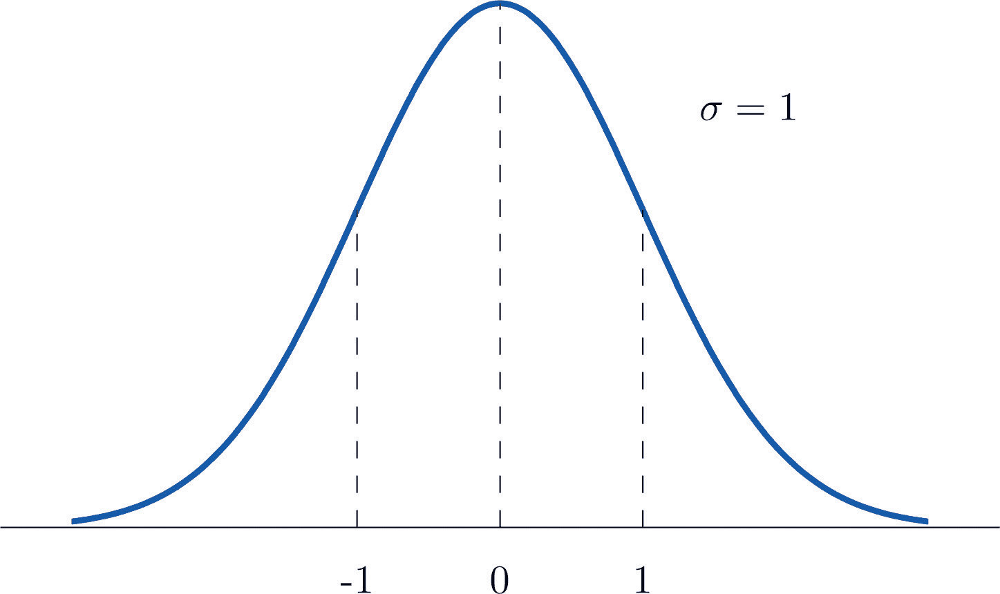
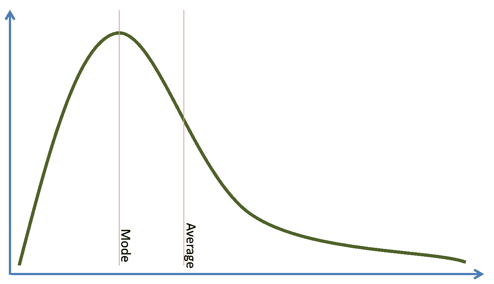
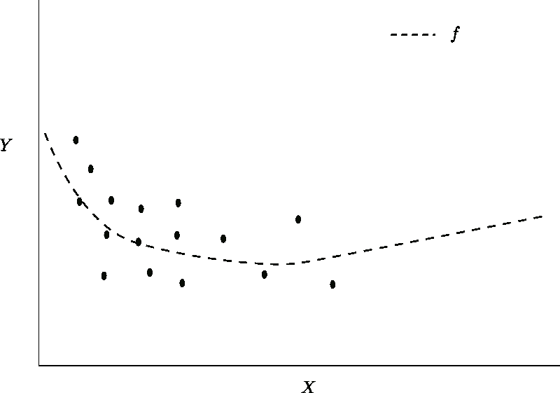
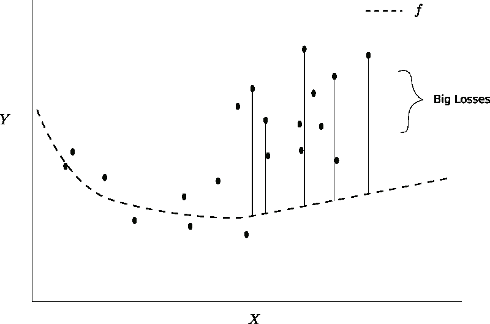
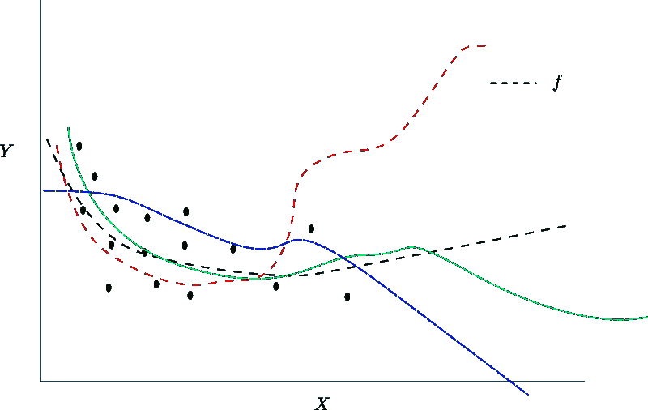
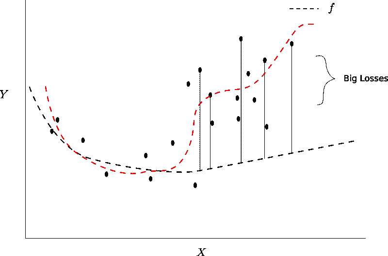
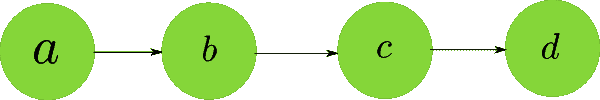

# 深度学习中的优化介绍:打破批处理规范化的神话

> 原文：<https://blog.paperspace.com/busting-the-myths-about-batch-normalization/>

认识这些人吗？如果不是，这些人自称**。见鬼，他们甚至在探索频道上有一个自己的节目，他们试图不辜负他们的名字，试图打破神话，比如你是否可以用牙线反复腐蚀监狱酒吧。(警告:在服刑期间不要尝试这样做)。**

 **受到他们的启发，我们 Paperspace 也打算做类似的事情。**我们要解决的迷思是，批量标准化是否真的解决了内部协变量转移的问题**。虽然批处理规范化已经存在了几年，并且已经成为深度架构中的主要内容，但它仍然是深度学习中最容易被误解的概念之一。

批量定额真的解决了内部协变量转移吗？如果不是，那它是做什么的？你的整个深度学习教育都是骗人的吗？让我们来了解一下！

## 就在我们开始之前..

我想提醒你，这篇文章是关于深度学习中优化的[系列的一部分，我们已经讨论过了:](https://blog.paperspace.com/tag/series-optimization/)

1.  如何使用[随机梯度下降](https://blog.paperspace.com/intro-to-optimization-in-deep-learning-gradient-descent/)来对抗深度学习中的局部极小值和鞍点问题。
2.  像 Momentum 和 Adam 这样的自适应方法如何增强 vanilla gradient descent 来处理优化曲面中的病态曲率。
3.  如何使用不同的激活函数来解决渐变消失的问题。

我们从上一篇文章中学到的一个教训是，为了让神经网络有效地学习，提供给网络各层的分布应该是:

1.  零中心的
2.  时间和数据中的常数

第二个条件意味着被馈送到各层的数据的分布在被馈送到网络的小批量中不应该变化太多**，并且随着训练的进行**，它应该保持**一定程度的恒定。相反的情况是，分布在不同时期快速变化。**

## 内部协变量移位

让我们直奔主题吧。论文 [*批量归一化:通过减少内部协变量移位*](https://arxiv.org/pdf/1502.03167) 加速深度网络训练，其前提是解决一个叫做**内部协变量移位**的问题。

那么，这个内部协变量转移，或者说 ICS，从现在开始我们会这么称呼它。当你的神经网络各层的输入分布最终波动时，就是**。*内部*部分是指这种波动发生在神经网络的中间层，可以认为是网络的内部部分。*协变量*部分指的是分布被彼此不同的权重参数化的事实。*转变*，嗯，意味着分布在变化。**

所以，让我们试着捕捉这件事是如何发生的。再一次，想象一个最简单的神经网络。线性堆叠的神经元，因此您也可以通过用层来替换神经元来扩展这种类比。

让我们假设我们正在为上面给出的网络优化损失函数$ L $。神经元$d$的权重$ \omega_d $的更新规则是

$ $
\ frac { \ partial { L } } { \ partial { \ omega _ d } } = \ frac { \ partial { L } } * \ frac { \ partial { z _ d } } { \ partial { \ omega _ d } }
$ $

这里$ z_d = \omega_d z_c $是神经元$d$的激活。简化，我们得到，

$ $
\ frac { \ partial { L } } { \ partial { \ omega _ d } } = \ frac { \ partial { L } } { \ partial { z _ d } } * z _ c
$ $

因此，我们看到层$d$的权重梯度取决于层$c$的输出。这同样适用于神经网络中的任何层。神经元的权重梯度取决于它的输入，或者它后面一层的输出。(咄！)

这个梯度然后被反向传播，并且权重被更新。重复这个过程。现在，让我们回到层$d$。

由于我们对$d$执行了梯度更新，我们现在期望$\omega_d$获得更低的损失。然而，情况可能并非如此。为什么会这样呢？让我们仔细看看。

1.  我们在迭代$i$时执行初始更新。让我们用$ p_c^i $来表示迭代$i$时$c$的输出分布。现在，$d$的更新假设 c 的输入分布为$ p_c^i $。

2.  然而，在向后传递期间，$c，\omega_c$的权重也被更新。这导致了$c$产出分布的变化。

3.  在下一次迭代$i+1$中，假设$z_c$的分布已经转移到$ p_c^{i + 1} $上。**由于图层$d$的权重是根据$ p_c^i $更新的，现在图层$d$面对的是输入分布$ p_c^{i+1} $，这种差异可能会导致图层产生的输出根本不会减少损失。**

现在，我们可以提出两个问题。

1.  输入分布的变化究竟是如何使一个层更难学习的？
2.  这种转变是否会剧烈到足以导致上述情况？

我们先回答第一个问题。

## 为什么内部协变量转移甚至是一件事？

神经网络所做的是生成一个映射$ f $将输入$ x $映射到输出$ y $上。如果$ x $的分布发生变化，究竟为什么会有所不同呢？

我是说，看，这里是$ x $正态分布的时候。

这里是$ x $不是正态分布的时候。

假设我们正在尝试的映射是$ f = 2x $。如果$ x $的分布在一个地方有很多密度，或者它是均匀分布的，这有什么关系呢？

事实证明，这很重要。这很重要，因为神经网络，准确地说是现代深度网络，是非常强大的曲线拟合器。正如本叔叔告诉蜘蛛侠的那样，“权力越大，责任越大”。

让我们假设，我们有一个层$ l $，它面向$ x $，其分布如下。此外，让我们假设，到训练的这一点为止，由层$l$学习的函数由虚线表示。

在迭代$ i $期间

现在，假设在梯度更新之后，当下一个小批次馈入网络时，x 的分布会变成这样。

在迭代$ i + 1 $期间

请注意，与之前的损失相比，这次小批量的损失更大。呀！为什么会这样？

让我们回到先前的数字。你看，我们最初学习的映射$f$在减少前一个小批量的损失方面做得很好。许多其他函数也是如此，它们在$x$不密集的区域表现非常不同。

适合相同输入$X$ $ i $的不同函数

如果我们选择红色虚线给出的函数，我们下一个小批量的损失也会很低。

另一个功能会更适合

但是现在最突出的问题是，我们如何修改我们的算法，以至于我们最终学会了对应红色虚线的映射？简单的答案是，*这个*没有简单的答案。在这一点上，更好的做法是，我们不要试图找到解决这种情况的方法，而是首先集中精力预防它们。

ICS 最终破坏我们学习的原因是我们的神经网络总是在输入分布更密集的区域表现更好。由于密度较大区域的**数据点在平均损失**(我们正试图将其最小化)中占主导地位，因此密度较大区域的点损失减少更多。

然而，如果 ICS 最终在训练期间在后续批次中改变输入分布的更密集区域，则网络在先前迭代期间学习的权重不再是最优的。可能需要非常仔细地调整超参数才能获得合理的学习。这解释了为什么集成电路会成为这样一个问题。

我们所说的是在我们的小批量生产中有很大的差异。**方差确保我们的映射不会过度专注于输入分布**的一个区域。我们也希望平均值在零左右。你为什么想要一个以零为中心的图层输入，这个原因已经在之前的文章[这里](blog.paperspace.com/vanishing-gradients-activation-function/)中详细讨论过了。

## 标准化输入

解决此问题的一种方法是将神经网络的输入标准化，使输入分布具有零均值和单位方差。然而，只有当网络不够深时，这才起作用。当网络变得更深时，比如说 20 层或更多层，即使输入被归一化，超过 20 层以上的权重的微小波动也会在输入到更深层的分布中产生大的变化。

一个不完全正确的类比是语言的变化，但是*得到了要点。语言随着我们旅行的距离而变化。然而，短距离内的语言有很多相似之处。比如西班牙语和葡萄牙语。然而，这两种语言都来源于史前印欧语。8000 公里外的印度所讲的语言印度斯坦语也是如此。然而，西班牙语和印度斯坦语之间的差别比西班牙语和葡萄牙语之间的差别要大得多。原因是小距离上的微小变化被放大了很多。深层网络也是如此。*

## 输入批量标准化

我们现在引入批量标准化的概念，它实际上是标准化一个层的输出激活，然后做更多的事情。这里有一个精确的描述。

$ $ \ begin { gather * } y _ I = bn _ { \ gamma，\ beta }(x _ I)\ tag { 1 } \ \ \ mu _ b = \frac{1}{m}\sum_{i=1}^{m}x_i \ tag { 2 } \ \ \ \sigma^2_b = \ frac { 1 } { m } \ sum _ { I = 1}^m(x-\mu_b)^2 \ tag { 3 } \ \ \ hat { x _ I } = \ frac { x _ I-\mu_b}{\sqrt{\sigma_\beta^2+\ epsilon } } \ tag { 4 } \ \ \ \ \ \ y _ I = \ gamma * \ hat { x _ I }+\ beta \ tag { 5 }

上面的等式描述了批处理规范层的作用。等式$2-4$描述了如何计算**小批量**中每个激活的均值和方差，然后减去均值以使激活居中，再除以标准偏差。这是为了确定小批量单位(1)中每次激活的标准偏差。

注意，这里计算的平均值和方差是小批量的平均值和方差。

方程式$5$是真正神奇的地方。$\gamma$和$\beta$是所谓的批处理规范化层的超参数。公式$5$的输出具有$\beta$的平均值和$\gamma$的标准差。实际上，**批量标准化层有助于我们的优化算法控制该层输出的均值和方差。**

## 揭穿 ICS 的神话

向世界介绍批量标准化的论文把它的成功归功于它摆脱了内部协变量的转移。然而，这是一个错误的说法，批处理规范根本不能防止 ICS。

内部协变量偏移就是我们训练网络时输入分布的变化。Batch Norm 具有超参数$\gamma$和$\beta$用于调整激活的平均值和方差。然而，这确实意味着当这些超参数被训练时，它们也会改变，并且批次范数固有地导致激活分布的改变，或者内部协变量的改变。如果它阻止了内部协变量转换，超参数$\gamma$和$\beta$就没有意义了。

## 那么，批量定额为什么行得通呢？

批量定额并不能治愈内部协变量转移。那是肯定的。如果不是，那么它为什么会起作用呢？！

GANs 的创始人 Ian Goodfellow 是人工智能领域最重要的研究人员之一，他在自己的一次演讲中给出了一个可能的解释(文章末尾给出了演讲的链接)。在这一点上，我必须提醒你，除非我们有具体的证据支持，否则这仅仅是猜测，不管它可能来自现代深度学习的重量级人物之一。

Goodfellow 认为，解释在于批处理规范层的两个超参数。

让我们再来考虑一下超级简单的玩具网络。

给你。当我们对$a$的权重进行梯度更新时，我们仅计算$ \ frac { \ partial { L } } { \ partial { a } } $，即损失函数相对于$a$的灵敏度。但是，我们没有考虑到改变$a$的权重也会改变$b，c，d$等其他层的输出。

同样，这实际上归结为我们无法使用二阶或更高阶的优化方法，因为使用这些算法的计算难度很大。梯度下降及其变体只能捕捉一阶相互作用(我们已经在本系列的第 2 部分[这里](https://blog.paperspace.com/intro-to-optimization-in-deep-learning-gradient-descent/)中深入讨论过)。

深度神经网络具有更高阶的相互作用，这意味着除了损失函数之外，改变一层的权重也可能影响其他层的统计。这些跨层的相互作用，当无法解释时，会导致内部协变量的变化。每当我们更新一层的权重时，就有可能以不利的方式影响神经网络中更深一层的统计。

在这种情况下，收敛可能需要仔细的初始化、超参数调整和更长的训练持续时间。**然而，当我们在层之间添加批量归一化层时，层的统计数据仅受两个超参数$\gamma$和$\beta$的影响。**

**现在，我们的优化算法只需调整两个超参数来控制任何层的统计数据，而不是前一层的全部权重**。这大大加快了收敛速度，并避免了仔细初始化和超参数调整的需要。因此，批处理规范更像是一种检查点机制。

请注意，任意设置层的平均值和标准偏差的能力也意味着我们可以恢复原始分布，如果这足以进行适当的训练的话。

## 激活前或激活后的批量定额

虽然原始论文谈到在激活函数之前应用批处理规范，但是在实践中发现在激活之后应用批处理规范会产生更好的结果。这似乎是有意义的，就好像我们在批量定额之后进行激活，那么批量定额层不能完全控制进入下一层的输入的统计，因为批量定额层的输出必须经过激活。在激活后应用批量定额的情况下，情况并非如此。

## 推断时的批量标准

在推断过程中使用批量规范化可能有点棘手。这是因为我们在推理时可能并不总是有一个批处理。例如，考虑对视频实时运行对象检测器。一次处理一个帧，因此没有批处理。

这是至关重要的，因为我们需要计算一个批次的均值{ x } $和方差$\sigma^2$，以产生批次范数层的输出。在这种情况下，我们在训练期间保持均值和方差的移动平均值，然后在推断期间插入这些均值和方差的值。这是大多数深度学习库采用的方法，这些库将批处理规范层开箱即用。

使用移动平均线的依据是大数定律。小批量的均值和方差是对真实均值和方差的非常嘈杂的估计。当批估计被称为批统计时，平均值和方差的真实值(我们不知道)被称为总体统计。大数定律表明，对于大量样本，批次统计数据将趋向于总体统计数据，这就是为什么我们在训练期间使用移动平均。由于优化算法的小批量性质，它还帮助我们消除了估计中的噪声。

如果我们可以选择在测试时使用批次，我们使用与上面相同的等式，除了在计算标准偏差的等式中有微小的变化。而不是方程式

$ $
\sigma^2_b = \ frac { 1 } { m } \ sum _ { I = 1}^m(x-\mu_b)^2 \ tag { 3 } \ \
$ $
我们用，

$ $
\sigma^2_b = \ frac { 1 } { m-1 } \ sum _ { I = 1}^m(x-\mu_b)^2 \ tag { 3 } \ \
$ $

我们在分母中使用$m-1$而不是$m$的原因是，因为我们已经估计了平均值，所以现在我们的 minibatch 中只有$m-1$个独立实体。如果不是这样，平均值可能是任意的数字，但是我们有一个固定的平均值，我们用它来计算方差。这些*独立实体*被称为自由度，对它们的讨论超出了本文的范围。

## 作为正则化子的批范数

批量定额也起正则化作用。每批产品的平均值和方差估计值是真实平均值的噪声版本，这给我们的优化搜索带来了随机性。这有助于正规化。

## 结论

虽然 Batch Norm 现在已经被确立为深度架构的标准元素，但是直到最近才开始研究它是如何工作的。最近的一篇论文得到了很多关注，题目是*批处理规范化如何帮助优化？(不，这不是关于内部协变量移位)*它演示了与不使用批处理范数的网络相比，批处理范数实际上最终如何增加内部协变量移位。论文中的关键观点是，批处理规范实际上使损失表面更平滑，这就是它如此有效的原因。去年，我们还引入了 SELUs 或比例指数线性单位激活函数，它隐式地规范化了通过它们的激活，这是通过批处理规范显式完成的。SELU 的原始论文包含大约 100 页的数学内容，展示了这是如何发生的，我们鼓励有数学倾向的人去阅读。

优化是深度学习中一个令人兴奋的领域。虽然深度学习的许多应用已经被利用并投入使用，但直到现在我们才开始涉足深度学习理论的诱人领域。

最后，我们想说..流言被终结了。

## 进一步阅读

1.  [批量定额试卷](https://arxiv.org/pdf/1502.03167.pdf)
2.  [批量规范化对优化有什么帮助？(不，不是关于内部协变量移位)](https://arxiv.org/pdf/1805.11604.pdf)
3.  [比例指数线性单位](https://arxiv.org/pdf/1706.02515.pdf)
4.  [Ian Goodfellow 关于批量标准化的讲座](https://www.youtube.com/watch?v=Xogn6veSyxA)
5.  [Reddit 讨论是否将批次定额放在 ReLU 之前或之后](https://www.reddit.com/r/MachineLearning/comments/67gonq/d_batch_normalization_before_or_after_relu/)**