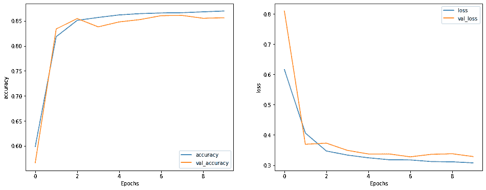

# 张量流中的检查点

> 原文：<https://blog.paperspace.com/checkpointing-in-tensorflow/>

几个月前在研究机器学习问题时，我意识到我需要一种更好的方法来保存训练期间模型的最佳版本。这使我找到了一种在满足特定条件时保存模型的方法。在本文中，我将讨论什么是检查点，以及如何使用 TensorFlow 实现它。


## 先决条件

*   熟悉 Python 编程
*   理解基本的机器学习术语
*   基本熟悉 TensorFlow

# 检查点

检查点通常包括保存系统的状态，以便以后可以恢复使用。通过这种方式，原本会丢失的信息得以保留并重新加载以备后用。是的，它非常类似于仅仅保存一个文件，但是作为一个术语，当计算系统在自然复杂的条件下被保存时，它被更频繁地使用。

在机器学习中，检查点涉及保存模型的当前状态(架构、权重、优化器等等)，以便以后可以重新加载使用。

## 为什么要检查点？

*   **中断的训练循环:**当一个训练序列被有意或无意终止时，整个进度可能会丢失。就计算成本和开发时间而言，这可能是昂贵的。检查点有助于存储模型，以备以后继续训练时使用。

*   **为生产保存最佳模型:**在培训期间，通常情况下，最终模型在所需指标方面不是最佳的。这可能导致人们试图识别最佳时期，然后仅针对该数量的时期进行训练。然而，鉴于这些模型的随机性质，这是一个将被浪费的重要时间。当期望的条件被满足时，检查点有助于保存模型，使得模型的训练和保存成为更直接的过程。

# Tensorflow

Tensorflow 是一个用于端到端机器学习的开源平台。虽然它支持多种语言，但机器学习最流行的选择是 Python，这也是我们将在本文中使用的。Tensorflow 在`tf.train.checkpoint`下有一个检查点方法，但是在这里，我们将使用 Keras 模块下的`ModelCheckpoint`回调方法。

## 模型检查点及其参数

回调是满足特定条件时执行的程序或脚本片段。在我们的例子中，条件是在一些训练时期之后保存模型。`keras.callbacks.ModelCheckpoint`方法实现了检查点，但是需要我们指定一些参数。我们将简要讨论这些。

`filepath`:这是唯一需要的参数，指的是存储的检查点的位置。这里的 Required 意味着，一旦指定了这一点，就可以将检查点回调与已经设置为默认值的其他参数一起使用。

`monitor`:这个参数是一个字符串，它决定了在训练期间检查点回调所要监控的度量。默认情况下，它被设置为`val_loss`，但是可以调整为最适合场景的值。为了监控训练指标，排除了前缀`val_`。此外，如果所需指标的名称是用户定义的，则应该作为参数传入。

`verbose`:该参数是一个整数，用于设置日志记录级别，可以是`0`或`1`，表示无或全部。它的默认值为`0`。

`save_only_best_model`:该参数接受一个布尔值来指定只保存最好的模型。这是基于它被设置为监控的任何指标。默认的是`False`，所以如果没有改变，模型将会在每个实例中保存到相同的文件路径。如果目标是单独保存多个模型，必须小心，因为如果文件名没有被格式化以反映时期并区分文件，则模型将在文件名处用每个时期覆盖指定的文件。

`mode`:模式参数是一个字符串，可以设置为`{'auto', 'min', 'max'}`之一。`'min'`和`'max'`分别为需要最小化(如损失)和最大化(如准确性)的指标设置。当设置为默认的`'auto'`时，代表准确性或 F 分数的指标最大化，所有其他指标最小化。

`save_weights_only`:该参数接受一个布尔值，决定是否只保存模型的权重。如果`True`，将调用`model.save_weights`方法，而不是`model.save`函数。

`save_freq`:该参数接受字符串`'epoch'`以在每个历元后保存模型，或者接受一个整数以批次数表示保存的频率。默认设置是`'epoch'`,因为批量保存会降低监控指标的可靠性。

`options`:这是一个可选的`tf.train.CheckpointOptions`对象，当`save_weights_only`为`True`时使用。当它为假时，使用`tf.saved_model.SaveOptions`对象。这些对象为检查点或保存在分布式设置中有用的模型提供了额外的选项。

现在我们知道了什么是检查点，为什么它是必要的，以及在 TensorFlow 中定义检查点所需的参数。但是实际上真正是怎么用的呢？为了回答这个问题，我们将建立一个模型来将 IMDB 电影评论分为正面和负面两类。

## 安装和导入所需的库

```py
$pip install tensorflow tensorflow_datasets 
```

```py
import numpy as np
import tensorflow as tf
from tensorflow import keras

import tensorflow_datasets as tfds
tfds.disable_progress_bar() 
```

在上面的代码片段中，我们首先通过命令行安装带有`pip`的`tensorflow`和`tensorflow_datasets`，以防它们尚未安装在您的开发环境中。接下来，我们导入`numpy`和`tensorflow`。我们还从`tensorflow`导入了`keras`，因为我们将从那个特定的模块发出几个调用。最后，我们导入`tensorflow_datasets`并禁用它的进度条。

## 创建可视化功能

```py
import matplotlib.pyplot as plt

def plot_graphs(history, metric):
  plt.plot(history.history[metric])
  plt.plot(history.history['val_'+metric], '')
  plt.xlabel("Epochs")
  plt.ylabel(metric)
  plt.legend([metric, 'val_'+metric]) 
```

接下来，我们导入`matplotlib.pyplot`来创建一个函数，这将有助于以后的可视化。该函数接受一个历史对象和一个期望的度量，并根据历元数绘制该度量的训练和验证数据。还为 x 轴和 y 轴添加了标签。

## 加载 IMDB 评论数据集

```py
dataset, info = tfds.load('imdb_reviews', with_info=True,
                          as_supervised=True)
train_dataset, test_dataset = dataset['train'], dataset['test']

print(info.description)
print(info.citation)
print(f"\n{train_dataset.element_spec}") 
```


这里，我们以字符串和两个参数的形式传入数据集的名称，以确定返回信息的性质。`with_info`是确定关于数据集的元数据是否被返回的布尔值，而`as_supervised`是确定数据集是否被加载用于监督学习应用的布尔值。

接下来，我们通过将`'train'`和`'test'`作为数据集变量的键传入，将数据集分成训练和测试部分。最后，我们显示了从收集的信息中得到的描述和引用信息。我们还查看了`train_dataset`变量的元素规范，以了解其组成元素的数据类型。我们可以看到它包含了两个分别具有`tf.string`和`tf.int64`数据类型的张量。

## 配置数据管道

`print(info.splits)`

```py
{'test': <tfds.core.SplitInfo num_examples=25000>,
 'train': <tfds.core.SplitInfo num_examples=25000>,
 'unsupervised': <tfds.core.SplitInfo num_examples=50000>} 
```

首先，我们使用 splits 属性来查看训练和测试数据的大小。这是每个 25000 英镑。

```py
BUFFER_SIZE = 10000
BATCH_SIZE = 64

train_dataset = train_dataset.shuffle(BUFFER_SIZE).batch(BATCH_SIZE).prefetch(tf.data.AUTOTUNE)
test_dataset = test_dataset.batch(BATCH_SIZE).prefetch(tf.data.AUTOTUNE)

for review, label in train_dataset.take(1):
  print('reviews: ', review.numpy()[:3])
  print('\nlabels: ', label.numpy()[:3]) 
```

```py
reviews:  [b'This was a big disappointment for me. I think this is the worst Mastroianni-movie ever made. Cosmatos tries too hard to make this movie a masterpiece and that makes this movie a typical "art"-movie. I give 4/10 for this movie.'
 b"This picture for me scores very highly as it is a hugely enjoyable ... These type of films often deserve a cult following:<br /><br />8/10."
 b'Almost too well done... "John Carpenter\'s Vampires" was entertaining, ... "Vampires: Los Muertos" is almost too well done. (I give it 7 of 10)']

labels:  [0 1 1] 
```

在上面的代码片段中，我们设置了批处理大小和缓冲区大小。批次大小决定了一次处理的样本数量。它被传递到批处理方法中。另一方面，缓冲区大小作为参数传递给 shuffle 方法，它决定了该方法最初进行 shuffle 的范围。通过将其设置为 10000，该方法最初仅从 25000 个训练样本中的 10000 个样本中选择随机样本。

然后，它用剩余的 15000 个样本中的新样本替换所选样本。迭代地这样做，整个数据集被分成设定批量大小的批次。值得注意的是，shuffle 方法仅用于训练数据集，因为顺序在测试数据集中并不重要。

最后，我们通过从`train_dataset`中取出一批并打印前 3 个评论和标签来显示数据集的一部分。

## 创建文本编码器

到目前为止，我们仍然有原始文本形式的输入数据，但它需要被编码成数字，以便模型对其进行训练。

```py
VOCAB_SIZE = 1000
encoder = keras.layers.TextVectorization(
    max_tokens=VOCAB_SIZE)
encoder.adapt(train_dataset.map(lambda text, label: text)) 
```

首先，我们声明一个词汇大小为`1000`。这意味着我们只负责一千个单词的编码，而其他的都是未知单词。

然后，我们将这个整数传递给`keras.layers.TextVectorization`方法的`max_tokens`方法。然后，我们使编码器适应我们的训练数据。我们还使用了`map`方法，通过添加一个`lambda`函数来从`train_dataset`中提取文本。

```py
vocab = np.array(encoder.get_vocabulary())
vocab[:20]
array(['', '[UNK]', 'the', 'and', 'a', 'of', 'to', 'is', 'in', 'it', 'i',
       'this', 'that', 'br', 'was', 'as', 'for', 'with', 'movie', 'but'],
      dtype='<U14')
encoded_example = encoder(review)[:3].numpy()
print(encoded_example) 
```

```py
array([[ 11,  14,   4, ...,   0,   0,   0],
       [ 11, 433,  16, ...,   0,   0,   0],
       [210, 100,  74, ...,   1,   5, 302]]) 
```

这里，我们输出编码器词汇表中的 20 个元素。注意代表所有未知单词的`'[UNK]'`字符串。我们还输出三个评论的编码。在`TextVectorization`方法中保持默认设置不变的情况下，该过程不可逆。然而，由于我们正在构建一个分类器，这将不是一个问题。

## 构建模型

```py
model = keras.Sequential([
    encoder,
    keras.layers.Embedding(
        input_dim=len(encoder.get_vocabulary()),
        output_dim=64,
         ),
    keras.layers.Bidirectional(keras.layers.LSTM(64)),
    keras.layers.Dense(64, activation='relu'),
    keras.layers.Dense(1)
])
```

模型被定义为一个`keras.Sequential`对象。第一层是我们刚刚构建的编码器，因此输入编码是首先发生的事情。接下来是嵌入层。这一层将单词索引序列转换成可训练向量序列。经过训练，意思相近的单词有相同的嵌入。

接下来，我们添加一个包裹在`keras.layers.Bidirectional`层中的长短期记忆(LSTM)层。LSTM 通过迭代元素并将结果从一个时间步长传递到下一个时间步长来处理序列。然后，双向包装器通过 LSTM 层向前和向后传播输入，并连接输出。

当 LSTM 将序列转换为单个向量时，两个`keras.Layers.Dense`层进行最终处理，将向量转换为单个 logit 作为分类输出。如果该值大于`0`，则分类为正；否则，它是负的。

所有隐藏层被设置为只有 64 个神经元。如果能提高性能，这当然可以改变。

为了确保这一点，我们通过 model.predict 函数将文本解析为未经训练的模型，并打印结果，如下所示。

```py
sample_text = ('The movie was cool. The animation and the graphics '
               'were out of this world. I would recommend this movie.')
predictions = model.predict(np.array([sample_text]))
print("Positive" if predictions[0]>0 else "Negative")
```

```py
Negative
```

正如所料，该模型错误地对评论进行了分类。

## 编译模型

我们已经走了很长一段路，但看到检查点在实际问题中的使用确实很重要，这样它的实用性才能得到认可。接下来，我们编译模型并定义检查点和提前停止回调。

```py
model.compile(loss=keras.losses.BinaryCrossentropy(from_logits=True),
              optimizer=keras.optimizers.Adam(1e-4),
              metrics=['accuracy'])

checkpoint = keras.callbacks.ModelCheckpoint("best_model",
                                            save_best_only=True)
stop_early = keras.callbacks.EarlyStopping(monitor='val_loss', patience=5)
```

在上面的代码片段中，我们编译了一个带有`BinaryCrossEntropy`损失的模型，一个学习率设置为`1e-4`和`'accuracy'`作为度量的 Adam 优化器。

接下来，通过实例化一个`keras.callbacks.ModelCheckpoint`对象并传入一个字符串`'best_model'`作为要保存的文件路径以及将`save_best_only`设置为`True`来创建检查点方法。所有其他参数都保留先前声明的默认值。

接下来，我们定义早期停止回调并解析参数，使其监控验证损失并具有一个耐心值`5` epochs。这意味着当验证损失在`5`时期后没有增加时，训练循环将停止。

## 训练模型

这里我们调用 fit 函数解析训练数据、验证数据、作为`10`的历元数、验证步骤和回调。`validation_steps`参数将我们验证的测试批次数量限制为`30`。为了在整个测试集上运行确认循环，这可以被排除，但是这是一个昂贵的过程。回调参数通过将已定义的早期停止和检查点回调作为列表中的元素来实现。运行此单元会训练模型，并在每次获得新的最佳验证损失时保存它。

该训练的结果存储在历史变量中，并如下图所示可视化，重点关注准确度和损失。

```py
history = model.fit(train_dataset,
                    validation_data=test_dataset,
                    epochs=10,
                    validation_steps=30,
                    callbacks=[stop_early, checkpoint],
                    )
```

```py
Epoch 1/10
391/391 [==============================] - 94s 229ms/step - loss: 0.6162 - accuracy: 0.5985 - val_loss: 0.8097 - val_accuracy: 0.5661
INFO:tensorflow:Assets written to: best_model/assets
INFO:tensorflow:Assets written to: best_model/assets
Epoch 2/10
391/391 [==============================] - 88s 223ms/step - loss: 0.4062 - accuracy: 0.8184 - val_loss: 0.3691 - val_accuracy: 0.8339
INFO:tensorflow:Assets written to: best_model/assets
INFO:tensorflow:Assets written to: best_model/assets
Epoch 3/10
391/391 [==============================] - 89s 225ms/step - loss: 0.3470 - accuracy: 0.8510 - val_loss: 0.3729 - val_accuracy: 0.8547
Epoch 4/10
391/391 [==============================] - 88s 223ms/step - loss: 0.3334 - accuracy: 0.8568 - val_loss: 0.3491 - val_accuracy: 0.8380
INFO:tensorflow:Assets written to: best_model/assets
INFO:tensorflow:Assets written to: best_model/assets
Epoch 5/10
391/391 [==============================] - 89s 226ms/step - loss: 0.3245 - accuracy: 0.8619 - val_loss: 0.3371 - val_accuracy: 0.8479
Epoch 6/10
391/391 [==============================] - 90s 226ms/step - loss: 0.3180 - accuracy: 0.8645 - val_loss: 0.3372 - val_accuracy: 0.8526
Epoch 7/10
391/391 [==============================] - 90s 228ms/step - loss: 0.3174 - accuracy: 0.8658 - val_loss: 0.3275 - val_accuracy: 0.8604
INFO:tensorflow:Assets written to: best_model/assets
INFO:tensorflow:Assets written to: best_model/assets
Epoch 8/10
391/391 [==============================] - 90s 227ms/step - loss: 0.3120 - accuracy: 0.8664 - val_loss: 0.3359 - val_accuracy: 0.8609
Epoch 9/10
391/391 [==============================] - 89s 225ms/step - loss: 0.3111 - accuracy: 0.8681 - val_loss: 0.3378 - val_accuracy: 0.8552
Epoch 10/10
391/391 [==============================] - 90s 226ms/step - loss: 0.3077 - accuracy: 0.8698 - val_loss: 0.3285 - val_accuracy: 0.8562 
```

```py
plt.figure(figsize=(16, 6))
plt.subplot(1, 2, 1)
plot_graphs(history, 'accuracy')
plt.subplot(1, 2, 2)
plot_graphs(history, 'loss')
```



## 加载最佳模型

```py
loaded_model = keras.models.load_model('best_model')

sample_text = ('The movie was nice. The animation and the graphics '
               'were out of this world. I would recommend this movie.')
predictions = loaded_model.predict(np.array([sample_text]))
print("Positive" if predictions[0][0]>0 else "Negative")
```

```py
Positive
```

为了加载保存的最佳模型，我们只需解析到`keras.models.load_model`方法的文件路径。接下来，我们通过将一个样本文本解析到`model.predict`方法来进行预测。我们得到了与我们的解释相符的肯定结果。

## 继续用检查站训练

为了继续用检查点训练一个加载的模型，我们简单地重新运行`model.fit`函数，回调仍然被解析。但是这会覆盖当前保存的最佳模型，因此如果不希望这样，请确保更改检查点文件路径。

```py
loaded_model = keras.models.load_model('best_model')
new_history = loaded_model.fit(train_dataset, epochs=20,
                    validation_data=test_dataset,
                    validation_steps=30,
                    callbacks=[stop_early, checkpoint],
                    )
```

## 结论

在本教程中，您已经学习了什么是检查点，为什么它很重要，情感分析形式的自然语言处理的基础，以及如何在实际场景中实现检查点。我希望你觉得这很有用。

### 参考

*   [学习用于情感分析的词向量](https://aclanthology.org/P11-1015/)
*   [用 RNN 进行文本分类](https://www.tensorflow.org/text/tutorials/text_classification_rnn)
*   [tf.data.Dataset](https://www.tensorflow.org/api_docs/python/tf/data/Dataset)
*   [TF . keras . callbacks . model check point](https://www.tensorflow.org/api_docs/python/tf/keras/callbacks/ModelCheckpoint)