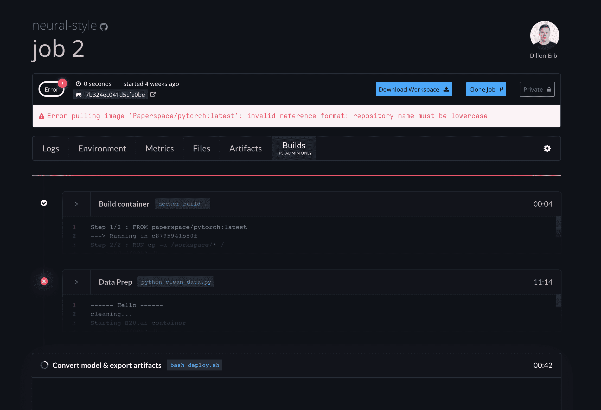
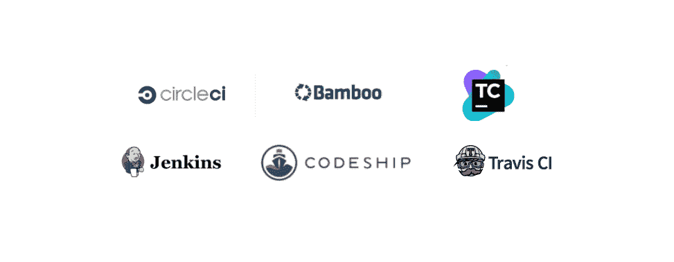
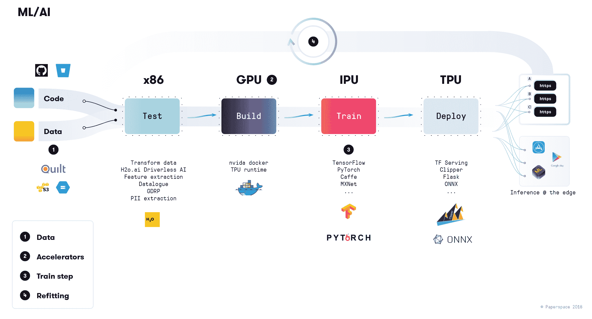

# 机器学习和人工智能的 CI/CD

> 原文：<https://blog.paperspace.com/ci-cd-for-machine-learning-ai/>

开发现代 web 应用程序的生态系统非常丰富。有数不清的工具可以将现代 web 应用交付到生产环境中，监控其性能，并进行实时部署。这些工具非常重要，没有它们，现代 web 应用程序开发几乎是不可能的。

相比之下，现代人工智能和人工智能还没有相同的生态系统。这是有道理的，原因有很多:最佳实践还没有出现(即，还没有 ML 的灯栈)，工具正在快速变化，现代深度学习在大计划中只存在了一眨眼的时间。

## 德沃普斯·➜·姆罗普斯

围绕 ML 工具和构建生产管道的问题是我们在 Paperspace 试图解决的关键问题之一。我们目前的大部分工作都被构建到 [Gradient](https://www.paperspace.com/gradient) 中——这是我们为 ML/AI 开发人员快速开发现代深度学习应用程序提供的工具。

我们认为普及和高效人工智能的最大障碍之一是基础设施和工具问题(假设这些智能系统的硬性要求是兼容性、确定性和可再现性)。

虽然容器编排工具(如 Kubernetes、Mesos 等)是现代 ML 的重要组成部分，但它们只是深度学习的真正 CI/CD 系统的一小部分。此外，传统的 CI/CD 和类似的 ML/AI 系统具有不同的参数、约束和目标。

我们花了很多时间思考这些系统，探索前景，并与学术界、初创公司和大型企业的开发人员合作，以确定跨越问题领域并可以通过现代机器学习平台解决的一般问题。

一般来说，这些管道看起来非常相似。他们接受数据，建立一个模型，然后将这个模型部署到全世界。然而，这些细节非常有趣，值得深入探究。

梯度是我们对机器学习和人工智能系统的现代 CI/CD 的理解。作为一个平台，它被设计成采用一组基本的构建模块(原语),这些模块可以组成更大更复杂的系统。

可再现的管道必须由确定性的和不可变的部分组成。这些包括 git 散列、docker 散列等。强大的散列是渐变核心的关键设计模式之一。作业运行，甚至机器硬件(主机、加速器等)都被分配了不可变的标签，这些标签被设计成有助于确定性和可再现过程的更大项目。

这篇文章不是关于梯度本身，而是关于这些类型的系统如何从根本上不同于开发人员工具箱中的现有工具的想法的集合。

## 数据管道的未来

在 Paperspace，我们都相信我们正处于机器智能的黄金时代，但也承认这个相对新兴的领域在许多方面仍在追赶。仅举一个例子，容器化(使用 Docker 或类似技术)推动了现代 web 基础设施的发展，这在 web 早期是不可想象的。相比之下，机器学习中的容器化仍然相对较新，大量的生产工作是在笔记本电脑、裸机服务器和手动配置的环境中完成的。

许多现代 ML 仍然是在功能强大的台式电脑上完成的(那种坐在你的桌下温暖你双脚的东西)。Lambda Labs 和 Boxx 等公司提供包括快速处理器和大型 GPU 的大型设备。我们认为这是当今存在的一种怪异(但可以理解)的反模式，因为并不真正存在一种负担得起的、强大的云计算选项。

拥有大量深度学习和人工智能专业知识的大公司一直在大力投资软件平台，帮助 ML 加快其余开发过程。让人工智能投入运营是许多公司的雄心，那些成功做到这一点的公司将拥有长期的竞争优势。

为了给出这些端到端的 ML 平台的几个例子，优步公开讨论了他们的版本米开朗基罗。脸书有 FBLearner，谷歌有 TFX，AirBnb 有 BigHead。认识到向更多公司开放这些类型的工具的力量，这些公司可能不像谷歌、FB 和优步那样拥有相同的内部专业知识，像 DataBricks 这样的公司已经引入了像 [MLFlow](https://databricks.com/mlflow) 这样的平台。

存在开源替代方案，如 Polyaxon 和 KubeFlow，但在大多数情况下，公司只能将不同的系统拼凑在一起，或者(更糟糕的是)尝试将旧工具重新用于这些现代数据流。

## 传统 CI/CD 工作流程

持续集成/持续部署(CI/CD)描述了一组应用程序开发管道的最佳实践。它们主要由 devops 团队实现，以使软件开发人员能够快速可靠地将更新引入生产应用程序。

现代 CI/CD 管道的一些核心优势包括:

*   可靠性
*   再现性
*   速度
*   安全
*   版本控制

对传统 web 应用程序的 CI/CD 工具的快速调查产生了许多您可能使用过或听说过的工具:

在其核心，这些工具试图形式化一个众所周知的工作流程:**构建** ➡ **测试** ➡ **部署**。例如，我们在 Paperspace 大量使用 Node.js 和 Golang，并投入巨资构建基础设施，使我们能够快速将新功能推向生产。

CI/CD 经常被混为一谈，但实际上它们描述了两个独立(但相关)的概念。持续集成(CI)主要关注的是在代码被推送时进行测试——也就是确保使用单元测试自动测试新的应用程序特性。相比之下，持续部署(CD)描述了测试代码的实际发布/交付。例如，一个 CD 系统可以描述不同的特性/发布分支是如何部署的，或者甚至新的特性是如何有选择地向新用户推出的(例如，在 20%的客户基础上测试特性 A)。

然而，重要的是，这两个概念在很大程度上一直没有出现在围绕现代机器学习和深度学习管道的对话中。

## ML/AI 的 CI/CD

看看一个用于机器学习的理想 CI/CD 系统，我们会立即看到许多关键差异。在 Paperspace，我们相信这些差异足以保证全新的工作流程、开发范例和工具。

### 1.数据

可以说，传统 web 应用程序和 ML 管道之间最重要的区别在于，系统的主要输入不仅仅是代码。相反，有两个(同等重要的)入站组件:代码和数据。

数据编排、清理、版本控制等是一个完整的领域，只是在最近的历史中才成为许多公司的一等公民。过去 10 年的“大数据”转变，以及数据科学家作为公司主要操作员的出现，说明了这一巨大转变。

不幸的是，对于真正的、版本化的、可复制的数据管道，我们仍处于非常早期的阶段。如今在大规模生产系统中广泛使用的强大的 ETL(提取、转换、加载)工具并不缺乏，如 Kafka、Spark、Cassandra、Hadoop 等。为了更好地理解这些数据，现代 ML 引入了额外的约束和更高的标准，毫不夸张地说，我们正处于[“再现性危机”](https://blog.paperspace.com/reproducible-data-with-pytorch-and-quilt/)，现代 ML 被(正确地)批评为难以理解的“黑箱”。

围绕数据治理/来源有许多大的(且未回答的)问题。如果无人驾驶汽车发生事故，监管机构理所当然地想知道数据(和模型)中的哪些假设导致了错误状况。数据可以以深度学习模型特别擅长提取的方式嵌入偏见，随着这一趋势的持续，无疑将会增加对数据如何收集、准备并最终作为输入提供给预测引擎的审查。

像 [Quilt](https://quiltdata.com/) 这样的工具正在引领一种前瞻性的数据版本化工具，但是它们还没有被广泛采用。一些替代方案包括 [dat](https://datproject.org/) 和 [gitLFS](https://git-lfs.github.com/) ，但是这个空间仍然是新的，相对来说还没有被探索过。同样值得一提的是团队正在做的工作，例如 [Pachyderm](http://www.pachyderm.io/) (我们是大粉丝)将数据视为 datascience/ML 工作流中的第一类原语。

### 2.催速剂

这几乎是显而易见的，不言而喻，但现代 webapps 是几乎所有东西都运行在传统 x86 架构(即常规 CPU)上这一事实的巨大受益者。对于某些应用程序来说，围绕 ARM 有一些真正有趣的工作，但在大多数情况下，硬件级别的这种同质性已经允许了一般的可移植性，这无疑是一般云发展的一个重要部分。

现代 ML/AI(尤其是深度学习)最近的进展很大程度上归功于它在 GPU 上工作得非常好。这与其说是历史上的异常，不如说是历史上的异常，但在过去的几年里，GPU 已经从其在图形处理中更为人所知的应用转变为一种通用的计算设备。

不太可能使用相同的设备来驱动视频游戏和深度学习应用程序，硬件供应商正在竞相开发可以加速深度学习训练和推理的定制硅。像 Graphcore(拥有“IPU”)、英特尔(拥有 Nervana 平台)和谷歌(拥有 TPU(张量处理单元)这样的公司都在竞相开发专为现代机器学习而构建的定制芯片。

这对现代的 ML/AI 工程师意味着什么？硬件环境正变得越来越复杂、异构和丰富。现代 ML 管道很可能会在数据摄取阶段使用 CPU，使用 NVIDIA GPU 来训练模型，并使用定制架构来部署到边缘(即安装在 iPhone 中的[神经引擎](https://www.wired.com/story/apples-neural-engine-infuses-the-iphone-with-ai-smarts/))。

### 3.训练步骤

ML 管道中的训练步骤是通常花费最多计算时间的区域。这是传统数据科学和现代深度学习之间的另一大区别。你可以在一台便宜的笔记本电脑上进行世界级的数据科学研究。仅仅开始真正的深度学习就需要投资昂贵的 GPU(理想情况下是多个)或复杂的云工具。

根据模型的复杂性、要处理的数据量(及其特定维度、特征等)以及所使用的加速器类型，训练任务可能需要几个小时到几周的时间。

分布式训练(涉及多个不同的计算节点)最近取得了很大的进展(优步的 Horovod、TensorFlow Distributed 和 PyTorch 内置的一套库等工具)，这增加了任务的复杂性。

### 4.改装/在线

因此，现在机器学习管道的*圣杯*-实时、在线、预测引擎，不仅向前部署，而且实际上不断更新。您可能听说过术语“改装”模型，这意味着新的数据进入模型，并且模型被更新以响应这些新的观察。

传统的 web 应用程序开发在很大程度上是“单向的”,即从代码->部署开始。通常有静态的“发布”,现代软件开发经常需要不同的“开发”、“准备”和“生产”环境。JenkinsX 等新技术支持为每个开发人员/分支进行不同的部署，但这并不能改变大多数部署过程从外部看起来非常静态的事实。当然，客户反馈、错误修复等会影响开发生命周期，但这通常是组织过程的责任(即“敏捷”开发方法)。

在不久的将来，我们预测每个公司都将采用某种形式的持续、实时深度学习引擎。也就是说，今天创建这样一个系统的障碍很多。即使是静态的 ML 管道也很难被拥有大量资源的复杂团队付诸实践。

然而，未来是光明的，因为这种自我更新、自我修改的系统越来越实用，我们可以开始讨论它们的可能性和局限性。除了近年来推出的基本机器学习算法和工具之外(并且正在由活跃的学术界不断推动)，自更新 ML 管道的基础设施解决方案可以说是真正普及的机器智能的核心组件。

自我更新深度学习引擎的想法带来了一系列问题。在基本层面上，当分类或预测引擎的输出模型开始以不期望的方式偏离输入时，我们如何检测、量化并最终校正所谓的模型漂移。也许更紧迫的是，这些系统的边界是什么，我们如何开始有意义地约束它们。下面的帖子特别有启发性。

> 简而言之，脸书可以同时测量我们的一切，并控制我们消费的信息。当你既能感知又能行动时，你就在看一个人工智能问题。你可以开始为人类行为建立一个优化循环。一个 RL 循环。
> 
> — François Chollet (@fchollet) [March 21, 2018](https://twitter.com/fchollet/status/976565723597176832?ref_src=twsrc%5Etfw)