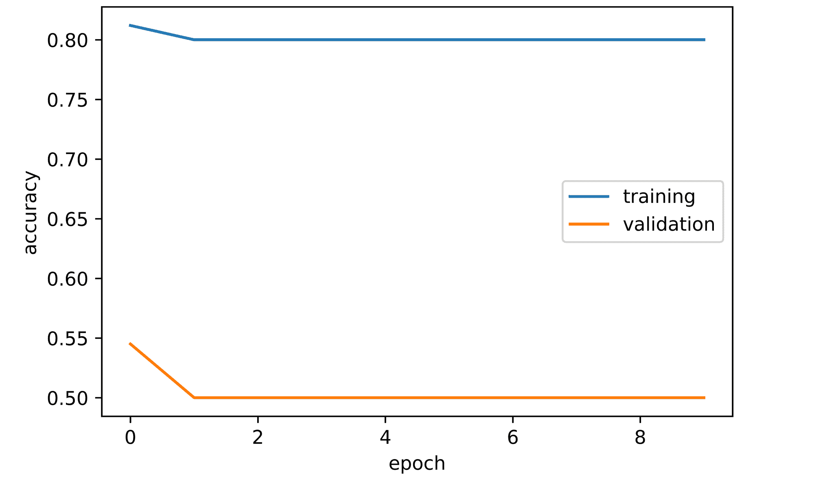
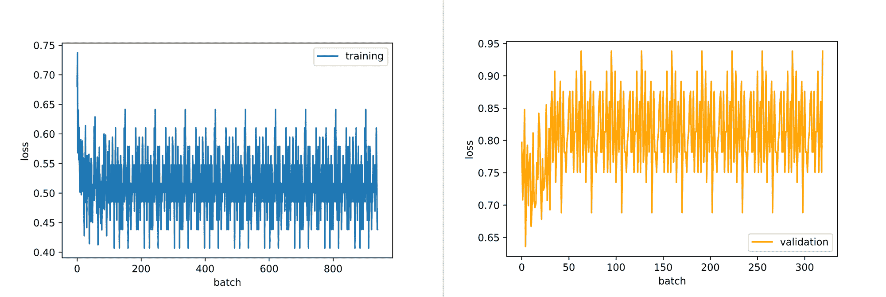
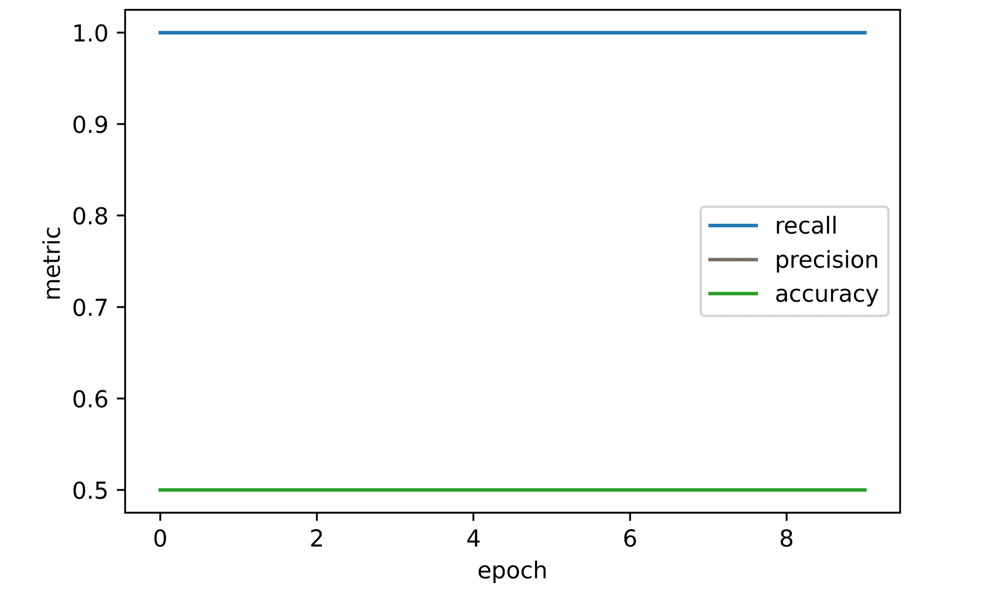
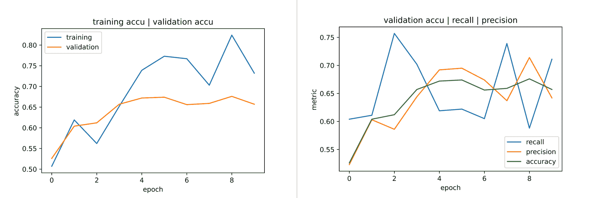
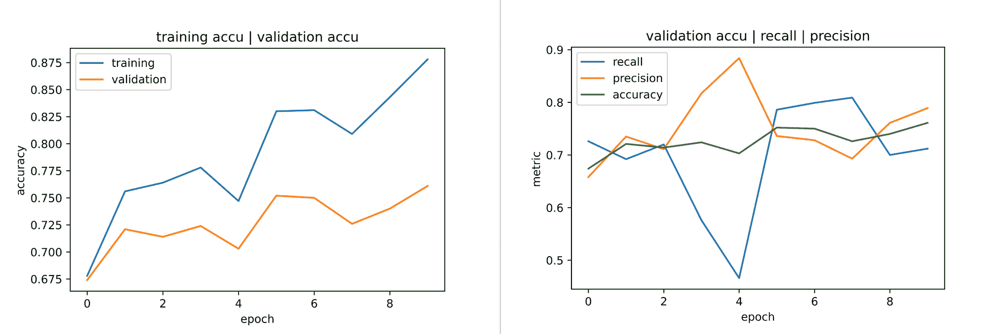

# 图像数据集中的类别不平衡及其对卷积神经网络的影响

> 原文：<https://blog.paperspace.com/class-imbalance-in-image-datasets/>

在深度学习中处理图像分类任务时，训练集中每个类别的图像数量往往不一样。这种场景被称为**类不平衡，是在为深度学习任务获取数据时发现的一个极其常见的问题。**

**在本文中，我们将研究类不平衡如何以及是否影响模型性能，以及它对评估指标选择的影响。**

### **为什么阶级不平衡？**

**在大多数情况下，数据集中的阶级不平衡通常是因为这是不可避免的。考虑这样一种情况，例如，人们想要管理一个音频数据集来检测汽车引擎中的机械故障。显然，将需要两个音频等级，一个用于处于完美工作状态的发动机，另一个用于处于缺陷状态的发动机。**

**不言而喻，与处于故障状态的发动机相比，处于完美工作状态的发动机将有更多的音频样本，并且收集的数据很可能也不会反映这种模式。这实质上建立了一种阶级不平衡，我们试图模拟的情况最终成为少数阶级。这种情况在垃圾邮件检测、欺诈交易检测等数据集中也很明显。**

### **模型目标**

**当为一个特定的任务建立模型时，经常会有一个清晰的目的/目标需要存档。因此，为了简单起见，让我们考虑一个二元分类任务，即只有两个类。二元分类任务可以被定义/描述为真/假任务，并且通常被标记为 1(真/正)或 0(假/负)。该任务的一种流行形式是用于癌症诊断的医学图像分类，其中建立模型以将图像(CT 扫描)分类为癌性(真/正/1)或非癌性(假/负/0)。**

**因为我们知道模型从来不是 100%准确的，所以在这种性能关键任务中，目标是建立一个假阴性分类率非常低的模型。换句话说，你想要一个将癌变图像归类为非癌变图像的几率非常低的模型。想想看，我们不会因为我们的模型不准确而将癌症患者送回家，那可能会危及生命。**

**这种模型总是将边缘图像分类为癌症阳性，这很可能产生许多假阳性分类。然而，在实际的医生在场的情况下，通过模型筛选所有的阳性分类，假阳性分类将最终被剔除。这代表了更安全和更有效的权衡。**

### **评估指标**

**在本节中，我们将了解分类任务中的一些评估指标，这将使我们更容易评估模型与手头目标的匹配程度。**

#### **准确(性)**

**准确性可能是最流行的分类指标，是正确分类的数据实例占分类实例总数的比例。它通常是一个指针，指示一个模型对其接受训练的数据实例的概括程度，但在大多数情况下，它并不能说明全部情况。它在 0-100 或 0-1(标准化)的范围内测量。**

****

#### **回忆**

**召回率也是以与准确度类似的尺度来衡量的，它是真的肯定分类与真的肯定和假的否定分类之和的比率。回忆并不关心模型与数据的吻合程度；相反，它更关心的是测量一个模型给出错误的否定分类的倾向。**

****

**回忆分数越接近 100，模型产生假阴性分类的可能性就越小。关于上一节中描述的目标是最小化假阴性的医学成像任务，需要寻找具有高召回率的模型。**

#### **精确**

**与前面提到的两个度量标准类似，精度是用 0-100 的标度来衡量的，它被定义为真阳性分类与真阳性和假阳性分类之和的比率。与回忆相反，精确度衡量的是模型给出错误肯定分类的倾向。模型的精度分数越接近 100，产生假阳性分类的可能性就越小。**

****

#### **F-1 分数**

**F-1 分数是测量精确度和召回率之间的平衡/折衷的度量。这是两个指标的调和平均值。我们可以在精确度-召回率的权衡对模型的成功不重要的情况下使用这个。例如，癌症诊断就不是这一指标的理想位置。**

****

### **设置**

```py
`#  article dependencies
import torch
import torch.nn as nn
import torch.nn.functional as F
import torchvision
import torchvision.transforms as transforms
import torchvision.datasets as Datasets
from torch.utils.data import Dataset, DataLoader
import numpy as np
import matplotlib.pyplot as plt
from tqdm.notebook import tqdm
from tqdm import tqdm as tqdm_regular
import seaborn as sns
from torchvision.utils import make_grid
import random`
```

```py
`#  setting up device
if torch.cuda.is_available():
  device = torch.device('cuda:0')
  print('Running on the GPU')
else:
  device = torch.device('cpu')
  print('Running on the CPU')`
```

**我们需要导入这些包来运行本教程。**

### **评估评估指标**

**为了理解这些评估指标，让我们使用一个真实的数据集。为此，我们将使用下面代码单元中加载的 CIFAR-10 数据集。**

```py
`#  loading training data
training_set = Datasets.CIFAR10(root='./', download=True,
                              transform=transforms.ToTensor())

#  loading validation data
validation_set = Datasets.CIFAR10(root='./', download=True, train=False,
                                transform=transforms.ToTensor())`
```

**为了设置一个二元分类任务，我们只需要提取这个数据集中包含的 10 个类中的两个。下面的代码单元包含一个提取猫和狗的图像的函数。然后在训练图像中产生有利于猫的 4:1 不平衡(80%猫，20%狗)。然而，在验证图像中不存在不平衡，因为存在相等数量的图像实例。**

```py
`def extract_images(dataset):
  cats = []
  dogs = []

  for idx in tqdm_regular(range(len(dataset))):
    if dataset.targets[idx]==3:
      cats.append((dataset.data[idx], 0))
    elif dataset.targets[idx]==5:
      dogs.append((dataset.data[idx], 1))
    else:
      pass
  return cats, dogs

#  extracting training images
cats, dogs = extract_images(training_set)
#  creating training data with a 80:20 imbalance in favour of cats
training_images = cats[:4800] + dogs[:1200]
random.shuffle(training_images)

#  extracting validation images
cats, dogs = extract_images(validation_set)
#  creating validation data
validation_images = cats + dogs
random.shuffle(validation_images)`
```

#### **建造探测器**

**本节设置了一个假设场景，需要我们稍微配合一下。想象一个只有猫和狗的社区。这里的目标是创建一个深度学习模型，它将在猫收容所的无人安全系统中工作。流浪猫可以走向这个安全系统并被允许进入收容所，而流浪狗则被拒绝进入并被送回。**

**我们可以将这个模型称为狗检测器，因此狗被标记为 1(阳性)，而猫被标记为 0(阴性)，如上面的代码单元所示。请记住，在我们的数据集中，有 4:1 的不平衡有利于猫。这里的模型目标是创建一个假阴性率低的模型，因为在猫舍养狗是一个坏主意。因此，我们希望最大化召回率。**

**首先，我们需要定义一个 PyTorch 数据集类，这样我们就可以从上面定义的对象中创建 PyTorch 数据集。**

```py
`#  defining dataset class
class CustomCatsvsDogs(Dataset):
  def __init__(self, data, transforms=None):
    self.data = data
    self.transforms = transforms

  def __len__(self):
    return len(self.data)

  def __getitem__(self, idx):
    image = self.data[idx][0]
    label = torch.tensor(self.data[idx][1])

    if self.transforms!=None:
      image = self.transforms(image)
    return(image, label)

#  creating pytorch datasets
training_data = CustomCatsvsDogs(training_images, transforms=transforms.Compose([transforms.ToTensor(),
                                                                                 transforms.Normalize((0.5, 0.5, 0.5), (0.5, 0.5, 0.5))]))
validation_data = CustomCatsvsDogs(validation_images, transforms=transforms.Compose([transforms.ToTensor(),
                                                                                     transforms.Normalize((0.5, 0.5, 0.5), (0.5, 0.5, 0.5))]))`
```

#### **训练模拟模型**

**准备好训练和验证集后，我们可以开始为我们的二元分类任务训练模型。如果准确性是唯一需要关注的指标，那么我们实际上根本不需要训练一个模型。我们需要做的只是简单地定义一个函数作为模拟模型，将训练集中的每个图像实例分类为 cat (0)。使用这个模拟模型，我们将在训练集上获得 80%的准确率，因为所有图像的 80%是猫图像。然而，当在验证集上使用这个模拟模型时，准确率下降到 50%，因为在验证集中只有 50%的图像是猫的。**

```py
`#  creating a mock model
def mock_model(image_instance, batch_mode=False):
  """
  This function serves as a mock model which classifies
  all images as 0\. If batch_mode=True supply a list of image-label
  pairs as parameter image_instance.
  """
  if not batch_mode:
    classification = 0
    label = image_instance[1].item()
    print(f'model classification = {classification}\ntrue label = {label}')

  else:
    #  extracting true labels
    labels = [x[1] for x in image_instance]
    labels = np.array(labels)

    #  classifying all instances as class 0
    classifications = [0]*(len(image_instance))
    classifications = np.array(classifications)

    #  computing accuracy
    accuracy = (sum(labels==classifications)/len(labels))
    print('model accuracy:')
    return round(accuracy, 3)

#  testing model in batch mode
mock_model(training_data, batch_mode=True)
>>>> model accuracy:
     0.8

#  testing model in batch mode
mock_model(validation_data, batch_mode=True)
>>>> model accuracy:
     0.5`
```

**因此，我们最终得到了一个在训练集上表现出色的模型，但在未经训练的数据(验证数据)上表现平平。在相同的情况下，尽管我们的模拟模型在训练集上有 80%的准确性，但它在训练集和验证集上的召回率和精确度都为零，因为没有真正的正分类。事实上，根本没有积极的分类(标签 1)。由于我们已经将模型目标定义为构建一个能够最大化召回率的模型，因此该模型不符合我们的模型目标。**

#### **训练卷积神经网络**

 **如果我们决定训练一个实际的深度学习模型呢？当然，它能够学习两类图像之间的显著特征，并最终具有辨别力？让我们通过构建一个自定义的`ConvNet`来做到这一点，如下面的代码单元格中所定义的。

```py
class ConvNet(nn.Module):
  def __init__(self):
    super().__init__()
    self.conv1 = nn.Conv2d(3, 8, 3, padding=1)
    self.batchnorm1 = nn.BatchNorm2d(8)
    self.conv2 = nn.Conv2d(8, 8, 3, padding=1)
    self.batchnorm2 = nn.BatchNorm2d(8)
    self.pool2 = nn.MaxPool2d(2)
    self.conv3 = nn.Conv2d(8, 32, 3, padding=1)
    self.batchnorm3 = nn.BatchNorm2d(32)
    self.conv4 = nn.Conv2d(32, 32, 3, padding=1)
    self.batchnorm4 = nn.BatchNorm2d(32)
    self.pool4 = nn.MaxPool2d(2)
    self.conv5 = nn.Conv2d(32, 128, 3, padding=1)
    self.batchnorm5 = nn.BatchNorm2d(128)
    self.conv6 = nn.Conv2d(128, 128, 3, padding=1)
    self.batchnorm6 = nn.BatchNorm2d(128)
    self.pool6 = nn.MaxPool2d(2)
    self.conv7 = nn.Conv2d(128, 2, 1)
    self.pool7 = nn.AvgPool2d(3)

  def forward(self, x):
    #-------------
    # INPUT
    #-------------
    x = x.view(-1, 3, 32, 32)

    #-------------
    # LAYER 1
    #-------------
    output_1 = self.conv1(x)
    output_1 = F.relu(output_1)
    output_1 = self.batchnorm1(output_1)

    #-------------
    # LAYER 2
    #-------------
    output_2 = self.conv2(output_1)
    output_2 = F.relu(output_2)
    output_2 = self.pool2(output_2)
    output_2 = self.batchnorm2(output_2)

    #-------------
    # LAYER 3
    #-------------
    output_3 = self.conv3(output_2)
    output_3 = F.relu(output_3)
    output_3 = self.batchnorm3(output_3)

    #-------------
    # LAYER 4
    #-------------
    output_4 = self.conv4(output_3)
    output_4 = F.relu(output_4)
    output_4 = self.pool4(output_4)
    output_4 = self.batchnorm4(output_4)

    #-------------
    # LAYER 5
    #-------------
    output_5 = self.conv5(output_4)
    output_5 = F.relu(output_5)
    output_5 = self.batchnorm5(output_5)

    #-------------
    # LAYER 6
    #-------------
    output_6 = self.conv6(output_5)
    output_6 = F.relu(output_6)
    output_6 = self.pool6(output_6)
    output_6 = self.batchnorm6(output_6)

    #--------------
    # OUTPUT LAYER
    #--------------
    output_7 = self.conv7(output_6)
    output_7 = self.pool7(output_7)
    output_7 = output_7.view(-1, 2)

    return F.softmax(output_7, dim=1)
```

现在，我们需要定义一个类，它将有助于在单个对象中整齐地包装训练和验证步骤。

```py
class ConvolutionalNeuralNet():
  def __init__(self, network):
    self.network = network.to(device)
    self.optimizer = torch.optim.Adam(self.network.parameters(), lr=1e-3)

  def train(self, loss_function, epochs, batch_size, 
            training_set, validation_set):

    #  creating log
    log_dict = {
        'training_loss_per_batch': [],
        'validation_loss_per_batch': [],
        'training_accuracy_per_epoch': [],
        'validation_accuracy_per_epoch': []
    } 

    #  defining weight initialization function
    def init_weights(module):
      if isinstance(module, nn.Conv2d):
        torch.nn.init.xavier_uniform_(module.weight)
        module.bias.data.fill_(0.01)
      elif isinstance(module, nn.Linear):
        torch.nn.init.xavier_uniform_(module.weight)
        module.bias.data.fill_(0.01)

    #  defining accuracy function
    def accuracy(network, dataloader):
      network.eval()
      total_correct = 0
      total_instances = 0
      for images, labels in tqdm(dataloader):
        images, labels = images.to(device), labels.to(device)
        predictions = torch.argmax(network(images), dim=1)
        correct_predictions = sum(predictions==labels).item()
        total_correct+=correct_predictions
        total_instances+=len(images)
      return round(total_correct/total_instances, 3)

    #  initializing network weights
    self.network.apply(init_weights)

    #  creating dataloaders
    train_loader = DataLoader(training_set, batch_size)
    val_loader = DataLoader(validation_set, batch_size)

    #  setting convnet to training mode
    self.network.train()

    for epoch in range(epochs):
      print(f'Epoch {epoch+1}/{epochs}')
      train_losses = []

      #  training
      print('training...')
      for images, labels in tqdm(train_loader):
        #  sending data to device
        images, labels = images.to(device), labels.to(device)
        #  resetting gradients
        self.optimizer.zero_grad()
        #  making predictions
        predictions = self.network(images)
        #  computing loss
        loss = loss_function(predictions, labels)
        log_dict['training_loss_per_batch'].append(loss.item())
        train_losses.append(loss.item())
        #  computing gradients
        loss.backward()
        #  updating weights
        self.optimizer.step()
      with torch.no_grad():
        print('deriving training accuracy...')
        #  computing training accuracy
        train_accuracy = accuracy(self.network, train_loader)
        log_dict['training_accuracy_per_epoch'].append(train_accuracy)

      #  validation
      print('validating...')
      val_losses = []

      #  setting convnet to evaluation mode
      self.network.eval()

      with torch.no_grad():
        for images, labels in tqdm(val_loader):
          #  sending data to device
          images, labels = images.to(device), labels.to(device)
          #  making predictions
          predictions = self.network(images)
          #  computing loss
          val_loss = loss_function(predictions, labels)
          log_dict['validation_loss_per_batch'].append(val_loss.item())
          val_losses.append(val_loss.item())
        #  computing accuracy
        print('deriving validation accuracy...')
        val_accuracy = accuracy(self.network, val_loader)
        log_dict['validation_accuracy_per_epoch'].append(val_accuracy)

      train_losses = np.array(train_losses).mean()
      val_losses = np.array(val_losses).mean()

      print(f'training_loss: {round(train_losses, 4)}  training_accuracy: '+
      f'{train_accuracy}  validation_loss: {round(val_losses, 4)} '+  
      f'validation_accuracy: {val_accuracy}\n')

    return log_dict

  def predict(self, x):
    return self.network(x)
```

设置好一切后，我们现在可以将上面定义的`ConvNet`实例化为上面定义的类的成员，然后使用其中定义的参数训练`ConvNet`10 个时期。

```py
#  training model
model = ConvolutionalNeuralNet(ConvNet())

log_dict = model.train(nn.CrossEntropyLoss(), epochs=10, batch_size=64, 
                       training_set=training_data, validation_set=validation_data)
```

从下面的结果来看，通过建立自己的模拟模型，卷积神经网络将做完全相同的事情，该模型将每个图像实例分类为 cat (0 ),因此训练精度为 80%,验证精度为 50%。正如我们在逻辑上寻找最容易的方法来最大限度地提高训练集的准确性/性能一样，深度学习/机器学习模型的优化过程具有完全相同的动机，因为它们倾向于遵循阻力最小的路径，在这种情况下预测所有图像为猫。



### 等级不平衡对模型目标的影响程度。

从上一节可以明显看出，阶级不平衡对于模型目标是否实现有着绝对巨大的影响。这可能会诱使人产生一种虚假的安全感，因为它可能会产生很高的训练准确性，这在我们的情况下是显而易见的，在我们的情况下，我们有 4:1 的不平衡。基于这一前提，当涉及到分类任务中的模型目标时，准确性并不总是能说明全部情况。

### 处理阶级不平衡

有许多方法可以处理图像数据集或任何数据集中的类别不平衡。在本节中，我们将了解其中的 3 种。

#### 向下采样

下采样是指减少多数类中的实例数量以匹配少数类中的实例数量的过程。例如，在我们的训练数据中，我们有 4800 幅猫的图像和 1200 幅狗的图像。如果我们决定通过下采样来处理类不平衡，我们也需要将猫图像的数量减少到 1，200，这样我们在两个类之间有相等的分割。

这种方法可以显著减小数据集的大小，这在大多数情况下可能是不可取的。在我们的例子中，如果我们进行下采样，我们将从总共 6000 幅图像增加到 2400 幅图像。

#### 上采样

上采样是指将少数类中的实例数量提高到与多数类中的实例数量相匹配的过程。这可以通过为少数类收集更多的数据实例来完成，或者当这不可能时，我们可以通过创建它们的修改版本来扩充现有的数据实例。

在我们的例子中，我们还需要将狗图像的数量增加到 4，800，这将使数据集的大小从最初的 6，000 个实例增加到 9，600 个实例。由于这个原因，上采样通常比下采样更受青睐，因为它具有增加数据集大小的理想效果，并且在某些情况下，它会引入在训练模型中建立冗余的变化。

#### 利用类权重

当训练用于分类的模型时，该模型隐含地对所有类赋予相同的重要性/权重，并且在分类损失方面以相同的方式对待它们。然而，我们可以通过明确指定每个类对我们有多重要来明确地赋予一个类相对于另一个类更大的重要性。

我们指定的重要性被称为**类权重，它可以在类不平衡的情况下对我们有利。我们可以将更多的重要性放在少数类上，从而迫使模型学习一种映射，该映射在一定程度上优先识别该特定类。这将是我们下一节的重点。**

### **通过类别权重处理类别不平衡**

**在本节中，我们将尝试使用类权重来调整我们的模型的行为，以便它尽可能地符合我们的模型目标，即最大化召回率，即使我们有一个不平衡的数据集。为了监控我们的模型目标，我们需要修改前面一节中定义的卷积神经网络类，以便不仅计算准确性，还计算召回率和精确度。**

```py
`class ConvolutionalNeuralNet_2():
  def __init__(self, network):
    self.network = network.to(device)
    self.optimizer = torch.optim.Adam(self.network.parameters(), lr=1e-3)

  def train(self, loss_function, epochs, batch_size, 
            training_set, validation_set):

    #  creating log
    log_dict = {
        'training_loss_per_batch': [],
        'validation_loss_per_batch': [],
        'training_accuracy_per_epoch': [],
        'training_recall_per_epoch': [],
        'training_precision_per_epoch': [],
        'validation_accuracy_per_epoch': [],
        'validation_recall_per_epoch': [],
        'validation_precision_per_epoch': []
    } 

    #  defining weight initialization function
    def init_weights(module):
      if isinstance(module, nn.Conv2d):
        torch.nn.init.xavier_uniform_(module.weight)
        module.bias.data.fill_(0.01)
      elif isinstance(module, nn.Linear):
        torch.nn.init.xavier_uniform_(module.weight)
        module.bias.data.fill_(0.01)

    #  defining accuracy function
    def accuracy(network, dataloader):
      network.eval()

      all_predictions = []
      all_labels = []

      #  computing accuracy
      total_correct = 0
      total_instances = 0
      for images, labels in tqdm(dataloader):
        images, labels = images.to(device), labels.to(device)
        all_labels.extend(labels)
        predictions = torch.argmax(network(images), dim=1)
        all_predictions.extend(predictions)
        correct_predictions = sum(predictions==labels).item()
        total_correct+=correct_predictions
        total_instances+=len(images)
      accuracy = round(total_correct/total_instances, 3)

      #  computing recall and precision
      true_positives = 0
      false_negatives = 0
      false_positives = 0
      for idx in range(len(all_predictions)):
        if all_predictions[idx].item()==1 and  all_labels[idx].item()==1:
          true_positives+=1
        elif all_predictions[idx].item()==0 and all_labels[idx].item()==1:
          false_negatives+=1
        elif all_predictions[idx].item()==1 and all_labels[idx].item()==0:
          false_positives+=1
      try:
        recall = round(true_positives/(true_positives + false_negatives), 3)
      except ZeroDivisionError:
        recall = 0.0
      try:
        precision = round(true_positives/(true_positives + false_positives), 3)
      except ZeroDivisionError:
        precision = 0.0
      return accuracy, recall, precision

    #  initializing network weights
    self.network.apply(init_weights)

    #  creating dataloaders
    train_loader = DataLoader(training_set, batch_size)
    val_loader = DataLoader(validation_set, batch_size)

    #  setting convnet to training mode
    self.network.train()

    for epoch in range(epochs):
      print(f'Epoch {epoch+1}/{epochs}')
      train_losses = []

      #  training
      print('training...')
      for images, labels in tqdm(train_loader):
        #  sending data to device
        images, labels = images.to(device), labels.to(device)
        #  resetting gradients
        self.optimizer.zero_grad()
        #  making predictions
        predictions = self.network(images)
        #  computing loss
        loss = loss_function(predictions, labels)
        log_dict['training_loss_per_batch'].append(loss.item())
        train_losses.append(loss.item())
        #  computing gradients
        loss.backward()
        #  updating weights
        self.optimizer.step()
      with torch.no_grad():
        print('deriving training accuracy...')
        #  computing training accuracy
        train_accuracy, train_recall, train_precision = accuracy(self.network, train_loader)
        log_dict['training_accuracy_per_epoch'].append(train_accuracy)
        log_dict['training_recall_per_epoch'].append(train_recall)
        log_dict['training_precision_per_epoch'].append(train_precision)

      #  validation
      print('validating...')
      val_losses = []

      #  setting convnet to evaluation mode
      self.network.eval()

      with torch.no_grad():
        for images, labels in tqdm(val_loader):
          #  sending data to device
          images, labels = images.to(device), labels.to(device)
          #  making predictions
          predictions = self.network(images)
          #  computing loss
          val_loss = loss_function(predictions, labels)
          log_dict['validation_loss_per_batch'].append(val_loss.item())
          val_losses.append(val_loss.item())
        #  computing accuracy
        print('deriving validation accuracy...')
        val_accuracy, val_recall, val_precision = accuracy(self.network, val_loader)
        log_dict['validation_accuracy_per_epoch'].append(val_accuracy)
        log_dict['validation_recall_per_epoch'].append(val_recall)
        log_dict['validation_precision_per_epoch'].append(val_precision)

      train_losses = np.array(train_losses).mean()
      val_losses = np.array(val_losses).mean()

      print(f'training_loss: {round(train_losses, 4)}  training_accuracy: '+
      f'{train_accuracy}  training_recall: {train_recall}  training_precision: {train_precision} *~* validation_loss: {round(val_losses, 4)} '+  
      f'validation_accuracy: {val_accuracy}  validation_recall: {val_recall}  validation_precision: {val_precision}\n')

    return log_dict

  def predict(self, x):
    return self.network(x)`
```

**A modified version of the class defined previously.**

**类别权重进入我们决定用于模型训练的损失函数。在这种情况下，我们决定使用交叉熵损失函数，因此，类别权重将被定义为损失函数的参数，例如`nn.CrossEntropyLoss(weight=torch.tensor((0.1, 0.9)))`。权重的形式为(类 0 的权重，类 1 的权重)，它们的总和必须为 1.0。**

#### **另一个极端。**

**例如，以下面的代码块为例，类 0 的权重为 0，类 1 的权重为 1.0。这意味着我们指示模型不重视类 0，因此我们期望它只学习到类 1 的映射。因此，该模型应该具有 20%的准确度，因为它将仅预测少数类，并且具有 100%的召回率，因为将不存在假阴性分类。但是对于 50%的验证准确性，它对于我们的目标仍然表现不佳。**

```py
`#  training model
model = ConvolutionalNeuralNet_2(ConvNet())

weight = torch.tensor((0, 1.0))

log_dict = model.train(nn.CrossEntropyLoss(weight=weight), epochs=10, batch_size=64, 
                       training_set=training_data, validation_set=validation_data)`
```

**

A plot of validation metrics. Both validation accuracy and precision remained at 50%.** 

#### **更平衡的方法**

**就这样，我们从一个只将所有图像分类为猫的模型，发展到一个只将所有图像分类为狗的模型，只需要指定我们希望对每个类别赋予的重要性。按照同样的逻辑，我们现在知道，如果正类(1)仍然被给予更高的优先级，那么最好的模型位于两者之间。让我们试试不同的重量组合。**

```py
`#  training model
model = ConvolutionalNeuralNet_2(ConvNet())

weight = torch.tensor((0.15, 0.85))

log_dict = model.train(nn.CrossEntropyLoss(weight=weight), epochs=10, batch_size=64, 
                       training_set=training_data, validation_set=validation_data)`
```

****

**从上面的图中可以明显看出，这种权重组合产生了一个更加平衡的模型。到第 10 个时期，观察到的验证准确度刚刚超过 65%,这意味着该模型不仅将所有图像分类为正面或负面，它现在实际上是有区别的。此外，在验证准确率为 65%的情况下，还观察到了大约 70%的召回率，这是目前为止我们观察到的最符合模型目标的度量组合。**

#### **细节存在于迭代中**

**就像机器学习中涉及超参数调整的任何事情一样，找到类权重的完美组合是一个需要大量迭代的复杂过程。当这样做时，就可以找到类权重的最佳组合。**

**但是请注意，使用类权重并不是解决所有类不平衡问题的灵丹妙药。即使我们有了它们的最佳组合，使用它们也可能得不到与模型目标相关的预期结果。这将需要使用一些其他的类不平衡处理方法。**

#### **它超越了阶级不平衡**

**有时，即使没有类别不平衡，默认情况下分类模型可能仍然不符合模型目标。为了说明这一点，我在猫和狗的平衡数据集(每个类中有 5000 个实例)上训练了我们的 convnet，并收集了如下所示的指标。**

****

**考虑第 5 个纪元，即使验证准确率超过 70%，验证召回率突然下降到 50%以下，这对于我们的模型目标来说是一个很大的危险信号，因为我们正在尝试最大化召回率。即使到了第 10 个纪元，该模型给出的假阳性分类也比假阴性多(它将更多的猫误认为狗的次数比它将狗误认为猫的次数多)，这对于我们的模型目标来说仍然不令人印象深刻。在这种情况下，调整类权重将有助于尽可能多地挤出验证召回，即使数据集是平衡的。**

### **最后的想法**

**在本文中，我们探讨了图像数据集中类别不平衡的概念。我们看了一下这个概念本身的定义，以及它为什么会在某些情况下出现。我们还探索了为分类任务定义明确目标的过程，着眼于更多的评估指标而不是准确性如何更好地为我们实现目标服务。最后，我们研究了如何解决阶级失衡，同时密切关注阶级权重。****