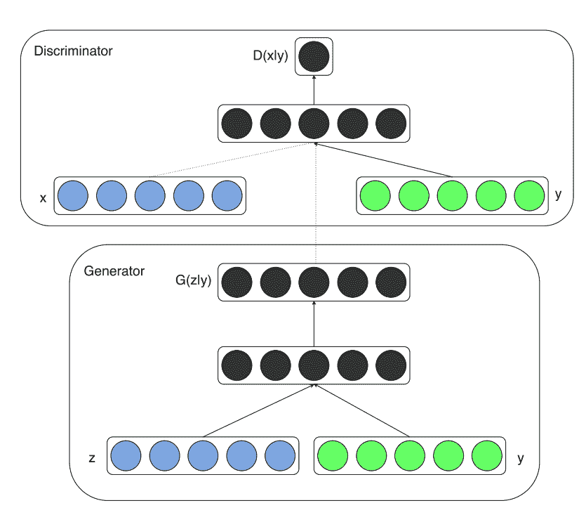
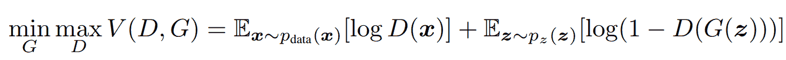
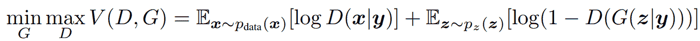
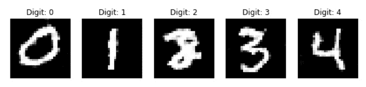
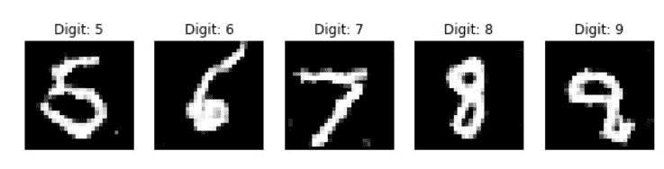
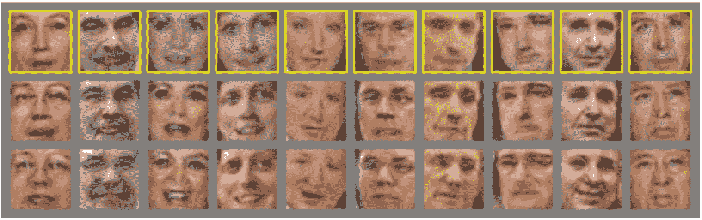

# 实现条件生成对抗网络

> 原文：<https://blog.paperspace.com/conditional-generative-adversarial-networks/>


Photo by [Avel Chuklanov](https://unsplash.com/@chuklanov?utm_source=ghost&utm_medium=referral&utm_campaign=api-credit) / [Unsplash](https://unsplash.com/?utm_source=ghost&utm_medium=referral&utm_campaign=api-credit)

生成对抗网络是现代深度学习中最有用的概念之一。它们有广泛的应用，包括用户可以对将要生成的数据类型有更多的控制。虽然简单的生成网络完全能够处理不同类型的问题并实现必要的解决方案，但是这些生成网络有许多变体来完成更具体的任务，以便实现可能的最佳结果。我们将在本文中探索的一个类似的生成网络架构是条件生成对抗网络(CGANs)的概念。

在我们之前的博客中，我们已经讨论了许多类型的生成敌对网络(GAN)，如 [DCGAN](https://blog.paperspace.com/face-generation-with-dcgans/) 、 [WGAN](https://blog.paperspace.com/wgans/) 、 [SRGAN](https://blog.paperspace.com/super-resolution-generative-adversarial-networks/) 等等。在本文中，我们将重点关注条件性 GANs，它允许我们对生成的数据类型进行更多的控制。

我们将首先看一下这个概念的简要介绍，并进而理解对条件句的直观理解。我们将用 CGAN 架构构建一个项目，最后，看看这些生成网络的一些应用。我建议使用 Paperspace Gradient 平台来运行这个程序和其他类似的代码，以实现高端结果。

# 简介:

当运行简单的生成对抗网络(GAN)时，经过训练的生成器网络可以生成其被开发来创建的各种图像。没有一种方法可以完全控制我们旨在通过这些简单网络生成的数据类型，如果您在较大的数据集上训练数据，但需要生成您正在寻找的特定类型的数据(或图像),有时可能需要这种方法。GANs 的一个变体是条件生成对抗网络(cgan ),它使您可以指定想要生成的数据或图像的确切类型成为可能。

在进入下一节之前，我强烈建议从第篇文章之后的[开始熟悉生成性对抗网络。我已经在提到的博客中介绍了 GANs 的大部分基本概念。由于 CGAN 是简单 GAN 架构的变体，因此对 GAN 架构有所了解和理解是非常有益的。类别或标签是鉴别器和生成器网络的必要补充，将使我们能够训练模型以有条件地训练。简单 GAN 架构中的一个微小变化导致了新的 CGAN 架构，它允许我们为我们想要的类或标签生成精确的输出。让我们在接下来的章节中进一步探讨这些概念。](https://blog.paperspace.com/complete-guide-to-gans/)

* * *

# 理解有条件的 GANs:



[Image Source](https://arxiv.org/pdf/1411.1784.pdf)

在我们之前的工作中，我们探索了我们无法控制产出类型的 gan。与大多数生成式网络架构不同，CGANs 在训练方法上并非完全不受监督。这些 CGAN 网络架构需要某种类别标签或带标签的数据来执行期望的动作。让我们用一些数学公式来理解简单 GAN 架构和 CGAN 架构的区别。首先，让我们探索 GAN 结构的数学表达式，如下所示。



公式表达式表示最小-最大类型的算法，其中我们试图减少(或最小化)鉴别器和发生器网络中的变化，同时同时训练发生器和鉴别器模型。我们的目标是实现一种能够产生高质量输出的发生器，它可以绕过高效的鉴频器网络。然而，我们无法控制这种架构中生成的输出类型。现在让我们来看看 CGAN 数学表达式，它可以让我们获得想要的结果。



通过对我们之前简单 GAN 架构公式的微小修改，我们现在为鉴频器和发生器网络添加了 y 标签。通过将先前的概率转换为添加了“y”标签的条件概率，我们可以确保训练生成器和鉴别器网络现在仅针对相应的标签进行训练。因此，一旦训练过程完成，我们可以发送特定的输入标签并从生成网络接收期望的输出。

在训练过程中，发生器和鉴别器网络都将被分配这些标签。因此，CGAN 架构的这两个网络都被有条件地训练，使得生成器仅生成类似于预期标签输出的输出，而鉴别器模型确保检查所生成的输出是真的还是假的，同时检查图像是否匹配特定标签。现在我们已经对条件 GAN 有了一个简单直观的理解，我们可以继续构建 CGAN 架构来解决 MNIST 项目。

* * *

# 构建 CGAN 架构:

在本文的这一部分中，我们将重点讨论使用生成器和鉴别器结构来构建条件 GAN 架构。对于 MNIST 任务，我们将从 0 到 9 的每个数字指定为条件 gan 的相应标签。一旦分配了标签，有条件的 GAN 将为分配的数字产生适当的图像。这种生成不同于由简单 GAN 网络生成的图像，在简单 GAN 网络中会生成没有固定条件的随机图像。我们将利用 TensorFlow 和 Keras 深度学习框架来构建 CGAN 架构网络。

在继续本节的其余部分之前，我建议查看下面的[文章](https://blog.paperspace.com/absolute-guide-to-tensorflow/)，从[这里](https://blog.paperspace.com/the-absolute-guide-to-keras/)了解更多关于 TensorFlow 和 Keras 的文章。

现在让我们开始库导入。

## 导入所需的库:

```py
from tensorflow.keras.layers import UpSampling2D, Reshape, Activation, Conv2D, BatchNormalization, LeakyReLU, Input, Flatten, multiply
from tensorflow.keras.layers import Dense, Embedding
from tensorflow.keras.layers import Dropout, Concatenate
from tensorflow.keras.models import Sequential, Model
from tensorflow.keras.datasets import mnist

import matplotlib.pyplot as plt
import numpy as np
import warnings 

warnings.filterwarnings('ignore')
from tensorflow.python.client import device_lib
print(device_lib.list_local_devices())
```

首先，让我们导入构建条件 GAN (CGAN)架构所需的所有基本库和模块。大多数层将用于构建 CGAN 模型网络。如果你了解过我之前的 GAN 文章，这些网络应该是相当熟悉的。大多数 CGAN 架构将遵循基本的 GAN 结构，并添加标签来训练模型。为了将标签转换成矢量格式，我们将使用嵌入层。所有层都将从 TensorFlow 和 Keras 深度学习框架中加载。下面是所有必要导入的代码片段。

## 分配基本要求:

```py
(X_train,y_train),(X_test,y_test) = mnist.load_data()

img_width, img_height =28,28
img_channel = 1
img_shape = (img_width, img_height, img_channel)
num_classes = 10
z_dim = 100

X_train.shape
```

输出:

```py
(60000, 28, 28) 
```

因为我们将在这个项目中使用 MNIST 数据集，所以让我们将数据加载到训练和测试样本中。我们将声明所需的参数，如图像高度、图像宽度和通道数量。MNIST 数据集中的每个图像的大小都是 28 x 28，并且是具有一个通道的灰度图像。我们一共十个类，这些类将作为我们 CGAN 模型学习的标签。定义了默认的 z 维空间 100。以下代码片段如下所示。

## 构建发电机架构:

```py
def build_generator():
    model = Sequential()
    model.add(Dense(128*7*7, activation = 'relu', input_shape = (z_dim, )))
    model.add(Reshape((7,7,128)))
    model.add(UpSampling2D())
    model.add(Conv2D(128, kernel_size = 3, strides = 2, padding = 'same'))
    model.add(BatchNormalization())
    model.add(LeakyReLU(alpha = 0.02))
    model.add(UpSampling2D())
    model.add(Conv2D(64, kernel_size = 3, strides = 1, padding = 'same'))
    model.add(BatchNormalization())
    model.add(LeakyReLU(alpha = 0.02))
    model.add(UpSampling2D())
    model.add(Conv2D(1, kernel_size = 3 , strides = 1, padding='same'))
    model.add(Activation('tanh'))

    z = Input(shape= (z_dim,))
    label = Input(shape=(1,), dtype = 'int32')

    label_embedding = Embedding(num_classes, z_dim, input_length = 1)(label)
    label_embedding = Flatten()(label_embedding)
    joined = multiply([z, label_embedding])

    img = model(joined)
    return Model([z, label], img)

generator = build_generator()
generator.summary()
```

输出:

```py
Model: "model"
__________________________________________________________________________________________________
Layer (type)                    Output Shape         Param #     Connected to                     
==================================================================================================
input_2 (InputLayer)            [(None, 1)]          0                                            
__________________________________________________________________________________________________
embedding (Embedding)           (None, 1, 100)       1000        input_2[0][0]                    
__________________________________________________________________________________________________
input_1 (InputLayer)            [(None, 100)]        0                                            
__________________________________________________________________________________________________
flatten (Flatten)               (None, 100)          0           embedding[0][0]                  
__________________________________________________________________________________________________
multiply (Multiply)             (None, 100)          0           input_1[0][0]                    
                                                                 flatten[0][0]                    
__________________________________________________________________________________________________
sequential (Sequential)         (None, 28, 28, 1)    856193      multiply[0][0]                   
==================================================================================================
Total params: 857,193
Trainable params: 856,809
Non-trainable params: 384
__________________________________________________________________________________________________ 
```

为了构建发生器和鉴别器架构，我们将遵循与简单 GAN 架构相似的方案。我们将首先使用顺序模型原型，并开始构建我们的模型层。我们将使用 128 个矩阵，每个矩阵的维数为 7×7。然后，我们将开始使用上采样层，然后是卷积层。还利用了批量标准化层，以及阿尔法值为 0.02 的泄漏 ReLU 层。我们将继续使用这些构建模块，直到我们获得与 MNIST 数据相似的最终所需形状。最后，我们将以 tanh 激活函数结束，函数的这一部分包含将由带有随机分配噪声的发生器生成的图像。

在这个函数的后半部分，我们将添加一个嵌入来为必须相应分配的标签(或类)创建向量映射。MNIST 数据的十位数字中的每一位都必须被视为独立且唯一的标签，并且模型必须相应地生成它们中的每一位。我们可以创建这些标签嵌入，并继续将这些信息与我们之前的生成器模型相结合。一旦合并，我们将返回整体模型并将其存储在生成器变量中。

## 构建鉴别器架构:

```py
def build_discriminator():
    model = Sequential()
    model.add(Conv2D(32, kernel_size = 3, strides = 2, input_shape = (28,28,2), padding = 'same'))
    model.add(BatchNormalization())
    model.add(LeakyReLU(alpha = 0.02))
    model.add(Conv2D(64, kernel_size = 3, strides = 2, padding = 'same'))
    model.add(BatchNormalization())
    model.add(LeakyReLU(alpha = 0.02))
    model.add(Conv2D(128, kernel_size = 3, strides = 2, padding = 'same'))
    model.add(BatchNormalization())
    model.add(LeakyReLU(alpha = 0.02))
    model.add(Dropout(0.25))
    model.add(Flatten())
    model.add(Dense(1, activation = 'sigmoid'))

    img = Input(shape= (img_shape))
    label = Input(shape= (1,), dtype = 'int32')

    label_embedding = Embedding(input_dim = num_classes, output_dim = np.prod(img_shape), input_length = 1)(label)
    label_embedding = Flatten()(label_embedding)
    label_embedding = Reshape(img_shape)(label_embedding)

    concat = Concatenate(axis = -1)([img, label_embedding])
    prediction = model(concat)
    return Model([img, label], prediction)

discriminator = build_discriminator()
discriminator.summary()
```

输出:

```py
Model: "model_1"
__________________________________________________________________________________________________
Layer (type)                    Output Shape         Param #     Connected to                     
==================================================================================================
input_4 (InputLayer)            [(None, 1)]          0                                            
__________________________________________________________________________________________________
embedding_1 (Embedding)         (None, 1, 784)       7840        input_4[0][0]                    
__________________________________________________________________________________________________
flatten_2 (Flatten)             (None, 784)          0           embedding_1[0][0]                
__________________________________________________________________________________________________
input_3 (InputLayer)            [(None, 28, 28, 1)]  0                                            
__________________________________________________________________________________________________
reshape_1 (Reshape)             (None, 28, 28, 1)    0           flatten_2[0][0]                  
__________________________________________________________________________________________________
concatenate (Concatenate)       (None, 28, 28, 2)    0           input_3[0][0]                    
                                                                 reshape_1[0][0]                  
__________________________________________________________________________________________________
sequential_1 (Sequential)       (None, 1)            95905       concatenate[0][0]                
==================================================================================================
Total params: 103,745
Trainable params: 103,297
Non-trainable params: 448
__________________________________________________________________________________________________ 
```

一旦我们完成了生成器网络的构建，我们就可以继续构建鉴别器架构，它将充当分类器。首先，让我们构建分类器网络，它利用步长为 2 的卷积层来不断调整网络的大小。利用批量标准化层以及漏失来避免网络的过拟合。我们还利用了泄漏 ReLU 激活函数。

最后，具有 sigmoid 激活函数的密集层会将输出分类为真或假。鉴频器网络使用类似的逻辑。标签通过鉴别器网络传递，我们需要确保这些嵌入对生成器和鉴别器架构都可用。

# 计算结果:

现在我们已经完成了 CGAN 模型的生成器和鉴别器架构的构建，我们终于可以开始训练过程了。我们将这一部分分为三个不同的部分，即模型的编译、训练和拟合模型，以及最后在训练过程完成后保存和显示所获得的结果。让我们从每一部分开始。

## 编译模型:

```py
from tensorflow.keras.optimizers import Adam

discriminator.compile(loss = 'binary_crossentropy', optimizer = Adam(0.001, 0.5), metrics = ['accuracy'])

z = Input(shape=(z_dim,))
label = Input(shape= (1,))
img = generator([z,label])

# discriminator.trainable = False
prediction = discriminator([img, label])

cgan = Model([z, label], prediction)
cgan.compile(loss= 'binary_crossentropy', optimizer = Adam(0.001, 0.5))
```

对于 CGAN 模型的编译，我们将使用二进制交叉熵损失函数、Adam 优化器、默认学习率 0.001 和β1 值 0.5。我们还将设置鉴别器来测量每个时期结束时的精度。然后，我们将分配默认的参数来通过生成器模型，这些参数是 z 维空间和标签。然后，我们将介绍条件 GAN 网络的发生器和鉴别器架构，并最终编译该模型。

## 定义发生器和鉴别器训练:

```py
def train(epochs, batch_size, save_interval):
    (X_train, y_train), (_, _) = mnist.load_data()

    X_train = (X_train - 127.5) / 127.5
    X_train = np.expand_dims(X_train, axis=3)

    real = np.ones(shape=(batch_size, 1))
    fake = np.zeros(shape=(batch_size, 1))

    for iteration in range(epochs):

        idx = np.random.randint(0, X_train.shape[0], batch_size)
        imgs, labels = X_train[idx], y_train[idx]

        z = np.random.normal(0, 1, size=(batch_size, z_dim))
        gen_imgs = generator.predict([z, labels])

        d_loss_real = discriminator.train_on_batch([imgs, labels], real)
        d_loss_fake = discriminator.train_on_batch([gen_imgs, labels], fake)
        d_loss = 0.5 * np.add(d_loss_real, d_loss_fake)

        z = np.random.normal(0, 1, size=(batch_size, z_dim))
        labels = np.random.randint(0, num_classes, batch_size).reshape(-1, 1)

        g_loss = cgan.train_on_batch([z, labels], real)

        if iteration % save_interval == 0:
            print('{} [D loss: {}, accuracy: {:.2f}] [G loss: {}]'.format(iteration, d_loss[0], 100 * d_loss[1], g_loss))
            save_image(iteration) 
```

一旦模型编译完成，我们就可以开始定义生成器和鉴别器训练机制。我们定义的训练函数将接受设定的时期数、设定的批量大小和输入的保存生成图像的时间间隔的输入值。

在训练方法中，我们会传递随机数和值来接收假图像。鉴别器和生成器网络将被同时训练，如上面的代码所示。

## 保存和计算 CGAN 体系结构的训练；

确保您创建了一个图像目录，其中可以存储由 CGAN 架构生成的所有图像。你可以在 Gradient GUI 中通过在你的工作目录中创建一个新的文件夹来手动完成，或者使用下面提供的代码片段。

```py
import os

os.mkdir("images/")
```

最后，让我们定义这个项目需要的最后一个功能。我们将创建一个函数来保存指定位置和指定间隔结束时的图像。matplotlib 库也用于绘制图像并将它们保存在图像目录中。下面是执行以下操作的代码块。

```py
def save_image(epoch):
    r, c = 2,5
    z = np.random.normal(0,1,(r*c, z_dim))
    labels = np.arange(0,10).reshape(-1,1)
    gen_image = generator.predict([z,labels])
    gen_image = 0.5 * gen_image + 0.5

    fig, axes = plt.subplots(r,c, figsize = (10,10))
    count = 0
    for i in range(r):
        for j in range(c):
            axes[i,j].imshow(gen_image[count,:,:,0],cmap = 'gray')
            axes[i,j].axis('off')
            axes[i,j].set_title("Digit: %d" % labels[count])
            count+=1
    plt.savefig('images/cgan_%d.jpg' % epoch)
    plt.close()
```

我们将以 128 的批量训练该模型大约 5000 个时期，并且在每 1000 个时期的训练之后保存一次图像。下面是对 5000 个时期执行以下操作的代码片段，它将 5 个图像保存到目录中。

```py
# training the network
train(5000, 128, 1000)
```



在训练过程中，您应该能够注意到，在 1000 个间隔中的每一个，我们都在保存一个图像，并且 CGAN 模型学习如何为给定标签生成特定图像的过程逐渐增加。我建议从提到的链接中查看下面这个 CGAN 项目的 [GitHub](https://github.com/developershutt/CGAN/blob/master/Conditional%20GAN.ipynb) 参考资料。除了 MNIST 项目，CGANs 还有许多应用。我们将在下一节中详细介绍这些内容。

* * *

# CGAN 的应用:



[Image Source](http://cs231n.stanford.edu/reports/2015/pdfs/jgauthie_final_report.pdf)

乍一看，很容易怀疑 CGANs 是否能满足大多数现代需求。现在，我们通过构建这个网络对条件 gan 有了直观和概念性的了解，我们可以继续探索一些最受欢迎的应用程序，您可以利用这些条件 gan。这些生成式架构对于一些重要的应用非常有用。让我们讨论一些 CGANs 帮助解决的重要用例。

1.  ***图像到图像翻译:*** 在图像到图像翻译的应用中，我们利用输入图像将其映射到其各自的输出图像。在条件 GANs 的帮助下，我们可以指定我们想要的输入图像的类型作为特定的条件，并相应地根据输入图像训练输出图像。给定特定的输入条件，可以产生相应输出的一个或多个变化。看待这种应用的另一种方式是将图像从一个输入域转换到另一个域。我建议查阅我以前的一篇文章，研究一个使用[神经风格转移](https://blog.paperspace.com/neural-style-transfer/)的类似应用，其中我们利用内容和风格图像来构建一个生成的图像。
2.  ***文本到图像的合成:*** 文本到图像合成的应用类似于我们在本文中所做的。给定文本描述，CGAN 的生成网络可以为特定描述生成图像。在本博客讨论的例子中，我们能够生成给定相应标签的范围从 0 到 9 的数字。还有其他一些例子，您可以指定一个条件，例如文本中的特定动物，并训练 CGAN 网络生成文本中提到的动物的特定图像。
3.  ***卷积人脸生成:*** 在我之前的一篇文章中，我们已经非常详细地讨论了用生成网络构建一个[人脸生成](https://blog.paperspace.com/face-generation-with-dcgans/)项目。在有条件的 GANs 的帮助下，该应用程序可以在面部生成模式方面有额外的改进。我们可以训练模型利用外部因素来实现同一张脸的不同模式。这可能涉及到针对特定面部状况产生不同种类的情绪(请参考本节开头显示的图像)。为了进一步了解和理解卷积人脸生成，我建议查看下面的[研究论文](http://cs231n.stanford.edu/reports/2015/pdfs/jgauthie_final_report.pdf)。
4.  ***视频生成:*** 类似于前面讨论的应用，我们可以利用有条件的 GANs 进行视频生成。我们可以指定特定的标题或视频标题，并根据条件生成整个视频。所有生成的面的组合可以组合在一起，以创建移动面的移动，以及使用更结构化的方法。如果你有兴趣了解这种应用程序的更多细节，我建议查看下面的[研究论文](https://arxiv.org/pdf/1812.01261.pdf)，其中作者开发了一个通过编码字幕来生成视频的生成网络。

对于有条件的 GANs 有很多更实际的应用，开发人员、研究人员和 AI 爱好者可以自由探索他们自己的特定用例和实际应用。由于我们可以用有条件的 GANs 开发各种各样独特的项目，所以我们建议查看者查看更多这样的实验，并相应地实现它们。

* * *

# 结论:


Photo by [Sincerely Media](https://unsplash.com/@sincerelymedia?utm_source=ghost&utm_medium=referral&utm_campaign=api-credit) / [Unsplash](https://unsplash.com/?utm_source=ghost&utm_medium=referral&utm_campaign=api-credit)

生成性对抗网络为神经网络提供了从所提供的资源中学习和创建内容的一些最佳方式。在我们可以用这些生成网络构建的许多不同的结构中，我们可以通过添加标签来增加一定程度的监督。给定一个特定的标签，当生成网络能够为相应的类(或条件)生成所需的图像时，我们可以创建更多的可复制副本。这种条件网络有广泛的用途，开发人员可以利用它来创建独特的项目。

在这篇文章中，我们在条件生成对抗网络(CGAN)中看到了生成网络的另一个重要变化。在条件 GANs 的帮助下，我们看到了用户如何指定一个特定的条件，并为指定的标签生成特定的图像。我们对条件 gan 有了直观的理解，并学习了如何用标签构建它们的生成式和鉴别式架构。我们还讨论了这些有条件的 GANs 的一些更流行的应用，以及它们在。

在接下来的文章中，我们将研究更多的 gan 变体，以及它们在 Cycle GANs 和 Pix-To-Pix gan 中提供的大量效用。我们还将在未来的博客中查看 BERT 的一些自然语言处理应用以及如何从头构建神经网络。在此之前，继续探索和构建新的项目！