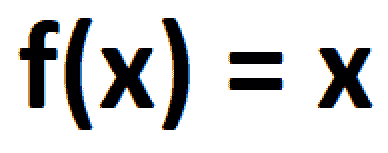
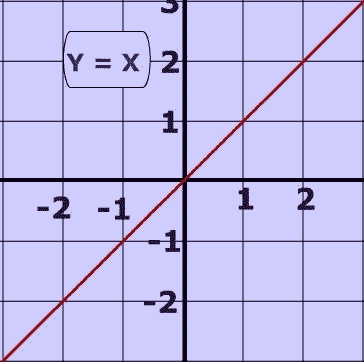
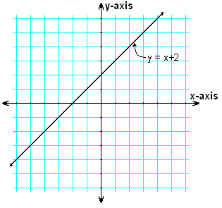
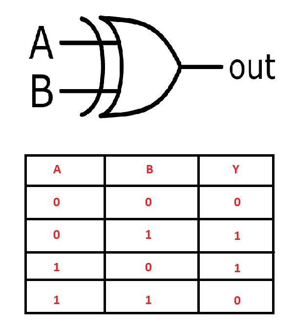
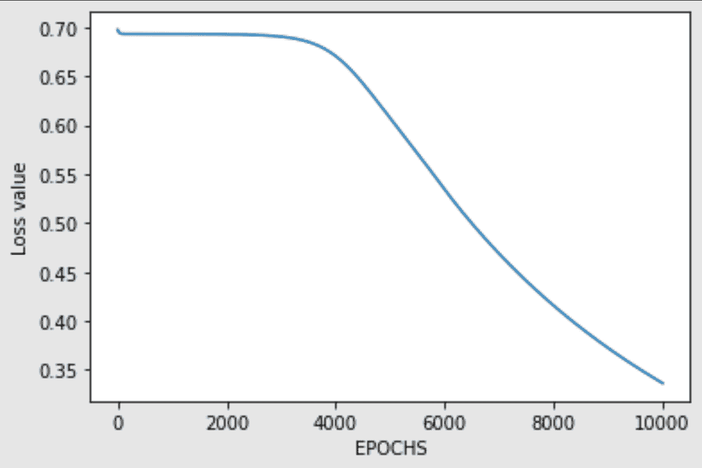
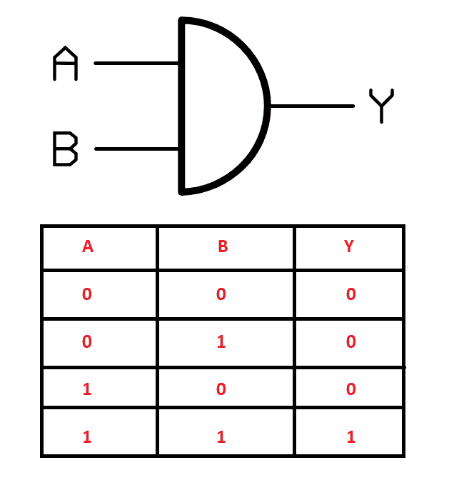

# 从头开始构建神经网络:第 1 部分

> 原文：<https://blog.paperspace.com/constructing-neural-networks-from-scratch/>


Photo by [Nastya Dulhiier](https://unsplash.com/@dulgier?utm_source=ghost&utm_medium=referral&utm_campaign=api-credit) / [Unsplash](https://unsplash.com/?utm_source=ghost&utm_medium=referral&utm_campaign=api-credit)

随着 TensorFlow、Keras、PyTorch 和其他类似库等流行深度学习框架的出现，该领域的新手以更快的速度学习神经网络主题变得容易得多。尽管这些框架为您提供了在几分钟内解决最复杂计算的途径，但它们并不要求您理解所有需求背后真正的核心概念和直觉。如果您知道某个特定函数是如何工作的，以及如何在您的代码块中准确地使用该函数，那么您将会毫不费力地解决大多数问题。然而，对于任何人来说，要真正理解神经网络的概念并理解完整的工作过程，从头开始学习这些人工神经网络是如何工作的变得至关重要。这些神经网络如何解决这些复杂的问题？

对于任何对人工智能和深度学习感兴趣的人来说，理解神经网络是如何工作的，以及随后它们是如何构造的，是一项值得努力的工作。虽然我们限制自己使用任何类型的深度学习框架，如 TensorFlow、Keras 或 PyTorch，但我们仍然会使用其他有用的库，如 NumPy，用于数值矩阵计算。通过 NumPy 阵列，我们可以执行大量复杂的计算，模拟深度学习的效果，并使用它来建立对这些神经网络的程序工作流的理解。我们将实现一些神经网络，旨在借助这些从头构建的神经网络来解决一个相当简单的任务。

## 简介:

神经网络的话题是深度学习领域和人工智能未来最有趣的话题之一。虽然人工神经网络这一术语只是从生物神经元的概念中大致得到启发，但在对它们进行概念化时，有一些值得注意的相似之处需要记住。与人类神经元非常相似，使用人工神经网络的一个有趣方面是，我们通常可以确定*他们正在做什么*，但是通常没有明确的方法来确定*他们如何工作*来实现目标。虽然我们有可能回答一些“是什么”的方面，但要完全理解我们需要知道的关于模型行为的一切，还有许多发现要做。这被称为深度学习的“黑盒”隐喻，它可以应用于许多深度学习系统。也就是说，许多神经网络是足够可解释的，我们可以很容易地解释它们的目的和方法，这取决于你的用例。

人工智能是一个庞大的领域，深度学习和神经网络只是其中的两个子领域。在本文中，我们的主要目标是更深入地研究神经网络的概念，我们将继续展示如何在不使用一些著名和流行的深度学习框架的情况下从头构建一个架构。在我们从头开始详述神经网络的实现之前，让我们对它们的工作过程有一个直观的了解。

* * *

## 理解神经元的概念:



大多数数学运算可以通过一个函数联系起来。函数是最基本的概念之一，通过它神经网络可以学习几乎任何东西。不管该函数做什么，都可以创建一个神经网络来逼近该函数。这就是众所周知的通用逼近定理，这一定律允许神经网络处理如此多种不同的挑战，同时也赋予了它们黑盒的性质。

诸如计算机视觉任务和自然语言处理任务的大多数现实世界问题也可以以函数的形式彼此关联。例如，通过函数，我们可以将几个单词的输入链接到特定的输出单词，并将一组图像链接到它们各自的输出图像。数学和现实世界问题中的大多数概念可以被重新构造为一个函数，以构建一个问题，期望的神经网络可以找到该问题的适当解决方案。

### 什么是人工神经网络，它是如何工作的？

术语人工神经网络现在通常被称为神经网络、神经网络或 nns。这些神经网络松散地受到生物神经元的启发。重要的是再次注意到，在活体中的神经元和用于构建神经网络架构的神经元之间实际上几乎没有相关性。虽然这两种元素的基本工作过程非常不同，但它们确实有一个共同的特点，即当这些神经网络结合在一起时，它们可以相对容易地解决复杂的任务。

为了理解神经网络如何工作的基本概念，我们可以用来帮助理解神经网络的关键数学概念之一是线方程，它是“y = mx + c”。方程的“y = mx”部分有助于操纵线来实现所需的形状和值。另一个值是截距 c，它通过在 y 轴上移动截距来改变直线的位置。参考这两幅图，可以更清楚地理解这个基本概念。



[Image Source](https://upload.wikimedia.org/wikipedia/commons/8/84/Graph_of_line_Y_%3D_X.jpg)

在神经网络方面，Y = WX +B 可以用来表示这个方程。y 表示输出值，“w”表示需要调整的权重，“x”表示输入值，“b”表示值。通过使用这个简单的逻辑，神经网络可以使用已知的信息“b”和“w”来确定“x”的值。



[Image Source](https://upload.wikimedia.org/wikipedia/commons/0/0a/Y_equals_x_plus_2.PNG)

为了更好地理解权重和偏差这一特定概念，让我们探索如下所示的简单代码片段和结果输出。使用一些输入值、权重和偏差，我们可以用权重转置的输入的点积来计算输出。将相应的偏差加到该结果值上，以计算期望值。下面的例子很简单，但足以让你有一个基本的了解。然而，我们将在下一节和后续文章中讨论更复杂的概念。

```py
import numpy as np

inputs = [1, 2, 3, 2.5]

weights = [[ 0.2, 0.8, - 0.5, 1 ],
           [ 0.5, - 0.91, 0.26, - 0.5 ],
           [ - 0.26, - 0.27, 0.17, 0.87 ]]

biases = [2, 3, 0.5]

outputs = np.dot(weights, inputs) + biases

# Or Use this method 
# np.dot(inputs, weights.T) + biases

print (outputs)
```

```py
[4.8   1.21  2.385] 
```

当神经网络集体结合在一起时，它们能够在反向传播的帮助下通过训练过程进行学习。第一步是前向传播，通过使用随机权重计算每层的必要信息，直到输出像元。然而，这些随机权重通常永远不会接近完美，需要调整权重以达到更理想的结果。因此，神经网络中的反向传播是其功能的更重要的方面之一。反向传播是对权重进行操作和调整的地方，通常是将手头的输出与预期的输出进行比较。我们将在下一节和后续文章中进一步研究这些概念。

* * *

## 从零开始构建神经网络；



在本节中，我们将看到如何从零开始借助神经网络的构造来解决一些任务。在我们从头开始构建我们的神经网络之前，让我们先了解一下本文中我们试图解决的问题类型。我们的目标是构建能够理解和解决逻辑门功能的神经网络，例如 and、OR、NOT、XOR 和其他类似的逻辑门。对于这个具体的例子，我们将看看如何通过从头构建我们的神经网络来解决 XOR 门问题。

逻辑门是电子元件的一些最基本的构件。我们使用这些逻辑门是因为，正如它们的名字所暗示的，每一个逻辑门都按照特定的逻辑运行。例如，XOR 门仅在两个输入值不同时提供高输出。如果两个输入值相似，则产生的输出为低。这些逻辑表示通常以真值表的形式表示。上图显示了异或门的符号和真值表表示。我们可以使用数组形式的输入和输出值来训练我们构建的神经网络，以获得理想的结果。

让我们首先导入必要的库，我们将利用这些库从头开始构建神经网络。本节我们不会用到任何深度学习框架。我们将只使用 NumPy 库来简化一些复杂的张量计算和整体的数学计算。即使没有 NumPy 库，您也可以选择构建神经网络，但是这会更加耗时。我们还将在 matplotlib 中导入本节所需的唯一的其他库。当我们为特定数量的时期训练模型时，我们将使用这个库来可视化和绘制损失。

```py
import numpy as np
import matplotlib.pyplot as plt
```

让我们描述真值表的输入和异或门的预期输出。读者可以选择在不同的门上工作，并相应地进行实验(注意，有时您可能得不到想要的结果)。下面是 XOR 门的输入变量和预期结果的代码片段。

```py
a = np.array([0, 0, 1, 1])
b = np.array([0, 1, 0, 1])

# y_and = np.array([[0, 0, 0, 1]])
y_xor = np.array([[0,1,1,0]])
```

让我们将输入组合到一个数组实体中，这样我们就有一个总输入数组和一个输出数组供神经网络学习。这个组合过程可以用几种方式来完成。在下面的代码块中，我们使用一个列表来组合两个数组，然后将最终的列表转换回 numpy 数组格式。在下一节中，我还提到了另一种整理输入数据的方法。

```py
total_input = []

total_input = [a, b]

total_input = np.array(total_input)
```

产生的输入数组如下。

```py
array([[0, 0, 1, 1],
       [0, 1, 0, 1]]) 
```

对于神经网络的大多数问题，阵列的形状是最关键的概念。形状不匹配是解决此类任务时最有可能出现的错误。因此，让我们打印并分析输入数组的形状。

```py
(2, 4) 
```

现在让我们定义一些从零开始构建神经网络所需的基本参数。给定一个输入或一组输入，节点的激活函数定义该节点的输出。我们将首先定义 sigmoid 函数，这将是我们在此任务中的主要激活函数。然后，我们将继续定义一些基本参数，如输入神经元、隐藏神经元、输出神经元的数量、总训练样本以及我们将训练神经网络的学习速率。

```py
# Define the sigmoid activation function:
def sigmoid (x):
    return 1/(1 + np.exp(-x))

# Define the number of neurons
input_neurons, hidden_neurons, output_neurons = 2, 2, 1

# Total training examples
samples = total_input.shape[1]

# Learning rate
lr = 0.1

# Define random seed to replicate the outputs
np.random.seed(42)
```

在下一步中，我们将初始化将通过隐藏层和输出层传递的权重，如下面的代码片段所示。将权重随机化通常是一个好主意，而不是将它们赋值为零，因为神经网络有时可能无法学习到所需的结果。

```py
# Initializing the weights for hidden and output layers

w1 = np.random.rand(hidden_neurons, input_neurons)
w2 = np.random.rand(output_neurons, hidden_neurons)
```

在下一个代码块中，我们将定义神经网络模型的工作结构。首先，我们将使函数通过神经网络结构执行前向传播。我们将从计算隐藏层中的权重和输入值开始，然后将它们传递给我们的 sigmoid 激活函数。然后，我们也将对输出层执行类似的传播，其中我们将利用之前定义的第二个权重。随机生成的权重显然不能达到预期的效果，需要进行微调。因此，我们还将实现反向传播机制，以帮助我们的模型更有效地训练。该操作的执行方式与我们在上一节中讨论的方式类似。

```py
# Forward propagation
def forward_prop(w1, w2, x):
    z1 = np.dot(w1, x)
    a1 = sigmoid(z1)    
    z2 = np.dot(w2, a1)
    a2 = sigmoid(z2)
    return z1, a1, z2, a2

# Backward propagation
def back_prop(m, w1, w2, z1, a1, z2, a2, y):

    dz2 = a2-y
    dw2 = np.dot(dz2, a1.T)/m
    dz1 = np.dot(w2.T, dz2) * a1*(1-a1)
    dw1 = np.dot(dz1, total_input.T)/m
    dw1 = np.reshape(dw1, w1.shape)

    dw2 = np.reshape(dw2,w2.shape)    
    return dz2,dw2,dz1,dw1
```

既然我们已经定义了前向传播和反向传播机制，我们可以继续训练神经网络。让我们创建一个训练循环，运行预定义的迭代次数。首先，我们将利用正向传播来接收输出值，然后通过将其与预期输出进行比较，开始相应地计算损耗。一旦我们开始执行神经网络的反向传播，我们就可以开始微调权重，以获得与预期结果相当的最终结果。下面是培训过程的代码块。我们还确保损失不断减少，神经网络正在学习如何预测预期结果以及以下图表。

```py
losses = []
iterations = 10000

for i in range(iterations):
    z1, a1, z2, a2 = forward_prop(w1, w2, total_input)
    loss = -(1/samples)*np.sum(y_xor*np.log(a2)+(1-y_xor)*np.log(1-a2))
    losses.append(loss)
    da2, dw2, dz1, dw1 = back_prop(samples, w1, w2, z1, a1, z2, a2, y_xor)
    w2 = w2-lr*dw2
    w1 = w1-lr*dw1

# We plot losses to see how our network is doing
plt.plot(losses)
plt.xlabel("EPOCHS")
plt.ylabel("Loss value")
```



让我们定义预测函数，通过它我们可以利用我们训练的神经网络来计算一些预测。我们将执行前向传播并压缩获得的结果。由于我们在训练过程中对权重进行了微调，因此我们应该能够在阈值为 0.5 的情况下达到预期的结果。

```py
# Creating the predict function

def predict(w1,w2,input):
    z1, a1, z2, a2 = forward_prop(w1,w2,test)
    a2 = np.squeeze(a2)

    if a2>=0.5:
        print("For input", [i[0] for i in input], "output is 1")
    else:
        print("For input", [i[0] for i in input], "output is 0")
```

现在，我们已经完成了预测函数的定义，我们可以测试您构建的神经网络所做的预测，并在训练模型约 10000 次迭代后查看其性能。我们将测试四种可能情况的预测结果，并将它们与 XOR 门的预期结果进行比较。

```py
test = np.array([[0],[0]])
predict(w1,w2,test)

test = np.array([[0],[1]])
predict(w1,w2,test)

test = np.array([[1],[0]])
predict(w1,w2,test)

test = np.array([[1],[1]])
predict(w1,w2,test)
```

```py
For input [0, 0] output is 0
For input [0, 1] output is 1
For input [1, 0] output is 1
For input [1, 1] output is 0 
```

我们可以注意到，神经网络预测后得到的结果与预期的结果相似。因此，我们可以得出结论，我们从头构建的神经网络能够成功地对 XOR 门任务做出准确的预测。下面的 GitHub [引用](https://github.com/shayanalibhatti/Coding-neural_network-for-XOR-logic-from-scratch/blob/master/neural_network_xor_logic_from_scratch.ipynb)用于本节的大部分代码。如果你想要另外的学习资源，我建议你去看看。还建议读者通过从头构建神经网络来解决这些问题，尝试不同类型门的其他变体。

* * *

## 使用深度学习框架的构建比较:



深度学习和人工神经网络领域非常广阔。虽然可以从零开始构建神经网络来解决复杂的问题，但是由于需要大量的时间以及需要构建的网络的固有复杂性，这通常是不可行的。因此，我们利用深度学习框架，如 TensorFlow、PyTorch、MXNet、Caffe 和其他类似的库(或工具)来设计、训练和验证神经网络模型。

这些深度学习框架允许开发人员和研究人员快速构建他们想要的模型来解决特定任务，而无需对复杂和不必要的细节的底层工作进行太多投资。在众多可用的深度学习框架中，两个最受欢迎的用于构建神经网络的现有工具是 TensorFlow 和 PyTorch。在这一节中，我们将借助深度学习框架来重建我们在前面几节中构建的项目。

对于这个重建项目，我将使用 TensorFlow 和 Keras 库。我建议查看下面的[文章](https://blog.paperspace.com/absolute-guide-to-tensorflow/)，通过此链接了解更多关于 TensorFlow 和 Keras 文章的信息([此处](https://blog.paperspace.com/the-absolute-guide-to-keras/))。本文这一部分的代码结构非常简单，您可以在 PyTorch 等任何其他深度学习框架中轻松复制它。如果你想用 PyTorch 而不是 TensorFlow 来构建这个项目，可以从下面的[链接](https://blog.paperspace.com/ultimate-guide-to-pytorch/)查看 PyTorch 的最终指南。下面是我们将用于构建我们的神经网络来求解与门和异或门的输入列表。

```py
import tensorflow as tf
from tensorflow import keras
import numpy as np
```

一旦我们导入了必要的库，我们就可以定义一些所需的参数，用于构建神经网络来学习与门的输出。类似于“与”门，我们还将构建“异或”门，正如我们在上一节中所做的那样。首先，让我们看看与门的结构。下面是与门的输入和预期结果。与门的逻辑是，只有当两个(或所有)输入都为高电平时，输出才为高电平。否则，当任一输入为低电平时，输出也为低电平。

```py
a = np.array([0, 0, 1, 1])
b = np.array([0, 1, 0, 1])

y_and = np.array([0, 0, 0, 1])
```

一旦我们声明了输入和预期的输出，就该把两个输入数组合并成一个实体了。正如上一节所讨论的，我们可以用几种方法做到这一点。对于这个代码片段，我们将把它们添加到一个包含四个独立元素的列表中，每个列表有两个元素。组合输入元素后得到的最终数组将存储在一个新的数组中。

```py
total_input = []

for i, j in zip(a, b):
    input1 = []
    input1.append(i)
    input1.append(j)
    total_input.append(input1)

total_input = np.array(total_input)
```

组合两个初始输入列表后获得的输入数组如下所示。

```py
array([[0, 0],
       [0, 1],
       [1, 0],
       [1, 1]]) 
```

这个最终输入数组的形状如下。

```py
(4, 2) 
```

在下一步中，我们将创建训练数据及其各自的输出标签。首先，我们将创建列表来存储输入和输出的训练数据。一旦我们完成了这些元素的循环，我们可以将这些列表保存为数组，并使用它们进行进一步的计算和神经网络训练。

```py
x_train = []
y_train = []

for i, j in zip(total_input, y_and):
    x_train.append(i)
    y_train.append(j)

x_train = np.array(x_train)
y_train = np.array(y_train)
```

这种任务的训练过程非常简单。我们可以定义所需的库，即输入层、隐藏层和输出节点的密集层，以及最后的顺序模型，以便我们可以构建顺序类型模型来解决所需的与门任务。首先，我们将定义模型的类型，然后继续添加输入层，该层将按照我们之前定义的方式接收输入。我们有两个隐藏层，每个层有 10 个节点，都有 ReLU 激活功能。最终输出层包含一个节点的 Sigmoid 激活函数，为我们提供所需的结果。根据提供的输入，最终输出是零或一。

```py
from tensorflow.keras.layers import Input, Dense
from tensorflow.keras.models import Sequential

model = Sequential()
model.add(Input(shape = x_train[0].shape))
model.add(Dense(10, activation = "relu"))
model.add(Dense(10, activation = "relu"))
model.add(Dense(1, activation = "sigmoid"))

model.summary()
```

```py
Model: "sequential"
_________________________________________________________________
Layer (type)                 Output Shape              Param #   
=================================================================
dense (Dense)                (None, 10)                30        
_________________________________________________________________
dense_1 (Dense)              (None, 10)                110       
_________________________________________________________________
dense_2 (Dense)              (None, 1)                 11        
=================================================================
Total params: 151
Trainable params: 151
Non-trainable params: 0
_________________________________________________________________ 
```

上表显示了包含隐藏层和输出节点及其各自参数的序列类型网络的概要。既然我们已经构建了模型架构来解决所需的 AND 门任务，我们可以继续编译模型并相应地训练它。我们将利用 Adam 优化器、二进制交叉熵损失函数，并计算二进制准确性来验证我们的模型有多准确。

```py
model.compile(optimizer = "adam", loss = "binary_crossentropy", metrics = "binary_accuracy")
```

一旦模型的编译完成，让我们开始训练程序，看看模型是否能够达到预期的结果。注意，从零开始的神经网络的损失函数和优化器等内容尚未涵盖。我们将在以后的文章中讨论这些概念。下面是训练所需模型的代码片段。

```py
model.fit(x_train, y_train, epochs = 500)
```

我们将对该模型进行大约 500 个时期的训练，以确保它按照预期学习需求。由于我们对于这些门任务的数据较少，因此模型将需要更多的训练来学习并相应地优化结果。训练完成后，大约需要几分钟时间，我们可以继续使用预测功能来验证获得的结果。让我们对数据集执行预测，如下面的代码片段所示。

```py
model.predict(x_train)
```

```py
array([[0.00790971],
       [0.02351646],
       [0.00969902],
       [0.93897456]], dtype=float32) 
```

我们可以注意到 AND 门的结果似乎和预期的差不多。对于必须为零的输出值，预测得到的结果能够预测接近于零的值，而对于必须为一的输出值，我们得到的结果接近于一。我们还可以对这些值进行舍入，以获得想要的结果。除了我们刚刚完成的与门之外，让我们探索另一个门。

类似地，对于异或门，我们也可以按照与与门相似的工作流程进行。首先，我们将定义 XOR 门所需的输入。它也是一个双通道输入，利用变量 a 和 b 存储输入值。y 变量将在 NumPy 数组中存储预期的结果值。我们将组合两个输入数组，类似于本节中使用的方法。一旦输入被组合，并且我们得到期望的组合，我们将把我们的数据分成训练输入信息和它们的结果标签输出。

```py
a = np.array([0, 0, 1, 1])
b = np.array([0, 1, 0, 1])

y_xor = np.array([0, 1, 1, 0])

total_input = []

for i, j in zip(a, b):
    input1 = []
    input1.append(i)
    input1.append(j)
    total_input.append(input1)

total_input = np.array(total_input)

x_train = []
y_train = []

for i, j in zip(total_input, y_xor):
    x_train.append(i)
    y_train.append(j)

x_train = np.array(x_train)
y_train = np.array(y_train)
```

我们将使用与本文前面部分类似的顺序类型架构。模型的代码片段和结果摘要如下所示。

```py
model1 = Sequential()
model1.add(Input(shape = x_train[0].shape))
model1.add(Dense(10, activation = "relu"))
model1.add(Dense(10, activation = "relu"))
model1.add(Dense(1, activation = "sigmoid"))

model1.summary()
```

```py
Model: "sequential_1"
_________________________________________________________________
Layer (type)                 Output Shape              Param #   
=================================================================
dense_3 (Dense)              (None, 10)                30        
_________________________________________________________________
dense_4 (Dense)              (None, 10)                110       
_________________________________________________________________
dense_5 (Dense)              (None, 1)                 11        
=================================================================
Total params: 151
Trainable params: 151
Non-trainable params: 0
_________________________________________________________________ 
```

我们将定义用于编译模型的参数，例如优化器和损失函数，然后拟合模型。对于训练过程，我们将使用第二模型和新的训练数据输入和输出用于训练过程。在得到最佳预测之前，我们将训练我们的模型一千个时期。由于需要训练的数据样本相对较少，因此训练应该只需要几分钟。

```py
model1.compile(optimizer = "adam", loss = "binary_crossentropy", metrics = "binary_accuracy")

model1.fit(x_train, y_train, epochs = 1000)
```

让我们对训练输入数据执行预测，并在训练过程完成后查看模型能够预测的输出。

```py
model1.predict(x_train)
```

```py
array([[0.01542357],
       [0.995468  ],
       [0.99343044],
       [0.00554709]], dtype=float32) 
```

我们可以注意到，输出值与各自的预期结果相当精确。当预期结果为 0 时，这些值更接近于 0，当预期结果为 1 时，这些值更接近于 1。最后，让我们分别通过与门和异或门的两个模型对两个预测的值进行舍入。按照预期输出的要求，执行这一步将帮助我们获得单个整数值。

```py
model.predict(x_train).round()
model1.predict(x_train).round()
```

```py
array([[0.],
       [0.],
       [0.],
       [1.]], dtype=float32) 
```

```py
array([[0.],
       [1.],
       [1.],
       [0.]], dtype=float32) 
```

我们可以注意到，经过训练的两个模型都能够利用所提供的输入生成所需的输出。即使我们的数据量较少，但经过长时间的训练，该模型能够在减少损失的情况下达到预期的结果。从头开始学习神经网络所有要素的工作是相当漫长的。优化器、损失函数、各种损失函数和其他类似主题等复杂概念将在以后关于从头构建神经网络的文章中讨论。

* * *

## 结论:


Photo by [Denny Müller](https://unsplash.com/@redaquamedia?utm_source=ghost&utm_medium=referral&utm_campaign=api-credit) / [Unsplash](https://unsplash.com/?utm_source=ghost&utm_medium=referral&utm_campaign=api-credit)

在本文中，我们展示了从头构建神经网络的大多数基本概念。在简单介绍之后，我们探索了理解人工神经网络如何工作所需的一些必要元素。一旦我们完成了基本的主题，我们就使用 NumPy 从头开始构建神经网络。我们试验了异或门，并建立了一个可以解决这个问题的人工神经网络。最后，我们还学习了如何借助深度学习框架，即 TensorFlow 和 Keras，构造 AND 和 XOR 等众多门的解决方案。

人工神经网络(ANN)和深度学习是一场革命，能够完成一些曾经被认为机器不可能完成的最复杂的任务。成功的人工智能和神经网络的旅程始于卑微的开端，从简单的感知器模型到复杂的 n 隐藏层架构构建。[随着 GPU 的出现和经济计算的广泛普及，](https://paperspace.com/contact-sales)任何有兴趣了解如何创建这种模型和框架的人都变得越来越容易。神经网络的复杂性和概念数不胜数，尤其是当我们试图从零开始构建这些网络时，就像我们在本文中所做的那样。在以后的部分中，我们将探索更多从头构建神经网络的基本要素。

在接下来的文章中，我们将看到更多的生成性对抗性网络的变体，如 pix-2-pix GAN，BERT transformers，当然还有从头构建神经网络的第二部分。在那之前，继续探索和学习新的东西！