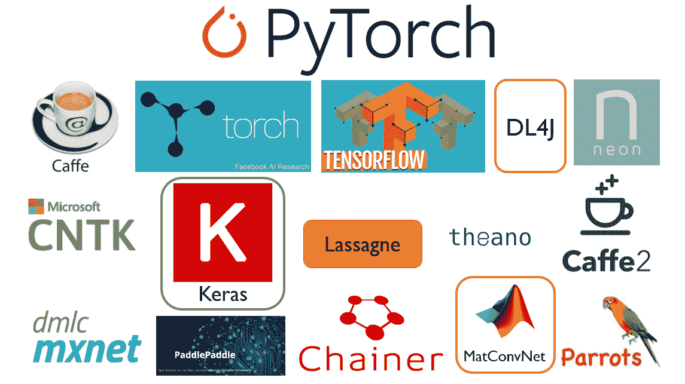
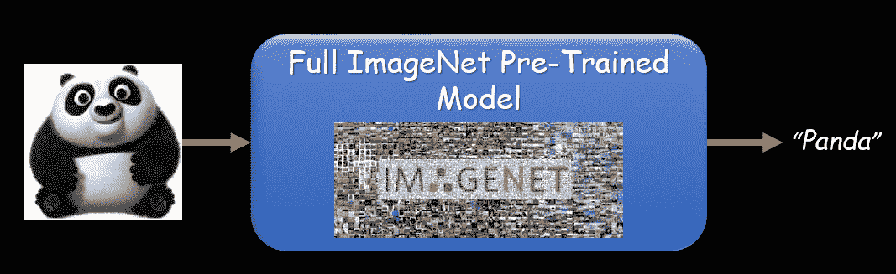
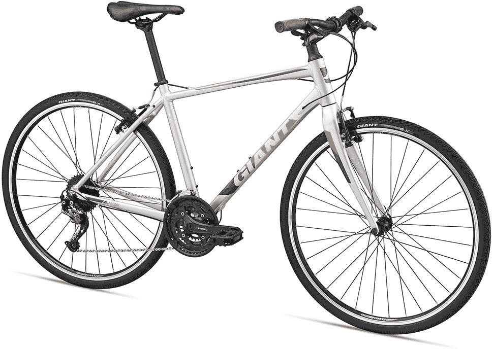

# 将完整的 ImageNet 预训练模型从 MXNet 转换为 PyTorch

> 原文：<https://blog.paperspace.com/convert-full-imagenet-pre-trained-model-from-mxnet-to-pytorch/>

目前有许多可用的深度学习框架，供研究人员和工程师实现他们想要的深度模型。每个深度学习框架都有自己的优缺点。例如，TensorFlow 有一个很好的社区，PyTorch 是一个很好的框架，可以在短时间内轻松开发模型，它还为生产级任务提供了一个很棒的 C++ API，MXNet 是一个很好的框架，可以用于非常大规模的培训(*即*，它是一个超可扩展的框架，可以在分布式系统和多个 GPU 上加速培训时间)，等等。



作为一名深度学习研究人员/工程师，经常会发现一个奇妙的 GitHub 知识库，它在一个你不熟悉的框架上共享一个预先训练好的模型。例如，你是 PyTorch 深度学习代码开发专家，同时你在 MXNet 上发现了一个伟大的代码及其预训练模型；而你想根据自己的需求修改这个模型。此时此刻，深度学习模型转换工具将帮助你在短时间内做到这一点。
作为一个高层次的观点，深度学习框架中的每个模型都包含一些层(*例如*、卷积、全连接等)。)及其相关权重，并且在不同框架之间转换预训练模型是可行的任务。然而，由于每个框架都有自己的结构，在两个不同的框架之间转换模型需要对它们都有很好的了解。为了加快这一过程，一些工程师和公司提供了帮助者深度学习模型转换工具，通过这些工具，代码开发人员可以更容易地解决这一问题。
有很多模型转换工具，如 [ONNX](https://onnx.ai/) 、 [MMdnn](https://github.com/Microsoft/MMdnn) 等。你可以在这个 GitHub 知识库上找到大量的深度学习模型转换器:
[https://github.com/ysh329/deep-learning-model-convertor](https://github.com/ysh329/deep-learning-model-convertor)
在可用的模型转换器中，微软支持的 MMdnn(模型管理深度神经网络)提供了在广泛的框架集合之间转换和可视化深度模型的奇妙工具。通过使用 MMdnn，可以将每个模型从原始框架转换为标准的*中间表示* ( *a.k.a.* ，IR)，然后将 IR 格式转换为目标框架结构。在本教程中，我想通过 MMdnn 转换器将完整的 ImageNet 预训练模型从 MXNet 转换为 PyTorch。这是熟悉 MMdnn 的一个合适的例子。


ImageNet 是根据 WordNet 层次结构组织的图像数据库，其中层次结构的每个节点由成百上千的图像描述。目前，它平均每个节点有超过 500 张图片。完整版本的 ImageNet 数据集的词典(*，即*，其标签和词的集合)包含 21，841 个标签(*，又名*，同义词集(synset))及其关联的 14，197，122 个图像。自 2010 年以来，一年一度的 ImageNet *大规模视觉识别挑战* (ILSVRC)是一项竞赛，研究团队在给定的数据集上评估他们的算法，并竞争在几项视觉识别任务上实现更高的准确性([参考文献](https://en.wikipedia.org/wiki/ImageNet))。ILSVRC 使用一个只有 1，000 个图像类别的“修剪”列表，其中有 1，281，167 个训练图像([参考](http://image-net.org/challenges/LSVRC/2017/download-images-1p39.php))。换句话说，ILSVRC 引入了 ImageNet 完整版本的子集。
在 ImageNet 数据上训练一个网络的一个常见原因是用它来进行*迁移学习*(包括特征提取或者微调其他模型)([参考](https://mxnet.incubator.apache.org/versions/master/tutorials/vision/large_scale_classification.html))。在这方面，许多深度学习框架，对于著名的和最先进的卷积神经网络(*例如*、ResNet、DenseNet 等。)，在 ImageNet ILSVRC 数据集上提供预训练模型([参考](https://blog.paperspace.com/going-beyond-torchvision-models/))。据我所知，除了 MXNet，其他深度学习框架都没有在完整的 ImageNet 数据集上提供预训练模型。幸运的是，MXNet 团队推出了一个很好的教程，用于在完整的 ImageNet 数据集上训练 ResNet 模型。您可以参考下面的链接了解更多详情:
[https://mxnet . incubator . Apache . org/versions/master/tutorials/vision/large _ scale _ classification . html](https://mxnet.incubator.apache.org/versions/master/tutorials/vision/large_scale_classification.html)
值得注意的是，拥有一个在如此庞大的训练数据集上训练的预训练模型(*即*，full ImageNet)，将是一个真正有价值的网络。它可以在训练阶段早期加速收敛，也可以在某些场景下提高目标任务精度(*例如*，微调或特征提取)。换句话说，在不同的框架中具有所提到的有价值的模型(*即*，完整的 ImageNet 预训练模型)，将是用于进一步修改的很好的初始化网络。



## 先决条件

为了跟进本教程，首先，您应该安装 MMdnn 工具。安装方法有几种(可以参考其 [GitHub 页面](https://github.com/Microsoft/MMdnn#installation))。在不同的安装方式中，我更喜欢通过 pip 来安装。为此，启动您的终端并输入命令:
`sudo pip3 install --upgrade mmdnn`
您还需要 PyTorch 来测试转换后的模型。您还可以使用下面的命令安装 PyTorch 的稳定版本:
`sudo pip3 install --upgrade torch torchvision`
您需要的另一个东西是 MXNet 上原始的完整 ImageNet 预训练模型，以及它的同义词集( *a.k.a.* ，synset 或它的类别列表)。您可以通过下面的 python 代码下载这些文件:

```py
import os
import errno

_base_model_url = 'http://data.mxnet.io/models/'
_default_model_info = {
    'imagenet11k-resnet-152': {'symbol':_base_model_url+'imagenet-11k/resnet-152/resnet-152-symbol.json',
                             'params':_base_model_url+'imagenet-11k/resnet-152/resnet-152-0000.params'},
}

def download_file(url, local_fname=None, force_write=False):
    # requests is not default installed
    import requests
    if local_fname is None:
        local_fname = url.split('/')[-1]
    if not force_write and os.path.exists(local_fname):
        return local_fname

    dir_name = os.path.dirname(local_fname)

    if dir_name != "":
        if not os.path.exists(dir_name):
            try:  # try to create the directory if it doesn't exists
                os.makedirs(dir_name)
            except OSError as exc:
                if exc.errno != errno.EEXIST:
                    raise

    r = requests.get(url, stream=True)
    assert r.status_code == 200, "failed to open %s" % url
    with open(local_fname, 'wb') as f:
        for chunk in r.iter_content(chunk_size=1024):
            if chunk:  # filter out keep-alive new chunks
                f.write(chunk)
    return local_fname

def download_model(model_name, dst_dir='./', meta_info=None):
    if meta_info is None:
        meta_info = _default_model_info
    meta_info = dict(meta_info)
    if model_name not in meta_info:
        return (None, 0)
    if not os.path.isdir(dst_dir):
        os.mkdir(dst_dir)
    meta = dict(meta_info[model_name])
    assert 'symbol' in meta, "missing symbol url"
    model_name = os.path.join(dst_dir, model_name)
    download_file(meta['symbol'], model_name+'-symbol.json')
    assert 'params' in meta, "mssing parameter file url"
    download_file(meta['params'], model_name+'-0000.params')
    return (model_name, 0)

if __name__ == "__main__":
    # ***** Download synset (i.e., Synonym Set):
    synset_url = 'http://data.mxnet.io.s3-website-us-west-1.amazonaws.com/models/imagenet-11k/synset.txt'
    download_file(synset_url, 'synset.txt')

    # ***** Download Model:
    download_model('imagenet11k-resnet-152', dst_dir='./') 
```

## 将完整的 ImageNet 预训练模型从 MXNet 转换为 PyTorch

为了将下载的完整 ImageNet 预训练模型从 MXNet 转换到 PyTorch，您需要移动到下载模型的目录中，然后输入以下 3 个命令(我也分享了每个步骤的输出):

#### 命令 1[需要几分钟(~ 3-5 分钟)]:

```py
python3 -m mmdnn.conversion._script.convertToIR -f mxnet -n imagenet11k-resnet-152-symbol.json -w imagenet11k-resnet-152-0000.params -d resnet152 --inputShape 3,224,224 
```

###### 命令 1 的输出:

```py
IR network structure is saved as [resnet152.json].  
IR network structure is saved as [resnet152.pb].  
IR weights are saved as [resnet152.npy]. 
```

#### 命令 2:

```py
python3 -m mmdnn.conversion._script.IRToCode -f pytorch --IRModelPath resnet152.pb --dstModelPath kit_imagenet.py --IRWeightPath resnet152.npy -dw kit_pytorch.npy 
```

###### 命令 2 的输出:

```py
Parse file [resnet152.pb] with binary format successfully.  
Target network code snippet is saved as [kit_imagenet.py].  
Target weights are saved as [kit_pytorch.npy]. 
```

#### 命令 3:

```py
python3 -m mmdnn.conversion.examples.pytorch.imagenet_test --dump resnet152Full.pth -n kit_imagenet.py -w kit_pytorch.npy 
```

###### 命令 3 的输出:

```py
PyTorch model file is saved as [resnet152Full.pth], generated by [kit_imagenet.py] and [kit_pytorch.npy]. 
```

## 测试转换后的模型

现在，我们在 PyTorch 上有了完整的 ImageNet 预训练 ResNet-152 转换模型。为了使用它(*即*，用它来分类图像)，你可以使用下面实现的代码。请注意，它的图像预处理有点棘手(*即*，当您使用模型转换器时，源框架和目标框架之间的预处理必须相同)。

```py
import torch
import numpy as np
from tensorflow.contrib.keras.api.keras.preprocessing import image

# ************** Parameters:
num_predictions = 5  # Top-k Results
model_address = 'resnet152Full.pth'  # for loading models
lexicon_address = 'synset.txt'
test_image_address = 'seagull.jpg'
device = torch.device("cuda:0" if torch.cuda.is_available() else "cpu")

# Load Converted Model:
model = torch.load(model_address).to(device)
model.eval()

# Read Input Image and Apply Pre-process:
img = image.load_img(test_image_address, target_size=(224, 224))
x = image.img_to_array(img)
x = x[..., ::-1]  # transform image from RGB to BGR
x = np.transpose(x, (2, 0, 1))
x = np.expand_dims(x, 0).copy()
x = torch.from_numpy(x)
x = x.to(device)

# Load Full-ImageNet Dictionary (i.e., lexicon):
with open(lexicon_address, 'r') as f:
    labels = [l.rstrip() for l in f]

# Make prediction (forward pass):
with torch.no_grad():
    output = model(x)
max, argmax = output.data.squeeze().max(0)
class_id = argmax.item()
class_name = labels[class_id]

# Print the top-5 Results:
h_x = output.data.squeeze()
probs, idx = h_x.sort(0, True)
print('Top-5 Results: ')
for i in range(0, num_predictions):
    print('{:.2f}% -> {}'.format(probs[i] * 100.0, labels[idx[i]]))
str_final_label = 'The Image is a ' + class_name[10:] + '.'
print(str_final_label) 
```

以下是一些示例及其相关结果:

#### 样本 1:


**前 5 名成绩:**
48.38% - > n02041246 海鸥、海鸥、海鸥
26.61% - > n02041085 拉里德
10.03% - > n01517966 隆脊鸟、隆脊鸟、飞鸟
2.76% - > n02021795 海鸟、海鸟、海鸟

#### 样本 2:


**前 5 名成绩:**
86.02% - > n02510455 大熊猫、熊猫、熊猫、浣熊、大熊猫
3.74% - > n02131653 熊
1.82% - > n01322983 小熊崽
1.19% - > n02075612 杂食
1.01

#### 样本 3:



**前 5 名成绩:**
21.54% - > n04026813 推式自行车
21.42% - > n03792782 山地车、越野车
17.56% - > n04126066 安全自行车、安全自行车
13.79% - > n02836035 自行车轮
7.77

## 结论

在本教程中，您已经熟悉了深度学习模型转换工具，尤其是 MMdnn。您已经将有价值的完整 ImageNet 预训练模型从 MXNet 转换为 PyTorch，并且现在在 PyTorch 中拥有它！

## 下一步

下一步，我鼓励您尝试转换后的完整 ImageNet 模型，通过 Paperspace 机器对您将遇到的问题进行微调或特征提取。

## 关于作者:

我是高级深度学习研究员，[巴彦视界集团](https://vision.bayan.ir/)CTO。我在机器学习、深度学习和计算机视觉方面经验丰富。我为这个行业在这些领域做了很多项目。
可以关注我的
(我的 [LinkedIn 简介](https://www.linkedin.com/in/amir-hossein-karami-b8690739/) )
(我的 [GitHub 简介](https://github.com/ahkarami) )
(我的[谷歌学术简介](https://scholar.google.com/citations?user=u49U8FEAAAAJ&hl=en&oi=ao))