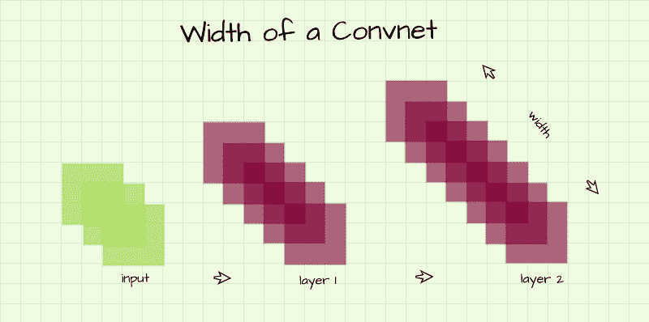
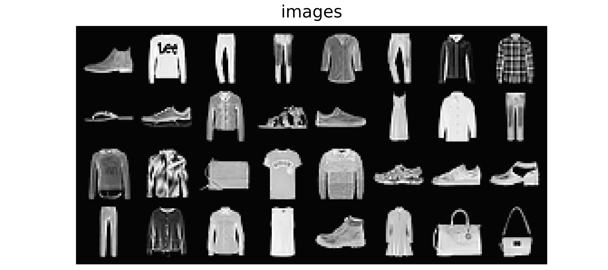
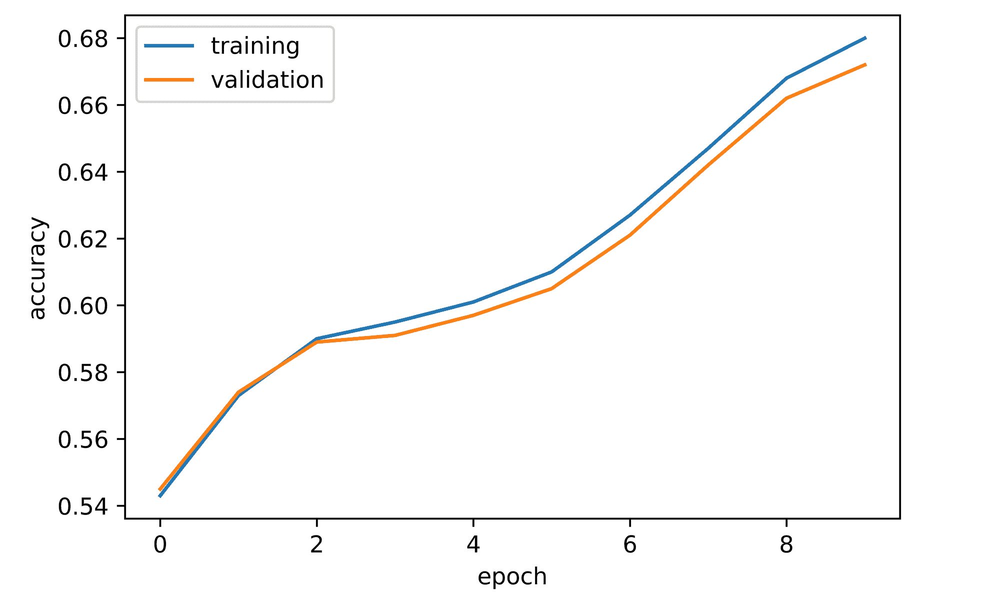
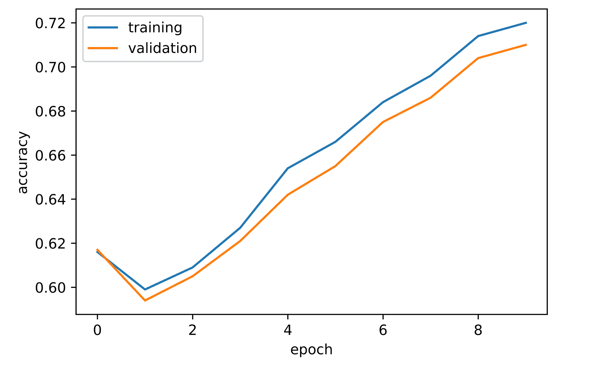
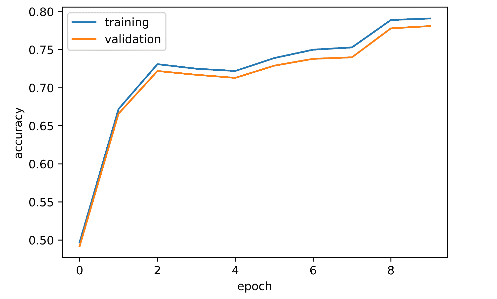
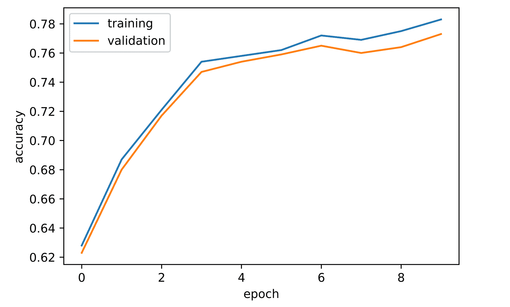
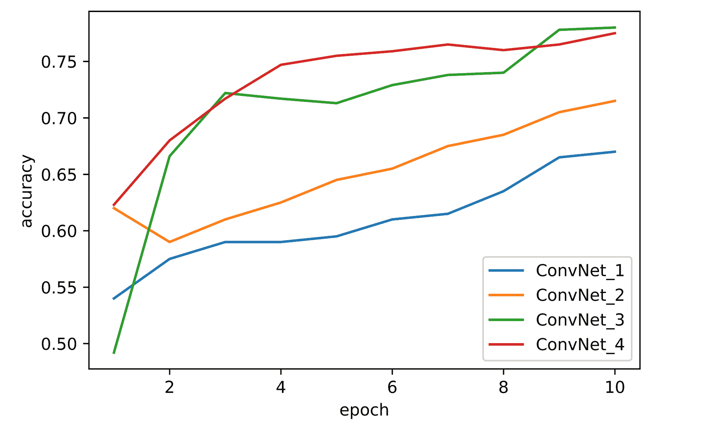

# 卷积神经网络维度和模型性能

> 原文：<https://blog.paperspace.com/convolutional-neural-network-dimensions-model-performance/>

许多因素会影响深度学习模型泛化功能或为特定数据集和预期目标创建映射的效果。在本文中，我们将看看宽度和深度等维度意味着什么，并研究它们如何影响卷积神经网络架构的整体性能。

```py
#  import dependencies
import torch
import torch.nn as nn
import torch.nn.functional as F
import torchvision
import torchvision.transforms as transforms
import torchvision.datasets as Datasets
from torch.utils.data import Dataset, DataLoader
import numpy as np
import matplotlib.pyplot as plt
import cv2
from tqdm.notebook import tqdm
import seaborn as sns
from torchvision.utils import make_grid
```

### 规模

这听起来可能有点荒谬，但是 convnets 可以被认为是盒子。正如一个盒子通常具有宽度和深度一样，相同的约定也适用于 convnets。在本节中，我们将了解这些与 convnets 相关的维度。

#### 宽度

也称为容量，卷积神经网络的宽度是指其层中存在的通道数量。在典型的 convnet 架构中，随着我们从一层到另一层，每层中的通道数量逐渐增加，按照相同的思路，这意味着网络会随着我们从一层到另一层而变得越来越宽。

至于宽度对卷积神经网络性能的影响，在这一点上，我们知道卷积层中的每个通道只是提取特征的特征图。具有更大宽度(每层通道数)的 convnet 将能够从输入图像中了解更多不同的特征。

用不太专业的术语来说，更宽的 convnet 更适合处理各种输入，尤其是在类有些相似的情况下。举例来说，考虑一个负责区分轿车和轿跑的 convnet。这是两种看起来非常相似的汽车，除了轿车有四个门，而轿车有两个门。为了了解两辆车之间的细微差异，在每一层提取大量特征将是有益的，因此可以通过网络学习区分功能。



虽然更宽的卷积神经网络可能更有益，但必须注意的是，网络越宽，它拥有的参数数量就越多。当参数过多时，过拟合就成为一种非常可能的可能性。

考虑下面的两种定制 convnet 架构，与 convnet_1 相比，convnet_2 更宽，因为其层中的通道数量更多。它从第 1 层的 16 个信道开始，在第 3 层的 64 层终止；而 convnet_1 从第 1 层的 8 个通道开始，在第 3 层的 32 个通道中达到顶点。

```py
class ConvNet_1(nn.Module):
  def __init__(self):
    super().__init__()
    self.conv1 = nn.Conv2d(1, 8, 3, padding=1)
    self.pool1 = nn.MaxPool2d(2)
    self.conv2 = nn.Conv2d(8, 16, 3, padding=1)
    self.pool2 = nn.MaxPool2d(2)
    self.conv3 = nn.Conv2d(16, 32, 3, padding=1)
    self.pool3 = nn.MaxPool2d(2)
    self.conv4 = nn.Conv2d(32, 10, 1)
    self.pool4 = nn.AvgPool2d(3)

  def forward(self, x):
    #-------------
    # INPUT
    #-------------
    x = x.view(-1, 1, 28, 28)

    #-------------
    # LAYER 1
    #-------------
    output_1 = self.conv1(x)
    output_1 = F.relu(output_1)
    output_1 = self.pool1(output_1)

    #-------------
    # LAYER 2
    #-------------
    output_2 = self.conv2(output_1)
    output_2 = F.relu(output_2)
    output_2 = self.pool2(output_2)

    #-------------
    # LAYER 3
    #-------------
    output_3 = self.conv3(output_2)
    output_3 = F.relu(output_3)
    output_3 = self.pool3(output_3)

    #--------------
    # OUTPUT LAYER
    #--------------
    output_4 = self.conv4(output_3)
    output_4 = self.pool4(output_4)
    output_4 = output_4.view(-1, 10)

    return torch.sigmoid(output_4)
```

ConvNet_1

```py
class ConvNet_2(nn.Module):
  def __init__(self):
    super().__init__()
    self.conv1 = nn.Conv2d(1, 16, 3, padding=1)
    self.pool1 = nn.MaxPool2d(2)
    self.conv2 = nn.Conv2d(16, 32, 3, padding=1)
    self.pool2 = nn.MaxPool2d(2)
    self.conv3 = nn.Conv2d(32, 64, 3, padding=1)
    self.pool3 = nn.MaxPool2d(2)
    self.conv4 = nn.Conv2d(64, 10, 1)
    self.pool4 = nn.AvgPool2d(3)

  def forward(self, x):
    #-------------
    # INPUT
    #-------------
    x = x.view(-1, 1, 28, 28)

    #-------------
    # LAYER 1
    #-------------
    output_1 = self.conv1(x)
    output_1 = F.relu(output_1)
    output_1 = self.pool1(output_1)

    #-------------
    # LAYER 2
    #-------------
    output_2 = self.conv2(output_1)
    output_2 = F.relu(output_2)
    output_2 = self.pool2(output_2)

    #-------------
    # LAYER 3
    #-------------
    output_3 = self.conv3(output_2)
    output_3 = F.relu(output_3)
    output_3 = self.pool3(output_3)

    #--------------
    # OUTPUT LAYER
    #--------------
    output_4 = self.conv4(output_3)
    output_4 = self.pool4(output_4)
    output_4 = output_4.view(-1, 10)

    return torch.sigmoid(output_4)
```

ConvNet_2

#### 深度

卷积神经网络的深度是指它拥有的层数。深度决定了 convnet 可以学习的结构类型。

通常，较浅的层学习高级特征，而较深的层学习低级特征。用更专业的术语来说，使用人脸进行说明，虽然 convnet 的前几层将提取与人脸的整体结构相关的边缘，但更深的层将提取与眼睛、耳朵、鼻子、嘴等相关的边缘。


正如 convnet width 的情况一样，深度越大意味着参数越多，因此不受控制的深度也会导致网络过度拟合训练数据。下面的 Convnet_3 是 convnet_1 的复制品，但深度有所增加。请注意，虽然深度增加了，但宽度保持不变，因为额外的卷积层与其前面的层具有相同数量的通道，因此网络没有变宽。

```py
class ConvNet_3(nn.Module):
  def __init__(self):
    super().__init__()
    self.conv1 = nn.Conv2d(1, 8, 3, padding=1)
    self.conv2 = nn.Conv2d(8, 8, 3, padding=1)
    self.pool2 = nn.MaxPool2d(2)
    self.conv3 = nn.Conv2d(8, 16, 3, padding=1)
    self.conv4 = nn.Conv2d(16, 16, 3, padding=1)
    self.pool4 = nn.MaxPool2d(2)
    self.conv5 = nn.Conv2d(16, 32, 3, padding=1)
    self.conv6 = nn.Conv2d(32, 32, 3, padding=1)
    self.pool6 = nn.MaxPool2d(2)
    self.conv7 = nn.Conv2d(32, 10, 1)
    self.pool7 = nn.AvgPool2d(3)

  def forward(self, x):
    #-------------
    # INPUT
    #-------------
    x = x.view(-1, 1, 28, 28)

    #-------------
    # LAYER 1
    #-------------
    output_1 = self.conv1(x)
    output_1 = F.relu(output_1)

    #-------------
    # LAYER 2
    #-------------
    output_2 = self.conv2(output_1)
    output_2 = F.relu(output_2)
    output_2 = self.pool2(output_2)

    #-------------
    # LAYER 3
    #-------------
    output_3 = self.conv3(output_2)
    output_3 = F.relu(output_3)

    #-------------
    # LAYER 4
    #-------------
    output_4 = self.conv4(output_3)
    output_4 = F.relu(output_4)
    output_4 = self.pool4(output_4)    

    #-------------
    # LAYER 5
    #-------------
    output_5 = self.conv5(output_4)
    output_5 = F.relu(output_5)

    #-------------
    # LAYER 6
    #-------------
    output_6 = self.conv6(output_5)
    output_6 = F.relu(output_6)
    output_6 = self.pool6(output_6)

    #--------------
    # OUTPUT LAYER
    #--------------
    output_7 = self.conv7(output_6)
    output_7 = self.pool7(output_7)
    output_7 = output_7.view(-1, 10)

    return torch.sigmoid(output_7)
```

Convnet_3

### 基于维度的 Convnet 性能基准测试

在本节中，我们将基于宽度和深度来比较 convnet 的性能。Convnet_1 将用作基线，而 convnet_2 将用作宽度增加的 convnet_1 版本，convnet_3 将用作深度增加的版本。下面的 Convnet_4 结合了 convnet_2 和 con vnet _ 3 中分别增加的宽度和深度。

```py
class ConvNet_4(nn.Module):
  def __init__(self):
    super().__init__()
    self.conv1 = nn.Conv2d(1, 16, 3, padding=1)
    self.conv2 = nn.Conv2d(16, 16, 3, padding=1)
    self.pool2 = nn.MaxPool2d(2)
    self.conv3 = nn.Conv2d(16, 32, 3, padding=1)
    self.conv4 = nn.Conv2d(32, 32, 3, padding=1)
    self.pool4 = nn.MaxPool2d(2)
    self.conv5 = nn.Conv2d(32, 64, 3, padding=1)
    self.conv6 = nn.Conv2d(64, 64, 3, padding=1)
    self.pool6 = nn.MaxPool2d(2)
    self.conv7 = nn.Conv2d(64, 10, 1)
    self.pool7 = nn.AvgPool2d(3)

  def forward(self, x):
    #-------------
    # INPUT
    #-------------
    x = x.view(-1, 1, 28, 28)

    #-------------
    # LAYER 1
    #-------------
    output_1 = self.conv1(x)
    output_1 = F.relu(output_1)

    #-------------
    # LAYER 2
    #-------------
    output_2 = self.conv2(output_1)
    output_2 = F.relu(output_2)
    output_2 = self.pool2(output_2)

    #-------------
    # LAYER 3
    #-------------
    output_3 = self.conv3(output_2)
    output_3 = F.relu(output_3)

    #-------------
    # LAYER 4
    #-------------
    output_4 = self.conv4(output_3)
    output_4 = F.relu(output_4)
    output_4 = self.pool4(output_4)

    #-------------
    # LAYER 5
    #-------------
    output_5 = self.conv5(output_4)
    output_5 = F.relu(output_5)

    #-------------
    # LAYER 6
    #-------------
    output_6 = self.conv6(output_5)
    output_6 = F.relu(output_6)
    output_6 = self.pool6(output_6)

    #--------------
    # OUTPUT LAYER
    #--------------
    output_7 = self.conv7(output_6)
    output_7 = self.pool7(output_7)
    output_7 = output_7.view(-1, 10)

    return torch.sigmoid(output_7)
```

#### 基准数据集:FashionMNIST

FashionMNIST 数据集将用于我们的基准目标。这是一个数据集，包含 28 像素 x 28 像素的常见时尚配饰图像，如套头衫、包、衬衫、连衣裙等。该数据集预装了 PyTorch，可以这样导入:

```py
#  laoding training data
training_set = Datasets.FashionMNIST(root='./', download=True,
                                      transform=transforms.ToTensor())

#  loading validation data
validation_set = Datasets.FashionMNIST(root='./', download=True, train=False,
                                        transform=transforms.ToTensor())
```

为了可视化数据集，让我们快速创建一个数据加载器，然后从一个批处理中提取图像进行可视化。注意:可能有更好的方法，如果你找到了一个，你应该遵循它，我出于习惯选择了这样做。

```py
val_loader = DataLoader(validation_set, 32)

for images, labels in val_loader:
  print(images.shape)
  break

#  visualising images
plt.figure(dpi=150)
plt.title('images')
plt.imshow(np.transpose(make_grid(images, padding=4, normalize=True), 
                        (1,2,0)))
plt.axis('off')
plt.savefig('fmnist.png', dpi=1000)
```



Images in the FashionMNIST dataset.

| 标签 | 描述 |
| --- | --- |
| Zero | t 恤 |
| one | 裤子 |
| Two | 套衫 |
| three | 连衣裙 |
| four | 外套 |
| five | 凉鞋 |
| six | 衬衫 |
| seven | 运动鞋 |
| eight | 包 |
| nine | 踝靴 |

#### 卷积神经网络类

为了训练和利用我们的 convnets，让我们定义一个包含训练和预测的类，如下面的代码块所示。train()方法接受损失函数、要训练的时期数、批量大小、训练集和验证集等参数。

根据训练集和验证集，在函数本身中创建数据加载器。这样做是为了在实例化该类的一个成员时允许改变批量大小的可能性。请注意，数据加载器中的数据没有被打乱或随机采样，这是为了实现训练的一致性，这在我们将要比较几个模型时是必不可少的。

此外，在 train()方法中定义了两个内部函数，它们是 init_weights()和 accuracy()。Init_weights()用于确保所有要比较的模型的权重以相同的方式初始化，这将再次允许训练的一致性。除此之外，这也是一种可以让神经网络训练更快的措施。accuracy()函数顾名思义就是计算 convnet 的精度。

```py
#  setup device
if torch.cuda.is_available():
  device = torch.device('cuda:0')
  print('Running on the GPU')
else:
  device = torch.device('cpu')
  print('Running on the CPU')
```

```py
class ConvolutionalNeuralNet():
  def __init__(self, network):
    self.network = network.to(device)
    self.optimizer = torch.optim.Adam(self.network.parameters(), lr=3e-4)

  def train(self, loss_function, epochs, batch_size, 
            training_set, validation_set):

    #  creating log
    log_dict = {
        'training_loss_per_batch': [],
        'validation_loss_per_batch': [],
        'training_accuracy_per_epoch': [],
        'validation_accuracy_per_epoch': []
    } 

    #  defining weight initialization function
    def init_weights(module):
      if isinstance(module, nn.Conv2d):
        torch.nn.init.xavier_uniform_(module.weight)
        module.bias.data.fill_(0.01)

    #  defining accuracy function
    def accuracy(network, dataloader):
      total_correct = 0
      total_instances = 0
      for images, labels in tqdm(dataloader):
        images, labels = images.to(device), labels.to(device)
        predictions = torch.argmax(network(images), dim=1)
        correct_predictions = sum(predictions==labels).item()
        total_correct+=correct_predictions
        total_instances+=len(images)
      return round(total_correct/total_instances, 3)

    #  initializing network weights
    self.network.apply(init_weights)

    #  creating dataloaders
    train_loader = DataLoader(training_set, batch_size)
    val_loader = DataLoader(validation_set, batch_size)

    for epoch in range(epochs):
      print(f'Epoch {epoch+1}/{epochs}')
      train_losses = []

      #  training
      print('training...')
      for images, labels in tqdm(train_loader):
        #  sending data to device
        images, labels = images.to(device), labels.to(device)
        #  resetting gradients
        self.optimizer.zero_grad()
        #  making predictions
        predictions = self.network(images)
        #  computing loss
        loss = loss_function(predictions, labels)
        log_dict['training_loss_per_batch'].append(loss.item())
        train_losses.append(loss.item())
        #  computing gradients
        loss.backward()
        #  updating weights
        self.optimizer.step()
      with torch.no_grad():
        print('deriving training accuracy...')
        #  computing training accuracy
        train_accuracy = accuracy(self.network, train_loader)
        log_dict['training_accuracy_per_epoch'].append(train_accuracy)

      #  validation
      print('validating...')
      val_losses = []

      with torch.no_grad():
        for images, labels in tqdm(val_loader):
          #  sending data to device
          images, labels = images.to(device), labels.to(device)
          #  making predictions
          predictions = self.network(images)
          #  computing loss
          val_loss = loss_function(predictions, labels)
          log_dict['validation_loss_per_batch'].append(val_loss.item())
          val_losses.append(val_loss.item())
        #  computing accuracy
        print('deriving validation accuracy...')
        val_accuracy = accuracy(self.network, val_loader)
        log_dict['validation_accuracy_per_epoch'].append(val_accuracy)

      train_losses = np.array(train_losses).mean()
      val_losses = np.array(val_losses).mean()

      print(f'training_loss: {round(train_losses, 4)}  training_accuracy: '+
      f'{train_accuracy}  validation_loss: {round(val_losses, 4)} '+  
      f'validation_accuracy: {val_accuracy}\n')

    return log_dict

  def predict(self, x):
    return self.network(x) 
```

Model class.

#### 基准测试结果

##### ConvNet_1

再次记住，convnet_1 是这个基准测试任务的基线。让我们使用交叉熵损失函数将 convnet_1 实例化为 ConvolutionalNeuralNet 类的成员，批处理大小为 64，然后训练它 10 个时期，如下所示。

```py
#  instantiating convnet_1
model_1 = ConvolutionalNeuralNet(ConvNet_1())

#  training convnet_1
log_dict_1 = model_1.train(nn.CrossEntropyLoss(), epochs=10, batch_size=64, 
                           training_set=training_set, validation_set=validation_set)
```

从获得的日志中，我们可以看到，总体而言，在整个训练过程中，训练和验证准确性都呈上升趋势，训练准确性高于验证准确性。仅在一个时期的训练之后，convnet 就达到了大约 54%的验证准确度，并且持续稳定地上升，直到在第十个时期终止在略低于 68%的水平。

```py
#  visualizing accuracies
sns.lineplot(y=log_dict_1['training_accuracy_per_epoch'], x=range(len(log_dict_1['training_accuracy_per_epoch'])), label='training')

sns.lineplot(y=log_dict_1['validation_accuracy_per_epoch'], x=range(len(log_dict_1['validation_accuracy_per_epoch'])), label='validation')

plt.xlabel('epoch')
plt.ylabel('accuracy')
```



##### ConvNet_2

Convnet_2 是 convnet_1 的一个版本，宽度有所增加。本质上，在层数相同的情况下，convnet_2 的宽度是 convnet_1 的两倍。保持所有参数不变，让我们训练 conv net _ 2 10 个时期，并可视化结果。

```py
#  instantiating convnet_2
model_2 = ConvolutionalNeuralNet(ConvNet_2())

#  training convnet_2
log_dict_2 = model_2.train(nn.CrossEntropyLoss(), epochs=10, batch_size=64, 
                           training_set=training_set, validation_set=validation_set)
```

总体而言，在整个培训过程中，培训和验证的准确性都有所提高。仅在一个历元之后，验证准确度约为 62%，比相同情况下的 convnet_1 高 8%。到第二个历元时，验证准确度确实下降到略低于 60%,但在第 10 个历元时，它恢复并继续增加到略低于 72%的顶点，此时比 convnet_1 高约 5%。

```py
#  visualizing accuracies
sns.lineplot(y=log_dict_2['training_accuracy_per_epoch'], x=range(len(log_dict_2['training_accuracy_per_epoch'])), label='training')

sns.lineplot(y=log_dict_2['validation_accuracy_per_epoch'], x=range(len(log_dict_2['validation_accuracy_per_epoch'])), label='validation')

plt.xlabel('epoch')
plt.ylabel('accuracy')
```



##### ConvNet_3

Convnet_3 是 convnet_1 的升级版。本质上它的深度是两倍，但宽度相同。保持所有参数相等，让我们训练 conv net _ 3 10 个时期并探索结果。

```py
#  instantiating convnet_3
model_3 = ConvolutionalNeuralNet(ConvNet_3())

#  training convnet_3
log_dict_3 = model_3.train(nn.CrossEntropyLoss(), epochs=10, batch_size=64, 
                           training_set=training_set, validation_set=validation_set)
```

就像前两个 convnets 一样，在整个模型训练过程中，观察到训练和验证准确性的总体提高。一个历元后达到的验证精度约为 49%，比同期的 convnet_1 低 5 个百分点。然而，到第三个时期，性能反弹并急剧增加到大约 72%,此后它波动，最终在第 10 个时期稳定在略低于 80%,完全盖过了 convnet_1 的性能。

```py
#  visualizing accuracies
sns.lineplot(y=log_dict_3['training_accuracy_per_epoch'], x=range(len(log_dict_3['training_accuracy_per_epoch'])), label='training')

sns.lineplot(y=log_dict_3['validation_accuracy_per_epoch'], x=range(len(log_dict_3['validation_accuracy_per_epoch'])), label='validation')

plt.xlabel('epoch')
plt.ylabel('accuracy')
```



##### ConvNet_4

Convnet_4 是 convnet_1 的版本，深度和宽度都有所增加。本质上，它的宽度是两倍，深度也是两倍。保持所有参数不变，让我们对 convnet_4 进行 10 个时期的训练，并总结其结果。

```py
#  instantiating convnet_4
model_4 = ConvolutionalNeuralNet(ConvNet_4())

#  training convnet_4
log_dict_4 = model_4.train(nn.CrossEntropyLoss(), epochs=10, batch_size=64, 
                           training_set=training_set, validation_set=validation_set)
```

总的来说，在模型训练过程中，训练和验证的准确性都有所提高。第一个历元后达到的验证精度约为 62%，比 convnet_1 高 7 个百分点。从第二个时期到第四个时期，验证准确性显著增加到略低于 76%的值，然后在下降之前略有增加，然后增加到略低于 78%。

```py
#  visualizing accuracies
sns.lineplot(y=log_dict_4['training_accuracy_per_epoch'], x=range(len(log_dict_4['training_accuracy_per_epoch'])), label='training')

sns.lineplot(y=log_dict_4['validation_accuracy_per_epoch'], x=range(len(log_dict_4['validation_accuracy_per_epoch'])), label='validation')

plt.xlabel('epoch')
plt.ylabel('accuracy')
```



#### 比较性能

比较所有四个 convnets 的性能，我们可以推断，增加维度与模型性能正相关。在至少一个维度增加的所有情况下，convnet 性能都有显著提升。

| 基线 | 宽度增加(x2) | 增加的深度(x2) | 增加的深度(x2)和宽度(x2) |
| --- | --- | --- | --- |
| Fifty-four | Sixty-two | Forty-nine | Sixty-two |
| Fifty-seven point five | Fifty-nine | Sixty-six point five | Sixty-eight |
| Fifty-nine | Sixty-one | Seventy-two | Seventy-one point five |
| Fifty-nine | Sixty-two point five | Seventy-one point five | Seventy-four point five |
| Fifty-nine point five | Sixty-four point five | Seventy-one | Seventy-five point five |
| Sixty-one | Sixty-five point five | Seventy-three | Seventy-six |
| Sixty-one point five | Sixty-seven point five | Seventy-four | Seventy-six point five |
| Sixty-three point five | Sixty-eight point five | Seventy-four | Seventy-six |
| Sixty-six point five | Seventy point five | Seventy-eight | Seventy-six point five |
| Sixty-seven | Seventy-one point five | Seventy-eight | Seventy-seven point five |
| **ConvNet_1** | **ConvNet_2** | **ConvNet_3** | **ConvNet_4** |

*所有单位均为百分比(%)*

总体而言，convnet_3(增加的深度)似乎优于所有其他 convnet，convnet_4(增加的深度和宽度)紧随其后。Convnet_2(宽度增加)远远排在第三位，而基线 convnet_1 在所有四个中表现最差。然而，应该注意的是，convnets 只被训练了 10 个时期，为了得到更有结论性的结果，它们都应该被训练到最佳性能。



Comparing performances across all four convnets.

### 结束语

在本文中，我们探讨了卷积神经网络环境中的维度含义。我们创建了一个定制的 convnet 架构作为基准模型，然后继续创建其版本，一个增加了宽度，另一个增加了深度，最后一个同时增加了深度和宽度。

所有四个修道院都接受了 FashionMNIST 数据集的训练，以便相互比较。从获得的结果可以看出，当深度增加时性能最佳，而从基线模型观察到的性能最差。这些结果表明，卷积神经网络的维数实际上在 convnet 的性能方面起着至关重要的作用。