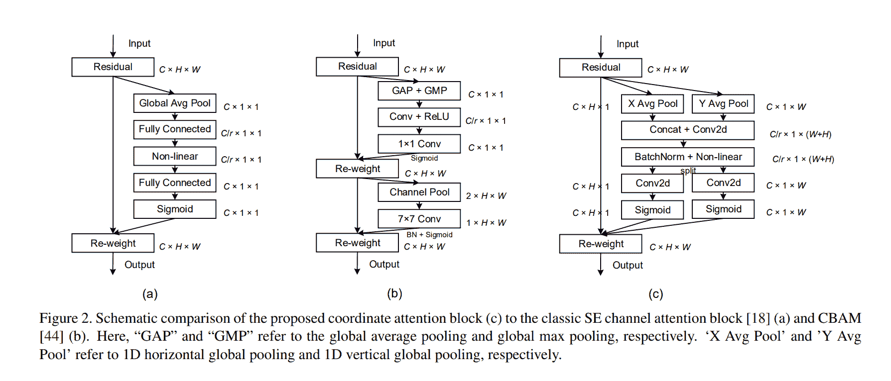
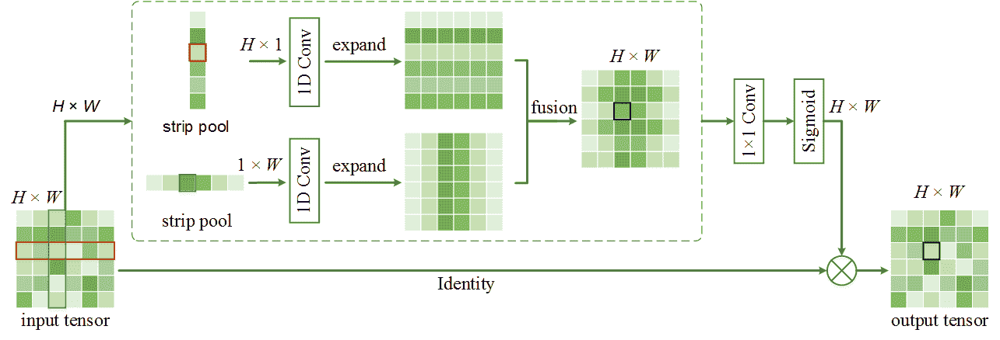
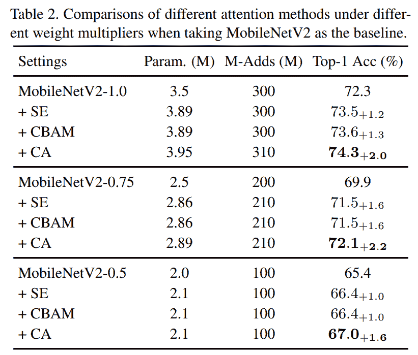
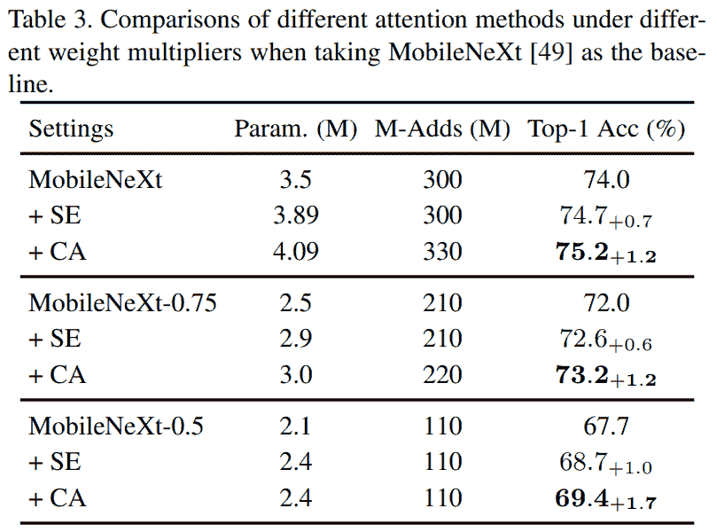
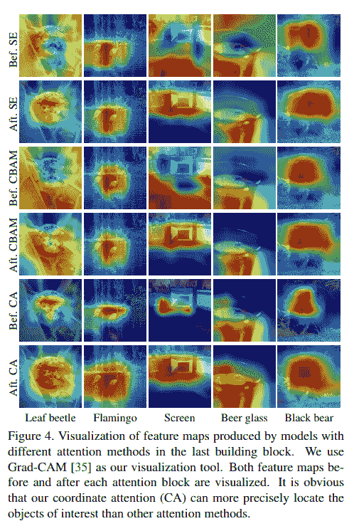
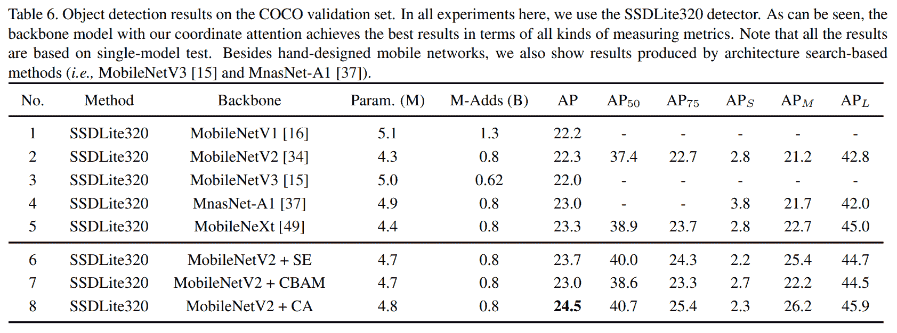

# 坐标注意解释

> 原文：<https://blog.paperspace.com/coordinate-attention/>

最佳注意力机制的竞赛仍在继续，因为今年最大的计算机视觉大会 CVPR 2021 又增加了一个注意力机制。这一个被称为坐标注意力，是在论文[中提出的高效移动网络设计的坐标注意力](https://arxiv.org/abs/2103.02907)。乍一看，注意力机制似乎是 T2 三重注意力和条带池的混合体，但更专门针对轻量级移动部署网络。

我们将首先看看工作背后的动机，然后跟进三重注意([旋转出席:卷积三重注意模块](https://openaccess.thecvf.com/content/WACV2021/papers/Misra_Rotate_to_Attend_Convolutional_Triplet_Attention_Module_WACV_2021_paper.pdf))和条带池([条带池:重新思考场景解析的空间池](https://openaccess.thecvf.com/content_CVPR_2020/papers/Hou_Strip_Pooling_Rethinking_Spatial_Pooling_for_Scene_Parsing_CVPR_2020_paper.pdf))的简明背景。然后，我们将分析所提出的机制的结构，并以本文给出的结果结束本文。

### 目录

1.  动机
2.  协调注意力
3.  PyTorch Code
4.  结果
5.  结论
6.  参考

## 摘要

> 最近关于移动网络设计的研究已经证明了信道注意(例如，挤压和激发注意)对于提升模型性能的显著有效性，但是它们通常忽略了位置信息，而位置信息对于生成空间选择性注意地图是重要的。本文通过在信道注意中嵌入位置信息，提出了一种新的移动网络注意机制，我们称之为“坐标注意”。与通过 2D 全局池将特征张量转换为单个特征向量的通道注意力不同，坐标注意力将通道注意力分解为两个 1D 特征编码过程，这两个过程分别沿着两个空间方向聚集特征。这样，可以沿着一个空间方向捕获长程相关性，同时可以沿着另一个空间方向保留精确的位置信息。然后，将得到的特征图分别编码成一对方向感知和位置敏感的注意力图，它们可以互补地应用于输入特征图，以增强感兴趣对象的表示。我们的协调注意力很简单，可以灵活地插入到传统的移动网络中，如 MobileNetV2、MobileNeXt 和 EfficientNet，几乎没有计算开销。大量实验表明，我们的协调注意不仅有利于图像网络分类，而且更有趣的是，在下游任务中表现更好，如对象检测和语义分割。

## 动机

建筑设计已经成为计算机视觉领域中最近研究的主要领域。许多人可能会认为这一研究方向正在饱和，但研究正在挑战这些论点，在定制层和注意力机制的设计方面取得了一些新的进展。这篇文章的重点是后者——注意力机制。基于所提供的输入数据，注意机制本质上提供了关于关注“哪里”和“什么”的附加信息。一些注意方法，如挤压和激励(SE)、卷积块注意模块(CBAM)、三元组注意、全局上下文(GC)等，已经证明了这种插件模块的效率，以最小的计算复杂度增加显著提高了传统基线模型的性能。然而，对“最小”这个词要有所保留，因为模型一直在努力以尽可能低的开销实现注意力模块提高性能的好处。然而，设计这些注意机制的方法主要集中在大规模网络上，因为这些方法引入的计算开销使得它们不适用于容量有限的移动网络。此外，大多数注意机制只关注通道信息，由于否定了空间信息的存在而失去了表现力。

基于这些缺点:

> 在本文中，除了第一个工作，我们提出了一个新的和有效的注意机制，通过将位置信息嵌入到信道注意中，使移动网络能够覆盖大的区域，同时避免产生大量的计算开销。

作者将这种新颖的注意机制称为坐标注意，因为*它的操作区分空间方向(即坐标)并生成坐标感知的注意地图。*

> 协调注意力有以下优点。首先，它不仅捕获跨通道信息，还捕获方向感知和位置敏感信息，这有助于模型更准确地定位和识别感兴趣的对象。第二，该方法是灵活和轻量的，并且可以容易地插入到移动网络的经典构建块中，例如在 MobileNetV2 中提出的反向剩余块和在 MobileNeXt 中提出的沙漏块，以通过强调信息表示来增加特征。第三，作为一个预训练的模型，协调注意可以为移动网络的下游任务带来显著的性能增益，特别是对于那些具有密集预测的任务(例如，语义分割)。

## 协调注意力



正如文章前言中所暗示的，上图(c)所示的协调注意与 WACV 2021 和 CVPR 2020 分别发表的三联注意和条形池的结构有些相似。(剧透:这两篇论文也与《坐标注意》出自同一作者)。

### 条形池(CVPR 2020 年)



虽然本文的主要焦点是场景解析，但从结构上看，我们可以注意到条形池和坐标注意力架构设计之间的相似之处。条带池本质上采用输入张量$X \in \mathbb{R}^{C \ast H \ast W}$并且对于每个空间特征地图，它分别将其缩减为两个空间向量$H \ast 1$和$W \ast 1$。然后，这两个向量通过两个 1D 卷积核，再通过双线性插值过程，得到原始的$H \ast W$形状，最后再按元素相加。然后，该图经过逐点卷积，并通过在相乘之前对其应用 sigmoid 激活，与原始特征图进行元素相乘。

### 三重注意(WACV 2021)


三重注意在领域方面与协调注意更相关，它提供了一种结构，该结构通过使用置换操作隔离每个空间维度来基本上计算与通道信息相对应的空间注意。该论文将这一概念称为“跨维度相互作用(CDI)”。关于三重注意力的深入分析，请点击查看我的博文[。](https://blog.paperspace.com/triplet-attention-wacv-2021/)

回到协调注意力，让我们剖析一下模块中发生了什么。如本节开头的图所示，坐标注意(Coord Att。)获取输入张量$ x \在\mathbb{R}^{C \ast H \ast W}$并在两个空间维度$H$和$W$上应用平均池，并获得两个张量$ x ' \在\mathbb{R}^{C \ast H \ast 1}$和$ x ' ' \在\mathbb{R}^{C \ast 1 \ast W}$中。然后，这两个张量被连接以形成$ x ' ' ' ' \ in \mathbb{r}^{c \ ast 1 \ ast(h+w)} $并随后通过 2D 卷积内核，该内核基于指定的缩减比率$r$将通道从$C$缩减为$\frac{C}{r}$。接下来是一个规范化层(在这种情况下是批处理规范)，然后是一个激活函数(在这种情况下是硬 Swish)。最后，张量在\mathbb{R}^{\frac{C}{r}被拆分为$ \ hat { x } \在\mathbb{R}^{\frac{C}{r}被拆分为$ \ ast 1 \ ast w }。这两个张量分别通过两个 2D 卷积核，每个卷积核将通道从$\frac{C}{r}$增加回$C$，最后对作为注意力图的结果的两个张量应用 sigmoid 激活。然后，注意力图按元素顺序与原始输入张量$X$相乘。

## PyTorch Code

下面的代码片段提供了坐标注意力模块的 PyTorch 代码，该模块可以插入到任何经典的主干中。

```py
import torch
import torch.nn as nn
import math
import torch.nn.functional as F

class h_sigmoid(nn.Module):
    def __init__(self, inplace=True):
        super(h_sigmoid, self).__init__()
        self.relu = nn.ReLU6(inplace=inplace)

    def forward(self, x):
        return self.relu(x + 3) / 6

class h_swish(nn.Module):
    def __init__(self, inplace=True):
        super(h_swish, self).__init__()
        self.sigmoid = h_sigmoid(inplace=inplace)

    def forward(self, x):
        return x * self.sigmoid(x)

class CoordAtt(nn.Module):
    def __init__(self, inp, oup, reduction=32):
        super(CoordAtt, self).__init__()
        self.pool_h = nn.AdaptiveAvgPool2d((None, 1))
        self.pool_w = nn.AdaptiveAvgPool2d((1, None))

        mip = max(8, inp // reduction)

        self.conv1 = nn.Conv2d(inp, mip, kernel_size=1, stride=1, padding=0)
        self.bn1 = nn.BatchNorm2d(mip)
        self.act = h_swish()

        self.conv_h = nn.Conv2d(mip, oup, kernel_size=1, stride=1, padding=0)
        self.conv_w = nn.Conv2d(mip, oup, kernel_size=1, stride=1, padding=0)

    def forward(self, x):
        identity = x

        n,c,h,w = x.size()
        x_h = self.pool_h(x)
        x_w = self.pool_w(x).permute(0, 1, 3, 2)

        y = torch.cat([x_h, x_w], dim=2)
        y = self.conv1(y)
        y = self.bn1(y)
        y = self.act(y) 

        x_h, x_w = torch.split(y, [h, w], dim=2)
        x_w = x_w.permute(0, 1, 3, 2)

        a_h = self.conv_h(x_h).sigmoid()
        a_w = self.conv_w(x_w).sigmoid()

        out = identity * a_w * a_h

        return out
```

## 结果

对于作者进行的实验的完整的广泛的结果，我强烈建议看一看这篇论文。在这里，我们只展示了在 ImageNet 上使用 MobileNet 和 MobileNext 进行图像分类的突出结果，以及在 MS-COCO 上进行对象检测的突出结果，其中坐标注意力展示了在性能方面的全面改进。



## 结论

虽然结果本身令人印象深刻，但提出的方法与论文的主要动机之一:移动网络的低成本关注相违背，因为事实上，与对比的两种方法( [CBAM](https://blog.paperspace.com/attention-mechanisms-in-computer-vision-cbam/) 和 [SE](https://blog.paperspace.com/channel-attention-squeeze-and-excitation-networks/) )相比，协调关注在参数和失败次数方面都更昂贵。第二个缺点是比较的次数有限。虽然 SE 和 CBAM 是突出的注意方法，但还有更多性能更好、成本更低的注意模块，作者未能与 Triplet 和 ECA 进行比较。此外，坐标注意力模块不是针对 CBAM 的苹果到苹果的比较，因为前者使用硬 swish 作为其激活，这提供了显著的性能提升，然而，它是与使用 ReLU(不如硬 swish)的后者相比较的。

然而，要由读者来决定这篇论文是否公正，是否提供了另一种有效的注意力模式来尝试。

## 参考

1.  [协调注意力，实现高效的移动网络设计](https://arxiv.org/abs/2103.02907)
2.  [坐标关注官方 GitHub 库](https://github.com/Andrew-Qibin/CoordAttention)