# 新冠肺炎:我们拥有的数据，以及我们如何使用它

> 原文：<https://blog.paperspace.com/coronavirus-background-and-data/>

## 介绍

我们中的许多人目前感觉被困在他们家的范围内，被困在四堵墙之间，不敢冒险到户外去避免新冠肺炎的传播。这是一种新的疾病，已经席卷了整个世界，并迅速影响到我们许多人。

为了抗击这种疫情，重要的是过滤错误信息，了解我们现有数据的局限性，并了解模拟不同流行病学情景的公认模型及其做出的预测。今天，世界各国领导人肩负着重大责任，他们做出的错误决定可能会破坏国家经济，杀死许多人，并摧毁其他人的生活。

这篇文章将看看当我们谈论冠状病毒时，我们到底在处理什么，**我们拥有什么样的流行病学和生物信息数据**，**我们可以从这些数据中安全地得出什么样的推论**，以及**我们应该远离什么样的推论**。我们不仅讨论了数据科学家或病毒学家一直在做什么，政策制定者和公共卫生专业人员在这种情况下可以做什么，还讨论了每个公民如何通过传播正确的知识、照顾他们的亲人和避免疫情病毒进一步传播的所有方式来提供帮助。

具体来说，我们将了解:

*   新型冠状病毒和与其相似的病毒
*   重要流行病学概念入门
*   了解疫情的指数增长
*   冠状病毒危机的数据来源
*   病毒序列数据的数据来源
*   分析在危机中什么有效，什么无效
*   检测试剂盒、疫苗和治疗方法
*   针对个人和组织的缓解策略

对于那些有兴趣跳过生物学细节直接获得数据的人，请随意直接进入关于冠状病毒数据的章节。

## 病毒简介

病毒是纳米尺度的实体，处于无生命的尖端，但却以某种方式活着。它们通常由蛋白质/脂质外壳中的遗传物质(DNA 或 RNA)组成。它们通过附着在植物或动物细胞上并将其遗传物质插入细胞来进行复制。遗传物质最初由宿主细胞机器翻译，宿主细胞机器产生蛋白质和病毒遗传物质的更多拷贝。然后，新的病毒物质被包装到新产生的蛋白质外壳中，当细胞被病毒不可持续的繁殖杀死时，蛋白质外壳就会释放出来。

病毒识别宿主细胞表面的特定蛋白质，以结合并迫使细胞摄取病毒物质。许多细胞表面蛋白在相关物种中是相似的；这使得病毒在变异时可以杂交成新的物种。我们人类面临的许多病毒都源自其他动物。幸运的是，病毒对宿主久而久之的伤害越来越小。这是因为如果宿主迅速死亡，病毒自我繁殖的时间就会减少。病毒通常是最危险的，因为它们跨越物种，因为它们与前一物种平衡。大多数人类病毒在其来源物种中相对无害。常见的来源是家畜、蝙蝠和猿猴。

## 类似新型冠状病毒的病毒

### 严重急性呼吸系统综合症(SARS-CoV-1)

SARS，或称严重急性呼吸系统综合症，于 2002 年 11 月以非典型肺炎的形式在中国首次出现。到 1 月份，它开始在中国其他地区出现。2003 年 2 月下旬，一名护理受感染者的人在香港一家酒店住宿，并在 24 小时内感染了另外 16 名客人。这一事件导致了疾病的全球传播。截至 2013 年 7 月，共有 8096 人感染，774 人死亡。有助于控制 SARS-1 爆发的因素，但不幸的是，对新型冠状病毒的爆发没有帮助，因为 SARS-1 只有在症状可见后才具有传染性。它也有一套更一致的症状，不像新冠肺炎病毒可以在症状出现之前很久就传播，而且症状本身也可能是不一致的。

### 中东呼吸综合征

MERS 是一种由冠状病毒引起的疾病，于 2012 年 9 月在沙特阿拉伯首次发现。MERS 的常见症状是发烧、咳嗽、呼吸急促，通常还有肺炎。MERS 的死亡率高达 35%左右，但不容易在人与人之间传播，除非他们有非常密切的接触。MERS-CoV 的最初来源是骆驼，但从动物到人类的确切传播途径尚不清楚。MERS 总共感染了 2494 人，其中 858 人在 27 个国家死亡。

### 甲型 H1N1 流感疫情

1918 年的 H1N1 流感疫情是人类面对的最后一次疫情，其规模相当于目前正在进行的新冠肺炎疫情。该病毒起源于美国(可能是堪萨斯州)，并由于第一次世界大战期间军队的大规模迁移而传播。由于没有已知的疫苗或治疗方法，加上战时国家之间缺乏沟通，后果是可怕的。两年内，全球范围内[死亡人数](https://en.wikipedia.org/wiki/Spanish_flu#Mortality)超过 4000 万，仅在印度就有 1000-1200 万人死亡。新冠肺炎目前的全球轨迹导致了比 H1N1 更好的结果，这完全是由于迅速的反应和最近的技术进步。

## 流行病学导论

根据[流行病学词典](https://pestcontrol.ru/assets/files/biblioteka/file/19-john_m_last-a_dictionary_of_epidemiology_4th_edition-oxford_university_press_usa_2000.pdf) , [流行病学](https://www.cdc.gov/csels/dsepd/ss1978/lesson1/section1.html)是对特定人群中与健康相关的状态或事件的分布和决定因素的研究。这项研究的应用是控制健康问题。这个词来自希腊语短语 *epi* ，意思是“之上”; *demos* ，意为人；和*逻各斯*，意思是研究降临到一个群体身上的事情。流行病学领域关注人群因健康相关灾难而可能面临的频率和模式。模式将包括与时间、年龄、区域、性别等相关的死亡率统计数据，而与频率相关的统计数据将与人口规模相关的死亡率统计数据相关。通过了解疾病的传播方式，有可能在社会学层面上缩小疾病原因的范围，并帮助决策者制定和实施有效的缓解策略。

### 地方病、流行病和大流行病

流行病学根据规模对影响特定人群的疾病进行分类[，以及它们在地理区域的流行程度](https://jamanetwork.com/journals/jama/fullarticle/2726986)。

地方病:在人群中持续很长时间的特定疾病。这些疾病有稳定的发病率，并且在地理上受到控制。[疟疾](https://www.who.int/news-room/fact-sheets/detail/malaria)，这是一种威胁生命但可治愈的疾病，由通过受感染的雌性按蚊叮咬传播给人的寄生虫引起，在[被认为是撒哈拉以南非洲的地方病](https://theprint.in/health/pandemic-epidemic-endemic-what-these-mean-and-how-they-are-different-from-each-other/380224/)，但在英国没有。东南亚的世卫组织地区、东地中海、西太平洋和美洲也处于危险之中。

**流行病:**当一种地方病，通常是突然地，在其正常区域之外传播或在人群中的频率增加比预期的快得多时，它被称为流行病。一个例子是纽约州的[伤寒疫情](https://www.healthline.com/health/worst-disease-outbreaks-history#6)(1906-1907 年)。玛丽·梅伦，通常被称为“伤寒玛丽”，在她作为一个庄园和医院单位的厨师期间，将病毒传播给了大约 122 名纽约人。那一年，10，771 人死于伤寒(尽管这些统计数据根据不同的来源而有所不同，比如[这个](https://www.ncbi.nlm.nih.gov/pmc/articles/PMC3959940/)声称 1907 年只有 3，000 人而不是 10，771 人死亡)。

大流行:疫情是一种跨国家和大洲传播的流行病，例如艾滋病毒/艾滋病疫情，根据发表在《柳叶刀》上的[报告](https://www.ncbi.nlm.nih.gov/pmc/articles/PMC5056319/)，其全球发病率在 1997 年达到高峰，每年 330 万。流行病通常是由艾滋病毒、麻疹或流感等病毒引起的，并通过载体(如动物或人类)传播，在这一点上它们成为大流行。

### 流行病的指数式传播

在流行病学中，需要量化疾病爆发的严重程度。 [SEIR 模型和 RO](https://web.stanford.edu/~jhj1/teachingdocs/Jones-on-R0.pdf) 是最广泛接受的量化模型。通过计算基本再生数来实现这一点的标准程序是:R[0] 。R[0] 被定义为在疫情开始时的整个传染期内，由单个受感染个体引起的二次感染的平均数量。如果 R[0] 如果 R[0]

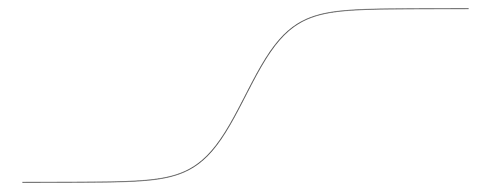

适合新冠肺炎的基本流行病学模型是 SEIR 模型。该模型基于尚未暴露于病毒的*易感*个体、*暴露的*但无症状的已感染但尚未传播病毒的个体、*感染的*有症状并传播病毒的个体、*移除的*已从感染中康复或死亡的个体。个人按照前面提到的顺序经历这些阶段。

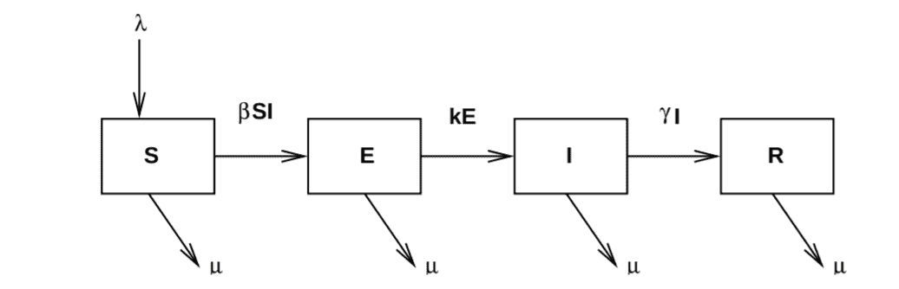

从一个状态到另一个状态的速率方程可以表示为如下的一阶微分方程:

*d(s)/dt =-βsi+λ-s*

*d(E)/dt =βSI(+k)E*

*d(I)/dt = kE(γ+)I*

*d(R)/dt =γIR*

其中，β是有效接触率，λ是出生率、死亡率，k 是从接触到感染的进展率，γ是清除率。为了模拟新冠肺炎，λ和可以安全地设置为零。进展率 k 是个体平均孵化率的倒数。清除率是恢复时间和死亡时间的加权平均值的倒数。

在这样的模型中，R[0] 为:

有关新型冠状病毒特定车型的详细信息，请参见本文的附录[这里](https://www.who.int/bulletin/online_first/20-255695.pdf)。SEIR 模型的 python 笔记本实现可以在[这里](https://github.com/ryansmcgee/seirsplus/tree/master/examples)找到。

Gabriel Goh 的[流行病计算器](http://gabgoh.github.io/COVID/index.html)是一个很好的工具，它可以让你根据上面的 SEIR 模型使用不同的数字来影响传播动态，并了解对人口的影响(根据干预开始的时间)。[托马斯·普约](https://medium.com/@tomaspueyo/coronavirus-act-today-or-people-will-die-f4d3d9cd99ca)在一个系列中做了一些很棒的分析，其中的第二部分决定了如果在疫情蔓延的整个过程中什么都不做，美国会有什么样的结果。下图可以看到。

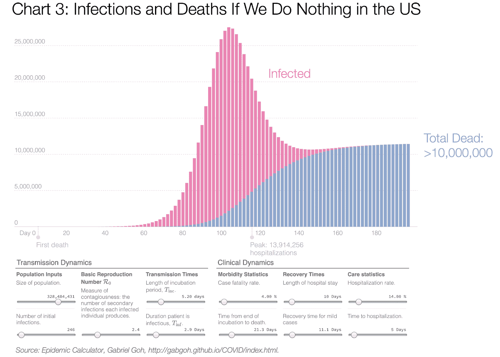

源代码可以在[这里](https://github.com/gabgoh/epcalc)找到。

在《华盛顿邮报》的这篇文章中可以找到另一篇惊人的文章，它让我们看到了流行病是如何传播的。作者设计了几个场景的模拟，其中人们(显示为点)自由移动，被迫接受隔离，遵守社会距离措施等。可视化使得理解流行病的传播更加直观。隔离受感染的病人如何影响人群的一个形象化的例子可以在下面看到。

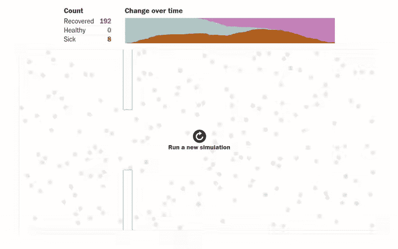

同一篇文章中的另一个有趣的模拟显示了社会距离对人口的影响:当只有八分之一的人口被允许流动时会发生什么。

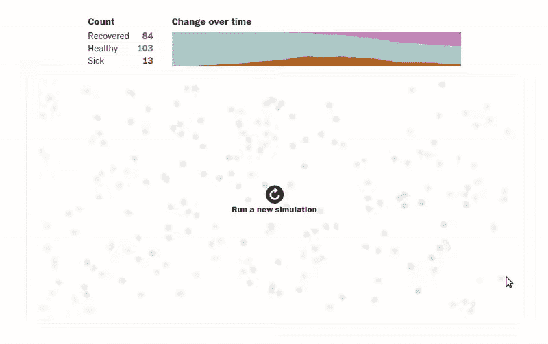

## 新冠肺炎（新型冠状病毒肺炎）

新冠肺炎疾病是由新型冠状病毒病毒引起的，这是一种大小在 60-140 纳米之间的β冠状病毒。冠状病毒通常导致 20%的普通感冒，MERS 和 SARS 是已知的严重感染病例。[感染人类的病毒似乎来自蝙蝠或穿山甲](https://www.nature.com/articles/s41591-020-0820-9)，与这两种动物体内自然传播的冠状病毒具有大致相同的相似性。最初爆发的主要源头是武汉海鲜市场，但病毒是否起源于此尚属推测，但未经证实。它最初被认为是一种新型非细菌性肺炎，因为在 12 月中旬肺炎相关死亡人数激增。直到[12 月 30 日，病原体才被确认为冠状病毒](https://www.nejm.org/doi/full/10.1056/NEJMoa2001017)。

与 SARS-CoV-1 相似，病毒利用病毒外壳上的刺突蛋白进入宿主细胞。[这种蛋白质附着在人类 ACE2 受体](https://link.springer.com/article/10.1007/s00134-020-05985-9)上，促进病毒和人类细胞膜的融合，并将病毒基因组插入人类细胞的细胞质中。

主要的临床症状是[发烧、咳嗽、肌肉酸痛和呼吸困难](https://marlin-prod.literatumonline.com/pb-assets/journals/trends/molecular-medicine/TRMOME-D-20-00044.pdf)，尽管这些症状在人与人之间并不一致。[最近的研究](https://science.sciencemag.org/content/early/2020/03/13/science.abb3221)也显示，相当一部分被感染的人没有表现出任何症状。在严重的情况下，疾病发展为 ARDS(急性呼吸窘迫综合征)、心律失常(心律不齐)和器官衰竭(肺/心脏/肾脏)。

## 冠状病毒危机

截至 2020 年 4 月 20 日，这种新型冠状病毒已经传播到至少 180 个国家，[全球感染人数超过 240 万，死亡人数超过 16.6 万](https://www.aljazeera.com/news/2020/01/timeline-china-coronavirus-spread-200126061554884.html)。迄今为止，欧洲受到的冲击最大。意大利死于新冠肺炎的人数最多，其次是西班牙、法国和英国。受到这场危机严重影响的其他国家包括伊朗、美国、德国和土耳其。为了应对危机和几个国家未能应对病毒的威胁，印度[宣布完全封锁](https://www.nytimes.com/2020/03/24/world/asia/india-coronavirus-lockdown.html)，并于最近将其延长至 5 月 3 日。

为了让研究更容易获得，并过滤掉错误信息，我们将尝试收集尽可能多的不同数据来源以及为解决危机而采取的不同举措。

### 冠状病毒危机的数据

您可以使用多种资源来收集数据，包括死亡人数、感染人数以及根据不同国家、地区和时间统计的康复人数。

> 利用这些数据，可以跟踪病毒的传播，确定风险区域，并相应地实施预防措施。

以下是一些不断更新危机数据的来源。

#### 约翰·霍普斯金

[约翰·霍普金斯大学系统科学与工程中心(JHU·CSSE)](https://systems.jhu.edu/)维护着一个基于网络的仪表板，它跟踪上面提到的不同数字，并在交互式地图上显示它们。这些数字还专门针对不同国家和不同国家的不同省份。还可以找到一些描述指数增长的死亡和感染的有趣图表。为该项目收集的数据是公开的，任何人都可以访问，可以在[这里](https://github.com/CSSEGISandData/COVID-19)找到。在更新仪表板之前，他们确认了来自几个不同政府组织的统计数据，包括世卫组织、中国疾病预防控制中心、加拿大政府等。关于这项努力的更多信息可以在[的博客文章](https://systems.jhu.edu/research/public-health/ncov/)中找到。你可以点击查看实时仪表盘[。](https://www.arcgis.com/apps/opsdashboard/index.html#/bda7594740fd40299423467b48e9ecf6)

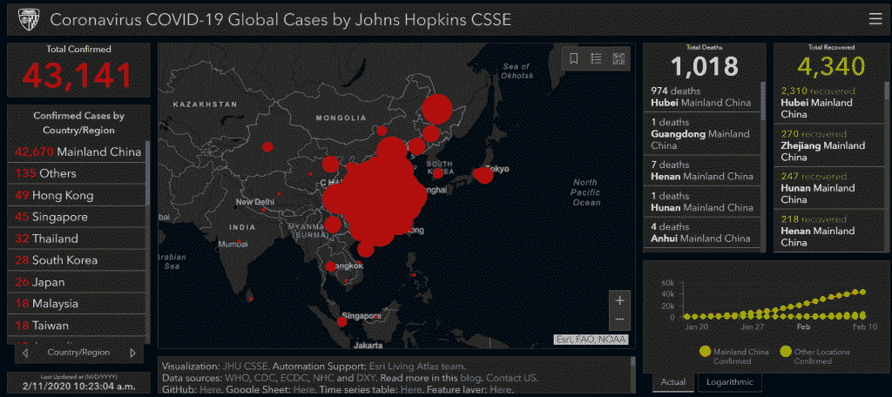

#### Woldometer

Worldometer 还收集并定期更新活跃病例、危重病例和死亡病例的数量。有几个关于病毒潜伏期的静态图和研究片段，以及新感染和新恢复病例的病例图，这可能有助于确定疫情的[拐点](https://plos.figshare.com/articles/_Three_phases_of_growth_in_a_typical_sigmoidal_curve_/879524)。任何有兴趣了解新冠肺炎的数据与 2003 年非典危机有何相似之处的人都可以在这里找到世卫组织关于疫情非典的数据。

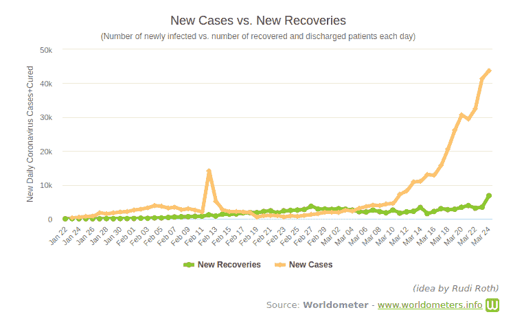

### 数据分析

已经发表了许多文章，这些文章描绘了死亡人数、康复情况等。在不同的国家。几个仪表板(如上所述)以数字和统计数据、图表、饼图、地图、热图等形式提供了关于疫情的世界现状的可视化效果。因此，我们不会在本文中关注这些分析。

托马斯·普约(发表于 3 月 10 日和 20 日)的两篇系列文章[做了一些很好的数据分析。第一部分有 30 多个译本。该系列第一部分中的一个更重要的图表(如下所示)描述了中国湖北冠状病毒相关事件的时间表。](https://medium.com/@tomaspueyo/coronavirus-act-today-or-people-will-die-f4d3d9cd99ca)

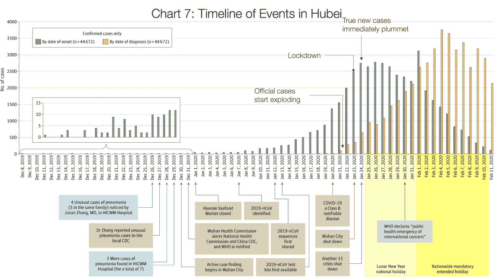

橙色条显示诊断出的病例，灰色条显示实际感染人数。真正的病例只能通过回顾过去，并确定那些被诊断的人的症状开始的时间来发现。Pueyo 在这篇文章中指出:

> *“这意味着橙色条柱向您展示当局所知的情况，灰色条柱则展示真实发生的情况…”*

在封锁一段时间后，诊断病例的数量迅速增加，并在此后不久开始减少，而实际冠状病毒病例的数量在封锁后迅速减少。

> "*如果你把橙色条叠加到 1/22，你会得到* *444 种情况。现在把所有的灰色条加起来。它们加起来大约有 12，000 个案例。所以当武汉自认为有 444 例时，实际上多了 27 倍。如果法国认为它有 1400 个病例，它很可能有数万个病例。*”

确诊病例数量迅速增加，然后开始下降，只是因为一个地区的医疗机构增加了医疗设施，同时实施了足够严格的隔离，以立即发现新病例，并避免将病毒暴露给未感染人群。他在文章中还提到:

> 直到 1 月 23 日武汉奥运会闭幕，你可以看看灰色的图表:它正呈指数增长。真实案例呈爆炸式增长。武汉一关闭，病例就慢下来了。1 月 24 日，当另外 15 个城市关闭时，真实病例的数量(再次，灰色)停滞不前。

他还强调了韩国的情况，在那里，病毒在最初的 30 天里被控制住了，直到一个病人把它传染给了成千上万的人。虽然他们的遏制努力可以在他们的传播计数中清楚地看到，但他们仍然为这一失误付出代价。

### 病毒序列

共享所有流感数据的全球倡议组织(Global Initiative on Sharing All influence Data)正在领导一项大规模的工作，以共享来自几个不同国家的新冠肺炎的基因组序列，使独立研究人员和组织更容易更好地了解该病毒，并有望开发出疫苗。这些数据包括来自中国、匈牙利、澳大利亚和越南等地的序列。基于这些数据， [Nexstrain](https://nextstrain.org/ncov) 已经创建了一个交互式仪表板，让您可以根据时间和地理可视化新冠肺炎的传播，以及提交给 GISAID 或由其收集的基因组序列。请记住，在 ORF1b 和 S 基因中看到的高突变率也在 SARS-CoV-1 中看到，但它们没有可观察到的影响，很可能是[中性突变](https://en.wikipedia.org/wiki/Neutral_mutation)的例子。

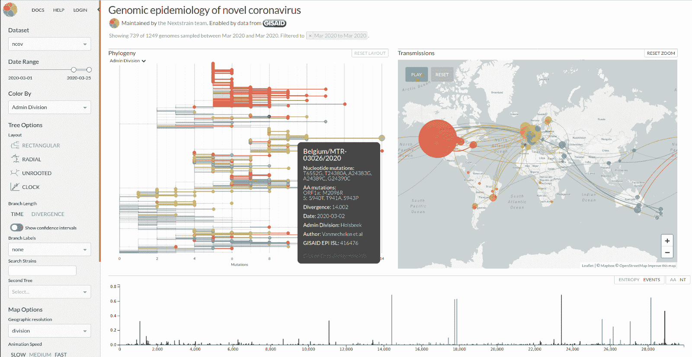

你可以悬停在不同的数据点上，找到核苷酸突变、分歧和其他有趣的数据分析。你也可以在这里阅读他们最新的形势报告，他们分析了 723 个公开共享的新冠肺炎基因组。你可以在他们的 [GitHub](https://github.com/nextstrain/ncov) 上看到用于分析的脚本，并了解如何从[这篇叙述](https://nextstrain.org/narratives/trees-background/)中阅读系统进化树。

与 GISAID 类似，[中国国家生物信息中心](https://bigd.big.ac.cn/ncov/)一直在收集不同冠状病毒的基因组序列。这些序列可供任何感兴趣的人下载。下载部分也提到了序列的质量。数据已经被分析用于[基因分型图](https://bigd.big.ac.cn/ncov/network)可视化、[贝叶斯系统树](https://bigd.big.ac.cn/ncov/tree)和[变异频率热图](https://bigd.big.ac.cn/ncov/variation/heatmap)等。更多序列数据可在 [NCBI SARS-Cov-2 序列页面](https://www.ncbi.nlm.nih.gov/genbank/sars-cov-2-seqs/)获得。

该病毒大小为 30 KB，这意味着它由 30，000 个 RNA 核苷酸组成(A/U/G/C)。由于它是由 RNA 构成的病毒，所以它表现出较高的突变率(一个字母变成另一个字母)。[这是正常的](https://www.nature.com/articles/s41564-020-0690-4)，没有证据表明这些变化会对临床结果产生任何可观察到的影响。然而，它对于追踪感染是有用的，因为一旦突变发生，它将在病毒的所有子代中可见，从而导致进一步的感染。

## 检测试剂盒、疫苗和治疗方法

在查看标准测试策略时，[存在两种重要的技术](https://www.wired.com/story/everything-you-need-to-know-about-coronavirus-testing/)。PCR(聚合酶链式反应)是一种 DNA 扩增技术，用于将少量 DNA 转化为大量 DNA，以便进行分析。结合荧光染料，PCR 可以告诉科学家有多少 DNA，这有助于确定病原体是否感染了人。

SARS-Cov-2 基因组是由单链 RNA 组成的，它必须转化为 DNA 才能进行 PCR。这是在一种叫做逆转录酶的酶的帮助下完成的。结合这两种技术，我们得到了 RT-PCR，这是目前可用于检测新冠肺炎的方法。如果你有所有需要的试剂，测试本身只需要一天的时间。样本从患者喉咙或鼻子的后部收集，运送到测试实验室，并通过使用一种名为 RNA 提取的过程将 RNA 从所有其他物质——蛋白质、细胞和酶——中分离出来，为测试做准备。一旦完成，用逆转录酶将 RNA 转化成 DNA，用 PCR 扩增病毒的 DNA，所用的核苷酸和引物将与病毒基因组的特定片段结合。如果一切顺利，它只会放大包含病毒的 DNA 片段，而不会放大其他任何东西。所有这些都发生在 PCR 机器中，该机器只有经过生物安全 3 级(以及最近的 BSL2)许可培训的个人才能操作，并且在几所大学和研究实验室中都可以使用。世卫组织实验室测试指导文件可在[这里](https://www.who.int/emergencies/diseases/novel-coronavirus-2019/technical-guidance/laboratory-guidance)找到。

RT-PCR 测试是测试病原体的通用方法，需要针对不同感染和疾病的方案；用什么 RNA 提取方法，用什么 PCR 仪，用什么引物。世卫组织为 T2 新冠肺炎 T3 推荐的方案 T1 包括使用四个引物进行测试:其中两个针对 SARS-Cov-2 基因组的区域，有助于创建一种封装和保护病毒的蛋白质，一个针对整个 SARS 样病毒，第四个针对人类基因组，作为阳性质量控制。

[抗体检测试剂盒](https://www.medrxiv.org/content/10.1101/2020.03.17.20037713v1)另一方面，检测身体针对疾病产生的抗体。这可以检测出已经从感染中康复的人，因为抗体在康复后会持续几周。这不能用于诊断，因为感染后身体需要 7-10 天才能产生可检测水平的抗体，但可用于估计疾病的无症状传播。这些测试的另一个优点是它们能在半小时内返回结果。

目前有两种疫苗正在进行临床试验，另外 52 种正在等待批准进行临床试验。在目前处于临床试验中的两种方法中，LNP 包裹的 mRNA 是一种新的疫苗接种方法，它通过注射编码病毒蛋白的 mRNA 来工作，然后被免疫系统拾取。

世卫组织正在一项名为“团结”的大规模研究中对治疗新冠肺炎的有希望的候选药物进行测试。目前正在测试的由其他疾病改造而来的四种治疗方法是:

1.  抗 HIV 药物利托那韦/洛匹那韦
2.  Remdesivir ，这是一种抗埃博拉药物，在发现单克隆抗体后被放弃
3.  **氯喹和羟氯喹**，为非专利抗疟药
4.  利托那韦/洛匹那韦与**干扰素-β**

## 减轻

要控制疫情，有几件事情必须协同努力，包括加速和积极的检测和追踪、病例隔离和检疫、社会距离和对病毒传播方式的认识，以及每个家庭可以做些什么来最大限度地保护亲人的安全。

### 卫生和寻求医疗保健

《世卫组织公众指南》敦促人们集体遵守一定的卫生标准，并注意降低自己和周围其他人感染病毒的风险。

建议每个人都应该:

*   经常洗手以杀死可能在你手上的病毒和病原体。
*   避免接触眼睛、鼻子和嘴巴，因为一旦被污染，你的手可以通过呼吸道将病毒转移到肺部，增加感染的风险。
*   练习呼吸卫生；咳嗽或打喷嚏时捂住嘴或鼻子，以减少将疾病传播给他人的机会。
*   避免接触表面。根据表面的类型，病毒倾向于在表面停留几个小时到几天。如果有，立即洗手。
*   如果您发烧、咳嗽或呼吸困难，请尽早寻求医疗帮助，以避免危及自己和他人的生命。这也将有助于国家当局更清楚地了解你所在地区的情况，以便他们能够相应地设计缓解战略。

### 积极测试和接触追踪

对抗感染的最好方法是通过对所有已知和疑似病例及其接触者进行积极的重复检测，正如 T2 的应对措施所示。只有当你意识到这些病例时，你才能通过隔离和隔离患者来有效地防止其传播。有感染风险的个人应该经常检测，因为一个人在出现症状之前就可以传播疾病。这反映在世卫组织[的通信](https://www.who.int/dg/speeches/detail/who-director-general-s-opening-remarks-at-the-media-briefing-on-covid-19---16-march-2020)中概括为“测试、测试、测试”。

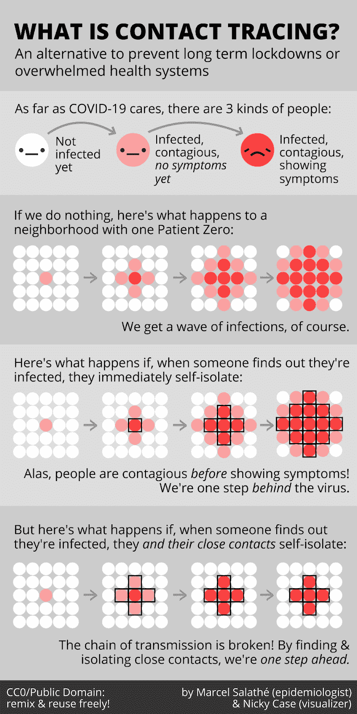

### 戴口罩

戴口罩的功效最近一直是一个有争议的话题。一些支持者错误地将南韩、日本和新加坡对新冠肺炎的成功回应归因于面具的作用。有证据表明，当感染者戴口罩时，戴口罩可以降低其他人被感染的风险。如果你有任何新冠肺炎症状，强烈建议你戴上口罩。目前世卫组织的指导方针不建议没有症状的人戴口罩，但许多国家正在实施政策，要求外出时戴口罩。世卫组织的指导方针最初是为了防止医护人员和其他在高风险环境中的重要工作人员缺乏口罩。鼓励在有充足供应的情况下佩戴自制口罩或普通口罩。不过，N95 口罩只应由高风险环境中的人或免疫力低下的人佩戴，而不应由普通公众佩戴。

还有一个问题是，人们感觉受到了保护，并以更危险的行为作为补偿。即使戴着口罩，也应该始终优先保持物理距离，避免接触面部或口罩。取下面罩时必须小心，以免接触到外部区域，并在取下面罩后立即洗手。不应该长时间佩戴口罩。外科口罩摘下后应立即丢弃在密闭的垃圾箱中。可重复使用的口罩每次使用后都要用洗涤剂清洗。

### 隔离和社会距离

在研究缓解策略时，Pueyo 的文章提到了英国对 ICU 病床的需求，用于不同类型的社会距离措施。

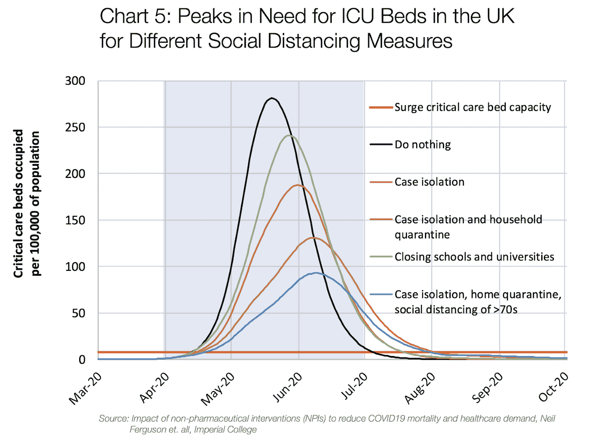

从图表中可以清楚地看到社会距离的影响:随着措施越来越严格，峰值的开始被推迟，同时总体上峰值降低。这使我们的死亡人数减少，有更多的时间来加强我们的医疗保健系统，同时降低医疗保健系统超载和崩溃的可能性。拥有一个不负担过重的医疗系统的另一个隐藏的好处是传染病会传播到护士、公共卫生工作者等。也降低了，这相当于许多目前被感染的人。

在正经历封锁的国家，人们偏执地认为实施的社交距离措施可能会延长，不仅是几周，而是几个月。除了这样一个事实，即有人主张这样的封锁是冒着国家经济崩溃的风险，没有以积极的速度部署适量的测试设施，社会距离措施没有做太多，但推迟了疫情。连续几个月不实施宵禁也有可能缓解危机。

## 结论

为了总结危机和缓解策略，让我们看看托马斯·普约系列的另一个非常重要的图表。

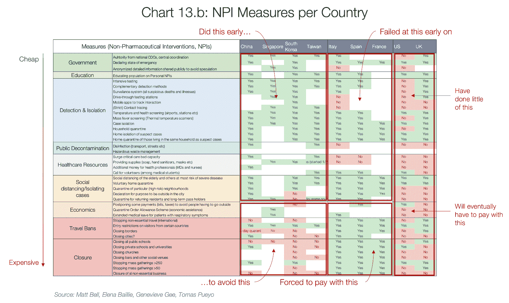

图表列出了抑制病毒的所有不同方法。看看新加坡、韩国和台湾等成功应对这种病毒的国家，很明显，通过检测、隔离、公共去污、医疗资源和社会距离等方面的适当努力，可以共同减缓和减少这种致命病毒的影响。如果各国能够在早期遏制危机，它们可能不必关闭公立和私立学校、大学、宗教场所等。但如果不采取措施，各国可能会被迫以经济萎缩和一些基本服务长期关闭来支付。

## 进一步阅读

1.  [https://www.ncbi.nlm.nih.gov/books/NBK21523/](https://www.ncbi.nlm.nih.gov/books/NBK21523/)
2.  [https://www . who . int/emergencies/diseases/novel-coronavirus-2019](https://www.who.int/emergencies/diseases/novel-coronavirus-2019)
3.  [https://meltingasphalt.com/interactive/outbreak/](https://meltingasphalt.com/interactive/outbreak/)
4.  https://www . science mag . org/news/2020/03/coronavirus-cases-has-dropped-through-Korean-whats-secret-its-success
5.  [https://www.nytimes.com/article/coronavirus-timeline.html](https://www.nytimes.com/article/coronavirus-timeline.html)