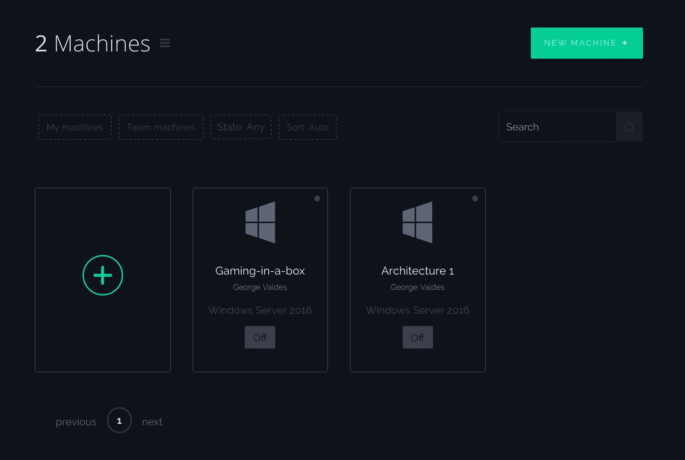
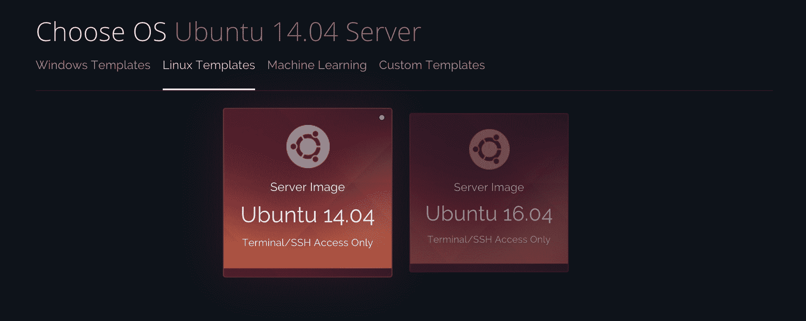
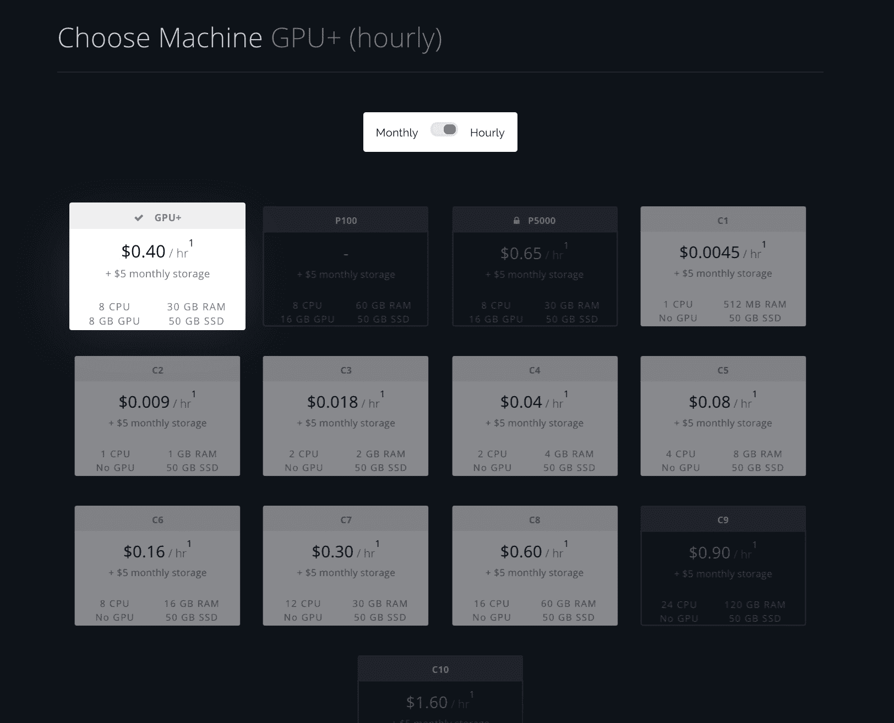
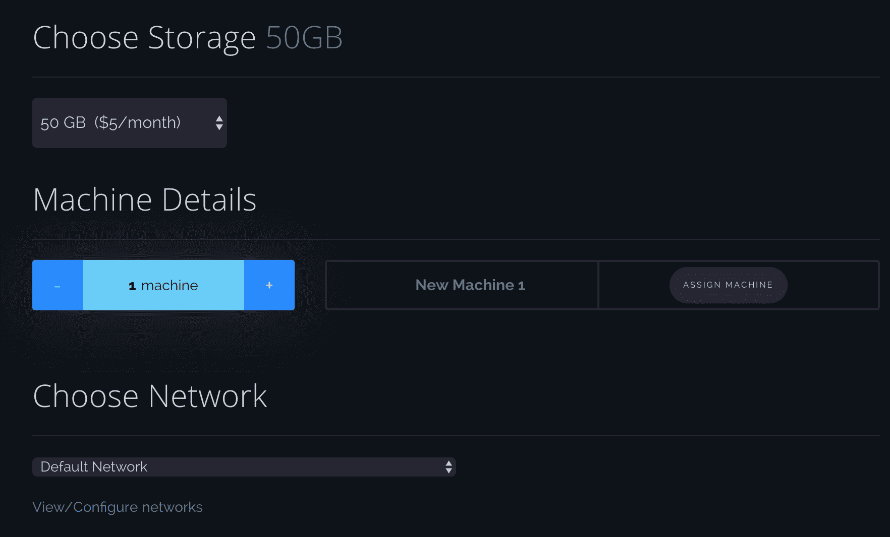
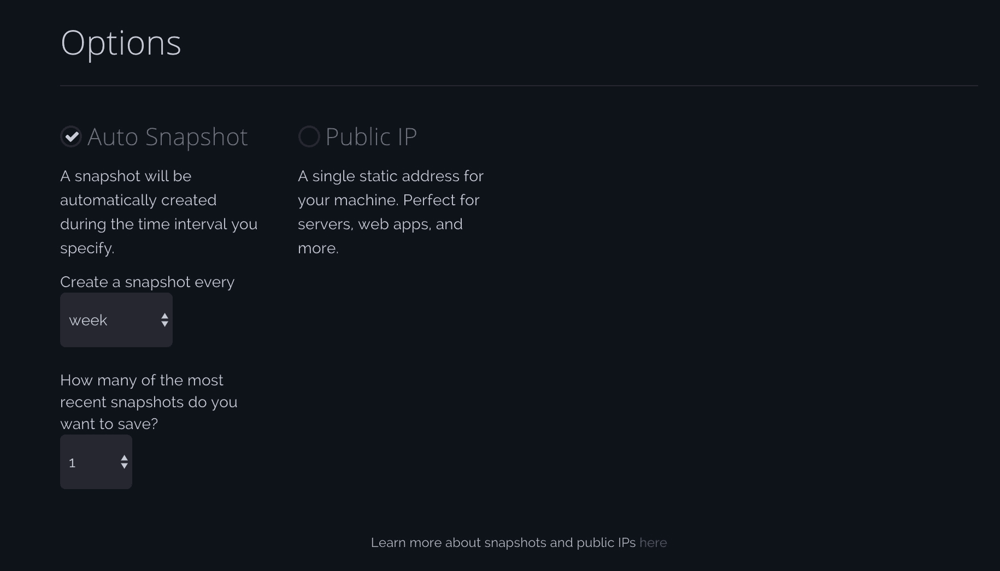

# CPU 实例入门(Linux)

> 原文：<https://blog.paperspace.com/cpu-instances/>

CPU 实例允许您在各种用例中按需扩展计算能力。我们很高兴地宣布他们在我们的最新版本中的可用性。在这里，我们将带您通过这些步骤来开始旋转您自己的。

* * *

**1。报名**

如果你还没有注册，要知道你需要有一张信用卡才能开始注册。

* * *

**2。转到机器创建**

选择新机器或+符号将带您进入入职流程的相同部分。

* * *

**3。选择您的地区**

* * *

**4。选择您的操作系统**

CPU 实例目前仅适用于 Ubuntu 14.04 和 Ubuntu 16.04

* * *

**5。选择您的 CPU 实例**

完全灰显且不可访问的磁贴目前要么即将推出，要么限量发行。如果你有兴趣进入，请联系 hello@paperspace.com。

* * *

**6。选择您的存储器、相同规格的机器数量，并设置您的网络**

在机器详细信息下，您现在可以添加具有相同规格的额外机器，并根据您的意愿命名它们。

* * *

**7。添加附加选项**

默认情况下，自动快照是打开的，但如果您愿意，也可以将其关闭。

* * *

**8。付款**

在右手边，你可以看到一个正在运行的计算器。

创建您的 Paperspace 计算机后，您将返回到控制台，在那里您可以实时看到它们的配置状态。

* * *

立即注册[,开始使用您自己的 CPU 实例！](https://www.paperspace.com/account/signup?utm_campaign=blog)