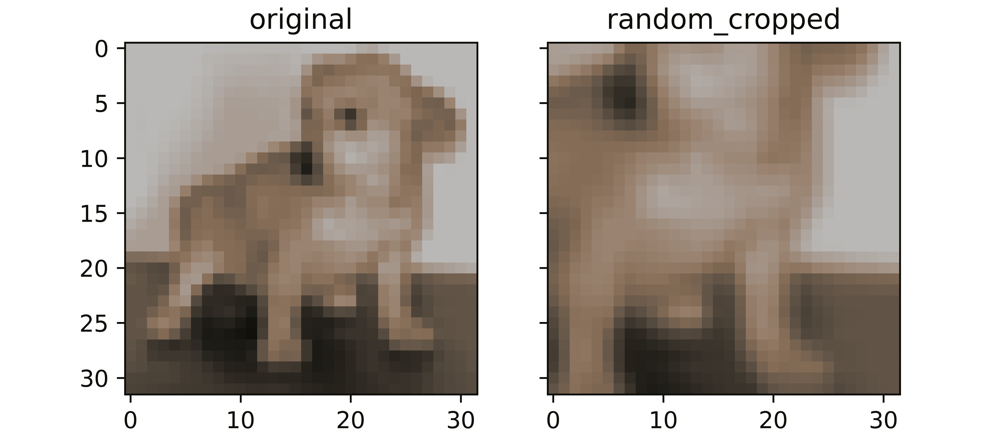
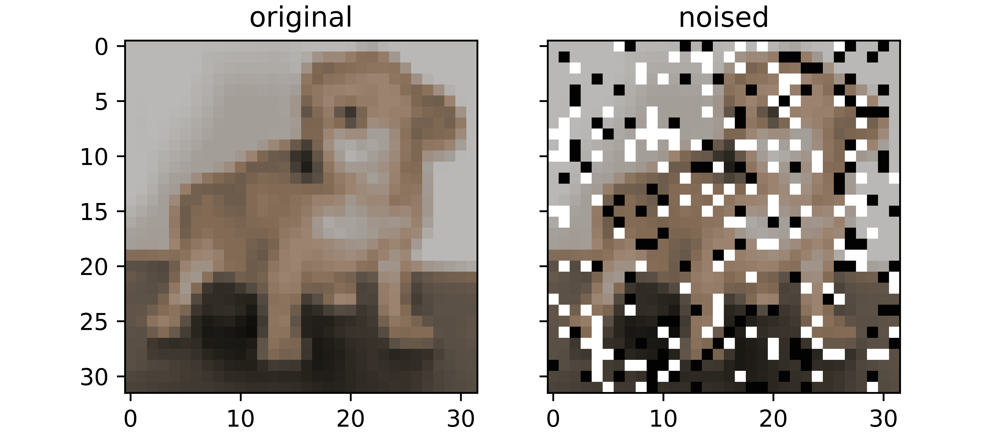
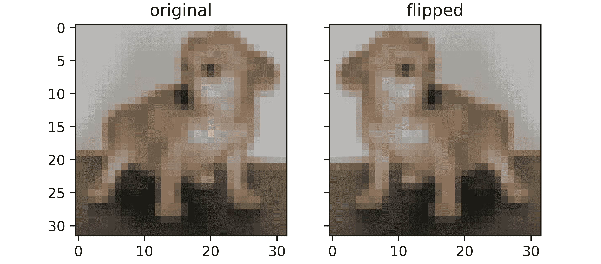
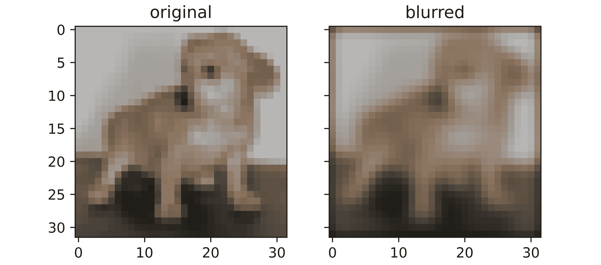
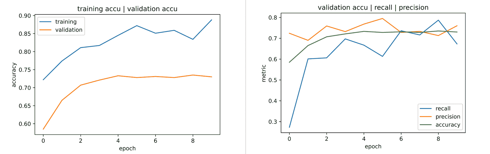

# 数据扩充:一种类不平衡缓解措施

> 原文：<https://blog.paperspace.com/data-augmentation-a-class-imbalance-mitigative-measure/>

在上一篇文章中，我们讨论了类不平衡对 convnet 性能的影响，以及特定模型目标的实现。我们还讨论了一些有助于处理类不平衡的方法，在这一点上提到了上采样。在本文中，我们将更详细地了解上采样，看看它如何应用于图像数据。

```py
#  article dependencies
import torch
import torch.nn as nn
import torch.nn.functional as F
import torchvision
import torchvision.transforms as transforms
import torchvision.datasets as Datasets
from torch.utils.data import Dataset, DataLoader
import numpy as np
import matplotlib.pyplot as plt
import cv2
from tqdm.notebook import tqdm
from tqdm import tqdm as tqdm_regular
import seaborn as sns
from torchvision.utils import make_grid
import random
```

```py
#  setting up device
if torch.cuda.is_available():
  device = torch.device('cuda:0')
  print('Running on the GPU')
else:
  device = torch.device('cpu')
  print('Running on the CPU')
```

### 上采样

不平衡数据集环境中的上采样指的是将少数类中的图像数量提高到与多数类中的图像数量相匹配的过程。正如我前面提到的，这可以通过为少数类收集更多的数据来实现，也可以通过从现有数据中创建新的数据实例来补充差异。从先前存在的数据创建新数据实例的过程被称为 ***数据扩充*** 。

### 图像数据增强

至于图像，我们如何从那些已经存在的图像中生成新的图像呢？我们不一定需要利用生成模型(尽管这是一个非常可行的选择)。一个简单得多的技术是创建原始图像的副本，并对它们进行足够微妙的转换，以使它们被视为新图像。

请记住，我们可以把图像想象成一堆像素——像素是代表强度的数字。如果我们找到转换或处理这些数字的方法，我们可以得到一组新的数字，它们保留了原始图像的大部分整体属性，同时又足够清晰，可以被视为一个不同的图像。如果这被存档，卷积神经网络将把增强的图像视为全新的图像实例，从而帮助补充数据集。

### 图像增强技术

在这一节中，我们将看看一些常见的图像增强技术。然而，应该注意的是，这绝不是一个详尽的清单。

#### 随机种植

随机裁剪是一种增强技术，其中图像的随机片段被裁剪，从而使其聚焦。原始图像的这种裁剪版本将丢失一些像素，本质上使其成为自己独特的图像。除了作为一种增强技术之外，随机裁剪可以帮助在模型中添加一些冗余，因为用随机裁剪增强图像训练的模型可以具有识别图像的能力，即使当感兴趣的对象不在全景中时。

```py
def random_crop(dataset: list, crop_size=(20, 20)):
  """
  This function replicates the random crop process
  """
  cropped = []
  images = [x[0] for x in dataset]
  for image in tqdm_regular(images):
    # deriving image size
    img_size = image.shape

    #  extracting channels
    channel_0, channel_1, channel_2 = image[:,:,0], image[:,:,1], image[:,:,2]

    #  deriving random indicies
    idx_row = random.randint(0, img_size[0] - crop_size[0])
    idx_column = random.randint(0, img_size[0] - crop_size[0])

    #  cropping image per channel
    channel_0 = channel_0[idx_row:idx_row + crop_size[0], 
                          idx_column:idx_column + crop_size[1]]
    channel_1 = channel_1[idx_row:idx_row + crop_size[0], 
                          idx_column:idx_column + crop_size[1]]
    channel_2 = channel_2[idx_row:idx_row + crop_size[0], 
                          idx_column:idx_column + crop_size[1]]

    #  stacking images
    image = np.dstack((channel_0, channel_1, channel_2))

    #  resizing image
    image = cv2.resize(image, (32, 32))
    #  labelling and appending to list
    cropped.append((image, 1))
  return cropped 
```



#### 图像噪声

一种增强技术，有目的地“破坏”图像中的随机像素，以创建一个完全不同的图像的幻觉。这种损坏是通过随机将一些像素转换为白色或黑色来实现的。通过噪声增强的图像具有与其原始版本完全不同的亮度的某些像素，从而被感知为不同的。

```py
def noise_image(dataset: list, noise_intensity=0.2):
  """
  This function replicates the image noising process
  """
  noised = []
  noise_threshold = 1 - noise_intensity
  images = [x[0] for x in dataset]

  for image in tqdm_regular(images):
    #  extracting channels
    channel_0, channel_1, channel_2 = image[:,:,0], image[:,:,1], image[:,:,2]

    #  flatenning channels
    channel_0 = channel_0.reshape(1024)
    channel_1 = channel_1.reshape(1024)
    channel_2 = channel_2.reshape(1024)

    #  creating vector of zeros
    noise_0 = np.zeros(1024, dtype='uint8')
    noise_1 = np.zeros(1024, dtype='uint8')
    noise_2 = np.zeros(1024, dtype='uint8')

    #  noise probability
    for idx in range(1024):
      regulator = round(random.random(), 1)
      if regulator > noise_threshold:
        noise_0[idx] = 255
        noise_1[idx] = 255
        noise_2[idx] = 255
      elif regulator == noise_threshold:
        noise_0[idx] = 0
        noise_1[idx] = 0
        noise_2[idx] = 0
      else:
        noise_0[idx] = channel_0[idx]
        noise_1[idx] = channel_1[idx]
        noise_2[idx] = channel_2[idx]

    #  reshaping noise vectors
    noise_0 = noise_0.reshape((32, 32))
    noise_1 = noise_1.reshape((32, 32))
    noise_2 = noise_2.reshape((32, 32))

    #  stacking images
    image = np.dstack((noise_0, noise_1, noise_2))
    #  labelling and appending to list
    noised.append((image, 1))
  return noised
```



#### 图像翻转

图像翻转是图像处理中的主要技术，是一种增强技术，其中像素的行或列的排列被反转，产生镜像效果。当图像翻转时，其像素的排列会有效地改变，从而使它们被感知为与原始图像不同。

```py
def flip_image(dataset: list):
  """
  This function replicates the process of horizontal flipping
  """
  flipped = []
  images = [x[0] for x in dataset]

  for image in tqdm_regular(images):
    #  extracting channels
    channel_0, channel_1, channel_2 = image[:,:,0], image[:,:,1], image[:,:,2]

    channel_0 = channel_0[:, ::-1]
    channel_1 = channel_1[:, ::-1]
    channel_2 = channel_2[:, ::-1]

    #  stacking images
    image = np.dstack((channel_0, channel_1, channel_2))
    #  labelling and appending to list
    flipped.append((image, 1))
  return flipped
```



#### 图像模糊

另一种图像处理规则，模糊作为一种增强技术，其中像素强度全面变化，以便在模糊版本中创建一种模糊效果。由于像素值发生了变化，模糊版本被视为像素级别的全新图像。

```py
def blur_image(dataset, kernel_size=5, padding=True):
  """This function performs convolution over an image
   with the aim of blurring"""

  #  defining internal function for padding
  def pad_image(image, padding=2):
    """
    This function performs zero padding using the number of 
    padding layers supplied as argument and return the padded
    image.
    """
    #  extracting channels
    channel_0, channel_1, channel_2 = image[:,:,0], image[:,:,1], image[:,:,2]

    #  creating an array of zeros
    padded_0 = np.zeros((image.shape[0] + padding*2, 
                         image.shape[1] + padding*2), dtype='uint8')
    padded_1 = np.zeros((image.shape[0] + padding*2, 
                         image.shape[1] + padding*2), dtype='uint8')
    padded_2 = np.zeros((image.shape[0] + padding*2, 
                         image.shape[1] + padding*2), dtype='uint8')

    #  inserting image into zero array
    padded_0[int(padding):-int(padding), 
             int(padding):-int(padding)] = channel_0
    padded_1[int(padding):-int(padding), 
             int(padding):-int(padding)] = channel_1
    padded_2[int(padding):-int(padding), 
             int(padding):-int(padding)] = channel_2

    #  stacking images
    padded = np.dstack((padded_0, padded_1, padded_2))

    return padded

  #  defining list to hold blurred images
  all_blurred = []

  #  defining gaussian 5x5 filter
  gauss_5 = np.array([[1, 4, 7, 4, 1],
                     [4, 16, 26, 16, 4],
                     [7, 26, 41, 26, 7],
                     [4, 16, 26, 16, 4],
                     [1, 4, 7, 4, 1]])

  filter = 1/273 * gauss_5

  #  extracting images
  images = [x[0] for x in dataset]

  for image in tqdm_regular(images):
    if padding:
      image = pad_image(image)
    else:
      image = image

    #  extracting channels
    channel_0, channel_1, channel_2 = image[:,:,0], image[:,:,1], image[:,:,2]

    #  creating an array to store convolutions
    blurred_0 = np.zeros(((image.shape[0] - kernel_size) + 1, 
                          (image.shape[1] - kernel_size) + 1), dtype='uint8')
    blurred_1 = np.zeros(((image.shape[0] - kernel_size) + 1, 
                          (image.shape[1] - kernel_size) + 1), dtype='uint8')
    blurred_2 = np.zeros(((image.shape[0] - kernel_size) + 1, 
                          (image.shape[1] - kernel_size) + 1), dtype='uint8')

    #  performing convolution
    for i in range(image.shape[0]):
      for j in range(image.shape[1]):
        try:
          blurred_0[i,j] = (channel_0[i:(i+kernel_size), j:(j+kernel_size)] * filter).sum()
        except Exception:
          pass

    for i in range(image.shape[0]):
      for j in range(image.shape[1]):
        try:
          blurred_1[i,j] = (channel_1[i:(i+kernel_size), j:(j+kernel_size)] * filter).sum()
        except Exception:
          pass

    for i in range(image.shape[0]):
      for j in range(image.shape[1]):
        try:
          blurred_2[i,j] = (channel_2[i:(i+kernel_size), j:(j+kernel_size)] * filter).sum()
        except Exception:
          pass

    #  stacking images
    blurred = np.dstack((blurred_0, blurred_1, blurred_2))
    #  labelling and appending to list
    all_blurred.append((blurred, 1))

  return all_blurred
```



### 把所有的放在一起

在本节中，我们将利用上面定义的增强技术对上一篇文章中的数据集进行上采样，其中我们有 4:1 的类别不平衡(80%的猫，20%的狗)。为此，我们将使用 CIFAR-10 数据集，该数据集可以使用下面的代码单元加载到 PyTorch 中。

```py
#  loading training data
training_set = Datasets.CIFAR10(root='./', download=True,
                              transform=transforms.ToTensor())

#  loading validation data
validation_set = Datasets.CIFAR10(root='./', download=True, train=False,
                                transform=transforms.ToTensor())
```

我们现在将使用如下定义的函数从数据集中提取猫和狗的图像。

```py
def extract_images(dataset):
  """
  This function helps to extract cat and dog images
  from the cifar-10 dataset
  """
  cats = []
  dogs = []

  for idx in tqdm_regular(range(len(dataset))):
    if dataset.targets[idx]==3:
      cats.append((dataset.data[idx], 0))
    elif dataset.targets[idx]==5:
      dogs.append((dataset.data[idx], 1))
    else:
      pass
  return cats, dogs

#  extracting from the training set
train_cats, train_dogs = extract_images(training_set)
#  extracting from the validation set
val_cats, val_dogs = extract_images(validation_set)
```

#### 通过增强对训练图像进行上采样

在关于类别不平衡的文章中，我们通过使用前 4800 张猫图片和前 1200 张狗图片(即`data = train_cats[:4800] + train_dogs[:1200]`)建立了有利于猫的 4:1 不平衡。为了发挥协同作用，我们将保持相同的主题，这意味着我们需要用 3600 张图片增加的狗图片。

为了保持简单，我们将利用上述三种增强方法，用每种方法产生原始图像的 1200 个增强版本。

```py
#  deriving images of interest
dog_images = train_dogs[:1200]

#  creating random cropped copies
dog_cropped = random_crop(dog_images)

#  creating flipped copies
dog_flipped = flip_image(dog_images)

#  creating noised copies
dog_noised = noise_image(dog_images)
```

#### 拼凑一个数据集

既然转换后的副本已经就绪，我们现在需要做的就是为训练集和验证集整合数据集。

```py
#  creating a dataset of 4,800 dog images
train_dogs = dog_images + dog_cropped + dog_flipped + dog_noised

#  instantiating training data
training_images = train_cats[:4800] + train_dogs
random.shuffle(training_images)

#  instantiating validation data
validation_images = val_cats + val_dogs
random.shuffle(validation_images)
```

接下来，我们需要定义一个类，以便能够从我们的自定义数据集创建 PyTorch 数据集。

```py
#  defining dataset class
class CustomCatsvsDogs(Dataset):
  def __init__(self, data, transforms=None):
    self.data = data
    self.transforms = transforms

  def __len__(self):
    return len(self.data)

  def __getitem__(self, idx):
    image = self.data[idx][0]
    label = torch.tensor(self.data[idx][1])

    if self.transforms!=None:
      image = self.transforms(image)
    return(image, label)

 #  creating pytorch datasets
training_data = CustomCatsvsDogs(training_images, transforms=transforms.Compose([transforms.ToTensor(),
                                                                                 transforms.Normalize((0.5, 0.5, 0.5), (0.5, 0.5, 0.5))]))
validation_data = CustomCatsvsDogs(validation_images, transforms=transforms.Compose([transforms.ToTensor(),
                                                                                     transforms.Normalize((0.5, 0.5, 0.5), (0.5, 0.5, 0.5))]))
```

#### 转换类别

在训练 convnet 的过程中，我们需要定义一个类，使我们能够将训练、验证、度量计算和日志记录以及模型利用打包到一个对象中，如下所示。

```py
class ConvolutionalNeuralNet_2():
  def __init__(self, network):
    self.network = network.to(device)
    self.optimizer = torch.optim.Adam(self.network.parameters(), lr=1e-3)

  def train(self, loss_function, epochs, batch_size, 
            training_set, validation_set):

    #  creating log
    log_dict = {
        'training_loss_per_batch': [],
        'validation_loss_per_batch': [],
        'training_accuracy_per_epoch': [],
        'training_recall_per_epoch': [],
        'training_precision_per_epoch': [],
        'validation_accuracy_per_epoch': [],
        'validation_recall_per_epoch': [],
        'validation_precision_per_epoch': []
    } 

    #  defining weight initialization function
    def init_weights(module):
      if isinstance(module, nn.Conv2d):
        torch.nn.init.xavier_uniform_(module.weight)
        module.bias.data.fill_(0.01)
      elif isinstance(module, nn.Linear):
        torch.nn.init.xavier_uniform_(module.weight)
        module.bias.data.fill_(0.01)

    #  defining accuracy function
    def accuracy(network, dataloader):
      network.eval()

      all_predictions = []
      all_labels = []

      #  computing accuracy
      total_correct = 0
      total_instances = 0
      for images, labels in tqdm(dataloader):
        images, labels = images.to(device), labels.to(device)
        all_labels.extend(labels)
        predictions = torch.argmax(network(images), dim=1)
        all_predictions.extend(predictions)
        correct_predictions = sum(predictions==labels).item()
        total_correct+=correct_predictions
        total_instances+=len(images)
      accuracy = round(total_correct/total_instances, 3)

      #  computing recall and precision
      true_positives = 0
      false_negatives = 0
      false_positives = 0
      for idx in range(len(all_predictions)):
        if all_predictions[idx].item()==1 and  all_labels[idx].item()==1:
          true_positives+=1
        elif all_predictions[idx].item()==0 and all_labels[idx].item()==1:
          false_negatives+=1
        elif all_predictions[idx].item()==1 and all_labels[idx].item()==0:
          false_positives+=1
      try:
        recall = round(true_positives/(true_positives + false_negatives), 3)
      except ZeroDivisionError:
        recall = 0.0
      try:
        precision = round(true_positives/(true_positives + false_positives), 3)
      except ZeroDivisionError:
        precision = 0.0
      return accuracy, recall, precision

    #  initializing network weights
    self.network.apply(init_weights)

    #  creating dataloaders
    train_loader = DataLoader(training_set, batch_size)
    val_loader = DataLoader(validation_set, batch_size)

    #  setting convnet to training mode
    self.network.train()

    for epoch in range(epochs):
      print(f'Epoch {epoch+1}/{epochs}')
      train_losses = []

      #  training
      print('training...')
      for images, labels in tqdm(train_loader):
        #  sending data to device
        images, labels = images.to(device), labels.to(device)
        #  resetting gradients
        self.optimizer.zero_grad()
        #  making predictions
        predictions = self.network(images)
        #  computing loss
        loss = loss_function(predictions, labels)
        log_dict['training_loss_per_batch'].append(loss.item())
        train_losses.append(loss.item())
        #  computing gradients
        loss.backward()
        #  updating weights
        self.optimizer.step()
      with torch.no_grad():
        print('deriving training accuracy...')
        #  computing training accuracy
        train_accuracy, train_recall, train_precision = accuracy(self.network, train_loader)
        log_dict['training_accuracy_per_epoch'].append(train_accuracy)
        log_dict['training_recall_per_epoch'].append(train_recall)
        log_dict['training_precision_per_epoch'].append(train_precision)

      #  validation
      print('validating...')
      val_losses = []

      #  setting convnet to evaluation mode
      self.network.eval()

      with torch.no_grad():
        for images, labels in tqdm(val_loader):
          #  sending data to device
          images, labels = images.to(device), labels.to(device)
          #  making predictions
          predictions = self.network(images)
          #  computing loss
          val_loss = loss_function(predictions, labels)
          log_dict['validation_loss_per_batch'].append(val_loss.item())
          val_losses.append(val_loss.item())
        #  computing accuracy
        print('deriving validation accuracy...')
        val_accuracy, val_recall, val_precision = accuracy(self.network, val_loader)
        log_dict['validation_accuracy_per_epoch'].append(val_accuracy)
        log_dict['validation_recall_per_epoch'].append(val_recall)
        log_dict['validation_precision_per_epoch'].append(val_precision)

      train_losses = np.array(train_losses).mean()
      val_losses = np.array(val_losses).mean()

      print(f'training_loss: {round(train_losses, 4)}  training_accuracy: '+
      f'{train_accuracy}  training_recall: {train_recall}  training_precision: {train_precision} *~* validation_loss: {round(val_losses, 4)} '+  
      f'validation_accuracy: {val_accuracy}  validation_recall: {val_recall}  validation_precision: {val_precision}\n')

    return log_dict

  def predict(self, x):
    return self.network(x)
```

接下来，我们需要为这个二进制分类任务定义一个卷积神经网络。出于本文的考虑，我们将使用下面代码块中定义的自定义构建的 convnet。

```py
class ConvNet(nn.Module):
  def __init__(self):
    super().__init__()
    self.conv1 = nn.Conv2d(3, 8, 3, padding=1)
    self.batchnorm1 = nn.BatchNorm2d(8)
    self.conv2 = nn.Conv2d(8, 8, 3, padding=1)
    self.batchnorm2 = nn.BatchNorm2d(8)
    self.pool2 = nn.MaxPool2d(2)
    self.conv3 = nn.Conv2d(8, 32, 3, padding=1)
    self.batchnorm3 = nn.BatchNorm2d(32)
    self.conv4 = nn.Conv2d(32, 32, 3, padding=1)
    self.batchnorm4 = nn.BatchNorm2d(32)
    self.pool4 = nn.MaxPool2d(2)
    self.conv5 = nn.Conv2d(32, 128, 3, padding=1)
    self.batchnorm5 = nn.BatchNorm2d(128)
    self.conv6 = nn.Conv2d(128, 128, 3, padding=1)
    self.batchnorm6 = nn.BatchNorm2d(128)
    self.pool6 = nn.MaxPool2d(2)
    self.conv7 = nn.Conv2d(128, 2, 1)
    self.pool7 = nn.AvgPool2d(3)

  def forward(self, x):
    #-------------
    # INPUT
    #-------------
    x = x.view(-1, 3, 32, 32)

    #-------------
    # LAYER 1
    #-------------
    output_1 = self.conv1(x)
    output_1 = F.relu(output_1)
    output_1 = self.batchnorm1(output_1)

    #-------------
    # LAYER 2
    #-------------
    output_2 = self.conv2(output_1)
    output_2 = F.relu(output_2)
    output_2 = self.pool2(output_2)
    output_2 = self.batchnorm2(output_2)

    #-------------
    # LAYER 3
    #-------------
    output_3 = self.conv3(output_2)
    output_3 = F.relu(output_3)
    output_3 = self.batchnorm3(output_3)

    #-------------
    # LAYER 4
    #-------------
    output_4 = self.conv4(output_3)
    output_4 = F.relu(output_4)
    output_4 = self.pool4(output_4)
    output_4 = self.batchnorm4(output_4)

    #-------------
    # LAYER 5
    #-------------
    output_5 = self.conv5(output_4)
    output_5 = F.relu(output_5)
    output_5 = self.batchnorm5(output_5)

    #-------------
    # LAYER 6
    #-------------
    output_6 = self.conv6(output_5)
    output_6 = F.relu(output_6)
    output_6 = self.pool6(output_6)
    output_6 = self.batchnorm6(output_6)

    #--------------
    # OUTPUT LAYER
    #--------------
    output_7 = self.conv7(output_6)
    output_7 = self.pool7(output_7)
    output_7 = output_7.view(-1, 2)

    return F.softmax(output_7, dim=1)
```

#### 训练卷积神经网络

通过利用我们在上一节中定义的 convnet 并将其实例化为卷积神经网络类的成员(也在上一节中定义),我们现在可以使用如下定义的参数来训练我们的 conv net 10 个时期。

```py
#  training model
model = ConvolutionalNeuralNet_2(ConvNet())

log_dict = model.train(nn.CrossEntropyLoss(), epochs=10, batch_size=64, 
                       training_set=training_data, validation_set=validation_data)
```

#### 分析结果

回顾一下，在类不平衡的文章中，当我们在不平衡的数据集上训练一个模型时，我们得到了一个训练准确率为 80%，验证准确率为 50%，验证召回率为 0%的模型。这表明该模型是不加选择的，只是简单地将所有图像实例预测为猫。

然而，正如我们所做的那样，在增强数据上训练模型产生了如下图所示的结果。总的来说，在整个训练过程中，训练和验证的准确性都有所提高，尽管验证的准确性从第 5 个时期开始就趋于稳定。

然而，主要关注的是验证指标，从第 3 个时期开始验证准确度约为 73%，验证召回率不是 0%，事实上，到第 9 个时期，它攀升到高达 78%，这表明该模型现在实际上是有区别的，即使我们已经使用增强图像用于训练目的。可以通过尝试其他增强方法或调整类权重来进一步调整性能。



#### 寻找最佳技术

您可能已经注意到，我没有选择模糊作为该数据集的增强方法。那是因为我实际上已经尝试过了，但没有产生理想的结果。事实上，某些数据集具有对它们最有效的增强技术方案，因此，必须为正在处理的任何数据集找到最佳技术。

### 结束语

在本文中，我们将数据扩充作为一种处理类不平衡的上采样技术。我们进一步详细讨论了一些图像增强技术，以及它们如何在 Python 中实现。此后，我们扩充了一个数据集，并使用该数据集训练了一个 convnet，结果显示它产生了合理的验证准确性和召回分数。