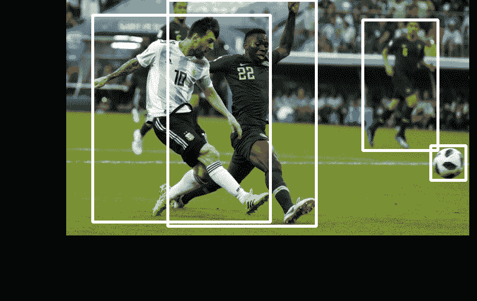
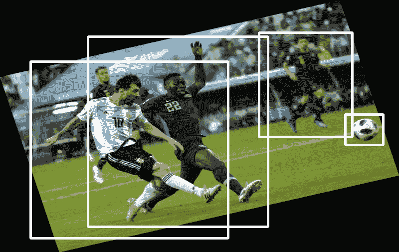
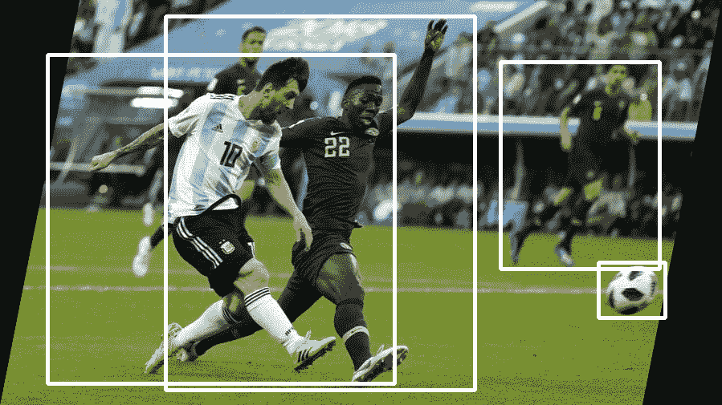
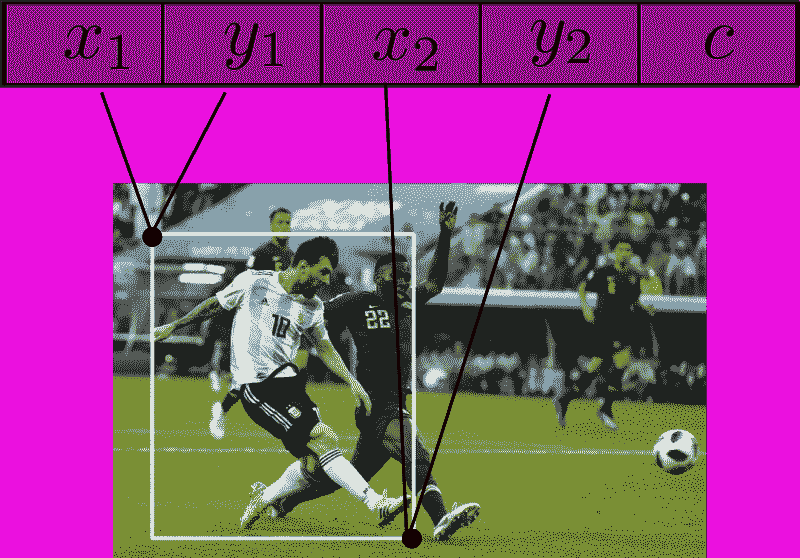
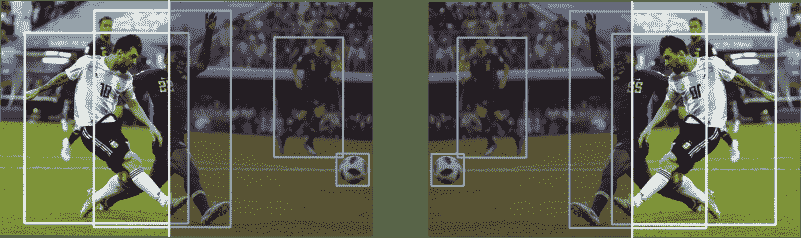
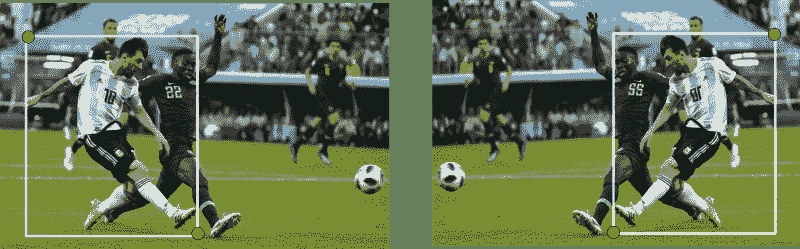
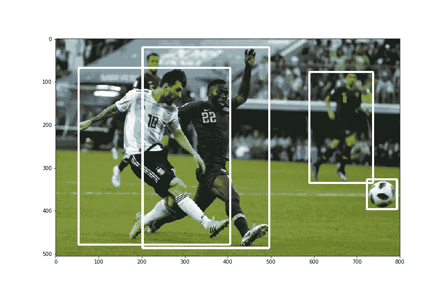
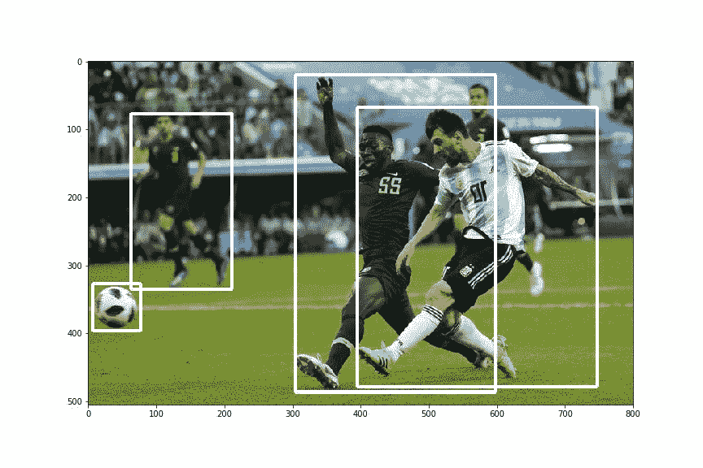

# 包围盒的数据扩充:重新思考对象检测的图像变换

> 原文：<https://blog.paperspace.com/data-augmentation-for-bounding-boxes/>

当谈到从深度学习任务中获得良好的表现时，数据越多越好。然而，我们可能只有有限的数据。数据扩充是解决数据短缺的一种方法，通过人为地扩充我们的数据集。事实上，这项技术已经被证明是如此成功，以至于它已经成为深度学习系统的一个主要部分。

## 数据增强为什么有效？

理解数据增强为什么有效的一个非常直接的方法是将它视为一种人工扩展数据集的方法。深度学习应用也是如此，数据越多越好。

理解数据增强为什么如此有效的另一种方式是将它视为我们数据集的附加噪声。在在线数据扩充的情况下尤其如此，或者每次我们将数据样本送入训练循环时随机扩充每个数据样本。


*Left*: Original Image, *Right*: Augmented Image.

每次神经网络看到相同的图像时，由于对其应用了随机数据增强，所以会有一点不同。这种差异可以被视为每次添加到我们的数据样本中的噪声，这种噪声迫使神经网络学习一般化的特征，而不是在数据集上过度拟合。

## GitHub 回购

本文和整个增强库的所有内容都可以在下面的 Github Repo 中找到。

[https://github . com/paper space/dataincreasionforobjectdetection](https://github.com/Paperspace/DataAugmentationForObjectDetection)

## 证明文件

这个项目的文档可以在你的浏览器中打开`docs/build/html/index.html`或者点击[链接](https://augmentationlib.paperspace.com/)找到。

这个系列有 4 个部分。
[1。第 1 部分:基础设计和水平翻转](https://blog.paperspace.com/data-augmentation-for-bounding-boxes/)
[2。第二部分:缩放和平移](https://blog.paperspace.com/data-augmentation-bounding-boxes-scaling-translation/)
[3。第三部分:旋转和剪切](https://blog.paperspace.com/data-augmentation-for-object-detection-rotation-and-shearing/)
[4。第 4 部分:烘焙增强到输入管道](https://blog.paperspace.com/data-augmentation-for-object-detection-building-input-pipelines/)

## 包围盒的对象检测

现在，许多深度学习库，如 torchvision、keras 和 Github 上的专业库，都为分类训练任务提供了数据增强。然而，仍然缺少对用于对象检测任务的数据扩充的支持。例如，为分类任务水平翻转图像的增强将看起来像上面的那个。

然而，为对象检测任务做同样的扩充也需要你更新边界框。比如这个。


Change of Bounding Boxes during Horizontal Flip

正是这种类型的数据扩充，或者具体地说，主要数据扩充技术**的检测等价物要求我们更新边界框**，我们将在这些文章中讨论。准确地说，这是我们将涉及的增强功能的确切列表。

1.  水平翻转(如上图所示)

2.缩放和平移



3.旋转



4.剪羊毛



5.为神经网络的输入调整大小

## 技术细节

我们将把我们小小的数据扩充库建立在 Numpy 和 OpenCV 的基础上。

我们将把我们的扩充定义为类，可以调用类的实例来执行扩充。我们将定义一个统一的方法来定义这些类，这样你也可以编写你自己的数据扩充。

我们还将定义一个数据扩充，它本身什么也不做，但是将数据扩充组合起来，以便它们可以在一个**序列**中应用。

对于每个数据扩充，我们将定义它的两个变体，一个**随机的**和一个**确定的**的。在随机模式中，增强是随机发生的，而在确定模式中，增强的参数(如要旋转的角度)是固定的。

## 数据扩充示例:水平翻转

本文将概述编写增广的一般方法。我们还将回顾一些实用功能，这将有助于我们可视化检测，以及其他一些东西。那么，我们开始吧。

## 存储注释的格式

对于每个图像，我们将边界框注释存储在一个 numpy 数组中，该数组有 *N* 行和 5 列。这里， *N* 表示图像中物体的数量，而五列表示:

1.  左上 *x* 坐标
2.  左上 *y* 坐标
3.  右下角 *x* 坐标
4.  右下角的 *y* 坐标
5.  对象的类别



Format for storing Bounding Box Annotations

我知道很多数据集，注释工具以其他格式存储注释，因此，我会让您将存储数据注释的任何存储格式转换为上述格式。

是的，出于演示的目的，我们将使用下面的图片，莱昂内尔·梅西在对尼日利亚的比赛中攻入了漂亮的一球。

### 文件组织

我们将代码保存在两个文件中，`data_aug.py`和`bbox_util.py`。第一个文件将包含用于扩充的代码，而第二个文件将包含用于辅助函数的代码。

这两个文件都位于一个名为`data_aug`的文件夹中

让我们假设你必须在你的训练循环中使用这些数据扩充。我将让您了解如何提取图像，并确保注释的格式正确。

然而，为了简单起见，让我们一次只使用一个图像。您可以轻松地将这段代码移到循环内部，或者您的数据获取函数来扩展功能。

将 github repo 克隆到包含您的训练代码文件或您需要进行增强的文件的文件夹中。

```py
git clone https://github.com/Paperspace/DataAugmentationForObjectDetection
```

### 随机水平翻转

首先，我们导入所有必要的东西，并确保添加了路径，即使我们从包含文件的文件夹之外调用函数。以下代码放在文件`data_aug.py`中

```py
import random
import numpy as np
import cv2
import matplotlib.pyplot as plt
import sys
import os

lib_path = os.path.join(os.path.realpath("."), "data_aug")
sys.path.append(lib_path)
```

将实施的数据增强是`RandomHorizontalFlip`，其以概率 *p.* 水平翻转图像

我们首先从定义类开始，它是`__init__`方法。init 方法包含增强的参数。对于这种增强，它是每个图像翻转的概率。对于另一个类似旋转的增强，它可以包含对象旋转的角度。

```py
class RandomHorizontalFlip(object):

    """Randomly horizontally flips the Image with the probability *p*

    Parameters
    ----------
    p: float
        The probability with which the image is flipped

    Returns
    -------

    numpy.ndaaray
        Flipped image in the numpy format of shape `HxWxC`

    numpy.ndarray
        Tranformed bounding box co-ordinates of the format `n x 4` where n is 
        number of bounding boxes and 4 represents `x1,y1,x2,y2` of the box

    """

    def __init__(self, p=0.5):
        self.p = p 
```

函数的 docstring 已经以 *Numpy* docstring 格式编写。这将有助于使用 Sphinx 生成文档。

每个函数的`__init__`方法用于定义增强的所有参数。然而，增强的实际逻辑是在`__call__`函数中定义的。

当从一个类实例调用调用函数时，该函数带有两个参数，`img`和`bboxes`，其中`img`是包含像素值的 OpenCV numpy 数组，`bboxes`是包含边界框注释的 numpy 数组。

`__call__`函数也返回相同的参数，这有助于我们将一系列要在序列中应用的增强链接在一起。

```py
def __call__(self, img, bboxes):
        img_center = np.array(img.shape[:2])[::-1]/2
        img_center = np.hstack((img_center, img_center))
        if random.random() < self.p:
            img =  img[:,::-1,:]
            bboxes[:,[0,2]] += 2*(img_center[[0,2]] - bboxes[:,[0,2]])

            box_w = abs(bboxes[:,0] - bboxes[:,2])

            bboxes[:,0] -= box_w
            bboxes[:,2] += box_w

        return img, bboxes
```

让我们一点一点地了解这里发生的一切。

在水平翻转中，我们围绕穿过图像中心的垂直线旋转图像。

然后，每个角的新坐标可以被描述为穿过图像中心的垂直线中的角的**镜像。对于数学上的倾斜，通过中心的**垂直线将是连接原始拐角和新的转换拐角的线的垂直平分线。****

为了更好地理解正在发生的事情，请看下图。变换图像的右半部分和原始图像的左半部分中的像素是彼此关于中心线的镜像。



以上是通过下面这段代码完成的。

```py
img_center = np.array(img.shape[:2])[::-1]/2
img_center = np.hstack((img_center, img_center))
if random.random() < self.p:
   img =  img[:,::-1,:]
   bboxes[:,[0,2]] += 2*(img_center[[0,2]] - bboxes[:,[0,2]])
```

注意,`img = img[:,::-1,:]`行基本上是获取包含图像的数组，并在第一维度(即存储像素值的 x 坐标的维度)反转它的元素。

然而，人们必须注意到左上角的镜像是结果框的右上角。事实上，结果坐标是边界框的右上角和左下角坐标。然而，我们需要它们在左上角和右下角的格式。



The side-effect of our code

下面这段代码负责转换。

```py
box_w = abs(bboxes[:,0] - bboxes[:,2])
bboxes[:,0] -= box_w
bboxes[:,2] += box_w 
```

最后，我们返回图像和包含边界框的数组。

### *水平翻转*的确定性版本

上面的代码以概率 *p* 随机地应用转换。然而，如果我们想要构建一个确定性版本，我们可以简单地将参数 *p* 作为 1 传递。或者我们可以写另一个类，其中我们根本没有参数 *p* ，并像这样实现`__call__`函数。

```py
def __call__(self, img, bboxes):
        img_center = np.array(img.shape[:2])[::-1]/2
        img_center = np.hstack((img_center, img_center))

        img =  img[:,::-1,:]
        bboxes[:,[0,2]] += 2*(img_center[[0,2]] - bboxes[:,[0,2]])

        box_w = abs(bboxes[:,0] - bboxes[:,2])

        bboxes[:,0] -= box_w
        bboxes[:,2] += box_w

    return img, bboxes
```

## 看到它的实际应用

现在，让我们假设你必须用*水平翻转*增强你的图像。我们将在一个图像上使用它，但是你可以在任何你喜欢的数字上使用它。首先，我们创建一个文件`test.py`。我们从进口所有好东西开始。

```py
from data_aug.data_aug import *
import cv2 
import pickle as pkl
import numpy as np 
import matplotlib.pyplot as plt
```

然后，我们导入图像并加载注释。

```py
img = cv2.imread("messi.jpg")[:,:,::-1] #OpenCV uses BGR channels
bboxes = pkl.load(open("messi_ann.pkl", "rb"))

#print(bboxes)   #visual inspection 
```

为了看看我们的增强是否真的起作用，我们定义了一个助手函数`draw_rect`，它接受`img`和`bboxes`并返回一个 numpy 图像数组，在该图像上绘制边界框。

让我们创建一个文件`bbox_utils.py`并导入必要的内容。

```py
import cv2 
import numpy as np
```

现在，我们定义函数`draw_rect`

```py
def draw_rect(im, cords, color = None):
    """Draw the rectangle on the image

    Parameters
    ----------

    im : numpy.ndarray
        numpy image 

    cords: numpy.ndarray
        Numpy array containing bounding boxes of shape `N X 4` where N is the 
        number of bounding boxes and the bounding boxes are represented in the
        format `x1 y1 x2 y2`

    Returns
    -------

    numpy.ndarray
        numpy image with bounding boxes drawn on it

    """

    im = im.copy()

    cords = cords.reshape(-1,4)
    if not color:
        color = [255,255,255]
    for cord in cords:

        pt1, pt2 = (cord[0], cord[1]) , (cord[2], cord[3])

        pt1 = int(pt1[0]), int(pt1[1])
        pt2 = int(pt2[0]), int(pt2[1])

        im = cv2.rectangle(im.copy(), pt1, pt2, color, int(max(im.shape[:2])/200))
    return im
```

一旦完成，让我们回到我们的`test.py`文件，并绘制原始的边界框。

```py
plt.imshow(draw_rect(img, bboxes))
```

这就产生了这样的东西。



让我们看看我们转型的效果。

```py
hor_flip = RandomHorizontalFlip(1)  

img, bboxes = hor_flip(img, bboxes)

plt.imshow(draw_rect(img, bboxes))
```

你应该得到这样的东西。



## 外卖课程

*   边界框注释应该存储在大小为 N×5 的 numpy 数组中，其中 N 是对象的数量，每个框由具有 5 个属性的行表示；**左上角的坐标，右下角的坐标，对象的类。**
*   每个数据扩充被定义为一个类，其中`__init__`方法用于定义扩充的参数，而`__call__`方法描述了扩充的实际逻辑。它接受两个参数，图像`img`和边界框注释`bboxes`，并返回转换后的值。

这就是这篇文章的内容。在下一篇文章中，我们将处理`Scale`和`Translate`增强。考虑到有更多的参数(缩放和平移因子)，它们不仅是更复杂的转换，而且还带来了一些我们在`HorizontalFlip`转换中不必应对的挑战。一个例子是，如果一个框的一部分在增强后的图像之外，则决定是否保留该框。