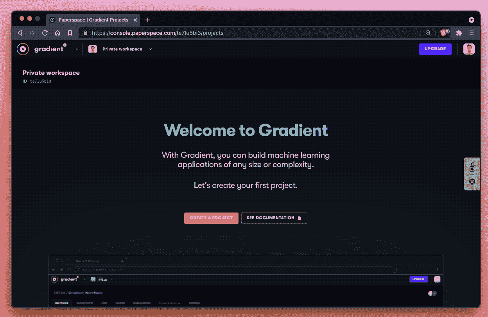
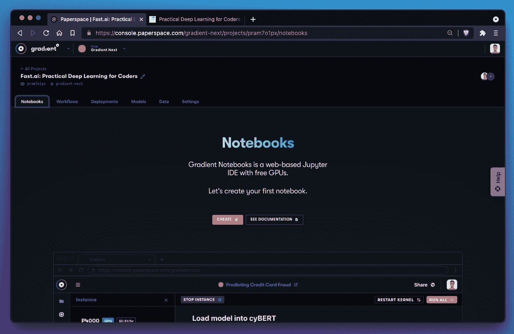
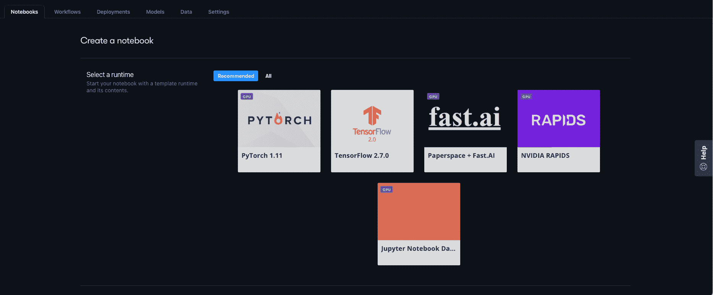
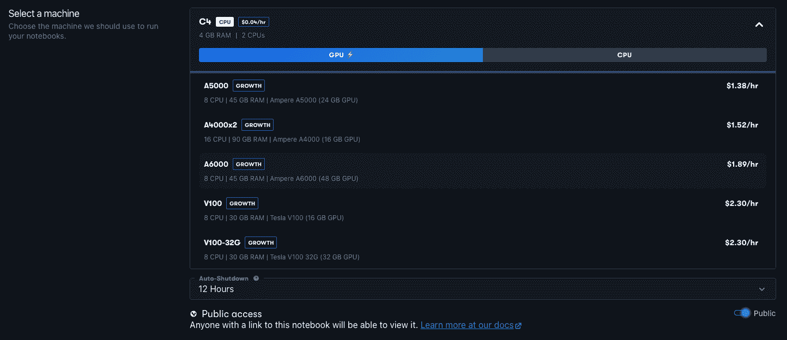
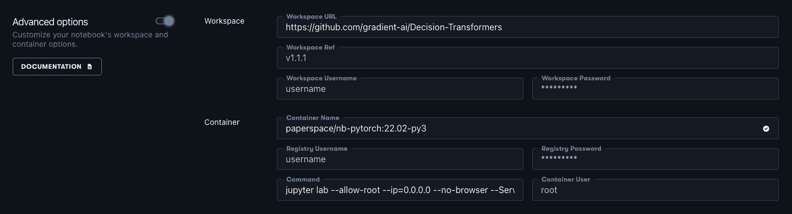
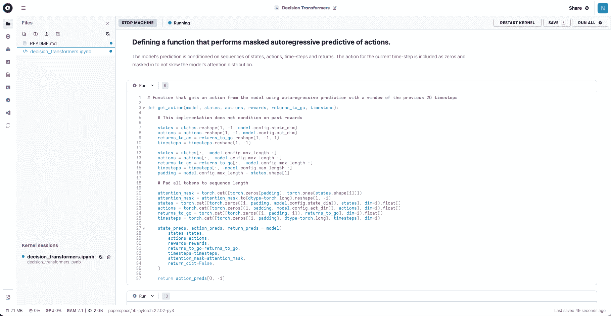

# 拥抱脸的决策变形金刚

> 原文：<https://blog.paperspace.com/decision-transformers-with-hugging-face/>

决策转换器是一种新型的机器学习模型，它使转换器与强化学习相结合，开辟了研究和应用的新途径。

最近，拥抱脸[在他们的博客](https://huggingface.co/blog/decision-transformers)上发布了这些，在这篇文章中，我们将展示如何开始与他们一起工作在 Paperspace Gradient 上。

你可以在高级选项中使用[这个链接](https://github.com/gradient-ai/Decision-Transformers)作为你的工作区 URL，运行一个渐变笔记本，亲自尝试一下。

## 什么是决策变形金刚？

决策变压器结合了[变压器](https://en.wikipedia.org/wiki/Transformer_(machine_learning_model))的能力来处理顺序数据(自然语言处理等)。)，以及[强化学习](https://en.wikipedia.org/wiki/Reinforcement_learning) (RL)递归提高环境中智能代理的能力。

RL 要解决的问题被转换为一系列步骤，然后用于训练变压器。这意味着代理不必在环境中进行学习，并且可以节省 RL 否则需要的大量计算能力。

因为代理在被训练时不在环境中，这被称为*离线强化学习*。

在常规 RL 中，代理学习在其环境中采取的行动，以最大化其未来回报。在离线 RL 中，转换器查看信息广播序列，并使用它来生成它应该做的未来序列。

换句话说，我们正在利用变形金刚擅长的东西——生成未来序列——来给 RL 提供我们想要的东西:一个从环境中获得回报的智能体。

因此，决策变压器代表了变压器和 RL 之间的融合，这是一个令人兴奋的前景，可以结合两者的力量。

关于决策变形金刚的更多信息，请参见[拥抱脸博客条目](https://huggingface.co/blog/decision-transformers)，或者[原始论文](https://arxiv.org/abs/2106.01345)。

## 你如何在 Paperspace 上运行它们？

我们最近[发布了我们笔记本](https://blog.paperspace.com/introducing-gradient-datasets-ide-updates/)的重大更新，现在使用 GPU 运行机器学习内容更加容易，无论是小规模的演示，还是大规模的解决实际问题。

虽然在 us 上运行的步骤数量比在 [HuggingFace 演示示例](https://huggingface.co/blog/decision-transformers)中使用的要多，后者基本上只运行一个步骤，但这里的过程与您在自己的真实项目中工作的过程是一样的。

首先，进入[console.paperspace.com](console.paperspace.com)登录 Paperspace 渐变控制台。如果您还没有帐户，您可以注册免费访问我们的免费远程 GPU，以及选择升级到更高质量的 GPU 机器可用的付费帐户。登录到 Paperspace 后，继续执行以下步骤。

### 1.创建项目

通过从左上方的下拉列表中进行选择，确保您处于图纸空间渐变而非核心。然后，您将看到如下屏幕:

Gradient's create a Project page

或者一个现有的项目列表，如果你在一个私人的工作空间或者团队中。

无论哪种方式，点击*创建一个项目*并给它命名，例如*决策变形金刚*。

### 2.创建笔记本

在您的新项目中，您将看到“笔记本”选项卡，它将引导您创建一个新的笔记本实例。然后，笔记本实例允许您管理和运行单个的`.ipynb` Jupyter 笔记本。

Gradient's create a Notebook page

笔记本创建通过一系列步骤来选择运行时(PyTorch、TensorFlow 等。)和机器类型(CPU，哪个 GPU 等。)你会喜欢的，再加上其他一些细节。

对于运行时，选择 PyTorch:

Select PyTorch runtime

### 3.选择 GPU

从可用类型列表中选择您的 GPU。有多种类型可供选择，从 Nvidia Maxwell M4000 到 Ampere A100，以及单 GPU 或多 GPU 设置。如果您想了解更多细节，我们最近对这些进行了基准测试。

Choose GPU

对于此演示，M4000 或 P4000 实际上已经足够了。

### 4.指向决策转换器 GitHub 库

默认情况下，我们的 PyTorch 运行时指向我们的快速启动 PyTorch repo，所以这里我们想改为指向决策转换器。

为此，打开*高级选项*，在*工作区*下，将工作区 URL 从 https://github.com/gradient-ai/PyTorch 的[更改为 https://github.com/gradient-ai/Decision-Transformers](https://github.com/gradient-ai/PyTorch)的[。其他选项可以保持原样。](https://github.com/gradient-ai/Decision-Transformers)

通过同样的方法，在创建一个笔记本作为工作目录内容时，您可以指向任何可访问的 repo。

Use decision transformer GitHub repo

### 5.启动笔记本

您的笔记本现在可以使用了！继续并单击开始笔记本。

这将需要几秒钟的时间来启动，然后您将看到笔记本屏幕，左侧导航栏中有一个文件列表。当任务栏左上角显示“正在运行”时，您就知道笔记本准备好了。

### 6.运行决策转换器

双击`decision_transformers.ipynb`打开笔记本文件，然后点击右上角的*运行所有*执行单元格。

Part of the decision transformers notebook on Paperspace

***注意***——如果第一次通过视频生成失败，点击*重启内核*然后*再次运行所有*重做。

这个笔记本是 Colab 上运行的拥抱脸决策变形金刚回购的原始版本的稍微修改版本。在库设置中有一些小的变化，一些行确保产生的单元集在 *Run All* 下仍然工作。

## 他们长什么样？

如果笔记本运行正常，您应该会看到一段经过培训的代理在其环境中穿行的视频，如下所示:

<https://blog.paperspace.com/content/media/2022/04/decision_transformer.mp4>

Decision transformer output

你可以看到模型表现得相当好，行驶了一段距离没有摔倒。

要查看更详细的代码，请运行笔记本，或者查看[拥抱脸博客条目](https://huggingface.co/blog/decision-transformers)以获得一些带解释的片段。

## 后续步骤

既然您已经在 Paperspace 上建立了一个有效的决策转换器，这就打开了一系列的可能性。

*   关于决策变形金刚的更多细节，参见[拥抱脸博客条目](https://huggingface.co/blog/decision-transformers)。这包括更多关于决策转换器的理论，到一些代表不同运动形式的预训练模型检查点的链接，模型学习的自回归预测函数的细节，以及一些模型评估。
*   为了**运行你自己的拥抱脸模型**，你可以像上面一样启动一个笔记本，并指向他们的回复，例如 https://github.com/huggingface/transformers。
*   为了**大规模运行**，例如进行更长时间的预训练或微调运行，请从我们选择的 Pascal、Volta 和 Ampere GPUs 或多 GPU 中进行选择，作为您笔记本电脑的计算能力。
*   要在生产环境中运行，请查看 Paperspace 的[工作流](https://docs.paperspace.com/gradient/workflows/)和部署。

决策转换器是我们现在在深度学习中看到的一些令人兴奋的融合的一部分，在这些融合中，以前独立领域的模型，如文本和计算机视觉，正在变得更加通用，并且能够跨多个领域。

甚至可能是跨文本、图像等工作的通用架构。例如[感知者 IO](https://huggingface.co/blog/perceiver) ，将能够用于解决大多数问题。

无论发生什么，诸如[拥抱 Face 的机器学习模型](https://huggingface.co/)和 [Paperspace 的端到端数据科学+ MLOps + GPU 基础设施](https://www.paperspace.com/)等功能的组合将继续向更多用户开放。