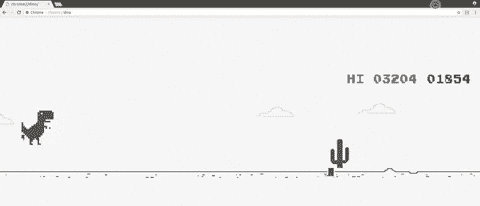
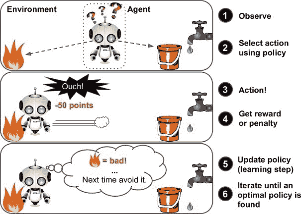
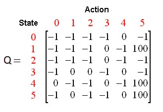
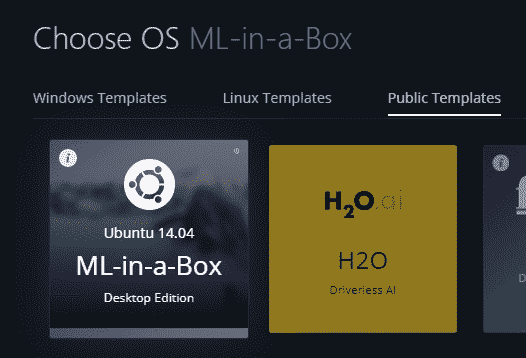
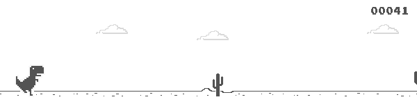
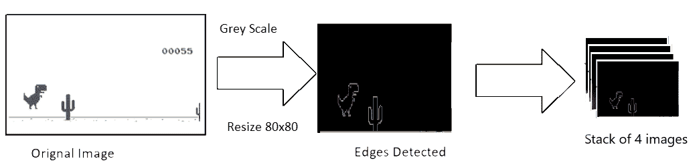
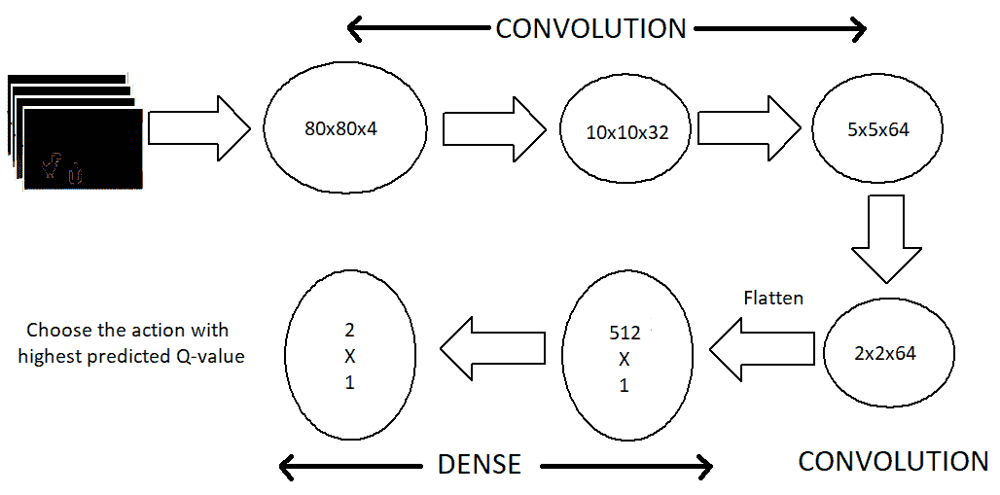
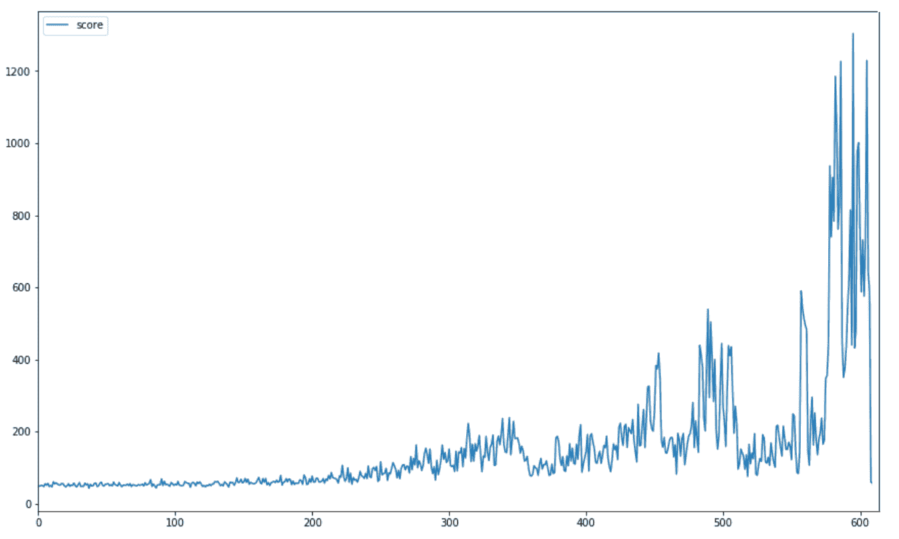
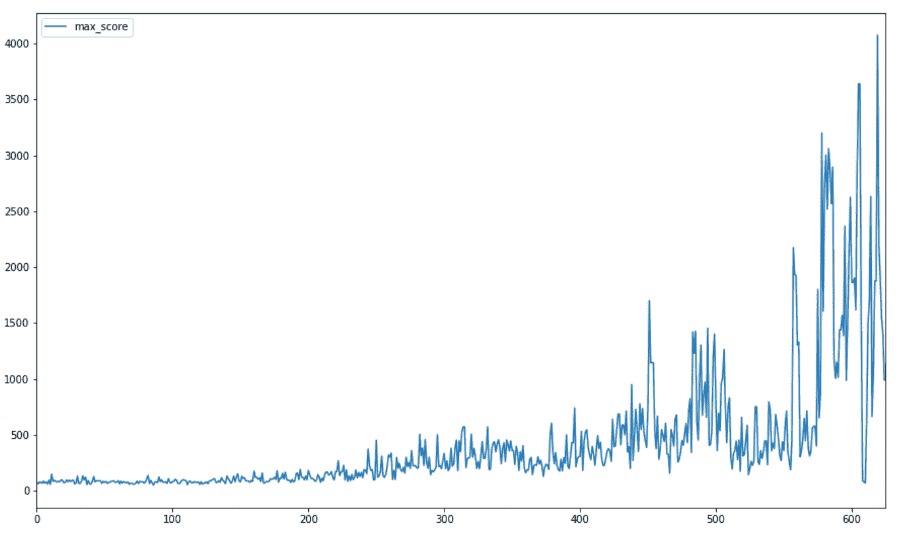

# 建立一个人工智能来玩恐龙快跑

> 原文：<https://blog.paperspace.com/dino-run/>

> 构建强化学习模型的教程

DeepMind 在 2013 年发表了一篇题为“[用深度强化学习玩雅达利](https://www.cs.toronto.edu/~vmnih/docs/dqn.pdf)”的文章，介绍了一种用于强化学习的新的深度学习模型，并展示了它在仅使用原始像素作为输入的情况下，掌握雅达利 2600 电脑游戏的困难控制策略的能力。在本教程中，我将使用 Keras 实现这篇论文。我们将从强化学习的基础开始，然后深入代码进行实际理解。

|  |
| --- |
| *AI 玩游戏* |

2018 年 3 月初开始做这个项目，得到了一些不错的结果。然而，只有 CPU 的系统是学习更多特性的瓶颈。强大的 GPU 极大地提高了性能。

在我们有一个运行模型之前，有许多步骤和概念需要我们理解。

**步骤:**

*   在浏览器(JavaScript)和模型(Python)之间建立双向接口
*   捕获和预处理图像
*   火车模型
*   评价

**源代码:**【https://github.com/Paperspace/DinoRunTutorial.git】T2

## 入门指南

为了训练和玩游戏，在使用
`git clone https://github.com/Paperspace/DinoRunTutorial.git`
设置好环境后克隆 GitHub 库，并在 jupyter 笔记本
`Reinforcement Learning Dino Run.ipynb`
上工作，确保第一次运行`init_cache()`来初始化文件系统结构。

## 强化学习

> 学走路的孩子

这对许多人来说可能是一个新词，但我们每个人都已经使用强化学习(RL)的概念学会了走路，这是我们大脑仍然如何工作的。奖励系统是任何 RL 算法的基础。如果我们回到儿童走路的类比，积极的奖励将是父母的拍手或够到糖果的能力，而消极的奖励将是没有糖果。然后，孩子在开始走路之前首先学会站立。就人工智能而言，智能体(在我们的例子中是 Dino)的主要目标是通过在环境中执行特定的动作序列来最大化某个数字奖励。RL 中最大的挑战是缺乏监督(标记数据)来指导代理。它必须自己探索和学习。代理从随机执行动作开始，观察每个动作带来的回报，并学会在面对类似的环境状态时预测最佳的可能动作

|  |
| --- |
| *普通强化学习框架* |

#### q 学习

我们使用 Q-learning，一种 RL 技术，在这里我们试图逼近一个特殊的函数，这个函数驱动任何环境状态序列的动作选择策略。Q-learning 是强化学习的无模型实现，其中针对每个状态、采取的行动和产生的奖励维护一个 Q 值表。一个样本 Q 表应该能让我们了解数据是如何构成的。在我们的例子中，状态是游戏截图和动作，什么都不做，跳转[0，1]

|  |
| --- |
| *样本 Q 表* |

我们利用深度神经网络通过回归来解决这个问题，并选择具有最高预测 Q 值的动作。要详细了解 Q-learning，请参考 Tambet Matiisen 的这篇[惊人的博文](https://ai.intel.com/demystifying-deep-reinforcement-learning/)。你也可以参考我的[以前的帖子](https://medium.com/acing-ai/how-i-build-an-ai-to-play-dino-run-e37f37bdf153)来了解 Q-learning 的所有超级参数

## 设置

让我们设置环境，开始培训过程。

**1。** **选择虚拟机:**我们需要一个完整的桌面环境，在这里我们可以捕获并利用屏幕截图进行培训。我选择了 Paperspace 的 ML-in-a-box (MLIAB) Ubuntu 图像。MLIAB 的优势在于它预装了 Anaconda 和许多其他 ML-library。

|  |
| --- |
| *盒子里的机器学习* |

**2。** **配置并安装 keras 使用 GPU:**
我们需要安装 Keras 和 tensorflow 的 GPU 版本
Paperspace 的虚拟机已经预装了这些，但如果没有安装它们
`pip install keras`
`pip install tensorflow`

此外，确保 GPU 被设置识别。执行下面的 python 代码，你应该会看到可用的 GPU 设备
`from keras import backend as K`
`K.tensorflow_backend._get_available_gpus()`

**3。** **安装依赖关系**

*   硒`pip install selenium`
*   OpenCV `pip install opencv-python`
*   从 http://chromedriver.chromium.org 下载 Chromedrive

## 游戏框架

你可以通过将浏览器指向 chrome://dino 或者直接拔掉网络插头来启动游戏。如果我们打算修改游戏代码，另一种方法是从 chromium 的开源库提取游戏。

我们的模型是用 python 写的，游戏是用 JavaScript 构建的，我们需要一些接口工具让它们相互交流。

> Selenium 是一个流行的浏览器自动化工具，用于向浏览器发送动作，并获得不同的游戏参数，如当前得分。

现在我们有了一个向游戏发送动作的接口，我们需要一个捕捉游戏屏幕的机制

> *Selenium 和 OpenCV 分别为屏幕捕捉和图像预处理提供了最佳性能，实现了 6-7 fps 的下降帧速率。*

我们只需要每个时间帧 4 帧，足够作为一个功能学习速度

游戏模块
我们用这个模块实现了 Python 和 JavaScript 之间的接口。下面的代码片段应该能让您大致了解模块中发生的事情。

```py
class Game:
    def __init__(self):
        self._driver = webdriver.Chrome(executable_path = chrome_driver_path)
        self._driver.set_window_position(x=-10,y=0)
        self._driver.get(game_url)
    def restart(self):
        self._driver.execute_script("Runner.instance_.restart()")
    def press_up(self):
        self._driver.find_element_by_tag_name("body").send_keys(Keys.ARROW_UP)
    def get_score(self):
        score_array = self._driver.execute_script("return Runner.instance_.distanceMeter.digits")
        score = ''.join(score_array).
        return int(score) 
```

**代理模块**
我们用代理模块包装所有的接口。我们使用这个模块控制 Dino，并获取代理在环境中的状态。

```py
class DinoAgent:
    def __init__(self,game): #takes game as input for taking actions
        self._game = game; 
        self.jump(); #to start the game, we need to jump once
    def is_crashed(self):
        return self._game.get_crashed()
    def jump(self):
        self._game.press_up() 
```

**游戏状态模块**
为了向模块发送动作，并获得环境作为该动作的结果而转变到的结果状态，我们使用游戏状态模块。它通过接收&执行动作、决定奖励和返回经验元组来简化过程。

```py
class Game_sate:
    def __init__(self,agent,game):
        self._agent = agent
        self._game = game
    def get_state(self,actions):
        score = self._game.get_score() 
        reward = 0.1 #survival reward
        is_over = False #game over
        if actions[1] == 1: #else do nothing
            self._agent.jump()
        image = grab_screen(self._game._driver) 

        if self._agent.is_crashed():
            self._game.restart()
            reward = -1
            is_over = True
        return image, reward, is_over #return the Experience tuple 
```

## 图像管道

**图像捕捉**
我们有多种方法可以捕捉游戏屏幕，比如使用 PIL 和 MSS python 库来对整个屏幕进行截图，并裁剪*感兴趣的区域*。然而，最大的缺点是对屏幕分辨率和窗口位置的敏感性。幸运的是，这个游戏使用了 HTML 画布。我们可以使用 JavaScript 轻松获得 base64 格式的图像。我们使用 selenium 运行这个脚本。

```py
#javascript code to get the image data from canvas
var canvas = document.getElementsByClassName('runner-canvas')[0];
var img_data = canvas.toDataURL()
return img_data 
```

|  |
| --- |
| *从画布中提取的图像* |

```py
def grab_screen(_driver = None):
    image_b64 = _driver.execute_script(getbase64Script)
    screen = np.array(Image.open(BytesIO(base64.b64decode(image_b64))))
    image = process_img(screen)#processing image as required
    return image 
```

**图像处理**
拍摄的原始图像分辨率约为 600x150，具有 3 个(RGB)通道。我们打算使用 4 个连续的屏幕截图作为模型的单一输入。这使得我们的单个输入的尺寸为 600×150×3×4。这在计算上是昂贵的，并且不是所有的特征对玩游戏都有用。因此，我们使用 OpenCV 库来调整大小，裁剪和处理图像。最终处理的输入仅为 80x80 像素，单通道(灰度)。

```py
def process_img(image):
    image = cv2.cvtColor(image, cv2.COLOR_BGR2GRAY)
    image = image[:300, :500]
    return image 
```

|  |
| --- |
| *图像处理* |

## 模型架构

我们得到了输入和利用模型输出来玩游戏的方法，让我们看看模型架构。

我们使用一系列的三个卷积层，然后将它们展平为密集层和输出层。纯 CPU 模型不包括池化层，因为我已经删除了许多功能，添加池化层会导致已经很少的功能大量丢失。但是借助 GPU 的能力，我们可以在不降低帧速率的情况下容纳更多功能。

> 最大池化图层显著改善了密集要素集的处理。

|  |
| --- |
| *模型架构* |
| 我们的输出层由两个神经元组成，每个神经元代表每个动作的最大预测回报。然后，我们选择具有最大回报(Q 值)的行动 |

```py
def buildmodel():
    print("Now we build the model")
    model = Sequential()
    model.add(Conv2D(32, (8, 8), padding='same',strides=(4, 4),input_shape=(img_cols,img_rows,img_channels)))  #80*80*4
    model.add(MaxPooling2D(pool_size=(2,2)))
    model.add(Activation('relu'))
    model.add(Conv2D(64, (4, 4),strides=(2, 2),  padding='same'))
    model.add(MaxPooling2D(pool_size=(2,2)))
    model.add(Activation('relu'))
    model.add(Conv2D(64, (3, 3),strides=(1, 1),  padding='same'))
    model.add(MaxPooling2D(pool_size=(2,2)))
    model.add(Activation('relu'))
    model.add(Flatten())
    model.add(Dense(512))
    model.add(Activation('relu'))
    model.add(Dense(ACTIONS))
    adam = Adam(lr=LEARNING_RATE)
    model.compile(loss='mse',optimizer=adam)
    print("We finish building the model")
    return model 
```

## 培养

这些都是在训练阶段发生的事情

*   从无动作开始并获得初始状态(s_t)
*   观察游戏，观察步数
*   预测并执行一个动作
*   在重放记忆中存储经验
*   从重放存储器中随机选择一批，并在其上训练模型
*   游戏结束后重启

这段代码有点长，但是很容易理解

```py
def trainNetwork(model,game_state):
    # store the previous observations in replay memory
    D = deque() #experience replay memory
    # get the first state by doing nothing
    do_nothing = np.zeros(ACTIONS)
    do_nothing[0] =1 #0 => do nothing,
                     #1=> jump

    x_t, r_0, terminal = game_state.get_state(do_nothing) # get next step after performing the action
    s_t = np.stack((x_t, x_t, x_t, x_t), axis=2).reshape(1,20,40,4) # stack 4 images to create placeholder input reshaped 1*20*40*4 

    OBSERVE = OBSERVATION
    epsilon = INITIAL_EPSILON
    t = 0
    while (True): #endless running

        loss = 0
        Q_sa = 0
        action_index = 0
        r_t = 0 #reward at t
        a_t = np.zeros([ACTIONS]) # action at t

        q = model.predict(s_t)       #input a stack of 4 images, get the prediction
        max_Q = np.argmax(q)         # chosing index with maximum q value
        action_index = max_Q 
        a_t[action_index] = 1        # o=> do nothing, 1=> jump

        #run the selected action and observed next state and reward
        x_t1, r_t, terminal = game_state.get_state(a_t)
        x_t1 = x_t1.reshape(1, x_t1.shape[0], x_t1.shape[1], 1) #1x20x40x1
        s_t1 = np.append(x_t1, s_t[:, :, :, :3], axis=3) # append the new image to input stack and remove the first one

        D.append((s_t, action_index, r_t, s_t1, terminal))# store the transition 

        #only train if done observing; sample a minibatch to train on
        trainBatch(random.sample(D, BATCH)) if t > OBSERVE else 0
        s_t = s_t1 
        t += 1 
```

请注意，我们从重放记忆中随机抽取了 32 次经验重放，并使用了分批训练方法。这样做的原因是游戏结构中不平衡的动作分配以及为了避免过度拟合。

```py
def trainBatch(minibatch):
  for i in range(0, len(minibatch)):
                loss = 0
                inputs = np.zeros((BATCH, s_t.shape[1], s_t.shape[2], s_t.shape[3]))   #32, 20, 40, 4
                targets = np.zeros((inputs.shape[0], ACTIONS))                         #32, 2
                state_t = minibatch[i][0]    # 4D stack of images
                action_t = minibatch[i][1]   #This is action index
                reward_t = minibatch[i][2]   #reward at state_t due to action_t
                state_t1 = minibatch[i][3]   #next state
                terminal = minibatch[i][4]   #wheather the agent died or survided due the action
                inputs[i:i + 1] = state_t    
                targets[i] = model.predict(state_t)  # predicted q values
                Q_sa = model.predict(state_t1)      #predict q values for next step

                if terminal:
                    targets[i, action_t] = reward_t # if terminated, only equals reward
                else:
                    targets[i, action_t] = reward_t + GAMMA * np.max(Q_sa)

            loss += model.train_on_batch(inputs, targets) 
```

**结果**
通过使用这种架构，我们应该能够得到好的结果。GPU 显著提高了结果，这可以通过平均分数的提高来验证。下图显示了训练开始时的平均分数。训练结束时，每 10 场比赛的平均得分保持在 1000 分以上。

|  |
| --- |
| *每 10 场比赛的平均得分* |

记录的最高分是 4000+，远远超过了之前的 250 分(也远远超过了大多数人的能力！).该图显示了训练期游戏的最高分数的进程(等级= 10)。

|  |
| --- |
| *每 10 场比赛的最高分数* |

恐龙的速度与分数成正比，使得在更高的速度下更难发现和决定一个动作。因此，整场比赛都是匀速进行的。本博客中的代码片段仅供参考。关于带有附加设置的功能代码，请参考 [GitHub repo](http://https://github.com/Paperspace/DinoRunTutorial) 。您可以随意地修改代码并做出贡献。

* * *

**关于我** : *有了一些软件行业的经验，我正在探索 ML 和 AI 领域及其应用。目前我正在波士顿东北大学攻读硕士学位。我喜欢联系，讨论和贡献类似的项目。请随时联系 LinkedIn。*