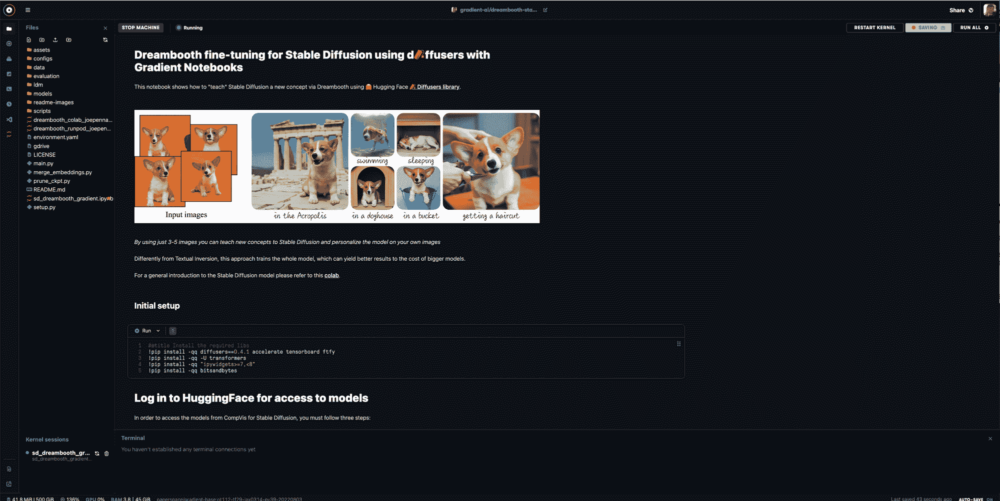
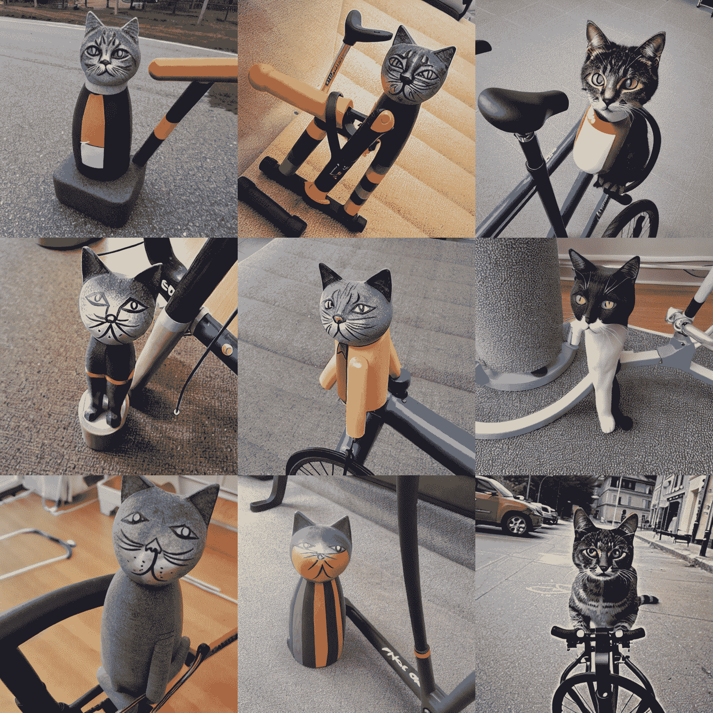
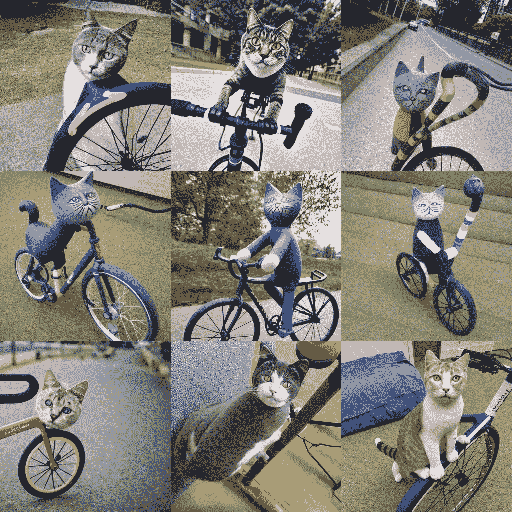

# 稳定扩散教程第 1 部分:在渐变笔记本中运行 Dreambooth

> 原文：<https://blog.paperspace.com/dreambooth-stable-diffusion-tutorial-1/>

2022 年 11 月 3 日更新:[关于文本倒置的第 2 部分现已上线，并更新了演示笔记本！](https://blog.paperspace.com/dreambooth-stable-diffusion-tutorial-part-2-textual-inversion/)

Dreambooth 是对潜在扩散模型(T1)背后的技术的一个令人难以置信的新转折，通过扩展，是来自 Runway ML 和 CompVis 的非常受欢迎的预训练模型(T2)稳定扩散模型(T3)。

这种新方法允许用户输入一个主题(如特定的狗、人或建筑)的一些图像(最少 3-5 个)和相应的类名(如“狗”、“人”、“建筑”)，以便微调和个性化任何对涉及该主题的唯一标识符进行编码的文本到图像模型。当与稳定扩散令人难以置信的多功能性相结合时，我们可以创建令人难以置信的模型，其特征是对我们选择的任何物体或风格的稳健描绘。

在本教程中，我们将逐步完成梯度笔记本中 Dreambooth 稳定扩散模型的设置、训练和推断。我们提供了针对笔记本电脑环境优化的演示代码，以便用户可以利用平台上各种强大的 GPU。

要加载本教程，只需点击此链接到[在渐变](https://console.paperspace.com/github/gradient-ai/dreambooth-stable-diffusion/blob/main/sd_dreambooth_gradient.ipynb?machine=A6000)笔记本上运行。

进入网页后，选择您喜欢的项目。此链接当前设置为与 P5000 一起运行，但可以更改为更快的培训。在 P5000 上进行 500 个周期的训练大约需要 25 分钟。

> 注意:您将需要至少 16 GB 的 GPU RAM 来运行此模型培训。P5000、P6000、V100、V100-32G、RTX5000、A4000、A5000、A100 和 A100-80G 动力机器都能够运行此培训。

#### 笔记本的 URL

将下面显示`<YOUR-GPU-CHOICE>`的 url 更改为 Paperspace 提供的任何 [GPU。](https://docs.paperspace.com/core/compute/machine-types/)

`https://console.paperspace.com/github/gradient-ai/dreambooth-stable-diffusion/blob/main/sd_dreambooth_gradient.ipynb?machine=<YOUR-GPU-CHOICE>`

现在我们已经打开了笔记本，启动它开始演示。

> 注意:这个演示是基于 HuggingFace 笔记本找到的[这里](https://github.com/huggingface/notebooks/tree/main/diffusers)

## 第一步:设置



The Dreambooth Notebook in Gradient

一旦我们启动了笔记本，让我们确保我们正在使用`sd_dreambooth_gradient.ipynb`，然后按照页面上的说明设置笔记本环境。

首先运行顶部的 install 单元来获得必要的包。

```py
#@title Install the required libs
!pip install -qq diffusers==0.4.1 accelerate tensorboard ftfy
!pip install -qq -U transformers
!pip install -qq "ipywidgets>=7,<8"
!pip install -qq bitsandbytes
```

然后，我们将使用下一个单元格登录 Huggingface，这样我们就可以访问模型文件。请确保使用您的 HuggingFace 帐户在这个 [URL](https://huggingface.co/runwayml/stable-diffusion-v1-5) 获得访问权限，然后将在这里找到的[令牌粘贴到下面的代码单元格中，在那里显示`<your_huggingface_token>`。运行单元进行登录。](https://huggingface.co/settings/tokens)

```py
!wget https://raw.githubusercontent.com/gradient-ai/stable-diffusion/main/login.py
!python login.py --token <your_huggingface_token>
```

最后，我们将通过导入相关的库来完成设置，并创建一个`image_grid`函数来帮助在一个网格中显示我们的图像输出，该网格由样本数和行数决定。

```py
#@title Import required libraries
import argparse
import itertools
import math

import os
from contextlib import nullcontext
import random

import numpy as np
import torch
import torch.nn.functional as F
import torch.utils.checkpoint
from torch.utils.data import Dataset

import PIL
from accelerate import Accelerator
from accelerate.logging import get_logger
from accelerate.utils import set_seed
from diffusers import AutoencoderKL, DDPMScheduler, PNDMScheduler, StableDiffusionPipeline, UNet2DConditionModel
from diffusers.hub_utils import init_git_repo, push_to_hub
from diffusers.optimization import get_scheduler
from diffusers.pipelines.stable_diffusion import StableDiffusionSafetyChecker
from PIL import Image
from torchvision import transforms
from tqdm.auto import tqdm
from transformers import CLIPFeatureExtractor, CLIPTextModel, CLIPTokenizer

import bitsandbytes as bnb

# Helper function

def image_grid(imgs, rows, cols):
    assert len(imgs) == rows*cols

    w, h = imgs[0].size
    grid = Image.new('RGB', size=(cols*w, rows*h))
    grid_w, grid_h = grid.size

    for i, img in enumerate(imgs):
        grid.paste(img, box=(i%cols*w, i//cols*h))
    return grid
```

现在设置已经完成，我们将开始设置数据和概念变量，我们将在以后的微调中使用它们。

## 建立我们的概念

<https://blog.paperspace.com/content/media/2022/10/Screen-Recording-2022-10-28-at-7.30.40-PM.mp4>


How to upload sample images to inputs from local machine

现在我们有两条路可走:严格按照演示来，或者使用我们自己的图像。如果我们想使用我们自己的图像，创建`inputs`目录并将这些图像上传到其中。否则，运行下面的单元格。它将创建`inputs`目录，并设置要下载到该目录的图像 URL 列表。

```py
!mkdir inputs
#@markdown Add here the URLs to the images of the concept you are adding. 3-5 should be fine
urls = [
      "https://huggingface.co/datasets/valhalimg/resolve/main/2.jpeg",
      "https://huggingface.co/datasets/valhalimg/resolve/main/3.jpeg",
      "https://huggingface.co/datasets/valhalimg/resolve/main/5.jpeg",
      "https://huggingface.co/datasets/valhalimg/resolve/main/6.jpeg",
      ## You can add additional images here
      ]
```

现在，我们需要通过将我们概念的图片上传或下载到 repo `inputs`来开始为我们的 Dreambooth 培训设置主题。

如果数据是在线公开存储的，您还可以使用上面单元格中的代码来更改为该演示下载的示例图像 URL。

```py
# @title Setup and check the images you have just added
import requests
import glob
from io import BytesIO

def download_image(url):
  try:
    response = requests.get(url)
  except:
    return None
  return Image.open(BytesIO(response.content)).convert("RGB")

images = list(filter(None,[download_image(url) for url in urls]))
save_path = "./inputs"
if not os.path.exists(save_path):
  os.mkdir(save_path)
[image.save(f"{save_path}/{i}.jpeg") for i, image in enumerate(images)]
image_grid(images, 1, len(images))
```

该单元将把数据下载到输入文件夹，用于演示。

为了确保质量概念的调整，这些图像应该在一个主题中保持一致，但在一些细微的方面有所不同，如照明、视角、距离和噪声。下面是一个网格，显示了我们用`image_grid`下载的图像。


a clay cat toy

正如我们所看到的，同一个图像是从不同的角度和视角展示的，并且具有不同的背景以防止过度拟合。

## 设置训练变量

```py
#@markdown `pretrained_model_name_or_path` which Stable Diffusion checkpoint you want to use
pretrained_model_name_or_path = "runwayml/stable-diffusion-v1-5" #@param {type:"string"}
```

接下来，我们将实例化用于模型训练的训练变量和那些将对应于图像数据的变量。本次演示我们将使用 [Runway ML 的稳定扩散-v1-5](https://huggingface.co/runwayml/stable-diffusion-v1-5) 检查点。如果您尚未在主页上访问模型，请务必点击确认按钮。

```py
#@title Settings for your newly created concept
instance_prompt = "a photo of sks toy" #@param {type:"string"}

prior_preservation = False #@param {type:"boolean"}
prior_preservation_class_prompt = "a photo of a cat toy" #@param {type:"string"}
class_prompt=prior_preservation_class_prompt

# Set your data folder path 
prior_preservation_class_folder = './inputs'
class_data_root=prior_preservation_class_folder

num_class_images = len(os.listdir(prior_preservation_class_folder))
sample_batch_size = 4
prior_loss_weight = 0.5
```

接下来，我们设置模型训练的设置。

`instance_prompt`是一个提示，应该包含对你的对象或风格的良好描述。它与初始化词`sks`成对出现。

如果我们希望概念的类别(例如:玩具、狗、画)被保证保留，我们可以将`prior_preservation`设置为 True。这提高了质量，有助于以训练时间为代价的概括。

然后我们设置`prior_preservation_class_folder`和`class_data_root`来设置输入文件夹路径。

最后，我们使用该文件夹大小来确定所有类图像的数量，将批处理大小设置为 4，并将`prior_loss_weight`设置为 0 . 5，该值决定了先前保存的类应该有多强。

# 向模型传授新概念(使用 Dreambooth 进行微调)

## 创建数据集类以促进培训

为了开始教授期望的概念，我们需要实例化`DreamBoothDataset`和`PromptDataset`类来处理训练数据输入的组织。构建这些数据集对象是为了确保输入数据经过优化，以便对模型进行微调。这方面的代码如下所示:

```py
#@title Setup the Classes
from pathlib import Path
from torchvision import transforms

class DreamBoothDataset(Dataset):
    def __init__(
        self,
        instance_data_root,
        instance_prompt,
        tokenizer,
        class_data_root=None,
        class_prompt=None,
        size=512,
        center_crop=False,
    ):
        self.size = size
        self.center_crop = center_crop
        self.tokenizer = tokenizer

        self.instance_data_root = Path(instance_data_root)
        if not self.instance_data_root.exists():
            raise ValueError("Instance images root doesn't exists.")

        self.instance_images_path = list(Path(instance_data_root).iterdir())
        self.num_instance_images = len(self.instance_images_path)
        self.instance_prompt = instance_prompt
        self._length = self.num_instance_images

        if class_data_root is not None:
            self.class_data_root = Path(class_data_root)
            self.class_data_root.mkdir(parents=True, exist_ok=True)
            self.class_images_path = list(Path(class_data_root).iterdir())
            self.num_class_images = len(self.class_images_path)
            self._length = max(self.num_class_images, self.num_instance_images)
            self.class_prompt = class_prompt
        else:
            self.class_data_root = None

        self.image_transforms = transforms.Compose(
            [
                transforms.Resize(size, interpolation=transforms.InterpolationMode.BILINEAR),
                transforms.CenterCrop(size) if center_crop else transforms.RandomCrop(size),
                transforms.ToTensor(),
                transforms.Normalize([0.5], [0.5]),
            ]
        )

    def __len__(self):
        return self._length

    def __getitem__(self, index):
        example = {}
        instance_image = Image.open(self.instance_images_path[index % self.num_instance_images])
        if not instance_image.mode == "RGB":
            instance_image = instance_image.convert("RGB")
        example["instance_images"] = self.image_transforms(instance_image)
        example["instance_prompt_ids"] = self.tokenizer(
            self.instance_prompt,
            padding="do_not_pad",
            truncation=True,
            max_length=self.tokenizer.model_max_length,
        ).input_ids

        if self.class_data_root:
            class_image = Image.open(self.class_images_path[index % self.num_class_images])
            if not class_image.mode == "RGB":
                class_image = class_image.convert("RGB")
            example["class_images"] = self.image_transforms(class_image)
            example["class_prompt_ids"] = self.tokenizer(
                self.class_prompt,
                padding="do_not_pad",
                truncation=True,
                max_length=self.tokenizer.model_max_length,
            ).input_ids

        return example

class PromptDataset(Dataset):
    def __init__(self, prompt, num_samples):
        self.prompt = prompt
        self.num_samples = num_samples

    def __len__(self):
        return self.num_samples

    def __getitem__(self, index):
        example = {}
        example["prompt"] = self.prompt
        example["index"] = index
        return example
```

## 加载模型检查点

```py
#@title Load the Stable Diffusion model
#@markdown Please read and if you agree accept the LICENSE [here](https://huggingface.co/runwayml/stable-diffusion-v1-5) if you see an error
# Load models and create wrapper for stable diffusion

text_encoder = CLIPTextModel.from_pretrained(
    pretrained_model_name_or_path, subfolder="text_encoder"
)
vae = AutoencoderKL.from_pretrained(
    pretrained_model_name_or_path, subfolder="vae"
)
unet = UNet2DConditionModel.from_pretrained(
    pretrained_model_name_or_path, subfolder="unet"
)
tokenizer = CLIPTokenizer.from_pretrained(
    pretrained_model_name_or_path,
    subfolder="tokenizer",
)
```

接下来，我们将加载运行这个调优过程所需的三个独立组件。这些共同构成了模型的完整管道。我们的概念的最终输出将是类似的格式。在本教程的后面，我们将展示如何将这种存储库概念格式转换成经典的稳定扩散检查点。

> 记住，我们需要访问 [v1-5 检查点页面](https://huggingface.co/runwayml/stable-diffusion-v1-5)，接受用户协议下载这些文件。

## 为培训设置参数

既然已经建立了模型，我们需要实例化训练参数。通过运行下面的单元格，我们使用`Namespace`实例化了 Dreambooth 培训过程的调整参数。

```py
#@title Setting up all training args
!mkdir outputs

save_path = 'outputs'
from argparse import Namespace
args = Namespace(
    pretrained_model_name_or_path=pretrained_model_name_or_path,
    resolution=512,
    center_crop=True,
    instance_data_dir=save_path,
    instance_prompt=instance_prompt,
    learning_rate=5e-06,
    max_train_steps=500,
    train_batch_size=1,
    gradient_accumulation_steps=2,
    max_grad_norm=1.0,
    mixed_precision="no", # set to "fp16" for mixed-precision training.
    gradient_checkpointing=True, # set this to True to lower the memory usage.
    use_8bit_adam=True, # use 8bit optimizer from bitsandbytes
    seed=34354,
    with_prior_preservation=prior_preservation, 
    prior_loss_weight=prior_loss_weight,
    sample_batch_size=2,
    class_data_dir=prior_preservation_class_folder, 
    class_prompt=None, 
    num_class_images=num_class_images, 
    output_dir="dreambooth-concept",
)
```

特别是，我们可能希望编辑:

*   可以说是最重要的论点——改变这一点，提高或降低训练周期，这会极大地影响结果
*   `seed`:为计算训练过程中的损失而生成的样本图像的种子——对样本图像的最终结果有重大影响，以及训练后哪些特征被认为对模型是显著的
*   `output_dir`:经过培训的 Dreambooth 概念的最终输出目录
*   `resolution`:输入的训练图像的大小
*   `mixed_precision`:告诉模型使用全精度和半精度来进一步加速训练

## 用 accelerate 定义训练功能

这里我们为下面的训练运行实例化训练函数。这使用加速器包来增加在多 GPU 配置上训练该功能的能力。在运行下面单元格中的代码之前，请按照中的注释查看训练函数的每个步骤。

```py
#@title Training function
from accelerate.utils import set_seed
def training_function(text_encoder, vae, unet):
    logger = get_logger(__name__)

    accelerator = Accelerator(
        gradient_accumulation_steps=args.gradient_accumulation_steps,
        mixed_precision=args.mixed_precision,
    )

    set_seed(args.seed)

    if args.gradient_checkpointing:
        unet.enable_gradient_checkpointing()

    # Use 8-bit Adam for lower memory usage or to fine-tune the model in 16GB GPUs
    if args.use_8bit_adam:
        optimizer_class = bnb.optim.AdamW8bit
    else:
        optimizer_class = torch.optim.AdamW

    optimizer = optimizer_class(
        unet.parameters(),  # only optimize unet
        lr=args.learning_rate,
    )

    noise_scheduler = DDPMScheduler(
        beta_start=0.00085, beta_end=0.012, beta_schedule="scaled_linear", num_train_timesteps=1000
    )

    train_dataset = DreamBoothDataset(
        instance_data_root='inputs',
        instance_prompt=args.instance_prompt,
        class_data_root=args.class_data_dir if args.with_prior_preservation else None,
        class_prompt=args.class_prompt,
        tokenizer=tokenizer,
        size=args.resolution,
        center_crop=args.center_crop,
    )

    def collate_fn(examples):
        input_ids = [example["instance_prompt_ids"] for example in examples]
        pixel_values = [example["instance_images"] for example in examples]

        # concat class and instance examples for prior preservation
        if args.with_prior_preservation:
            input_ids += [example["class_prompt_ids"] for example in examples]
            pixel_values += [example["class_images"] for example in examples]

        pixel_values = torch.stack(pixel_values)
        pixel_values = pixel_values.to(memory_format=torch.contiguous_format).float()

        input_ids = tokenizer.pad({"input_ids": input_ids}, padding=True, return_tensors="pt").input_ids

        batch = {
            "input_ids": input_ids,
            "pixel_values": pixel_values,
        }
        return batch

    train_dataloader = torch.utils.data.DataLoader(
        train_dataset, batch_size=args.train_batch_size, shuffle=True, collate_fn=collate_fn
    )

    unet, optimizer, train_dataloader = accelerator.prepare(unet, optimizer, train_dataloader)

    # Move text_encode and vae to gpu
    text_encoder.to(accelerator.device)
    vae.to(accelerator.device)

    # We need to recalculate our total training steps as the size of the training dataloader may have changed.
    num_update_steps_per_epoch = math.ceil(len(train_dataloader) / args.gradient_accumulation_steps)
    num_train_epochs = math.ceil(args.max_train_steps / num_update_steps_per_epoch)

    # Train!
    total_batch_size = args.train_batch_size * accelerator.num_processes * args.gradient_accumulation_steps

    logger.info("***** Running training *****")
    logger.info(f"  Num examples = {len(train_dataset)}")
    logger.info(f"  Instantaneous batch size per device = {args.train_batch_size}")
    logger.info(f"  Total train batch size (w. parallel, distributed & accumulation) = {total_batch_size}")
    logger.info(f"  Gradient Accumulation steps = {args.gradient_accumulation_steps}")
    logger.info(f"  Total optimization steps = {args.max_train_steps}")
    # Only show the progress bar once on each machine.
    progress_bar = tqdm(range(args.max_train_steps), disable=not accelerator.is_local_main_process)
    progress_bar.set_description("Steps")
    global_step = 0

    for epoch in range(num_train_epochs):
        unet.train()
        for step, batch in enumerate(train_dataloader):
            with accelerator.accumulate(unet):
                # Convert images to latent space
                with torch.no_grad():
                    latents = vae.encode(batch["pixel_values"]).latent_dist.sample()
                    latents = latents * 0.18215

                # Sample noise that we'll add to the latents
                noise = torch.randn(latents.shape).to(latents.device)
                bsz = latents.shape[0]
                # Sample a random timestep for each image
                timesteps = torch.randint(
                    0, noise_scheduler.config.num_train_timesteps, (bsz,), device=latents.device
                ).long()

                # Add noise to the latents according to the noise magnitude at each timestep
                # (this is the forward diffusion process)
                noisy_latents = noise_scheduler.add_noise(latents, noise, timesteps)

                # Get the text embedding for conditioning
                with torch.no_grad():
                    encoder_hidden_states = text_encoder(batch["input_ids"])[0]

                # Predict the noise residual
                noise_pred = unet(noisy_latents, timesteps, encoder_hidden_states).sample

                if args.with_prior_preservation:
                    # Chunk the noise and noise_pred into two parts and compute the loss on each part separately.
                    noise_pred, noise_pred_prior = torch.chunk(noise_pred, 2, dim=0)
                    noise, noise_prior = torch.chunk(noise, 2, dim=0)

                    # Compute instance loss
                    loss = F.mse_loss(noise_pred, noise, reduction="none").mean([1, 2, 3]).mean()

                    # Compute prior loss
                    prior_loss = F.mse_loss(noise_pred_prior, noise_prior, reduction="none").mean([1, 2, 3]).mean()

                    # Add the prior loss to the instance loss.
                    loss = loss + args.prior_loss_weight * prior_loss
                else:
                    loss = F.mse_loss(noise_pred, noise, reduction="none").mean([1, 2, 3]).mean()

                accelerator.backward(loss)
                if accelerator.sync_gradients:
                    accelerator.clip_grad_norm_(unet.parameters(), args.max_grad_norm)
                optimizer.step()
                optimizer.zero_grad()

            # Checks if the accelerator has performed an optimization step behind the scenes
            if accelerator.sync_gradients:
                progress_bar.update(1)
                global_step += 1

            logs = {"loss": loss.detach().item()}
            progress_bar.set_postfix(**logs)

            if global_step >= args.max_train_steps:
                break

        accelerator.wait_for_everyone()

    # Create the pipeline using using the trained modules and save it.
    if accelerator.is_main_process:
        pipeline = StableDiffusionPipeline(
            text_encoder=text_encoder,
            vae=vae,
            unet=accelerator.unwrap_model(unet),
            tokenizer=tokenizer,
            scheduler=PNDMScheduler(
                beta_start=0.00085, beta_end=0.012, beta_schedule="scaled_linear", skip_prk_steps=True
            ),
            safety_checker=StableDiffusionSafetyChecker.from_pretrained("CompVis/stable-diffusion-safety-checker"),
            feature_extractor=CLIPFeatureExtractor.from_pretrained("openai/clip-vit-base-patch32"),
        )
        pipeline.save_pretrained(args.output_dir)
```

## 跑步训练

```py
#@title Run training
import accelerate
accelerate.notebook_launcher(training_function, args=(text_encoder, vae, unet), num_processes =1)
with torch.no_grad():
    torch.cuda.empty_cache()
```

最后，我们准备开始微调我们的 Dreambooth 概念。如果我们使用不止一个 GPU，我们现在可以利用 accelerate 并相应地更改`num_processes`参数。

## 设置推理管道

一旦训练完成，我们就可以使用推理部分中的代码通过任何提示对模型进行采样。

```py
#@title Set up the pipeline 
try:
    pipe
except NameError:
    pipe = StableDiffusionPipeline.from_pretrained(
        args.output_dir,
        torch_dtype=torch.float16,
    ).to("cuda")
```

为了降低采样成本，我们首先以半精度格式实例化管道。`StableDiffusionPipeline.from_pretrained()`函数接受我们到概念目录的路径，使用里面的二进制文件加载到微调模型中。然后，我们可以将 prompt 变量加载到这个管道中，以生成与我们想要的输出相对应的图像。

```py
#@title Run the Stable Diffusion pipeline

prompt = "a photo of a sks cat toy riding a bicycle" #@param {type:"string"}

num_samples = 3  #@param {type:"number"}
num_rows = 3 #@param {type:"number"}

all_images = [] 
for _ in range(num_rows):
    images = pipe([prompt] * num_samples, num_inference_steps=75, guidance_scale=7.5, seed = 'random').images
    all_images.extend(images)

grid = image_grid(all_images, num_samples, num_rows)
grid 
```

在演示之后，我们的提示“sks 猫玩具骑自行车的照片”被调用。然后我们可以将`num_samples`和`num_rows`与`image_grid`函数一起使用，将它们放在一个照片网格中。让我们来看一个例子，这些图像是由一个模型生成的，提示为“一张骑自行车的 sks 猫玩具的照片”,该模型在相对较短的 250 个时期内对样本图像进行了训练:



Samples from concept trained for 250 epochs with seed 34354

正如我们所见，它保留了许多原始猫玩具形象的特质。其中一个图像，底部中心，几乎与原始对象相同。当模型试图将它放在自行车上时，其余的图像显示了与原始样本不同程度的质量。发生这种情况的原因很简单:骑自行车的猫可能不存在于原始数据中，因此使用扩散重建比仅重建分散的要素更困难是有道理的。相反，最终的图像展示了随机收集的 Dreambooth 概念的各个方面，这些方面随机地与提示相关的不同功能相统一，但是我们可以看到这些图像如何通过更多的训练来代表我们的提示。

让我们来看看从一个类似的概念延伸到 500 个训练时期的结果:



Samples from concept trained for 500 epochs with seed 34354

如您所见，这些样本中有几个比 250 个纪元的概念更接近人类对提示的定性解释。特别是，中间一排的三个样品显示了骑着非常准确的自行车的粘土猫玩具的所有特征。其他行具有更真实的猫对象，但仍显示比之前测试更完整的自行车图像。这种差异可能是由于在从概念对象的特征进行推断的过程中，在进一步训练的模型中缺乏混杂效应。通过更多地暴露于初始数据，概念中的中心对象的重新创建不太可能干扰从提示推断的附加特征的生成，在这种情况下是自行车。

此外，提请注意随机种子引起的每行的一致变化也很重要。每一行都显示了相似的显著特征，这些特征在整个网格中并不保守。这清楚地表明，种子有效地控制了概念推理的随机性。种子也适用于训练期间，改变它可以对概念训练的结果有重大影响。确保在这两个任务中测试各种种子，以获得最佳的最终输出。

要从这个阶段继续下去，建议尝试将你的训练扩展到 1000 个历元，看看我们的输出如何提高或降低。随着纪元数量的增长，我们需要警惕过度拟合。如果我们输入的图像在背景特征和物体的视角方面不够可变，并且训练足够广泛，那么由于这种过度训练，在生成期间将很难操纵物体离开它们的原始位置。确保输入图像包含不同的内容，以确保推理的最终输出更加可靠。

## 将模型从扩散器格式转换为原始的稳定扩散检查点文件

最后，现在我们已经完成了 Dreambooth 概念的创建，我们在目录`dreambooth-concept`中留下了一个扩散器兼容文件夹。如果我们想将它用于经典的稳定扩散脚本或其他项目，如稳定扩散 Web UI(现在可以轻松地从稳定扩散渐变笔记本运行时运行)，那么我们可以使用以下脚本来创建一个可共享、可下载的`.ckpt`文件。

```py
# Params
# --model_path = Path to the model to convert.
# --checkpoint_path = Path to the output model.
# --half = store_true, Save weights in half precision/

!git clone https://github.com/huggingface/diffusers

%cd diffusers/scripts
!python convert_diffusers_to_original_stable_diffusion.py --model_path <path to dreambooth concept> --checkpoint_path <name/path of your new model>
%cd ~/../notebooks 
```

这个脚本将把`huggingface/diffusers`库克隆到我们的笔记本上。然后，我们将目录改为`scripts`，以利用`convert_diffusers_to_original_stable_diffusion.py`脚本。只需输入`model_path`作为保存 Dreambooth 概念的存储库的路径，输入期望的输出路径和新检查点的名称到`checkpoint_path`，如果您想以半精度格式保存它以减少计算开销，请使用`half`标志。

## 结束语

本教程基于 [HuggingFace 笔记本回购](https://github.com/huggingface/notebooks)的扩散器部分的笔记本。在本专题讲座中，我们介绍了在渐变笔记本中从头开始创建 Dreambooth 概念的每个步骤，并演示了如何将该笔记本重新应用于任何类型的图像数据以生成新概念。之后，我们演示了如何在笔记本中对新概念进行采样，以从包含与原始概念相对应的特征的文本提示中生成新图像，并讨论了在训练和推理过程中延长训练和改变种子的效果。最后，我们展示了如何将这个概念提取为一个`.ckpt`文件，以便可以在其他项目中重用。

请务必尽快查看本教程系列的第 2 部分，在那里我们将查看文本反转图像嵌入，并展示如何将该技术与 Dreambooth 集成，以创建真正准确的原始概念生成图像。