# 端到端自动语音识别技术现状

> 原文：<https://blog.paperspace.com/end-to-end-automatic-speech-recognition-state-of-the-art/>

# 介绍

在经历了语音处理并掌握了理解音乐和语音所需的一般概念之后，我们处于一个很好的位置来探索涉及深度学习的 ASR 或自动语音识别的最新方法。我们将看到一些在机器学习的声音和 ASR 领域的研究社区中取得重大成就的最新论文。

以下是该领域的一些重要论文，从最老的开始。

💡Gradient Notebooks for three packages (DeepSpeech2, Wav2Vec2, Conformer) can be found in their respective sections

# [深度演讲](https://arxiv.org/abs/1412.5567)

DeepSpeech 是首批通过摆脱背景噪声、混响、说话人变化等手工设计的系统，使基于深度学习的 ASR 受到欢迎的论文之一。它也不需要音素字典。这是通过使用一个基于 RNN 的网络来学习这些效果而不是硬编码来实现的。

单层 RNN 被夹在三个 1D 卷积和一个全连接层之间，并在语音频谱图上被训练。完全连接的层使用限幅 ReLu 激活函数。第四层或第一 RNN 层是双向的，最后一层将前向和后向表示作为输入，然后使用 softmax 激活。该模型被期望将时间序列中的频率仓信息作为输入，并在给定先前输入和先前字符的情况下输出不同字符的概率。

他们还使用了一些基本的数据增强方法，如及时翻译频谱图(5 毫秒)。对于正则化，在非递归层上使用了 5-10%的下降。

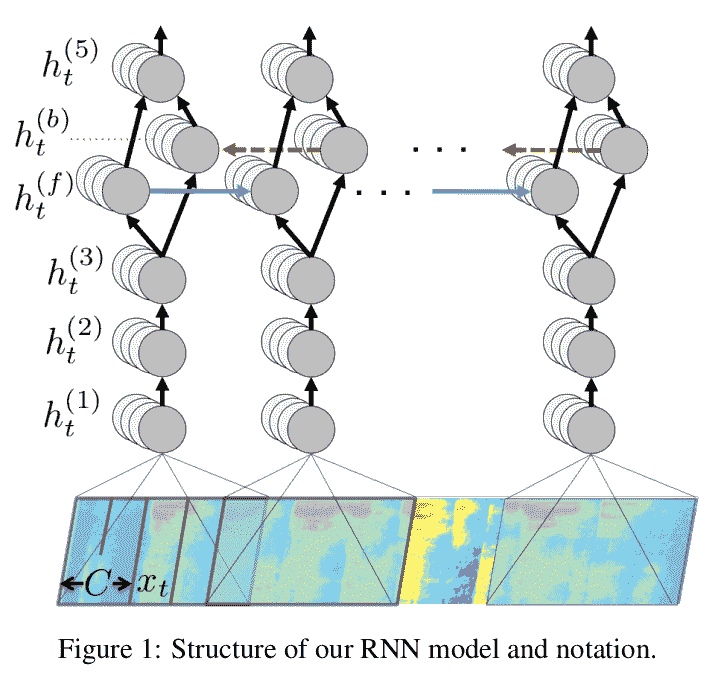

### 语言模型

为了用语音 RNN 进行解码，他们使用一种语言模型来帮助纠正拼写错误，这种错误在语音上是正确的，但不符合语言拼写和语法。所使用的语言模型是基于 n-gram 的模型，该模型是使用 KemLM 工具包训练的。

该模型的综合目标是找到一个将最大化以下内容的序列

$ Q(c)= log(P(c | x))+\ alpha log(P _ { lm }(c))+\ beta * word \ _ count(c)$

其中$\alpha$和$\beta$是可调参数，用于控制 RNN、语言模型和句子长度之间的权衡。

使用典型波束尺寸在 1000-8000 美元范围内的波束解码器。

### 数据和模型并行性

为了提高模型在训练和推理过程中的效率，使用了不同的并行机制。数据被分割到多个 GPU 计算梯度上，用于小批量，这些小批量是通过将相似长度的样本组合在一起并用静音填充而创建的。梯度更新以通常的方式计算，即通过将并行任务的梯度相加。

数据并行在训练中产生加速，但是面临折衷，因为较大的小批量不能提高训练收敛速度。另一种向上扩展的方法是并行化模型。这是通过为非递归层在时间上分割模型来实现的。序列的一半分配给一个 GPU，另一半分配给另一个 GPU。

对于循环层，第一个 GPU 计算前半部分，即前向激活，而第二个 GPU 计算后向激活。然后，两者交换角色，交换中间激活，并完成向前和向后的计算。

### RNN 大步走来

最后，为了扩大训练和推断而进行的另一个优化是使用步长为 2 的 RNN，使得展开的 RNN 的大小是原始未拉伸的 RNN 的一半。

# [深度演讲 2](https://arxiv.org/abs/1512.02595)

Deep Speech 2 用英语和普通话这两种截然不同的语言演示了端到端 ASR 模型的性能。除了对模型架构进行实验，本文中很大一部分工作都是针对使用 HPC(高性能计算)技术来提高深度学习模型的性能，这使得在几天内而不是几周内运行训练实验成为可能。他们还表明，通过在数据中心的 GPU 上使用一种称为批处理调度的技术，可以以一种廉价的方式为低延迟在线 ASR 部署模型。

用于此的模型比 DeepSpeech 模型更深。有几个双向递归图层与批处理规范化一起使用。CTC 损失被用作损失函数，以将语音发射与文本预测对齐。在一些实验中，循环层也被 GRUs 代替。对于所有网络深度，GRU 架构都实现了更好的 WER(字差错率)。

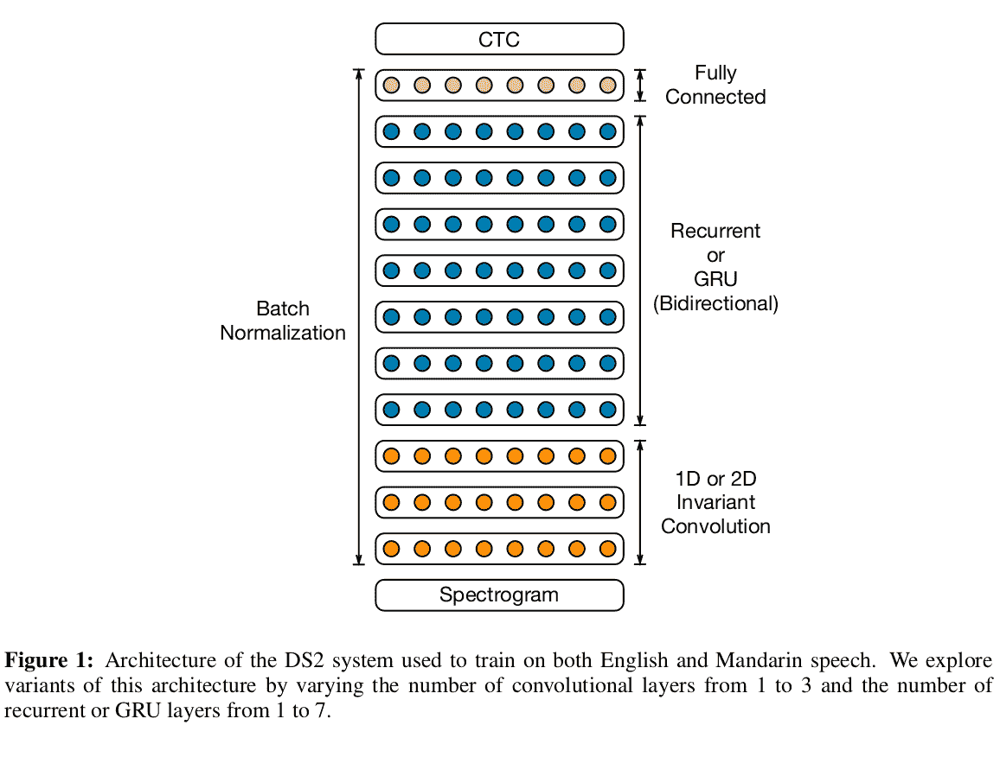

### 批量标准化

跨层的批量标准化能够在加速训练的同时改善最终的泛化误差。递归网络的批量归一化有点棘手，在论文中，他们提到[序列式归一化](http://arxiv.org/abs/1510.01378)能够纠正在使用步进式归一化和在连续时间步长上累积平均值时出现的问题，这两种方法都没有改善优化，但增加了反向传播的复杂性。

BatchNorm 在训练中工作得很好，但是在部署的在线 ASR 系统中变得难以实现，因为需要评估每个话语而不是一批。它们存储训练期间收集的每个神经元的均值和方差的运行平均值，并在推理部署中使用这些值。

### 索塔格拉德

较长的序列通常对成本函数(在这种情况下是 CTC)有更大的贡献，并且被用作话语难度的启发式。然后，按照话语长度对数据进行分类，并相应地为第一个时期创建小批量。对于接下来的时期，使用小批量的随机抽样。作者称这种方法为“分类分级”。随着模型越来越深入，这种课程策略提高了模型的性能。与 BatchNorm 一起使用时，效果会更明显。

这种方法的有效性可以归因于这样一个事实，即我们经常使用相同的学习率，即使序列大小的差异相当于梯度值的实质性差异。

### 频率卷积

时间卷积在 DeepSpeech 和 DeepSpeech 2 中使用。在 DeepSpeech 2 中，使用的特征是时域和频域的。DeepSpeech 1 使用频谱图作为输入，时间卷积作为第一层。DeepSpeech 2 实验了一个和三个这样的卷积层。它们以“相同”模式应用卷积，允许它们在频率和时间上保持输入特征。他们发现 1D 不变卷积对干净的或有噪声的数据没有太大的好处。2D 不变卷积大大改善了有噪声数据的结果，并略微改善了干净数据的结果。

这些回旋的跨越不是以一种简单的方式完成的，因为那不会产生很大的结果。取而代之的是，他们使用非重叠的双元词作为他们的标签，而不是数量更大并且占据几个更大时间步长的词。例如，具有非重叠二元模型的句子“cat sat”被分段为$[th，e，space，ca，t，space，sa，t]$。请注意，奇数单词的最后一个单词变成了单字。一个空格也被认为是一个单字。结果如下所示。

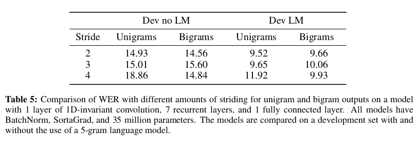

### 行卷积

他们设计了一个特殊的层，以消除 DeepSpeech 1 中使用的 RNNs 中的双向特性。它们使用特定时间步长的未来上下文，并基于特征矩阵$h_{t:t + \tau} = [h_t，h_{t+1}，...，h_{t + \tau}]$大小为$ d x (\tau + 1)$和一个相同大小的参数矩阵 W。$\tau$此处表示未来上下文中的时间步长。

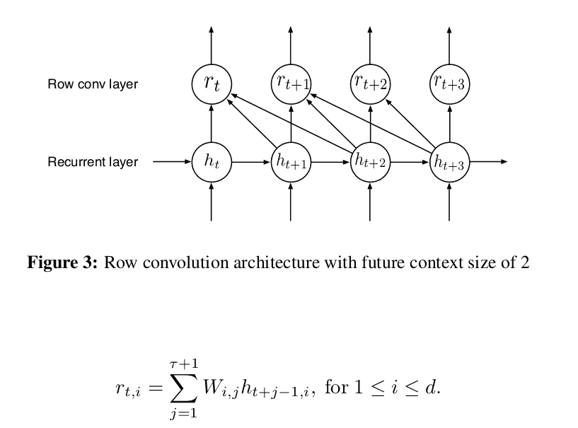

由于上面显示的类似卷积的操作，他们称之为行卷积。

# [wav2 字母](https://arxiv.org/abs/1609.03193)

本文作者使用三种不同的输入特征: [MFCCs、功率谱和原始波形](https://blog.paperspace.com/introduction-to-audio-analysis-and-synthesis/)。这个模型的输出是每个字母一个分数，给定一个字典$L$。他们使用标准的 1D 卷积网络进行声学建模。除了前两层使用步长卷积以使训练更有效。其思想是，输入序列可以很长，并且卷积的第一层如果是步进的，则可以减少其后所有层所需的计算。一个 4-gram 语言模型和一个 beam 解码器用于最终的转录。

### 自动分段标准(CTC 替代方案)

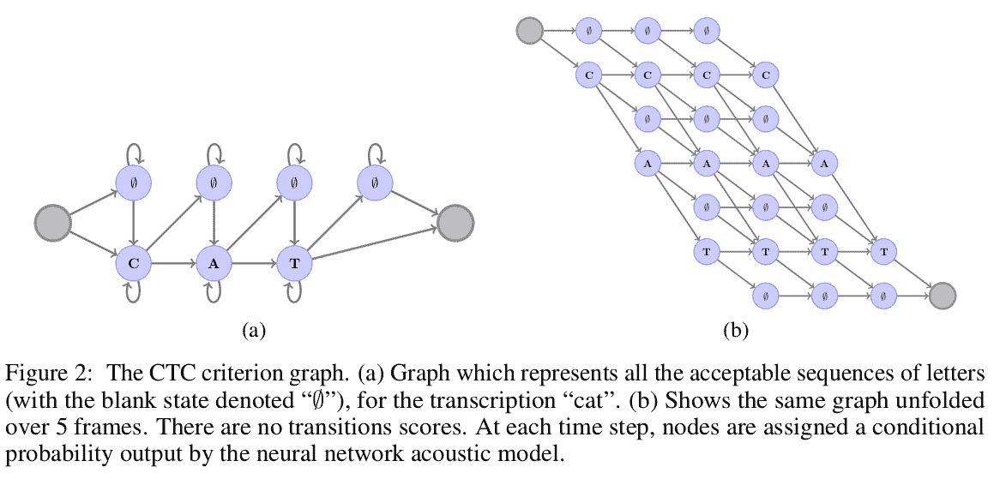

CTC graph

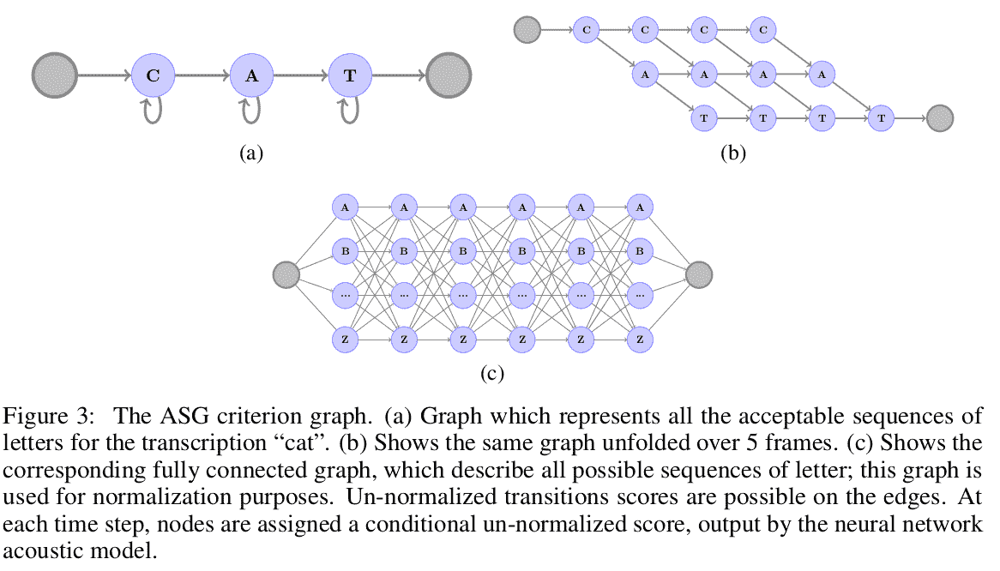

ASG graph

本文的主要贡献是他们使用的替代损失，称为自动分段标准。它与流行的 [CTC 损耗](https://distill.pub/2017/ctc/)有以下几个方面的不同:

1.  没有空白标签。他们发现空白标签在模拟“垃圾”帧时不起作用。至于模拟字母中的重复，他们使用不同的方式用额外的标签来编码。例如，$卡特彼勒$变成了$卡特彼勒 2ar$。
2.  CTC 标准图中所有节点的未标准化分数。这使得插入不同的语言分数更加简单。
3.  全局规格化代替每帧规格化。

# 贾斯珀

Jasper 在模型中只使用 1D 卷积(类似于 Wav2Letter)、批量归一化、ReLu、dropout 和残差连接。他们还提出了一个名为 NovoGrad 的分层优化器。

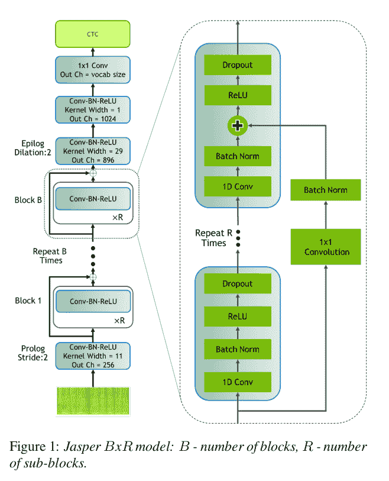

本文对该体系结构的解释如下:

Jasper 使用从具有 10ms 重叠的 20ms 窗口计算的 MFCCs，并输出每帧字符的概率分布。Jasper 有一个块架构:一个 Jasper BxR 模型有 B 个块，每个块有 R 个子块。每个子块应用以下操作:1D 卷积、批量范数、ReLU 和丢失。一个块中的所有子块具有相同数量的输出通道。”

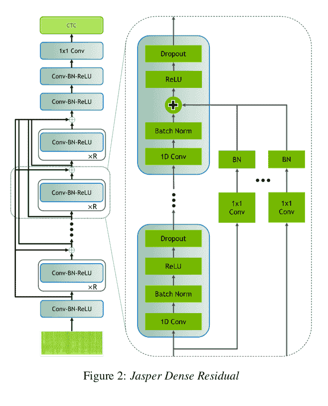

他们还构建了一个 Jasper 变体，它不是在一个块内有连接，而是跨块有连接。每个卷积块的输出被加到所有后续卷积块的输入上。他们称之为贾斯珀博士或贾斯珀稠密剩余模型。

### 诺沃格勒

NovoGrad 类似于 [Adam Optimizer](https://ruder.io/optimizing-gradient-descent/) ，它通过查看从梯度和常数参数计算的一阶和二阶矩来计算每个优化步骤的自适应学习率。它的一部分类似于动量，但 Adam 在基于动量的优化速度较高的情况下表现更好，因为它根据二阶矩为梯度步长提供了相反的力。

在 NovoGrad 中，它的二阶矩是按层而不是按重量计算的。这减少了内存消耗，并且作者发现这在数值上更加稳定。在每一步，NovoGrad 正常计算随机梯度。各层的二阶矩计算如下:

$ v ^ {l}_{t} = \beta_{2}。v ^ {l}_{t-1} + {1 - \beta_{2}}。|| g ^{l}_{t} || ^ {2}$

在计算一阶矩之前，二阶矩用于重新缩放梯度$g_{t}^{l}$。使用 L2 正则化，并且权重衰减被添加到重新缩放的梯度。

$ m^{l}_{t} = \beta_{1}。m ^ { l } _ { t-1 }+\ frac { g ^ { l } _ { t } } { \ sqrt { v ^ { l } _ { t }+\ epsilon } }+d . w _ { t } $

# [Wav2Vec](https://arxiv.org/abs/1904.05862)

Wav2Vec 探索语音识别的无监督预训练。他们使用原始音频作为输入，并使用对比损失对大量数据进行训练。他们使用这些表示来微调受监督的任务模型，并发现它们的性能与最先进的水平相当。使用的模型是为下一个时间步长预测任务训练的简单多层卷积层。

### 编码器网络+上下文网络

他们将两个网络应用于原始音频信号输入。编码器网络将音频信号嵌入潜在空间中，并且上下文网络组合编码器的多个时间步长以获得上下文化的表示。编码器网络是五层卷积网络。编码器的输出是低频表示。另一方面，上下文网络具有 9 层，并且将多个潜在表示混合到单个上下文张量中。它将编码器网络的输出作为输入。

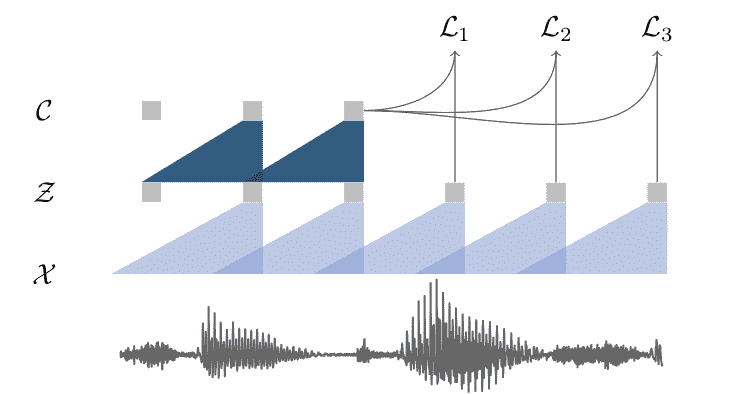

the encoder network maps the input X to Z which is then mapped to C through the context network.

编码器和上下文网络中的每一层都包括具有 512 个通道的因果卷积、归一化层和 ReLu 激活。归一化是在时间和特征维度上完成的，以避免由于缩放和输入偏移而引起的变化。对于更大的模型，作者发现在编码器和上下文网络中引入剩余连接是很重要的。在上下文网络的末端应用完全连接的层，以产生上下文嵌入。

### 对比损失

[对比损失](https://medium.com/@maksym.bekuzarov/losses-explained-contrastive-loss-f8f57fe32246)用于比较干扰项样本(通过应用于输入直到所需时间步长的先验分布创建)和上下文嵌入的 sigmoid 之间的相似性。通过将从时间$t$直到时间$t + k$的干扰物样本与上下文嵌入的 sigmoid 进行比较，找到损失。

他们通过替换 MFCC 表示法在几个数据集上测试这些嵌入。解码是使用一个 4-gram KenLM 语言模型和一个 beam 解码器来完成的。使用的优化器是 Adam 和余弦学习率时间表。

# [Wav2Vec 2.0](https://arxiv.org/abs/2006.11477)

这项工作建立在 Wav2Vec 模型的基础上，通过在堆叠 CNN 的顶部添加一个掩蔽的变换器，CNN 表示的量化形式和对比损失考虑了时间步长$ T $的变换器输出和从$ t = 1 开始的 CNN 的量化表示....新台币。

该模型通过在不同的时间步骤屏蔽输入，在大量未标记的数据上进行训练，类似于 Wav2Vec，然后针对监督任务进行训练，以与其他方法和框架进行比较。

### 特征编码器

编码器由几个时间卷积+层归一化+ GELU 激活块组成。从卷积编码器生成的表示被传递到遵循变换器架构的上下文网络。来自变换器架构的固定位置嵌入被另一个卷积层取代，该卷积层的作用类似于相对位置嵌入。

### 量化模块

[乘积量化](https://towardsdatascience.com/product-quantization-for-similarity-search-2f1f67c5fddd)用于量化来自卷积编码器的表示。乘积量化包括将每个矢量分割成子空间，并使用 k-均值聚类找到每个子空间的质心，这些质心代表一个码本。一旦聚类模型被训练，对于每个子空间，每个向量被映射到它离码本最近的质心。每个子空间的每个质心被转换成消耗更少存储器的符号码(因此命名为码本)。这些最终向量的级联版本是我们的乘积量化表示。Gumbel Softmax 用于将特征编码器的输出映射到 logits。

### 对比损失

总的优化目标如下:

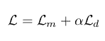

其中$ L_m $是对比损失，其在后向传递中将训练模型从$ K $个干扰物样本中识别真实的量化潜在语音表示。

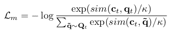

其中$ c_t $是上下文向量，$ q_t $是量化表示，$ q $是干扰项集，$ q_t $是。

### 多样性损失

分集损失被设计成增加量化码本表示的使用。这是通过在一批话语中的每个码本的码本条目上最大化平均 softmax 分布的熵来实现的。

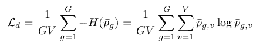

其中$ G $是码本的数量，$ V $是每个码本中的条目，$ p_g $表示每个码本，$ p_{g，v} $是$ p_g $中的$ v^{th} $条目。

# [ContextNet](https://arxiv.org/pdf/2005.03191v3.pdf)

ContextNet 超越了 CNN-RNN 换能器架构，并对具有挤压和激励模块的全卷积层进行了实验。他们还介绍了一种简单的网络扩展方法，这种方法在精度与计算的权衡上提供了良好的结果。作者认为，与基于变压器或基于 RNN 的模型相比，基于 CNN 的架构由于有限的内核大小而缺乏全局上下文是其性能较低的主要原因，因为后者在技术上可以访问整个建模序列。

### 压缩和激励网络

为了解决 CNN 无法在给定序列的较长上下文中进行概括的问题，他们在卷积架构中引入了[挤压和激励](https://blog.paperspace.com/channel-attention-squeeze-and-excitation-networks/)模块。挤压和激励模块通过将多通道、多特征输入编码到每个通道的单个神经元中来工作。该表示由完全连接的层(压缩)编码成缩小了因子$r$的更小的表示，因此将神经元的数量减少到$ C / r $。然后，这些神经元通过另一个完全连接的层(激励)，将压缩的表示传播回原始全局上下文向量的大小。

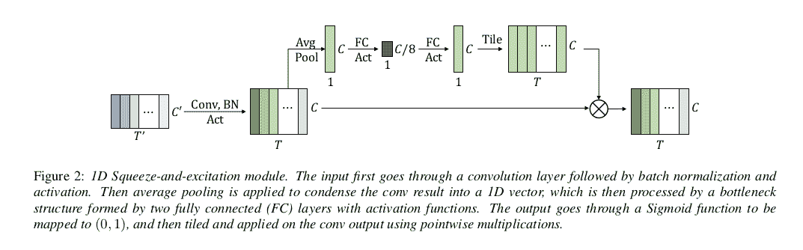

作者使用 RNN-T 解码代替 CTC 解码器。他们还使用了 [swish 激活](https://blog.paperspace.com/swish-activation-function/)功能，该功能可以轻微但持续地减少 WER。

本文的另一个贡献是缩放方案，该方案通过全局改变各种卷积层中的通道数量来逐步对输入进行下采样。这大大减小了模型的大小，同时保持了良好的准确性。

# [Emformer](https://arxiv.org/abs/2010.10759)

这篇论文的名字来源于“高效内存转换器”，因为他们优化了转换器架构，以便为低延迟流语音识别应用提供服务。本文建立在 AM-TRF 方法的基础上。

### 美国 TRF 时间

AM-TRF 或“增强内存转换器”限制输入的左上下文长度，将输入序列分成块以供转换器并行化，并使用内存库来捕获每个块中的自我关注无法捕获的长期相关性。

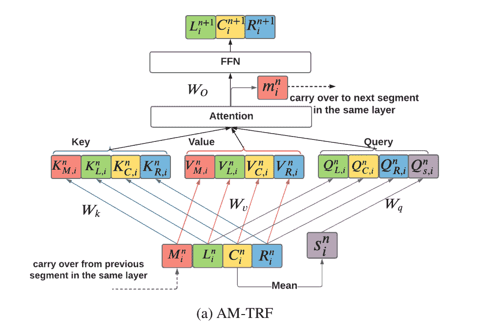

输入被分成$I$个不重叠的片段$C_{1} ^ {n}...C_{I - 1} ^ {n}$。假设$n$是图层索引。为了避免边界效应，这些输入块中的每一个都与左右上下文块$L_{i}^{n} $和$ R_{i} ^ {n}$连接，以形成上下文片段$X_{i} ^ {n}$。AM-TRF 层占用一个内存库$ M_{i} ^ {n} = [m_{1} ^ {n}...m_{i - 1} ^ {n}]$和$ X_{i} ^ {n}$作为输入和输出$ X_{i + 1} ^ {n}$和内存向量$m_{i} ^ {n}$组成。

### 缓存键和值

作者认识到 AM-TRF 在流式语音识别任务上表现良好，但是它的体系结构有一些缺点。例如，它没有有效地使用左侧上下文。如上图所示，每次都必须重新计算左边的上下文向量，即使它们可能与中间的上下文重叠。

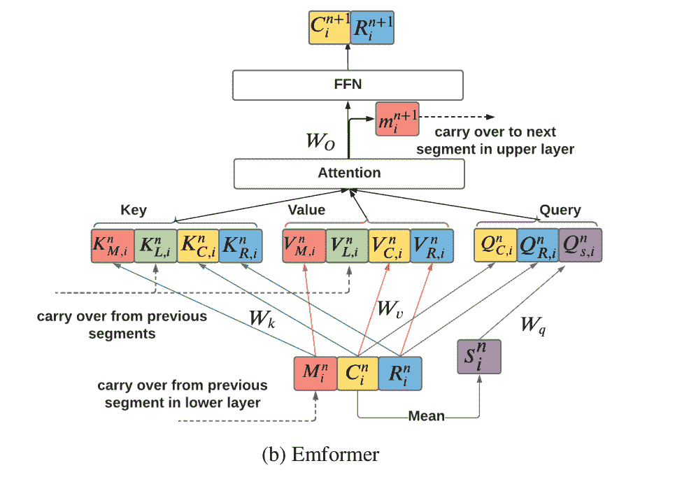

他们提出了一种左上下文的键值缓存机制，可以从前面的片段中继承，大大减少了计算量。

### 内存结转

AM-TRF 中的块处理机制要求每个时间步都将前一时间步的存储体作为同一层的输入。这限制了 GPU 的并行化和使用。为了允许更快的计算，Emformer 将来自注意机制的内存向量输出传递到下一层的下一个段，而不是同一层的下一个块。

### 右上下文泄漏

此外，为了避免前瞻上下文泄漏，Emformer 模型在训练期间使用掩蔽机制，这与使用顺序块处理的 AM-TRF 模型形成对比。

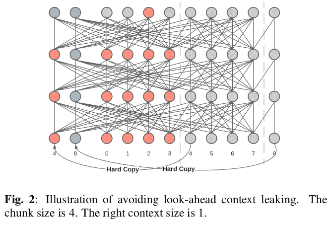

*"Emformer 制作每个段的前瞻上下文的硬拷贝，并将前瞻上下文拷贝放在输入序列的开头。例如，第一块中的帧 2 处的输出仅使用来自当前块的信息以及右上下文帧 4，而没有右上下文泄漏。”*

# 符合

Conformer 或“卷积增强变换器”以参数有效的方式融合了两个世界的优点——卷积的局部特征学习和递归网络和变换器的全局上下文学习。

### Conformer 编码器

conformer 模块有四个组成部分，即前馈模块、自关注模块、卷积模块和最后的第二前馈模块。

对于**自我关注模块**，他们从 Transformer-XL 论文及其相对正弦位置编码方案中获得灵感。这有助于模型更好地概括不同的序列长度。

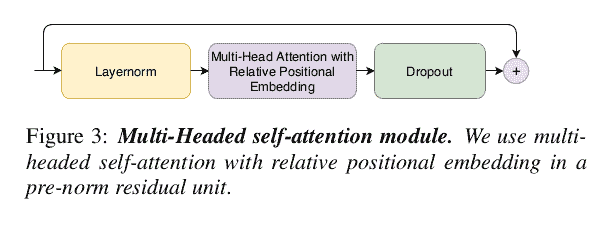

**卷积模块**使用带有 GLU 激活的逐点卷积、1D 深度卷积、带有 swish 激活的批量归一化，并以另一个逐点卷积和丢弃结束。

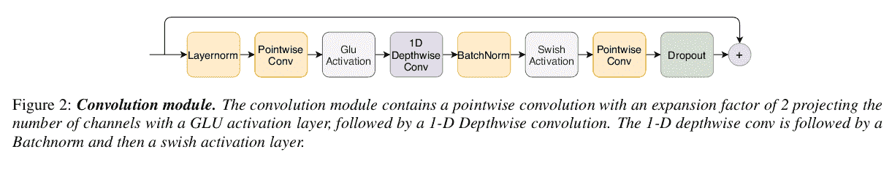

**前馈模块**由两个线性变换和其间的一个非线性变换(swish 激活)组成。

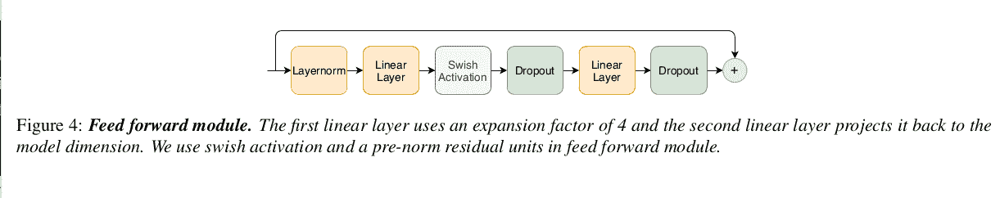

所提出的 conformer 模块将多头自关注模块和卷积模块夹在两个前馈模块之间。

单层 LSTM 解码器被用作他们所有实验的解码器。他们扫描了三种不同模型尺寸的几个建筑超参数- 10M、30M 和 118M 参数。

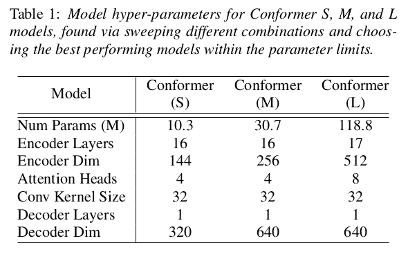

# 结论

在前几篇文章中，我们一直在研究音频数据。我们研究了音频处理和音乐分析，并且在上一篇文章中探索了自动语音识别问题的基础。在本文中，我们探索了人们利用深度学习来解决端到端 ASR 问题的方法，使用时间卷积、递归网络、变压器架构、其中每一种的变体、其中一种以上的混合等等。我们还研究了从计算的角度看待问题的一些方法，这些方法包括使用量化压缩网络、修改模型架构，以及将它们并行化以提高效率。

在接下来的文章中，我们将研究开源的端到端框架，并使用 Conformer 架构实现一个训练和预测管道。