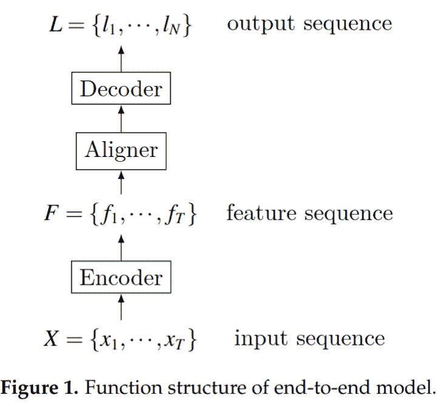
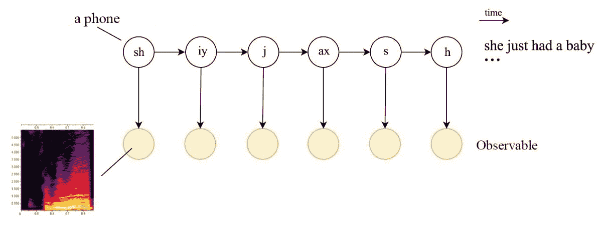
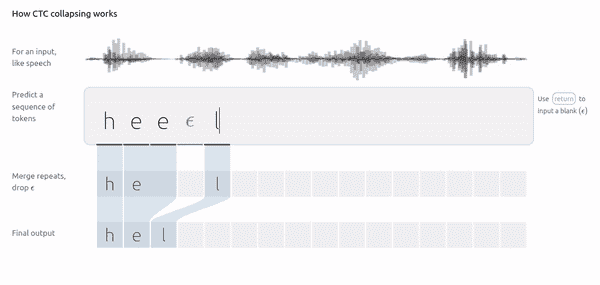
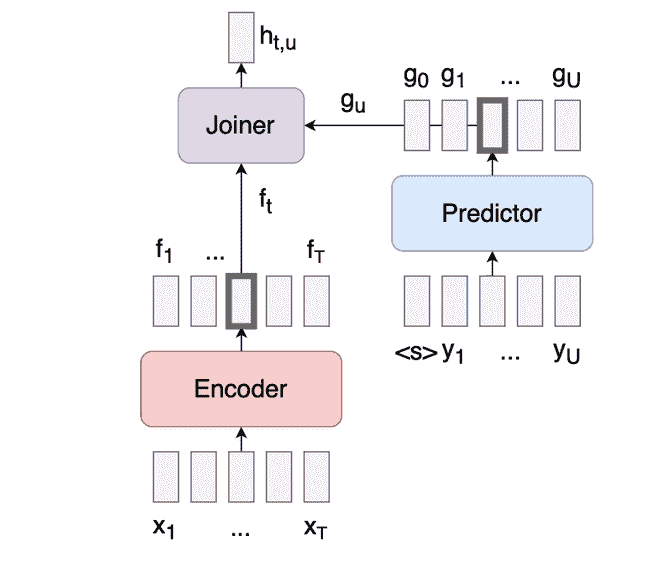

# 端到端自动语音识别:简介

> 原文：<https://blog.paperspace.com/end-to-end-automatic-speech-recognition/>

# 介绍

自动语音识别或 ASR 在深度学习社区中更普遍地被称为是消费语音音频信号并输出所述语音输入的准确文本表示的能力。这个研究领域和许多其他领域一样，其发展停滞不前，直到深度学习方法使新技术能够提高 ASR 模型的性能和效率。

在本系列的前两部分中，我们探索了一些工具，这些工具使我们能够更深入地研究声学建模，以完成更艰难、更具挑战性的下游任务。在您开始阅读本文之前，我建议您先阅读上面提到的第一批文章，以掌握音频信号处理的基础知识。

在本文中，我们将尝试剖析常见的 ASR 管道，这些管道允许端到端的语音识别，从声音记录开始，并推出转录声音的文本。

# 在线与离线 ASR

在我们进一步讨论之前，让我们先了解一下在线和离线 ASR 的区别。在线 ASR 发生在说话者说话时，转录过程同时发生，有轻微的滞后。我们的 ASR 模型所需的计算能力和低延迟对于在线 ASR 任务以及转录的准确性是至关重要的，这三个目标是相互冲突的。

另一方面，当我们事先可以获得完整的语音记录，并且我们的模型可以专注于尽可能准确地将语音转录成文本时，就会发生离线 ASR。然后，可以根据您的应用程序的要求提供结果。离线 ASR 可以让我们负担得起更大的模型，这可能需要更多的资源和时间，但不会牺牲准确性。

这两种模型都非常相关，因为它们服务于不同的下游应用，包括但不限于对话代理、专家代理、RPA 机器人、语音分析和摘要等。

虽然 ASR 的两种模式是不同的，但是底层技术在很大程度上是交叉的；因此，我们只有在必要时才会提到这种分歧。

# ASR 管道

语音识别的自动化，正如你可以直观地想象到的，将要求我们把问题分解成更简单的子问题，比如语音和语言。

大体上，管道由两个主要部分组成:

1.  声学编码器
2.  文本解码器

声学编码器输出语音输入的编码，以便解码器可以使用该编码来输出编码的有意义的文本表示。

为了更深入地理解这一点，我们面临以下问题

1.  **声学建模** -将时域音频信号转换为频域信息，并利用该信息创建能够理解不同种类语音之间差异的模型——不同的语言、不同的说话者、不同的话语、不同种类的噪声以及由此产生的沉默等。
2.  **语言建模** -获取声学模型提供的特征，并将其转录成有意义且准确的文本，就像人类理解所说的内容时所经历的那样。除了理解音频输入，文本模型还需要理解所发出的话语中的语言的语法和句法、不同单词之间的语义关系等。
3.  **解码算法** -可以利用不同的策略来获取语言嵌入，从而得出文本输出。这些将取决于我们所使用的语言模型的种类，它们是基于字符的还是基于词典的，如果存在与解码器管道相关联的基于深度学习的语言模型，等等。
4.  **语音到文本对齐** -语音如果被分成时间段，则不会直接与文本输出对齐，因此我们处理可变向量空间，并且能够将多个语音帧对齐到一个字符/单词对于我们的应用变得非常重要。

source: https://www.mdpi.com/2073-8994/11/8/1018

我们将逐一研究管道的所有这些部分。

## 声学建模

我们从录音设备中得到的声音通常是一种振幅随时间变化的波形。这些信息起初似乎是随机的，很难理解。自回归模型有时可以帮助揭示这种波形中的模式，但它们不足以用于语音识别。为了更深入地了解波形，我们将它们转换到频域。这是使用傅立叶变换完成的。短时傅立叶变换为我们提供了不同的频率仓，以及每帧声音在每个频率仓中的声音幅度。

### MFCCs

人类感知声音的尺度不是线性的。相反，他们在对数尺度上感知它。因此，使用以下公式将线性频率标度转换为 mel 标度

$$ m = 2595。log_{10} (1+\frac{f}{700} ) $$

MFCCs 的计算方法是:对音频信号应用预加重滤波器，获取该信号的 STFT，应用基于 mel 尺度的滤波器组，进行 DCT(离散余弦变换),并归一化输出。预加重滤波器是一种使用信号的加权单阶时间差来稳定音频信号的方法。滤波器组是一组三角波形。

### 音素和字形

[音位](https://www.cs.rochester.edu/u/james/CSC248/Lec12.pdf)是包含语义内容的最小声音单位。它不同于字母表，有一个声音元素。声学内容的变化导致音位的变化，可以对音位进行分析，将其转化为可识别的语言。并非所有的声学变化都会引起音位的变化，例如，唱歌不会改变歌词的内容。

将音素分成桶的一个主要方法是理解发声。如果声音来自声带，音素就是有声的。这与无声音素形成对比。例如，单词“vat”或单词“V”是使用声带发出的，而单词“fat”中的单词“F”是在没有任何声带干预的情况下发出的。

元音总是有声的，不同的共振峰(嘴唇，舌头等。)都是怎么用的，怎么用的。辅音有各种各样的类别，有清音和浊音。你可以通过上面的链接了解更多关于音素的知识。

字素被描述为“可能引起意义变化的最小对比语言单位”英语中大约有 40 个有区别的音素，但有 70 个字母或字母组合象征着音素。

例如，单词“ghost”包含五个字母和四个字素(“gh”、“o”、“s”和“t”)，代表四个音素。

### HMM-GMM

隐马尔可夫模型是顺序建模工具，它做出强有力的假设，即系统的状态仅依赖于其先前的状态，而不依赖于在此之前的状态。

$$ P(q_{i} = a | q_{1}...q_{a}) = P(q_{i} = a | q_{i-1})$$

尽管这是一个强有力的并且经常是错误的假设，但是基于 HMM 的模型在语音识别领域取得了很大的成功，其中声音内容是特定于说话者的。

source: https://jonathan-hui.medium.com/speech-recognition-gmm-hmm-8bb5eff8b196

上图以文本格式显示了电话，这与我们在英语中的拼写方式相似。音素和字形这两个词可以互换使用。

使用先前状态的 MFCC 特征来预测电话。每个音素的 HMM 概率被学习为高斯混合模型，其充当 HMM 的发射概率。

[高斯混合模型](https://vitalflux.com/gaussian-mixture-models-what-are-they-when-to-use/)是一种概率模型，它假设所有数据点都是由具有未知参数的高斯分布混合生成的。在我们的例子中，每个音素被表示为它前面的音素的高斯模型的混合，如马尔可夫假设所规定的。高斯混合模型也可以为多于 2 种模态建模。[期望最大化](https://machinelearningmastery.com/expectation-maximization-em-algorithm/)算法用于学习高斯混合模型参数。

该算法可使用动态规划在多项式时间内求解，此处详细解释了该方法[。](https://jonathan-hui.medium.com/speech-recognition-gmm-hmm-8bb5eff8b196)

请注意，这里仍然没有考虑词汇建模，语音被转换为其语音转录而不是文本表示。

### 深层声学模型

时域信息可以使用深度神经网络(如 RNNs 及其变体)来表示，而不是由 hmm 来表示。CNN 也可以代替 rnn 用于光谱信息，以使用 MFCCs 作为输入来模拟时间状态。

当前最先进的模型应用了比普通 CNN 或 RNNs 或 LSTMs 更新颖的方法。这些包括基于注意力的模型，变压器模型，变分自动编码器等。我们将在稍后回顾该领域中一些有影响力的论文时了解这些内容。深度声学模型已经能够帮助声学建模变得更加一般化，跨越说话者、语言、口音、领域等。

## 语言建模

语言极其复杂，即使没有语音成分，也很难为语言编写规则。同样的词在不同文化的不同语境中有不同的用法。一些拼写相同的单词有不同的意思。有些单词发音相同，但拼写不同。每种语言的语法都在变化，不同语言中的语法规则的通用性很低。

语言建模承担了在给定的上下文中预测下一个单词应该是什么的困难任务。这可以使用统计方法或深度神经网络来完成，这也反映在语言建模技术随时间的演变中。语言模型承担给字母或单词分配概率的任务，分别给出前面的单词或字母。

### 词性和依存句法分析

词性标注或词性标注正是它听起来的样子。将每个标记或单词标记为特定词类的能力。一些[通用词类](https://universaldependencies.org/u/pos/)包括名词、形容词、代词、副词等。你可能会在高中的语言课上认识到这些。

依存句法分析使我们能够通过创建一个树形结构来建立不同词类之间的句法关系。有许多不同的解析器获取带词性标签的语音语料库，并将其转换为依存关系树，这是所有常见的 NLP 工具都提供的功能，如 [NLTK](https://www.nltk.org/) 、 [SpaCy](https://spacy.io/) 等。

你可以在这里了解更多关于依赖上下文的语法和依赖解析[。](https://www.gelbukh.com/ijcla/2012-2/IJCLA-2012-2-pp-107-122-POS%20Taggers%20and%20Dependency%20Parsing.pdf)

### 词典

[词典](https://dl.acm.org/doi/pdf/10.1145/234173.234204)指的是包含关于单个单词或单词串的信息(语义、语法)的 NLP 系统的组件。对于大多数应用程序，词典指的是单词和标点符号的列表以及与每个单词或标点符号相关联的字符或字符串。

词典根据词类和依存句法分析所描述的词类之间的关系来描述自然分类中的单词。

上面的概念，虽然不是独立于语言的，但允许我们通过计算来理解特定句子的内容，并且早期的许多语言建模工作都是由使用这些概念的语言理解所主导的。

### 统计语言模型

[统计语言建模](https://www.cs.cmu.edu/~roni/papers/survey-slm-IEEE-PROC-0004.pdf)主要是关于估计$ Pr(S) $的，其中$ S $是句子的语料库，而计算语言学主要是关于估计$ Pr(H|S) $的，其中$ H $是语言的隐藏状态(如上面讨论的句法和依存关系树)。

正如这篇文章正确指出的，在试图对语言建模时有两个重要的问题——稀疏性和上下文。

稀疏性指的是每种语言的广泛词汇以及我们有效编码这些词汇的能力。最直观的方法是创建 N 维独热向量，其中 N 是词汇表的大小。但是随着句子长度的增加，这就产生了数据越来越稀疏的矩阵。当我们采用这种方法时，我们会遇到众所周知的“T2 维度诅咒”。

[单词的](https://www.lexalytics.com/blog/context-analysis-nlp/) [上下文](https://www.lexalytics.com/blog/context-analysis-nlp/)是为了语言建模的目的，即单词周围的单词。单词前后的单词提供了关于该单词用法的大量信息，因此影响其出现的概率。统计语言建模的目标是预测给定上下文的单词。

### 深层语言模型

深度语言模型通过将每个单词表示为 N 维嵌入来解决稀疏性和上下文理解。

嵌入是由各种深度学习架构生成的 N 维空间中的可学习表示。考虑到语言的时间特性，rnn 首先被用于此。RNNs 成为许多问题的牺牲品，包括爆炸和消失梯度。接下来出现了一个改进版本，长短期记忆(LSTM)网络，但仍然缺乏捕捉跨一段或多段语言的长期依赖性的能力。

最近，基于注意力的模型和转换器在 NLP 和建模领域取得了越来越多的成功。

## 解码算法

声学模型可以为我们定义的词汇提供随时间变化的排放概率。模型可以基于字符或字符串。有各种解码策略来利用这些概率来预测特定语音模式用字母/字素/单词来表示什么。

### 贪婪解码

贪婪解码就是简单地获取具有最高条件概率的令牌。

$ $ y _ { t } = arg max _ { y \ in V } P(y | y _ { 1 }...y_{t-1}) $$

在基于字符的模型中，这通常是一种幼稚的方法，因为基于上下文的概率通常隐藏在概率分布中。贪婪解码器假设具有最高概率的记号是正确的记号，但是在时间$t$预测的记号之前的单词的可能性通常也与做出正确的预测非常相关。

### 波束解码

波束解码扩展了贪婪解码算法，以考虑多个可能的序列，这些序列可以聚集在一起以产生高概率结果，而不是在每个时间帧仅取最高概率的令牌。

光束解码器在这里的 [中可以得到最好的直观解释。](https://medium.com/@jessica_lopez/understanding-greedy-search-and-beam-search-98c1e3cd821d)

波束搜索对贪婪解码算法做了两个重要的改进。

1.  波束搜索不是只考虑顶部的令牌，而是考虑顶部的$N$个令牌。
2.  波束搜索不是孤立地考虑每个时间步，而是考虑前面单词的联合概率，并挑选出$N$个最佳序列。

关于如何实现波束搜索算法的简单教程可以在[这里](https://machinelearningmastery.com/beam-search-decoder-natural-language-processing/)找到。

## 语音到文本对齐

当转换成文本时，语音中的时间帧并不对应一对一的映射。这就要求我们将多个语音帧映射到一个单一的文本令牌。这种不一致使得大多数基于损失的深度学习优化的正常方法不适合语音识别应用。

### CTC 损失

[CTC 丢失](https://www.cs.toronto.edu/~graves/icml_2006.pdf)或者说连接主义者的时间分类丢失是无对齐的。它引入了一个新的标记，通常被称为*空白标记*，用于注释不同标记比对中的中断。如果多个时间步长由相同的字符表示，则合并空白记号之间的记号，如果它们不重复，则保持原样。空白标记确保具有重复标记的单词不会折叠成错误的拼写。

source: https://distill.pub/2017/ctc/

[这篇文章]( https://distill.pub/2017/ctc/)很好地解释了 CTC 如何工作，该算法如何使用巧妙的动态编程方法来降低计算成本，以及它如何以可微分的方式解决未对准的问题，以便我们的神经网络可以使用梯度下降从损失函数中学习。

### RNN-T 损失

[RNN -T 损耗](https://arxiv.org/pdf/1211.3711.pdf)或 RNN-换能器损耗通过使用预测网络和加入网络以及我们从声学模型中获得的嵌入网络来解决对准问题。预测器网络是使用 GRU 实现的自回归网络。接合器是简单的前馈网络，其组合编码器向量$f_{t}$和预测器向量$g_{u}$并输出所有标签上的 softmax $h(t，u)$以及“空”输出$\phi$。

source: https://lorenlugosch.github.io/posts/2020/11/transducer/

作为损失函数，RNN-T 损失将对数域中所有可能比对的所有概率相加，并将其用作损失函数。

关于 RNN 传感器网络的一些值得注意的事情是

1.  预测器网络只能访问$y$并因此只能对文本数据进行训练。
2.  该模型可用于流式或在线 ASR。

RNN 传感器损耗的一个很好的解释可以在[这里](https://lorenlugosch.github.io/posts/2020/11/transducer/)找到。相同的代码教程可以通过点击下面的链接找到。

# 结论

在本文中，我们研究了端到端 ASR 管道的基本要素、这些管道遇到的主要挑战以及一些潜在的解决方案。我们研究了统计声学建模、统计语言建模、解码/搜索算法以及针对语音输入和文本输出之间的错位问题的解决方案。最后，我们讨论了语音到文本的对齐，其中我们讨论了 CTC 损失和 RNN-T 损失。

在本文中，我们几乎没有触及用于声学建模或语言建模的深度学习算法的表面。一些最先进的算法能够将声学建模和语言建模这两种功能结合到一个网络中。我们将在下一篇文章中看到许多这样有趣的方法，它们处于基于深度学习的 ASR 研究的前沿。

敬请期待！