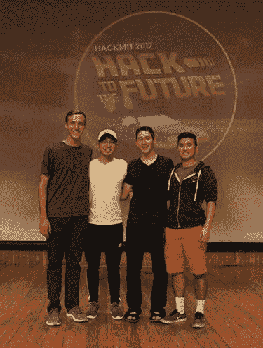

# 假香蕉:在 Paperspace 上的 HackMIT 检测假新闻

> 原文：<https://blog.paperspace.com/fake-news-detection/>

假香蕉——在你滑倒之前检查你的事实。

点击这里查看我们的 Github 回购！

今年在 HackMIT 2017 上，我们的团队 Fake Bananas 利用 Paperspace 的服务器基础设施建立了一个机器学习模型，通过将给定的文章或用户短语与已知的知名和不可替代的新闻来源进行比较，准确区分虚假和合法的新闻。我们的项目进入了前 10 名(更具体的排名没有披露)，并获得了最佳数据使用奖和最佳机器学习公益使用奖。我们的项目目前没有公开托管，因为我们的后端服务收费很高，但我们希望通过与这些公司合作制定学生价格来改变这种情况。

## **文章大纲**

*   [动机](#motivation)
*   [概述](#overview)
*   [程序流水线](#program)
*   [解析输入和获取文章](#parsing)
*   [用于姿态检测的机器学习](#ml)
*   [其他(更差的)假新闻检测方法](#other)
*   [paper space GPU](#gpus)
*   [来源信誉数据库](#source)
*   [网络应用架构](#web)
*   [团队成员](#team)
*   [参考文献](#references)

### 动机

我们的目标是试图解决日益严重的假新闻问题，这一问题因社交媒体的广泛使用而加剧。例如，许多人认为社交媒体上的假新闻是导致有争议的 2016 年美国大选结果的一个重要因素。我们想创建一个易于使用的系统来检测用户声明或文章的可信度。

### 概述

有许多方法可以尝试检测互联网上的虚假或有偏见的新闻。然而，我们觉得我们基于姿态检测的实现提供了最大的灵活性和可靠性，而不必陷入将个人声明标记为真或假的困境。相反，我们的目标是一种更通用的方法，将来自未知来源的文章分类为一般同意或一般不同意已知(高和低)可信度的来源。

此外，我们的实现特别引人注目，因为我们可以接受用户输入作为一篇文章的链接，或者作为任何需要进行事实检查的任意声明(如奥巴马不是美国公民)。这样，我们的程序就像一个寻找事实的搜索引擎，返回相关文章的链接以及文章对该主题的立场(同意/不同意/中立)!我们的程序为用户提供了巨大的研究和发现潜力，以及简单地检查索赔。

我们希望基于 ***姿态检测*** 的概念，创建一个易于使用的系统来检测用户声明或文章的可信度。假新闻很难识别。许多“事实”非常复杂，难以核实，或者存在于“真理的连续统一体”上，或者是事实和虚构重叠的复合句。解决这个问题的最好方法不是通过事实核查，而是通过比较有信誉的消息来源对某项声明的看法。

### 程序管道

1.  用户输入类似于*“奥巴马不是美国公民”*的声明
2.  我们的程序将搜索 [Event Registry 的](http://eventregistry.org/)数据库，寻找与关键词相关的数千篇文章。
3.  我们通过我们自己开发的立场检测机器学习模型来运行这些文章，该模型将确定每篇文章与索赔的相关性及其对索赔的立场。我们确定一篇文章是同意/不同意/中立还是与输入声明无关。
4.  然后，我们访问我们不断发展的来源信誉数据库。如果许多有信誉的来源都同意你的说法，那么它可能是真的！
5.  然后我们引用我们的来源，这样我们的用户就可以点击阅读更多关于这个话题的内容！

### 解析输入并获取文章

给定一个用户 URL 或声明，我们使用微软的 Azure Cognitive 和 IBM 的自然语言处理来解析文章或声明，并执行关键字提取。然后，我们使用关键字的组合从 Event Registry 的数据库中收集了多达几千篇文章，以传递给机器学习模型。在这里，我们倾向于收集更多而不是更少的文章，因为机器学习将准确地确定管道中进一步的相关性。

在梳理了大量报纸和自然语言处理 API 之后，我们发现查找相关文章的最佳方式是通过搜索关键字。面临的挑战是实现一种自然语言处理算法，提取最相关的可搜索关键词，并提取正确数量的关键词。许多算法只是简单的总结，会返回超过 50 个关键词，这对于搜索来说太多了。最重要的是，许多算法是资源耗尽的，有时需要一分钟来解析一个给定的文本。

最后，我们实现了微软的 Azure 和 IBM 的 Watson 来处理、解析和提取新闻文章或声明的关键字。我们将提取的关键词传递到 Event Registry 的近 2 亿篇文章的令人难以置信的数据库中，以找到尽可能多的相关文章。

随着时间的推移，我们很乐意实现 Event Registry 的数据可视化功能，包括生成标签云和图表，显示给定主题的顶级新闻发布者。

-由亨利·韩带头

### 姿态检测的机器学习

观看我们制作的视频(约 4 分钟)[https://www.youtube.com/watch?v=j0n-0-3XhWc](https://www.youtube.com/watch?v=j0n-0-3XhWc)中我们机器学习管道的详细纲要。

我们在 Tensorflow 中创建和实现了一个机器学习模型，该模型基于姿势检测领域的几篇研究论文[1][2][3]。我们的模型使用词袋、Google 的 word-2-vec、TF、TF-IDF(术语频率、逆文档频率)和 Scikit-learn 中的“停用词”的组合来对我们的输入进行矢量化。其通过具有 ReLU 激活的单个隐藏层、完全连接的层和 softmax 激活功能运行，以产生 4 个输出之一。我们正在比较一个任意的正文和一个任意的声明。所以我们的 ML 输出，不管我们的正文是否与声明“相关”。如果它是相关的，那么它输出身体是否“同意”、“不同意”或“对我们的主张保持中立”。我们的模型在我们的测试数据上实现了 82%的准确度(对于纯姿态检测..不一定‘假新闻’检测)[4]。

我们面临的一个挑战是 Tensorflow 会话的缓慢加载时间(大约 30 秒)。

-由卡斯坦·戴带头

### 其他(更糟糕的)假新闻检测方法

#### 1.假新闻风格检测

一些团队试图在“假”文章集和“真”文章集上训练机器学习模型。这种方法很可怕，因为假新闻可以出现在写得好的文章里，反之亦然！风格不等于内容，我们关心的是找到真正的内容。

#### 2.事实核查

一些团队试图细致地检查文章中每个事实的真实性。这很有趣，最终可能成为未来一些假新闻检测系统的一部分，但今天这种方法不可行。事实的真相存在于一个连续体上，并严重依赖于单个单词及其内涵的细微差别。人类语言的细微差别很难解析为真/假二分法。

人类的语言是微妙的。判断一个陈述是对还是错
没有什么是对还是错的数据库
一篇文章中的许多事实存在于真理光谱的各个方面——那篇文章是对还是错？

### Paperspace 的 GPU

我们选择使用 paperspace 来训练和运行我们的机器学习模型，主要是因为启动和运行 paperspace 机器进行机器学习是多么快速和容易。这个项目是在 24 小时的期限内为 HackMIT 完成的。因此，速度是至关重要的，在尝试启动和运行 TensorFlow 模型时,“盒子里的 MLL”预设为我们节省了大量时间。

我喜欢 Paperspace，因为它:

1.  快速设置
    *   机器中的 ML 消除了设置 CUDA 的噩梦。
    *   首次设置计算机时，图形模式非常有用
2.  使用方便
    *   使用 Windows 应用程序，访问终端非常简单
3.  大量廉价的虚拟内存
    *   我们的模型需要大约 12 GB 的 V-RAM，这使得 V-RAM 的数量成为我们选择 GPU 时最大的限制因素。
    *   在发表这篇文章的时候，他们比竞争对手(AWS，Azure)便宜很多，因为他们有更多的 V-ram 和更快的卡。

### 来源信誉数据库

为了让我们的应用程序能够工作，我们需要能够将新的立场与我们不断改进的来源信誉数据库进行比较。我们编写了一个 python 脚本来跟踪所有遇到的源以及计算权重的信誉分数。一开始，我们根据全国性的研究对声誉进行硬编码，然后每次运行我们的算法时，我们都会将任何新遇到的来源添加到我们的数据库中。为了做到这一点，我们通过将每篇新文章对输入声明的立场与具有已知声誉的来源的立场进行比较，并对结果进行平均，来计算每篇新文章的声誉得分。在未来，我们希望结合更精确的数据科学技术来改进我们的数据库。作为一个较小的项目，我们还希望找到一种比用 csv 跟踪数据库更简化的方法，即在应用程序的单次运行之外存在一个数据库副本。由乔希·弗里尔带头

### 网络应用架构

我们使用 ReactJS 作为前端，Flask dev 服务器作为后端。当 Flask 服务器在特定端点接收到 POST 请求时，它使用用户的 URL 或声明的参数启动我们的抓取和机器学习预测脚本。我们的依赖项包括两个开源库:Semantic-Ui-React 和 SweetAlerts。我们使用脸书的“创建-反应-应用”工具来创建我们的 web 应用程序的结构。
-由杰森·金打头阵

### 团队成员

我们现在都是斯沃斯莫尔学院的索菲莫尔。


*   [种姓日](https://kastanday.com/)
*   乔希·弗里尔
*   [韩亨利](https://github.com/hanksterhan)
*   [杰森·金](https://github.com/likeaj6)

### 参考文献

[1]伦敦大学学院关于这个题目的简短论文:

```py
@article{riedel2017fnc,
    author = {Benjamin Riedel and Isabelle Augenstein and George Spithourakis and Sebastian Riedel},
    title = {A simple but tough-to-beat baseline for the {F}ake {N}ews {C}hallenge stance detection task},
    journal = {CoRR},
    volume = {abs/1707.03264},
    year = {2017},
    url = {http://arxiv.org/abs/1707.03264}
} 
```

[2]思科-塔罗斯在假新闻挑战上的工作
[https://github.com/Cisco-Talos/fnc-1](https://github.com/Cisco-Talos/fnc-1)

[3]雅典假新闻挑战小组。
[他们的 Github 回购](https://github.com/hanselowski/athene_system)
[他们的博客文章](https://medium.com/@andre134679/team-athene-on-the-fake-news-challenge-28a5cf5e017b)
[他们的技术论文](https://github.com/hanselowski/athene_system/blob/master/system_description_athene.pdf)

[4]我们的训练数据来自 FakeNewsChallenge.org，在 2016 年，各团队竞相开发姿态检测模型，并且仅开发姿态检测模型，我们以此为基础来进行假新闻检测。