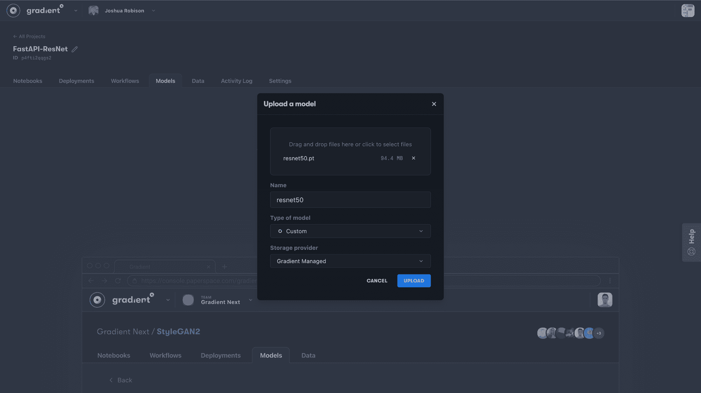
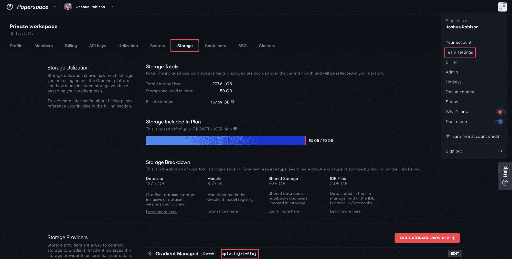
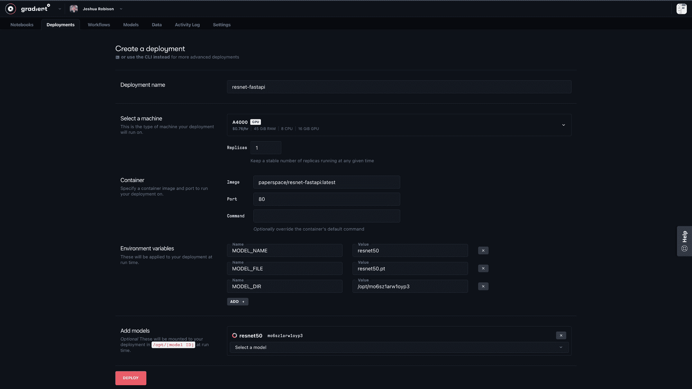
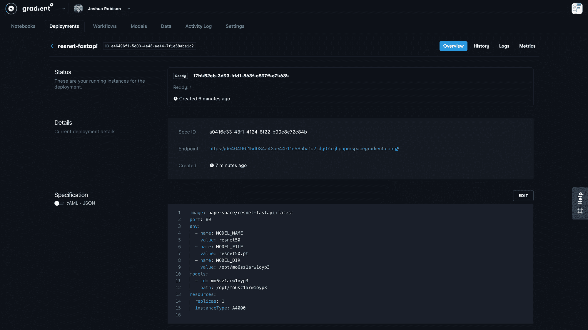
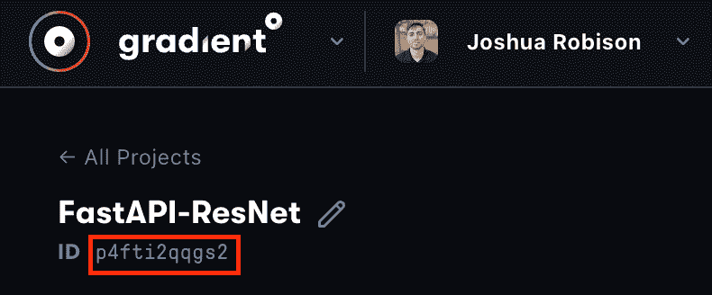
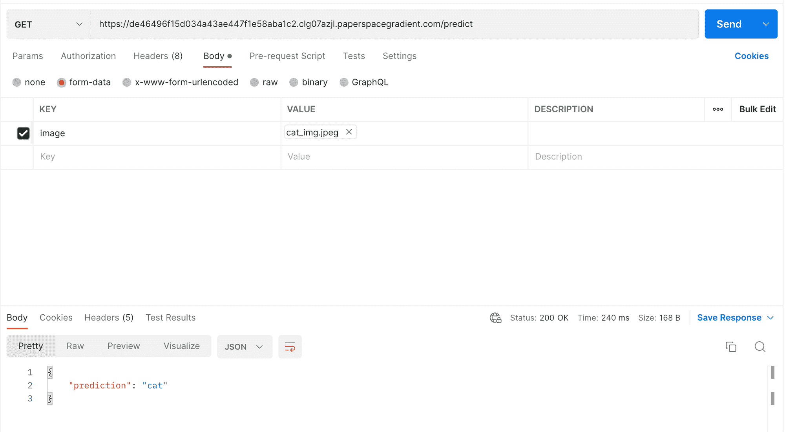

# 快速跟踪部署

> 原文：<https://blog.paperspace.com/fast-track-to-deployments/>

遵循本指南，了解如何使用梯度部署通过 FastAPI 部署我们的模型。读者应该期望学习如何将他们训练好的模型作为一个渐变模型工件上传，创建一个 Docker 图像来服务他们的模型，并使用一个部署在渐变上部署他们的图像。

> **重要提示:**在本教程的最后，我们将完成一个渐变部署。请确保通过更改`replicas: 0`或向规范添加`enabled: false`标志或完全删除部署来关闭它。否则，只要部署正在运行，所有者的帐户将被收取计算费用。通过检查 Paperspace 控制台中部署页面顶部的状态，我们可以确认我们的部署处于离线状态。

# **前言**

本指南的目标是向用户展示如何获取他们自己的训练模型，并通过提供一个端点将它们部署到梯度部署上，用户可以发送请求以返回从他们的模型生成的输出。为此，我们将使用 [FastAPI](https://fastapi.tiangolo.com/) 。FastAPI 是一个现代化的高性能 web 框架，用于构建易于使用的 API，非常适合创建应用程序来为模型提供服务。

在下面的教程中，我们将创建一个 FastAPI 应用程序，通过提供一个端点来服务我们的模型，我们的模型可以从这个端点被调用。这个端点将接受一个 API 请求，生成一个模型输出，并将该输出返回给发送方。我们将创建一个包含 FastAPI 应用程序的 Docker 映像，然后将该映像与模型一起部署在 Gradient 上，以允许用户访问我们的模型。

# 先决条件

作为本教程的起点，我们需要:

*   受过训练的模特
*   FastAPI 应用程序文件

本教程并不打算深入研究 [FastAPI 开发](https://fastapi.tiangolo.com/tutorial/)，而是指导如何在 Gradient 上部署 FastAPI 应用程序来服务我们的模型。但是，我们将在下面突出显示一些我们在这个演示应用程序中使用的文件和代码片段。我们还可以查看我们在这个项目中使用的 [GitHub 库](https://github.com/gradient-ai/resnet-fastapi.git)，其中包括我们在这个 FastAPI 应用程序中使用的所有文件、other 文件以及任何其他附带文件。

在高层次上，FastAPI 应用程序(在 [main.py](http://main.py) 中)设置了以下进程:

*   为模型预测函数建立端点
*   检查要接收的 API 请求
*   输入附加的图像文件
*   通过将图像转换为适合模型输入的张量来处理图像
*   将图像传递到模型中，并捕获分类预测
*   将预测返回给发送方

我们可以在下面看到 FastAPI 应用程序的一个片段。

```py
# Library import and model setup
# ...
app = FastAPI()

@app.get("/predict")
async def predict(image: bytes = File()):

		# Transform input image into tensor
    tensor = imgToTensor(image)

		# Generate model output
    model.eval()
    with torch.inference_mode():
        output = model(tensor)

		# Convert model output to prediction
    _, predicted = torch.max(output.data, 1)
    prediction = prediction_classes[predicted]

		# Return prediction
    return {"prediction": prediction} 
```

这个特定项目的目标是部署一个图像分类模型( [ResNet](https://arxiv.org/abs/1512.03385) )，该模型可以接收包含图像的 API 请求，预测图像属于哪个类，并返回该预测。下面简单描述一下 [GitHub 仓库](https://github.com/gradient-ai/resnet-fastapi)中的主要文件。

*   [main . py](http://main.py)——构建并定义 FastAPI 应用程序
*   [preprocess . py](http://preprocess.py)——包含将图像从 API 请求转换成模型的适当格式的过程
*   [resnet.py](http://resnet.py) -包括创建 resnet 模型对象的函数
*   配置——包含模型和应用程序的配置
*   requirements.txt -应用程序的 Python 库要求

> **注意:**requirements . txt 文件包含运行模型推理所需的库。当我们在下面的步骤中构建 Docker 映像时，我们将从已经包含 Python 3.9、适当的 CUDA 驱动程序和运行 FastAPI 的包的基础映像中导入。然而，我们的 requirements.txt 文件将需要包含任何 ML 框架或其他所需的 Python 库(例如 PyTorch、TensorFlow、NumPy)。

一旦我们满足了上面的需求，我们就可以按照下面的步骤让我们的应用程序在 Gradient 上运行了。

# 辅导的

## 入门指南

让我们的模型在 Gradient 上的 FastAPI 应用程序上运行有三个主要步骤。步骤如下:

*   将我们的模型作为渐变模型工件上传
*   为我们的应用程序创建一个 Docker 图像
*   创建并运行我们的渐变部署

假设我们已经满足了上面的先决条件，我们需要做的第一件事就是上传我们的模型作为一个渐变模型工件。让我们从下面使用两种不同的方法来看这是如何工作的开始。

### 上传我们的模型

有两种方法可以将我们的模型文件作为渐变模型工件上传。上传我们模型的第一种方式是通过 Paperspace 控制台，在那里 23 可以从我们的机器上选择一个本地文件。第二种方式是通过渐变 CLI。我们将在下面强调上传模型的两种方式。

**通过控制台上传模型**

要通过 Paperspace 控制台上传我们的模型，请确保我们的模型文件位于我们的本地机器上。接下来，导航到我们的渐变项目，进入模型选项卡，并点击上传模型。将出现一个弹出窗口，允许我们命名模型并选择要上传的文件。其他配置如下图所示。

> 注意:对 PyTorch/PopTorch 型号使用“自定义”型号类型。



Uploading the model through the Paperspace Console 

**通过 Gradient CLI 上传模型**

要使用 Gradient CLI 上传我们的模型，我们首先需要确保我们的模型文件位于安装了[Gradient CLI](https://docs.paperspace.com/gradient/cli/#pip-install)的环境中。在这种情况下，我们将假设模型文件已经过训练，并且位于安装了 CLI 的渐变笔记本中。

**注意:**关于 CLI 命令的更多信息可以在我们的文档中找到[这里](https://docs.paperspace.com/gradient/cli/)。

我们需要采取的第一步是找到我们的渐变 API 键。我们将使用它通过 CLI 登录我们的帐户。为了找到我们的 API 密钥，我们可以参考这个[文档](https://docs.paperspace.com/gradient/cli/#obtaining-an-api-key)。

一旦我们有了 API 密钥，我们就可以通过使用我们环境的终端中提供的 CLI 命令来执行下面的步骤。

*   使用我们的 API 密钥登录我们的梯度帐户

```py
gradient apiKey "your-api-key" 
```

*   创建一个数据集，作为梯度模型工件的参考。

```py
gradient datasets create \
	--name "dataset-name" \
	--storageProviderId "storage-provider" 
```

> **注意**:要获取渐变存储提供商 ID，请导航至控制台右上角的我们的个人资料，进入团队设置，进入存储，并在页面底部找到存储提供商 ID。该值应该类似于:`splvqdtq9ofuxui`。下面是一个例子。



Retrieving the Storage Provider ID

*   将我们的模型文件上传到我们创建的数据集。运行上述命令后，将输出数据集 ID。

```py
gradient datasets versions create \
	--id "your-dataset-id" \
	--source-path "./local/path/to/model-file" 
```

*   使用我们创建的数据集作为参考，创建一个渐变模型工件。

```py
gradient models create \
  --name "model-name" \
  --modelType "Custom" \
  --datasetRef "your-dataset-id" 
```

太好了！我们现在已经创建了渐变模型对象。让我们继续为我们的部署创建 Docker 映像。

### 创建 Docker 图像

接下来，我们需要为我们的部署构建 Docker 映像。这个映像将包括我们的 FastAPI 模型服务运行的任何应用程序文件以及运行的环境。当我们浏览下面的细节时，请随意参考包含所有讨论文件的 [GitHub 库](https://github.com/gradient-ai/resnet-fastapi)。

**设置**

下面是我们用来创建演示应用程序映像的模板 Dockerfile 文件。此 docker 文件使用 Paperspace 托管的 FastAPI 部署映像作为其基础层，复制应用程序文件，并运行适当的设置命令。每个命令的详细信息如下。

```py
FROM paperspace/fastapi-deployment:latest

WORKDIR /app

COPY main.py preprocess.py resnet.py requirements.txt ./
COPY config ./config

RUN pip3 install -U pip && pip3 install -r requirements.txt

CMD ["uvicorn", "main:app", "--host", "0.0.0.0", "--port", "80"] 
```

每个 Dockerfile 文件步骤的简要描述:

**FROM:** 设置基础图像以在其上构建我们的图像

**工作目录:**设置其他 Dockerfile 指令的工作目录

**复制:**将运行 FastAPI 应用程序所需的本地存储文件复制到镜像中的工作目录(即`/app`)

**运行:**运行 pip 更新并在 requirements.txt 上安装，以安装应用程序需求

**CMD:** 命令，启动运行 FastAPI 应用程序的 uvicorn 服务器

正如本教程开始时提到的，基本 Docker 映像`paperspace/fastapi-deployment`包含 Python 3.9、所需的 CUDA 驱动程序和运行 FastAPI 应用程序所需的库。所有其他要求都需要包含在我们的 requirements.txt 文件中。

我们可以使用上面的模板，并根据我们的目的对其进行修改。可能需要进行一些更改:

*   Requirements.txt——确保我们的 requirements . txt 具有适合我们的应用程序的 python 库需求。我们的文件将需要包含任何 ML 框架或所需的其他 Python 库(例如 PyTorch、NumPy)。
*   Dockerfile COPY 命令——我们将在这里列出运行 FastAPI 应用程序所需的特定于应用程序的文件。

一旦我们完成了上面的更改，但在构建 Docker 映像之前，我们需要创建一个存储库来托管我们的 Docker 映像。我们建议使用 Docker Hub 作为容器注册中心。任何人都可以注册一个免费的 Docker Hub 账户来利用这项有用的服务。

创建 Docker Hub 帐户后，在 Docker Hub 中创建一个公共存储库。例如，我们将我们的存储库命名为`resnet-fastapi`，它将在`paperspace/resnet-fastapi`托管在 Docker Hub 上。

我们现在准备建立我们的 Docker 形象。为此，我们需要在安装了 Docker 的环境中安装代码文件，包括 Docker 文件。我们建议使用带有 ML-in-a-Box 模板的 Paperspace 核心机。该机器将拥有构建 Docker 映像所需的所有软件包，并允许用户利用 Paperspace 机器的极快下载和上传速度。关于如何设置的更多说明在[这里](https://docs.paperspace.com/core/tutorials/dl-on-core#how-to-run-it)。

我们还建议创建一个 GitHub 存储库来存储项目，包括应用程序文件、Dockerfile 和任何其他附带文件。一旦我们有了一个存储项目文件的 GitHub 存储库，那么我们就可以将我们的存储库克隆到我们的本地或核心机器上，这样所有需要的文件都在同一个目录中。

**Docker 映像构建**

一旦我们的 Docker 文件被创建，并且我们有了 Docker Hub 存储库，我们就可以构建我们的 Docker 映像了。为此，我们克隆我们的项目 GitHub 库，或者将必要的文件移动到我们选择的机器上。

要从我们的 Docker 文件构建 Docker 映像，请使用我们的 Docker Hub 帐户和映像名称运行以下命令。请注意，我们使用了 Paperspace 名称空间，并将我们的图像命名为`resnet-fastapi`(演示将有所不同)，并添加了一个可选的标签`latest`。

```py
nvidia-docker build -t paperspace/resnet-fastapi:latest 
```

**注意:**我们可以在这两个命令中用`docker`替换`nvidia-docker`，但是建议使用 nvidia-docker，因为它是 docker 命令的包装器，提供了一个容器，其中包含在 GPU 上执行代码所需的组件。

一旦我们的 Docker 映像构建完成，我们可以使用下面的命令将它推送到我们的 Docker Hub 存储库。

```py
nvidia-docker push paperspace/resnet-fastapi:latest 
```

恭喜你。我们的图像现在在 Docker Hub 上。我们现在准备在 Gradient 上部署应用程序。

### 部署 FastAPI 应用程序

在 Gradient 上部署我们的 FastAPI 应用程序有两种方式。第一种是使用图纸空间控制台中的模型构建器界面。另一种方法是使用渐变 CLI。我们将在下面展示这两种方法。

**通过模型构建器部署应用**

首先，我们导航到渐变项目中的 Deployments 选项卡，并单击“Create”。这将打开一个模型构建器表单，我们可以使用它来指定部署的配置。下面是我们选择的配置的屏幕截图。下面是每个配置的更多细节。



Deployment builder configurations

**配置选项**

**部署名称:**我们的部署所需的名称

**选择一台机器:**我们希望在其上运行部署的机器类型

**副本:**我们的图像要旋转起来的容器的数量。如果我们将副本设置为多于 1 个，那么会有一个内置的负载平衡器，它会根据每个实例的当前利用率将传入的请求定向到我们的容器。将副本设置为 0 将禁用部署

**Image:** 我们想要旋转的图像的名称空间和标签

**Port:** 运行我们的应用程序的本地容器端口。如果我们使用上面的 Dockerfile 模板，那么我们的 FastAPI 应用程序应该在端口 80 上运行

**环境变量:**(可选)我们在应用程序文件中使用这些变量来加载模型，这样应用程序本身就不知道哪个模型文件被加载了，或者它被挂载到了哪个路径。更多细节请见下文

**添加模型:**下拉菜单选择我们在本教程第一步上传的模型

为了更好地解释我们如何使用上面设置的环境变量，看一下我们在应用程序中用来将 PyTorch 模型加载到 GPU 上的模型设置函数。

```py
def model_setup():
    MODEL_DIR = os.getenv('MODEL_DIR')
    MODEL_FILE = os.getenv('MODEL_FILE')
    MODEL_NAME = os.getenv('MODEL_NAME')
    MODEL_PATH = os.path.join(MODEL_DIR, MODEL_FILE)

    model_dict = model_dict = {'resnet18': resnet18(3,10)
                    ,'resnet34': resnet34(3,10)
                    ,'resnet50': resnet50(3,10)
                    ,'resnet101': resnet101(3,10)
                    ,'resnet152': resnet152(3,10)
                    }

    device = torch.device("cuda" if torch.cuda.is_available() else "cpu")
    model = model_dict[MODEL_NAME]
    model.load_state_dict(torch.load(MODEL_PATH, map_location=device))

    return model 
```

请注意，通过使用环境变量和模型字典，我们可以在该应用程序中使用相同的 Python 代码，然后使用模型构建器配置来加载不同的 ResNet 模型，并保持图像不变。这为我提供了一些额外的灵活性，但不是必需的。

设置好上述配置后，单击屏幕底部的“部署”按钮。我们最初会看到我们的部署状态设置为 offline，但是随着部署的构建和开始扩展，然后准备好为请求提供服务，我们会看到状态发生变化。根据图像和模型的大小，这可能需要一些时间，但我们应该在一两分钟内看到变化。



Gradient Deployment object status

**通过 CLI 进行梯度部署**

部署 FastAPI 应用的另一种方式是通过 [Gradient CLI](https://docs.paperspace.com/gradient/cli/) 。创建部署规范的过程是相同的，但是在这种情况下，我们将创建一个保存我们的部署规范的`.yaml`文件，然后通过 CLI 发送它来创建我们的部署。在项目资源库中可以找到[部署规范 yaml 文件](https://github.com/gradient-ai/resnet-fastapi/blob/main/deployment-spec.yaml)。

```py
enabled: true
image: paperspace/resnet-fastapi:latest
port: 80
models:
  - id: mo6sz1arw1oyp3
    path: /opt/mo6sz1arw1oyp3
env:
  - name: MODEL_NAME
    value: resnet50
  - name: MODEL_FILE
    value: resnet50.pt
  - name: MODEL_DIR
    value: /opt/mo6sz1arw1oyp3
resources:
  replicas: 1
  instanceType: A4000 
```

正如我们将注意到的，这些设置与上面在部署构建器 UI 中显示的设置相同，但是在一个 yaml 文件中。

为了创建我们的部署，在我们的 deployment-spec.yaml 文件的位置打开一个终端，确保我们使用 Gradient API 密钥登录，并运行下面的命令。

```py
gradient deployments create \
  --name "resnet-fastapi" \
  --projectId "your-project-id" \
  --spec "deployment-spec.yaml" 
```

> **注意:**我们可以通过在 Paperspace 控制台中导航到我们的项目并复制屏幕左上角的值来找到我们的项目 ID，如下所示。



Get our Project ID

### 满足请求

一旦我们的部署启动，并且状态显示为 Ready，就可以为请求提供服务了。下面我们使用 Postman 向我们的应用程序端点和正确的路径`/predict`发送一个 GET 请求。我们可以在 Paperspace 控制台中的值`Endpoint`下找到我们的部署端点。在本例中，我们附加了一个猫的文件，作为发送到部署模型的请求的一部分。在我们发送请求之后，我们依次接收该图像的预测分类。



## 关闭我们的部署

当我们使用完我们的部署时，请确保通过更改`replicas: 0`或向规范添加`enabled: false`标志或完全删除部署来关闭它。否则，只要我们的部署还在运行，我们就需要支付计算费用。通过检查 Paperspace 控制台中部署页面顶部的状态，我们可以确认我们的部署处于离线状态。

## 结论

太好了！现在我们应该能够使用我们的深度学习模型，并使用 FastAPI 框架在 Gradient 上部署它。请记住，FastAPI 是一个轻量级的、但是高性能的、用于构建 API 的 web 框架，并且是一个很好的方式来轻松地部署我们在 Gradient 上开发的模型。

同样，上面 FastAPI 部署教程中讨论的相关项目文件可以在这个 [GitHub 资源库](https://github.com/gradient-ai/resnet-fastapi)中找到。