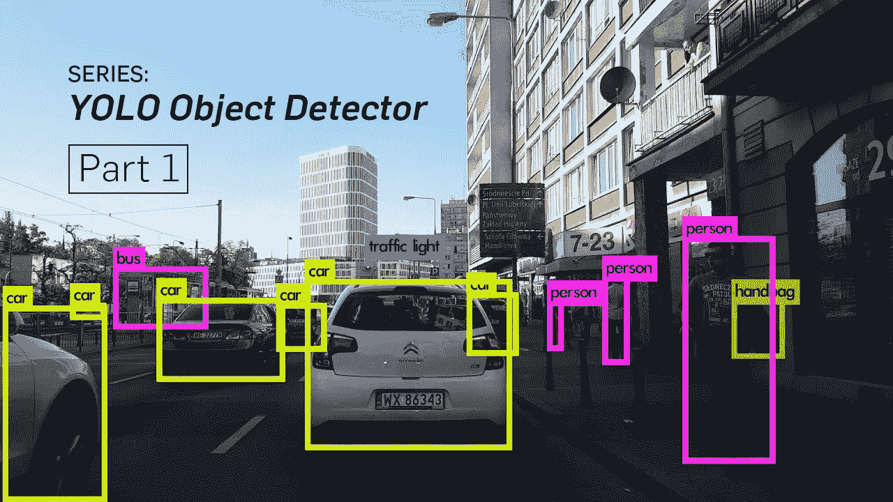
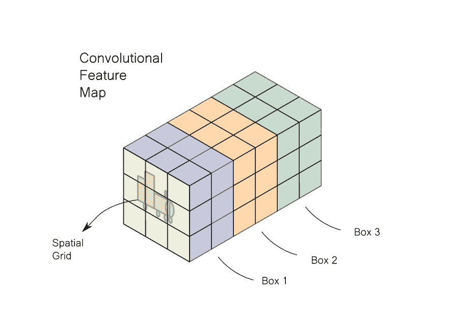
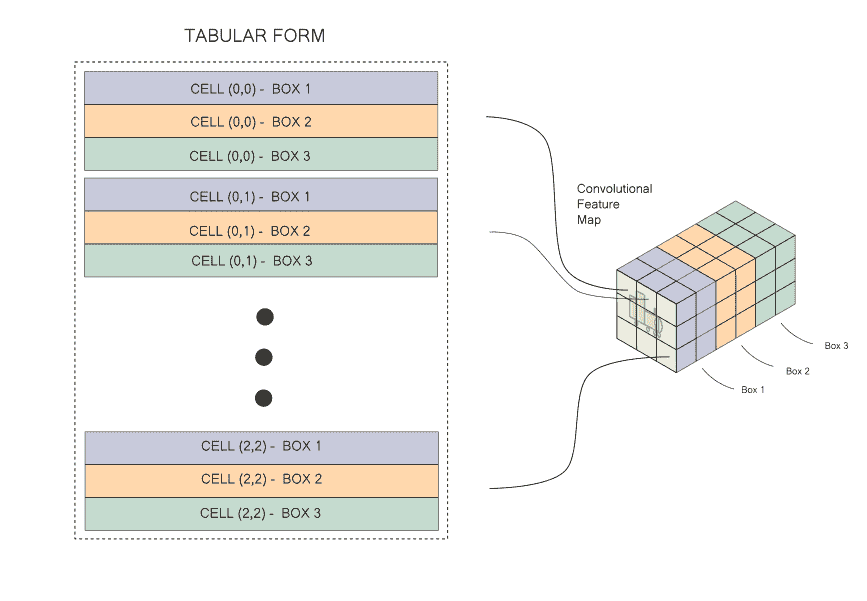
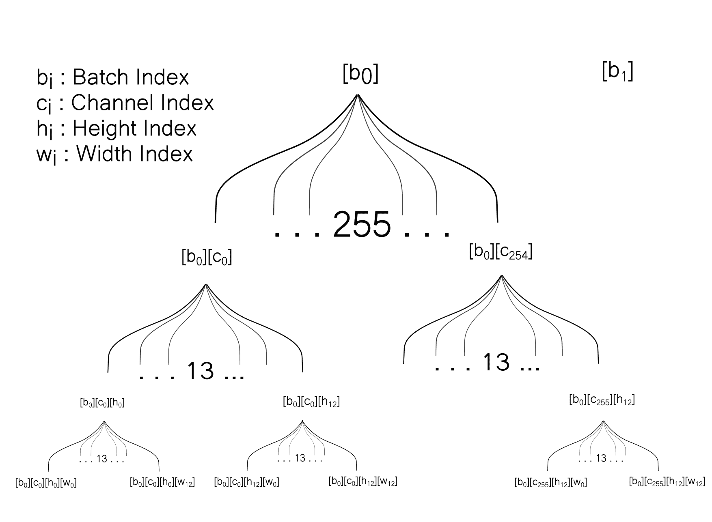
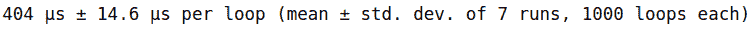
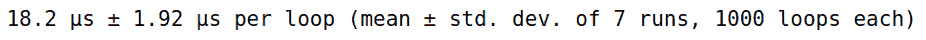

# 如何使用 NumPy 整形和转置来加速对象检测

> 原文：<https://blog.paperspace.com/faster-object-detection-numpy-reshape-transpose/>

这是我们正在进行的 NumPy 优化系列的第 4 部分。在第 1 部分和第 2 部分中，我们介绍了向量化和广播的概念，以及如何应用它们来优化 K-Means 聚类算法的实现。接下来，第 3 部分介绍了一些重要的概念，比如 NumPy 中的步长、整形和转置。在这篇文章的第 4 部分中，我们将讨论如何应用这些概念来加速基于深度学习的物体检测器:YOLO。

下面是前面部分的链接，供您参考。

[NumPy Optimization: Vectorization and Broadcasting | Paperspace BlogIn Part 1 of our series on writing efficient code with NumPy we cover why loops are slow in Python, and how to replace them with vectorized code. We also dig deep into how broadcasting works, along with a few practical examples.Paperspace BlogAyoosh Kathuria](https://blog.paperspace.com/numpy-optimization-vectorization-and-broadcasting/)[Using NumPy to Speed Up K-Means Clustering by 70x | Paperspace BlogIn this part we’ll see how to speed up an implementation of the k-means clustering algorithm by 70x using NumPy. We cover how to use cProfile to find bottlenecks in the code, and how to address them using vectorization.Paperspace BlogAyoosh Kathuria](https://blog.paperspace.com/speed-up-kmeans-numpy-vectorization-broadcasting-profiling/)[NumPy Internals, Strides, Reshape and Transpose | Paperspace BlogWe cover basic mistakes that can lead to unnecessary copying of data and memory allocation in NumPy. We further cover NumPy internals, strides, reshaping, and transpose in detail.Paperspace BlogAyoosh Kathuria](https://blog.paperspace.com/numpy-optimization-internals-strides-reshape-transpose/)

第 3 部分概述了如何使用类似于`reshape`和`transpose`的各种操作来避免不必要的内存分配和数据复制，从而加速我们的代码。在这一部分，我们将看到它的实际应用。

我们将特别关注对象检测器输出管道中的一个特定元素，它涉及到重新安排内存中的信息。然后我们将实现一个*天真的*版本，通过使用一个循环将信息复制到一个新的地方来执行信息的重新排列。接下来我们将使用`reshape`和`transpose`来优化操作，这样我们就可以不使用循环来完成它。这将导致探测器的 FPS 速度大大加快。

所以让我们开始吧！

## 理解问题陈述

我们在这里处理的问题是由嵌套循环引起的(这并不奇怪！).几年前，当我在一个名为 YOLO(你只能看一次)的基于深度学习的对象检测器的输出管道上工作时，我遇到了它。

现在，我不想离题到 YOLO 的细节，所以我将保持问题陈述非常有限和简洁。我将描述足够多的内容，这样即使你从未听说过对象检测，你也能理解。

然而，如果您有兴趣跟进，我已经写了一个关于如何从零开始实现 YOLO 的 5 部分系列。

[Tutorial on implementing YOLO v3 from scratch in PyTorchTutorial on building YOLO v3 detector from scratch detailing how to create the network architecture from a configuration file, load the weights and designing input/output pipelines.Paperspace BlogAyoosh Kathuria](https://blog.paperspace.com/how-to-implement-a-yolo-object-detector-in-pytorch/)

YOLO 使用卷积神经网络来预测图像中的对象。*检测器*的输出是卷积特征图。

以防上面的几行听起来像胡言乱语，这里有一个简化的版本。YOLO 是一个神经网络，它将输出一个*卷积特征图，*只是一个计算机视觉中常用的数据结构的花哨名称(就像链表、字典等)。).

一个*卷积特征图*本质上是一个多通道的空间网格。每个通道都包含有关空间格网中所有位置的特定要素的信息。在某种程度上，图像也可以定义为卷积特征图，用 3 个通道来描述红色、绿色和蓝色的强度。三维图像，其中每个通道包含一个特定的特征。

假设我们正试图检测包含轨道引擎的图像中的对象。我们将图像提供给网络，输出如下图所示。



图像被分成一个网格。特征图的每个单元在对应于每个网格单元的图像的特定部分中寻找对象。每个单元包含关于在网格中居中的 3 个边界框的数据。如果我们有一个网格，比如说`3 x 3`，那么我们将有`3 x 3 x 3 = 27`个这样的盒子的数据。输出管道将过滤这些盒子，留下几个包含对象的盒子，而其他大多数将被拒绝。涉及的典型步骤有:

1.  基于某个分数的阈值盒。
2.  移除指向同一对象的所有重叠框，只留下一个。
3.  将数据转换成可以在图像上绘制的实际方框。

然而，鉴于信息在卷积特征图中的存储方式，执行上面强调的操作可能会导致混乱的代码(有关更多详细信息，请参考 YOLO 系列的[第 4 部分](https://blog.paperspace.com/how-to-implement-a-yolo-v3-object-detector-from-scratch-in-pytorch-part-4/))。为了使代码更容易阅读和管理，我们希望将存储在卷积特征图中的信息重新整理为表格形式，如下所示。


这就是问题所在！我们只需要重新整理信息。就是这样。没必要深入 YOLO！所以让我们开始吧。

### 设置实验

为了这个实验的目的，我提供了 pickled 卷积特征图，可以从[这里](https://drive.google.com/file/d/1ZQuSYyzzGSUPc7z2toirn8HB2j7Z0Jr9/view?usp=sharing)下载。

我们首先使用`pickle`将特征图加载到系统中。

```py
import pickle 
conv_map = pickle.load(open("conv_map.pkl", "rb")) 
```

PyTorch 中的卷积神经网络是最广泛使用的深度学习库之一，以`[B x C x H x W]`格式存储，其中`B`是批量大小，`C`是通道，`H`和`W`是维度。在上面使用的可视化中，卷积图是用格式`[H W C]`演示的，但是使用`[C H W]`格式有助于优化底层的计算。

pickled 文件包含一个 NumPy 数组，表示一个`[B C H W]`格式的卷积特征图。我们首先打印加载的数组的形状。

```py
print(conv_map.shape)
#output -> (1, 255, 13, 13)
```

这里批量为 1，通道数为 255，空间维度为`13 x 13`。255 个通道对应于 3 个盒子，每个盒子的信息由 85 个浮点表示。我们想要创建一个数据结构，其中每行代表一个盒子，我们有 85 列代表这个信息。

### 天真的解决方案

让我们先尝试一下简单的解决方案。我们将首先为新的数据结构预分配空间，然后通过循环卷积特征图来填充空间。

```py
# Get the shape related info
b, c, h, w = (conv_map.shape)
box_info_length = 85

# Pre-allocate the memory
counter = 0
output = np.zeros((b, c * h * w // box_info_length, box_info_length))

# Loop over dimensions
for x_b in range(b):
    for x_h in range(h):
        for x_w in range(w):
            for x_c in range(0, c, box_info_length):
            	# Set the values
                output[x_b, counter] = conv_map[x_b, x_c: x_c + box_info_length, x_h, x_w]
                counter += 1 
```

我们首先遍历图像中的每个单元格，然后遍历该单元格描述的每个方框。

你可能已经发现，四重嵌套循环不是一个好主意。如果我们使用更大的图像尺寸(更大的`h`和`w`)、每个单元更大数量的盒子(`c`)或者更大的批量(`b`)，解决方案将不能很好地扩展。

我们能把这个矢量化吗？这里的操作涉及重新排列信息，而不是执行可以矢量化的操作。即使我们认为重新排列信息是一种*复制*操作，为了得到想要的结果，我们需要以这样一种方式重塑原始数据，使矢量化结果具有我们需要的表格形状。因此，即使对于矢量化，数据整形/重排也是执行矢量化*复制*的先决条件。

因此，如果我们想加速上面的数据整形练习，我们必须想出一种不使用缓慢的 pythonic 循环的方法。我们将使用我们在[第 3 部分](https://blog.paperspace.com/numpy-optimization-internals-strides-reshape-transpose/)(整形和转置)中学到的特性来实现。

### 优化解决方案

让我们从初始化各种辅助变量开始。

```py
output = conv_map[:]
b, c, h, w = (conv_map.shape)
box_info_length = 85
```

1.  `b`是批量大小，1。
2.  `box_info_length`是用来描述单个盒子的元素数量，85。
3.  `c`是通道的数量，或者关于每个网格单元 3 个盒子的信息，`box_info_length` * 3 = 255。
4.  `h`和`w`是空间维度，都是 13。

因此，我们的目标数据结构中的列数将等于`box_info_length` (85)，因为我们需要每行描述一个框。重新插入显示需要执行的转换的图像，供您在此处参考。



从这里开始，我将卷积映射称为源数组，而我们想要创建的表格形式是目标数组。

在我们的目标数组中，第一维是批处理。第二个维度是盒子本身。在我们的例子中，每个单元格预测 3 个盒子，所以我们的目标数组将有`H x W x 3`或`13 x 13 x 3 = 507`个这样的盒子。在我们的源数组中，在任意位置`[h,w]`的 3 个盒子分别由`[h, w, 0:85]`、`[h, w, 85:170]`和`[h, w, 170:255]`给出。我们的目标数组中的三行描述了相同的信息。

在内存中，源数组的数据是这样存储的。



现在，我们想直观地了解数据是如何存储在目标阵列中的。但在此之前，我们想介绍一些术语，以便在源阵列和目标阵列之间映射信息。

在目标数组中，每个方框代表一行。索引为`D (h, w, n)`的行表示由源数组中`[h,w]`处的网格单元预测的框`n`。目标数组中的列表示为代表盒子特征的`[f1, f2......fn]`。


我们的源数组有 4 维，而我们的目标数组有 3 维。用于表示源数组中盒子(`h`和`w`)的空间细节的两个维度在目标数组中基本上合并为一个。

因此，我们首先将源数组中的空间维度展平为一个。

```py
output = output.reshape(b, c, h * w) 
```

一旦这样做了，我们是否可以简单地将它整形为数组 to `[b, num_boxes, box_width_length]`并完成它？答案是否定的，为什么？因为我们知道整形不会改变数组在内存中的存储方式。

在我们的数组(我们刚刚重塑的)中，我们以下面的方式存储信息。

```py
[b0][c0][h0,w0]   [b0][c0][h0,w1]   [b0][c0][h0,w2]   [b0][c0][h0,w3] 
```

然而，在我们的目标阵列中，两个相邻的单元描述了单个单元的两个通道。

```py
[b0][D(h0, w0, B0)][f1]  [b0][D(h0, w0, b0)][f2]  [b0][D(h0, w0, b0)][f3] 
```

**对于每个批次，并且对于该批次中的每个空间位置，存储跨通道的信息，然后移动到另一个空间位置，然后移动到另一个批次元素。**

注`f1....fn`基本上是沿通道描述的信息，通道`c`在源阵列中。(参考上面的转换图)。

这意味着在内存中，我们的源数组以不同的方式存储在我们的目标数组中。光靠整形是不行的。因此，我们必须修改数组的存储方式。

我们拥有的数组和我们想要得到的数组之间的根本区别在于编码通道和空间信息的维度顺序。如果我们使用现有的数组，并交换通道和空间特征的维度，我们将得到一个这样存储在内存中的数组。

```py
[b0][h0,w0][c0]   [b0][h0,w0][c1]   [b0][h0,w0][c2]  [b0][h0,w0][c3] 
```

这正是信息在目标阵列中的存储方式。尺寸的重新排序可以通过`transpose`操作来完成。

```py
output = output.transpose(0, 2, 1) 
```

然而，我们的工作还没有完成。在新数组的第三维中，我们仍然拥有完整的通道信息。如上所述，频道信息包含三个首尾相连的盒子的信息。

我们现在拥有的数组的形状是`[b][h*w][c]`。`arr[b][h,w]`描述了三个盒子`arr[b][h,w][c:c//3]`、`arr[b][h,w][c//3: 2*c//3]`和`arr[b][h,w][2*c//3:c]`。我们想要做的是创建一个形状为`[b][h*w*3][c/3]`的数组，这样每个通道的 3 个盒子在第二维空间中被容纳为 3 个条目。

请注意，我们当前数组在内存中的存储方式与我们的目标数组是一样的。

```py
# Current Array
[b0][h0,w0][c0]   [b0][h0,w0][c1]   [b0][h0,w0][c2]  [b0][h0,w0][c3]  

# Destination Array 
[b0][D(h0, w0, b0)][f1]  [b0][D(h0, w0, b0)][f2]  [b0][D(h0, w0, b0)][f3] 
```

因此，我们可以使用一个`reshape`操作轻松地将当前数组转换成目标数组。

```py
output = output.reshape(b, c * h * w // box_info_length, box_info_length) 
```

这最终给了我们想要的没有循环的输出！

### 为新代码计时

现在我们有了完成任务的新方法。让我们比较一下两个版本的代码所用的时间。先给循环版计时。

```py
%%timeit -n 1000
counter = 0

b, c, h, w = (conv_map.shape)
box_info_length = 85

counter = 0
output = np.zeros((b, c * h * w // box_info_length, box_info_length))

for x_b in range(b):
    for x_h in range(h):
        for x_w in range(w):
            for x_c in range(0, c, box_info_length):
                output[x_b, counter] = conv_map[x_b, x_c: x_c + box_info_length, x_h, x_w]
                counter += 1 
```



现在让我们对优化后的代码计时。

```py
%%timeit -n 1000

output = conv_map[:]

b, c, h, w = (conv_map.shape)
box_info_length = 85

output = output.reshape(b, c, h * w)
output = output.transpose(0, 2, 1)
output = output.reshape(b, c * h * w // box_info_length, box_info_length)
```



我们看到优化后的代码运行时间约为 18.2 纳秒，比循环版本快 20 倍！

### 物体探测器对 FPS 的影响

虽然优化后的代码运行速度比循环版本快 20 倍左右，但当我在我的 RTX 2060 GPU 上使用 0.75 的 ***置信度阈值*** **时，实际的 FPS 提升约为 8 倍。**我们之所以获得较小的加速是因为下面提到的几个原因。

首先，如果检测到的对象数量太多，那么代码的瓶颈就变成了在图像上绘制矩形框，而不是输出管道。因此，来自输出流水线的增益并不完全对应于 FPS 中的增益。

第二，每帧有不同数量的盒子。甚至帧速率的移动平均值在整个视频中也是变化的。当然，甚至置信度阈值也会影响帧速率，因为置信度阈值越低，意味着检测到的盒子越多。

第三，你得到的加速可能会因你使用的 GPU 类型而异。

这就是为什么我演示了代码片段之间的时间差，而不是检测器本身。检测器的 FPS 加速会根据我上面提到的参数而有所不同。然而，每次我使用这个技巧，我的速度总是相当可观。即使 FPS 的速度提高了 5 倍，也意味着可以实时执行对象检测。

设置一个物体检测器可能是一个相当复杂的练习，超出了本文的范围，因为不是所有的读者都喜欢基于深度学习的计算机视觉。对那些感兴趣的人，你可以看看我的 YOLO 系列。该特定实现使用整形和转置来加速输出流水线。

## 结论

各位，这部分到此为止。在这一部分中，我们看到了像`reshape`和`transpose`这样的方法是如何帮助我们加速信息重组任务的。虽然`transpose`不需要复制，但是循环仍然被移到 C 例程中，因此比使用 pythonic 循环实现的转置要快。

虽然我们优化了对象检测器的输出，但类似的想法也可以应用于类似语义分割、姿态检测等相关应用。其中卷积特征图是我们的最终输出。现在，我将停止这个系列。我希望这些帖子能帮助你更好地理解 NumPy，并写出更优化的代码。在那之前，结束！