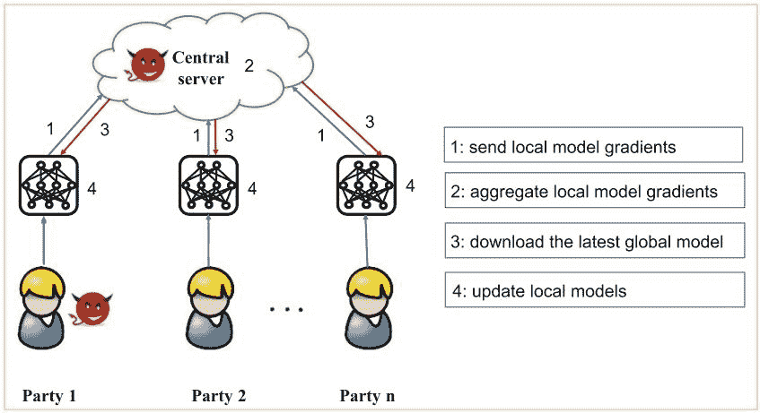
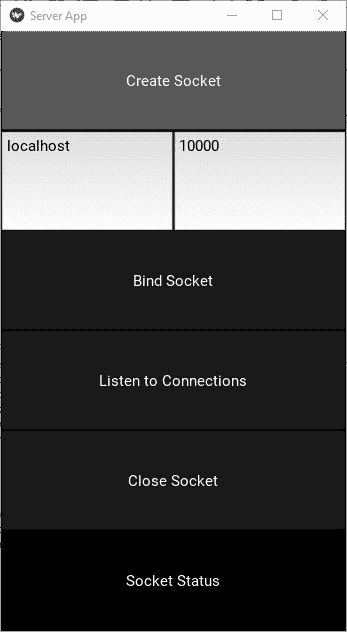
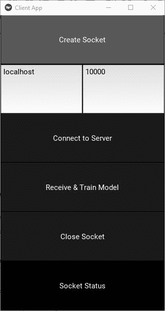

# 使用 Keras 的联合学习

> 原文：<https://blog.paperspace.com/federated-learning-with-keras/>

每秒钟都会产生大量的数据。例如，用户在浏览网页或使用应用程序时，经常通过触摸屏幕来生成数据。使用机器学习来增强用户体验的应用程序可能会受益于此类数据，因为它包含有助于增强未来预测的信息。

也就是说，出于隐私考虑，这些数据可能不会与其他人共享。为了保持数据的私密性，但仍然用它来训练机器学习模型，**保护隐私的机器学习**一直在兴起。

本教程讨论了如何使用联邦学习来训练 Keras 模型，同时保持用户数据的私密性。本教程的代码可以在这个 [GitHub 项目](https://github.com/ahmedfgad/FederatedLearning)的 [KerasFederated](https://github.com/ahmedfgad/FederatedLearning/tree/master/KerasFederated) 目录下获得，它附带了一个使用 [Kivy](https://kivy.org/) 创建的 GUI。

以下是讨论的主题:

*   联邦学习快速回顾
*   入门指南
*   准备培训数据
*   构建 Keras 模型
*   构建解决方案群体
*   监听服务器上的连接
*   服务器回复客户端请求
*   客户行为
*   结论

## **联合学习快速回顾**

在传统的机器学习中，用户数据被收集到中央服务器中，在那里训练模型。这也被称为集中式机器学习，因为用户数据(即使是私有的)被上传到中央服务器。

正如 Lingjuan 等人(2020) 在他们的论文中提到的，社会已经越来越意识到共享数据侵犯用户隐私的危险。例如，训练一个可以识别人脸的模型来登录应用程序，或者共享透露患者私人信息的医疗记录。

联邦学习(简称 FL)来解决集中式机器学习的隐私相关问题。FL 使用客户端-服务器架构来训练模型。数据在客户端可用，模型在服务器端可用。我们如何使用客户端的数据训练服务器的模型？下一张图来自于[联合学习的威胁](https://link.springer.com/chapter/10.1007/978-3-030-63076-8_1)论文，展示了 FL 是如何工作的。



服务器上有一个全局模型。模型的最新版本与客户端共享，其中每个客户端根据其私有数据更新模型。客户端只与更新全局模型的服务器共享训练模型的梯度。

联邦学习不是从天上掉下来的，仍然受到一些隐私问题的困扰。这篇[综述论文](https://link.springer.com/chapter/10.1007/978-3-030-63076-8_1)将 FL 攻击总结为:

1.  投毒攻击:模型做出符合攻击者目的的预测。
2.  推理攻击:攻击者恢复用户的私有数据。

有关 FL 的更多信息，请查看以下资源:

*   [联邦学习简介](https://heartbeat.fritz.ai/introduction-to-federated-learning-40eb122754a2)
*   [联合学习:没有集中训练数据的协作机器学习](https://ai.googleblog.com/2017/04/federated-learning-collaborative.html)
*   [杨，羌兵。联合学习:隐私和激励。斯普林格自然，2020 年](https://link.springer.com/book/10.1007/978-3-030-63076-8)

本教程的剩余部分将重点描述如何为联邦学习训练我们的 Keras 模型。

## **入门**

在使用 FL 构建和训练 Keras 模型之前，让我们先熟悉一下将要使用的项目。基础项目在[链接](https://github.com/ahmedfgad/FederatedLearning)可用。该项目中发布的示例展示了如何使用神经网络来训练 XOR 问题，该神经网络使用遗传算法和 [PyGAD](https://pygad.readthedocs.io) 库来训练。该项目有一个 GUI 来简化交互。

下载项目后，根目录下有三个 Python 文件，它们是:

1.  `server.py`:FL 服务器建立模型并发送给客户端。
2.  `client1.py`:一个客户端有 2 个训练样本。
3.  `client2.py`:另一个客户有另外 2 个训练样本。

您可以根据需要添加更多客户端。这个项目使用 Python 套接字编程从头开始构建客户机和服务器。

通过运行服务器，出现以下 Kivy 窗口。以下是对 GUI 中按钮的描述:

*   **创建套接字**:创建一个套接字。
*   **绑定套接字**:将套接字绑定到在两个文本字段中输入的 IPv4 地址和端口号。
*   **听连接**:打开插座进行连接。
*   **关闭插座**:关闭插座。
*   **插座状态**:显示一些信息性消息。



ِAfter 服务器运行，接下来是运行客户端。当客户端运行时，下图中的 GUI 会显示以下按钮:

*   **创建套接字**:创建一个套接字。
*   **连接到服务器**:将客户端的套接字连接到服务器的套接字。确保服务器的套接字接受连接。
*   **接收&训练模型**:这是实际工作发生的地方，因为客户机从服务器接收模型，训练它，并将其发送回服务器。
*   **关闭插座**:关闭插座。



服务器有一个**超时计时器**，默认为 **5 秒**。如果在此超时时间内没有收到数据，则连接关闭。这意味着服务器必须在 5 秒内响应客户端。如果客户端训练模型和响应服务器的时间超过 5 秒，请增加该时间。

对于客户端，定时器时间是在创建`RecvThread`类的实例时指定的。对于服务器来说，时间是`SocketThread`类的一个属性。

一旦误差为 0.0 美元，服务器就停止训练模型。只要不是$0.0，$服务器就会一直把模型发送给客户端。下图总结了客户端和服务器之间的通信。


当客户机第一次连接到服务器时，它发送一个 **echo** 消息。服务器用其全局模型的副本来响应回显消息。

客户端基于其本地数据训练模型，并将训练好的模型发送到服务器。服务器根据其测试数据评估模型。如果服务器决定需要更多的训练，服务器用模型的最新副本来响应客户端。这个过程一直持续到服务器将模型标记为已训练。此时，客户端和服务器之间的连接关闭。

在模型被训练之后，服务器不再将模型发送给客户端，并且连接变为空闲。超时计时器到期后，服务器和客户端之间的连接会自动关闭。

确保项目按预期运行后，让我们继续下一部分，准备用于训练模型的数据。稍后，创建 Keras 模型，并准备使用 [PyGAD](https://pygad.readthedocs.io) 进行训练。

## **准备培训数据**

为了使用 FL 训练模型，训练数据分布在客户端上。服务器本身没有任何训练数据，只有测试数据来评估从客户端接收的模型。

本教程中讨论的示例只是考虑基于 XOR 问题的训练样本来训练 Keras 模型。XOR 问题只有 4 个样本，如下面的代码所示。

每个样本的输出是两个元素的向量。如果第一个元素是$1$，那么这个样本的 XOR 的输出是$1$。如果第二个元素是$0$，那么这个样本的 XOR 输出是$1$。例如，分配给样本`[1, 1]`的输出向量是`[1, 0]`，这意味着输出是$0$。

```py
data_inputs = numpy.array([[1, 1],
                           [1, 0],
                           [0, 1],
                           [0, 0]])

data_outputs = numpy.array([[1, 0], 
                            [0, 1], 
                            [0, 1], 
                            [1, 0]])
```

在本教程中，将只有 2 个客户端，其中每个客户端只有 2 个训练样本。第一个客户端有以下两个样本:

```py
data_inputs = numpy.array([[1, 1],
                           [1, 0]])

data_outputs = numpy.array([[1, 0], 
                            [0, 1]])
```

第二个客户端有另外两个样本:

```py
data_inputs = numpy.array([[0, 1],
                           [0, 0]])

data_outputs = numpy.array([[0, 1], 
                            [1, 0]])
```

因为 XOR 问题没有额外的样本用作测试数据，所以使用相同的训练数据作为测试数据。如果你正在解决另一个有大量数据的问题，那么使用一些不同于训练样本的测试样本。

给定训练数据，下一节构建处理 XOR 问题的 Keras 模型。

## **建立 Keras 模型**

根据您的喜好，使用顺序 API 或函数 API 构建 Keras 模型。下面是一个为 XOR 问题构建简单 Keras 模型的示例。该模型有以下 3 层:

1.  两个神经元的输入。
2.  隐藏着 4 个神经元。
3.  具有 2 个神经元和 Softmax 功能的输出。

输入的数量是 2，因为 XOR 的每个样本只有 2 个输入。

```py
import tensorflow.keras

num_inputs = 2
num_classes = 2

input_layer  = tensorflow.keras.layers.Input(num_inputs)
dense_layer = tensorflow.keras.layers.Dense(4, activation="relu")(input_layer)
output_layer = tensorflow.keras.layers.Dense(num_classes, activation="softmax")(dense_layer)

model = tensorflow.keras.Model(inputs=input_layer, outputs=output_layer)
```

下一节使用创建的模型为遗传算法创建一组解决方案。

## **构建解决方案群体**

本教程不使用梯度下降，而是使用遗传算法来训练 Keras 模型。要了解训练是如何工作的，请查看本教程:[如何使用 PyGAD 的遗传算法训练 Keras 模型](https://blog.paperspace.com/train-keras-models-using-genetic-algorithm-with-pygad)。

下一个代码块使用`pygad.kerasga.KerasGA`类构建一组解决方案，其中每个解决方案包含 Keras 模型参数的一些值。在本例中，使用了 10 种溶液。

```py
import pygad.kerasga

num_solutions = 10
keras_ga = pygad.kerasga.KerasGA(model=model,
                                 num_solutions=num_solutions)
```

解决方案的群体被保存到`KerasGA`类的`population_weights`属性中。因此，可以按如下方式简单地访问它:

```py
keras_ga.population_weights
```

下一节展示了服务器如何监听来自客户端的连接。

## **在服务器上监听连接**

服务器有一个名为`ListenThread`的类，是一个从服务器 socket 打开那一刻开始的线程。对于来自客户端的每个连接，从`SocketThread`类创建一个新的实例来服务客户端。

在`SocketThread`类的构造函数中，有两个重要的参数:

1.  `buffer_size`:缓冲区大小(以字节为单位)。它默认为 **1，024** ，这意味着该模型被分割成一个个 **1，024** 字节的块。如果模型尺寸较大，请使用较大的值。否则，服务器可能要花很多时间从客户端接收模型。
2.  `recv_timeout`:如果在此秒数后没有从客户端收到任何信息，将关闭与客户端的连接。如果在客户端训练模型需要很长时间，请允许服务器等待更长时间(更多秒)。如果未正确设置此参数，则当客户端使用其本地数据训练模型时，连接可能会关闭。

```py
socket_thread = SocketThread(...,
                             buffer_size=1024,
                             recv_timeout=10)
```

下一节讨论服务器如何响应客户机的请求。

## **服务器回复客户端请求**

`server.py`脚本有一个名为`SocketThread`的类，它有 4 个方法:

1.  `run()`:这个方法运行一个无限循环来接收客户端的消息。
2.  `recv()`:接收客户端的消息。
3.  `reply()`:回复客户端。
4.  `model_averaging()`:计算模型中的当前参数与从客户端接收的模型之间的平均值。

本节重点介绍`reply()`和`model_averaging()`方法。

在`reply()`方法中，服务器根据从客户端接收到的信息决定其响应。客户端通常发送以下形式的嵌套字典:

```py
data = {"subject": ..., 
        "data": {"best_model_weights_vector": ...}}
```

它有两把钥匙:

1.  `subject`:其值可以是`echo`或`model`。
2.  `data`:它的值可以是`None`，也可以是到目前为止只有一个名为`best_model_weights_vector`的键的字典。

如果`subject`是`echo`，这意味着客户端刚刚打开了与服务器的连接。`subject="echo"`时客户端可能会也可能不会发送模型。因此，如果分配给键`best_model_weights_vector`的值是`None`，客户端没有发送模型。在这种情况下，服务器会回复其最新型号。

如果在`subject="echo"`时分配给`best_model_weights_vector`键的值不是`None`，那么服务器仅在模型的当前精度不是`1.0`时才回复模型，这意味着模型是 100%准确的。服务器回复的消息是以下形式的嵌套字典:

```py
data = {"subject": ..., 
        "data": {
            "population_weights": ...,
            "model_json": ...,
            "num_solutions": ...
                }
       }
```

下面是对这些键的含义的描述:

1.  `subject`:消息主题可以是`"model"`也可以是`"done"`。如果设置为`"model"`，那么客户端知道服务器正在发送模型。如果它被设置为`"done"`，那么客户端知道模型被训练。
2.  `population_weights`:保存所有解的参数的群体。
3.  `model_json`:JSON 格式的 Keras 模型架构。
4.  `num_solutions`:群体中解的数量。

下面的代码块实现了到目前为止所讨论的内容。首先，它检查主题是否是`"echo"`。如果是这样，那么它准备一个字典来保存群体、模型架构和许多解决方案，并将它发送给客户机。

如果`subject`是`"model"`，那么客户端将模型附加到它的消息中。因此，分配给键`best_model_weights_vector`的值包含了模型的参数。如果`subject`为`"done"`，则模型被训练，`data`键将被设置为`None`。

如果`model`不是`None`，这意味着客户端在其消息中附加了一个模型。服务器首先检查自己的模型精度是否为 1.0。如果是，那么服务器将不会向客户端发送模型(`data`键设置为`None`),因为服务器不再需要训练模型。如果准确度不是 1.0，则服务器回复其要在客户端训练的模型。

```py
def reply(self, received_data):

    ...

    if subject == "echo":
        if model is None:
            data_dict = {"population_weights": keras_ga.population_weights,
                         "model_json": model.to_json(),
                         "num_solutions": keras_ga.num_solutions}
            data = {"subject": "model", "data": data_dict}
        else:
            predictions = model.predict(data_inputs)
            ba = tensorflow.keras.metrics.BinaryAccuracy()
            ba.update_state(data_outputs, predictions)
            accuracy = ba.result().numpy()
            if accuracy == 1.0:
                data = {"subject": "done", "data": None}
            else:
                data_dict = {"population_weights": keras_ga.population_weights,
                             "model_json": model.to_json(),
                             "num_solutions": keras_ga.num_solutions}
                data = {"subject": "model", "data": data_dict}
    elif subject == "model":
        best_model_weights_vector = received_data["data"]["best_model_weights_vector"]
        best_model_weights_matrix = pygad.kerasga.model_weights_as_matrix(model=model, weights_vector=best_model_weights_vector)

        new_model = tensorflow.keras.models.clone_model(model)
        new_model.set_weights(weights=best_model_weights_matrix)
        predictions = model.predict(data_inputs)

        ba = tensorflow.keras.metrics.BinaryAccuracy()
        ba.update_state(data_outputs, predictions)
        accuracy = ba.result().numpy()

        if accuracy == 1.0:
            data = {"subject": "done", "data": None}
            response = pickle.dumps(data)
            return

        self.model_averaging(model, best_model_weights_matrix)

    predictions = model.predict(data_inputs)

    ba = tensorflow.keras.metrics.BinaryAccuracy()
    ba.update_state(data_outputs, predictions)
    accuracy = ba.result().numpy()

    if accuracy != 1.0:
        data_dict = {"population_weights": keras_ga.population_weights,
                     "model_json": model.to_json(),
                     "num_solutions": keras_ga.num_solutions}
        data = {"subject": "model", "data": data_dict}
        response = pickle.dumps(data)
    else:
        data = {"subject": "done", "data": None}
        response = pickle.dumps(data)

    ...
```

如果`subject`键是`"model"`，那么客户端发送一个模型。在这种情况下，服务器获取 Keras 模型参数，并在`best_model_weights_matrix`变量中以矩阵形式准备它们。基于这些参数，计算模型精度。

如果精度为 1.0，则模型训练成功，服务器不会将模型发送给客户端。否则，使用`model_averaging()`方法将从客户端接收的参数与服务器端的参数进行平均。

调用`model_averaging()`方法后，再次计算模型精度。如果精度不是 1.0，则服务器将新的模型参数发送给客户端。否则，不发送模型。

下面给出了`model_averaging()`方法的实现。它接收服务器的模型和从客户端接收的参数，并对它们进行平均。最后，将新参数设置到模型中。

```py
def model_averaging(self, model, best_model_weights_matrix):
    model_weights_vector = pygad.kerasga.model_weights_as_vector(model=model)
    model_weights_matrix = pygad.kerasga.model_weights_as_matrix(model=model, weights_vector=model_weights_vector)

    new_weights = model_weights_matrix
    for idx, arr in enumerate(new_weights):
        new_weights[idx] = new_weights[idx] + best_model_weights_matrix[idx]
        new_weights[idx] = new_weights[idx] / 2

    model.set_weights(weights=new_weights)
```

现在，描述服务器行为。 [`server.py`](https://github.com/ahmedfgad/FederatedLearning/blob/master/KerasFederated/server.py) 剧本在这里[有。](https://github.com/ahmedfgad/FederatedLearning/blob/master/KerasFederated/server.py)

下一节讨论客户端的行为。

## **客户端行为**

客户端有一个名为`RecvThread`的类，它创建一个线程，从客户端和服务器之间的连接打开时就开始工作，一直运行到连接关闭。

这个类有两个方法:

*   `run()`:此方法使用无限循环在客户端之间发送和接收数据。
*   `recv()`:接收服务器的消息。

下面是`run()`方法的重要代码部分。当客户端发出第一个请求时，它的主题是`"echo"`，而`best_model_weights_vector`键被设置为`None`。

然后，客户机接收服务器的响应，并检查响应的`subject`。如果是`"model"`，那么服务器发来一个模型。如果是`"done"`，那么客户端打破无限循环关闭连接。

```py
def run(self):

    ...

    subject = "echo"
    server_data = None
    best_model_weights_vector = None
    best_sol_idx = -1

    while True:
        data_dict = {"best_model_weights_vector": best_model_weights_vector}
        data = {"subject": subject, "data": data_dict}

        data_byte = pickle.dumps(data)

        try:
            self.kivy_app.soc.sendall(data_byte)
        except BaseException as e:
                break

        received_data, status = self.recv()

        subject = received_data["subject"]
        if subject == "model":
            server_data = received_data["data"]
        elif subject == "done":
            break
        else:
            break

        ga_instance = prepare_GA(server_data)

        ga_instance.run()

        subject = "model"
        best_sol_idx = ga_instance.best_solution()[2]
        best_model_weights_vector = ga_instance.population[best_sol_idx, :]

        ... 
```

基于服务器发送的模型，调用名为`prepare_GA()`的函数，该函数使用 [PyGAD](https://pygad.readthedocs.io) 使用遗传算法训练模型。

一旦训练完成，服务器回复客户端，同时将`subject`键的值设置为`"model"`，将`best_model_weights_vector`键的值设置为最佳模型的参数。

请注意，所有客户端的工作方式都相同，只是使用的训练数据不同。该项目有两个客户。在[的](https://github.com/ahmedfgad/FederatedLearning/tree/master/KerasFederated)目录下，客户端的脚本被命名为 [`client1.py`](https://github.com/ahmedfgad/FederatedLearning/blob/master/KerasFederated/client1.py) 和 [`client2.py`](https://github.com/ahmedfgad/FederatedLearning/blob/master/KerasFederated/client2.py) 。

## **结论**

本教程讨论了如何使用联邦学习来训练 Keras 模型。联合学习是一种客户端-服务器范式，其中一些客户端使用其私有数据训练全局模型，而不将其共享给中央服务器。

所讨论的例子只有两个客户端，它们一起工作来训练一个构建 XOR 门的模型。该模型在不共享客户私人数据的情况下被训练。

您可以轻松地将该项目与其他数据一起使用。您需要做的就是在服务器和客户端设置`data_inputs`和`data_outputs`数组。