# 前馈与反馈神经网络

> 原文：<https://blog.paperspace.com/feed-forward-vs-feedback-neural-networks/>

神经网络的结构在许多应用的人工智能建模研究中变得越来越重要。已经开发了两种相反的结构范例:反馈(递归)神经网络和前馈神经网络。在本文中，我们在全面分析了这两种体系结构之后，对它们进行了深入的比较。然后，我们通过一些用例比较每个神经网络结构的性能。

* * *

首先，让我们从基础开始。

## 什么是神经网络？

作为深度学习的基本构建模块，神经网络以模拟人脑的行为而闻名，同时处理具有挑战性的数据驱动问题。

为了产生所需的输出，输入数据通过几层人工神经元进行处理，这些人工神经元一层叠一层。应用范围从简单的图像分类到更关键和复杂的问题，如自然语言处理、文本生成和其他与世界相关的问题。

# 神经网络的要素

构成神经网络结构的神经元复制了大脑的有机行为。

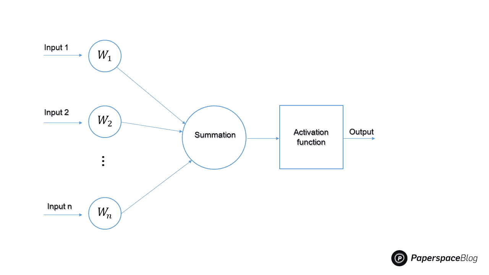

Elementary structure of a single neuron in a Neural Network

现在，我们将定义与神经网络相关的各种组件，并展示我们如何从神经元的基本表示出发，构建一些最复杂的架构。

### 投入

它是输入学习模型的数据(即特征)的集合。例如，当前大气测量的阵列可以用作气象预测模型的输入。

### 重量

重视最有助于学习过程的特征是使用权重的主要目的。通过在输入值和权重矩阵之间添加标量乘法，我们可以提高某些要素的效果，同时降低其他要素的效果。例如，高音调音符的存在会比在流派之间常见的其他平均音调音符更多地影响音乐流派分类模型的选择。

### 激活功能

为了考虑随着输入改变的线性，激活函数将非线性引入神经元的操作。没有它，输出将只是输入值的线性组合，网络将无法适应非线性。

最常用的激活函数有:单位阶跃、sigmoid、分段线性和高斯函数。

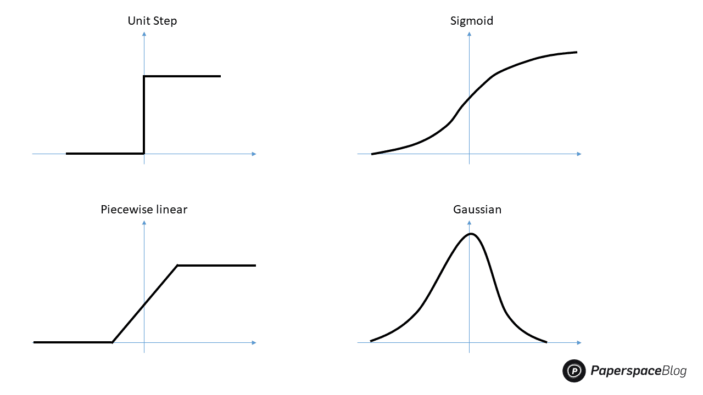

Illustrations of the common activation functions

### 偏见

偏差的目的是改变激活函数产生的值。它的功能相当于线性函数中的常数。所以，这基本上是激活函数输出的一个转移。

## 层

人工神经网络是由多个神经层堆叠而成的。每一层都是由几个神经元堆叠成一排。我们区分三种类型的层:输入层、隐藏层和输出层。

### 输入层

模型的输入层接收我们从图像或数字向量等外部来源引入的数据。这是整个神经网络设计中唯一可以看到的一层，它传输来自外部世界的所有信息，而不进行任何处理。

### 隐藏层

隐藏层使深度学习成为今天的样子。它们是中间层，完成所有计算并提取数据特征。对数据中隐藏特征的搜索可以包括许多相互关联的隐藏层。例如，在图像处理中，第一个隐藏层通常负责更高级别的功能，例如检测边界、形状和边界。另一方面，后面的隐藏层执行更复杂的任务，如分类或分割整个对象。

### 输出层

输出层使用前面隐藏层的数据进行最终预测。这是我们获得最终结果的一层，因此是最重要的一层。

在输出层中，分类和回归模型通常只有一个节点。然而，这完全取决于手头问题的性质以及模型是如何开发的。一些最新的模型具有二维输出层。例如，Meta 的新场景制作模型可以简单地从输入的文本中生成图像。

## 这些层是如何协同工作的？

输入节点以可以用数字表示的形式接收数据。每个节点被分配一个号码；数字越高，激活程度越大。信息显示为激活值。网络然后向外传播这些信息。激活值根据连接强度(权重)从一个节点发送到另一个节点，以表示抑制或激发。每个节点在根据其激活函数改变激活值之前，将它接收到的激活值相加。在到达输出节点之前，激活通过网络的隐藏层传播。然后，输出节点将输入有意义地反映给外部世界。通过将每个节点的权重分配到每个节点负责的误差的比例，误差(即预测值和实际值之间的差)被向后传播。

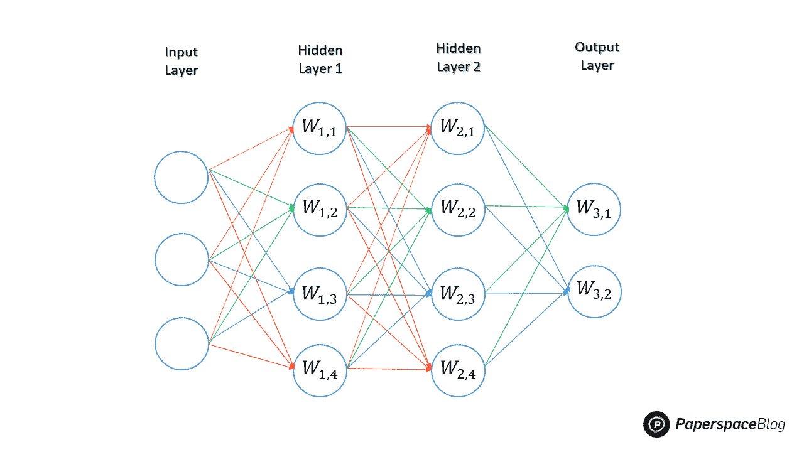

Example of a basic neural network

上述示例中的神经网络包括由三个输入节点组成的输入层、各基于四个节点的两个隐藏层以及由两个节点组成的输出层。

# 前馈神经网络的结构

在前馈网络中，信号只能向一个方向传输。这些网络被认为是具有输入、输出和隐藏层的非递归网络。一层处理单元接收输入数据并在那里执行计算。基于其输入的加权总和，每个处理元件执行其计算。新导出的值随后被用作后续层的新输入值。这一过程一直持续到通过所有层后确定输出为止。

感知器(线性和非线性)和径向基函数网络是前馈网络的例子。事实上，单层感知器网络是最基本的神经网络类型。它有一个单层的输出节点，输入通过一组权重直接输入输出。每个节点计算权重和输入的乘积的总和。这种神经网络结构是第一个也是最基本的架构之一。

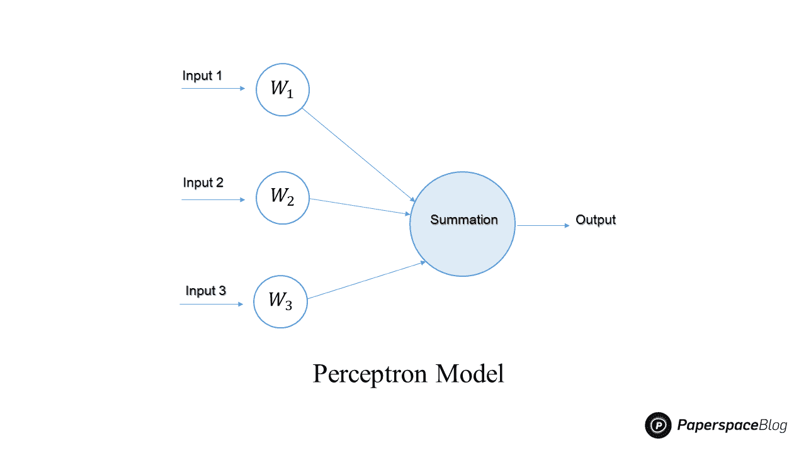

Illustration of the Perceptron basic Model

使用反向传播技术在多层前馈神经网络上进行学习。为每个训练样本生成的属性由输入来激励。隐藏层同时被输入输入层的加权输出。隐藏层的加权输出可以用作附加隐藏层的输入，等等。许多隐藏层的使用是任意的；通常，只有一个用于基本网络。

构成输出层的单元使用最终隐藏层的加权输出作为输入，以扩展给定样本的网络预测。由于它们的符号生物成分，隐藏层和输出层中的单元被描述为神经元或输出单元。

**卷积神经网络**(**CNN**)是前馈架构最知名的迭代之一。它们通过使用线性代数的概念，特别是矩阵乘法来识别图像中的模式，为图像分类和对象识别任务提供了一种更具可扩展性的技术。

下面是一个对手写数字进行分类的 CNN 架构的例子

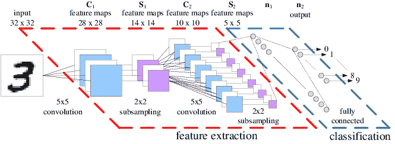

An Example CNN architecture for a handwritten digit recognition task ([source](https://www.researchgate.net/figure/An-Example-CNN-architecture-for-a-handwritten-digit-recognition-task_fig1_220785200))

通过使用相关的滤波器，CNN 可以有效地捕捉图像中的空间和时间相关性。因为需要考虑的因素较少，并且权重可以重复使用，所以该架构提供了对图像数据集的更好拟合。换句话说，网络可以被训练以更好地理解图像的复杂程度。

### 前馈神经网络是如何训练的？

这种网络的典型算法是反向传播。它是一种基于前一个时期(即迭代)中记录的错误率来调整神经网络权重的技术。通过适当调整权重，您可以降低错误率，并通过扩大模型的适用性来提高模型的可靠性。

单个权重的损失函数的梯度通过使用链规则的神经网络反向传播算法来计算。与本机直接计算相比，它一次有效地计算一个层。虽然它计算渐变，但它并不指定如何应用渐变。它扩大了德尔塔规则的计算范围。

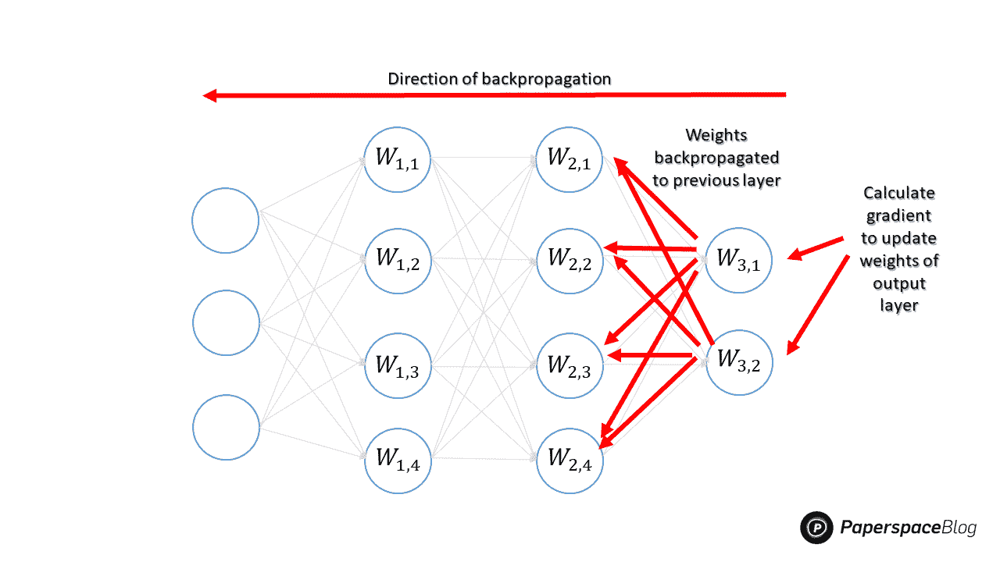

Illustration of back-propagation algorithm

## 反馈神经网络的结构

反馈网络，如**递归神经网络** ( **RNN** )，具有反馈路径，允许信号使用环路在两个方向上传播。神经元的连接可以用任何方式进行。由于这种网络包含环路，它转化为一个非线性动态系统，在训练过程中不断进化，直到达到平衡状态。

在研究中，RNN 是最突出的反馈网络类型。它们是一种人工神经网络，沿着时间序列将节点之间的连接形成有向或无向图。因此，它可以显示时间动态行为。rnn 可以通过使用它们的内部状态来处理不同长度的输入序列，内部状态可以表示一种形式的存储器。因此，它们可用于语音识别或手写识别等应用。

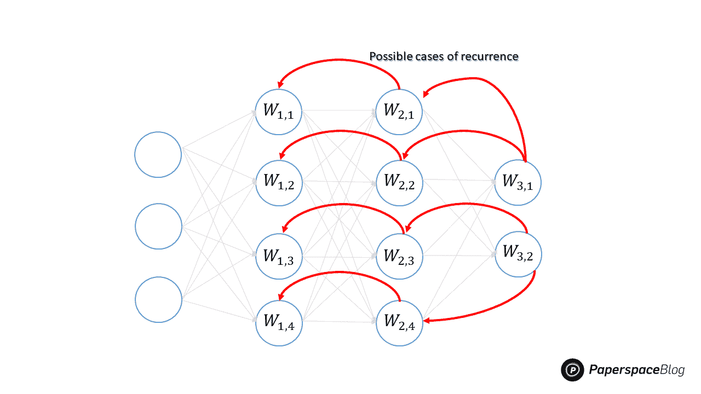

Example of feed-back neural network

如何训练一个反馈神经网络？
穿越时间的反向传播或 BPTT 是这类网络的常用算法。这是一种基于梯度的方法，用于训练特定的递归神经网络类型。并且，它被认为是前馈网络的反向传播的扩展，具有对反馈网络中存在的递归的适应。

## CNN vs RNN

正如已经提到的，CNN 不是像 RNN 那样建造的。rnn 将结果发送回网络，而 CNN 是采用过滤器和池层的前馈神经网络。

在应用方面，细胞神经网络经常被用来模拟涉及空间数据的问题，如图像。当处理时间序列数据时，如文本或图像序列，rnn 表现更好。

这些差异可以归纳在下表中:

|  | 卷积神经网络 | 递归神经网络 |
| --- | --- | --- |
| 体系结构 | 前馈神经网络 | 反馈神经网络 |
| 布局 | 多层节点，包括
卷积层 | 信息向不同方向流动，模拟记忆效应 |
| 数据类型 | 图像数据 | 序列数据 |
| 输入/输出 | 输入和输出
的大小是固定的(即输入图像用
固定大小，输出图像用
分类) | 输入和输出的大小可能不同(例如，接收不同的文本和生成不同的翻译) |
| 用例 | 
图像分类，识别，医学影像，图像分析，
人脸检测 | 文本翻译，自然语言处理，
语言翻译，情感分析 |
| 缺点 | 大量训练数据 | 缓慢而复杂的训练程序 |
| 描述 | CNN 采用神经元连接模式。而且，它们的灵感来自动物视觉皮层中单个神经元的排列，这使它们能够对视野的重叠区域做出反应。 | 递归神经网络使用时间序列信息。例如，用户之前说的话可能会影响模型对他接下来会说什么的预测。 |

## 架构示例

### AlexNet

被称为 **AlexNet** 的卷积神经网络(CNN)架构由 *Alex Krizhevsky* 创建。八层组成了 AlexNet 前五层是卷积层，其中一些是最大池层，最后三层是全连接层。它利用了不饱和 **ReLU** 激活函数，在训练效率上胜过 **tanh** 和 **sigmoid** 。被认为是计算机视觉领域最有影响力的研究之一， [AlexNet](https://proceedings.neurips.cc/paper/2012/file/c399862d3b9d6b76c8436e924a68c45b-Paper.pdf) 引发了大量使用 CNN 和 GPU 加速深度学习的进一步研究的发表。事实上，根据 F 的说法，截至 2022 年，AlexNet 出版物已收到超过 69，000 次引用。

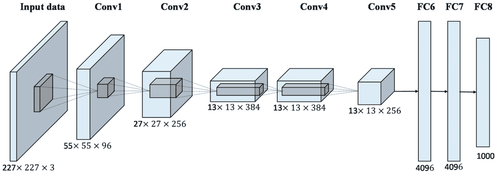

AlexNet Architecture with Pyramid Pooling and Supervision ([source](https://www.mdpi.com/2072-4292/9/8/848))

### LeNet

Yann LeCun 提出了称为 LeNet 的卷积神经网络拓扑。首批卷积神经网络之一 LeNet-5 有助于深度学习的进步。LeNet 是第一个卷积神经网络的原型，拥有卷积神经网络的基本组件，包括卷积层、池层和完全连接层，为其未来的发展奠定了基础。LeNet-5 由七层组成，如图所示。

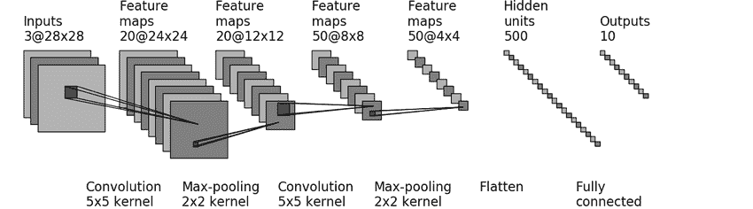

Structure of LeNet-5 ([source](https://www.researchgate.net/figure/Structure-of-LeNet-5_fig1_312170477))

### 长短期记忆(LSTM)

LSTM 网络是 RNNs 的突出例子之一。除了单个数据点之外，这些架构还可以分析完整的数据序列。例如，LSTM 可以用来执行任务，如未分段的笔迹识别，语音识别，语言翻译和机器人控制。

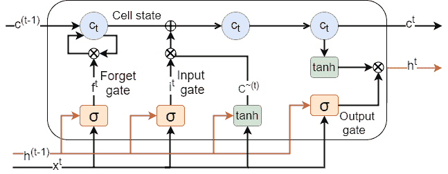

Long Short Term Memory (LSTM) cell ([source](https://www.researchgate.net/figure/Long-Short-Term-Memory-LSTM-cell-Fundamental-components-of-an-LSTM-cell-are-a-forget_fig1_329619613))

LSTM 网络是由细胞构成的(见上图)，LSTM 细胞的基本组成部分一般是:遗忘门，输入门，输出门和细胞状态。

### 门控循环单元(GRU)

这个 RNN 导数与 LSTMs 相当，因为它试图解决表征 RNN 模型的短期记忆问题。GRU 的参数比 LSTM 少，因为它没有输出门，但它类似于带遗忘门的 LSTM。人们发现，GRU 和 LSTM 在一些音乐建模、语音信号建模和自然语言处理任务上表现相似。GRUs 已经在几个较小的、不太频繁的数据集上展示了优越的性能。

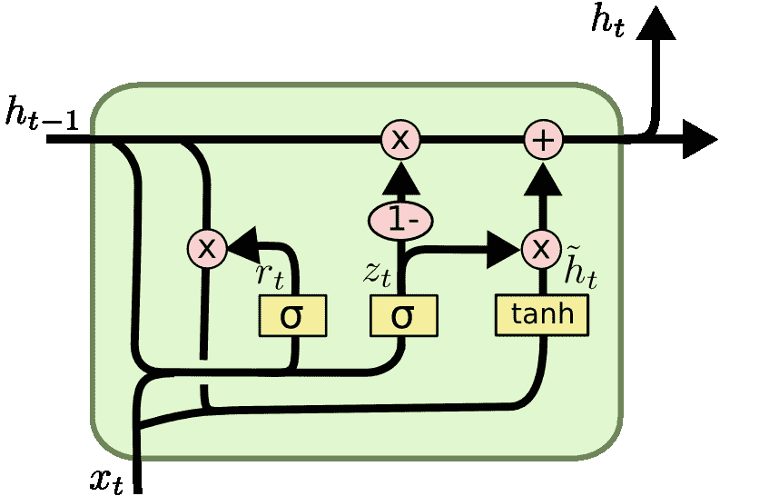

Diagram of the gated recurrent unit cell ([Source](https://www.researchgate.net/figure/Diagram-of-the-gated-recurrent-unit-RNN-GRU-RNN-unit-Diagram-of-the-gated-recurrent_fig1_337294106))

## 用例

根据应用的不同，前馈结构可能更适合某些型号，而反馈设计可能更适合其他型号。这里有几个选择一种架构而不是另一种架构的例子。

### 预测货币汇率

在对日元汇率建模的[研究](https://link.springer.com/article/10.1007/BF00868008)中，尽管应用起来非常简单明了，但样本外数据的结果表明，前馈模型在预测价格水平和价格方向方面相当准确。事实上，前馈模型优于递归网络预测性能。这可能是因为反馈模型必须从后向前和从向前向后传输数据，而反馈模型经常会出现混乱或不稳定。

### 部分遮挡物体的识别

人们普遍认为前馈处理用于物体识别。针对被遮挡刺激的周期性自上而下连接可能能够重建输入图像中丢失的信息。法兰克福高等研究院的研究人员研究了这个话题。他们已经证明，对于遮挡对象检测，递归神经网络架构表现出显著的性能改进。《认知神经科学杂志》的另一篇[文章](https://dl.acm.org/doi/10.1162/jocn_a_00282)报道了同样的发现。由作者进行的实验和模型模拟强调了前馈视觉的局限性，并认为物体识别实际上是一个高度互动的动态过程，依赖于几个大脑区域的合作。

### 图像分类

在某些情况下，当结合适当的训练方法时，简单的前馈结构优于递归网络。例如，ResMLP，一种仅基于多层感知器的图像分类架构。一个[研究](https://arxiv.org/pdf/2105.03404.pdf)项目展示了这种结构在与数据高效训练一起使用时的性能。已经证明，具有残差块的简单残差架构由具有单个隐藏层和线性补丁交互层的前馈网络组成，如果与现代训练方法(如为基于变压器的架构引入的方法)一起使用，则该架构可以在 ImageNet 分类基准上表现得令人惊讶地好。

### 文本分类

如前所述，rnn 是解决文本分类问题最成功的模型。在[研究](https://www.ijcai.org/Proceedings/16/Papers/408.pdf)中提出了三种不同的信息共享策略，用共享层和特定任务层来表示文本。所有这些任务都是在整个网络上联合训练的。在四个基准文本分类任务上的实验表明，所提出的 RNN 模型具有较高的文本分类性能。

另一篇[论文](https://www.ijert.org/research/text-based-sentiment-analysis-using-lstm-IJERTV9IS050290.pdf)中提出了一种基于 LSTM 的文本数据情感分类方法。这种 LSTM 技术展示了情感分类的性能，准确率为 85%，这被认为是情感分析模型的高准确度。

## 教程

在 Paperspace 中，为 CNN 和 rnn 发布了许多教程，我们在此列表中提供了一个简短的选择来帮助您入门:

[Object Localization using PyTorch, Part 2Follow part 2 of this tutorial series to see how to train a classification model for object localization using CNN’s and PyTorch. Then see how to save and convert the model to ONNX.Paperspace BlogNanda Kishor M Pai](https://blog.paperspace.com/object-localization-pytorch-2/)

在本[教程](https://blog.paperspace.com/object-localization-pytorch-2/)中，我们使用 CNN 结构的 PyTorch 实现来定位输入端图像中给定对象的位置。

[Object Detection Using Directed Mask R-CNN With KerasThis tutorial covers how to direct mask R-CNN towards the candidate locations of objects for effective object detection. Full Python code included.Paperspace BlogAhmed Fawzy Gad](https://blog.paperspace.com/object-detection-directed-mask-r-cnn-keras/)

在这篇文章中，我们提出了一个 R-CNN 的实现，使用库 Keras 来制作一个对象检测模型。

[‍Implementing Seq2Seq Models for Text Summarization With KerasThis series gives an advanced guide to different recurrent neural networks (RNNs). You will gain an understanding of the networks themselves, their architectures, applications, and how to bring them to life using Keras.Paperspace BlogSamhita Alla](https://blog.paperspace.com/implement-seq2seq-for-text-summarization-keras/)

而在本文中，我们使用 Keras 实现了一个名为 Seq2Seq 的模型，这是一个用于文本摘要的 RNN 模型。

[A Guide to Bidirectional RNNs With Keras | Paperspace BlogThis series gives an advanced guide to different recurrent neural networks (RNNs). You will gain an understanding of the networks themselves, their architectures, their applications, and how to bring the models to life using Keras.Paperspace BlogSamhita Alla](https://blog.paperspace.com/bidirectional-rnn-keras/)

然后，在这个双向 RNN 的实现中，我们使用库 Keras 建立了一个情感分析模型。

## 结论

简单来说，解决各种挑战需要不同的工具。当你第一次开始使用机器学习时，理解并描述你试图解决的问题是至关重要的。要有足够的能力自己建造东西需要大量的练习，因此增加这方面的知识将有助于实施程序。

在这篇文章中，我们研究了前馈和反馈神经网络拓扑结构之间的差异。然后，我们探讨了这些架构的两个例子，它们推动了人工智能领域的发展:卷积神经网络(CNN)和递归神经网络(RNNs)。然后，我们给出了每个结构的例子以及真实世界的用例。

## 资源

[https://link.springer.com/article/10.1007/BF00868008](https://link.springer.com/article/10.1007/BF00868008)

[https://arxiv.org/pdf/2104.10615.pdf](https://arxiv.org/pdf/2104.10615.pdf)

[https://dl . ACM . org/doi/10.1162/jocn _ a _ 00282](https://dl.acm.org/doi/10.1162/jocn_a_00282)

[https://arxiv.org/pdf/2105.03404.pdf](https://arxiv.org/pdf/2105.03404.pdf)

[https://proceedings . neur IPS . cc/paper/2012/file/c 399862d 3 b 9d 6 b 76 c 8436 e 924 a 68 c 45 b-paper . pdf](https://proceedings.neurips.cc/paper/2012/file/c399862d3b9d6b76c8436e924a68c45b-Paper.pdf)

[https://www.ijcai.org/Proceedings/16/Papers/408.pdf](https://www.ijcai.org/Proceedings/16/Papers/408.pdf)

[https://www . ijert . org/research/text-based-opinion-analysis-using-lstm-ijertv 9 is 050290 . pdf](https://www.ijert.org/research/text-based-sentiment-analysis-using-lstm-IJERTV9IS050290.pdf)