# 用人工智能对抗冠状病毒，第 1 部分:用深度学习和计算机视觉改进测试

> 原文：<https://blog.paperspace.com/fighting-corona-virus-with-ai-medical-imaging-testing/>

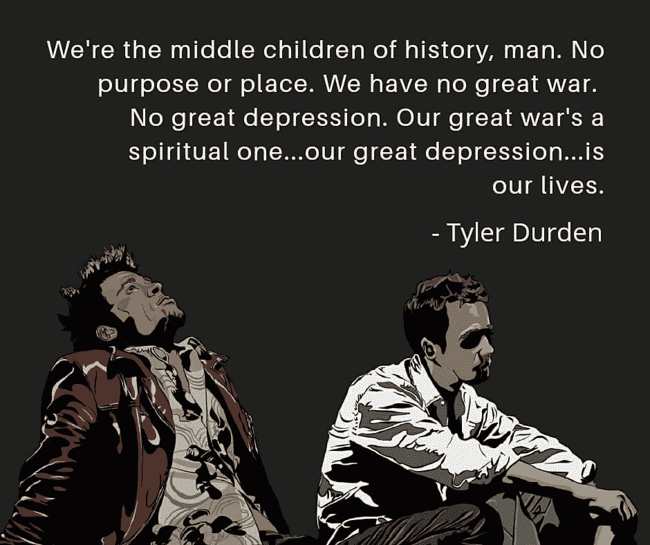

上面的引文来自《搏击俱乐部》一书，该书还被拍成电影，由布拉德·皮特、爱德华·诺顿和海伦娜·伯翰·卡特主演。1996 年这本书出版时，我只有一岁。主角泰勒·德登讲述了当代人是如何陷入危机的，因为他们没有见证一个将他们的生活一分为二的标志性事件，即前的*和*后的*。在某种程度上，像我这样的千禧一代也是如此，直到新型冠状病毒疫情袭击了我们。*

现在让我说清楚。在过去的几十年里，经济并不是没有衰退过(例如津巴布韦、委内瑞拉)。我也不否认世界上的一些地方面临着已经夺去了成千上万人生命的流行病(SARS，埃博拉病毒，等等)。).但是几乎所有这些都被限制在世界上的某些地区，所以其他地区可以来救援。冠状病毒给整个世界带来的灾难——无论是不堪重负的医疗系统、数百万人被封锁、儿童失学还是经济遭受重创——在很大程度上是前所未有的。

这是约翰·霍普金斯大学的一个实时仪表板，它记录了世界各地的病例。在这篇文章发表的时候，世界上已经有将近 90 万个病例。

[//arcgis.com/apps/Embed/index.html?webmap=14aa9e5660cf42b5b4b546dec6ceec7c&extent=77.3846,11.535,163.5174,52.8632&zoom=true&previewImage=false&scale=true&disable_scroll=true&theme=light](//arcgis.com/apps/Embed/index.html?webmap=14aa9e5660cf42b5b4b546dec6ceec7c&extent=77.3846,11.535,163.5174,52.8632&zoom=true&previewImage=false&scale=true&disable_scroll=true&theme=light)

虽然泰勒·德登倡导建立一个业余搏击俱乐部，让人们互相殴打，以此来应对他们存在的愤怒，但人工智能和数据科学的进步让我们许多人有机会帮助人类击败冠状病毒。当然，后一种选择也更好，因为前者不太符合社交距离的概念。

## 这个系列讲的是什么？

与我之前完成的系列不同(涵盖 [GauGAN](https://blog.paperspace.com/nvidia-gaugan-introduction/) 、[从头实现 YOLO](https://blog.paperspace.com/how-to-implement-a-yolo-object-detector-in-pytorch/)、[边界框数据增强](https://blog.paperspace.com/data-augmentation-for-bounding-boxes/)等等)，这个系列将如何发展更加开放。就在我们说话的时候，关于如何利用人工智能对付冠状病毒的研究正在进行中。在这一点上，公共领域中关于新冠肺炎的医学数据(比如说病人的 CT 扫描)充其量也是不足的。当然，出于隐私考虑，医疗数据可能需要一段时间才能进入公众视野。

也就是说，我们看到在几个领域出现了利用人工智能应对冠状病毒的研究。其中包括:

1.  使用基于计算机视觉的深度学习作为工具，在给定患者肺部 CT 扫描的情况下，帮助诊断新冠肺炎。
2.  试图提出使用基于深度学习的蛋白质折叠解决方案的治疗方法。
3.  使用自然语言处理从大量关于新冠肺炎的文献中提取有意义的见解。
4.  使用计算机视觉辅助监视来监控人群，例如，加强社交距离。

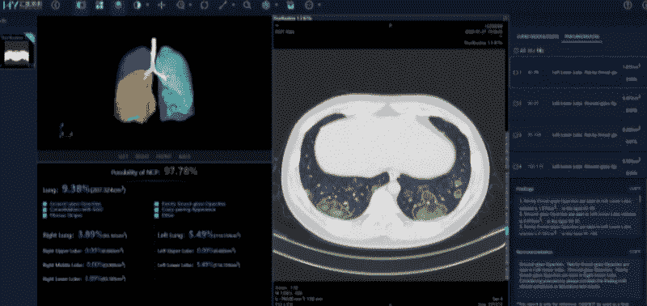

Medical imaging has been a hot topic in computer vision research

> 本系列的想法是研究这样的研究途径，如果可能的话，为您提供玩具示例，以便您可以在数据可用时开始解决问题。

## 我们将在本文中讨论的内容

在这篇文章中，我将谈论:

1.  测试在解决疫情问题中的重要性。
2.  当前测试套件面临的挑战。
3.  几篇新论文概述了深度学习如何用于从 CT 扫描中诊断新冠肺炎
4.  如何解释深度学习诊断系统的结果，以及一些注意事项。

## 首先，免责声明...

在我继续说下去之前，让我说我不是医学或放射学专业人士。我的经验是机器学习、深度学习和计算机科学。无论我写什么，都来自于我对医学成像有限的研究，如果我写了一些不正确的东西，而你恰好是专业人士，请点击下面的评论部分，让我知道，以便我可以修复它。

## 测试。测试。测试。

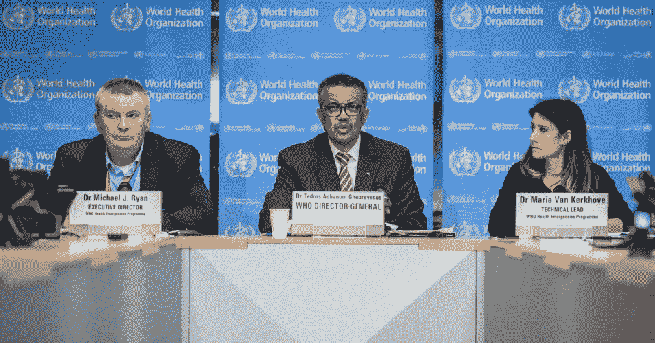

这些是来自世界卫生组织(世卫组织)的人。在他们的一次新闻发布会上，中间的那个家伙说，他对各国的首要建议是尽可能多的人进行测试，测试，测试，测试，如果可能的话，对每个有症状的人进行冠状病毒测试，无论旅行或接触史如何。

当谈到冠状病毒时，测试变得非常重要，因为你可能在 5-14 天内(这被称为潜伏期)不会出现症状。在这个时候，如果你不隔离自己，你会把病毒传播给你接触的人。

### RT-聚合酶链式反应测试

目前用于检测新冠肺炎患者的金标准是一种叫做*逆转录聚合酶链式反应*测试、*T3 或 RT-PCR 的方法。它包括从一个人的鼻子或喉咙取一个拭子，然后把它送到一台机器上检查病毒的存在。然而，RT-PCR 方法并非没有缺点。*

*   这些拭子样本需要被运送到 RT-PCR 机器所在的检测中心。如果时间太长，病毒可能会死亡，受感染病人的拭子可能会变成阴性。
*   它们很贵。
*   已经观察到，RT-聚合酶链式反应测试具有低灵敏度，即给出假阴性的可能性高。这就是为什么政府经常做多重测试来确认。
*   他们也给出了很多假阳性。这是有问题的，因为你可能会让那些实际上没有感染病毒的人给你的卫生系统带来不必要的负担。

如果你仍然不相信，样本收集可能需要把一个棉签塞到你的鼻子里很远，以至于感觉它在接触你的大脑。大家都是这么形容的。不开玩笑。

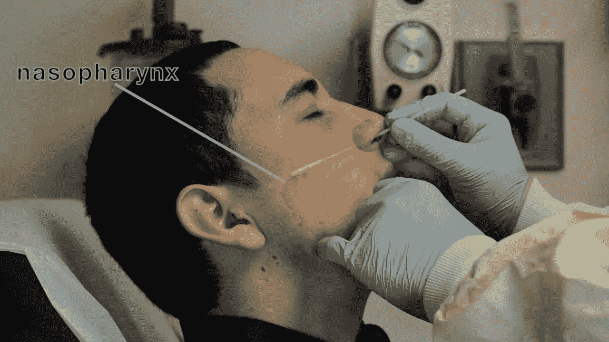

*If this doesn't motivate you to come up with a better way to test for corona, nothing will.*

### CT 扫描

对从武汉医院收集的数据的研究表明，在感染者中，当涉及到新冠肺炎的诊断时，CT 扫描具有比 RT-PCR 高得多的灵敏度。根据发表在*放射学上的[对 1014 名新冠肺炎患者进行的研究](https://pubs.rsna.org/doi/10.1148/radiol.2020200642)，RT-PCR 只能将 601/1014 (59 %)名患者标记为阳性，而 CT 扫描将 888/1014 (88%)名患者标记为阳性。*

> “结果显示，601 名患者(59%)的 RT-PCR 结果呈阳性，888 名患者(88%)的胸部 CT 扫描呈阳性。基于 RT-PCR 阳性结果，胸部 CT 提示新冠肺炎的敏感性为 97%。在 RT-PCR 结果为阴性的患者中，75%的患者(413 例患者中的 308 例)胸部 CT 检查结果为阳性。其中，48%被认为是极有可能的病例，33%被认为是可能的病例。通过对一系列 RT-PCR 检测和 CT 扫描的分析，从最初的阴性到阳性 RT-PCR 结果之间的间隔为 4 到 8 天。”

这项研究报告称，CT 扫描的灵敏度约为 97 %,而 RT-PCR 的灵敏度约为 71%。

基于这些发现，我们有理由相信使用 CAT 扫描进行诊断是有益的。然而，如果进行 CAT 扫描，你仍然需要一名合格的放射科医生来确认新冠肺炎的存在。不幸的是，放射科医生数量有限，时间也很紧迫，尤其是在病例像意大利那样激增的情况下。

### 新冠肺炎的特色

这是一个健康病人的 CT 扫描图。

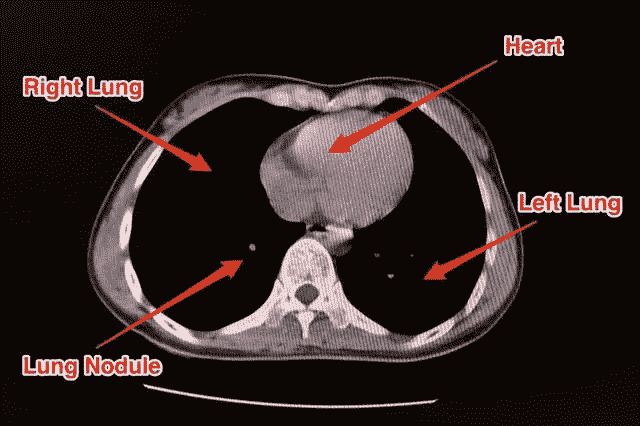

A few Lung Nodules are normal 

现在让我们来看一下一位患者的 CT 扫描，他患有由新冠肺炎病毒引起的肺炎。

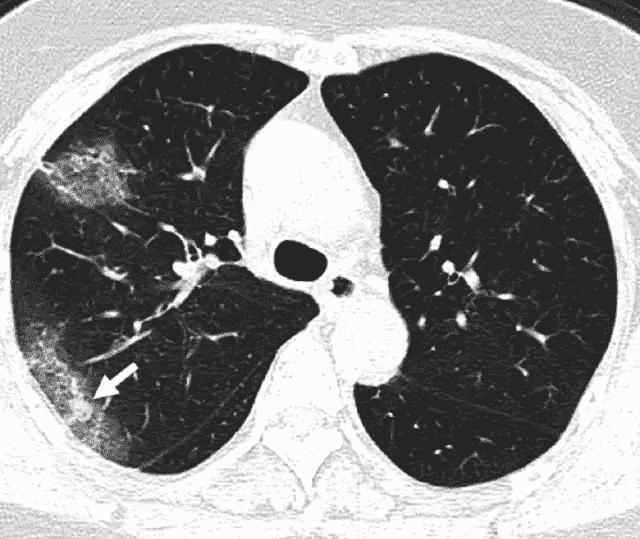

Notice the "ground glass"-like opacity marked by the arrow on the left. We see there are a couple of such opacities on the periphery of the left lung.

一般来说，肺炎会导致肺部积液，表现为肺部阴影。关于应用深度学习使用 ct 扫描来诊断新冠肺炎的文献确实指出了在新冠肺炎的肺部 CT 扫描中发现的与由不同原因导致的其他类型的肺炎相比的一些独特的特征。

一篇名为 [*深度学习系统筛查冠状病毒疾病 2019 肺炎*](https://arxiv.org/pdf/2002.09334.pdf) 的论文，列举了三个这样的特征:

> "...毛玻璃样外观，沿胸膜呈明显的周边分布，通常一个病例有多个独立的感染病灶

1.  第一种意味着肺部阴影看起来像毛玻璃。
2.  第二意味着这些阴影的大部分发生在肺的边缘。
3.  第三意味着我们可以有不止一个这样的不透明集群。

所有这三个特征都可以在上面肺部的 CT 扫描图像中观察到。

如果你想了解更多关于新冠肺炎患者 CT 扫描的特征，这里有一篇精彩的文章涉及这个话题。

[China is diagnosing coronavirus patients by looking for ‘ground glass’ in their lungs. Take a look at the CT scans.Chinese authorities have started diagnosing coronavirus cases in the Hubei province via CT scans. The scans aren’t as thorough as a blood tests, but doctorsBusiness Insider IndiaAria Bendix,Aria Bendix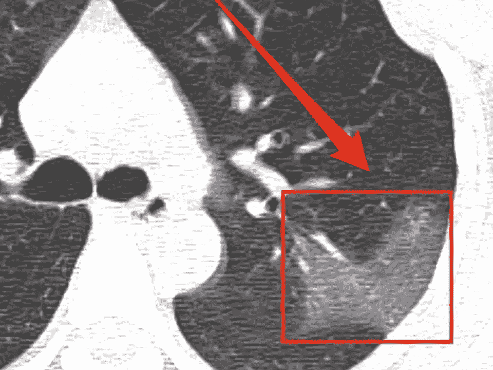](https://www.businessinsider.in/science/news/china-is-diagnosing-coronavirus-patients-by-looking-for-ground-glass-in-their-lungs-take-a-look-at-the-ct-scans-/articleshow/74126644.cms)

## 使用深度学习检测冠状病毒

在过去的几年中，计算机视觉在医学成像领域的应用激增，以诊断各种疾病。例子包括斯坦福的 [CheXNet](https://stanfordmlgroup.github.io/projects/chexnet/) 用于从肺部 x 光诊断肺炎，从视网膜图像预测心血管风险因素，以及皮肤癌分类。

同样，最近发表的一些研究论文基本上都是通过 CT 扫描来预测一个人是否患有新冠肺炎。为了让自己保持更新，你可以随时查看谷歌学者。

### CT 扫描数据

CT 扫描(或计算机断层扫描)是使用一种机器完成的，在这种机器中，扫描仪绕着你的身体移动，以创建你的器官的三维模型。这是 CT 扫描仪如何工作的演示。

[https://www.youtube.com/embed/l9swbAtRRbg?feature=oembed](https://www.youtube.com/embed/l9swbAtRRbg?feature=oembed)

所以，在这种情况下，你的数据要么是...

1.  一个三维体积，你必须使用一个三维卷积网。
2.  多个横截面切片，对此我们可以使用二维神经网络。

### 提取感兴趣区域(ROI)

作为第一步，所有这些方法都涉及一定量的数据预处理，以从 CT 扫描中切出感兴趣的*区域*。一旦这些 ROI 被提取出来，它们就会被发送到一个深度神经网络，以将病例分类为新冠肺炎或另一个类别，如细菌性肺炎、病毒性肺炎、无感染等。(论文中的“其他”类别各不相同)。

这里有一个来自论文 [*深度学习系统的例子，用于筛选冠状病毒疾病 2019 肺炎*](https://arxiv.org/pdf/2002.09334.pdf) ，它对 CT 扫描的二维切片起作用。

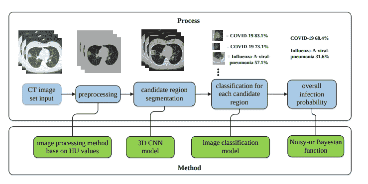

The small bounding box around a diffuse opacity in the third figure is an example of RoI.

本文首先利用图像预处理方法对肺部进行分割。然后使用基于 VNET20 的分割模型 VNET-IR-RPN17 提取感兴趣区域。该模型本身被训练用于从肺结核中提取 ROI，但是发现它对于新冠肺炎用例也足够好地工作。

然后每个 RoI 通过一个分类模型运行，在那里我们得到类概率。可以有一个或多个 ROI，给我们多个概率。然后使用一种叫做*噪声或贝叶斯*函数的东西将这些概率结合起来。关于这一点的更多细节可以在上面链接的论文中找到。

$ $ score = 1-\sum_{i=1}^{no. \:of \:rois } p _ { I } $ $

该论文还利用了这样一个事实，即对于冠状病毒来说，通常在肺部边缘周围发现不透明，这在后期阶段被用作网络的输入。关于如何精确计算这个距离的细节可以在论文中找到。

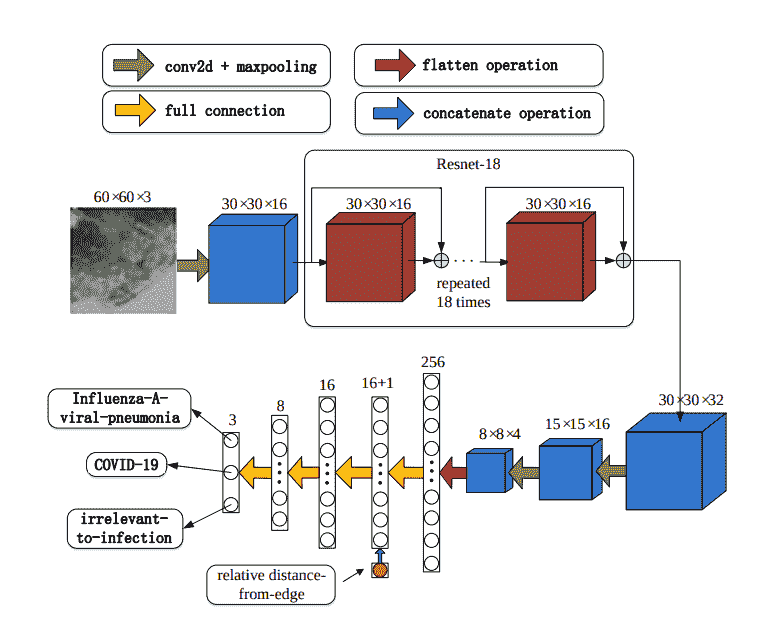

Architecture of the classification network.

网络架构受到 ResNet 的启发，关注最终分类层的局部性。

[Deep Learning System to Screen Coronavirus Disease 2019 PneumoniaWe found that the real time reverse transcription-polymerase chain reaction(RT-PCR) detection of viral RNA from sputum or nasopharyngeal swab has arelatively low positive rate in the early stage to determine COVID-19 (named bythe World Health Organization). The manifestations of computed tomograp…arXiv.orgXiaowei Xu](https://arxiv.org/abs/2002.09334)

### 使用三维信息

在另一篇题为 [*冠状病毒(新冠肺炎)疫情的快速人工智能开发周期:使用深度学习 CT 图像分析进行自动检测的初步结果&患者监测* s](https://arxiv.org/abs/2003.05037) 的论文中，作者使用 [3-D U-Net 架构](https://arxiv.org/abs/1606.06650)从扫描中提取肺部(与 VNET20 模型功能相同)。

然后这些*肺部作物*被神经网络分类。整个肺被传递到分类网络，不像以前的工作那样在分类之前从肺中提取 ROI。然后，作者使用 [Grad-CAM](https://arxiv.org/abs/1610.02391) 技术创建肺部的“热图”。

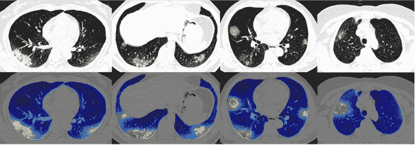

The red spot shows the areas of the lung that correspond most strongly to CoViD-19, whereas the blue colors show the unimportant regions. 

为了对每个患者进行分类，使用了 CT 扫描的多个切片。这些扫描中的每一个都用于计算类别概率。如果大多数切片具有最高分类概率的新冠肺炎，则患者被分类为新冠肺炎*阳性*。(换句话说，每一片都算一票)。

除了对二维肺部作物进行分类，作者还使用现成的软件 [RADLogics](http://radlogics.com/) ，该软件可以检测三维肺部体积内的结节和小阴影。然后，来自软件的补丁和来自早期阶段的热图被组合以创建三维可视化。

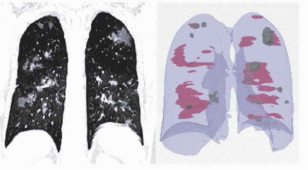

The patches in red correspond to the spots picked up by the classification system, whereas the spots in green are the ones which are picked by the software.

然后，使用补片的体积来创建“电晕得分”。

[Rapid AI Development Cycle for the Coronavirus (COVID-19) Pandemic: Initial Results for Automated Detection & Patient Monitoring using Deep Learning CT Image AnalysisPurpose: Develop AI-based automated CT image analysis tools for detection,quantification, and tracking of Coronavirus; demonstrate they can differentiatecoronavirus patients from non-patients. Materials and Methods: Multipleinternational datasets, including from Chinese disease-infected areas wer…arXiv.orgOphir Gozes](https://arxiv.org/abs/2003.05037)

### 女修道院

在北美放射学会最近发表的一篇论文中， *[人工智能在胸部 CT](https://pubs.rsna.org/doi/pdf/10.1148/radiol.2020200905)* 上将新冠肺炎与社区获得性肺炎区分开来，一个名为 CovNet 的架构被提议对同一 CT 扫描的多个二维切片进行处理。

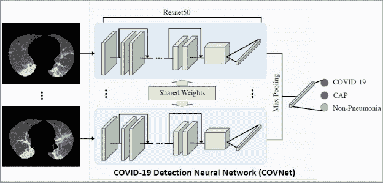

从每个切片中导出特征向量。然后这些多个特征向量被最大化汇集以获得单个特征向量。这个特征向量然后被馈送到完全连接的层，这些层将病例分类为新冠肺炎、社区获得性肺炎或非肺炎。

## 评估结果

而评价任何冠状病毒诊断方法的结果，准确性都不够。这是因为我们测试的所有人中，只有少数人会感染病毒。世界上几乎没有哪个国家的阳性命中率超过 20%(所有测试中的阳性案例)。在这种情况下，假设我们开发了一个解决方案，将所有东西都称为负面的。从准确性的角度来看，尽管是一个完全无用的分类器，该解决方案仍有 80%的准确性。

因此，我们需要关注其他指标，例如:

**灵敏度，**或真阳性率。这是阳性样本总数中真正阳性的比例，或者简单地说，我们正确分类为阳性的冠状病毒感染患者的数量。敏感度太低意味着有很多人感染了我们的算法归类为阴性的病毒。这是一个特别令人担忧的缺点，因为它会让许多感染者回家，并可能传播病毒。

**特异性，**或真阴性率。这是真正的阴性样本占阴性样本总数的比例，或者简单地说，我们正确归类为阴性的未感染人数。特异性太低意味着我们将告诉许多没有感染病毒的人他们感染了。虽然不像低灵敏度那样令人担忧，但如果我们在系统中获得太多的假阳性，它可能会给卫生系统带来过度的压力。

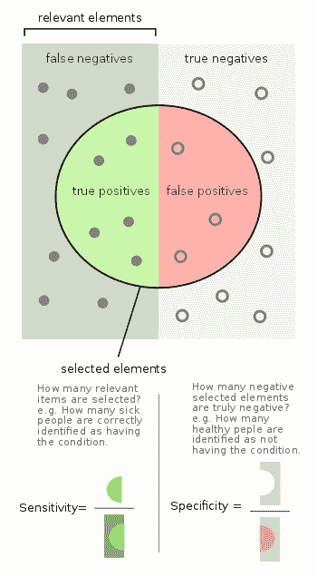

人们也使用类似于 **Precision** 的指标(在我们诊断为阳性的所有患者中，有多少人实际上患有这种疾病；这对于衡量我们的测试资源丰富程度)和 **F1 分数**(结合了精确度和灵敏度)非常有用。

ROC 曲线下的面积是我们的分类器如何区分两个类别的量度。通常，分类器会给所有情况一个概率，然后我们使用一个阈值来确定结果。理想情况下，我们希望所有阳性病例的得分远高于阈值，而阴性病例的得分远低于阈值。为什么？因为如果一个例子更接近阈值，就很难对预测有信心。

例如，假设我们使用 0.5 的阈值。假设一个分类器给一个案例分配 0.9 的概率。我们可以自信地说，这是一个积极的案例。然而，考虑另一种情况为 0.52。我们不能用同样的自信说这个例子是正的。有人可能会想，如果输入有一点变化，我们可能会得到 0.48 分，我们会把同样的例子称为否定的。

**AUROC** 是灵敏度和假阳性率(1 -特异性)之间的图形。它只能针对二元分类情况进行计算，因此当我们有 *n* 个类别时，我们必须绘制 *n* “一个类别”对“所有其他类别”的 AUC 曲线。

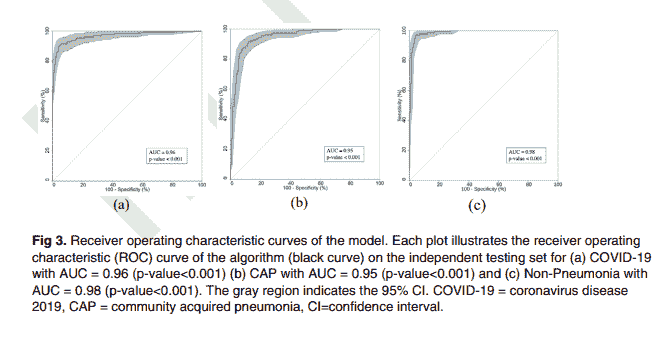

1-vs-all AOC curves for results in the paper [*Artificial Intelligence Distinguishes COVID-19 from Community Acquired Pneumonia on Chest CT*](https://pubs.rsna.org/doi/pdf/10.1148/radiol.2020200905)

ROC 曲线下的面积范围可以从 0 到 1，其中 1 代表完美的分类器，0.5(意味着曲线遵循线 *y=x)* 代表像掷硬币一样好的分类器(随机机会)。小于 0.5 的面积意味着你的分类器更差，并且经常做出不正确的预测。

如果你想深入了解 AUROC 的工作原理，这里有一个很好的资源:

[Understanding AUC - ROC CurveIn Machine Learning, performance measurement is an essential task. So when it comes to a classification problem, we can count on an AUC - ROC Curve. When we need to check or visualize the…Towards Data ScienceSarang Narkhede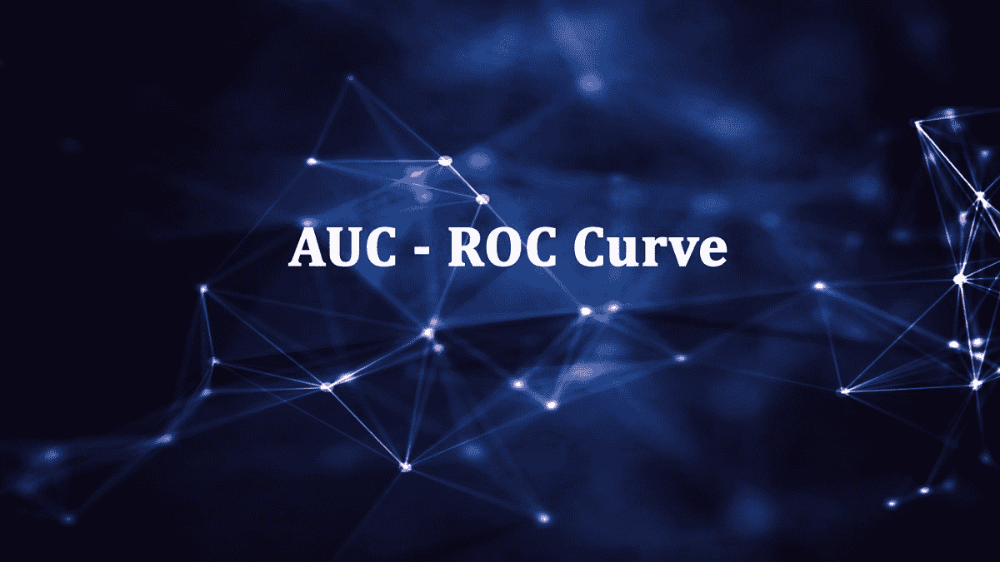](https://towardsdatascience.com/understanding-auc-roc-curve-68b2303cc9c5)

## 不过有一个警告...

在结束这篇文章之前，我想指出我们在将深度学习工具应用于医疗用例时面临的一些挑战。

就新冠肺炎而言，在这篇文章中，我们基本上介绍了如何通过 ct 扫描检测疾病。但是说实话，你真的不能通过 ct 扫描检测出肺炎。这是因为肺炎是我们所说的“临床诊断”。放射科医生不会仅仅看 CT 扫描就宣布患者患有新冠肺炎。他们可能还会检查血检、临床病史、其他症状等。得出结论。这是因为由不同原因引起的肺炎可能会也可能不会在 ct 扫描中产生明显不同的特征。当一篇论文报告说 CT 扫描比 RT-PCR 具有更好的灵敏度时，它实际上意味着医生将 CT 扫描与其他症状和特征相结合来诊断患者的方法。

虽然这绝不是对深度学习用于诊断新冠肺炎的批评，但人们必须警惕 CheXNet 问世时的这种浮华标题。

> 放射科医生应该担心自己的工作吗？突发新闻:我们现在可以比放射科医生更好地通过胸部 x 光诊断肺炎。[https://t.co/CjqbzSqwTx](https://t.co/CjqbzSqwTx)
> 
> — Andrew Ng (@AndrewYNg) [November 15, 2017](https://twitter.com/AndrewYNg/status/930938692310482944?ref_src=twsrc%5Etfw)