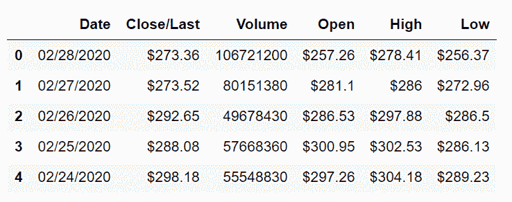
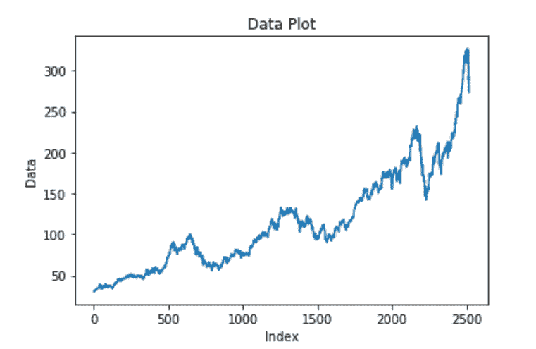
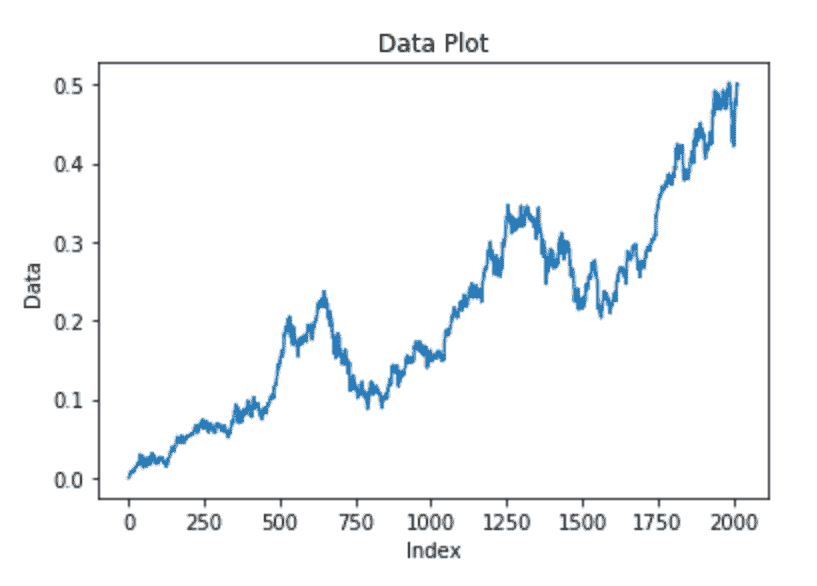
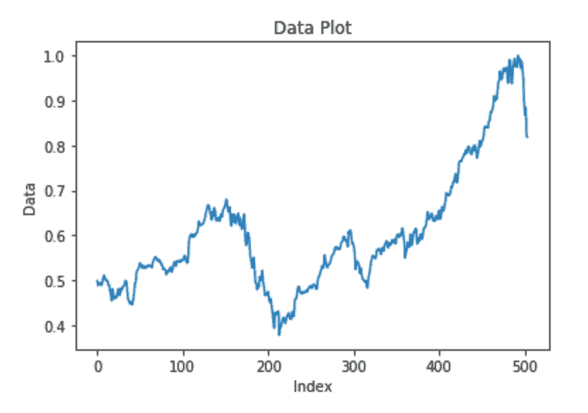
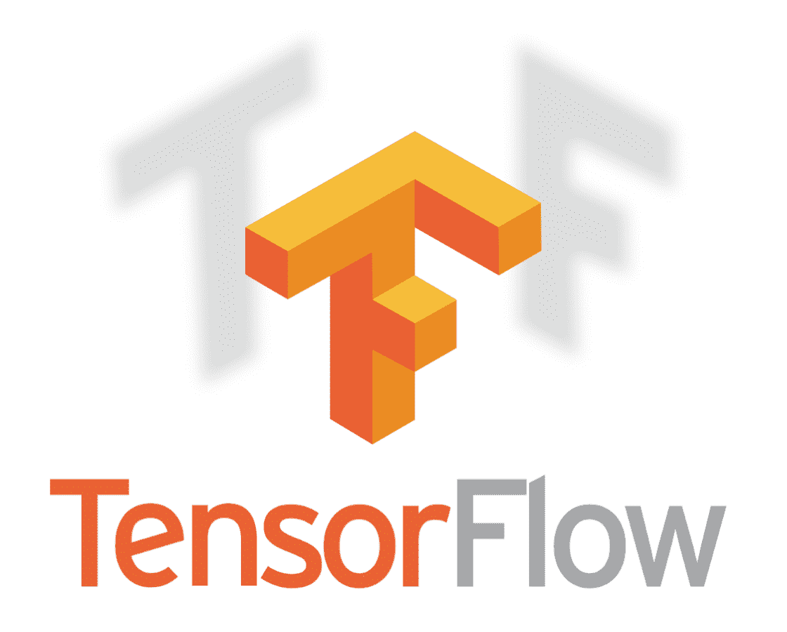
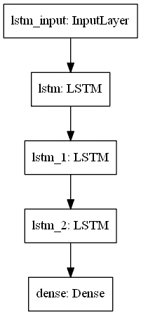
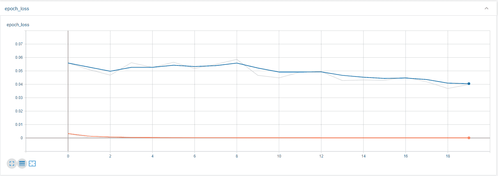
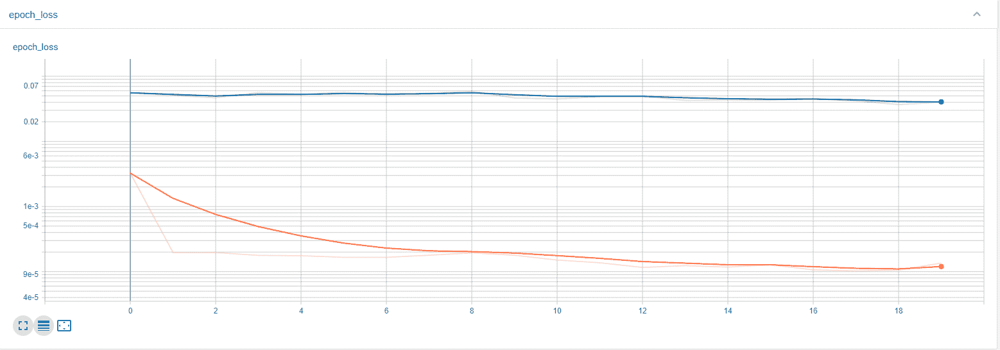
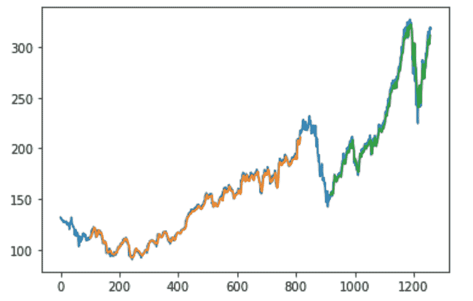

# 利用深度学习进行股票价格预测(下)

> 原文：<https://blog.paperspace.com/forecasting-stock-price-prediction-using-deep-learning/>

在关于使用深度学习进行股票价格预测的[系列的第一部分中，我们涵盖了使用神经网络进行股票市场分析所需的所有基本概念。在第二篇文章中，我们将使用深度学习模型执行股票市场价格预测的实际实现。获得的最终结果可能有助于用户确定他们的投资结果从长远来看是否值得。](https://blog.paperspace.com/forecasting-stock-prices-using-deep-learning/)

在深入探讨这个主题之前，让我们先来看看本文的目录。这个列表将帮助我们理解这篇文章的现实期望，你可以随意跳到你认为最有必要的部分。

### 目录

*   介绍
*   准备数据
*   数据可视化
*   数据预处理和进一步可视化
*   分析数据
    1。第一组数据元素
    2。第二组数据元素
*   构建深度学习模型
    1。堆叠式 LSTM 模型
    2。模式摘要和情节
    3。编译和拟合模型
    4。分析结果
*   做预测
*   结论

## 介绍

本文将研究神经网络在时间序列预测中的应用，以实现股票市场价格的预测。您可以找到本教程的完整代码，并在 ML Showcase 的免费 GPU 上运行它。虽然您可以自己直接运行整个笔记本，但建议您理解和研究每个方面，并单独考虑代码块，以便更好地理解这些概念。这个项目的方法可以扩展到其他类似的应用，如加密货币价格预测。

预测模型的堆叠 LSTM 模型的整个架构将使用 TensorFlow 深度学习框架来构建。除了 TensorFlow 库，我们还将利用其他库，如 pandas、matplotlib、numpy 和 scikit-learn，在整个项目过程中执行各种操作。这些操作包括加载和查看数据集，可视化我们的数据，将其转换为适合堆叠 LSTMs 计算的形状，以及开始项目前的最后准备工作。

本文的主要目的是通过股票市场价格预测的例子，提供深度学习在时间序列预测中的应用这一主题的教育观点。这个例子只是你可以用神经网络构建的许多用例选项中的一个(在这个例子中是堆叠的 LSTMs)。需要注意的是，在现实生活中实现这些想法之前，请确保您研究了众多可用的工具，并确定哪些想法最适合您的应用程序。现在让我们从头开始对我们的项目进行一个完整的分解。

## 准备数据

使用 LSTMs 的深度学习来完成这个股票价格预测项目的第一步是收集数据。我们将考虑一个来自 Kaggle 的随机数据集，它由苹果的历史股票数据组成。我们将使用 Panda 的库读取 CSV 文件，然后查看数据的前五个元素。

```py
# Importing the Pandas Library for loading our dataset
# Grab The Data Here - https://www.kaggle.com/tarunpaparaju/apple-aapl-historical-stock-data

import pandas as pd

df = pd.read_csv('HistoricalQuotes.csv')
df.head()
```



Image by Author

尽管股票市场预测模型需要考虑许多参数，但我们将只参考收盘/最后一列，因为它给我们提供了更多的平均方法。出于训练和验证的目的，只考虑其中一列也更容易。敏锐地观察数据集是解决大多数数据科学问题的必要步骤。查看数据集后，我们可以很容易地推断出日期是按降序排列的。我们需要纠正这一点。

```py
data = df.reset_index()[' Close/Last'] # Make Sure You add a space
data.head()
```

#### 结果

```py
0     $273.36
1     $273.52
2     $292.65
3     $288.08
4     $298.18
Name:  Close/Last, dtype: object 
```

然后，我们需要按照升序排列数据集。虽然您可以从 panda 的模块中使用 reindex 函数，但我更喜欢构建一个新的列表并反转该列表，最后创建新的数据框来处理以下任务。

#### 选项 1

```py
df3 = data.reindex(index=data.index[::-1])
df3.head()
```

#### 结果

```py
2517     $29.8557
2516     $29.8357
2515     $29.9043
2514     $30.1014
2513     $31.2786
Name:  Close/Last, dtype: object 
```

#### 选项 2

```py
df2 = []

for i in data:
    i = i[2:]
    i = float(i)
    df2.append(i)

df2.reverse()

df1 = pd.DataFrame(df2)[0]
df1.head()
```

#### 结果

```py
0    29.8557
1    29.8357
2    29.9043
3    30.1014
4    31.2786
Name: 0, dtype: float64 
```

## 可视化您的数据

对于任何机器学习和深度学习问题来说，最关键的步骤之一就是你的数据的可视化。对数据进行可视化和预处理后，您可以对正在处理的模型类型以及解决任务所需的必要步骤和措施有一个简要的了解。Python 编程语言中最好的可视化库之一是 Matplotlib 库。它将允许您相应地可视化数据集。让我们用数据和它们各自的索引来绘制模型。数据由股票在各自区间的价值组成。

```py
# Using the Matplotlib Library for visualizing our time-series data

import matplotlib.pyplot as plt

plt.title("Data Plot")
plt.xlabel("Index")
plt.ylabel("Data")
plt.plot(df1)
```



Image By Author

从我们的可视化，我们可以注意到，每天的美元汇率的绘图通常似乎有一个增加的趋势。

## 数据预处理和进一步可视化

我们的下一步将是准备我们的数据集。我们将导入 numpy 和 scikit-learn 库，以数组的形式可视化我们的数据，以便更好地建模。由于数据有点大，值也很高，为了更好地计算，最好将它们设置在 0 和 1 之间。我们将使用 scikit-learn 库中的 Min Max Scaler 函数来执行特定的操作。

```py
import numpy as np
from sklearn.preprocessing import MinMaxScaler

scaler = MinMaxScaler(feature_range=(0,1))
df1 = scaler.fit_transform(np.array(df1).reshape(-1,1))
df1
```

#### 结果

```py
array([[6.72575693e-05],
       [0.00000000e+00],
       [2.30693463e-04],
       ...,
       [8.83812549e-01],
       [8.19480684e-01],
       [8.18942624e-01]]) 
```

从同一个 sklearn 模块中，我们可以导入函数来将我们的数据分成训练和测试数据集。这里要考虑的基本步骤是确保 shuffle 被设置为 False，因为我们不希望我们的数据被随机分布。因此，我们将给出一个小的测试规模，并将其余部分分配给训练数据。一旦我们完成了所需的数据分割，让我们继续可视化我们已经创建的训练和测试数据集。

```py
from sklearn.model_selection import train_test_split

X_train, X_test = train_test_split(df1, test_size=0.20, shuffle=False)
```

### 训练数据可视化

```py
plt.title("Data Plot")
plt.xlabel("Index")
plt.ylabel("Data")
plt.plot(X_train)
```



Image By Author

```py
X_train[:5]
```

#### 结果

```py
array([[6.72575693e-05],
       [0.00000000e+00],
       [2.30693463e-04],
       [8.93516807e-04],
       [4.85229733e-03]]) 
```

### 测试数据可视化

```py
plt.title("Data Plot")
plt.xlabel("Index")
plt.ylabel("Data")
plt.plot(X_test)
```



Image By Author

```py
X_test[:5]
```

#### 结果

```py
array([[0.49866208],
       [0.4881699 ],
       [0.49223898],
       [0.49429034],
       [0.49378591]]) 
```

现在，我们已经对我们的训练和测试数据有了一个简单的了解，下一个重要的步骤是考虑这些元素，并对它们中的每一个进行预测。这个过程就是我们将如何创建我们的最终训练和测试数据以及它们各自的最终训练和测试预测。这些预测或结果将按照我们为数据集考虑的时间步长来考虑。我将假设一个大约 100 个数据元素的时间步长和每个数据集的一个特定预测。这种假设是深度学习模型的时间序列分析的组成部分。

从 0 到 99 的元素(基本上是前 100 个元素)将构成第一组训练或测试数据集的元素。第 100 个元素将构成第一个预测。第一个结果将分别存储在结果(Y)训练或测试列表中。从 1 到 100 的下一个元素将构成训练或测试数据集中的下一个(或第二个)元素集，而下一个预测或结果将由数据集的第 101 个元素组成。通过使用这种方法，我们可以建立我们的数据集。我们的深度学习模型架构将最适合解决这类数据集和股票价格预测问题。

```py
X_train_data = []
Y_train_data = []
X_test_data = []
Y_test_data = []

train_len = len(X_train)
test_len = len(X_test)

# Create the training dataset
for i in range(train_len-101):
    a = X_train[i:(i+100), 0]
    X_train_data.append(a)
    Y_train_data.append(X_train[i + 100, 0])

# Create the test dataset
for j in range(test_len-101):
    b = X_test[j:(j+100), 0]
    X_test_data.append(a)
    Y_test_data.append(X_test[j + 100, 0])

X_train_data = np.array(X_train_data)
Y_train_data = np.array(Y_train_data)
X_test_data = np.array(X_test_data)
Y_test_data = np.array(Y_test_data)
```

## 分析数据

现在，我们已经对前面的解释和代码块所要达到的目的有了一个简单的了解，让我们通过实际分析和查看前两组训练数据以及它们各自存储在输出数据集中的输出，来进一步深入了解这个主题。

### 第一组训练数据和输出

```py
X_train_data[0]
```

#### 结果

```py
array([0\.        , 0.00023069, 0.00089352, 0.0048523 , 0.00491451,
       0.00680747, 0.00768182, 0.00799894, 0.00852725, 0.00720127,
       0.00749451, 0.00733578, 0.00759035, 0.00643756, 0.00763844,
       0.00937268, 0.00985794, 0.00855146, 0.01059307, 0.01130902,
       0.0129686 , 0.01256271, 0.0130288 , 0.01423944, 0.01474387,
       0.01525301, 0.01494093, 0.0158247 , 0.01606481, 0.01613206,
       0.01769849, 0.01925013, 0.01851971, 0.01836132, 0.01716985,
       0.02419826, 0.0276812 , 0.02977593, 0.02913699, 0.02555317,
       0.02534164, 0.02872369, 0.02509683, 0.02762369, 0.02393899,
       0.02264428, 0.01796752, 0.012976  , 0.02168586, 0.0229012 ,
       0.02557704, 0.0237853 , 0.02160414, 0.02179616, 0.02090264,
       0.01897134, 0.01388869, 0.01607927, 0.01821234, 0.01747251,
       0.01693882, 0.02137815, 0.02307405, 0.02497173, 0.02647056,
       0.02607206, 0.02263453, 0.02022065, 0.01944719, 0.01650198,
       0.02001383, 0.02145516, 0.02182508, 0.02442425, 0.02805616,
       0.03027566, 0.03133429, 0.02945882, 0.03122668, 0.02984319,
       0.02889688, 0.02779184, 0.02856059, 0.02273306, 0.02050381,
       0.0190386 , 0.01829877, 0.0191109 , 0.02393159, 0.0236555 ,
       0.02439062, 0.02326876, 0.0206326 , 0.02107886, 0.02046547,
       0.01972093, 0.01764536, 0.02067699, 0.02180591, 0.0241041 ]) 
```

```py
Y_train_data[0]
```

#### 结果

```py
0.024104103955989345 
```

### 第二组训练数据和输出

```py
X_train_data[1]
```

#### 结果

```py
array([0\.        , 0.00023069, 0.00089352, 0.0048523 , 0.00491451,
       0.00680747, 0.00768182, 0.00799894, 0.00852725, 0.00720127,
       0.00749451, 0.00733578, 0.00759035, 0.00643756, 0.00763844,
       0.00937268, 0.00985794, 0.00855146, 0.01059307, 0.01130902,
       0.0129686 , 0.01256271, 0.0130288 , 0.01423944, 0.01474387,
       0.01525301, 0.01494093, 0.0158247 , 0.01606481, 0.01613206,
       0.01769849, 0.01925013, 0.01851971, 0.01836132, 0.01716985,
       0.02419826, 0.0276812 , 0.02977593, 0.02913699, 0.02555317,
       0.02534164, 0.02872369, 0.02509683, 0.02762369, 0.02393899,
       0.02264428, 0.01796752, 0.012976  , 0.02168586, 0.0229012 ,
       0.02557704, 0.0237853 , 0.02160414, 0.02179616, 0.02090264,
       0.01897134, 0.01388869, 0.01607927, 0.01821234, 0.01747251,
       0.01693882, 0.02137815, 0.02307405, 0.02497173, 0.02647056,
       0.02607206, 0.02263453, 0.02022065, 0.01944719, 0.01650198,
       0.02001383, 0.02145516, 0.02182508, 0.02442425, 0.02805616,
       0.03027566, 0.03133429, 0.02945882, 0.03122668, 0.02984319,
       0.02889688, 0.02779184, 0.02856059, 0.02273306, 0.02050381,
       0.0190386 , 0.01829877, 0.0191109 , 0.02393159, 0.0236555 ,
       0.02439062, 0.02326876, 0.0206326 , 0.02107886, 0.02046547,
       0.01972093, 0.01764536, 0.02067699, 0.02180591, 0.0241041 ]) 
```

```py
Y_train_data[1]
```

#### 结果

```py
0.024544304746736592 
```

作为我们分析和预处理的最后一步，让我们打印训练和测试数据集的形状以及它们各自的输出。训练和测试数据集的形状必须在其每个集合中包含 100 个元素，而它们各自的结果必须具有与训练或测试数据集中存在的集合数量相等的形状。使用这些图形和形状，我们终于可以进入预处理的最后一步。

```py
### Printing the training and testing shapes

print("Training size of data = ", X_train_data.shape)
print("Training size of labels = ", Y_train_data.shape)
print("Training size of data = ", X_test_data.shape)
print("Training size of labels = ", Y_test_data.shape)
```

#### 结果

```py
Training size of data =  (1913, 100)
Training size of labels =  (1913,)
Training size of data =  (403, 100)
Training size of labels =  (403,) 
```

现在，我们对测试和训练数据集产生的形状以及它们各自的输出有了一个简单的概念，最后的关键步骤是将数据集的这些现有形状转换成适合长短期记忆(LSTM)模型的形式。由于我们当前的结构只是一个二维空间，我们需要把它转换成一个三维空间，使它适合于执行 LSTM 运算和计算。

```py
### Converting the training and testing data shapes into a 3-dimensional space to make it suitable for LSTMs

X_train_data = X_train_data.reshape(1913, 100, 1)
X_test_data = X_test_data.reshape(403, 100, 1)

print(X_train_data.shape)
print(X_test_data.shape)
```

#### 结果

```py
(1913, 100, 1)
(403, 100, 1) 
```

## 构建深度学习模型

我们将使用堆叠的 LSTM 层，并构建我们的深度学习神经网络来构建一个架构来完成这项任务。首先，我们将导入执行这个计算的所有基本库。我们将使用简单的顺序架构。我强烈建议查看我之前的两篇关于 TensorFlow 和 Keras 介绍的文章，以了解关于这些特定主题的更详细的方法。

[The Absolute Guide to TensorFlow | Paperspace BlogTensorFlow is one of the most popular deep learning libraries of the modern era.Developed by Google and released in 2015, TensorFlow is considered to be one ofthe best platforms for researching, developing, and deploying machine learningmodels. The core structure of TensorFlow is developed with …Paperspace BlogBharath K](https://blog.paperspace.com/absolute-guide-to-tensorflow/)[The Absolute Guide to KerasIn this article, we will dive deeper into the world of TensorFlow and Keras. Ifyou haven’t already, I would highly recommend first checking out my previousarticle, The Absolute Guide to TensorFlow [/absolute-guide-to-tensorflow]. Itwill help you to better understand the various concepts that we w…Paperspace BlogBharath K](https://blog.paperspace.com/p/61ec8666-edb0-4009-b371-a4399bcdded5/)

然而，为了对这些主题进行简短的总结，序列模型是构建深度学习模型和构建神经网络以解决各种复杂任务的最简单的架构之一。顺序模型适用于简单的层堆叠，其中每层都有一个输入张量和一个输出张量。

在处理股票市场价格预测问题的计算时，我们只需要两层:密集层和 LSTM 层。密集层基本上就像神经网络中完全连接的层。它们既可以用作具有特定数量节点的隐藏层，也可以用作具有特定数量节点的输出层。这里，我们的密集层将只有一个输出节点，因为我们只需要一个特定参数集或数据集的输出或预测。我们之前已经更详细地讨论了 LSTM 层的主题。

```py
from tensorflow.keras.models import Sequential
from tensorflow.keras.layers import Dense
from tensorflow.keras.layers import LSTM

# Build The Architecture

model=Sequential()
model.add(LSTM(100,return_sequences=True,input_shape=(100,1)))
model.add(LSTM(100,return_sequences=True))
model.add(LSTM(100))
model.add(Dense(1))
```

随着这一步的完成，我们已经完成了我们的堆栈 LSTM 架构的构建，我们可以利用它来进行股票市场预测。然而，在该模型能够被部署并用于进行实际预测和找出结果之前，我们还剩下一些步骤。让我们看看模型概要和模型情节。

```py
model.summary()
```

#### 结果

```py
Model: "sequential"
_________________________________________________________________
Layer (type)                 Output Shape              Param #   
=================================================================
lstm (LSTM)                  (None, 100, 100)          40800     
_________________________________________________________________
lstm_1 (LSTM)                (None, 100, 100)          80400     
_________________________________________________________________
lstm_2 (LSTM)                (None, 100)               80400     
_________________________________________________________________
dense (Dense)                (None, 1)                 101       
=================================================================
Total params: 201,701
Trainable params: 201,701
Non-trainable params: 0
_________________________________________________________________ 
```

#### 模型图

```py
# Plot the Model

from tensorflow import keras
from keras.utils.vis_utils import plot_model

keras.utils.plot_model(model, to_file='model.png', show_layer_names=True)
```



Image By Author

在我们进入编译和训练过程之前，我将实现一个回调函数，它对于保存我们的检查点以获得处理的验证损失的最佳值非常有用。保存最佳模型的原因是为了以后可以使用它们来加载这些模型，并选择使用保存的模型进行进一步的预测。当您只是根据需要加载模型时，您不必重复整个训练和装配过程。在部署阶段，保存的模型可用于进一步预测。

我们将在模型中使用的第二个也是最后一个回调是 tensorboard 回调。我们将主要使用 Keras 模块的 tensorboard 回调来可视化训练损失和验证损失的图形。我们将使用一个随机日志目录来存储培训和验证数据的文件夹。最后，我们将通过 Tensorboard 回调函数来利用这个目录。一旦我们的培训完成，我们可以利用日志目录中保存的信息来可视化我们的培训和验证损失。

你也可以使用其他回调，正如我在之前的 Keras 文章中提到的。然而，我认为没有必要使用任何其他 Keras 或自定义回调来执行这个特定的任务。如果您想更详细地探索其他回调，您可以随意尝试。

```py
# Initializing the callbacks

from tensorflow.keras.callbacks import ModelCheckpoint
from tensorflow.keras.callbacks import TensorBoard

checkpoint = ModelCheckpoint("checkpoint1.h5", monitor='val_loss', verbose=1,
                              save_best_only=True, mode='auto')

logdir='logs1'
tensorboard_Visualization = TensorBoard(log_dir=logdir)
```

在初始化我们的回调之后，我们可以继续编译我们使用顺序建模架构完成构建的堆栈 LSTM 模型。我们将用于模型编译的损失函数是均方误差。均方误差函数计算标注和预测之间误差的均方值。该方程的公式解释如下:

$loss = square(y_true - y_pred)$

正如我在之前的 Keras 文章中所讨论的，默认情况下，用于执行模型编译的最佳优化器之一是 Adam 优化器。Adam 优化是一种随机梯度下降方法，它基于一阶和二阶矩的自适应估计。您也可以随意尝试其他优化器，如 RMS Prop，看看您是否能够在训练过程中获得更好的结果。

```py
# Model Compilation 

model.compile(loss='mean_squared_error', optimizer='adam')
```

构建和编译模型后的最后一步是训练模型并确保拟合过程完美进行。在训练阶段，我们将使用模型的拟合函数，然后相应地训练 X_train(训练数据)和 X_test(验证数据)。确保您相应地给出了等效的参数。拟合函数中的前两个属性应该分别具有训练数据和它们的预测。对于接下来的参数，我们将确保计算由测试数据及其预测组成的验证数据，分别用括号括起来。

我将运行该模型 20 个纪元。如果您想获得稍微好一点的结果，可以选择运行它超过指定的时期。对于拟合过程，我将使用 32 的批量大小，但是如果您正在增加历元的数量，您也可以随意以增加批量大小的形式进行编辑，如 64、128 等。当 verbose 参数设置为 1 时，将允许您查看每个步骤中发生的训练过程。根据您的方便，您也可以选择将其设置为 0 或 2。最后，我们将实现回调函数，它由我们之前定义的回调函数组成。既然我们已经为 fit 函数定义了所有必需的参数，我们可以运行代码块并观察训练过程。

```py
# Training The Model

model.fit(X_train_data, 
          Y_train_data, 
          validation_data=(X_test_data, Y_test_data), 
          epochs=20, 
          batch_size=32, 
          verbose=1,
          callbacks=[checkpoint, tensorboard_Visualization])
```

#### 结果

```py
Epoch 19/20
1824/1913 [===========================>..] - ETA: 0s - loss: 1.0524e-04
Epoch 00019: val_loss improved from 0.04187 to 0.03692, saving model to checkpoint1.h5
1913/1913 [==============================] - 1s 508us/sample - loss: 1.0573e-04 - val_loss: 0.0369
Epoch 20/20
1824/1913 [===========================>..] - ETA: 0s - loss: 1.3413e-04
Epoch 00020: val_loss did not improve from 0.03692
1913/1913 [==============================] - 1s 496us/sample - loss: 1.3472e-04 - val_loss: 0.0399 
```

## 张量板分析

在执行拟合代码块之后，我们将有一个标记为“checkpoint1.h5”的保存的检查点，使用它我们可以直接加载我们的模型的最佳权重，并开始用它直接进行预测。没有必要再次重新训练整个模型。

我们现在将再次参考工作环境，注意我们可以找到一个新创建的名为 logs1 的目录。logs1 目录包含培训和验证事件，我们将利用这些事件来理解和分析培训和验证组件。生成的图表将为我们提供一个简短的描述，并让我们了解随着时代的增加，损失和验证损失的表现。要访问这些图形，请在各自的工作区中打开命令提示符，并在激活各自的虚拟环境后键入以下命令- tensorboard - logdir= "。/logs1 "。

在执行以下内容之后，您应该能够从您的 web 浏览器访问您的本地主机，这应该会将您引导到您可以查看的张量板图形。现在让我们继续分析训练和验证损失图。

```py
from IPython.display import Image 

pil_img = Image(filename='image1.png')
display(pil_img)
```



Image By Author

由于张量板图在第一幅图像中似乎没有给出精确的所需值，所以让我们放大一点，放大一点，以便更仔细地分析这些值。

```py
pil_img = Image(filename='image2.png')
display(pil_img)
```



Image By Author

从第二幅图像中，可以清楚地看到，训练损失和验证损失都随着时期的增加而减少。因此，我们可以确定模型的拟合过程工作得相当好，因为模型随着时代数量的增加而不断改进。

## 预测和评估

在接下来的几个代码块中，我们将使用模型中的预测函数对定型和测试数据分别进行预测。需要注意的是，我们之前已经将训练和测试数据的值范围从 0 转换为 1，以便更快、更有效地进行计算。因此，现在应该使用 scaler 函数的逆变换属性来返回所需的值。通过使用这种程序方法，我们将获得我们需要达到的结果，因为获得的值被按比例缩小到它们的原始数字。

我们还将分析训练和测试数据的均方误差(MSE)参数。执行这项任务的方法相当简单。我们将需要两个额外的库，即 math 和 sklearn.metrics。从 metrics 模块中，我们将导入均方误差函数，该函数将帮助我们有效地计算训练值和测试值与其各自预测值之间的均方误差。一旦我们计算、计算并获得了所需的 MSE 值，我们就可以确定这些 MSE 值的根并不太差，并且能够产生有效的结果。它们与所建立的模型相兼容，并可用于做出适当的预测。

```py
train_predict = model.predict(X_train_data)
test_predict = model.predict(X_test_data)

# Transform back to original form
train_predict = scaler.inverse_transform(train_predict)
test_predict = scaler.inverse_transform(test_predict)
```

```py
# Calculate RMSE performance metrics for train and test data

import math
from sklearn.metrics import mean_squared_error

print("Train MSE = ", math.sqrt(mean_squared_error(Y_train_data, train_predict)))
print("Test MSE = ", math.sqrt(mean_squared_error(Y_test_data, test_predict)))
```

最后，我们将评估我们的模型并分析众多参数。这里考虑从[到](https://machinelearningmastery.com/time-series-prediction-with-deep-learning-in-python-with-keras/)的小代码引用。我建议查看以下网站，以获得更多关于这个主题的信息。关于如何建立预测系统来评估和测试你的模型的更多细节，你可以查看这个[链接](https://github.com/krishnaik06/Stock-MArket-Forecasting)。下面的图形结构是一个例子，是我们在尝试进行相应预测时将获得的图形类型的简要表示。您可以根据提供的参考资料自行尝试这些方法。我不会在本文中涉及它们，因为我的目的只是提供一个关于这些概念的教育视角和观点。



Image By Author

由此，我们在 LSTMs 和深度学习的帮助下，成功构建了我们的股市预测模型。

## 结论

我们已经完成了堆叠 LSTM 深度学习模型的构建，该模型可用于股票市场价格预测、加密货币挖掘和趋势以及日常生活的许多其他方面。你甚至可以建立类似的模型来理解每天的天气模式等等。利用深度学习进行时间序列预测的领域非常难以探索。它为我们提供了各种各样的机会，让我们致力于许多不同类型的独特项目，并构建深度学习模型。这些建立的深度学习模型将为我们思考许多时间序列问题的工作创造一种惊人的方法。

上一篇文章讨论了与时间序列预测相关的大多数常见主题。请阅读本系列的第 1 部分，以便更直观地理解大多数概念。第一部分从概念上概述了时间序列预测的一些基本主题所需的知识，并包括对第二部分内容的一些理论解释。在本文提供的 Jupyter 笔记本的帮助下，您可以随意探索和尝试各种集成来提高模型的性能并创建更多的创新项目。

感谢大家阅读这个由两部分组成的系列。在以后的文章中，我们将涉及更多关于 GANs、预测、NLP 模型等主题。在那之前，享受编码并坚持练习！