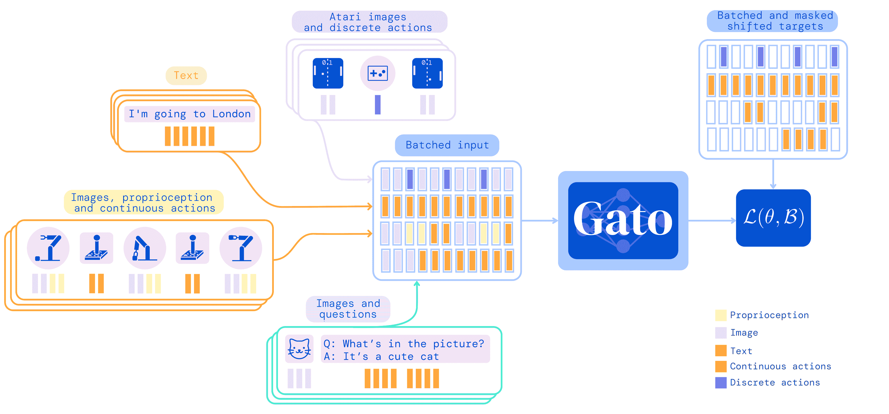
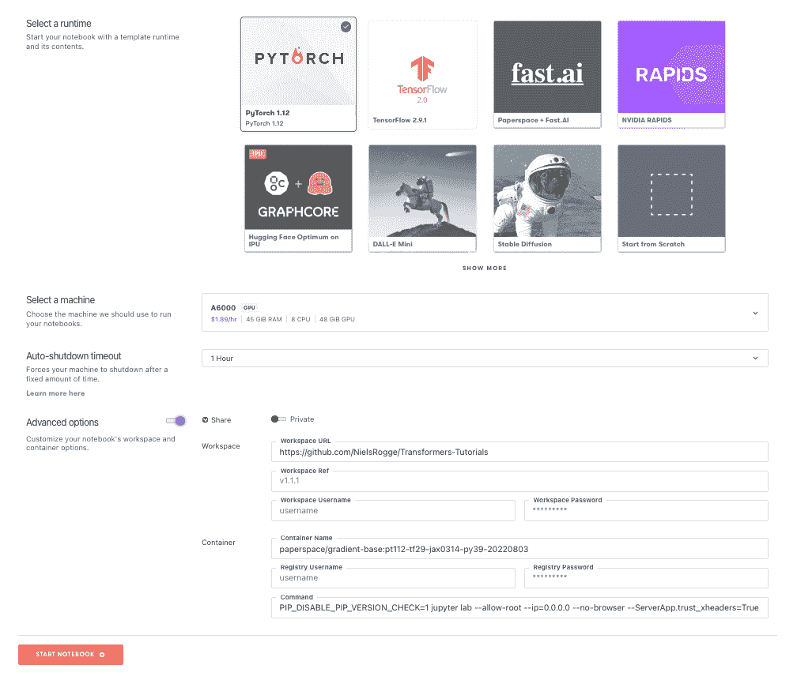

# 纸上空间的通才模型:图像、文本、音频和视频相结合

> 原文：<https://blog.paperspace.com/generalist-agents-on-paperspace-images-text-audio-and-video-all-in-the-same-model/>

如果我们只需要训练一个模型，而不是为许多不同的任务训练大量的模型，会怎么样？然后这个模型完成我们所有的任务。

虽然这听起来有点异想天开，但已经有一些例子可以证明，同一个模型可以执行许多不同的任务，包括图像、文本、音频、视频等等。

这样的*通才型*(又名。通才代理或多模态模型)正变得越来越能够承担大量不同的用例。这意味着，未来我们可能不需要管理许多模型，而是可以在少数甚至一个模型上运行端到端的人工智能。

以这种方式简化端到端人工智能将开放给更多人使用，因为剩余的一个或多个模型可能会被放在易于使用的无代码接口中，同时保留它们解决问题的全部能力。

因此，虽然我们还没有看到一个模型来统治他们，但探索他们目前的能力是值得的。

在这里，我们将回顾其中的 3 个:

*   **感知者 IO**
*   **数据 2vec**
*   **加托**

具体来说，我们将展示如何在 Paperspace 上运行感知 IO。

感知者 IO 和加托来自 DeepMind，Data2vec 来自 Meta AI。

真正的人工通用智能(AGI)的日子还有一段路要走，但在未来，人们可能会记住这些朝着它迈出的一些步骤。

## 为什么是一般的？

这里介绍的 3 个模型在细节上各不相同，但是使它们通用的基本思想是，不管输入如何，传递给它们的数据都被转换成相同的形式。所以图像、文本、音频等。，都被转换成相同的基础形式，然后模型可以在此基础上进行训练。

然后，模型以这种形式输出对数据的预测，这些预测在用于输入的变换的反转中被转换回可操作的输出。

模型的可变组件成为处理数据的输入和输出，而模型本身保持相同的形式。

## 它们为什么重要？

这些模型的重要性不仅在于它们的潜在继任者为人工通用智能铺平了道路，还在于它们更为近期的效用:

*   **需要管理的模型更少:**用于许多任务的一个模型而不是数据流中串在一起的多个模型简化了管理，例如路由数据、版本控制、部署、检查责任、数据 I/O 与培训等等。
*   **更简单的接口:**拥有一个具有可交换输入和输出的通用模型意味着创建更通用的端到端接口和应用程序将变得更容易，向不太懂技术甚至没有代码的用户开放它们的使用。
*   **他们可以胜过专家模型:**除了更通用之外，在相同的任务中，这些通才模型有几个实例胜过以前的专家模型，因此过程不仅更简单，而且可以产生更好的结果。

在一个地方拥有多种能力的组合，并且能够同时处理多种类型的数据，这意味着它们也可以以新的方式组合在一起。例如，不仅要制作视频，还要为视频添加字幕和朗读单词，让所有观众都能更好地理解。随着能力的增加，可能性成倍增加。

## 三种模式

现在让我们看一下每个模型在做什么的概述。有关更深入的描述，请参见下面引用的原始博客和论文。

### 感知者 IO

感知者 IO ( [博客](https://www.deepmind.com/blog/building-architectures-that-can-handle-the-worlds-data)、 [HF 库](https://github.com/NielsRogge/Transformers-Tutorials/tree/master/Perceiver)、[论文](https://arxiv.org/abs/2107.14795)、[维基](https://en.wikipedia.org/wiki/Perceiver))基于一个变压器神经网络。最初用于自然语言处理(BERT 等。)，然后将变形金刚应用于计算机视觉，例如，视觉变形金刚 ViT，现在作为通用模型。他们通过使用注意力来工作，这意味着在训练中发现更重要的数据部分会获得更大的权重，并在其上花费更多的计算时间。

输入数据，不考虑图像、文本、音频等来源。映射到一个更低维度的潜在空间。换句话说，网络本身不是特定于模式的，所有传入的数据都以相同的形式进行。潜在空间意味着原始数据中彼此相似的项目在新空间中靠得更近。该模型使用交叉注意力，即使用注意力将数据映射到不同的维度。以这种方式使用注意力来减少数据的大小也被称为注意力瓶颈。潜在数据的特定特征与它们的输入部分相关联，使通过网络的内容与原始数据保持顺序。

因为所有数据以相同的形式通过网络，这意味着所有输出也是相同的形式。因此，输出必须根据用户想要执行的任务进行解释，并适当地转换回来。这是通过用户传入一个查询来完成的，该查询与网络中的潜在数据相结合，以所需的形式产生输出。这种在开始时对数据进行编码，然后在结束时进行解码的方式类似于广泛使用的一类称为编码器-解码器神经网络的模型。

与变压器不同，在网络中使用比原始数据维数低的潜在数据意味着网络可以扩展以处理大量输入和输出，而不会变得太慢。

来自[原始 DeepMind 博客](https://www.deepmind.com/blog/building-architectures-that-can-handle-the-worlds-data)的图表显示了感知者设置的有用概述:

Perceiver IO setup, showing its main components of input, output, its internal latent data, and the use of attention. From DeepMind's [original blog entry](https://www.deepmind.com/blog/building-architectures-that-can-handle-the-worlds-data).

Perceiver IO 的性能已被证明可与其他模型相媲美，如用于语言的 BERT 和用于图像的 ResNet50，以及用于光流的 AudioSet 音频+视频数据和 Sintel 视频的最新技术。进一步演示的应用包括分类三维点云和视频游戏。

### Data2vec

2022 年 1 月由 Meta AI(又名。脸书)、Data2vec ( [博客](https://ai.facebook.com/blog/the-first-high-performance-self-supervised-algorithm-that-works-for-speech-vision-and-text/)、[储存库](https://github.com/facebookresearch/fairseq/tree/main/examples/data2vec)、[论文](https://arxiv.org/abs/2202.03555))是第一个*自监督*算法，适用于多种不同类型的数据。

自我监督算法很重要，因为它们能够在没有标签的数据上进行训练。没有标记的数据比有标记的数据多得多。自我监督模型通过直接观察它们的环境来学习。

但是，正如他们在博客中指出的，其他自我监督模型的学习方式在很大程度上取决于输入数据的类型。因此，能够在一个模型中从所有类型的数据中学习是向前迈出的一步，并开辟了自我监督学习的更广泛用途。

Data2vec 所处理的数据类型并不像 epider IO 那样普遍，但它们仍然包括图像、文本和语音。

与感知者 IO 的想法类似，Data2vec 通过将所有输入数据转换成特定的表示来实现其通用性，同样是最重要部分的潜在空间编码。然后，模型以自我监督的方式学习这种表示，而不是原始数据。

学习是通过教师网络和学生网络的结合来完成的。教师将输入数据转换成目标表示，然后学生预测隐藏部分数据的表示。然后重复这一过程，直到学生网络能够预测数据。目前，将数据转化为表示形式的确切方法取决于它是图像、文本还是语音。

来自原始 Data2vec 博客的动画给出了学习过程的示意图:

How Data2vec learns: a teacher plus student network are combined to learn on images, text, or speech data. From the [original blog](https://ai.facebook.com/blog/the-first-high-performance-self-supervised-algorithm-that-works-for-speech-vision-and-text/) announcing Data2vec.

因为所有类型的输入数据都形成了特定的表示形式，所以模型的输出也是这种表示形式。然后必须将其转换回外部格式，以便直接查看模型的预测。

就像感知者 IO 一样，这里的通用模型不仅等同于以前专门模型的性能，而且在计算机视觉和语音任务方面优于它们。NLP 文本任务也做得很好。他们测试的数据包括用于视觉的 ImageNet、用于语音的 LibriSpeech 和用于文本的 GLUE。

该方法不限于这里研究的 3 种类型的数据。只要数据可以转换成模型的表示，就可以使用。

Data2vec 有一个 [public GitHub repository](https://github.com/facebookresearch/fairseq/tree/main/examples/data2vec) ，可以在 Paperspace 上运行，方法是以通常的方式从渐变笔记本中指向它。

### 加托

像他们的感知者 IO 一样，DeepMind 的加托([博客](https://www.deepmind.com/blog/a-generalist-agent)、[论文](https://arxiv.org/pdf/2205.06175)、[维基百科](https://en.wikipedia.org/wiki/Gato_(DeepMind)))也是基于一个变压器神经网络。与感知者 IO 的不同之处在于，单个加托模型同时学习如何做许多不同的任务。

这些任务包括玩 Atari 视频游戏、为图像添加字幕、与用户进行文本聊天、用机器人手臂叠积木、在模拟的 3D 环境中导航、遵循指令等。

与感知者 IO 和 Data2vec 一样，不同的数据类型都被处理成一个更通用的类型，以便通过网络传递。这里，它是一个令牌序列:

*   文本被编码成子词
*   图像是按光栅顺序排列的非重叠面片序列，然后进行归一化
*   离散值是整数序列
*   连续值是浮点序列，经过标准化后入库

离散值和连续值的例子分别是玩游戏时的按钮按压和本体感受输入。加托总共接受了 604 项不同任务的训练。

标记化和排序的数据通过嵌入函数传递。该函数的作用取决于输入数据的类型，结果是输入到模型中的向量。这再次遵循了所有类型的输入都被转换成模型中的相同表示的思想。

来自原始博客条目的图表显示了事情如何经过的草图，以及可以执行的一些任务:

Sketch of how Gato takes in many data types all at once, and is therefore trained to perform multiple tasks all with the same model. From the [original blog entry](https://www.deepmind.com/blog/a-generalist-agent) by DeepMind.

通过将对其输入执行的编码+排序的逆运算应用到模型的输出来部署模型，以给出要执行的下一个动作。它被发送一个对环境的初始观察，然后它行动，观察新的环境，再次行动，等等。

相对于更专业的模型，加托的性能取决于它正在执行的任务。因为结果是针对 604 个不同的任务呈现的，所以我们不试图在这里对它们进行量化，但是非常粗略地说，对于大多数任务，具有相同权重的相同训练模型最有可能获得专家性能。这与 epider IO 和 Data2vec 不同，有时这些模型的表现优于最先进的技术，但这个模型正在做最不同的事情。

因此，任何单个任务都有改进的空间，但这是一个通用方法的示例，其中所有 it 部分都将受益于未来不断增长的计算能力。作为其任务之一，所展示的模型大小被保持在可用于实时机器人的水平，因此以目前的标准来看，12 亿个参数相对较小。因此，事实上它在这个规模上可以做多少事情是惊人的，缩放分析表明，如果用更多的参数来训练，它还有进一步改进的空间。

在这里讨论的三个模型中，加托是最像 AGI 的，因为它是一个可以同时做很多事情的模型。事实上，这篇论文比其他两个模型的论文花了更多的文字来讨论它在人工智能的进化和安全方面的更广泛的背景。

目前，它更接近于现有的深度学习模型，而不是未来的超级智能。但这些模式只会随着时间的推移越来越好。

加托还没有公开版本，所以不能在 Paperspace 上运行。

## 图纸空间上的通用模型

现在让我们看看如何在 Paperspace 上运行通才模型。我们将把注意力集中在木卫一上。单击上面的链接或按照下面的说明在渐变笔记本中启动感知者 IO。

DeepMind 基于 JAX 的原创内容已经在 PyTorch 上的一个优秀的 [GitHub 库](https://github.com/NielsRogge/Transformers-Tutorials)和尼尔斯·罗格的[博客](https://huggingface.co/blog/perceiver)拥抱脸中实现。虽然 JAX [可以在 Paperspace](https://blog.paperspace.com/jax-on-paperspace/) 上运行，但是我们使用 PyTorch 库作为运行感知者 IO 的路径。

要在 Paperspace 上运行它，以常规方式[启动渐变笔记本](https://docs.paperspace.com/gradient/notebooks/runtimes)。使用 PyTorch 运行时和所有默认设置的选项，除了:

*   *机器:*选择较大的机器。我们使用了安培 A6000，虽然任何至少 16GB 内存应该可以。
*   *工作区:*在高级选项下，将其设置为【https://github.com/NielsRogge/Transformers-Tutorials 

Gradient Notebook creation to run Perceiver IO from Hugging Face's GitHub repository

这个工作区的 GitHub 存储库包含除了感知者之外的许多其他模型，所以要运行它，导航到`Perceiver`目录，在那里我们会找到五个`.ipynb` Jupyter 笔记本。

每一个都可以使用 Run All 打开并运行，或者通过遍历单元格来运行。

我们建议在运行后重新启动笔记本内核，以便 GPU 在后续运行时不会耗尽内存。我们还可以通过使用左侧 GUI 导航栏上的 metrics 选项卡或终端中的`nvidia-smi`随时检查 GPU 内存使用情况。

💡**Note:** For `Perceiver_for_Multimodal_Autoencoding.ipynb`, we will need to run `pip install accelerate` before running the notebook. Either do so from the command line in the terminal, or add a cell to the notebook containing `!pip install accelerate`. If we choose the cell method, restart the notebook kernel before proceeding to run the rest of the cells, so that `accelerate` can be imported.

5 台笔记本电脑中显示的感知者 IO 功能如下:

*   `Fine_tune_Perceiver_for_text_classification.ipynb`:显示文本分类，在互联网电影数据库(IMDB)数据集的子集上运行，执行电影评论好坏的二元分类。感知者 IO 不需要先对文本进行令牌化，所以直接提供字节作为输入。它经历了从微调训练到在测试集上显示推论，以及对评论好坏的预测。
*   `Fine_tune_the_Perceiver_for_image_classification.ipynb`:这显示了使用 CIFAR-10 数据集的子样本将图像分类为 10 类。在 ImageNet 上训练的模型将其最终输出替换为在 CIFAR-10 上分类。该模式评估为 60 或 70%的准确率，但它可以在更多的数据上进行训练，比笔记本默认显示的更多。(如前所述，当经过充分训练的感知者 IO 可以与专门为图像设计的其他模型的性能相匹配时。)
*   `Perceiver_for_Optical_Flow.ipynb`:这使用 Sintel 视频数据集的 2 帧，光流在像素级在它们之间进行插值。然后使用 Gradio 可视化生成的流。虽然感知者的使用简化了许多任务，但这一项比大多数专业设置更简单。

💡**Note:** If you want to use Gradio, make sure that the launcher has "Share" set to True by changing the line `iface.launch(debug=True)` to `iface.launch(debug=True, share=True)`. Otherwise, you will not be able to open the popup window, as Gradient doesn't currently support port forwarding.

*   `Perceiver_for_Multimodal_Autoencoding.ipynb`:多模态自动编码是指模型同时处理多种类型的输入数据。在此笔记本中，使用 UCF101 数据集的视频、音频和类别标签数据加载该数据集。使用多模态预处理和后处理，并且结果输出示出了重构的视频、音频和视频正在显示的内容的预测类别标签。
*   `Perceiver_for_masked_language_modeling_and_image_classification.ipynb`:在同一模型架构上显示屏蔽语言建模和图像分类，产生正确的文本和分类输出。

## 结论

我们已经介绍了通才模型感知者 IO、数据 2vec 和加托，并展示了感知者 IO 在 Paperspace 上的运行。它执行与图像、文本、音频和视频相关的任务。每一个都可以直接加载并运行，就像通常的 Paperspace 方式一样。

与大多数模型相比，这些模型在通用性方面向前迈进了一步。特别重要的是，它们不仅推广了早期的模型，而且在某些情况下还超越了它们。

虽然真正的人工智能在未来仍有一段路要走，但在短期内，这些模型可能会简化和拓宽人工智能和端到端数据科学的范围和能力。

感谢阅读！

### 后续步骤

我们可以采取的一些后续步骤是在 Paperspace 上运行这些模型，或者通过参考原始博客和论文来了解比这里给出的更详细的模型。请注意，许多更详细的论述将假设我们已经知道这里介绍的许多深度学习概念。

像他们的博客一样，感知者 IO 拥抱面部内容基于 DeepMind 的原始内容，但在 PyTorch + `.ipynb`而不是 JAX + `.py`中实现。

*   在 Paperspace 上尝试感知 IO
*   感知者 IO:博客([深度思维](https://www.deepmind.com/blog/building-architectures-that-can-handle-the-worlds-data)、[抱脸](https://huggingface.co/blog/perceiver))、[知识库](https://github.com/NielsRogge/Transformers-Tutorials/tree/master/Perceiver)、[论文](https://arxiv.org/abs/2107.14795)、[维基](https://en.wikipedia.org/wiki/Perceiver)
*   Data2vec: [博客](https://ai.facebook.com/blog/the-first-high-performance-self-supervised-algorithm-that-works-for-speech-vision-and-text/)，[知识库](https://github.com/facebookresearch/fairseq/tree/main/examples/data2vec)，[论文](https://arxiv.org/abs/2202.03555)
*   加托:[博客](https://www.deepmind.com/blog/a-generalist-agent)，[论文](https://arxiv.org/pdf/2205.06175)，[维基](https://en.wikipedia.org/wiki/Gato_(DeepMind))
*   在[文档](https://docs.paperspace.com/gradient/)和[教程](https://docs.paperspace.com/gradient/tutorials/)中了解更多关于 Paperspace 的信息
*   从其[存储库](https://github.com/facebookresearch/fairseq/tree/main/examples/data2vec)中试用 Data2vec
*   在其他任务、完整数据和此处未显示的不同数据集上试用代理