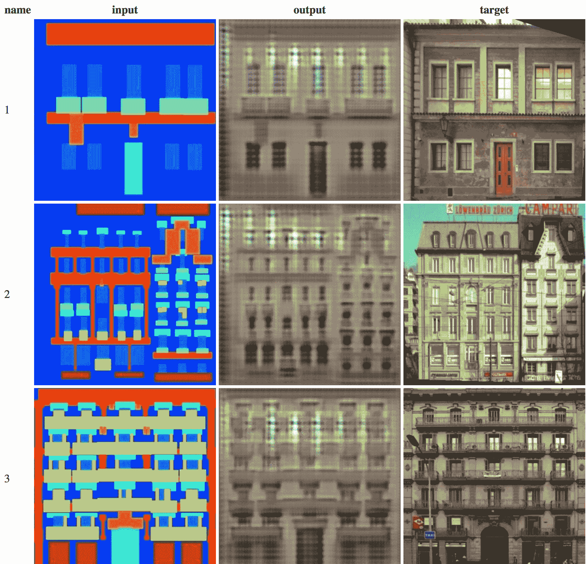

# 用 Gradient 和 ml5.js 生成交互式 Pix2Pix 模型

> 原文：<https://blog.paperspace.com/generating-interactive-pix2pix-models/>

这篇文章将通过使用[渐变](https://www.paperspace.com/gradient)训练一个生成式图像模型，然后将模型移植到 [ml5.js](https://ml5js.org/) 的过程，这样你就可以在浏览器中与它进行交互。为此，我们将使用 Pix2Pix 或图像到图像的翻译和条件对抗网络，并在成对的卫星图像和地图瓦片上训练它。这是一系列博客帖子的第三篇，这些帖子致力于在 Paperspace 中训练机器学习模型，然后在 [ml5.js.](https://ml5js.org/) 中使用它们

## Pix2Pix 简介

Pix2Pix，即图像到图像的翻译，是一种训练机器学习模型的技术，以学习从输入到输出图像的相关图像对之间的映射。这意味着，模型将学习如何将一种类型或具有一组特征的图像转换成具有另一组特征的新图像。给定训练模型时使用的类似输入，您可以使用这种方法来合成新像素。为此，Pix2Pix 使用一种特殊的生成算法，称为[条件对抗网络(cGAN)](https://arxiv.org/abs/1411.1784) ，生成过程以输入图像为条件。[原始论文](https://arxiv.org/abs/1611.07004)和代码由 [Phillip Isola](http://people.eecs.berkeley.edu/~isola/) 等人于 2016 年 11 月发表，从那时起，这项技术被许多人和研究人员广泛使用和探索。但是除了它有趣的技术新颖性之外，它的一些创造性成果也很吸引人。

Input, Output and target images using the CMP facades dataset. Image by [Christopher Hesse](https://twitter.com/christophrhesse)

这篇文章将关注于运行和训练你自己的模型。如果你对 Pix2Pix 如何工作的更详细描述感兴趣，一个很好的资源是艺术家的机器学习(ml4a) Pix2Pix 帖子。在那里，你可以找到对模型如何学习归纳的深入解释，技术的技术细节和人们已经建立的创造性应用的种类。例如，您可以创建这样的实时交互式项目:

> 尝试对 [@runwayml](https://twitter.com/runwayml?ref_src=twsrc%5Etfw) 和[@ hello perspace](https://twitter.com/HelloPaperspace?ref_src=twsrc%5Etfw)中的角色进行图像到图像的翻译。我想我可以称之为“与 pic.twitter.com/sm8rAWdgUb 的另类晚间秀”
> 
> — Cris Valenzuela (@c_valenzuelab) [August 6, 2018](https://twitter.com/c_valenzuelab/status/1026453551135055873?ref_src=twsrc%5Etfw)