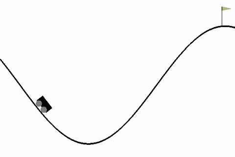
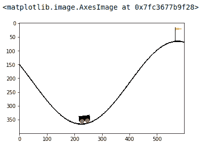
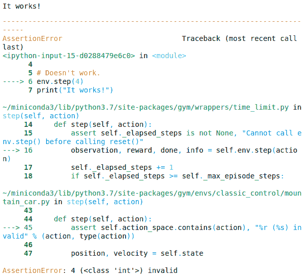
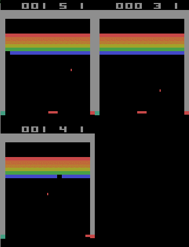

# OpenAI 健身房入门:基本构建模块

> 原文：<https://blog.paperspace.com/getting-started-with-openai-gym/>

如果你想开始强化学习，OpenAI gym 无疑是最受欢迎的选择。在 OpenAI Gym 中，开箱即用的各种环境被用作证明任何新研究方法有效性的基准。此外，OpenAI gym 提供了一个简单的 API 来实现您自己的环境。

在这篇文章中，我将介绍 OpenAI 健身房的基本组成部分。以下是我在这篇文章中涉及的内容列表。

## 涵盖的主题

1.  装置
2.  环境
3.  间隔
4.  封装器
5.  矢量化环境

所以让我们开始吧。你也可以在 [Gradient 社区笔记本](https://ml-showcase.paperspace.com/projects/reinforcement-learning)上免费运行本教程中的所有代码。

## 装置

我们要做的第一件事是确保我们安装了最新版本的`gym`。

人们可以使用`conda`或`pip`来安装`gym`。在我们的例子中，我们将使用`pip`。

```py
pip install -U gym 
```

## 环境

OpenAI Gym 的基础构件是`Env`类。它是一个 Python 类，基本上实现了一个模拟器，该模拟器运行您想要在其中训练您的代理的环境。开放式人工智能健身房配备了许多环境，例如你可以在山上移动汽车，平衡摆动的钟摆，在雅达利游戏中得分等等。Gym 也为你提供了创建自定义环境的能力。

我们从一个叫做`MountainCar`的环境开始，目标是开车上山。汽车在一维轨道上，位于两座“山”之间。目标是开车上右边的山；然而，这辆车的引擎不够强劲，不足以一口气爬上这座山。所以，成功的唯一方法就是来回开车造势。



The goal of the Mountain Car Environment is to gain momentum and reach the flag.

```py
import gym
env = gym.make('MountainCar-v0')
```

环境的基本结构由 Gym `Env`类的`observation_space`和`action_space`属性描述。

`observation_space`定义了环境状态观测的结构和合法值。对于不同的环境，观察可以是不同的东西。最常见的形式是游戏截图。也可以有其他形式的观察，例如以矢量形式描述的环境的某些特征。

类似地，`Env`类也定义了一个名为`action_space`的属性，它描述了可以应用于环境的合法动作的数字结构。

```py
# Observation and action space 
obs_space = env.observation_space
action_space = env.action_space
print("The observation space: {}".format(obs_space))
print("The action space: {}".format(action_space))
```

```py
OUTPUT:
The observation space: Box(2,)
The action space: Discrete(3)
```

山地汽车环境的观测值是代表速度和位置的两个数字的向量。以两座山的中点为原点，右为正方向，左为负方向。

我们看到，观察空间和动作空间分别由名为`Box`和`Discrete`的类表示。这些是由`gym`提供的各种数据结构之一，以便为不同种类的场景(离散动作空间、连续动作空间等)实现观察和动作空间。我们将在本文的后面对此进行深入探讨。

## 与环境互动

在这一节中，我们将介绍帮助代理与环境交互的`Env`类的函数。两个这样的重要功能是:

*   `reset`:该函数将环境复位到初始状态，并返回初始状态对应的环境观察。
*   `step`:这个函数把一个动作作为输入，并把它应用到环境中，这导致环境转换到一个新的状态。reset 函数返回四样东西:

1.  `observation`:对环境状态的观察。
2.  `reward`:执行作为`step`函数输入的动作后，你可以从环境中获得的奖励。
3.  `done`:剧集是否已经结束。如果为真，您可能需要结束模拟或重置环境以重新开始剧集。
4.  `info`:这提供了取决于环境的附加信息，例如剩余的生命数，或者可能有助于调试的一般信息。

现在让我们看一个例子来说明上面讨论的概念。我们首先从重置环境开始，然后我们检查一个观察。然后，我们应用一个动作并检查新的观察结果。

```py
import matplotlib.pyplot as plt 

# reset the environment and see the initial observation
obs = env.reset()
print("The initial observation is {}".format(obs))

# Sample a random action from the entire action space
random_action = env.action_space.sample()

# # Take the action and get the new observation space
new_obs, reward, done, info = env.step(random_action)
print("The new observation is {}".format(new_obs))
```

```py
OUTPUT:
The initial observation is [-0.48235664  0.]
The new observation is [-0.48366517 -0.00130853]
```

在这种情况下，我们的观察不是正在执行的任务的截图。在许多其他环境中(像 Atari，我们将会看到)，观察是游戏的截图。在任一场景中，如果您想要查看环境在当前状态下的样子，您可以使用`render`方法。

```py
env.render(mode = "human")
```

这将在一个弹出窗口中显示环境的当前状态。您可以使用`close`功能关闭窗口。

```py
env.close()
```

如果你想看到游戏截图的图像，而不是弹出窗口，你应该设置`render`函数的`mode`参数为`rgb_array`。

```py
env_screen = env.render(mode = 'rgb_array')
env.close()

import matplotlib.pyplot as plt 
plt.imshow(env_screen)
```



OUTPUT

收集到目前为止我们已经讨论过的所有小代码块，在`MountainCar`环境中运行代理的典型代码如下所示。在我们的例子中，我们只是采取随机的行动，但是你可以让一个代理根据你得到的观察做一些更智能的事情。

```py
import time 

# Number of steps you run the agent for 
num_steps = 1500

obs = env.reset()

for step in range(num_steps):
    # take random action, but you can also do something more intelligent
    # action = my_intelligent_agent_fn(obs) 
    action = env.action_space.sample()

    # apply the action
    obs, reward, done, info = env.step(action)

    # Render the env
    env.render()

    # Wait a bit before the next frame unless you want to see a crazy fast video
    time.sleep(0.001)

    # If the epsiode is up, then start another one
    if done:
        env.reset()

# Close the env
env.close()
```

## 间隔

我们环境的`observation_space`是`Box(2,)`，`action_space`是`Discrete(2,)`。这些实际上意味着什么？`Box`和`Discrete`都是由 Gym 提供的称为“空间”的数据结构类型，用于描述对环境的观察和行动的合法值。

所有这些数据结构都来自于`gym.Space`基类。

```py
type(env.observation_space)

#OUTPUT -> gym.spaces.box.Box 
```

`Box(n,)`对应的是`n`维的连续空间。在我们`n=2`的例子中，我们环境的观测空间是一个二维空间。当然，这个空间受到上限和下限的限制，上限和下限描述了我们的观察可以采用的合法值。我们可以使用观察空间的`high`和`low`属性来确定这一点。这些分别对应于我们环境中的最大和最小位置/速度。

```py
print("Upper Bound for Env Observation", env.observation_space.high)
print("Lower Bound for Env Observation", env.observation_space.low)
```

```py
OUTPUT:
Upper Bound for Env Observation [0.6  0.07]
Lower Bound for Env Observation [-1.2  -0.07]
```

您可以在定义空间和创建环境时设置这些上限/下限。

`Discrete(n)`框描述了具有`[0.....n-1]`个可能值的离散空间。在我们的例子中`n = 3`，意味着我们的行为可以取值为 0、1 或 2。与`Box`不同，`Discrete`没有`high`和`low`方法，因为根据定义，很清楚什么类型的值是允许的。

如果您试图在我们环境的`step`函数中输入无效值(在我们的例子中，比如说 4)，就会导致错误。

```py
# Works 
env.step(2)
print("It works!")

# Doesn't work.
env.step(4)
print("It works!")
```



OUTPUT

有多个其他空间可用于各种用例，例如`MultiDiscrete`，它允许您使用多个离散变量作为您的观察和操作空间。

## 封装器

OpenAI Gym 中的`Wrapper`类为您提供了修改环境各部分以满足您需求的功能。为什么会出现这样的需求？也许你想正常化你的像素输入，或者也许你想剪辑你的奖励。虽然通常你可以通过创建另一个类来子类化你的环境`Env`类来完成同样的工作，但是`Wrapper`类允许我们更系统地完成这项工作。

但在我们开始之前，让我们切换到一个更复杂的环境，这将真正帮助我们欣赏`Wrapper`带来的效用。这个复杂的环境将成为雅达利游戏的突破口。

在我们开始之前，我们安装`gym`的雅达利组件。

```py
!pip install --upgrade pip setuptools wheel
!pip install opencv-python
!pip install gym[atari]
```

如果您对`AttributeError: module 'enum' has no attribute 'IntFlag'`的调整有错误，您可能需要卸载`enum`包，然后重新尝试安装。

```py
pip uninstall -y enum34 
```


Gameplay of Atari Breakout

现在让我们用随机动作运行环境。

```py
env = gym.make("BreakoutNoFrameskip-v4")

print("Observation Space: ", env.observation_space)
print("Action Space       ", env.action_space)

obs = env.reset()

for i in range(1000):
    action = env.action_space.sample()
    obs, reward, done, info = env.step(action)
    env.render()
    time.sleep(0.01)
env.close()
```

```py
OUTPUT: 
Observation Space:  Box(210, 160, 3)
Action Space        Discrete(4)
```

我们的观察空间是对应于相同大小的 RGB 像素观察的维度(210，160，3)的连续空间。我们的动作空间包含 4 个独立的动作(左、右、什么都不做、开火)

现在我们已经加载了我们的环境，让我们假设我们必须对 Atari 环境进行某些更改。在 Deep RL 中，我们通过将过去的`k`帧连接在一起来构建我们的观察是一种常见的做法。我们必须修改突破环境，使我们的`reset`和`step`函数返回串联的观察值。

为此，我们定义了一个类型为`gym.Wrapper`的类来覆盖分支`Env`的`reset`和`return`函数。顾名思义，`Wrapper`类是一个位于`Env`类之上的包装器，用于修改它的一些属性和功能。

`__init__`函数是用为其编写包装器的`Env`类以及要连接的过去帧的数量来定义的。请注意，我们还需要重新定义观察空间，因为我们现在使用级联帧作为我们的观察。(我们将观察空间从(210，160，3)修改为(210，160，3 * num_past_frames。)

在`reset`函数中，当我们初始化环境时，因为我们没有任何先前的观察值要连接，我们只是重复连接初始的观察值。

```py
from collections import deque
from gym import spaces
import numpy as np

class ConcatObs(gym.Wrapper):
    def __init__(self, env, k):
        gym.Wrapper.__init__(self, env)
        self.k = k
        self.frames = deque([], maxlen=k)
        shp = env.observation_space.shape
        self.observation_space = \
            spaces.Box(low=0, high=255, shape=((k,) + shp), dtype=env.observation_space.dtype)

def reset(self):
    ob = self.env.reset()
    for _ in range(self.k):
        self.frames.append(ob)
    return self._get_ob()

def step(self, action):
    ob, reward, done, info = self.env.step(action)
    self.frames.append(ob)
    return self._get_ob(), reward, done, info

def _get_ob(self):
    return np.array(self.frames)
```

现在，为了有效地获得修改后的环境，我们将环境`Env`包装在刚刚创建的包装器中。

```py
env = gym.make("BreakoutNoFrameskip-v4")
wrapped_env = ConcatObs(env, 4)
print("The new observation space is", wrapped_env.observation_space)
```

```py
OUTPUT:
The new observation space is Box(4, 210, 160, 3) 
```

现在让我们来验证一下这些观测值是否确实是连接在一起的。

```py
# Reset the Env
obs = wrapped_env.reset()
print("Intial obs is of the shape", obs.shape)

# Take one step
obs, _, _, _  = wrapped_env.step(2)
print("Obs after taking a step is", obs.shape) 
```

```py
OUTPUT:

Intial obs is of the shape (4, 210, 160, 3)
Obs after taking a step is (4, 210, 160, 3)
```

除了普通的`Wrapper`类之外，`Wrappers`还有更多。Gym 还为您提供了针对特定环境元素的特定包装器，例如观察、奖励和行动。下一节将演示它们的用法。

1.  `ObservationWrapper`:这有助于我们使用包装类的`observation`方法对观察进行修改。
2.  `RewardWrapper`:这有助于我们使用包装类的`reward`函数对奖励进行修改。
3.  `ActionWrapper`:这有助于我们使用包装类的`action`函数对动作进行修改。

让我们假设我们必须对我们的环境进行以下更改:

1.  我们必须将像素观测值归一化 255。
2.  我们必须在 0 和 1 之间削减奖励。
3.  我们必须防止滑块向左移动(动作 3)。

```py
import random 

class ObservationWrapper(gym.ObservationWrapper):
    def __init__(self, env):
        super().__init__(env)

    def observation(self, obs):
        # Normalise observation by 255
        return obs / 255.0

class RewardWrapper(gym.RewardWrapper):
    def __init__(self, env):
        super().__init__(env)

    def reward(self, reward):
        # Clip reward between 0 to 1
        return np.clip(reward, 0, 1)

class ActionWrapper(gym.ActionWrapper):
    def __init__(self, env):
        super().__init__(env)

    def action(self, action):
        if action == 3:
            return random.choice([0,1,2])
        else:
            return action 
```

现在，我们在一行代码中将所有这些包装器应用到我们的环境中，以获得修改后的环境。然后，我们验证所有预期的更改都已应用到环境中。

```py
env = gym.make("BreakoutNoFrameskip-v4")
wrapped_env = ObservationWrapper(RewardWrapper(ActionWrapper(env)))

obs = wrapped_env.reset()

for step in range(500):
    action = wrapped_env.action_space.sample()
    obs, reward, done, info = wrapped_env.step(action)

    # Raise a flag if values have not been vectorised properly
    if (obs > 1.0).any() or (obs < 0.0).any():
        print("Max and min value of observations out of range")

    # Raise a flag if reward has not been clipped.
    if reward < 0.0 or reward > 1.0:
        assert False, "Reward out of bounds"

    # Check the rendering if the slider moves to the left.
    wrapped_env.render()

    time.sleep(0.001)

wrapped_env.close()

print("All checks passed")
```

```py
OUTPUT: All checks passed
```

如果您想在应用包装器后恢复原来的`Env`，您可以使用`Env`类的`unwrapped`属性。虽然`Wrapper`类可能看起来像是`Env`的子类，但它确实维护了一个应用于基类`Env`的包装器列表。

```py
print("Wrapped Env:", wrapped_env)
print("Unwrapped Env", wrapped_env.unwrapped)
print("Getting the meaning of actions", wrapped_env.unwrapped.get_action_meanings())
```

```py
OUTPUT:
Wrapped Env :<ObservationWrapper<RewardWrapper<ActionWrapper<TimeLimit<AtariEnv<BreakoutNoFrameskip-v4>>>>>>
Unwrapped Env <AtariEnv<BreakoutNoFrameskip-v4>>
Getting the mean of actions ['NOOP', 'FIRE', 'RIGHT', 'LEFT']
```

# 矢量化环境

许多深度 RL 算法(如异步 Actor Critic 方法)使用并行线程，其中每个线程运行环境的一个实例，以加快训练过程并提高效率。

现在我们将使用另一个库，也是由 OpenAI 开发的，名为`baselines`。这个库为我们提供了许多标准深度 RL 算法的高性能实现，以便与任何新算法进行比较。除了这些实现，`baselines`还为我们提供了许多其他功能，使我们能够按照 OpenAI 实验中使用的方式来准备我们的环境。

其中一个特性包括包装器，它允许您使用一个函数调用并行运行多个环境。在开始之前，我们首先通过在终端中运行以下命令来安装基线。

```py
!git clone https://github.com/openai/baselines
!cd baselines
!pip install . 
```

您可能需要重新启动 Jupyter 笔记本，以使已安装的软件包可用。

这里感兴趣的包装器称为`SubProcEnv`，它将以异步方式运行所有环境。我们首先创建一个返回我们正在运行的环境的函数调用列表。在代码中，我使用了一个`lambda`函数来创建一个返回体育馆环境的匿名函数。

```py
# get the neccasary stuff 
import gym
from baselines.common.vec_env.subproc_vec_env import SubprocVecEnv

# list of envs 
num_envs = 3
envs = [lambda: gym.make("BreakoutNoFrameskip-v4") for i in range(num_envs)]

# Vec Env 
envs = SubprocVecEnv(envs)
```

这个`envs`现在作为一个单一的环境，在这里我们可以调用`reset`和`step`函数。然而，这些函数现在返回一组观察/动作，而不是单个观察/动作。

```py
# Get initial state
init_obs = envs.reset()

# We get a list of observations corresponding to parallel environments 
print("Number of Envs:", len(init_obs))

# Check out of the obs 
one_obs = init_obs[0]
print("Shape of one Env:", one_obs.shape)

# prepare a list of actions and apply them to environment 
actions = [0, 1, 2]
obs = envs.step(actions)
```

```py
OUTPUT:
Number of Envs: 3
Shape of one Env: (210, 160, 3)
```

在矢量化的`envs`上调用`render`函数以平铺方式显示游戏的屏幕截图。

```py
# render the envs
import time 

# list of envs 
num_envs = 3
envs = [lambda: gym.make("BreakoutNoFrameskip-v4") for i in range(num_envs)]

# Vec Env 
envs = SubprocVecEnv(envs)

init_obs = envs.reset()

for i in range(1000):
    actions = [envs.action_space.sample() for i in range(num_envs)]
    envs.step(actions)
    envs.render()
    time.sleep(0.001)

envs.close() 
```

下面的屏幕显示出来。



`render` for the `SubProcEnv` environment.

你可以在这里找到更多关于矢量化环境的信息。

## 结论

第 1 部分到此为止。考虑到我们在这一部分所涉及的内容，你应该能够在 OpenAI Gym 提供的环境中开始训练你的强化学习代理。但是，如果您想要培训代理的环境在任何地方都不可用，该怎么办？如果是这样的话，你很幸运，原因有几个！

首先，OpenAI Gym 为您提供了实现自定义环境的灵活性。第二，这正是本系列的第二部分要做的事情。在那之前，享受使用开放式人工智能健身房探索强化学习的进取世界吧！别忘了查看完整代码，并从 [ML Showcase](https://ml-showcase.paperspace.com/projects/reinforcement-learning) 中免费运行。

## 进一步阅读

1.  [打开 AI 健身房文档](https://gym.openai.com/docs/)
2.  [基线 GitHub 页面](https://github.com/openai/baselines)