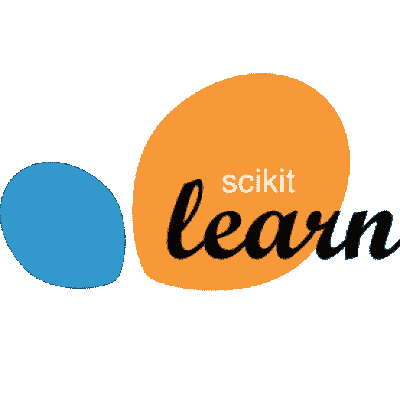
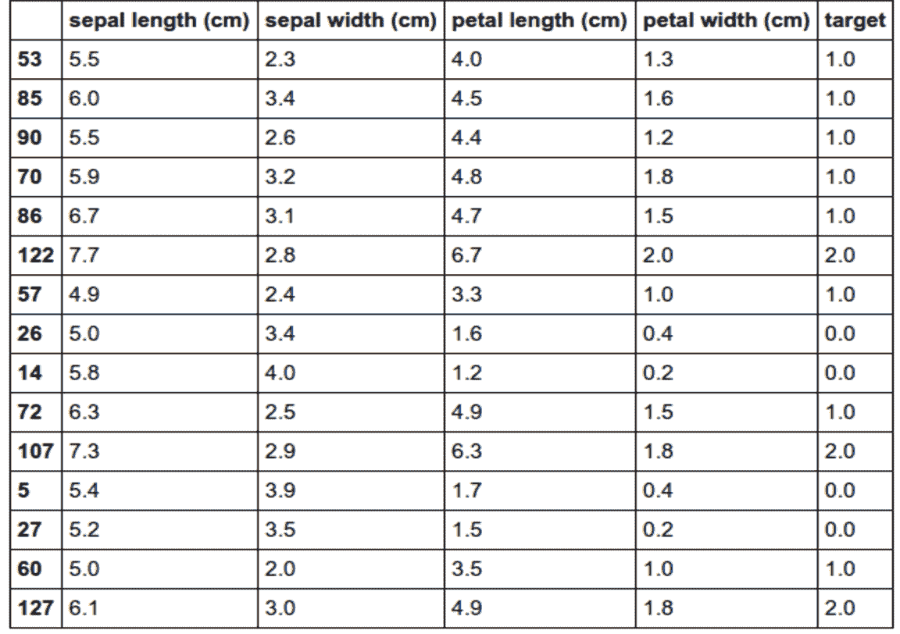
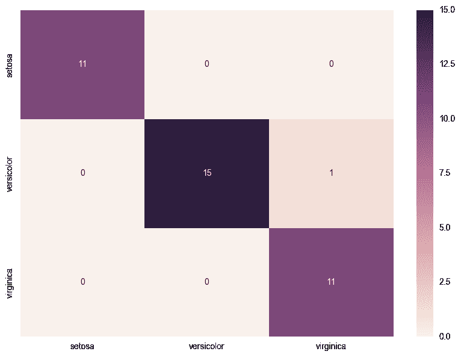

# scikit 入门-学习

> 原文：<https://blog.paperspace.com/getting-started-with-scikit-learn/>

机器学习领域正在以惊人的速度发展。这种发展最有趣的一个方面是围绕它产生的社区。仔细观察，我们可以看到 ML 社区可以分成几个小领域，对学科的不同方面感兴趣。例如，有些人对学习过程背后的数学和统计学感兴趣...

## 介绍

机器学习领域正在以惊人的速度发展。这种发展最有趣的一个方面是围绕它产生的社区。仔细观察，我们可以看到 ML 社区可以分成几个小领域，对学科的不同方面感兴趣。例如，有些人对学习过程背后的数学和统计学感兴趣。其他人对开发一个要求使用 ML 工具的想法感兴趣。如果你认定自己是后一种情况，你必须学会如何使用专业的 ML 库。在今天可用的 ML 库中， [scikit-learn](http://scikit-learn.org/stable/) 是最好的选择之一。



Scikit-learn 是一个 Python 开源库，旨在从头到尾解决机器学习问题。它被 Evernote 和 Spotify 这样的大公司使用并受到好评。此外，它还为典型的 ML 工作流程的所有步骤提供了工具。您可以使用它来加载数据，将数据集分为训练集和测试集，执行维度缩减和特征选择，训练几个众所周知和实施良好的算法，并使用模型选择微调您的超参数。最终结果是用于预测模型的健壮、有效和良好编码的解决方案。最棒的是，您将在一个快速的开发周期中完成所有这些工作，这是 Python 程序员/开发人员所习惯的。

为了向您介绍这个强大的库，我们将构建一个预测模型来解决 ML 中最常见也是最重要的问题:分类。我们将使用一个简单的 ML 工作流，其中我们加载一些数据集，解析它，预处理它，拟合模型并评估泛化误差。由于 *scikit-learn* 不是一个专门研究数据可视化的库，我们还将在工作流程的一些步骤中使用一点 *pandas* 和 *seaborn* 。

## 使用 scikit 分类-学习

### 加载、解析和可视化数据

我们启动机器学习项目首先需要的是**数据**。更具体地说，在我们的分类问题中，需要发现模式的几个有标记的例子。关于 *scikit-learn* 的第一件很酷的事情是它已经包含了一个名为 *sklearn.dataset* 的包，它可以帮助我们完成这项任务。这个包有几个“玩具数据集”，这是一个很好的方式来熟悉处理数据，并将它们提供给不同的 ML 算法。它还具有随机样本生成器，能够构建任意复杂程度和大小的数据集。最后，还有更高级的功能，可以帮助您获取现实世界问题中使用的真实数据集。

因为这是我们第一次使用 *scikit-learn* 的教程，所以让我们使用著名的 iris flower“玩具数据集”，它是由 Fisher 在 1936 年研究的。数据集具有以下属性:

*   基本描述:给出一种花的一些形态特征，确定它的种类
*   150 个样本
*   3 类:刚毛藻、杂色藻和海滨藻
*   4 个特点。所有特征都是真实和积极的
*   每类 50 个样本

要将该数据集加载到我们的程序中，并将其分为训练集和测试集，只需键入以下代码:

```py
from sklearn.datasets import load_iris
from sklearn.model_selection import train_test_split

iris_dataset = load_iris()
X, y = iris_dataset.data, iris_dataset.target
X_train, X_test, y_train, y_test = train_test_split(X, y, test_size=0.25, random_state=31) 
```

执行上面的代码，我们为测试集分离出 25 %的原始数据集，而其余的进入训练集。此外，我们可以控制原始数据集的混洗，指定 *random_state* 参数。

既然我们已经将数据集加载到程序中，那么查看一些数据样本是很有趣的。我们可以选择打印一些样本的*numpy*n 数组，直接操作 X 和 y。然而，这是一个非常原始和丑陋的可视化，所以这种做法不应该被鼓励。更好的选择是使用*熊猫*图书馆。对于那些不知道它的人来说，*熊猫*是一个用于数据分析的库，它主要处理表格数据和时间序列。让我们用它随机打印出 10 %的数据集，并以表格的形式显示出来。

```py
import numpy as np
import pandas as pd

df = pd.DataFrame(
    data=np.c_[X,y], 
    columns=iris_dataset['feature_names'] + ['target'])
df.sample(frac=0.1) 
```



从表中，我们可以看到要素名称、测量单位，并确认上面提到的数据集的属性(4 个要素、3 个类、...).尽管对于这个“玩具数据集”来说是显而易见的，但这种做法在真实场景中非常有用，因为我们可能最终会处理一个没有详细描述的数据集。

### 预处理阶段

几乎每个原始数据集都需要一些预处理，然后我们才能成功地使用它来训练 ML 算法(除非有人已经为我们做了)。常见的预处理任务包括特征标准化、降维和特征选择。由于我们使用的是一个简单的数据集，其特征很少，因此我们将只进行标准化步骤。

```py
from sklearn import preprocessing

scaler = preprocessing.StandardScaler().fit(X_train)
X_train = scaler.transform(X_train)
X_test = scaler.transform(X_test) 
```

该代码保证所有特征的均值和单位方差为零，这是大多数最大似然算法正常工作的先决条件。

### 训练和评估泛化

现在到了这个过程中最重要的部分:训练机器，测试它是否已经将这个概念推广到了训练集之外。在我看来，这是 *scikit-learn* 最出彩的地方。这个 ML 库使用称为*估算器*的 Python 对象，这些估算器必须实现方法 *fit(X，y)* 和 *predict(T)* 。没错，您的训练是在一行代码中执行的，而测试代码的所有预测都是在一行代码中完成的！为了评估我们机器的通用性，我们使用包 *sklearn.metrics* 中定义的度量之一。下面的代码显示了一个例子，其中我们训练一个支持向量机来使用准确度分数对我们的数据进行分类。

```py
from sklearn import svm
from sklearn.metrics import accuracy_score

clf = svm.SVC(gamma=0.001, C=100.)
clf.fit(X_train, y_train)
y_pred_train = clf.predict(X_train) 
y_pred_test = clf.predict(X_test)
acc_train = accuracy_score(y_train, y_pred_train) 
acc_test = accuracy_score(y_test, y_pred_test) 
```

在上面的代码中，我们用一组固定的超参数 *gamma* 和 *C* 训练了一只 SVM。这将为我们的训练集和测试集提供大约 97 %的准确率，这是非常好的结果。为了获得关于我们机器性能的更多细节，我们可以计算并可视化混淆矩阵。而且，正如你可能已经怀疑的那样， *scikit-learn* 也有一个为我们计算矩阵的功能。

```py
#If you are using a Jupyter notebook, use the magic command    below. Else, ignore it.
%matplotlib inline 
from sklearn.metrics import confusion_matrix
import matplotlib.pyplot as plt
import seaborn as sns

confusion_matrix = confusion_matrix(y_test,y_pred_test) # Returns a ndarray
cm_df = pd.DataFrame(
    confusion_matrix, 
    index = [idx for idx in ['setosa', 'versicolor', 'virginica']],
    columns = [col for col in ['setosa', 'versicolor', 'virginica']])
plt.figure(figsize = (10,7))
sns.heatmap(cm_df, annot=True) 
```



在上面的代码中，我们再次使用了 *pandas* 的能力，以及可视化库 *seaborn* 来为我们在测试集中的结果生成一个漂亮而详细的可视化。从混淆矩阵中我们可以看出，唯一的错误是一只云芝被误认为是海滨锦鸡儿。

因此，我们已经在 *scikit-learn* 中完成了第一台机器的训练。恭喜你！但不要以为这就是结局。相反，在您的工作流程中有大量的模块需要发现、更改和组合，以获得新的更好的结果。此外，由于该库是开源的，我们甚至可以读取代码并修改它以针对特定的数据集。我们可以在我们的模型中做出的一个可能的改变是切换*估计器*，并使用费希尔线性判别分析代替 SVM。这种改变可以通过几行代码实现:

```py
from sklearn.discriminant_analysis import LinearDiscriminantAnalysis

clf = LinearDiscriminantAnalysis()
clf.fit(X_train, y_train) 
```

使用*预测*方法，我们最终应该对训练集达到大约 98 %的准确率，对测试集达到 97 %的准确率。获得比那些更好的结果是不容易的。尽管如此，如果你想达到 100 %，下一步将是超参数调整。这将需要再分离一组用于超参数的验证或使用交叉验证。是的， *scikit-learn* 也为你想通了这一点。

## 结论

在本教程中，向您介绍了一个名为 *scikit-learn* 的 Python 机器学习库。沿着教程你了解到 *scikit-learn* :

*   是一个被专业人士和大公司称赞的开源 ML 库。
*   能够帮助您解决在构建预测模型时将要面临的大多数问题
*   用几行代码给出解决方案
*   应该与数据分析和数据可视化库结合使用，以充分利用它
*   有几个模块应该进行实验，连接，并在追求最佳结果的变化

对于接下来的步骤，你应该前往 *scikit-learn* [网页](http://scikit-learn.org/stable/auto_examples/index.html)中的示例页面，获取一些灵感。你也可以浏览它的[快速入门](http://scikit-learn.org/stable/tutorial/basic/tutorial.html)、[教程](http://scikit-learn.org/stable/tutorial/index.html)和[用户指南](http://scikit-learn.org/stable/user_guide.html)页面，更全面地了解图书馆提供的一切。对于那些对深度学习更感兴趣的人，你应该知道 *scikit-learn* 不具备创建严肃的深度学习神经网络的要求。不过有一个叫 [*skflow*](https://github.com/tensorflow/tensorflow/tree/master/tensorflow/contrib/learn/python/learn) 的项目给了 TensorFlow 一个 *scikit-learn* 接口。

要开始使用您自己的 ML-in-a-box 或数据科学设置，[请在此注册。](https://www.paperspace.com/account/signup?utm-campaign=scikitblog)