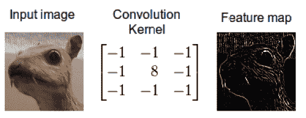
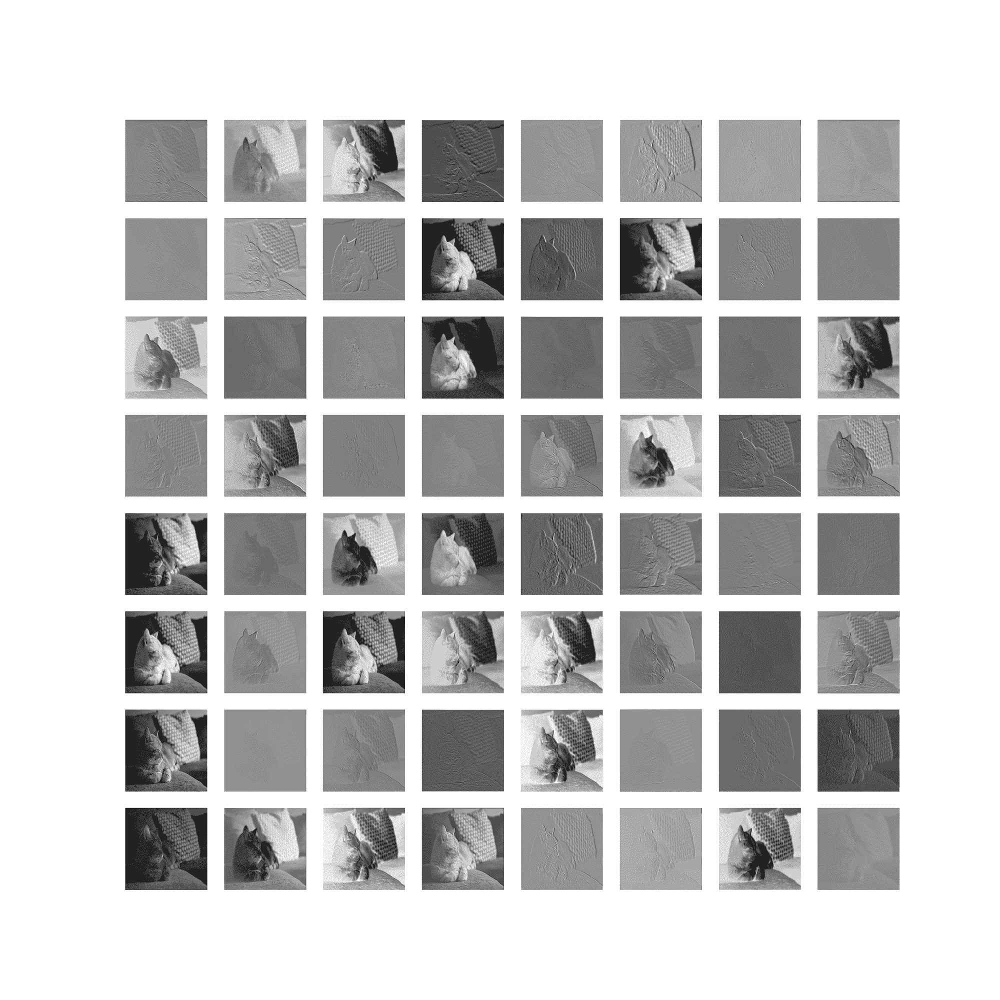
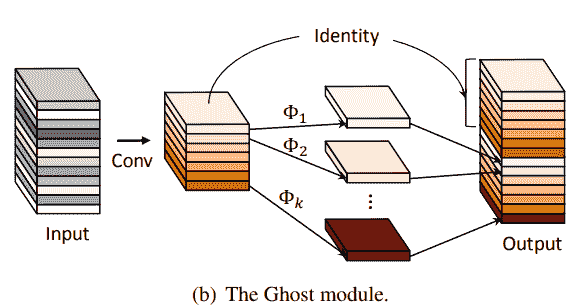
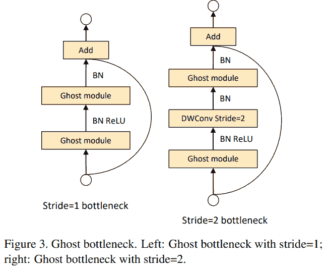
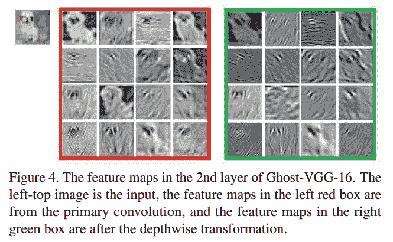

# PyTorch 和 TensorFlow 中的 GhostNet (CVPR 2020)

> 原文：<https://blog.paperspace.com/ghostnet-cvpr-2020/>

2020 年 CVPR 奥运会带来了计算机视觉领域的新颖想法，以及 3D 视觉领域的许多有趣想法。在所有这些被探索的新想法中，一篇由[华为](http://www.noahlab.com.hk/#/home)、[悉尼大学](https://www.sydney.edu.au/)和[北京大学](http://english.pku.edu.cn/)的研究人员撰写的著名论文《GhostNet:廉价运营的更多特点 成功吸引了一些人的眼球。这个想法，尽管相当简单，却能够实现有竞争力和有趣的结果。

本文将从覆盖卷积神经网络中特征映射背后的基础开始，我们将观察这些映射中对 CNN 性能至关重要的一般模式。然后，我们将对 GhostNet 做一个回顾，并深入分析它的功能和缺点。

### 目录:

*   盘旋
*   特征映射模式冗余
*   幽灵网
*   深度方向卷积
*   密码
*   结果
*   缺点
*   参考资料和进一步阅读

## 盘旋


Standard 2-D Convolution

在我们深入管理 GhostNet 的概念之前，有必要简要回顾一下卷积算法。对标准卷积神经网络架构中使用的卷积算法有深刻理解的读者可以跳过这一部分。要更正式地介绍和深入剖析卷积，标题为[](https://arxiv.org/abs/1603.07285)*的文章是一个很好的起点。在这里，我们将只回顾足够了解 GhostNet 所需的知识。*

*总之，卷积是任何卷积神经网络(CNN)中涉及的最基本的过程。卷积源于基本的信号和图像处理，是一种简单的图像滤波过程，它使用内核来传播原始图像的某些基于纹理的信息。*

*

Convolution using a predefined kernel on an input image* 

*在图像处理中，要理解图像的语义，关键是增强或保留某些基于纹理的信息，这些信息更容易使用算法进行处理。传统技术包括检测图像中对象的边缘、勾勒轮廓、寻找角点等。计算机视觉(以及一般的深度学习)的发展为算法提供了使用可训练的卷积核来学习输入图像中的这些特征的能力，这形成了卷积神经网络架构的基础。*

*这些滤波器/内核也称为“权重矩阵”，包含应用于输入图像的数值，并通过反向传播进行调整，以捕捉给定输入图像的内在特征表示。一般来说，卷积层取一个 *C* 通道的输入张量，输出一个*C**'**通道的张量。这些 *C **'*** 通道由该层中存在的过滤器/内核的数量决定。**

*既然已经过了深度 CNN 中关于卷积的背景检查，那就来了解一下 GhostNet 论文的基础: ***特征图*** 。*

## *特征映射模式冗余*

 *要素地图是通过应用标准卷积图层根据输入生成的空间地图。这些特征映射负责基于该层的学习卷积滤波器权重来保存/传播输入图像的某些特征丰富的表示。



Feature Maps ([Source](https://debuggercafe.com/visualizing-filters-and-feature-maps-in-convolutional-neural-networks-using-pytorch/))

GhostNet 的作者分析了标准卷积层中的特征图，以了解它们是否表现出某种模式。在研究中，他们注意到在卷积层生成的整个特征映射集中，存在许多独特的内在特征映射的相似副本，这些副本变得多余，无法通过相当昂贵的卷积运算来生成。从上图所示的一组特征地图中可以看出，存在几个看起来相似的副本，如第 6 行、第 1 列和第 3 列中的副本。

作者创造了术语“幽灵特征地图”来指代这些冗余副本。这是本文的动机基础:我们如何减少生成这些冗余特征图的计算量？

# 幽灵网

减少参数，减少 FLOPs，获得接近基线的精度，这是一个绝对的三赢局面。这就是华为诺亚方舟实验室在 GhostNet 上的工作的动机，该工作在 CVPR-2020 上发表。尽管这种方法乍看起来可能很复杂，但它相当简单，易于解释和验证。本文旨在为标准深度卷积神经网络中使用的自然卷积层提供一种更廉价的替代方案。



### 那么是什么想法呢？

正如我们之前看到的，卷积层接收由输入通道数量定义的输入张量 *C* ，并输出*C**'**通道的张量。这些通道本质上是上面讨论的特征映射，正如我们看到的，在那个集合中存在这些特征映射的冗余副本。GhostNet 不是通过标准卷积来创建所有的特征图，而是生成总输出特征图的 *x* %,而其余的是通过廉价的线性运算来创建的。这种廉价的线性运算导致参数和触发器的大量减少，同时保持与原始基线模型几乎相同的性能。廉价的线性运算被设计成类似于固有卷积的特性，并且通常应该是可学习的和依赖于输入的，使得它可以在使用反向传播的反向传递中被优化。*

在我们讨论 GhostNet 中使用的精确线性运算/变换之前，让我们花点时间来注意一下在神经网络中引入稀疏性或使其更有效的其他类似想法。最近提出了几种修剪神经网络的方法，它们显著降低了深度神经网络的复杂性。然而，这些方法中的大多数只能在训练后，即，在原始深度模型已经被训练之后被结合。因此，它们主要用于将训练模型压缩到最小尺寸，同时保持其性能。

该领域的一个突出想法，也称为*过滤器修剪*，是通过一个简单的过程完成的。一旦训练了模型，就获得了模型的任何层中的经训练的过滤器，并且计算了这些过滤器中的权重的相应绝对和。只有具有较高绝对权重和的 *top-x* 滤波器被保留，而剩余的滤波器被丢弃。

现在，回到 GhostNet 中的“廉价线性变换”。该论文使用*深度方向卷积*(通常表示为 DWConv)作为其廉价的线性变换。我们在前面几节讨论了什么是卷积。那么，什么是*深度方向卷积(DWConv)* ？

## 深度方向卷积

卷积是标准深度神经网络架构的圣杯，主要用于基于计算机视觉的问题。然而，卷积确实有某些缺点，这些缺点已经在多年来的许多著作中得到解决。有些包括在卷积层中使用的滤波器/内核之前添加一个结构，以便它们是上下文自适应的。其他包括改变控制卷积运算的架构过程。通常在深度神经网络中，卷积层从先前输出的激活中接收输入，该输出是表示为( *B，C，H，W* )的四维张量，也称为信道优先格式(否则为( *B，H，W，C* )格式)。这里， *B* 代表训练时使用的批量； *H* 和 *W* 表示输入的空间维度，即输入特征图的高度和宽度，最后 *C* 表示输入张量中的通道数。*(注:TensorFlow 通常遵循后一种格式指定张量的维数:(N，H，W，C)，其中 N 与 B 相同，即批量。PyTorch 使用通道优先格式作为标准实践)*。因此，在计算多声道内在卷积时，将滤波器(与输入深度相同)应用于输入张量，以产生所需数量的输出声道。这增加了与输入声道数量和输出声道数量相对应的复杂性。


Depthwise Convolution for a 3-Channel Tensor

***深度方向卷积*** 被引入以解决由正常卷积引起的高参数和 FLOPs 的问题。不是在输入的所有通道上应用滤波器来生成输出的一个通道，而是将输入张量分割成单独的通道，然后仅在一个切片上应用滤波器；因此，术语“*深度方向*，基本上指的是每通道卷积。简单地说，2D 滤波器/核/窗与一个通道卷积，该通道是二维切片，以输出该层的输出张量的一个通道(也是 2-D)。这减少了自然卷积中线性增加的计算开销。然而，有一个警告:对于深度方向卷积来说，为了提供递增的速度和较低的复杂度，输入张量中的通道数和特定层中的结果输出张量应该匹配。因此，这是一个双重过程:1 .将 2-D 滤波器与输入张量的每个通道进行卷积，以生成 2-D 输出通道，然后 2。连接/堆叠这些二维通道以完成输出张量。(要进一步阅读不同类型的卷积以及对它们的深入分析，我建议浏览一下[这篇文章](https://eli.thegreenplace.net/2018/depthwise-separable-convolutions-for-machine-learning/#:~:text=Depthwise%20convolution&text=Split%20the%20input%20into%20channels,the%20output%20tensors%20back%20together.))。

因此，深度方向卷积导致大量的参数减少和减少的运算，使得计算更便宜，同时保持与固有卷积的密切关系。这就是 GhostNet 表演背后的“魔力”。虽然作者在他们的论文中没有明确提到深度方向卷积作为廉价的线性变换，但这纯粹是一种设计选择。这个问题甚至在该论文的官方知识库的这一期 GitHub 中被提出。

GhostNet 因此提出了深度神经网络架构中标准卷积层的基本独立的替换层，其中任何卷积层的输出张量现在都是通过两个操作的串行化来创建的。首先，通过三层的顺序堆栈为输出张量生成总通道的 *x* %:标准卷积，然后是批量归一化和非线性激活函数，该函数默认定义为校正线性单元(ReLU)。然后将其输出传递给第二个模块，第二个模块也是三层的顺序堆栈:深度方向卷积，然后是批量归一化和 ReLU。最后，来自第一顺序块的张量与来自第二顺序块的输出堆叠，以完成输出张量。

让我们通过一组简单的数学步骤来理解这一点:

假设 *x* 是深度神经网络架构中特定卷积层的维数( *B，C，H，W* 的输入张量。该层的输出预计为维度的*x[1]T7(*B，C[1] ，H[1] ，W[1]* )。以下操作定义了一个代替标准卷积使用的幻像卷积:*

**步骤 1(初级卷积)**:对输入张量 *x* 计算 *f(x)* 生成维数为( *B，C[1/2] ，H[1] ，W[1]* )的张量，其中 *f(x)* 代表标准卷积加批量归一化加 ReLU。这个新张量可以表示为*y[1]。
**第二步(二次卷积)**:在张量 *y[1]* 上计算 *g(x)* 生成维数为( *B，C[1/2] ，H[1] ，W[1]* )的张量其中 *g(x)* 代表深度方向卷积加批量归一化加 ReLU。这个新张量可以表示为*y[2]。
**第三步【堆栈】**:将 *y[1]* 和 *y[2]* 进行堆栈/串接，形成合成输出张量 *x[1]* 。**

在上面的步骤中，我们将初级和次级块生成的特征图的数量固定为张量应该具有的总输出特征图的 50%。但是，图层可以灵活地以不同的比率进行计算。50%反映了该层的一个参数，用 *s* 表示，默认值为 2。通常，论文以这一比率(称为“比率 2”)记录观察结果，然而，随着比率的增加，可以在速度和精度之间进行权衡，进一步减少参数。更高的 *s* 值实质上意味着更多的特征图由深度方向内核计算，而不是由主块中的标准卷积计算。这意味着更大的模型压缩和更高的速度，但精度较低。

作者对深度方向卷积滤波器的不同核大小进行了烧蚀实验。结果将在下一节 *GhostNet 结果*中讨论。

作者还提出了一种新的主干架构，称为 GhostNet，它本质上是一个 [MobileNet v3](https://arxiv.org/abs/1905.02244) ，其中的瓶颈被一个 *Ghost 瓶颈*所取代。Ghost 模块实质上构成了这些 Ghost 瓶颈的基础，它们遵循与标准 MobileNet v3 瓶颈相同的体系结构。



GhostNet 是通过在输入层(标准卷积层)之后的一系列张量中堆叠这些具有递增通道的 ghost 瓶颈来构建的。(注意:输入卷积层，通常被称为模型的*主干*，没有被替换为虚卷积块)。重影瓶颈根据输入特征图的维度分阶段分组。所有 ghost 瓶颈都应用了 stride 1，除了最后一个瓶颈使用了 stride 2 设计，如上图所示。对于重影瓶颈中的一些剩余连接，作者甚至使用[挤压激励(SE)](https://arxiv.org/abs/1709.01507) 块来提供通道注意，从而以较小的计算开销提高精度。

## GhostNet 代码

让我们深入研究 Ghost 块和 Ghost 瓶颈的代码，它们可以简单地集成到任何基线卷积神经网络中。

我们将从基于 PyTorch 和 TensorFlow 的虚卷积代码开始，它可以用作标准卷积层的直接交换。

### 重影卷积(PyTorch)

```py
### Import necessary libraries and dependencies
import torch
import torch.nn as nn
import math

class GhostModule(nn.Module):
    def __init__(self, inp, oup, kernel_size=1, ratio=2, dw_size=3, stride=1, relu=True):
        super(GhostModule, self).__init__()
        self.oup = oup
        ### Compute channels for both primary and secondary based on ratio (s)
        init_channels = math.ceil(oup / ratio)
        new_channels = init_channels*(ratio-1)

		### Primary standard convolution + BN + ReLU
        self.primary_conv = nn.Sequential(
            nn.Conv2d(inp, init_channels, kernel_size, stride, kernel_size//2, bias=False),
            nn.BatchNorm2d(init_channels),
            nn.ReLU(inplace=True) if relu else nn.Sequential(),
        )

		### Secondary depthwise convolution + BN + ReLU
        self.cheap_operation = nn.Sequential(
            nn.Conv2d(init_channels, new_channels, dw_size, 1, dw_size//2, groups=init_channels, bias=False),
            nn.BatchNorm2d(new_channels),
            nn.ReLU(inplace=True) if relu else nn.Sequential(),
        )

    def forward(self, x):
        x1 = self.primary_conv(x)
        x2 = self.cheap_operation(x1)
        ### Stack
        out = torch.cat([x1,x2], dim=1)
        return out[:,:self.oup,:,:] 
```

### GhostNet 卷积(张量流)

```py
### Import necessary dependencies and libraries
import tensorflow as tf
from tensorpack.models.common import layer_register
from tensorpack.utils.argtools import shape2d, shape4d, get_data_format
from tensorpack.models import BatchNorm, BNReLU, Conv2D
import math
import utils

### Depthwise convolution kernel weight initializer
kernel_initializer = tf.contrib.layers.variance_scaling_initializer(2.0)

### Secondary Depthwise Convolution layer
@layer_register(log_shape=True)
def MyDepthConv(x, kernel_shape, channel_mult=1, padding='SAME', stride=1, rate=1, data_format='NHWC',
              W_init=None, activation=tf.identity):
    in_shape = x.get_shape().as_list()
    if data_format=='NHWC':
        in_channel = in_shape[3]
        stride_shape = [1, stride, stride, 1]
    elif data_format=='NCHW':
        in_channel = in_shape[1]
        stride_shape = [1, 1, stride, stride]
    out_channel = in_channel * channel_mult

    if W_init is None:
        W_init = kernel_initializer
    kernel_shape = shape2d(kernel_shape) #[kernel_shape, kernel_shape]
    filter_shape = kernel_shape + [in_channel, channel_mult]

    W = tf.get_variable('DW', filter_shape, initializer=W_init)
    conv = tf.nn.depthwise_conv2d(x, W, stride_shape, padding=padding, rate=[rate,rate], data_format=data_format)
    if activation is None:
        return conv
    else:
        return activation(conv, name='output')

def GhostModule(name, x, filters, kernel_size, dw_size, ratio, padding='SAME', strides=1, data_format='NHWC', use_bias=False,
                activation=tf.identity):
    with tf.variable_scope(name):
        init_channels = math.ceil(filters / ratio)

        ### Primary standard convolution
        x = Conv2D('conv1', x, init_channels, kernel_size, strides=strides, activation=activation, data_format=data_format,
                   kernel_initializer=kernel_initializer, use_bias=use_bias)
        if ratio == 1:
            return x #activation(x, name='output')
        dw1 = MyDepthConv('dw1', x, [dw_size,dw_size], channel_mult=ratio-1, stride=1, data_format=data_format, activation=activation)
        dw1 = dw1[:,:,:,:filters-init_channels] if data_format=='NHWC' else dw1[:,:filters-init_channels,:,:]

        ### Stack
        x = tf.concat([x, dw1], 3 if data_format=='NHWC' else 1)
        return x
```

现在让我们看看 Ghost 瓶颈的 PyTorch 实现，它被用作 GhostNet 的构建块。

### 幽灵瓶颈(PyTorch)

```py
### Squeeze Excitation Block
class SELayer(nn.Module):
    def __init__(self, channel, reduction=4):
        super(SELayer, self).__init__()
        self.avg_pool = nn.AdaptiveAvgPool2d(1)
        self.fc = nn.Sequential(
                nn.Linear(channel, channel // reduction),
                nn.ReLU(inplace=True),
                nn.Linear(channel // reduction, channel),        )

    def forward(self, x):
        b, c, _, _ = x.size()
        y = self.avg_pool(x).view(b, c)
        y = self.fc(y).view(b, c, 1, 1)
        y = torch.clamp(y, 0, 1)
        return x * y

### DWConv + BN + ReLU
def depthwise_conv(inp, oup, kernel_size=3, stride=1, relu=False):
    return nn.Sequential(
        nn.Conv2d(inp, oup, kernel_size, stride, kernel_size//2, groups=inp, bias=False),
        nn.BatchNorm2d(oup),
        nn.ReLU(inplace=True) if relu else nn.Sequential(),
    )

### Ghost Bottleneck

class GhostBottleneck(nn.Module):
    def __init__(self, inp, hidden_dim, oup, kernel_size, stride, use_se):
        super(GhostBottleneck, self).__init__()
        assert stride in [1, 2]

        self.conv = nn.Sequential(
            # pw
            GhostModule(inp, hidden_dim, kernel_size=1, relu=True),
            # dw
            depthwise_conv(hidden_dim, hidden_dim, kernel_size, stride, relu=False) if stride==2 else nn.Sequential(),
            # Squeeze-and-Excite
            SELayer(hidden_dim) if use_se else nn.Sequential(),
            # pw-linear
            GhostModule(hidden_dim, oup, kernel_size=1, relu=False),
        )

        if stride == 1 and inp == oup:
            self.shortcut = nn.Sequential()
        else:
            self.shortcut = nn.Sequential(
                depthwise_conv(inp, inp, kernel_size, stride, relu=False),
                nn.Conv2d(inp, oup, 1, 1, 0, bias=False),
                nn.BatchNorm2d(oup),
            )

    def forward(self, x):
        return self.conv(x) + self.shortcut(x)
```

### 幽灵网(PyTorch)

```py
__all__ = ['ghost_net']

def _make_divisible(v, divisor, min_value=None):
    """
    It ensures that all layers have a channel number that is divisible by 8
    It can be seen here:
    """
    if min_value is None:
        min_value = divisor
    new_v = max(min_value, int(v + divisor / 2) // divisor * divisor)
    # Make sure that round down does not go down by more than 10%.
    if new_v < 0.9 * v:
        new_v += divisor
    return new_v

class GhostNet(nn.Module):
    def __init__(self, cfgs, num_classes=1000, width_mult=1.):
        super(GhostNet, self).__init__()
        # setting of inverted residual blocks
        self.cfgs = cfgs

        # building first layer
        output_channel = _make_divisible(16 * width_mult, 4)
        layers = [nn.Sequential(
            nn.Conv2d(3, output_channel, 3, 2, 1, bias=False),
            nn.BatchNorm2d(output_channel),
            nn.ReLU(inplace=True)
        )]
        input_channel = output_channel

        # building inverted residual blocks
        block = GhostBottleneck
        for k, exp_size, c, use_se, s in self.cfgs:
            output_channel = _make_divisible(c * width_mult, 4)
            hidden_channel = _make_divisible(exp_size * width_mult, 4)
            layers.append(block(input_channel, hidden_channel, output_channel, k, s, use_se))
            input_channel = output_channel
        self.features = nn.Sequential(*layers)

        # building last several layers
        output_channel = _make_divisible(exp_size * width_mult, 4)
        self.squeeze = nn.Sequential(
            nn.Conv2d(input_channel, output_channel, 1, 1, 0, bias=False),
            nn.BatchNorm2d(output_channel),
            nn.ReLU(inplace=True),
            nn.AdaptiveAvgPool2d((1, 1)),
        )
        input_channel = output_channel

        output_channel = 1280
        self.classifier = nn.Sequential(
            nn.Linear(input_channel, output_channel, bias=False),
            nn.BatchNorm1d(output_channel),
            nn.ReLU(inplace=True),
            nn.Dropout(0.2),
            nn.Linear(output_channel, num_classes),
        )

        self._initialize_weights()

    def forward(self, x):
        x = self.features(x)
        x = self.squeeze(x)
        x = x.view(x.size(0), -1)
        x = self.classifier(x)
        return x

    def _initialize_weights(self):
        for m in self.modules():
            if isinstance(m, nn.Conv2d):
                nn.init.kaiming_normal_(m.weight, mode='fan_out', nonlinearity='relu')
            elif isinstance(m, nn.BatchNorm2d):
                m.weight.data.fill_(1)
                m.bias.data.zero_()

def ghost_net(**kwargs):
    """
    Constructs a GhostNet model
    """
    cfgs = [
        # k, t, c, SE, s 
        [3,  16,  16, 0, 1],
        [3,  48,  24, 0, 2],
        [3,  72,  24, 0, 1],
        [5,  72,  40, 1, 2],
        [5, 120,  40, 1, 1],
        [3, 240,  80, 0, 2],
        [3, 200,  80, 0, 1],
        [3, 184,  80, 0, 1],
        [3, 184,  80, 0, 1],
        [3, 480, 112, 1, 1],
        [3, 672, 112, 1, 1],
        [5, 672, 160, 1, 2],
        [5, 960, 160, 0, 1],
        [5, 960, 160, 1, 1],
        [5, 960, 160, 0, 1],
        [5, 960, 160, 1, 1]
    ]
    return GhostNet(cfgs, **kwargs)

### Construct/ Initialize a GhostNet
model = ghost_net()
```

上面的代码可以用来创建本文中展示的 GhostNet 的不同变体。现在来看结果。

## GhostNet 结果

我们将把论文中的结果分成三个部分:

1.  结果展示了用幻影卷积层取代标准架构中的卷积层。(**鬼卷积**)
2.  结果展示了 GhostNet 在 ImageNet-1k 数据集上执行图像分类任务的性能，以及使用 GhostNet 作为检测器主干在 MS-COCO 上进行对象检测的性能。(**幽灵网**)
3.  进一步的消融研究展示了可变比率和内核大小对重影卷积模块次级模块中深度方向卷积的影响。我们还将观察由重影卷积生成的特征图与模型中标准卷积层的特征图之间的差异。(**消融研究**

### 1.重影卷积

#### CIFAR-10

| 模型 | 重量(百万) | 失败次数(百万) | 准确度(百分比) |
| --- | --- | --- | --- |
| VGG-16 | 15 米 | 313 米 | Ninety-three point six |
| ℓ1-VGG-16 | 5.4 米 | 206 米 | Ninety-three point four |
| SBP-VGG-16 战斗机 | - | 136 米 | Ninety-two point five |
| 幽灵-VGG-16 (s=2) | 7.7 米 | 158 米 | Ninety-three point seven |
|  |  |  |  |
| ResNet-56 | 0.85 米 | 125 米 | Ninety-three |
| CP-ResNet-56 | - | 63 米 | Ninety-two |
| ℓ1-ResNet-56 | 0.73 米 | 91 米 | Ninety-two point five |
| AMC-ResNet-56 | - | 63 米 | Ninety-one point nine |
| Ghost-ResNet-56 (s=2) | 0.43 米 | 63 米 | Ninety-two point seven |

#### ImageNet-1k

| 模型 | 重量(百万) | FLOPs(十亿) | 最高精度(百分比) | 前 5 名的准确性(百分比) |
| --- | --- | --- | --- | --- |
| ResNet-50 | Twenty-five point six | Four point one | Seventy-five point three | Ninety-two point two |
| Thinet-ResNet-50 | Sixteen point nine | Two point six | Seventy-two point one | Ninety point three |
| NISP-ResNet-50-B | Fourteen point four | Two point three | - | Ninety point eight |
| 多功能-ResNet-50 | Eleven | Three | Seventy-four point five | Ninety-one point eight |
| SSS-ResNet-50 | - | Two point eight | Seventy-four point two | Ninety-one point nine |
| Ghost-ResNet-50 (s=2) | Thirteen | Two point two | Seventy-five | Ninety-two point three |
|  |  |  |  |  |
| Shift-ResNet-50 | Six | - | Seventy point six | Ninety point one |
| 泰勒-佛-BN-ResNet-50 | Seven point nine | One point three | Seventy-one point seven | - |
| 超薄型 ResNet-50 0.5 倍 | Six point nine | One point one | Seventy-two point one | - |
| MetaPruning-ResNet-50 | - | One | Seventy-three point four | - |
| Ghost-ResNet-50 (s=4) | Six point five | One point two | Seventy-four point one | Ninety-one point nine |

正如所观察到的，基于重影卷积的模型保持了接近基线网络的性能，但是参数和触发器的数量显著减少。

### 2.幽灵网

#### ImageNet-1k 上的图像分类

| 模型 | 重量(百万) | 失败次数(百万) | 最高精度(百分比) | 前 5 名的准确性(百分比) |
| --- | --- | --- | --- | --- |
| ShuffleNetV1 0.5× (g=8) | One | Forty | Fifty-eight point eight | Eighty-one |
| MobileNetV2 0.35× | One point seven | Fifty-nine | Sixty point three | Eighty-two point nine |
| ShuffleNetV2 0.5 倍 | One point four | Forty-one | Sixty-one point one | Eighty-two point six |
| MobileNetV3 小号 0.75× | Two point four | forty-four | Sixty-five point four | - |
| GhostNet 0.5× | Two point six | forty-two | Sixty-six point two | Eighty-six point six |
|  |  |  |  |  |
| MobileNetV1 0.5× | One point three | One hundred and fifty | Sixty-three point three | Eighty-four point nine |
| MobileNetV2 0.6× | Two point two | One hundred and forty-one | Sixty-six point seven | - |
| ShuffleNetV1 1.0× (g=3) | One point nine | One hundred and thirty-eight | Sixty-seven point eight | Eighty-seven point seven |
| ShuffleNetV2 1.0× | Two point three | One hundred and forty-six | Sixty-nine point four | Eighty-eight point nine |
| MobileNetV3 大号 0.75× | Four | One hundred and fifty-five | Seventy-three point three | - |
| GhostNet 1.0× | Five point two | One hundred and forty-one | Seventy-three point nine | Ninety-one point four |
|  |  |  |  |  |
| MobileNetV2 1.0× | Three point five | Three hundred | Seventy-one point eight | Ninety-one |
| ShuffleNetV2 1.5× | Three point five | Two hundred and ninety-nine | Seventy-two point six | Ninety point six |
| 铁网 1.0 倍 | Three point seven | Three hundred and one | Seventy-two point nine | - |
| FBNet-B | Four point five | Two hundred and ninety-five | Seventy-four point one | - |
| ProxylessNAS | Four point one | Three hundred and twenty | Seventy-four point six | Ninety-two point two |
| MnasNet-A1 | Three point nine | Three hundred and twelve | Seventy-five point two | Ninety-two point five |
| MobileNetV3 大型 1.0× | Five point four | Two hundred and nineteen | Seventy-five point two | - |
| GhostNet 1.3 倍 | Seven point three | Two hundred and twenty-six | Seventy-five point seven | Ninety-two point seven |

#### MS-COCO 上的目标检测

| 毅力 | 探测器 | 主干失败(百万) | 地图 |
| --- | --- | --- | --- |
| MobileNetV2 1.0× | RetinaNet | 300 米 | 26.7% |
| MobileNetV3 1.0× | RetinaNet | 219 米 | 26.4% |
| GhostNet 1.1× | RetinaNet | 164 米 | 26.6% |
|  |  |  |  |
| MobileNetV2 1.0× | 更快的 R-CNN | 300 米 | 27.5% |
| MobileNetV3 1.0× | 219 米 | 更快的 R-CNN | 26.9% |
| GhostNet 1.1× | 更快的 R-CNN | 164 米 | 26.9% |

同样，GhostNet 能够保持令人印象深刻的分数，考虑到该架构的轻量级，同时在不同的任务(如对象检测)中保持一致，这是其简单而有效的结构的证明。

### 3.消融研究

#### VGG-16 网络图像分类中可变比率对 CIFAR-10 数据集的影响

| *s* | 重量(百万) | 失败次数(百万) | 准确度(百分比) |
| --- | --- | --- | --- |
| 香草 | Fifteen | Three hundred and thirteen | Ninety-three point six |
| Two | Seven point seven | One hundred and fifty-eight | Ninety-three point seven |
| three | Five point two | One hundred and seven | Ninety-three point four |
| four | Four | Eighty | Ninety-three |
| five | Three point three | Sixty-five | Ninety-two point nine |

#### 在使用 VGG-16 网络的 CIFAR-10 数据集的图像分类中，可变核大小 *d* 对 Ghost 模块中深度方向卷积的影响

| *d* | 重量(百万) | 失败次数(百万) | 准确度(百分比) |
| --- | --- | --- | --- |
| 香草 | Fifteen | Three hundred and thirteen | Ninety-three point six |
| one | Seven point six | One hundred and fifty-seven | Ninety-three point five |
| three | Seven point seven | One hundred and fifty-eight | Ninety-three point seven |
| five | Seven point seven | One hundred and sixty | Ninety-three point four |
| seven | Seven point seven | One hundred and sixty-three | Ninety-three point one |

在原始论文中提供了对实验结果的进一步推导和分析，但是总体上我们可以推断，鬼卷积能够同时提供很好的推广和模型压缩。

此外，作者可视化了在由标准卷积层和幻影卷积层为 VGG-16 幻影网络中的第二层生成的特征图中观察到的差异，如下所示。重影卷积减少了空间冗余，并创建了一组具有更丰富表示的独特特征图。



## 幽灵缺点

虽然这篇论文提供了非常有力的结果，但是这种方法有一些严重的缺点:

1.  GhostNet 的结果与其他标准架构进行了比较，但是它们没有遵循完全相同的训练设置，也没有调整它们的初始学习率和批量大小，因此导致了不公平的比较。
2.  虽然使用深度方向卷积看起来合理有效，但并不那么简单。深度方向卷积因其非优化和硬件性能差而臭名昭著。进一步的细节在[本文](https://tlkh.dev/depsep-convs-perf-investigations/)中指出。因此，它并没有带来人们对这种压缩技术所期望的真正的速度提高。一些用户在官方知识库的[问题](https://github.com/huawei-noah/ghostnet/issues/26)中指出了这一点，作者回复道:

> Ghost 模块更适合 ARM/CPU，由于深度方向的 Conv，对 GPU 不友好。

3.由于 Ghost 模块是固有卷积和深度卷积的组合，这种方法不能用于压缩基于自然深度卷积的模型(如 MobileNet v2 ),因为使用 Ghost 模块代替深度卷积会导致巨大的参数和 FLOPs 增量，从而使其变得无用。

4.由于将单个函数分解成一系列函数，产生的中间张量导致记忆增加。这个[问题](https://github.com/huawei-noah/ghostnet/issues/18)也是用户在他们的知识库中提出的，作者回答说:

> 运行时 GPU 内存可能会增加，因为 ghost 模块需要缓存主功能图和 Ghost 功能图，然后将它们连接起来。

虽然这些缺点可能看起来像是一个交易破坏者，但这取决于用户自己通过尝试来判断神经网络中幽灵模块的影响。

感谢阅读。

## 参考资料和进一步阅读

*   [深度方向可分离卷积:性能研究](https://tlkh.dev/depsep-convs-perf-investigations/)
*   [GhostNet:更多来自廉价操作的特性](https://arxiv.org/pdf/1911.11907.pdf)、 [CVPR 版本](https://openaccess.thecvf.com/content_CVPR_2020/papers/Han_GhostNet_More_Features_From_Cheap_Operations_CVPR_2020_paper.pdf)、[储存库](https://github.com/huawei-noah/ghostnet)
*   [深度学习卷积算法指南](https://arxiv.org/abs/1603.07285)
*   [用于机器学习的深度方向可分离卷积](https://eli.thegreenplace.net/2018/depthwise-separable-convolutions-for-machine-learning/#:~:text=Depthwise%20convolution&text=Split%20the%20input%20into%20channels,the%20output%20tensors%20back%20together.)
*   [挤压和激励网络](https://arxiv.org/abs/1709.01507)*